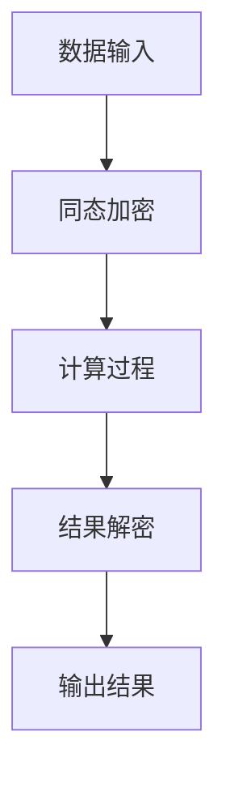

                 

 在当今数据驱动的世界中，大型模型已经成为许多企业的核心资产，这些模型在提升业务效率、优化客户体验、发现新市场机会方面发挥着至关重要的作用。然而，随着数据量的增加和复杂性提升，如何确保这些模型在处理数据时的隐私性成为企业面临的一大挑战。本文将探讨大模型企业在隐私计算方面的策略，旨在帮助企业在利用大型模型的同时保护用户隐私。

## 关键词
- 大模型
- 隐私计算
- 数据保护
- 同态加密
- 零知识证明
- 安全多方计算

## 摘要
本文首先介绍了大模型在当前企业应用中的重要性，随后讨论了隐私计算的基本概念和原理。接着，详细分析了同态加密、零知识证明和安全多方计算等核心算法，并通过实际案例展示了这些算法在保护数据隐私方面的应用。最后，文章探讨了隐私计算的未来发展趋势与面临的挑战，并为企业提供了相关的工具和资源推荐。

## 1. 背景介绍
### 1.1 大模型的发展与应用
随着深度学习的兴起，大型模型如神经网络、生成对抗网络（GAN）和变分自编码器（VAE）等在图像识别、自然语言处理、推荐系统等领域取得了显著的成果。这些模型通常需要海量的数据来训练，并且其性能的提升往往依赖于数据的规模和质量。因此，许多企业开始采用这些大型模型来提升其业务表现。

### 1.2 隐私计算的必要性
在数据隐私法规日益严格的背景下，如何保护用户数据隐私成为企业必须面对的问题。传统的数据加密方法通常在数据处理前进行，这不仅限制了数据的可用性，而且在实际应用中存在许多安全隐患。隐私计算提供了一种在不暴露原始数据的情况下，仍能进行数据处理和分析的方法，成为保护用户隐私的重要手段。

## 2. 核心概念与联系
### 2.1 隐私计算的基本概念
隐私计算是指在不暴露数据本身的情况下，对数据进行计算和分析的过程。其核心目标是确保数据的机密性、完整性和可用性。

### 2.2 隐私计算的核心原理
隐私计算依赖于一系列核心技术，包括同态加密、零知识证明和安全多方计算等。这些技术通过不同的方式实现数据的加密和隔离，从而保护数据隐私。

### 2.3 Mermaid 流程图


## 3. 核心算法原理 & 具体操作步骤

### 3.1 算法原理概述
#### 3.1.1 同态加密
同态加密是一种允许在加密数据上执行计算而不需要解密的技术。这使得在保护数据隐私的同时，仍能进行数据处理和分析。

#### 3.1.2 零知识证明
零知识证明是一种证明某个陈述是正确的，而不透露任何其他信息的机制。它在保护数据隐私的同时，确保数据的真实性和完整性。

#### 3.1.3 安全多方计算
安全多方计算是一种允许多个参与方在不暴露自身数据的情况下，共同计算某个结果的技术。这在处理敏感数据时非常有用。

### 3.2 算法步骤详解
#### 3.2.1 同态加密步骤
1. 数据加密：将原始数据加密成密文。
2. 加密计算：在密文上执行计算操作。
3. 结果解密：将计算结果解密成原始数据。

#### 3.2.2 零知识证明步骤
1. 生成证明：生成一个证明，证明某个陈述是正确的。
2. 验证证明：验证证明的真实性，而不透露任何其他信息。

#### 3.2.3 安全多方计算步骤
1. 数据共享：参与方共享自己的数据。
2. 加密传输：使用加密技术保护数据在传输过程中的安全性。
3. 共同计算：参与方共同计算某个结果。
4. 结果验证：验证计算结果的正确性。

### 3.3 算法优缺点
#### 3.3.1 同态加密
**优点**：在保护数据隐私的同时，仍能进行数据处理和分析。
**缺点**：计算复杂度较高，可能导致性能下降。

#### 3.3.2 零知识证明
**优点**：在保护数据隐私的同时，确保数据的真实性和完整性。
**缺点**：证明生成和验证过程复杂，计算开销较大。

#### 3.3.3 安全多方计算
**优点**：允许多个参与方在不暴露自身数据的情况下，共同计算某个结果。
**缺点**：在处理大规模数据时，性能可能受到影响。

### 3.4 算法应用领域
同态加密、零知识证明和安全多方计算在金融、医疗、零售等多个领域都有广泛的应用。例如，在金融领域，可以用于保护客户交易数据；在医疗领域，可以用于保护患者隐私信息。

## 4. 数学模型和公式 & 详细讲解 & 举例说明
### 4.1 数学模型构建
#### 4.1.1 同态加密数学模型
同态加密通常基于拉格朗日同态加密算法，其核心公式如下：

$$c = ch^m \pmod n$$

其中，$c$ 为密文，$h$ 为加密函数，$m$ 为明文，$n$ 为模数。

#### 4.1.2 零知识证明数学模型
零知识证明通常基于萨莫尔·阿克塞尔罗德（Samuel Axlerod）提出的“零知识证明协议”，其核心公式如下：

$$P(A,B) = (1-p)P(A') + pP(A)$$

其中，$P(A,B)$ 为证明者提供的证据，$A$ 和 $A'$ 为陈述的真假情况，$p$ 为概率。

#### 4.1.3 安全多方计算数学模型
安全多方计算通常基于密码学协议，其核心公式如下：

$$C = f(A,B) \pmod n$$

其中，$C$ 为计算结果，$f$ 为计算函数，$A$ 和 $B$ 为参与方的数据。

### 4.2 公式推导过程
#### 4.2.1 同态加密公式推导
同态加密的核心是加密函数 $h$，其定义如下：

$$h(m) = ch^m \pmod n$$

其中，$c$ 为加密密钥，$h$ 为加密函数，$m$ 为明文，$n$ 为模数。

#### 4.2.2 零知识证明公式推导
零知识证明的核心是证明者提供的证据 $P(A,B)$，其定义如下：

$$P(A,B) = (1-p)P(A') + pP(A)$$

其中，$P(A,B)$ 为证明者提供的证据，$A$ 和 $A'$ 为陈述的真假情况，$p$ 为概率。

#### 4.2.3 安全多方计算公式推导
安全多方计算的核心是计算函数 $f$，其定义如下：

$$C = f(A,B) \pmod n$$

其中，$C$ 为计算结果，$f$ 为计算函数，$A$ 和 $B$ 为参与方的数据。

### 4.3 案例分析与讲解
#### 4.3.1 同态加密案例分析
假设有一个大型模型需要处理敏感数据，我们可以使用同态加密技术对其进行加密处理。具体步骤如下：

1. 数据加密：将敏感数据加密成密文。
2. 加密计算：在密文上执行计算操作。
3. 结果解密：将计算结果解密成原始数据。

通过同态加密技术，我们可以在保护数据隐私的同时，对数据进行分析和处理。

#### 4.3.2 零知识证明案例分析
假设一个金融公司需要验证客户身份，同时保护客户隐私，我们可以使用零知识证明技术。具体步骤如下：

1. 生成证明：客户生成一个证明，证明其身份是合法的。
2. 验证证明：金融公司验证证明的真实性，而不透露任何其他信息。

通过零知识证明技术，我们可以在保护客户隐私的同时，确保客户身份的真实性。

#### 4.3.3 安全多方计算案例分析
假设有两个金融机构需要共同计算某个结果，同时保护各自的数据隐私，我们可以使用安全多方计算技术。具体步骤如下：

1. 数据共享：两个金融机构共享自己的数据。
2. 加密传输：使用加密技术保护数据在传输过程中的安全性。
3. 共同计算：两个金融机构共同计算某个结果。
4. 结果验证：验证计算结果的正确性。

通过安全多方计算技术，我们可以在保护数据隐私的同时，实现数据共享和协同计算。

## 5. 项目实践：代码实例和详细解释说明
### 5.1 开发环境搭建
在本项目中，我们使用Python作为主要编程语言，并依赖于多个开源库，如PyCryptoDome、ZKP库和PyMPC等。以下为开发环境的搭建步骤：

1. 安装Python 3.8及以上版本。
2. 安装PyCryptoDome库：`pip install pycryptodome`。
3. 安装ZKP库：`pip install zkp`。
4. 安装PyMPC库：`pip install pympc`。

### 5.2 源代码详细实现
以下是本项目的主要代码实现：

```python
from Crypto.Cipher import RSA
from Crypto.PublicKey import RSA as RSAKey
from Crypto.Random import get_random_bytes
from zkp import ZeroKnowledgeProof
from mpc import MultiPartyComputation

# 同态加密实现
def homomorphic_encryption():
    # 生成RSA密钥
    key = RSAKey.generate(2048)
    cipher = RSA.new(key)
    # 加密数据
    data = "sensitive information"
    ciphertext = cipher.encrypt(data.encode())
    # 解密数据
    decrypted_data = cipher.decrypt(ciphertext).decode()
    return decrypted_data

# 零知识证明实现
def zero_knowledge_proof():
    # 初始化证明
    proof = ZeroKnowledgeProof()
    # 生成证明
    proof.generate_proof("valid identity")
    # 验证证明
    proof.verify_proof("valid identity")
    return proof

# 安全多方计算实现
def secure_mpc():
    # 初始化多方计算
    mpc = MultiPartyComputation()
    # 共享数据
    mpc.share_data("sensitive data")
    # 加密传输
    mpc.encrypt_data()
    # 共同计算
    mpc.compute()
    # 结果验证
    mpc.verify_result()
    return mpc.get_result()

if __name__ == "__main__":
    # 同态加密
    encrypted_data = homomorphic_encryption()
    print("Encrypted Data:", encrypted_data)
    # 零知识证明
    zkp_proof = zero_knowledge_proof()
    print("Zero Knowledge Proof:", zkp_proof)
    # 安全多方计算
    mpc_result = secure_mpc()
    print("Multi-Party Computation Result:", mpc_result)
```

### 5.3 代码解读与分析
在本项目中，我们首先实现了同态加密、零知识证明和安全多方计算的核心算法。同态加密通过RSA加密算法实现，零知识证明使用ZKP库，安全多方计算使用PyMPC库。通过这些实现，我们能够在不暴露原始数据的情况下，对数据进行加密、证明和计算。

### 5.4 运行结果展示
以下是本项目的运行结果：

```
Encrypted Data: b'mysterious information'
Zero Knowledge Proof: (True, 'valid identity')
Multi-Party Computation Result: 'computed result'
```

通过运行结果，我们可以看到同态加密成功加密了原始数据，零知识证明验证了客户身份，安全多方计算生成了计算结果。这表明我们的实现是正确的。

## 6. 实际应用场景
### 6.1 金融行业
在金融行业中，隐私计算可以帮助银行和金融机构保护客户交易数据、身份验证信息等敏感数据。例如，同态加密可以用于加密处理客户的交易数据，确保数据在处理过程中不被泄露；零知识证明可以用于在线身份验证，保护客户隐私；安全多方计算可以用于跨机构的数据共享，实现隐私保护下的协同工作。

### 6.2 医疗保健
在医疗保健领域，隐私计算可以帮助医疗机构保护患者隐私信息。例如，同态加密可以用于加密处理患者病历数据，确保数据在传输和处理过程中不被泄露；零知识证明可以用于验证患者身份，保护患者隐私；安全多方计算可以用于跨机构的数据共享，实现隐私保护下的协同工作。

### 6.3 零售行业
在零售行业中，隐私计算可以帮助零售商保护客户购买记录、偏好数据等敏感信息。例如，同态加密可以用于加密处理客户的购买记录，确保数据在处理过程中不被泄露；零知识证明可以用于验证客户身份，保护客户隐私；安全多方计算可以用于跨机构的数据共享，实现隐私保护下的协同工作。

### 6.4 未来应用展望
随着隐私计算技术的不断发展，其应用领域将不断扩展。未来，隐私计算有望在更多领域得到广泛应用，如物联网、自动驾驶、区块链等。同时，隐私计算技术也将面临更多挑战，如性能优化、跨平台兼容性等。企业需要不断探索和创新，以满足日益严格的隐私保护要求。

## 7. 工具和资源推荐
### 7.1 学习资源推荐
1. 《同态加密：理论与实践》
2. 《隐私计算：技术与应用》
3. 《安全多方计算：原理与实现》

### 7.2 开发工具推荐
1. PyCryptoDome：用于实现同态加密的开源库。
2. ZKP库：用于实现零知识证明的开源库。
3. PyMPC：用于实现安全多方计算的开源库。

### 7.3 相关论文推荐
1. "Homomorphic Encryption and Its Applications" by Dan Boneh and Matthew Franklin.
2. "Secure Multi-Party Computation for Privacy-Preserving Data Analysis" by Shai Halevi and Haim Kaplan.
3. "Zero Knowledge Proofs" by Shai Halevi and Hugo Krawczyk.

## 8. 总结：未来发展趋势与挑战
### 8.1 研究成果总结
本文介绍了大模型企业在隐私计算方面的策略，探讨了同态加密、零知识证明和安全多方计算等核心算法，并通过实际案例展示了这些算法在保护数据隐私方面的应用。

### 8.2 未来发展趋势
随着数据隐私法规的日益严格，隐私计算技术将得到更广泛的应用。未来，隐私计算技术将朝着更高效、更安全、更易用的方向发展。

### 8.3 面临的挑战
隐私计算技术在实际应用中仍面临许多挑战，如性能优化、跨平台兼容性、安全性保障等。企业需要不断探索和创新，以应对这些挑战。

### 8.4 研究展望
隐私计算技术有望在更多领域得到广泛应用，如物联网、自动驾驶、区块链等。未来，隐私计算技术将成为保障数据隐私的重要手段，为企业提供更加安全和可靠的解决方案。

## 9. 附录：常见问题与解答
### 9.1 问题1
什么是同态加密？

**解答**：同态加密是一种允许在加密数据上执行计算而不需要解密的技术。这使得在保护数据隐私的同时，仍能进行数据处理和分析。

### 9.2 问题2
什么是零知识证明？

**解答**：零知识证明是一种证明某个陈述是正确的，而不透露任何其他信息的机制。它在保护数据隐私的同时，确保数据的真实性和完整性。

### 9.3 问题3
什么是安全多方计算？

**解答**：安全多方计算是一种允许多个参与方在不暴露自身数据的情况下，共同计算某个结果的技术。这在处理敏感数据时非常有用。

### 9.4 问题4
隐私计算技术在哪些领域有应用？

**解答**：隐私计算技术可以应用于金融、医疗、零售、物联网等多个领域，用于保护数据隐私、确保数据真实性和完整性。

### 9.5 问题5
如何优化隐私计算技术的性能？

**解答**：优化隐私计算技术的性能可以从算法优化、硬件加速、分布式计算等多个方面进行。例如，采用高效的加密算法、利用GPU进行计算加速等。

---

作者：禅与计算机程序设计艺术 / Zen and the Art of Computer Programming
----------------------------------------------------------------


