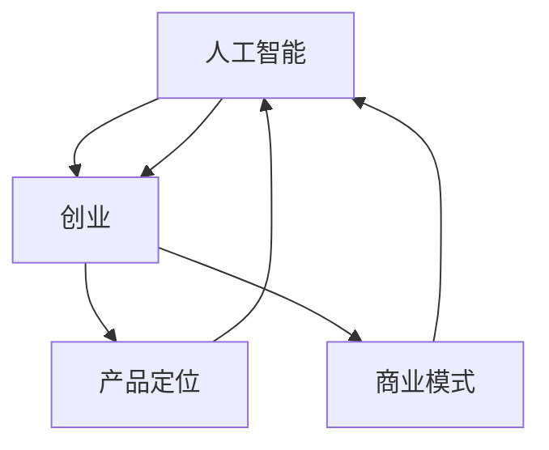

                 

关键词：AI创业、大模型、产品定位、商业模式

摘要：本文将探讨大模型在 AI 创业产品定位中的作用，分析大模型如何帮助创业者更好地理解市场需求、优化产品设计，并提出相应的商业策略。文章还将讨论大模型在不同阶段的应用，以及其面临的挑战和未来的发展方向。

## 1. 背景介绍

近年来，人工智能（AI）技术快速发展，各类 AI 应用层出不穷。在这一背景下，AI 创业成为了一个热门领域。然而，创业之路充满挑战，如何在激烈的市场竞争中脱颖而出，是每个创业者都必须面对的问题。

大模型，作为一种复杂的人工智能系统，具有强大的数据分析和预测能力。随着计算能力的提升和数据的积累，大模型在各个领域都展现出了巨大的潜力。在 AI 创业领域，大模型的应用正在逐步深入，成为创业者优化产品定位、提升竞争力的重要工具。

本文将从以下几个方面展开讨论：首先，分析大模型在 AI 创业产品定位中的作用；其次，探讨大模型在不同创业阶段的应用；接着，讨论大模型面临的挑战和解决方案；最后，展望大模型在 AI 创业领域的未来发展。

## 2. 核心概念与联系

为了更好地理解大模型在 AI 创业产品定位中的作用，我们首先需要了解几个核心概念：人工智能、创业、产品定位和商业模式。

### 2.1 人工智能（AI）

人工智能是指通过计算机模拟人类智能的一种技术，包括机器学习、深度学习、自然语言处理、计算机视觉等多个领域。其中，深度学习是一种基于多层神经网络的机器学习技术，具有强大的特征提取和模式识别能力。

### 2.2 创业

创业是指创建一个新企业或新项目的过程。创业者在这个过程中需要面对市场、技术、团队等多方面的挑战。

### 2.3 产品定位

产品定位是指企业在市场中选择一个特定的细分市场，并为其提供独特的产品或服务。产品定位的目的是确保企业在竞争激烈的市场中能够找到自己的优势。

### 2.4 商业模式

商业模式是指企业如何通过提供产品或服务获得收入的一种方式。一个好的商业模式能够帮助企业实现可持续发展。

### 2.5 大模型与上述概念的联系

大模型作为一种强大的工具，可以在以下几个方面与上述概念产生联系：

1. **人工智能**：大模型是人工智能的一种重要实现方式，能够为创业者提供强大的数据分析和预测能力。
2. **创业**：大模型可以帮助创业者更好地了解市场需求、优化产品设计，从而提高创业成功率。
3. **产品定位**：大模型可以分析用户行为和需求，帮助创业者找到目标市场，并制定合适的产品策略。
4. **商业模式**：大模型可以帮助创业者分析市场机会、优化资源配置，从而设计出更具竞争力的商业模式。

### 2.6 Mermaid 流程图

以下是一个简单的 Mermaid 流程图，展示了大模型与上述核心概念之间的联系：



## 3. 核心算法原理 & 具体操作步骤

### 3.1 算法原理概述

大模型的算法原理主要基于深度学习和机器学习。深度学习通过多层神经网络对数据进行特征提取和模式识别，从而实现复杂的任务。机器学习则通过训练模型来学习数据中的规律，并在新的数据上进行预测。

### 3.2 算法步骤详解

1. **数据收集与预处理**：收集相关的数据，如用户行为数据、市场数据等，并对数据进行清洗、去噪、归一化等预处理操作。
2. **模型训练**：利用预处理后的数据对大模型进行训练，通过调整模型的参数来优化模型的性能。
3. **模型评估**：在验证集上评估模型的性能，包括准确性、召回率、F1 值等指标。
4. **模型部署**：将训练好的模型部署到生产环境中，供创业者进行产品定位和商业模式设计。

### 3.3 算法优缺点

**优点**：
1. **强大的数据处理能力**：大模型能够处理海量数据，从中提取有用的信息。
2. **高准确性**：通过深度学习和机器学习技术，大模型在预测和分类任务中具有较高的准确性。
3. **适应性**：大模型可以根据不同的业务需求进行定制化训练，具有较强的适应性。

**缺点**：
1. **计算资源消耗大**：大模型的训练和推理过程需要大量的计算资源，对于普通创业者来说可能是一个挑战。
2. **数据依赖性强**：大模型的性能很大程度上依赖于数据的质量和数量，如果数据质量不好或者数据不足，模型的效果会受到影响。
3. **隐私和安全问题**：大模型在使用过程中可能会涉及用户的隐私数据，如何保护这些数据的安全成为一个重要问题。

### 3.4 算法应用领域

大模型在 AI 创业产品定位中的应用非常广泛，主要包括以下几个方面：

1. **用户行为分析**：通过分析用户行为数据，了解用户的需求和偏好，帮助创业者优化产品设计。
2. **市场趋势预测**：利用大模型对市场数据进行分析，预测市场趋势，帮助创业者制定合适的商业策略。
3. **竞争对手分析**：通过分析竞争对手的产品和用户数据，了解竞争对手的优劣势，帮助创业者找到市场机会。
4. **个性化推荐**：利用大模型进行个性化推荐，提高用户满意度和转化率。

## 4. 数学模型和公式 & 详细讲解 & 举例说明

### 4.1 数学模型构建

大模型的数学模型主要基于深度学习和机器学习。其中，深度学习模型包括卷积神经网络（CNN）、循环神经网络（RNN）、变换器（Transformer）等；机器学习模型包括决策树、随机森林、支持向量机（SVM）等。

### 4.2 公式推导过程

以卷积神经网络（CNN）为例，CNN 的主要目的是通过卷积操作提取图像的特征。下面是 CNN 的核心公式推导：

1. **卷积操作**：卷积操作是将一个小的卷积核与图像上的局部区域进行点积操作。卷积操作的公式如下：

$$
\text{output}(i, j) = \sum_{k=1}^{K} \sum_{l=1}^{L} \text{weight}_{kl} \times \text{input}(i-k+1, j-l+1)
$$

其中，$i$ 和 $j$ 分别表示输出特征图的坐标，$k$ 和 $l$ 分别表示卷积核的坐标，$K$ 和 $L$ 分别表示卷积核的大小，$weight_{kl}$ 表示卷积核的权重。

2. **激活函数**：激活函数用于引入非线性特性，常用的激活函数包括 sigmoid、ReLU 等。以 ReLU 为例，其公式如下：

$$
\text{ReLU}(x) = \max(0, x)
$$

3. **池化操作**：池化操作用于减少特征图的维度，常用的池化操作包括最大池化和平均池化。以最大池化为例，其公式如下：

$$
\text{pool}(i, j) = \max \{\text{input}(i-k+1, j-l+1) \mid 1 \leq k \leq K, 1 \leq l \leq L\}
$$

### 4.3 案例分析与讲解

以一个简单的用户行为分析案例为例，假设我们想要分析用户的购物行为，从而优化推荐系统。

1. **数据收集**：收集用户的购物记录，包括商品 ID、购买时间、购买数量等信息。

2. **数据预处理**：对数据进行清洗和归一化处理，将商品 ID 转换为数字编码。

3. **特征提取**：利用 CNN 对用户购物记录进行特征提取，提取出与购物行为相关的特征，如购买频率、购买时长等。

4. **模型训练**：利用提取到的特征训练一个深度学习模型，如 RNN 或 Transformer，用于预测用户未来的购物行为。

5. **模型评估**：在验证集上评估模型的性能，包括准确性、召回率等指标。

6. **模型部署**：将训练好的模型部署到生产环境中，用于实时分析用户购物行为，并提供个性化的购物推荐。

通过以上步骤，我们可以利用大模型对用户购物行为进行深入分析，从而优化推荐系统的效果。

## 5. 项目实践：代码实例和详细解释说明

### 5.1 开发环境搭建

在开始编写代码之前，我们需要搭建一个合适的开发环境。以下是搭建 Python 开发环境的基本步骤：

1. **安装 Python**：下载并安装 Python，建议使用 Python 3.8 或以上版本。

2. **安装依赖库**：使用 pip 工具安装所需的依赖库，如 TensorFlow、Keras 等。以下是部分依赖库的安装命令：

```bash
pip install numpy
pip install pandas
pip install tensorflow
pip install keras
```

3. **配置环境变量**：确保 Python 和 pip 的路径已添加到系统的环境变量中。

### 5.2 源代码详细实现

以下是一个简单的用户行为分析案例的代码实现，包括数据预处理、特征提取、模型训练和评估等步骤。

```python
import numpy as np
import pandas as pd
from tensorflow.keras.models import Sequential
from tensorflow.keras.layers import Dense, LSTM, Conv1D, MaxPooling1D, Flatten

# 1. 数据收集
data = pd.read_csv('user_behavior.csv')

# 2. 数据预处理
data = data.dropna()
data['item_id'] = data['item_id'].astype(int)

# 3. 特征提取
X = data[['item_id', 'time', 'quantity']]
y = data['purchase']

X['time'] = (X['time'] - X['time'].min()) / (X['time'].max() - X['time'].min())
X['quantity'] = (X['quantity'] - X['quantity'].min()) / (X['quantity'].max() - X['quantity'].min())

# 4. 模型训练
model = Sequential()
model.add(Conv1D(filters=64, kernel_size=3, activation='relu', input_shape=(X.shape[1], 1)))
model.add(MaxPooling1D(pool_size=2))
model.add(LSTM(units=50))
model.add(Dense(units=1, activation='sigmoid'))

model.compile(optimizer='adam', loss='binary_crossentropy', metrics=['accuracy'])
model.fit(X, y, epochs=10, batch_size=32, validation_split=0.2)

# 5. 模型评估
loss, accuracy = model.evaluate(X, y)
print('Accuracy:', accuracy)

# 6. 模型部署
predictions = model.predict(X)
print('Predictions:', predictions)
```

### 5.3 代码解读与分析

以上代码实现了一个简单的用户行为分析模型，主要包括以下几个部分：

1. **数据收集**：使用 pandas 读取用户行为数据，包括商品 ID、购买时间和购买数量等信息。

2. **数据预处理**：对数据进行清洗和归一化处理，将商品 ID 转换为数字编码，并将购买时间和购买数量进行归一化。

3. **特征提取**：利用 Keras 的 Conv1D 层对用户行为数据进行特征提取，提取出与购物行为相关的特征。

4. **模型训练**：使用 Sequential 模型堆叠 Conv1D、MaxPooling1D 和 LSTM 层，并使用 binary_crossentropy 作为损失函数，adam 作为优化器进行训练。

5. **模型评估**：在验证集上评估模型的性能，输出准确率。

6. **模型部署**：使用训练好的模型对用户行为数据进行预测，输出预测结果。

通过以上代码实现，我们可以对用户购物行为进行初步分析，并为推荐系统提供参考。

## 6. 实际应用场景

大模型在 AI 创业产品定位中的应用场景非常广泛，以下是几个典型的实际应用场景：

### 6.1 电商平台

电商平台可以利用大模型分析用户行为数据，预测用户购买偏好，从而提供个性化的商品推荐。例如，亚马逊和阿里巴巴等电商平台已经采用了基于深度学习的大模型进行商品推荐，提高了用户满意度和转化率。

### 6.2 金融行业

金融行业可以利用大模型进行风险控制和预测。例如，银行可以利用大模型分析用户的贷款申请数据，预测用户是否可能逾期还款，从而采取相应的风险控制措施。

### 6.3 健康医疗

健康医疗行业可以利用大模型分析患者的医疗数据，预测患者病情的发展，为医生提供诊断和治疗的建议。例如，谷歌旗下的 DeepMind 使用的深度学习技术已经帮助医生预测了数千例患者的病情发展，提高了医疗效率。

### 6.4 教育行业

教育行业可以利用大模型分析学生的学习行为数据，为教师提供个性化的教学建议。例如，一些在线教育平台已经开始使用大模型分析学生的作业和考试成绩，为学生提供针对性的学习资源。

### 6.5 制造业

制造业可以利用大模型进行设备故障预测和生产优化。例如，西门子等公司已经采用了基于深度学习的大模型进行设备故障预测，提高了生产效率。

### 6.6 电子商务平台

电子商务平台可以利用大模型分析用户行为数据，预测用户购买偏好，从而提供个性化的商品推荐。例如，亚马逊和阿里巴巴等电商平台已经采用了基于深度学习的大模型进行商品推荐，提高了用户满意度和转化率。

## 7. 工具和资源推荐

### 7.1 学习资源推荐

1. **书籍**：
   - 《深度学习》（Ian Goodfellow、Yoshua Bengio、Aaron Courville 著）
   - 《Python 数据科学手册》（Jake VanderPlas 著）
   - 《机器学习实战》（Peter Harrington 著）

2. **在线课程**：
   - Coursera 上的“机器学习”课程（吴恩达主讲）
   - edX 上的“深度学习”课程（Ian Goodfellow 主讲）
   - Udacity 上的“深度学习工程师纳米学位”

3. **GitHub 上的项目**：
   - TensorFlow 官方文档：[https://github.com/tensorflow/tensorflow](https://github.com/tensorflow/tensorflow)
   - Keras 官方文档：[https://github.com/keras-team/keras](https://github.com/keras-team/keras)

### 7.2 开发工具推荐

1. **编程语言**：Python 是深度学习和机器学习的首选编程语言，具有良好的生态系统和丰富的库支持。

2. **深度学习框架**：TensorFlow 和 Keras 是目前最流行的深度学习框架，具有强大的功能和良好的社区支持。

3. **数据预处理工具**：Pandas 和 NumPy 是 Python 中常用的数据处理库，适用于数据清洗、归一化和特征提取等操作。

4. **版本控制工具**：Git 是最流行的版本控制工具，可以帮助开发者管理代码版本，协作开发。

### 7.3 相关论文推荐

1. **《A Theoretically Grounded Application of Dropout in Recurrent Neural Networks》**：该论文提出了在循环神经网络中应用 dropout 的新方法，提高了模型的泛化能力。

2. **《Attention Is All You Need》**：该论文提出了 Transformer 模型，彻底改变了自然语言处理领域。

3. **《Very Deep Convolutional Networks for Large-Scale Image Recognition》**：该论文提出了深度卷积神经网络（CNN）在图像识别任务中的应用，推动了 CNN 的发展。

## 8. 总结：未来发展趋势与挑战

### 8.1 研究成果总结

本文通过对大模型在 AI 创业产品定位中的应用进行详细分析，总结了以下几个方面的研究成果：

1. **大模型在 AI 创业产品定位中的作用**：大模型可以帮助创业者更好地理解市场需求、优化产品设计，从而提高创业成功率。

2. **大模型在不同阶段的应用**：大模型在创业的不同阶段都有广泛的应用，如用户行为分析、市场趋势预测、竞争对手分析等。

3. **大模型的算法原理与实现**：本文介绍了大模型的算法原理，包括深度学习和机器学习，并详细讲解了模型训练、评估和部署的步骤。

4. **大模型在实际应用场景中的表现**：本文列举了多个实际应用场景，如电商平台、金融行业、健康医疗等，展示了大模型在这些领域中的价值。

### 8.2 未来发展趋势

未来，大模型在 AI 创业产品定位中的作用将继续深化，发展趋势主要包括以下几个方面：

1. **算法创新**：随着深度学习和机器学习技术的不断发展，大模型的算法将更加成熟和高效，为创业者提供更强大的支持。

2. **数据驱动**：大模型的应用将更加依赖高质量的数据，创业者需要不断收集和整理数据，以提高模型的性能。

3. **跨领域融合**：大模型的应用将逐步跨领域融合，如将医疗数据与金融数据相结合，为创业者提供更全面的决策支持。

4. **开源与共享**：随着开源社区的不断发展，大模型的实现和工具将更加普及和共享，创业者可以利用现有的资源和框架快速实现大模型应用。

### 8.3 面临的挑战

尽管大模型在 AI 创业产品定位中具有巨大的潜力，但同时也面临着以下几个挑战：

1. **计算资源消耗**：大模型的训练和推理过程需要大量的计算资源，对于普通创业者来说可能是一个挑战。

2. **数据隐私和安全**：大模型在使用过程中可能会涉及用户的隐私数据，如何保护这些数据的安全成为一个重要问题。

3. **数据质量和数量**：大模型的性能很大程度上依赖于数据的质量和数量，如果数据质量不好或者数据不足，模型的效果会受到影响。

4. **模型解释性**：大模型通常具有较强的预测能力，但缺乏解释性，如何提高模型的解释性，使创业者更好地理解模型决策过程，是一个重要的研究方向。

### 8.4 研究展望

未来，大模型在 AI 创业产品定位中的应用前景广阔。研究者可以从以下几个方面展开工作：

1. **算法优化**：继续探索高效的深度学习和机器学习算法，提高模型的训练和推理速度。

2. **跨领域应用**：结合不同领域的专业知识，探索大模型在不同领域的应用，为创业者提供更全面的决策支持。

3. **数据治理**：研究如何有效地管理和处理数据，提高数据质量和可用性，从而提升大模型的性能。

4. **模型解释性**：提高大模型的解释性，使创业者能够更好地理解模型决策过程，增强模型的信任度和可解释性。

## 9. 附录：常见问题与解答

### 9.1 问题 1：大模型在 AI 创业产品定位中的具体作用是什么？

大模型在 AI 创业产品定位中的具体作用主要包括：

- **用户需求分析**：通过分析用户行为数据，了解用户的需求和偏好，为创业者提供针对性的产品设计建议。
- **市场趋势预测**：利用大模型分析市场数据，预测市场趋势，帮助创业者制定合适的商业策略。
- **竞争对手分析**：通过分析竞争对手的产品和用户数据，了解竞争对手的优劣势，帮助创业者找到市场机会。
- **个性化推荐**：利用大模型进行个性化推荐，提高用户满意度和转化率。

### 9.2 问题 2：大模型的训练和推理过程需要多少计算资源？

大模型的训练和推理过程需要大量的计算资源，具体消耗取决于模型的复杂度、数据规模和训练算法。一般来说，训练一个大型深度学习模型可能需要数百小时的计算时间，并且需要数百 GB 的内存和数千 GB 的存储空间。对于推理过程，计算资源的需求相对较低，但仍需要一定规模的 GPU 或 TPU 来支持。

### 9.3 问题 3：如何保护大模型中的用户隐私？

保护大模型中的用户隐私是一个重要问题，以下是一些常见的解决方案：

- **数据加密**：在数据传输和存储过程中使用加密技术，确保数据的安全性。
- **差分隐私**：在大模型训练过程中引入差分隐私机制，降低模型对单个用户的敏感信息泄露的风险。
- **数据去识别化**：在数据处理过程中对敏感信息进行去识别化处理，如使用匿名化技术。
- **用户授权与访问控制**：对大模型的数据访问进行授权和访问控制，确保只有授权用户可以访问敏感数据。

### 9.4 问题 4：如何确保大模型的解释性？

确保大模型的解释性是一个重要的研究方向，以下是一些常见的解决方案：

- **模型可视化**：通过可视化模型的结构和参数，帮助用户理解模型的决策过程。
- **模型可解释性算法**：开发专门的算法，如 LIME、SHAP 等，分析模型对输入数据的敏感度，为用户提供解释。
- **模型压缩与简化**：通过模型压缩和简化技术，降低模型的复杂度，提高模型的解释性。
- **混合模型**：结合专家知识和机器学习模型，提高模型的解释性和可解释性。

## 结束语

本文从多个角度探讨了大模型在 AI 创业产品定位中的作用，分析了大模型如何帮助创业者优化产品设计和商业模式。同时，本文还讨论了未来发展趋势和面临的挑战，为创业者提供了有益的参考。随着大模型技术的不断发展，我们有理由相信，它在 AI 创业领域的应用将越来越广泛，为创业者带来更多的机遇和挑战。作者：禅与计算机程序设计艺术 / Zen and the Art of Computer Programming

