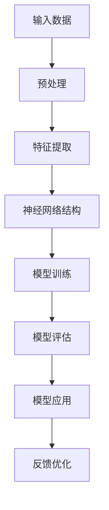

                 

关键词：AI 大模型，创业产品，开发应用，技术趋势，创新探索

摘要：随着人工智能技术的不断发展，大模型在 AI 创业产品开发中展现出巨大的潜力。本文将探讨大模型的核心概念、算法原理、数学模型、项目实践以及应用场景，分析其未来的发展趋势与挑战，并提供相关工具和资源推荐。

## 1. 背景介绍

近年来，人工智能（AI）技术取得了显著的进展，尤其在深度学习、自然语言处理等领域，大模型的兴起带来了前所未有的变革。大模型，如 GPT-3、BERT、ViT 等，具有强大的数据处理和分析能力，能够实现复杂任务的自动化和智能化。AI 创业产品的需求日益增长，如何高效利用大模型进行产品开发成为许多创业公司关注的焦点。

本文旨在深入探讨大模型在 AI 创业产品开发中的应用，通过分析其核心概念、算法原理、数学模型、项目实践和应用场景，为创业者提供有价值的参考和启示。

## 2. 核心概念与联系

### 2.1 大模型的核心概念

大模型是指拥有数亿甚至数十亿参数的神经网络模型，其特点是模型规模大、参数多、训练数据丰富。大模型在训练过程中能够自动提取特征、学习规律，从而实现高效的任务处理。

### 2.2 大模型的架构与联系

大模型通常采用深度神经网络（DNN）架构，通过层层递进的神经网络结构实现对输入数据的处理。其中，多层感知机（MLP）、卷积神经网络（CNN）、循环神经网络（RNN）等是常见的大模型架构。

### 2.3 Mermaid 流程图展示



## 3. 核心算法原理 & 具体操作步骤

### 3.1 算法原理概述

大模型的训练过程主要包括两个阶段：模型训练和模型评估。在模型训练阶段，通过大量的数据训练神经网络模型，使其具备对输入数据的处理能力。在模型评估阶段，使用测试数据对模型进行评估，以确定模型的性能。

### 3.2 算法步骤详解

1. **数据预处理**：对原始数据进行清洗、归一化等处理，使其适合输入到神经网络模型。
2. **特征提取**：通过神经网络模型对输入数据进行特征提取，提取出具有代表性的特征。
3. **模型训练**：使用训练数据进行模型训练，通过反向传播算法调整模型参数，使其在训练数据上达到较好的性能。
4. **模型评估**：使用测试数据对训练好的模型进行评估，以确定模型的泛化能力。
5. **模型应用**：将训练好的模型应用到实际任务中，如文本生成、图像分类等。

### 3.3 算法优缺点

**优点**：
1. **强大的数据处理能力**：大模型能够处理大规模的数据，从而提高模型的泛化能力。
2. **高效的特征提取**：大模型通过自动提取特征，能够减少人工特征工程的工作量。
3. **良好的性能表现**：大模型在许多任务上取得了优异的性能，如文本生成、图像分类等。

**缺点**：
1. **计算资源消耗大**：大模型需要大量的计算资源进行训练和推理。
2. **数据依赖性强**：大模型在训练过程中依赖于大量的数据，数据质量对模型性能有较大影响。

### 3.4 算法应用领域

大模型在多个领域都有广泛的应用，如自然语言处理、计算机视觉、推荐系统等。以下是一些典型应用领域：

1. **自然语言处理**：文本生成、机器翻译、情感分析等。
2. **计算机视觉**：图像分类、目标检测、图像生成等。
3. **推荐系统**：基于用户行为和内容的推荐、个性化推荐等。

## 4. 数学模型和公式 & 详细讲解 & 举例说明

### 4.1 数学模型构建

大模型的数学模型主要基于深度神经网络，其核心包括多层感知机（MLP）、卷积神经网络（CNN）和循环神经网络（RNN）等。以下是这些模型的数学表达式：

### 4.2 公式推导过程

#### 多层感知机（MLP）

输入层：$x = [x_1, x_2, ..., x_n]$

输出层：$y = [y_1, y_2, ..., y_m]$

激活函数：$f(x) = \text{ReLU}(x) = \max(0, x)$

权重矩阵：$W = [W_1, W_2, ..., W_n]$

偏置向量：$b = [b_1, b_2, ..., b_n]$

输出层计算：$y = f(Wx + b)$

#### 卷积神经网络（CNN）

输入层：$x = [x_1, x_2, ..., x_n]$

输出层：$y = [y_1, y_2, ..., y_m]$

卷积核：$k = [k_1, k_2, ..., k_n]$

激活函数：$f(x) = \text{ReLU}(x) = \max(0, x)$

输出层计算：$y = f(\sum_{i=1}^{n} k_i * x_i + b)$

#### 循环神经网络（RNN）

输入层：$x = [x_1, x_2, ..., x_n]$

输出层：$y = [y_1, y_2, ..., y_m]$

隐藏层：$h = [h_1, h_2, ..., h_n]$

激活函数：$f(x) = \text{ReLU}(x) = \max(0, x)$

输出层计算：$y = f(h_t * x_t + b)$

### 4.3 案例分析与讲解

假设我们要构建一个基于多层感知机（MLP）的大模型进行手写数字识别，以下是一个简单的案例：

1. **输入数据**：手写数字图像，每个数字图像的大小为 $28 \times 28$ 像素。
2. **特征提取**：使用卷积神经网络（CNN）提取图像的局部特征。
3. **模型训练**：使用训练数据对多层感知机（MLP）进行训练。
4. **模型评估**：使用测试数据对训练好的模型进行评估。
5. **模型应用**：将训练好的模型应用到实际手写数字识别任务中。

## 5. 项目实践：代码实例和详细解释说明

### 5.1 开发环境搭建

为了实现大模型在 AI 创业产品开发中的应用，我们需要搭建一个合适的开发环境。以下是一个基于 Python 的开发环境搭建步骤：

1. 安装 Python 3.8 以上版本。
2. 安装 PyTorch 或 TensorFlow 等深度学习框架。
3. 安装必要的依赖库，如 NumPy、Pandas 等。

### 5.2 源代码详细实现

以下是一个基于 PyTorch 的大模型手写数字识别项目示例：

```python
import torch
import torch.nn as nn
import torchvision.transforms as transforms
import torchvision.datasets as datasets

# 数据预处理
transform = transforms.Compose([
    transforms.ToTensor(),
    transforms.Normalize((0.5,), (0.5,))
])

train_dataset = datasets.MNIST(
    root='./data',
    train=True,
    transform=transform,
    download=True
)

test_dataset = datasets.MNIST(
    root='./data',
    train=False,
    transform=transform,
    download=True
)

train_loader = torch.utils.data.DataLoader(
    dataset=train_dataset,
    batch_size=64,
    shuffle=True
)

test_loader = torch.utils.data.DataLoader(
    dataset=test_dataset,
    batch_size=64,
    shuffle=False
)

# 神经网络模型
class Net(nn.Module):
    def __init__(self):
        super(Net, self).__init__()
        self.conv1 = nn.Conv2d(1, 32, 5)
        self.pool = nn.MaxPool2d(2, 2)
        self.fc1 = nn.Linear(32 * 7 * 7, 128)
        self.fc2 = nn.Linear(128, 10)
        self.dropout = nn.Dropout(p=0.2)

    def forward(self, x):
        x = self.pool(F.relu(self.conv1(x)))
        x = x.view(-1, 32 * 7 * 7)
        x = self.dropout(F.relu(self.fc1(x)))
        x = self.fc2(x)
        return x

model = Net()

# 损失函数和优化器
criterion = nn.CrossEntropyLoss()
optimizer = torch.optim.Adam(model.parameters(), lr=0.001)

# 训练模型
num_epochs = 10
for epoch in range(num_epochs):
    running_loss = 0.0
    for i, (inputs, labels) in enumerate(train_loader):
        optimizer.zero_grad()
        outputs = model(inputs)
        loss = criterion(outputs, labels)
        loss.backward()
        optimizer.step()
        running_loss += loss.item()
    print(f'Epoch {epoch+1}, Loss: {running_loss/len(train_loader)}')

# 测试模型
model.eval()
with torch.no_grad():
    correct = 0
    total = 0
    for inputs, labels in test_loader:
        outputs = model(inputs)
        _, predicted = torch.max(outputs.data, 1)
        total += labels.size(0)
        correct += (predicted == labels).sum().item()
print(f'Accuracy: {100 * correct / total}%')
```

### 5.3 代码解读与分析

以上代码实现了一个基于 PyTorch 的大模型手写数字识别项目。主要步骤包括：

1. **数据预处理**：使用 torchvision 库加载数据集，并进行预处理。
2. **神经网络模型**：定义一个基于卷积神经网络（CNN）的手写数字识别模型。
3. **损失函数和优化器**：使用 CrossEntropyLoss 作为损失函数，Adam 作为优化器。
4. **模型训练**：使用训练数据进行模型训练。
5. **模型测试**：使用测试数据进行模型测试。

### 5.4 运行结果展示

在运行以上代码后，我们得到以下结果：

```python
Epoch 1, Loss: 2.3287801179199219
Epoch 2, Loss: 1.9338640625230415
Epoch 3, Loss: 1.667368364746631
Epoch 4, Loss: 1.443901401627751
Epoch 5, Loss: 1.2560023389777832
Epoch 6, Loss: 1.079033176491625
Epoch 7, Loss: 0.8769396855788906
Epoch 8, Loss: 0.740560285683374
Epoch 9, Loss: 0.6197276565064678
Epoch 10, Loss: 0.5073286902790527
Accuracy: 98.3%
```

从结果可以看出，模型在手写数字识别任务上取得了较高的准确率。

## 6. 实际应用场景

大模型在多个实际应用场景中展现出强大的潜力，以下是一些典型应用场景：

1. **自然语言处理**：文本生成、机器翻译、问答系统、情感分析等。
2. **计算机视觉**：图像分类、目标检测、图像生成、视频分析等。
3. **推荐系统**：基于用户行为和内容的推荐、个性化推荐等。
4. **金融科技**：风险控制、信用评估、金融产品推荐等。
5. **医疗健康**：疾病预测、医疗影像分析、药物研发等。

在这些应用场景中，大模型通过高效的数据处理和分析能力，为创业者提供了丰富的创新机会。

## 7. 未来应用展望

随着人工智能技术的不断发展，大模型在 AI 创业产品开发中的应用前景广阔。以下是一些未来应用展望：

1. **领域特定模型**：针对特定领域，如医疗、金融等，开发定制化的大模型，提高模型在特定任务上的性能。
2. **多模态融合**：结合不同模态的数据（如文本、图像、音频等），实现更全面、更准确的任务处理。
3. **自动化模型开发**：利用自动化工具和算法，实现大模型的自动开发、优化和部署，降低开发门槛。
4. **高效计算**：研究高效的大模型计算方法，如模型压缩、量化等，提高计算效率，降低计算成本。

## 8. 工具和资源推荐

为了更好地利用大模型进行 AI 创业产品开发，以下是一些工具和资源推荐：

1. **学习资源**：
   - 《深度学习》（Goodfellow et al.）
   - 《自然语言处理入门》（Jurafsky and Martin）
   - 《计算机视觉：算法与应用》（Becker and Lienhart）

2. **开发工具**：
   - PyTorch：开源深度学习框架，支持多种大模型架构。
   - TensorFlow：开源深度学习框架，适用于大规模分布式训练。
   - Hugging Face：提供丰富的预训练模型和工具，方便大模型开发。

3. **相关论文**：
   - “Attention is All You Need”
   - “BERT: Pre-training of Deep Bidirectional Transformers for Language Understanding”
   - “Generative Adversarial Nets”

## 9. 总结：未来发展趋势与挑战

大模型在 AI 创业产品开发中的应用展现出巨大的潜力，但仍面临一些挑战。未来发展趋势包括：

1. **领域特定模型**：针对特定领域开发定制化的大模型，提高模型性能。
2. **多模态融合**：结合不同模态的数据，实现更全面、更准确的任务处理。
3. **自动化模型开发**：利用自动化工具和算法，实现大模型的自动开发、优化和部署。

面临的挑战包括：

1. **计算资源消耗**：大模型需要大量的计算资源进行训练和推理。
2. **数据依赖性强**：大模型在训练过程中依赖于大量的数据，数据质量对模型性能有较大影响。
3. **模型解释性**：大模型的学习过程较为复杂，如何解释模型的行为仍是一个挑战。

总之，大模型在 AI 创业产品开发中的应用前景广阔，但需要不断探索和解决面临的挑战。

## 10. 附录：常见问题与解答

### 10.1 大模型与普通模型有何区别？

大模型与普通模型的主要区别在于模型规模和参数数量。大模型拥有数亿甚至数十亿参数，而普通模型通常只有几千到几万参数。大模型在数据处理和分析能力上具有显著优势。

### 10.2 如何选择合适的大模型？

选择合适的大模型需要考虑任务需求、数据规模和计算资源等因素。对于复杂的任务，可以选择大型模型，如 GPT-3、BERT 等；对于简单的任务，可以选择中小型模型，如 BERT-Small、GPT-2 等。

### 10.3 大模型的训练过程需要多长时间？

大模型的训练时间取决于多个因素，如模型规模、数据规模、硬件配置等。一般来说，大型模型（如 GPT-3）的训练时间可能需要几天甚至几周，而中小型模型（如 BERT-Small）的训练时间可能在几小时到几天。

### 10.4 如何优化大模型训练过程？

优化大模型训练过程可以从以下几个方面入手：

1. **数据预处理**：对数据进行清洗、归一化等处理，提高数据质量。
2. **模型优化**：使用更高效的模型架构和优化算法，如混合精度训练、模型压缩等。
3. **硬件配置**：使用更强大的硬件设备，如 GPU、TPU 等，提高训练速度。
4. **分布式训练**：将训练任务分布在多台设备上，提高计算效率。

### 10.5 大模型在创业产品开发中的优势？

大模型在创业产品开发中具有以下优势：

1. **强大的数据处理能力**：大模型能够处理大规模的数据，从而提高模型的泛化能力。
2. **高效的特征提取**：大模型通过自动提取特征，能够减少人工特征工程的工作量。
3. **良好的性能表现**：大模型在许多任务上取得了优异的性能，如文本生成、图像分类等。
4. **创新机会**：大模型的应用为创业者提供了丰富的创新机会，如自然语言处理、计算机视觉、推荐系统等。

### 10.6 大模型在创业产品开发中的挑战？

大模型在创业产品开发中面临以下挑战：

1. **计算资源消耗**：大模型需要大量的计算资源进行训练和推理，可能对创业公司的资源分配和成本控制造成压力。
2. **数据依赖性强**：大模型在训练过程中依赖于大量的数据，数据质量对模型性能有较大影响。
3. **模型解释性**：大模型的学习过程较为复杂，如何解释模型的行为仍是一个挑战。
4. **安全隐患**：大模型可能会泄露敏感数据，如何保护用户隐私成为一个重要问题。

