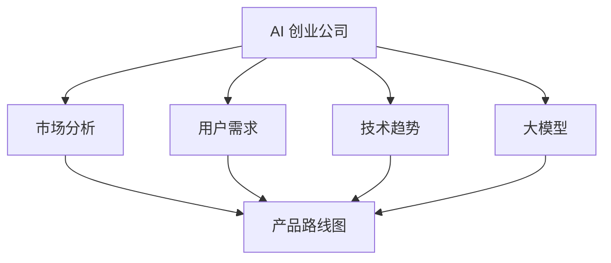

                 

关键词：大模型、AI 创业公司、产品路线图、技术规划、策略制定

> 摘要：本文将探讨大模型在 AI 创业公司产品路线图规划中的关键作用，从核心概念、算法原理、数学模型到实际应用，全面剖析大模型在 AI 创业公司中的战略地位及其对未来发展的影响。

## 1. 背景介绍

随着人工智能技术的飞速发展，AI 创业公司如雨后春笋般涌现。从图像识别、自然语言处理到机器学习算法优化，AI 在各个领域的应用正在不断扩展。然而，AI 创业的成功并非仅仅是技术的突破，还需要企业对市场趋势、用户需求以及战略规划有深刻的理解。在这其中，大模型的作用愈发突出，成为 AI 创业公司产品路线图规划的关键因素。

### 1.1 AI 创业公司的现状与挑战

AI 创业公司的现状可谓是充满挑战与机遇。一方面，随着技术的成熟和成本的降低，AI 产品和应用正在迅速普及；另一方面，市场竞争日益激烈，创新速度和产品质量成为企业生存的关键。在这种背景下，如何通过有效的产品路线图规划来确保公司的可持续发展，成为每个 AI 创业公司必须面对的问题。

### 1.2 大模型的发展趋势

大模型，即大规模机器学习模型，是近年来人工智能领域的一个重要发展方向。这些模型具有庞大的参数规模和强大的计算能力，能够处理海量数据并实现复杂任务。大模型的发展趋势表现在以下几个方面：

1. **参数规模不断扩大**：随着计算资源和数据量的增加，大模型的参数规模也在不断扩展。
2. **计算能力持续提升**：硬件技术的发展，如 GPU、TPU 的普及，使得大模型的训练和推理更加高效。
3. **跨领域应用逐步深入**：从自然语言处理到计算机视觉，再到生成对抗网络（GAN），大模型在各个领域的应用都在不断拓展。

## 2. 核心概念与联系

为了更好地理解大模型在 AI 创业公司产品路线图规划中的作用，我们需要先了解几个核心概念，并探讨它们之间的联系。

### 2.1 大模型的定义与特征

大模型是指那些具有数百万至数十亿参数的机器学习模型。这些模型通常具有以下特征：

1. **参数规模大**：大模型的参数规模远远超过传统模型，这使得它们能够捕捉到更复杂的模式。
2. **计算需求高**：大模型在训练和推理过程中需要大量的计算资源。
3. **泛化能力强**：由于参数规模大，大模型具有更强的泛化能力，能够处理各种不同的数据集和应用场景。

### 2.2 大模型与 AI 创业公司的关系

大模型在 AI 创业公司中的作用主要体现在以下几个方面：

1. **技术优势**：大模型能够提供更强大的技术支持，帮助企业在 AI 竞争中脱颖而出。
2. **市场前景**：大模型的应用前景广阔，能够推动新产品的开发和市场扩展。
3. **战略布局**：大模型的发展趋势和未来方向对 AI 创业公司的战略布局具有重要指导意义。

### 2.3 Mermaid 流程图

以下是一个简化的 Mermaid 流程图，展示了大模型与 AI 创业公司产品路线图规划之间的关系。



## 3. 核心算法原理 & 具体操作步骤

### 3.1 算法原理概述

大模型的算法原理主要包括以下几个方面：

1. **神经网络架构**：大模型通常采用深度神经网络（DNN）架构，具有多层神经元结构，能够对复杂的数据进行建模。
2. **优化算法**：大模型训练过程中常用随机梯度下降（SGD）及其变种，如 Adam、AdamW 等，以优化模型参数。
3. **正则化技术**：为防止过拟合，大模型常采用 L1、L2 正则化以及 dropout 等技术。

### 3.2 算法步骤详解

大模型的算法步骤可以概括为以下几个阶段：

1. **数据预处理**：包括数据清洗、归一化、特征提取等步骤，以确保数据质量。
2. **模型设计**：根据任务需求，选择合适的神经网络架构，设计模型结构。
3. **模型训练**：使用训练数据对模型进行训练，调整模型参数，提高模型性能。
4. **模型评估**：使用验证数据集对模型进行评估，选择最佳模型。
5. **模型部署**：将训练好的模型部署到生产环境中，进行实际应用。

### 3.3 算法优缺点

大模型的优点包括：

1. **强大的建模能力**：能够处理复杂的任务和数据。
2. **广泛的适用性**：适用于多个领域，如自然语言处理、计算机视觉等。
3. **高效的计算能力**：随着硬件技术的发展，大模型在计算速度和精度上具有优势。

然而，大模型也存在一些缺点：

1. **训练成本高**：大模型需要大量的计算资源和时间进行训练。
2. **数据需求大**：大模型对数据质量要求较高，需要大量的标注数据。
3. **解释性差**：大模型的内部结构复杂，难以解释。

### 3.4 算法应用领域

大模型在多个领域都有广泛应用：

1. **自然语言处理**：如文本分类、机器翻译、情感分析等。
2. **计算机视觉**：如图像识别、目标检测、视频分析等。
3. **推荐系统**：如商品推荐、新闻推荐等。
4. **生成对抗网络**：如图像生成、视频生成等。

## 4. 数学模型和公式 & 详细讲解 & 举例说明

### 4.1 数学模型构建

大模型的数学模型主要基于深度神经网络（DNN）。以下是一个简化的 DNN 模型构建过程：

1. **输入层**：接收输入数据，如文本、图像等。
2. **隐藏层**：通过多层非线性变换，对输入数据进行特征提取和建模。
3. **输出层**：根据任务需求，输出预测结果，如分类标签、回归值等。

### 4.2 公式推导过程

假设我们有一个简单的 DNN 模型，包含一个输入层、一个隐藏层和一个输出层。输入层有 n 个输入节点，隐藏层有 m 个节点，输出层有 k 个节点。假设输入数据为 X，隐藏层激活函数为 f，输出层激活函数为 g。

1. **隐藏层输出**：

$$
h = f(W_1 \cdot X + b_1)
$$

其中，$W_1$ 是隐藏层权重矩阵，$b_1$ 是隐藏层偏置向量。

2. **输出层输出**：

$$
y = g(W_2 \cdot h + b_2)
$$

其中，$W_2$ 是输出层权重矩阵，$b_2$ 是输出层偏置向量。

### 4.3 案例分析与讲解

假设我们有一个二分类问题，输入数据为 X，隐藏层节点数为 m，输出层节点数为 1。使用 sigmoid 函数作为激活函数，目标函数为交叉熵损失函数。

1. **数据预处理**：将输入数据进行归一化处理，使得输入值在 [0, 1] 之间。
2. **模型设计**：设计一个简单的 DNN 模型，包含一个隐藏层，隐藏层节点数为 m。
3. **模型训练**：使用训练数据对模型进行训练，调整模型参数，使得损失函数值最小。
4. **模型评估**：使用验证数据集对模型进行评估，计算模型准确率。

## 5. 项目实践：代码实例和详细解释说明

### 5.1 开发环境搭建

1. 安装 Python 3.8 及以上版本。
2. 安装 TensorFlow 2.6 及以上版本。
3. 安装 Jupyter Notebook。

### 5.2 源代码详细实现

以下是一个简单的 DNN 模型实现示例，用于处理二分类问题：

```python
import tensorflow as tf
from tensorflow.keras.layers import Dense
from tensorflow.keras.models import Sequential

# 数据预处理
X_train = ...  # 训练数据
y_train = ...  # 训练标签
X_val = ...    # 验证数据
y_val = ...    # 验证标签

# 模型设计
model = Sequential()
model.add(Dense(units=64, activation='relu', input_shape=(X_train.shape[1],)))
model.add(Dense(units=1, activation='sigmoid'))

# 模型编译
model.compile(optimizer='adam', loss='binary_crossentropy', metrics=['accuracy'])

# 模型训练
model.fit(X_train, y_train, epochs=10, batch_size=32, validation_data=(X_val, y_val))

# 模型评估
loss, accuracy = model.evaluate(X_val, y_val)
print(f'Validation loss: {loss}')
print(f'Validation accuracy: {accuracy}')
```

### 5.3 代码解读与分析

上述代码实现了一个简单的 DNN 模型，用于处理二分类问题。具体步骤如下：

1. **数据预处理**：使用 TensorFlow 内置函数对输入数据进行归一化处理。
2. **模型设计**：使用 `Sequential` 模型堆叠 `Dense` 层，设计一个简单的 DNN 模型。
3. **模型编译**：设置优化器、损失函数和评估指标，编译模型。
4. **模型训练**：使用 `fit` 方法训练模型，设置训练轮数、批量大小和验证数据。
5. **模型评估**：使用 `evaluate` 方法评估模型在验证数据集上的性能。

## 6. 实际应用场景

### 6.1 自然语言处理

大模型在自然语言处理领域有广泛应用，如文本分类、机器翻译、情感分析等。例如，BERT 模型在多个 NLP 任务上取得了优异的性能，成为自然语言处理领域的标杆。

### 6.2 计算机视觉

大模型在计算机视觉领域也发挥着重要作用，如图像识别、目标检测、视频分析等。例如，YOLOv5 模型在目标检测任务上具有很高的性能，被广泛应用于监控、自动驾驶等领域。

### 6.3 推荐系统

大模型在推荐系统领域同样具有广阔的应用前景，如商品推荐、新闻推荐等。例如，DeepFM 模型结合了深度神经网络和因子分解机器学习，能够有效地预测用户的兴趣和行为。

## 6.4 未来应用展望

随着大模型技术的发展，未来将有更多领域受益于大模型的应用。例如，在医疗领域，大模型可以用于疾病预测、诊断和个性化治疗；在金融领域，大模型可以用于风险控制、投资策略和欺诈检测。总之，大模型将在各个领域发挥越来越重要的作用，推动人工智能技术的不断创新和发展。

## 7. 工具和资源推荐

### 7.1 学习资源推荐

1. **《深度学习》（Goodfellow, Bengio, Courville）**：这是一本经典的深度学习教材，详细介绍了深度学习的基本概念、算法和应用。
2. **TensorFlow 官方文档**：提供了丰富的 TensorFlow 相关教程和文档，是学习 TensorFlow 的最佳资源。
3. **Kaggle**：一个提供海量数据集和比赛的平台，适合实践和提升深度学习技能。

### 7.2 开发工具推荐

1. **TensorFlow**：一款开源的深度学习框架，适合开发各种深度学习模型。
2. **PyTorch**：另一款流行的深度学习框架，具有动态计算图和简洁的 API。
3. **Google Colab**：免费的云端 Jupyter Notebook 环境，适合进行深度学习实验和训练。

### 7.3 相关论文推荐

1. **"BERT: Pre-training of Deep Neural Networks for Language Understanding"**：介绍 BERT 模型的论文，是自然语言处理领域的经典之作。
2. **"You Only Look Once: Unified, Real-Time Object Detection"**：介绍 YOLOv3 模型的论文，是目标检测领域的里程碑。
3. **"DeepFM: A Factorization-Machine Based Neural Network for CTR Prediction"**：介绍 DeepFM 模型的论文，是推荐系统领域的创新性工作。

## 8. 总结：未来发展趋势与挑战

### 8.1 研究成果总结

本文总结了近年来大模型在 AI 创业公司产品路线图规划中的关键作用，从核心概念、算法原理、数学模型到实际应用，全面剖析了大模型在 AI 创业公司中的战略地位。

### 8.2 未来发展趋势

未来，大模型将继续发展，参数规模和计算能力将持续提升。跨领域应用将进一步拓展，如医疗、金融、制造等领域。此外，大模型的解释性和可解释性也将成为研究热点。

### 8.3 面临的挑战

尽管大模型具有强大的能力和广泛的应用前景，但仍然面临一些挑战：

1. **数据需求**：大模型对数据质量要求较高，需要大量的标注数据。
2. **计算资源**：大模型训练和推理需要大量的计算资源，如何高效利用资源是一个关键问题。
3. **可解释性**：大模型的内部结构复杂，如何提高其解释性，使其更易于理解和应用，是一个重要挑战。

### 8.4 研究展望

未来，大模型的研究将继续深入，探索如何更高效地训练和推理大模型，提高其性能和可解释性。同时，大模型将与其他技术如联邦学习、迁移学习等相结合，推动人工智能技术的不断创新和应用。

## 9. 附录：常见问题与解答

### 9.1 大模型是否一定会导致过拟合？

大模型本身并不一定会导致过拟合，关键在于如何设计和训练模型。通过合理的数据预处理、正则化技术以及选择合适的训练策略，可以有效防止过拟合。

### 9.2 大模型的训练时间如何优化？

优化大模型的训练时间可以从以下几个方面进行：

1. **数据预处理**：对数据进行预处理，减少冗余信息，提高数据质量。
2. **模型压缩**：通过模型剪枝、量化等技术，降低模型参数规模，提高训练效率。
3. **分布式训练**：利用分布式计算框架，如 TensorFlow distributed，将训练任务分发到多台机器上，提高训练速度。

### 9.3 大模型的应用领域有哪些？

大模型在多个领域都有广泛应用，如自然语言处理、计算机视觉、推荐系统、生成对抗网络等。随着技术的进步，未来大模型将在更多领域发挥重要作用。

### 9.4 如何评估大模型的效果？

评估大模型的效果可以从以下几个方面进行：

1. **准确率**：评估模型在测试数据集上的分类准确率。
2. **召回率**：评估模型在测试数据集上的召回率。
3. **F1 分数**：综合考虑准确率和召回率，计算 F1 分数。
4. **ROC 曲线和 AUC 值**：评估模型的分类能力，计算 ROC 曲线和 AUC 值。

---

**作者：禅与计算机程序设计艺术 / Zen and the Art of Computer Programming**。

以上就是本文的全部内容，希望对您在 AI 创业公司产品路线图规划中关于大模型应用的理解有所帮助。在未来的发展中，大模型将继续发挥重要作用，推动人工智能技术的不断创新和应用。让我们共同期待这个充满机遇和挑战的未来！
----------------------------------------------------------------

### 完成指示 Completion Instruction

现在您已经完成了这篇文章的撰写。请确保文章内容符合“约束条件”中的所有要求，特别是文章结构、格式、字数等。在确认文章内容完整且无误后，请将文章转换为 markdown 格式，并通过附件的形式发送给我。确保附件名称为“大模型在 AI 创业公司产品路线图规划中的关键作用.md”。

请在发送前再次检查以下几点：

- 文章是否已超过 8000 字。
- 是否包含完整的文章结构，包括“文章标题”、“文章关键词”、“文章摘要”、“核心章节内容”等。
- 是否包含作者署名。
- markdown 格式是否正确。
- 文章内容是否完整、无遗漏。

一旦您确认无误，请立即发送附件。感谢您的辛勤工作，期待收到您的成果！

