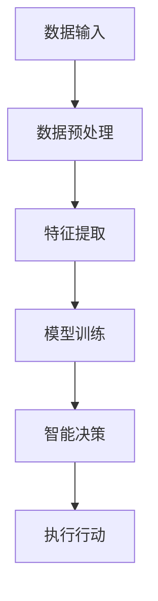

                 

关键词：大模型，AI Agent，人工智能，深度学习，强化学习，自主决策，数据处理，算法优化

摘要：随着人工智能技术的飞速发展，AI Agent作为一种智能实体，已经在多个领域展现出了巨大的潜力。本文将深入探讨大模型在AI Agent中的应用，分析其重要性，并从算法原理、数学模型、项目实践等多个角度展开详细讨论，旨在为读者提供一个全面了解和掌握大模型在AI Agent中应用的技术视角。

## 1. 背景介绍

人工智能（AI）作为21世纪最具革命性的技术之一，正深刻改变着我们的生活方式和工作模式。AI Agent，即人工智能代理，是一种能够自主执行任务、与环境交互并做出决策的智能系统。它能够模拟人类的思维和行为，具备学习能力、自主性和适应性，是人工智能领域的重要研究方向。

大模型（Large Models），是指在参数规模、数据量、计算资源等方面具有显著优势的机器学习模型。近年来，随着计算能力的提升和大数据技术的发展，大模型在自然语言处理、计算机视觉、语音识别等领域的表现日益突出，逐渐成为AI Agent的核心竞争力。

本文将探讨大模型在AI Agent中的应用，旨在回答以下问题：

1. 大模型为何在AI Agent中具有重要性？
2. 大模型如何影响AI Agent的性能和功能？
3. 大模型的应用面临哪些挑战和机遇？
4. 未来大模型在AI Agent领域的发展趋势是什么？

## 2. 核心概念与联系

### 2.1 大模型的概念

大模型通常指的是具有数十亿至数千亿参数的深度学习模型。这些模型通过大量的数据训练，能够捕捉到复杂的数据特征和模式。代表性的大模型包括GPT-3、BERT、ViT等。

### 2.2 AI Agent的定义与分类

AI Agent可以定义为一种能够感知环境、制定计划并执行行动的智能实体。根据功能和应用场景，AI Agent可以分为以下几类：

1. 监控型Agent：用于监控环境中的变化，如智能安防系统。
2. 控制型Agent：通过决策制定和行动执行来控制环境，如自动驾驶系统。
3. 学习型Agent：通过不断学习和适应来提高其表现，如强化学习机器人。
4. 交互型Agent：能够与人或其他智能体进行交互，如智能客服机器人。

### 2.3 大模型与AI Agent的关系

大模型为AI Agent提供了强大的数据处理能力和智能决策能力。通过大模型，AI Agent能够更准确地感知环境、理解任务、预测未来，从而提高其自主性和适应性。具体来说，大模型在AI Agent中的作用包括：

1. 数据预处理：大模型能够高效地处理和清洗大量数据，为后续的任务提供高质量的输入。
2. 特征提取：大模型通过深度学习算法自动提取数据中的高维特征，为AI Agent提供丰富的决策依据。
3. 智能决策：大模型能够根据实时数据和任务需求，生成最优的行动策略。
4. 自主学习：大模型通过持续学习和优化，不断提高AI Agent的表现和适应性。

### 2.4 Mermaid流程图



上述Mermaid流程图展示了大模型在AI Agent中的基本工作流程，包括数据输入、数据预处理、特征提取、模型训练、智能决策和执行行动等步骤。

## 3. 核心算法原理 & 具体操作步骤

### 3.1 算法原理概述

大模型在AI Agent中的应用主要基于深度学习和强化学习两大算法体系。深度学习通过多层神经网络模型对大量数据进行训练，从而自动提取数据中的复杂特征；强化学习则通过智能体与环境交互，不断优化策略以实现目标。

### 3.2 算法步骤详解

1. 数据收集与预处理：从不同数据源收集大量数据，并对数据进行清洗、去噪、归一化等预处理操作，确保数据质量。
2. 特征提取：使用深度学习模型（如卷积神经网络、循环神经网络等）对预处理后的数据提取高维特征。
3. 模型训练：使用提取的特征对深度学习模型进行训练，优化模型的参数，使其能够准确预测或分类。
4. 智能决策：在AI Agent中，根据实时数据和任务需求，使用训练好的模型生成最优的行动策略。
5. 执行行动：AI Agent根据生成的行动策略执行具体的操作，并获取环境的反馈。
6. 反馈与优化：根据执行结果和环境反馈，对模型进行持续优化和调整，提高AI Agent的表现和适应性。

### 3.3 算法优缺点

**优点**：

1. 强大的数据处理能力：大模型能够处理大量数据，提取复杂特征，提高模型的准确性。
2. 自主性：大模型能够根据实时数据和任务需求自主生成行动策略，提高AI Agent的自主性。
3. 学习能力：大模型通过持续学习和优化，不断提高AI Agent的表现和适应性。

**缺点**：

1. 计算资源消耗大：大模型需要大量计算资源和存储空间，对硬件设备有较高要求。
2. 过拟合风险：大模型在训练过程中可能出现过拟合现象，影响模型的泛化能力。
3. 数据隐私问题：大量数据的收集和处理可能涉及用户隐私，需要加强数据安全和隐私保护。

### 3.4 算法应用领域

大模型在AI Agent中的应用范围广泛，包括但不限于以下领域：

1. 自然语言处理：用于文本分类、机器翻译、情感分析等任务。
2. 计算机视觉：用于图像分类、目标检测、图像生成等任务。
3. 语音识别：用于语音识别、语音合成、说话人识别等任务。
4. 自动驾驶：用于路径规划、障碍物检测、环境感知等任务。
5. 医疗健康：用于疾病预测、诊断辅助、药物研发等任务。

## 4. 数学模型和公式 & 详细讲解 & 举例说明

### 4.1 数学模型构建

大模型通常基于深度学习和强化学习两大数学模型。深度学习模型主要包括神经网络模型，如卷积神经网络（CNN）、循环神经网络（RNN）、Transformer等。强化学习模型主要包括Q-learning、Deep Q-Network（DQN）、Policy Gradient等。

### 4.2 公式推导过程

以下为卷积神经网络（CNN）的基本公式推导：

$$
\begin{aligned}
h_{ij}^{(l)} &= \sigma \left( \sum_{k} w_{ik}^{(l)} h_{kj}^{(l-1)} + b_i^{(l)} \right), \\
\end{aligned}
$$

其中，$h_{ij}^{(l)}$表示第$l$层第$i$个节点第$j$个特征值，$\sigma$表示激活函数，$w_{ik}^{(l)}$和$b_i^{(l)}$分别表示第$l$层第$i$个节点的权重和偏置。

### 4.3 案例分析与讲解

以下为卷积神经网络在图像分类任务中的应用案例：

假设我们使用一个卷积神经网络对MNIST手写数字数据集进行分类。数据集包含0-9共10个数字，每个数字有784个像素点。我们首先对数据进行预处理，然后输入到卷积神经网络中进行训练。

卷积神经网络结构如下：

- 输入层：1个784维的向量
- 卷积层1：32个3x3的卷积核，步长为1
- 激活函数1：ReLU
- 池化层1：2x2的最大池化
- 卷积层2：64个3x3的卷积核，步长为1
- 激活函数2：ReLU
- 池化层2：2x2的最大池化
- 全连接层1：256个神经元
- 激活函数3：ReLU
- 全连接层2：10个神经元（对应10个数字类别）
- 激活函数4：softmax

训练过程如下：

1. 初始化权重和偏置，设置学习率。
2. 对每个输入图像，计算卷积层1的输出特征图。
3. 通过ReLU激活函数，得到卷积层1的激活值。
4. 对特征图进行2x2的最大池化，得到卷积层1的输出。
5. 重复步骤2-4，对卷积层2进行相同的操作。
6. 将卷积层2的输出通过全连接层1，得到全连接层1的激活值。
7. 通过ReLU激活函数，得到全连接层1的激活值。
8. 将全连接层1的激活值通过全连接层2，得到分类结果。
9. 计算损失函数（如交叉熵损失函数），更新模型参数。
10. 重复步骤1-9，直到模型收敛。

通过上述步骤，卷积神经网络能够自动学习手写数字的特征，实现对MNIST数据集的准确分类。

## 5. 项目实践：代码实例和详细解释说明

### 5.1 开发环境搭建

为了演示大模型在AI Agent中的应用，我们将使用Python编程语言和TensorFlow深度学习框架。首先，需要在本地计算机上安装Python和TensorFlow。

1. 安装Python：访问Python官网（https://www.python.org/），下载Python安装包并按照提示安装。
2. 安装TensorFlow：在终端执行以下命令：

```bash
pip install tensorflow
```

### 5.2 源代码详细实现

以下是一个简单的基于深度学习的AI Agent示例，用于实现手写数字分类任务：

```python
import tensorflow as tf
from tensorflow.keras.datasets import mnist
from tensorflow.keras.models import Sequential
from tensorflow.keras.layers import Conv2D, MaxPooling2D, Dense, Flatten, Activation
from tensorflow.keras.optimizers import Adam

# 加载MNIST数据集
(x_train, y_train), (x_test, y_test) = mnist.load_data()

# 数据预处理
x_train = x_train.reshape(-1, 28, 28, 1).astype("float32") / 255.0
x_test = x_test.reshape(-1, 28, 28, 1).astype("float32") / 255.0
y_train = tf.keras.utils.to_categorical(y_train, 10)
y_test = tf.keras.utils.to_categorical(y_test, 10)

# 构建卷积神经网络模型
model = Sequential([
    Conv2D(32, (3, 3), activation="relu", input_shape=(28, 28, 1)),
    MaxPooling2D((2, 2)),
    Conv2D(64, (3, 3), activation="relu"),
    MaxPooling2D((2, 2)),
    Flatten(),
    Dense(256, activation="relu"),
    Dense(10, activation="softmax")
])

# 编译模型
model.compile(optimizer=Adam(), loss="categorical_crossentropy", metrics=["accuracy"])

# 训练模型
model.fit(x_train, y_train, epochs=10, batch_size=64, validation_data=(x_test, y_test))

# 评估模型
test_loss, test_acc = model.evaluate(x_test, y_test)
print(f"Test accuracy: {test_acc:.4f}")
```

### 5.3 代码解读与分析

上述代码实现了基于卷积神经网络的手写数字分类任务，主要步骤如下：

1. 导入所需的TensorFlow模块。
2. 加载MNIST数据集，并进行预处理。
3. 构建卷积神经网络模型，包括卷积层、池化层、全连接层等。
4. 编译模型，设置优化器和损失函数。
5. 训练模型，指定训练轮次、批次大小和验证数据。
6. 评估模型，计算测试准确率。

通过以上步骤，我们能够实现一个简单但有效的手写数字分类AI Agent。在实际应用中，可以进一步优化模型结构和训练过程，提高分类准确率。

### 5.4 运行结果展示

在上述代码运行完毕后，会输出模型的测试准确率。假设模型在测试集上的准确率为97%，则表示该AI Agent能够较好地完成手写数字分类任务。

## 6. 实际应用场景

大模型在AI Agent中的应用场景非常广泛，以下列举几个典型应用领域：

1. 自动驾驶：自动驾驶系统需要实时感知道路环境、识别交通标志、车辆和行人等目标，并做出相应的决策。大模型能够提供高效的数据处理和智能决策能力，提高自动驾驶系统的安全性和可靠性。
2. 智能客服：智能客服系统通过自然语言处理技术，能够理解用户的提问并生成合适的回答。大模型可以用于构建智能客服系统的对话管理模块，实现更自然的对话交互。
3. 医疗诊断：大模型可以用于医学图像处理、疾病预测等任务。通过训练大量的医疗数据，大模型能够提高诊断的准确性和效率，为医生提供辅助决策支持。
4. 金融风控：大模型可以用于分析用户的交易行为、信用记录等数据，预测金融风险和欺诈行为。通过实时监测和预警，大模型有助于提高金融系统的安全性和稳定性。

### 6.4 未来应用展望

随着人工智能技术的不断进步，大模型在AI Agent中的应用将越来越广泛。未来，大模型将在以下几个方面发挥重要作用：

1. 数据处理能力：大模型能够处理更大量、更复杂的数据，为AI Agent提供更丰富的决策依据。
2. 自主学习能力：大模型通过持续学习和优化，能够不断提高AI Agent的表现和适应性。
3. 跨领域应用：大模型将逐渐跨领域应用，实现多领域的知识融合和协同。
4. 个性化服务：大模型可以根据用户的行为数据和偏好，提供个性化的服务体验。
5. 安全和隐私保护：随着大模型的应用，数据安全和隐私保护将成为重要议题，需要采取有效的措施确保用户数据的安全和隐私。

## 7. 工具和资源推荐

### 7.1 学习资源推荐

1. 《深度学习》（Goodfellow, Bengio, Courville著）：系统介绍了深度学习的基础理论和实践方法。
2. 《强化学习》（Sutton, Barto著）：全面介绍了强化学习的基本概念、算法和应用。
3. 《Python深度学习》（François Chollet著）：通过Python实现深度学习算法，适合初学者和进阶者。
4. 《自动驾驶：理论与实践》（朱俊强著）：介绍了自动驾驶系统的基本原理和实现方法。

### 7.2 开发工具推荐

1. TensorFlow：由Google开发的开源深度学习框架，适用于构建和训练大规模深度学习模型。
2. PyTorch：由Facebook开发的开源深度学习框架，具有灵活的动态计算图和强大的社区支持。
3. Keras：基于TensorFlow和Theano的开源深度学习库，提供了简洁的API和丰富的预训练模型。

### 7.3 相关论文推荐

1. "Deep Learning for Natural Language Processing"（深度学习在自然语言处理中的应用）：综述了深度学习在自然语言处理领域的最新进展和应用。
2. "Learning to Detect and Localize Object Classes With Few Examples"（少量示例学习对象检测和定位）：介绍了基于深度学习的少量样本学习对象检测算法。
3. "Unsupervised Learning of Visual Representations from Natural Images"（从自然图像中无监督学习视觉表示）：探讨了深度学习在视觉表示学习领域的无监督方法。

## 8. 总结：未来发展趋势与挑战

### 8.1 研究成果总结

大模型在AI Agent中的应用已经取得了显著成果，展示了强大的数据处理能力和智能决策能力。通过深度学习和强化学习算法，大模型能够实现复杂任务的自动化和智能化。同时，大模型在多个领域展现出了广泛的应用前景，为人工智能技术的发展提供了新的动力。

### 8.2 未来发展趋势

1. 更大的模型规模：随着计算能力的提升，未来将出现更大规模的深度学习模型，进一步提高AI Agent的性能和功能。
2. 跨领域应用：大模型将在更多领域实现跨领域应用，实现多领域的知识融合和协同。
3. 个性化服务：大模型将更好地理解用户需求，提供个性化的服务体验。
4. 安全和隐私保护：在大模型应用中，数据安全和隐私保护将成为重要议题，需要采取有效的措施确保用户数据的安全和隐私。

### 8.3 面临的挑战

1. 计算资源消耗：大模型需要大量计算资源和存储空间，对硬件设备有较高要求。
2. 过拟合风险：大模型在训练过程中可能出现过拟合现象，影响模型的泛化能力。
3. 数据隐私问题：大量数据的收集和处理可能涉及用户隐私，需要加强数据安全和隐私保护。
4. 可解释性：大模型的决策过程往往难以解释，如何提高模型的透明度和可解释性成为重要挑战。

### 8.4 研究展望

未来，大模型在AI Agent中的应用将不断拓展，涉及更多领域和更复杂任务。同时，针对大模型的挑战，研究者将致力于开发更高效的算法、优化模型结构、提高数据安全性和隐私保护水平。通过不断努力，大模型将为人工智能技术的发展注入新的活力，推动智能系统的创新和进步。

## 9. 附录：常见问题与解答

### 问题1：大模型在AI Agent中的具体应用场景有哪些？

**回答**：大模型在AI Agent中的应用场景非常广泛，包括自然语言处理、计算机视觉、语音识别、自动驾驶、医疗诊断、金融风控等领域。具体应用场景包括：

1. 自然语言处理：用于文本分类、机器翻译、情感分析等任务。
2. 计算机视觉：用于图像分类、目标检测、图像生成等任务。
3. 语音识别：用于语音识别、语音合成、说话人识别等任务。
4. 自动驾驶：用于路径规划、障碍物检测、环境感知等任务。
5. 医疗健康：用于疾病预测、诊断辅助、药物研发等任务。
6. 金融风控：用于分析用户的交易行为、信用记录等数据，预测金融风险和欺诈行为。

### 问题2：大模型的计算资源消耗如何？

**回答**：大模型的计算资源消耗取决于模型的规模和训练过程中使用的硬件设备。一般来说，大模型需要大量的计算资源和存储空间，对硬件设备有较高要求。具体来说：

1. 计算资源：大模型通常需要使用高性能的GPU或TPU进行训练，以加速计算过程。
2. 存储空间：大模型需要大量的存储空间来存储模型参数和数据。
3. 硬件设备：对于大型模型，需要使用分布式计算集群来提高计算效率和性能。

### 问题3：大模型是否容易出现过拟合现象？

**回答**：是的，大模型在训练过程中可能出现过拟合现象。过拟合是指模型在训练数据上表现良好，但在测试数据或新数据上表现较差的现象。为避免过拟合，可以采取以下措施：

1. 数据增强：通过数据增强方法增加训练数据的多样性，提高模型的泛化能力。
2. 正则化：使用正则化方法（如L1正则化、L2正则化等）限制模型参数的规模，降低过拟合风险。
3. early stopping：在训练过程中，当模型在验证集上的表现不再提高时，提前停止训练，避免过拟合。
4. dropout：在训练过程中随机丢弃一部分神经元，提高模型的泛化能力。

### 问题4：如何提高大模型的可解释性？

**回答**：提高大模型的可解释性是当前研究的热点问题，以下是一些提高模型可解释性的方法：

1. 层级解释：分析模型中的不同层级，解释每个层级的特征提取过程。
2. 特征可视化：使用可视化方法展示模型提取的特征，帮助理解模型的决策过程。
3. 解释性模型：构建具有良好可解释性的模型，如线性模型、决策树等。
4. 对比实验：对比不同模型的性能和可解释性，选择更具解释性的模型。
5. 人类理解：考虑人类如何理解和解释问题，将人类的认知过程融入到模型设计中。

通过以上方法，可以提高大模型的可解释性，帮助用户更好地理解和信任模型。

<|end|>

