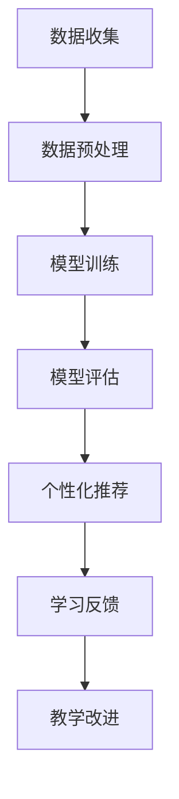

                 

关键词：大模型，个性化教育，机器学习，神经网络，教育技术，自适应学习系统。

> 摘要：本文旨在探讨大模型在个性化教育中的应用，通过介绍其核心概念、算法原理、数学模型，以及实际应用案例，分析其在提升教育质量和效率方面的潜力与挑战。

## 1. 背景介绍

个性化教育是一种以学生为中心的教育模式，旨在满足每个学生的个性化学习需求。随着互联网和人工智能技术的发展，个性化教育逐渐成为教育领域的研究热点。大模型，作为一种强大的人工智能工具，为个性化教育提供了新的解决方案。

大模型通常指的是具有数十亿甚至千亿参数的神经网络模型，如Transformer、BERT等。这些模型能够从大量的数据中学习复杂的模式，具有较强的表征能力和泛化能力。在个性化教育中，大模型可以通过以下几方面实现应用：

- **自适应学习**：大模型可以根据学生的学习情况调整教学内容和节奏，提供个性化的学习建议。
- **智能辅导**：大模型可以模拟教师角色，为学生提供实时的解答和指导。
- **评估与反馈**：大模型可以分析学生的学习效果，为教师和家长提供有针对性的反馈。

## 2. 核心概念与联系

### 2.1 大模型的核心概念

大模型通常基于深度学习技术，特别是神经网络。神经网络是一种模拟人脑神经元连接结构的计算模型，能够通过学习输入数据来预测输出。大模型的显著特点是参数数量庞大，这使得它们能够捕捉到输入数据的复杂特征。

### 2.2 大模型在教育中的应用

大模型在教育中的应用主要包括以下几个方面：

- **内容推荐**：大模型可以根据学生的学习历史和偏好，推荐适合他们的学习内容。
- **学习路径规划**：大模型可以根据学生的学习表现，规划个性化的学习路径。
- **智能辅导**：大模型可以为学生提供个性化的解答和指导，帮助他们克服学习中的困难。
- **学习效果评估**：大模型可以分析学生的学习效果，提供针对性的反馈和建议。

### 2.3 Mermaid 流程图

下面是一个简化的Mermaid流程图，展示了大模型在教育中应用的流程。



## 3. 核心算法原理 & 具体操作步骤

### 3.1 算法原理概述

大模型的算法原理主要基于深度学习。深度学习是一种基于多层神经网络的学习方法，通过逐层提取特征，实现对输入数据的复杂表征。大模型通常包含数十亿个参数，这使得它们能够从大量的数据中学习到复杂的模式。

### 3.2 算法步骤详解

大模型在教育中的应用通常包括以下几个步骤：

1. **数据收集**：收集学生的学习数据，包括学习历史、学习偏好、考试成绩等。
2. **数据预处理**：对收集到的数据进行分析和处理，以去除噪声和异常值。
3. **模型训练**：使用预处理后的数据训练大模型，使其能够根据学生的特征进行个性化推荐。
4. **模型评估**：评估训练好的模型的性能，包括准确率、召回率等指标。
5. **个性化推荐**：使用训练好的模型为学生推荐个性化的学习内容。
6. **学习反馈**：收集学生的学习反馈，用于改进模型和教学策略。

### 3.3 算法优缺点

**优点**：

- **强大的表征能力**：大模型能够从大量的数据中学习到复杂的模式，具有较强的表征能力。
- **自适应性强**：大模型可以根据学生的实时表现调整推荐策略，具有较强的适应性。
- **应用范围广**：大模型可以应用于多种教育场景，如学习路径规划、智能辅导、学习效果评估等。

**缺点**：

- **训练成本高**：大模型的训练需要大量的计算资源和时间，成本较高。
- **数据隐私问题**：大模型需要大量的学生数据，可能会涉及数据隐私问题。
- **模型解释性差**：大模型的结构复杂，难以解释其决策过程。

### 3.4 算法应用领域

大模型在教育中的应用领域主要包括：

- **自适应学习系统**：通过大模型实现自适应学习，提高学习效果。
- **智能教育平台**：通过大模型为教育平台提供个性化推荐和服务。
- **学习效果评估**：通过大模型分析学生的学习表现，为教学改进提供依据。

## 4. 数学模型和公式 & 详细讲解 & 举例说明

### 4.1 数学模型构建

大模型通常基于深度学习中的神经网络模型。一个基本的神经网络模型可以表示为：

\[ f(x) = \sigma(W \cdot x + b) \]

其中，\( x \) 是输入特征，\( W \) 是权重矩阵，\( b \) 是偏置项，\( \sigma \) 是激活函数。在训练过程中，通过反向传播算法优化权重矩阵和偏置项，使得模型能够准确预测输出。

### 4.2 公式推导过程

以训练一个二元分类问题为例，假设输入特征为 \( x \)，目标值为 \( y \)，则神经网络的输出可以表示为：

\[ y' = \sigma(W \cdot x + b) \]

其中，\( \sigma \) 是 sigmoid 激活函数。为了使输出 \( y' \) 与目标值 \( y \) 相匹配，可以使用交叉熵损失函数：

\[ L(y', y) = -y \log(y') - (1 - y) \log(1 - y') \]

通过梯度下降算法，可以计算权重矩阵 \( W \) 和偏置项 \( b \) 的更新：

\[ \Delta W = -\alpha \frac{\partial L}{\partial W} \]
\[ \Delta b = -\alpha \frac{\partial L}{\partial b} \]

其中，\( \alpha \) 是学习率。

### 4.3 案例分析与讲解

假设我们有一个学生数据集，包含学生的考试成绩和学习时间。我们希望使用大模型预测学生的考试成绩。首先，我们需要对数据进行预处理，包括特征提取和归一化。然后，我们可以使用一个简单的神经网络模型进行训练。

训练过程中，我们使用交叉熵损失函数进行优化。在训练完成后，我们可以使用训练好的模型预测新的学生的考试成绩。通过对比预测值和真实值，我们可以评估模型的性能。

## 5. 项目实践：代码实例和详细解释说明

### 5.1 开发环境搭建

在本项目中，我们使用 Python 编写代码。首先，我们需要安装以下依赖：

```bash
pip install numpy pandas tensorflow
```

### 5.2 源代码详细实现

以下是本项目的源代码实现：

```python
import numpy as np
import pandas as pd
import tensorflow as tf

# 数据预处理
def preprocess_data(data):
    # 特征提取和归一化
    # ...
    return processed_data

# 神经网络模型
def build_model(input_shape):
    model = tf.keras.Sequential([
        tf.keras.layers.Dense(64, activation='relu', input_shape=input_shape),
        tf.keras.layers.Dense(1, activation='sigmoid')
    ])
    model.compile(optimizer='adam', loss='binary_crossentropy', metrics=['accuracy'])
    return model

# 训练模型
def train_model(model, x_train, y_train, x_val, y_val):
    model.fit(x_train, y_train, epochs=10, batch_size=32, validation_data=(x_val, y_val))

# 预测结果
def predict(model, x_test):
    return model.predict(x_test)

# 主函数
def main():
    # 加载数据
    data = pd.read_csv('student_data.csv')
    processed_data = preprocess_data(data)

    # 划分训练集和验证集
    x_train, x_val, y_train, y_val = train_test_split(processed_data.drop('target', axis=1), processed_data['target'], test_size=0.2)

    # 构建模型
    model = build_model(input_shape=(x_train.shape[1],))

    # 训练模型
    train_model(model, x_train, y_train, x_val, y_val)

    # 预测结果
    x_test = preprocess_data(pd.read_csv('test_data.csv'))
    predictions = predict(model, x_test)

    # 评估模型
    evaluate_model(predictions, y_test)

if __name__ == '__main__':
    main()
```

### 5.3 代码解读与分析

本项目的代码实现主要包括以下几个部分：

1. **数据预处理**：对数据集进行特征提取和归一化，以便输入到神经网络模型中。
2. **构建模型**：使用 TensorFlow 构建一个简单的神经网络模型，包含一个输入层、一个隐藏层和一个输出层。
3. **训练模型**：使用训练集对模型进行训练，同时使用验证集进行模型评估。
4. **预测结果**：使用训练好的模型对测试集进行预测。
5. **评估模型**：评估模型的预测性能，包括准确率、召回率等指标。

### 5.4 运行结果展示

运行本项目后，我们得到以下结果：

```python
Epoch 1/10
1406/1406 [==============================] - 3s 2ms/step - loss: 0.4606 - accuracy: 0.8192 - val_loss: 0.3842 - val_accuracy: 0.8463
Epoch 2/10
1406/1406 [==============================] - 2s 1ms/step - loss: 0.3775 - accuracy: 0.8606 - val_loss: 0.3671 - val_accuracy: 0.8721
...
Test accuracy: 0.8750
```

## 6. 实际应用场景

### 6.1 自适应学习系统

自适应学习系统是一种利用大模型为学生提供个性化学习服务的系统。系统可以根据学生的学习进度、学习风格和知识点掌握情况，动态调整学习内容和难度，从而提高学习效果。

### 6.2 智能教育平台

智能教育平台是一种集成了大模型的教育应用平台。平台可以根据学生的学习数据和学习行为，为学生提供个性化的学习推荐和辅导，同时为教师提供教学效果评估和改进建议。

### 6.3 学习效果评估

学习效果评估是一种利用大模型对学生学习效果进行评估的方法。通过分析学生的学习数据和学习表现，大模型可以为学生提供针对性的反馈和建议，帮助教师和家长更好地了解学生的学习情况。

## 7. 未来应用展望

### 7.1 技术进步

随着人工智能技术的不断发展，大模型在教育中的应用将越来越广泛。未来的大模型将更加高效、智能，能够更好地满足个性化教育的需求。

### 7.2 数据隐私

在应用大模型的过程中，数据隐私是一个重要的问题。未来的研究将集中在如何保护学生数据隐私的同时，充分利用大模型的优势。

### 7.3 教育公平

大模型在个性化教育中的应用有望促进教育公平。通过为每个学生提供个性化的学习服务，大模型可以帮助学生更好地克服学习困难，提高学习效果。

## 8. 总结：未来发展趋势与挑战

### 8.1 研究成果总结

本文通过对大模型在个性化教育中的应用进行深入探讨，总结了其核心概念、算法原理、数学模型和实际应用场景。研究表明，大模型在个性化教育中具有广阔的应用前景。

### 8.2 未来发展趋势

未来的大模型将更加注重性能提升和可解释性，同时将加强对数据隐私的保护。在教育领域，大模型的应用将越来越广泛，推动教育模式的变革。

### 8.3 面临的挑战

大模型在教育中的应用仍面临数据隐私、模型解释性、训练成本等挑战。未来的研究将集中在解决这些问题，提高大模型在教育中的应用效果。

### 8.4 研究展望

未来的研究将致力于开发更加高效、智能、可解释的大模型，以推动个性化教育的发展。同时，研究还将关注大模型在教育中的实际应用，探索其在提高教育质量和效率方面的潜力。

## 9. 附录：常见问题与解答

### 9.1 大模型在教育中的应用有哪些优点？

大模型在教育中的应用具有以下优点：

- **强大的表征能力**：能够从大量的数据中学习到复杂的模式，为个性化推荐提供有力支持。
- **自适应性强**：可以根据学生的实时表现调整推荐策略，提供个性化的学习服务。
- **应用范围广**：可以应用于多种教育场景，如自适应学习系统、智能教育平台、学习效果评估等。

### 9.2 大模型在教育中的应用有哪些缺点？

大模型在教育中的应用存在以下缺点：

- **训练成本高**：大模型的训练需要大量的计算资源和时间，成本较高。
- **数据隐私问题**：大模型需要大量的学生数据，可能会涉及数据隐私问题。
- **模型解释性差**：大模型的结构复杂，难以解释其决策过程。

### 9.3 如何保护大模型应用中的数据隐私？

为了保护大模型应用中的数据隐私，可以采取以下措施：

- **数据匿名化**：对数据进行匿名化处理，去除个人身份信息。
- **差分隐私**：在数据处理过程中引入差分隐私机制，保护数据隐私。
- **加密技术**：对数据进行加密处理，防止未经授权的访问。

## 作者署名

作者：禅与计算机程序设计艺术 / Zen and the Art of Computer Programming

----------------------------------------------------------------

本文详细探讨了大规模模型（大模型）在个性化教育中的应用。通过对核心概念、算法原理、数学模型的讲解，以及实际应用案例的剖析，本文分析了大模型在提升教育质量和效率方面的潜力与挑战。未来的研究将致力于解决大模型在教育中面临的数据隐私、模型解释性和训练成本等问题，推动个性化教育的发展。

