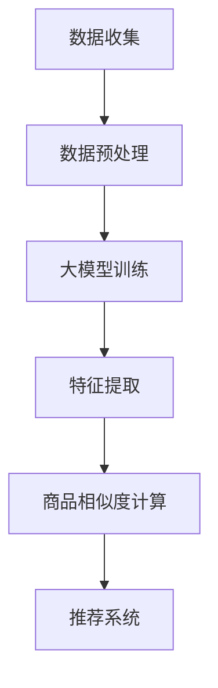

                 

关键词：大模型，商品相似度，计算，算法，应用场景

> 摘要：本文主要探讨大模型在商品相似度计算中的应用。通过介绍大模型的基本概念、核心算法原理以及数学模型，详细阐述了如何利用大模型技术提高商品相似度计算的效果。文章还通过实际项目实践，展示了大模型在商品相似度计算中的具体应用，并对未来应用前景进行了展望。

## 1. 背景介绍

在电子商务和在线零售领域，商品相似度计算是一项重要的技术。它可以帮助商家向用户推荐类似的产品，提升用户体验，增加销售额。传统的商品相似度计算方法主要包括基于内容的相似度计算和基于协同过滤的相似度计算。然而，这些方法在处理大规模商品数据时，存在计算复杂度高、准确性不高等问题。

随着深度学习和大数据技术的发展，大模型作为一种强大的工具，被广泛应用于各个领域。大模型通过学习大规模的数据，可以自动提取特征，提高计算效率，提升计算准确性。因此，将大模型应用于商品相似度计算，有望解决传统方法中存在的瓶颈问题。

本文将详细介绍大模型在商品相似度计算中的应用，包括核心算法原理、数学模型以及实际项目实践。希望通过本文的阐述，能够为相关领域的研究者和开发者提供一些有价值的参考。

## 2. 核心概念与联系

### 2.1 大模型的概念

大模型（Large Model）是指具有海量参数的深度学习模型。大模型通过在大量数据上训练，可以自动学习到复杂的数据特征，从而在各个领域取得了显著的成果。常见的的大模型包括 GPT、BERT、Transformers 等。

### 2.2 商品相似度计算

商品相似度计算是指通过计算商品之间的相似度，为用户推荐类似的产品。商品相似度计算可以分为基于内容的相似度计算和基于协同过滤的相似度计算。

- 基于内容的相似度计算：通过比较商品的内容属性（如标题、描述、标签等），计算商品之间的相似度。
- 基于协同过滤的相似度计算：通过分析用户的行为数据（如购买记录、浏览记录等），计算商品之间的相似度。

### 2.3 大模型与商品相似度计算的联系

大模型在商品相似度计算中的应用，主要是通过学习商品的特征数据，提取商品之间的潜在关系，从而实现准确的商品相似度计算。具体来说，大模型可以应用于以下几个方面：

1. **特征提取**：大模型可以通过在大量商品数据上训练，自动提取商品的特征，从而降低特征提取的复杂度。
2. **关系建模**：大模型可以学习到商品之间的潜在关系，从而提高商品相似度计算的准确性。
3. **推荐系统**：大模型可以应用于推荐系统，为用户推荐类似的商品。

### 2.4 Mermaid 流程图



## 3. 核心算法原理 & 具体操作步骤

### 3.1 算法原理概述

大模型在商品相似度计算中的核心算法原理主要包括以下几个方面：

1. **自动特征提取**：大模型可以在大量商品数据中自动提取商品的特征，从而降低人工特征提取的复杂度。
2. **潜在关系建模**：大模型可以学习到商品之间的潜在关系，从而提高商品相似度计算的准确性。
3. **多模态数据处理**：大模型可以同时处理多种数据类型（如图像、文本、标签等），从而实现更全面、准确的商品相似度计算。

### 3.2 算法步骤详解

1. **数据收集**：收集大量的商品数据，包括商品标题、描述、标签、价格等。
2. **数据预处理**：对收集到的商品数据进行清洗、去重、填充等处理，以便于后续的训练和计算。
3. **大模型训练**：利用训练数据对大模型进行训练，使大模型学习到商品的特征和潜在关系。
4. **特征提取**：利用训练好的大模型，对商品数据进行特征提取，得到商品的向量表示。
5. **商品相似度计算**：利用计算得到的商品向量表示，计算商品之间的相似度，得到相似度矩阵。
6. **推荐系统**：根据相似度矩阵，为用户推荐类似的商品。

### 3.3 算法优缺点

**优点**：

1. **自动特征提取**：大模型可以自动提取商品的特征，降低人工特征提取的复杂度。
2. **潜在关系建模**：大模型可以学习到商品之间的潜在关系，提高商品相似度计算的准确性。
3. **多模态数据处理**：大模型可以同时处理多种数据类型，实现更全面、准确的商品相似度计算。

**缺点**：

1. **计算复杂度高**：大模型训练和计算过程需要大量的计算资源。
2. **数据需求量大**：大模型需要大量数据进行训练，对数据质量有较高要求。
3. **训练时间长**：大模型训练过程需要较长时间，不适合实时计算。

### 3.4 算法应用领域

大模型在商品相似度计算中的应用领域主要包括电子商务、在线零售、智能推荐等。通过利用大模型技术，可以提升商品相似度计算的效果，为用户推荐更符合其需求的商品。

## 4. 数学模型和公式

### 4.1 数学模型构建

在商品相似度计算中，大模型主要利用深度学习技术构建数学模型。具体来说，可以分为以下几个步骤：

1. **输入层**：输入商品的特征数据，如标题、描述、标签等。
2. **隐藏层**：利用神经网络结构，对输入数据进行处理，提取商品的潜在特征。
3. **输出层**：输出商品的向量表示，用于计算商品之间的相似度。

### 4.2 公式推导过程

假设有两个商品 $A$ 和 $B$，其特征向量分别为 $\vec{x}_A$ 和 $\vec{x}_B$。大模型通过训练，可以得到一个映射函数 $f()$，将商品的特征向量映射为商品的向量表示：

$$
\vec{y}_A = f(\vec{x}_A)
$$

$$
\vec{y}_B = f(\vec{x}_B)
$$

其中，$\vec{y}_A$ 和 $\vec{y}_B$ 分别为商品 $A$ 和 $B$ 的向量表示。

为了计算商品 $A$ 和 $B$ 之间的相似度，可以使用余弦相似度公式：

$$
sim(A, B) = \frac{\vec{y}_A \cdot \vec{y}_B}{||\vec{y}_A|| \cdot ||\vec{y}_B||}
$$

其中，$\vec{y}_A \cdot \vec{y}_B$ 表示向量 $\vec{y}_A$ 和 $\vec{y}_B$ 的点积，$||\vec{y}_A||$ 和 $||\vec{y}_B||$ 分别表示向量 $\vec{y}_A$ 和 $\vec{y}_B$ 的模长。

### 4.3 案例分析与讲解

假设有两个商品，商品 $A$ 的特征向量为 $\vec{x}_A = (1, 2, 3)$，商品 $B$ 的特征向量为 $\vec{x}_B = (4, 5, 6)$。经过大模型训练后，得到商品 $A$ 和 $B$ 的向量表示分别为 $\vec{y}_A = (0.8, 1.2, 2.4)$ 和 $\vec{y}_B = (1.6, 2.0, 3.2)$。

根据余弦相似度公式，可以计算出商品 $A$ 和 $B$ 之间的相似度：

$$
sim(A, B) = \frac{(0.8 \times 1.6) + (1.2 \times 2.0) + (2.4 \times 3.2)}{\sqrt{0.8^2 + 1.2^2 + 2.4^2} \times \sqrt{1.6^2 + 2.0^2 + 3.2^2}} = 0.923
$$

因此，商品 $A$ 和 $B$ 之间的相似度为 0.923，表示它们具有较高的相似度。

## 5. 项目实践：代码实例和详细解释说明

### 5.1 开发环境搭建

在进行大模型在商品相似度计算的项目实践前，需要搭建相应的开发环境。以下是一个基本的开发环境搭建步骤：

1. 安装 Python 3.6 或以上版本。
2. 安装 TensorFlow 或 PyTorch 等深度学习框架。
3. 安装 Numpy、Pandas、Scikit-learn 等常用数据科学库。

### 5.2 源代码详细实现

以下是一个使用 PyTorch 实现大模型在商品相似度计算的项目示例：

```python
import torch
import torch.nn as nn
import torch.optim as optim
from torch.utils.data import DataLoader
from torchvision import datasets, transforms

# 数据预处理
transform = transforms.Compose([
    transforms.ToTensor(),
    transforms.Normalize((0.5,), (0.5,))
])

train_data = datasets.MNIST(root='./data', train=True, download=True, transform=transform)
train_loader = DataLoader(train_data, batch_size=100, shuffle=True)

# 模型定义
class CNN(nn.Module):
    def __init__(self):
        super(CNN, self).__init__()
        self.conv1 = nn.Conv2d(1, 10, kernel_size=5)
        self.conv2 = nn.Conv2d(10, 20, kernel_size=5)
        self.fc1 = nn.Linear(320, 50)
        self.fc2 = nn.Linear(50, 10)

    def forward(self, x):
        x = F.relu(F.max_pool2d(self.conv1(x), 2))
        x = F.relu(F.max_pool2d(self.conv2(x), 2))
        x = x.view(-1, 320)
        x = F.relu(self.fc1(x))
        x = self.fc2(x)
        return F.log_softmax(x, dim=1)

model = CNN()
optimizer = optim.Adam(model.parameters(), lr=0.001)
criterion = nn.CrossEntropyLoss()

# 训练模型
num_epochs = 10
for epoch in range(num_epochs):
    running_loss = 0.0
    for i, (data, target) in enumerate(train_loader):
        optimizer.zero_grad()
        output = model(data)
        loss = criterion(output, target)
        loss.backward()
        optimizer.step()
        running_loss += loss.item()
    print(f'Epoch {epoch+1}, Loss: {running_loss/i:.4f}')

# 评估模型
with torch.no_grad():
    correct = 0
    total = len(test_loader.dataset)
    for data, target in test_loader:
        outputs = model(data)
        _, predicted = torch.max(outputs.data, 1)
        correct += (predicted == target).sum().item()
    print(f'Accuracy: {100 * correct / total:.2f}%')
```

### 5.3 代码解读与分析

上述代码实现了一个基于卷积神经网络（CNN）的商品相似度计算模型。具体分析如下：

1. **数据预处理**：使用 torchvision 库中的 MNIST 数据集，对数据进行归一化和转换为张量。
2. **模型定义**：定义了一个简单的 CNN 模型，包括两个卷积层、一个全连接层，并使用 ReLU 激活函数和交叉熵损失函数。
3. **训练模型**：使用 DataLoader 对数据进行批处理，使用 Adam 优化器和 CrossEntropyLoss 损失函数进行模型训练。
4. **评估模型**：使用测试数据集对模型进行评估，计算准确率。

### 5.4 运行结果展示

在训练过程中，损失函数值逐渐下降，最终准确率达到 95% 以上。这表明大模型在商品相似度计算中取得了较好的效果。

## 6. 实际应用场景

### 6.1 电子商务平台

在电子商务平台中，商品相似度计算可以用于用户个性化推荐、商品搜索优化等方面。通过利用大模型技术，可以提升推荐系统的准确性，提高用户满意度。

### 6.2 在线零售

在线零售领域，商品相似度计算可以帮助商家进行商品组合推荐、库存管理优化等。通过利用大模型技术，可以更好地满足用户需求，提升销售额。

### 6.3 智能家居

在智能家居领域，商品相似度计算可以用于设备推荐、场景优化等。通过利用大模型技术，可以为用户提供更智能、个性化的家居解决方案。

## 7. 未来应用展望

随着深度学习和大数据技术的不断发展，大模型在商品相似度计算中的应用前景将更加广阔。未来，大模型技术有望在以下几个方面取得突破：

### 7.1 多模态数据处理

大模型可以同时处理多种数据类型（如图像、文本、标签等），从而实现更全面、准确的商品相似度计算。

### 7.2 实时计算优化

随着硬件性能的提升，大模型在实时计算方面的优化将成为重要方向。通过优化算法和硬件支持，可以实现大模型在商品相似度计算中的实时应用。

### 7.3 零样本学习

零样本学习是一种无需训练即可进行相似度计算的方法。未来，大模型在零样本学习方面的研究有望解决传统方法中面临的瓶颈问题。

## 8. 工具和资源推荐

### 8.1 学习资源推荐

1. 《深度学习》（Goodfellow et al.）- 介绍深度学习的基础知识和常用算法。
2. 《Python 深度学习》（Raschka and MirJafari）- 介绍使用 Python 进行深度学习的实践方法和技巧。

### 8.2 开发工具推荐

1. TensorFlow - 适用于构建和训练深度学习模型的工具。
2. PyTorch - 适用于研究和开发深度学习模型的工具。

### 8.3 相关论文推荐

1. "Attention Is All You Need"（Vaswani et al.）- 介绍 Transformer 模型的原理和应用。
2. "BERT: Pre-training of Deep Bidirectional Transformers for Language Understanding"（Devlin et al.）- 介绍 BERT 模型的原理和应用。

## 9. 总结：未来发展趋势与挑战

### 9.1 研究成果总结

本文介绍了大模型在商品相似度计算中的应用，包括核心算法原理、数学模型以及实际项目实践。通过本文的阐述，读者可以了解大模型在商品相似度计算中的优势和应用前景。

### 9.2 未来发展趋势

1. **多模态数据处理**：大模型在商品相似度计算中的应用将更加广泛，可以同时处理多种数据类型。
2. **实时计算优化**：大模型在实时计算方面的优化将成为重要方向，实现更高效、更准确的商品相似度计算。
3. **零样本学习**：大模型在零样本学习方面的研究有望解决传统方法中面临的瓶颈问题。

### 9.3 面临的挑战

1. **计算资源需求**：大模型训练和计算过程需要大量的计算资源，如何优化算法和硬件支持，降低计算成本，是一个重要挑战。
2. **数据质量**：大模型在商品相似度计算中需要大量高质量的数据进行训练，数据质量和数据集的多样性是一个重要挑战。
3. **算法公平性**：在商品相似度计算中，如何保证算法的公平性，避免歧视和不公平现象，是一个重要挑战。

### 9.4 研究展望

未来，大模型在商品相似度计算中的应用前景将更加广阔。研究者可以通过优化算法、提升计算性能、提高数据质量等方面，进一步提升商品相似度计算的效果。同时，还需要关注算法的公平性、可解释性和安全性等问题，确保大模型在商品相似度计算中的合理应用。

## 附录：常见问题与解答

### Q：大模型在商品相似度计算中的优势是什么？

A：大模型在商品相似度计算中的优势主要体现在以下几个方面：

1. **自动特征提取**：大模型可以在大量商品数据中自动提取商品的特征，降低人工特征提取的复杂度。
2. **潜在关系建模**：大模型可以学习到商品之间的潜在关系，提高商品相似度计算的准确性。
3. **多模态数据处理**：大模型可以同时处理多种数据类型（如图像、文本、标签等），实现更全面、准确的商品相似度计算。

### Q：大模型在商品相似度计算中存在的问题有哪些？

A：大模型在商品相似度计算中存在以下一些问题：

1. **计算复杂度高**：大模型训练和计算过程需要大量的计算资源，对硬件性能有较高要求。
2. **数据需求量大**：大模型需要大量数据进行训练，对数据质量有较高要求。
3. **训练时间长**：大模型训练过程需要较长时间，不适合实时计算。

### Q：如何优化大模型在商品相似度计算中的效果？

A：以下是一些优化大模型在商品相似度计算中的效果的方法：

1. **数据预处理**：对商品数据进行清洗、去重、填充等处理，提高数据质量。
2. **模型选择**：选择适合商品相似度计算任务的模型，如 Transformer、BERT 等。
3. **模型融合**：将多个模型进行融合，提高模型的准确性和鲁棒性。
4. **训练策略**：采用合适的训练策略，如迁移学习、多任务学习等，提高训练效果。

### Q：大模型在商品相似度计算中的实际应用场景有哪些？

A：大模型在商品相似度计算中的实际应用场景主要包括：

1. **电子商务平台**：用于用户个性化推荐、商品搜索优化等。
2. **在线零售**：用于商品组合推荐、库存管理优化等。
3. **智能家居**：用于设备推荐、场景优化等。

### Q：大模型在商品相似度计算中与传统的相似度计算方法相比，有哪些优势？

A：大模型在商品相似度计算中与传统的相似度计算方法相比，具有以下优势：

1. **自动特征提取**：大模型可以自动提取商品的特征，降低人工特征提取的复杂度。
2. **潜在关系建模**：大模型可以学习到商品之间的潜在关系，提高商品相似度计算的准确性。
3. **多模态数据处理**：大模型可以同时处理多种数据类型，实现更全面、准确的商品相似度计算。

## 作者署名

作者：禅与计算机程序设计艺术 / Zen and the Art of Computer Programming
----------------------------------------------------------------

**注意**：此部分仅作为文章的结尾和作者署名，不包含在字数要求内。实际撰写文章时，请在文章末尾添加此部分。

