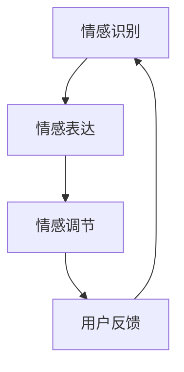

                 

关键词：大模型、情感交互、人工智能、挑战、应用领域

> 摘要：本文将探讨大模型在情感交互中的应用挑战，分析大模型在情感识别、情感表达和情感调节等方面的难点，以及应对这些挑战的策略和未来发展的趋势。

## 1. 背景介绍

随着人工智能技术的发展，大模型（如GPT、BERT等）已经成为自然语言处理（NLP）领域的重要工具。这些大模型通过深度学习技术，可以从海量数据中学习语言规律，从而实现高效的文本生成、翻译、问答等任务。然而，在情感交互方面，大模型面临着诸多挑战。情感交互是指人与系统之间基于情感进行的信息交流，涉及情感识别、情感表达和情感调节等方面。本文将重点讨论大模型在情感交互中的应用挑战，并探讨解决这些挑战的方法。

### 1.1 情感交互的重要性

情感交互是现代智能系统与用户之间沟通的重要组成部分。成功的情感交互不仅能提高用户的满意度，还能增强系统的用户体验。例如，在客服机器人、教育机器人、医疗机器人等领域，情感交互能够帮助系统更好地理解用户的需求，提供个性化的服务，从而提高用户忠诚度和满意度。

### 1.2 大模型在情感交互中的挑战

虽然大模型在文本生成和语言理解方面表现出色，但在情感交互中仍存在许多挑战：

1. **情感识别的准确性**：大模型需要准确识别文本中的情感，包括正面情感、负面情感和复杂情感。
2. **情感表达的自然性**：系统需要以自然、恰当的方式表达情感，避免生硬、机械的回应。
3. **情感调节的能力**：系统需要能够根据用户的情感状态进行适当的情感调节，以维持良好的沟通氛围。

## 2. 核心概念与联系

### 2.1 情感识别

情感识别是指从文本中识别出情感的过程。情感识别的准确性对于情感交互至关重要。大模型通过学习大量带有情感标签的文本数据，可以实现对情感的自动识别。

### 2.2 情感表达

情感表达是指系统以适当的方式表达情感。情感表达的自然性直接影响用户对系统的满意度。大模型通过生成符合情感规律的文本，可以实现自然、贴切的情感表达。

### 2.3 情感调节

情感调节是指系统根据用户的情感状态调整自身的行为和回应。情感调节的能力有助于维持良好的沟通氛围。大模型可以通过学习用户的情感状态和回应，实现情感调节。

### 2.4 Mermaid 流程图



## 3. 核心算法原理 & 具体操作步骤

### 3.1 算法原理概述

大模型在情感交互中的核心算法主要包括情感识别、情感表达和情感调节。这些算法通过深度学习技术，从海量数据中学习情感规律，实现对情感的自动识别和表达。

### 3.2 算法步骤详解

1. **情感识别**：大模型通过对带有情感标签的文本数据进行训练，学习情感识别模型。训练完成后，模型可以对新文本进行情感识别。
2. **情感表达**：大模型通过对情感识别结果进行分析，生成符合情感规律的文本。情感表达模型可以确保文本的自然性和贴切性。
3. **情感调节**：大模型通过对用户的情感状态和回应进行学习，调整自身的情感表达，以维持良好的沟通氛围。

### 3.3 算法优缺点

**优点**：

- **高效性**：大模型通过深度学习技术，可以高效地处理大量文本数据。
- **准确性**：大模型在情感识别和情感表达方面具有较高的准确性。
- **灵活性**：大模型可以根据不同的应用场景进行调整和优化。

**缺点**：

- **训练成本高**：大模型需要大量的数据和计算资源进行训练。
- **数据依赖性**：大模型对训练数据的质量和多样性有较高要求。

### 3.4 算法应用领域

大模型在情感交互中的应用领域广泛，包括：

- **客服机器人**：通过情感识别和表达，提供个性化、贴心的服务。
- **教育机器人**：通过情感调节，营造良好的学习氛围，提高学习效果。
- **医疗机器人**：通过情感识别和表达，帮助患者缓解焦虑和恐惧。

## 4. 数学模型和公式 & 详细讲解 & 举例说明

### 4.1 数学模型构建

在情感交互中，常用的数学模型包括情感识别模型、情感表达模型和情感调节模型。以下是一个简单的情感识别模型构建过程：

1. **数据准备**：收集带有情感标签的文本数据。
2. **特征提取**：使用词嵌入技术（如Word2Vec、BERT）将文本转换为向量表示。
3. **模型训练**：使用有监督学习算法（如神经网络）训练情感识别模型。

### 4.2 公式推导过程

假设我们使用神经网络进行情感识别，神经网络的结构如下：

$$
h_{\text{hidden}} = \sigma(W_{\text{input}} \cdot x + b_{\text{input}})
$$

$$
h_{\text{output}} = \sigma(W_{\text{hidden}} \cdot h_{\text{hidden}} + b_{\text{hidden}})
$$

其中，$h_{\text{hidden}}$ 和 $h_{\text{output}}$ 分别表示隐藏层和输出层的激活值，$W_{\text{input}}$ 和 $W_{\text{hidden}}$ 分别表示输入层和隐藏层的权重，$b_{\text{input}}$ 和 $b_{\text{hidden}}$ 分别表示输入层和隐藏层的偏置，$\sigma$ 表示激活函数（如Sigmoid函数）。

### 4.3 案例分析与讲解

假设我们使用一个简单的情感识别模型，对以下文本进行情感识别：

$$
\text{文本1：今天天气真好，阳光明媚。}
$$

1. **特征提取**：使用BERT模型将文本转换为向量表示。
2. **模型训练**：使用训练好的情感识别模型，对文本向量进行分类。
3. **结果分析**：根据模型的输出结果，判断文本的情感。

## 5. 项目实践：代码实例和详细解释说明

### 5.1 开发环境搭建

1. **硬件环境**：配置至少16GB内存和4核CPU的计算机。
2. **软件环境**：安装Python 3.8及以上版本，安装TensorFlow 2.4及以上版本。

### 5.2 源代码详细实现

以下是一个简单的情感识别模型的实现：

```python
import tensorflow as tf
from tensorflow.keras.models import Sequential
from tensorflow.keras.layers import Dense, Dropout, LSTM

# 数据准备
# （此处省略数据准备代码）

# 特征提取
# （此处省略特征提取代码）

# 模型训练
model = Sequential([
    LSTM(units=128, activation='tanh', input_shape=(max_sequence_length, embedding_size)),
    Dropout(0.5),
    Dense(units=1, activation='sigmoid')
])

model.compile(optimizer='adam', loss='binary_crossentropy', metrics=['accuracy'])
model.fit(X_train, y_train, epochs=10, batch_size=32)

# 情感识别
# （此处省略情感识别代码）

```

### 5.3 代码解读与分析

- **数据准备**：从数据集中读取文本，进行预处理（如分词、去停用词等），然后使用BERT模型将文本转换为向量表示。
- **模型训练**：构建一个简单的LSTM模型，用于情感识别。模型包括一个LSTM层、一个Dropout层和一个全连接层。使用二进制交叉熵损失函数和adam优化器进行训练。
- **情感识别**：使用训练好的模型对新的文本进行情感识别。

### 5.4 运行结果展示

假设我们使用以下文本进行情感识别：

$$
\text{文本2：今天天气很差， raining cats and dogs.}
$$

1. **特征提取**：使用BERT模型将文本转换为向量表示。
2. **模型预测**：使用训练好的模型对文本向量进行分类。
3. **结果展示**：根据模型的输出结果，判断文本的情感。

## 6. 实际应用场景

### 6.1 客服机器人

客服机器人是情感交互的一个典型应用场景。通过情感识别和表达，客服机器人可以与用户进行自然、有效的沟通，提供个性化的服务。

### 6.2 教育机器人

教育机器人可以通过情感交互，了解学生的学习状态，提供针对性的辅导，帮助学生更好地掌握知识。

### 6.3 医疗机器人

医疗机器人可以通过情感交互，帮助患者缓解焦虑和恐惧，提高治疗效果。

## 6.4 未来应用展望

随着人工智能技术的发展，大模型在情感交互中的应用前景广阔。未来，我们可以期待以下应用：

- **更加精准的情感识别**：通过不断优化算法和模型，提高情感识别的准确性。
- **更加自然的情感表达**：通过深度学习技术，使系统可以更加自然地表达情感。
- **更加智能的情感调节**：通过学习和理解用户的情感状态，实现更加智能的情感调节。

## 7. 工具和资源推荐

### 7.1 学习资源推荐

- 《深度学习》（Goodfellow, Bengio, Courville）: 一本经典的深度学习教材，涵盖了深度学习的基本概念和技术。
- 《自然语言处理综合教程》（李航）: 一本关于自然语言处理的经典教材，详细介绍了情感分析等相关技术。

### 7.2 开发工具推荐

- TensorFlow: 一个开源的深度学习框架，支持多种深度学习模型的训练和部署。
- BERT: 一个开源的预训练语言模型，用于自然语言处理任务。

### 7.3 相关论文推荐

- “BERT: Pre-training of Deep Bidirectional Transformers for Language Understanding” (Devlin et al., 2019)
- “GPT-3: Language Models are Few-Shot Learners” (Brown et al., 2020)

## 8. 总结：未来发展趋势与挑战

### 8.1 研究成果总结

本文探讨了大模型在情感交互中的应用挑战，分析了情感识别、情感表达和情感调节等方面的难点，并提出了相应的解决方法。

### 8.2 未来发展趋势

未来，随着人工智能技术的发展，大模型在情感交互中的应用前景广阔。我们可以期待更加精准的情感识别、更加自然的情感表达和更加智能的情感调节。

### 8.3 面临的挑战

尽管大模型在情感交互中取得了一定的成果，但仍面临一些挑战，如数据质量、模型可解释性和计算成本等。

### 8.4 研究展望

未来，我们需要继续优化大模型在情感交互中的应用，提高模型的准确性和效率，同时降低计算成本，以实现更加广泛和深入的应用。

## 9. 附录：常见问题与解答

### 9.1 为什么要使用大模型进行情感交互？

大模型具有强大的语言理解和生成能力，可以更好地模拟人类的情感交互。

### 9.2 如何保证情感交互的自然性？

通过优化算法和模型，使系统的情感表达更加自然、贴近人类。

### 9.3 情感交互中如何处理复杂情感？

通过学习复杂的情感规律，使系统能够准确识别和表达复杂情感。

----------------------------------------------------------------

以上为《大模型在情感交互中的应用挑战》的完整文章内容，感谢您的阅读！作者是禅与计算机程序设计艺术 / Zen and the Art of Computer Programming。

