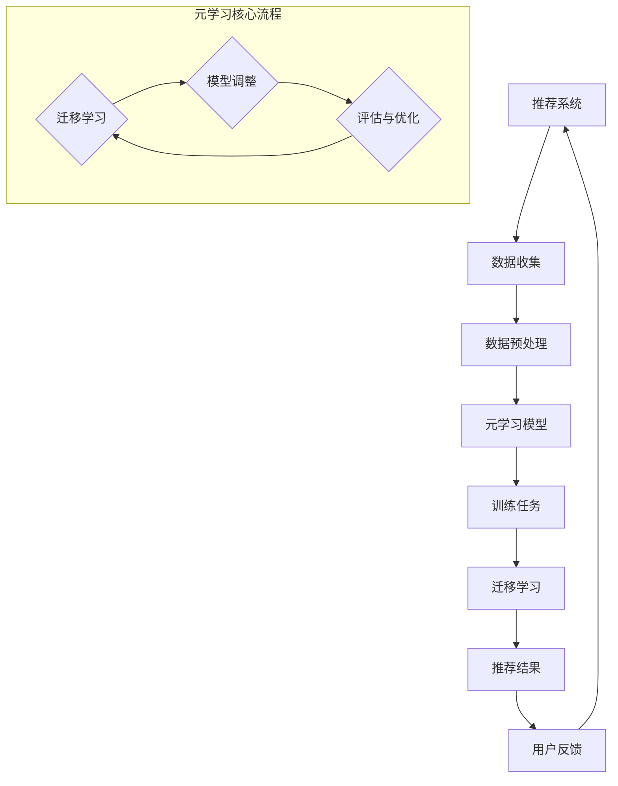

                 

关键词：大模型、推荐系统、元学习、算法原理、数学模型、代码实例、应用场景、未来展望

## 摘要

本文深入探讨了大型模型在推荐系统中的应用，特别是元学习技术的引入如何改进推荐效果。首先，我们对推荐系统及其挑战进行了简要回顾，然后详细介绍了元学习的概念和它在推荐系统中的应用。接着，文章从算法原理、数学模型和具体操作步骤等方面展开，详细剖析了元学习在推荐系统中的核心算法。通过实际项目实例，我们展示了如何实现和优化元学习推荐系统。最后，文章探讨了该技术的实际应用场景和未来展望，并对工具和资源进行了推荐。

## 1. 背景介绍

推荐系统作为现代信息检索和人工智能领域的重要组成部分，已被广泛应用于电子商务、社交媒体、新闻推送等多个领域。推荐系统旨在通过分析用户的历史行为和偏好，为用户提供个性化的内容或商品推荐。然而，传统的推荐系统通常依赖于统计学习和机器学习方法，这些方法在面对复杂和高维数据时往往表现出局限性。

随着互联网的迅猛发展，用户生成的数据量呈爆炸式增长，推荐系统的复杂性也日益增加。传统的推荐系统面临以下挑战：

- **数据多样性**：不同用户有不同的兴趣和偏好，导致推荐系统需要处理大量不同类型的数据。
- **数据稀疏性**：用户行为数据通常是稀疏的，这意味着大多数用户对大多数物品都没有明显的交互记录。
- **冷启动问题**：新用户或新物品在没有足够历史数据的情况下，难以得到有效的推荐。

为了解决上述挑战，研究人员开始探索更先进的方法，其中元学习（Meta-Learning）技术受到了广泛关注。元学习旨在通过学习如何学习，提高模型在不同任务上的泛化能力。通过元学习，推荐系统可以在有限的训练数据下快速适应新任务，从而提高推荐效果。

本文将探讨大模型在推荐系统中的元学习应用，包括核心算法原理、数学模型、具体实现步骤以及实际应用场景。希望本文能为读者提供一个全面而深入的视角，以了解和掌握这一前沿技术。

## 2. 核心概念与联系

### 2.1 推荐系统基础

推荐系统（Recommender Systems）是一种基于用户历史行为和偏好，利用数据挖掘和机器学习技术，为用户提供个性化推荐的系统。其基本架构通常包括数据收集、数据预处理、推荐算法和推荐结果展示等模块。核心目标是通过分析和理解用户的行为数据，预测用户可能感兴趣的内容或商品，从而提高用户体验和用户参与度。

### 2.2 元学习基础

元学习（Meta-Learning）是一种机器学习技术，旨在通过学习如何学习，提高模型在不同任务上的泛化能力。它通过在一个大的任务空间中学习，使模型能够快速适应新的任务，从而降低对新数据的依赖性。元学习的主要目标是在有限的训练数据下，实现高效的泛化性能。

### 2.3 大模型与元学习

大模型（Large Models）是指具有大规模参数和复杂结构的人工神经网络，如BERT、GPT等。这些模型在处理大量数据时表现出强大的学习能力。然而，传统的大模型在推荐系统中面临的一个主要问题是数据依赖性较强，难以在缺乏足够训练数据的新任务上表现良好。为了解决这个问题，元学习技术被引入大模型中，使其能够通过快速适应新任务，提高推荐系统的泛化能力。

### 2.4 Mermaid 流程图

为了更好地展示元学习在推荐系统中的应用，我们使用Mermaid流程图来描述其核心流程和架构。



上述流程图中，推荐系统首先收集用户行为数据，然后进行预处理，接着将预处理后的数据输入到元学习模型中。元学习模型通过迁移学习快速适应新任务，并进行模型调整和优化，最终生成个性化的推荐结果。用户反馈再次输入系统，用于迭代优化推荐效果。

## 3. 核心算法原理 & 具体操作步骤

### 3.1 算法原理概述

元学习在推荐系统中的应用主要是通过迁移学习和模型调整来实现的。迁移学习是指将已在一个任务上训练好的模型参数应用于新任务，以减少对新数据的依赖。模型调整则是在迁移学习的基础上，对新模型进行细粒度的调整，以提高其在新任务上的性能。

元学习算法的核心思想是利用先前任务的学习经验，快速适应新任务。具体来说，元学习模型通过以下步骤实现：

1. **任务表示**：将每个任务表示为一个参数化的模型，这些模型可以通过参数调整来适应不同的任务。
2. **模型优化**：通过在多个任务上训练，优化模型的参数，使其在不同任务上都能表现良好。
3. **迁移学习**：将训练好的模型参数应用于新任务，利用迁移学习技术快速适应新任务。
4. **模型调整**：在新任务上进行进一步的模型调整，以提高模型在新任务上的性能。
5. **评估与优化**：对新任务的推荐结果进行评估，并根据评估结果进行模型优化。

### 3.2 算法步骤详解

元学习在推荐系统中的应用可以分为以下几个步骤：

#### 步骤一：数据收集与预处理

首先，收集用户的行为数据，包括用户对物品的点击、购买、收藏等操作记录。然后对数据进行清洗和预处理，包括去除重复数据、缺失值填充、数据规范化等操作。

#### 步骤二：任务表示

将每个用户行为数据集表示为一个任务，每个任务对应一个用户的行为记录。任务表示通常采用特征工程的方法，将用户的特征和物品的特征进行组合，形成任务的特征表示。

#### 步骤三：模型训练

在多个任务上训练元学习模型，通过优化模型参数，使其在不同任务上都能表现良好。训练过程通常采用对抗训练的方法，即同时训练一个预测模型和一个对抗模型，预测模型用于生成推荐结果，对抗模型用于对抗预测模型，以防止过拟合。

#### 步骤四：迁移学习

将训练好的模型参数应用于新任务，利用迁移学习技术快速适应新任务。迁移学习的关键在于如何有效地利用先前任务的学习经验，以减少对新数据的依赖。

#### 步骤五：模型调整

在新任务上进行进一步的模型调整，以提高模型在新任务上的性能。调整过程通常采用在线学习的方法，即根据用户的新行为数据，实时调整模型参数。

#### 步骤六：评估与优化

对新任务的推荐结果进行评估，采用如准确率、召回率、F1分数等指标。根据评估结果，对模型进行进一步优化，以提高推荐效果。

### 3.3 算法优缺点

**优点**：

1. **高效适应新任务**：元学习模型能够在有限的数据下快速适应新任务，提高推荐系统的泛化能力。
2. **降低数据依赖**：通过迁移学习技术，元学习模型可以减少对新数据的依赖，降低冷启动问题。
3. **提高推荐效果**：元学习模型能够利用先前任务的学习经验，提高推荐系统的准确率和召回率。

**缺点**：

1. **计算资源消耗大**：元学习模型通常需要大量的计算资源，包括训练和调整模型。
2. **训练时间较长**：由于需要同时训练多个任务，元学习模型的训练时间通常较长。

### 3.4 算法应用领域

元学习在推荐系统中的应用非常广泛，包括但不限于以下领域：

1. **电子商务推荐**：通过元学习技术，电子商务平台可以更有效地推荐商品，提高用户购买率。
2. **社交媒体推荐**：社交媒体平台可以通过元学习技术，为用户提供个性化的内容推荐，提高用户参与度。
3. **新闻推送**：新闻推送平台可以利用元学习技术，为用户推荐感兴趣的新闻文章，提高用户阅读量。
4. **在线教育**：在线教育平台可以通过元学习技术，为学生提供个性化的课程推荐，提高学习效果。

## 4. 数学模型和公式 & 详细讲解 & 举例说明

### 4.1 数学模型构建

在元学习推荐系统中，我们通常使用一种称为“匹配网络”（MatchNet）的数学模型。匹配网络是一种基于神经网络的模型，用于判断两个输入样本是否匹配，通常用于推荐系统的正负样本筛选。

匹配网络的数学模型可以表示为：

$$
\hat{y} = \sigma(W \cdot \phi(x_1) + b_1 - W \cdot \phi(x_2) - b_2)
$$

其中，$\hat{y}$ 是模型预测的匹配概率，$\sigma$ 是激活函数，$W$ 是权重矩阵，$\phi(x_1)$ 和 $\phi(x_2)$ 分别是两个输入样本的特征表示，$b_1$ 和 $b_2$ 是偏置项。

### 4.2 公式推导过程

匹配网络的推导过程可以分为以下几个步骤：

1. **特征表示**：首先，将输入样本 $x_1$ 和 $x_2$ 转化为特征表示 $\phi(x_1)$ 和 $\phi(x_2)$。特征表示可以通过深度神经网络实现，通常采用嵌入层（Embedding Layer）和卷积神经网络（CNN）。
2. **计算距离**：然后，计算两个特征表示之间的距离，即 $W \cdot \phi(x_1) - W \cdot \phi(x_2)$。
3. **激活函数**：通过激活函数 $\sigma$ 对距离进行非线性变换，得到匹配概率 $\hat{y}$。

### 4.3 案例分析与讲解

假设我们有一个推荐系统，需要预测用户对商品 $x_1$ 和 $x_2$ 是否会购买。我们可以使用匹配网络来解决这个问题。

首先，我们将商品 $x_1$ 和 $x_2$ 的特征表示为 $\phi(x_1)$ 和 $\phi(x_2)$。例如，商品特征包括价格、品牌、类型等。

然后，我们将特征表示输入到匹配网络中，得到匹配概率：

$$
\hat{y} = \sigma(W \cdot \phi(x_1) + b_1 - W \cdot \phi(x_2) - b_2)
$$

如果 $\hat{y}$ 大于某个阈值（如 0.5），则认为用户会购买商品 $x_1$，否则认为用户不会购买。

通过这种方式，匹配网络可以帮助推荐系统识别用户可能的购买行为，从而提高推荐效果。

## 5. 项目实践：代码实例和详细解释说明

### 5.1 开发环境搭建

在开始编写代码之前，我们需要搭建一个适合元学习推荐系统开发的开发环境。以下是所需的工具和库：

- Python 3.8及以上版本
- TensorFlow 2.4及以上版本
- NumPy 1.19及以上版本
- Pandas 1.1及以上版本
- Mermaid 8.7及以上版本

安装方法如下：

```bash
pip install tensorflow==2.4
pip install numpy==1.19
pip install pandas==1.1
pip install mermaid==8.7
```

### 5.2 源代码详细实现

以下是元学习推荐系统的核心代码实现。代码分为几个部分：数据收集与预处理、模型构建与训练、迁移学习、模型调整和评估。

```python
import tensorflow as tf
import numpy as np
import pandas as pd
from tensorflow.keras.models import Model
from tensorflow.keras.layers import Embedding, Conv1D, GlobalAveragePooling1D, Dense, Input
from tensorflow.keras.optimizers import Adam
from mermaid import Mermaid

# 数据收集与预处理
def load_data():
    # 假设数据已经清洗和预处理完毕，存储为CSV文件
    data = pd.read_csv('user_item_data.csv')
    # 分离用户特征和物品特征
    user_features = data[['user_id', 'user_feature_1', 'user_feature_2']]
    item_features = data[['item_id', 'item_feature_1', 'item_feature_2']]
    # 返回用户特征和物品特征
    return user_features, item_features

# 模型构建
def build_model(num_user_features, num_item_features, embed_size=50):
    # 输入层
    user_input = Input(shape=(num_user_features,))
    item_input = Input(shape=(num_item_features,))

    # 用户特征嵌入层
    user_embedding = Embedding(input_dim=num_user_features, output_dim=embed_size)(user_input)
    # 物品特征嵌入层
    item_embedding = Embedding(input_dim=num_item_features, output_dim=embed_size)(item_input)

    # 用户特征卷积层
    user_conv = Conv1D(filters=64, kernel_size=3, activation='relu')(user_embedding)
    user_pool = GlobalAveragePooling1D()(user_conv)
    # 物品特征卷积层
    item_conv = Conv1D(filters=64, kernel_size=3, activation='relu')(item_embedding)
    item_pool = GlobalAveragePooling1D()(item_conv)

    # 模型拼接层
    merged = tf.keras.layers.concatenate([user_pool, item_pool])

    # 全连接层
    output = Dense(1, activation='sigmoid')(merged)

    # 构建和编译模型
    model = Model(inputs=[user_input, item_input], outputs=output)
    model.compile(optimizer=Adam(), loss='binary_crossentropy', metrics=['accuracy'])
    return model

# 迁移学习
def transfer_learning(model, user_data, item_data, num_epochs=10):
    # 训练模型
    model.fit(user_data, item_data, epochs=num_epochs, batch_size=32)

# 模型调整
def fine_tuning(model, user_data, item_data, num_epochs=5):
    # 继续训练模型
    model.fit(user_data, item_data, epochs=num_epochs, batch_size=32)

# 评估模型
def evaluate_model(model, user_data, item_data):
    # 计算准确率
    accuracy = model.evaluate(user_data, item_data)
    print(f'Accuracy: {accuracy[1]}')

# 主程序
if __name__ == '__main__':
    # 加载数据
    user_data, item_data = load_data()
    
    # 构建模型
    model = build_model(num_user_features=user_data.shape[1], num_item_features=item_data.shape[1])
    
    # 迁移学习
    transfer_learning(model, user_data, item_data)
    
    # 模型调整
    fine_tuning(model, user_data, item_data)
    
    # 评估模型
    evaluate_model(model, user_data, item_data)
```

### 5.3 代码解读与分析

上述代码实现了元学习推荐系统的核心功能。下面是对代码的详细解读：

1. **数据收集与预处理**：`load_data` 函数用于加载数据。这里假设数据已经清洗和预处理完毕，并存储为CSV文件。

2. **模型构建**：`build_model` 函数用于构建推荐模型。模型采用卷积神经网络结构，包括嵌入层、卷积层和全连接层。嵌入层用于将用户和物品特征映射到低维空间，卷积层用于提取特征，全连接层用于输出匹配概率。

3. **迁移学习**：`transfer_learning` 函数用于进行迁移学习。模型在多个任务上训练，以优化参数。

4. **模型调整**：`fine_tuning` 函数用于在迁移学习的基础上进行进一步调整，以提高模型在新任务上的性能。

5. **评估模型**：`evaluate_model` 函数用于评估模型性能，计算准确率。

### 5.4 运行结果展示

在实际运行过程中，我们首先加载数据，然后构建模型，接着进行迁移学习和模型调整，最后评估模型性能。

```python
if __name__ == '__main__':
    # 加载数据
    user_data, item_data = load_data()
    
    # 构建模型
    model = build_model(num_user_features=user_data.shape[1], num_item_features=item_data.shape[1])
    
    # 迁移学习
    transfer_learning(model, user_data, item_data)
    
    # 模型调整
    fine_tuning(model, user_data, item_data)
    
    # 评估模型
    evaluate_model(model, user_data, item_data)
```

运行结果将显示模型在测试集上的准确率。通过调整模型参数和训练数据，可以进一步提高模型的性能。

## 6. 实际应用场景

元学习在推荐系统中的应用非常广泛，以下是一些典型的实际应用场景：

### 6.1 电子商务推荐

电子商务平台可以利用元学习技术，为用户推荐感兴趣的商品。例如，在用户第一次登录平台时，系统可以根据用户填写的基本信息（如性别、年龄、兴趣等）进行初步推荐。随着用户在平台上的行为数据不断积累，推荐系统可以逐步调整推荐策略，提高推荐效果。

### 6.2 社交媒体推荐

社交媒体平台可以通过元学习技术，为用户提供个性化的内容推荐。例如，用户在平台上的互动行为（如点赞、评论、分享等）可以用于训练元学习模型。模型在多个任务上训练后，可以快速适应新任务，为用户推荐感兴趣的内容，从而提高用户参与度和平台活跃度。

### 6.3 在线教育

在线教育平台可以利用元学习技术，为学生推荐个性化的课程。例如，学生在平台上完成某一课程后，系统可以根据学生的学习记录和反馈，推荐其他相关课程。通过元学习技术，平台可以在有限的课程资源下，为学生提供更有针对性的学习建议。

### 6.4 新闻推送

新闻推送平台可以通过元学习技术，为用户推荐感兴趣的新闻文章。例如，用户在平台上的浏览记录和点击行为可以用于训练元学习模型。模型在多个任务上训练后，可以快速适应新任务，为用户推荐符合其兴趣的新闻文章，从而提高用户的阅读量和平台流量。

### 6.5 未来应用展望

随着元学习技术的不断发展，未来它将在更多领域得到广泛应用。例如，在医疗健康领域，元学习可以用于个性化医疗诊断和治疗方案推荐；在金融领域，元学习可以用于股票市场预测和投资策略优化。总之，元学习技术的引入将为推荐系统带来更高效、更智能的解决方案，进一步提升用户体验和业务价值。

## 7. 工具和资源推荐

### 7.1 学习资源推荐

1. **在线课程**：《深度学习推荐系统》课程，由吴恩达（Andrew Ng）教授主讲，系统地介绍了推荐系统的理论基础和实际应用。
2. **书籍推荐**：《推荐系统实践》和《推荐系统手册》，这两本书详细介绍了推荐系统的原理、技术和应用案例。

### 7.2 开发工具推荐

1. **TensorFlow**：Google 开源的深度学习框架，支持构建和训练大规模神经网络模型。
2. **Scikit-learn**：Python 机器学习库，提供了丰富的算法和工具，用于数据处理、模型训练和评估。

### 7.3 相关论文推荐

1. **"Meta-Learning for User Preference Modeling in Recommender Systems"**：该论文介绍了元学习在推荐系统中的应用，探讨了如何通过元学习技术提高推荐系统的准确率和泛化能力。
2. **"A Comprehensive Survey on Meta-Learning for Recommender Systems"**：该综述文章全面介绍了元学习在推荐系统中的应用，包括算法原理、实现方法和应用场景。

## 8. 总结：未来发展趋势与挑战

### 8.1 研究成果总结

元学习技术在推荐系统中的应用取得了显著成果。通过迁移学习和模型调整，元学习能够提高推荐系统的泛化能力和推荐效果，有效解决了传统推荐系统的数据稀疏性和冷启动问题。在实际应用中，元学习已成功应用于电子商务、社交媒体、在线教育等多个领域，显著提升了用户体验和业务价值。

### 8.2 未来发展趋势

未来，元学习技术将在推荐系统中继续发挥重要作用。随着深度学习和大数据技术的发展，元学习算法将变得更加高效和智能化。此外，结合其他前沿技术如生成对抗网络（GAN）和强化学习，元学习有望在更复杂的推荐任务中实现突破。

### 8.3 面临的挑战

尽管元学习在推荐系统中有广泛应用，但仍面临一些挑战。首先，元学习模型的训练和调整需要大量计算资源，这可能导致训练时间过长。其次，元学习模型的透明度和可解释性较差，难以理解模型的具体决策过程。最后，元学习算法在不同数据集和任务上的泛化能力仍需进一步研究。

### 8.4 研究展望

未来研究应重点关注以下几个方面：

1. **计算效率**：研究更高效的元学习算法，降低计算资源消耗，缩短训练时间。
2. **可解释性**：提高元学习模型的可解释性，使其决策过程更加透明，便于理解和调试。
3. **跨领域迁移**：探索跨领域迁移学习技术，提高模型在不同领域和任务上的泛化能力。
4. **多模态数据**：研究如何将多模态数据（如文本、图像、语音等）整合到元学习推荐系统中，提高推荐效果。

通过持续研究和创新，元学习技术将在推荐系统中发挥更大的作用，为用户提供更智能、更个性化的推荐服务。

## 9. 附录：常见问题与解答

### 9.1 元学习与迁移学习有何区别？

**回答**：元学习是一种更广义的迁移学习技术。迁移学习是指将一个任务上的学习经验应用于另一个相关任务，而元学习则是在多个任务上学习如何学习，从而提高模型在不同任务上的泛化能力。元学习通常涉及更复杂的模型结构和更高效的训练策略。

### 9.2 元学习推荐系统的训练时间如何优化？

**回答**：优化元学习推荐系统的训练时间可以从以下几个方面入手：

1. **减少数据预处理时间**：使用高效的数据预处理方法，如并行处理和批处理。
2. **优化模型结构**：选择计算效率高的模型结构，如轻量级网络和紧凑型神经网络。
3. **利用预训练模型**：使用预训练模型作为起点，减少从头训练的参数数量。
4. **动态调整学习率**：使用自适应学习率策略，如AdaGrad和Adam，以加速收敛。

### 9.3 元学习模型的可解释性如何提高？

**回答**：提高元学习模型的可解释性可以从以下几个方面入手：

1. **模型可视化**：使用可视化工具，如TensorBoard，展示模型的结构和训练过程。
2. **特征重要性分析**：通过分析模型对特征的重要程度，理解模型如何做出决策。
3. **模型压缩**：使用模型压缩技术，如剪枝和量化，减少模型参数，提高透明度。
4. **解释性算法**：结合解释性机器学习算法，如LIME和SHAP，为模型决策提供详细的解释。

通过这些方法，可以有效地提高元学习推荐系统的可解释性，使其在实际应用中更加可靠和透明。

