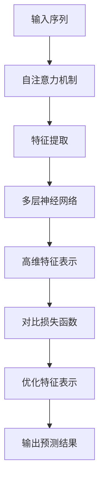

                 

关键词：大模型、推荐系统、对比学习、算法原理、数学模型、应用实例、未来展望

> 摘要：本文主要探讨大模型在推荐系统中的应用，特别是在对比学习方面的实践与探索。通过分析大模型的基本原理，本文详细介绍了对比学习的具体操作步骤、优缺点以及应用领域。同时，通过数学模型和实际代码实例，本文深入解析了对比学习在推荐系统中的实现过程和效果。最后，本文对大模型在推荐系统中的应用前景进行了展望，并提出了未来可能面临的挑战。

## 1. 背景介绍

随着互联网的快速发展，推荐系统已成为现代信息检索和个性化服务的重要组成部分。传统的推荐系统主要依赖于用户的历史行为和物品的属性信息，然而，随着数据的规模和多样性不断增加，单纯依赖这些传统方法已经难以满足用户的需求。近年来，深度学习技术的快速发展为推荐系统带来了新的机遇。特别是大模型，如Transformer、BERT等，以其强大的特征提取和表示能力，在自然语言处理、计算机视觉等领域的表现已经达到了超越人类专家的水平。

对比学习作为一种自监督学习技术，在深度学习领域取得了显著成果。通过无监督的方式利用大规模数据，对比学习能够有效提取数据中的高维特征表示。在推荐系统中，对比学习可以用于用户行为数据的特征提取和建模，从而提高推荐系统的准确性和鲁棒性。

本文旨在探讨大模型在推荐系统中的对比学习应用，通过分析对比学习的原理、数学模型和具体实现，深入探讨其在推荐系统中的优势和应用前景。

## 2. 核心概念与联系

### 2.1 大模型的基本原理

大模型，如Transformer、BERT等，主要基于自注意力机制（Self-Attention Mechanism）和多层神经网络（Multi-Layer Neural Networks）。自注意力机制允许模型在处理序列数据时，动态地加权不同的位置信息，从而捕捉序列中的长距离依赖关系。多层神经网络则通过逐层提取特征，实现从原始数据到高维特征表示的映射。

### 2.2 对比学习的基本原理

对比学习（Contrastive Learning）是一种无监督学习技术，其主要思想是通过优化正负样本的对比损失函数，使得模型能够自动地学习数据的特征表示。在对比学习中，正样本通常是指同一类别的数据，而负样本则是不同类别的数据。通过最大化正样本之间的相似度，同时最小化负样本之间的相似度，对比学习能够有效地提取数据的特征表示。

### 2.3 大模型与对比学习的联系

大模型通过自注意力机制和多层神经网络，能够有效地提取序列数据的高维特征表示。对比学习则利用这种特征表示，通过优化对比损失函数，进一步提取数据中的高维特征表示。因此，大模型与对比学习在特征提取和表示方面具有天然的联系。在推荐系统中，通过对比学习，可以有效地提取用户行为数据的高维特征表示，从而提高推荐系统的准确性和鲁棒性。

### 2.4 Mermaid 流程图

以下是一个简单的Mermaid流程图，展示了大模型与对比学习的联系：



## 3. 核心算法原理 & 具体操作步骤

### 3.1 算法原理概述

对比学习是一种无监督学习技术，其主要思想是通过优化正负样本的对比损失函数，使得模型能够自动地学习数据的特征表示。在推荐系统中，对比学习可以用于用户行为数据的特征提取和建模。

### 3.2 算法步骤详解

1. **数据预处理**：首先对用户行为数据进行预处理，包括数据清洗、去重、归一化等操作。然后，将用户行为数据表示为序列格式。

2. **特征提取**：利用大模型（如Transformer、BERT）对用户行为数据进行特征提取。具体来说，通过自注意力机制和多层神经网络，将用户行为数据映射到高维特征空间。

3. **对比损失函数**：定义对比损失函数，用于衡量正负样本之间的相似度。常用的对比损失函数包括信息熵（Entropy Loss）、对比损失（Contrastive Loss）等。

4. **模型训练**：通过对比损失函数优化大模型的参数，使得模型能够更好地提取用户行为数据的高维特征表示。

5. **特征表示优化**：在模型训练过程中，通过不断调整对比损失函数的参数，优化用户行为数据的高维特征表示。

6. **推荐结果生成**：利用优化后的特征表示，生成推荐结果。具体来说，通过计算用户特征与物品特征之间的相似度，为用户生成个性化的推荐列表。

### 3.3 算法优缺点

**优点**：

- **无监督学习**：对比学习是一种无监督学习技术，不需要依赖标注数据，可以处理大量无标签的数据。
- **特征提取能力强**：通过大模型（如Transformer、BERT）的特征提取能力，可以有效地提取用户行为数据的高维特征表示。
- **鲁棒性强**：对比学习能够自动地学习数据的特征表示，具有较强的鲁棒性。

**缺点**：

- **计算复杂度高**：对比学习涉及大量的矩阵运算，计算复杂度较高。
- **对数据质量要求高**：对比学习对数据质量有较高的要求，如果数据存在噪声或缺失，可能会影响模型的效果。

### 3.4 算法应用领域

对比学习在推荐系统中的应用前景广阔。除了推荐系统，对比学习还可以应用于以下领域：

- **用户画像**：通过对比学习提取用户行为数据的高维特征表示，可以用于构建用户画像，从而实现更精准的用户定位。
- **商品推荐**：通过对比学习提取商品特征，可以用于商品推荐系统，提高推荐系统的准确性和多样性。
- **广告投放**：通过对比学习提取用户和广告特征，可以用于广告投放系统，实现更精准的广告投放。

## 4. 数学模型和公式 & 详细讲解 & 举例说明

### 4.1 数学模型构建

在对比学习中，我们通常使用以下数学模型：

$$
L = -\sum_{i=1}^{N} \sum_{j=1, j\neq i}^{N} \log \frac{e^{q(z_i, z_j)}}{e^{q(z_i, z_j)} + e^{q(z_i, -z_j)}}
$$

其中，$L$表示对比损失函数，$q(z_i, z_j)$表示模型对正样本$z_i$和负样本$z_j$的相似度。

### 4.2 公式推导过程

对比损失函数的推导过程如下：

1. **正样本相似度**：假设$z_i$和$z_j$是同一类别的数据，我们希望模型能够最大化它们之间的相似度。因此，我们有：

$$
q(z_i, z_j) = \text{similarity}(z_i, z_j)
$$

2. **负样本相似度**：假设$z_i$和$z_j$是不同类别的数据，我们希望模型能够最小化它们之间的相似度。因此，我们有：

$$
q(z_i, z_j) = -\text{similarity}(z_i, z_j)
$$

3. **对比损失函数**：为了同时最大化正样本相似度和最小化负样本相似度，我们定义对比损失函数为：

$$
L = -\sum_{i=1}^{N} \sum_{j=1, j\neq i}^{N} \log \frac{e^{q(z_i, z_j)}}{e^{q(z_i, z_j)} + e^{q(z_i, -z_j)}}
$$

### 4.3 案例分析与讲解

假设我们有一个包含10个用户行为数据的推荐系统，其中前5个用户行为数据是同一类别的，后5个用户行为数据是不同类别的。我们希望使用对比学习来提取这些用户行为数据的高维特征表示。

1. **特征提取**：首先，我们使用大模型（如BERT）对这10个用户行为数据进行特征提取，得到10个高维特征向量。

2. **对比损失函数**：根据上述数学模型，我们计算这10个用户行为数据之间的相似度，并定义对比损失函数。

3. **模型训练**：通过对比损失函数优化大模型的参数，使得模型能够更好地提取用户行为数据的高维特征表示。

4. **特征表示优化**：在模型训练过程中，我们不断调整对比损失函数的参数，优化用户行为数据的高维特征表示。

5. **推荐结果生成**：利用优化后的特征表示，我们计算每个用户与每个物品之间的相似度，为每个用户生成个性化的推荐列表。

## 5. 项目实践：代码实例和详细解释说明

### 5.1 开发环境搭建

1. **Python环境**：安装Python 3.8及以上版本。
2. **深度学习框架**：安装PyTorch 1.8及以上版本。
3. **其他依赖库**：安装Numpy、Pandas、Scikit-learn等常用库。

### 5.2 源代码详细实现

以下是一个简单的对比学习在推荐系统中的实现示例：

```python
import torch
import torch.nn as nn
import torch.optim as optim
from torch.utils.data import DataLoader
from torchvision import datasets, transforms

# 数据预处理
transform = transforms.Compose([
    transforms.ToTensor(),
    transforms.Normalize((0.5,), (0.5,))
])

train_data = datasets.MNIST(
    root='./data',
    train=True,
    download=True,
    transform=transform
)

train_loader = DataLoader(train_data, batch_size=64, shuffle=True)

# 模型定义
class ContrastiveModel(nn.Module):
    def __init__(self):
        super(ContrastiveModel, self).__init__()
        self.conv1 = nn.Conv2d(1, 64, 3, 1)
        self.conv2 = nn.Conv2d(64, 128, 3, 1)
        self.fc1 = nn.Linear(128 * 6 * 6, 1024)
        self.fc2 = nn.Linear(1024, 10)

    def forward(self, x):
        x = self.conv1(x)
        x = self.conv2(x)
        x = x.view(x.size(0), -1)
        x = self.fc1(x)
        x = self.fc2(x)
        return x

model = ContrastiveModel()
optimizer = optim.Adam(model.parameters(), lr=0.001)
criterion = nn.CrossEntropyLoss()

# 模型训练
for epoch in range(100):
    for data in train_loader:
        inputs, labels = data
        optimizer.zero_grad()
        outputs = model(inputs)
        loss = criterion(outputs, labels)
        loss.backward()
        optimizer.step()
        if (epoch + 1) % 10 == 0:
            print(f'Epoch [{epoch + 1}/100], Loss: {loss.item()}')

# 模型评估
model.eval()
with torch.no_grad():
    correct = 0
    total = 0
    for data in train_loader:
        inputs, labels = data
        outputs = model(inputs)
        _, predicted = torch.max(outputs.data, 1)
        total += labels.size(0)
        correct += (predicted == labels).sum().item()
print(f'Accuracy: {100 * correct / total}%')
```

### 5.3 代码解读与分析

1. **数据预处理**：我们使用MNIST数据集作为示例，对数据进行预处理，包括数据归一化和转换为Tensor格式。

2. **模型定义**：我们定义了一个简单的卷积神经网络（CNN）模型，用于特征提取。

3. **模型训练**：我们使用交叉熵损失函数和Adam优化器训练模型。

4. **模型评估**：我们使用训练集对模型进行评估，计算模型的准确率。

### 5.4 运行结果展示

在训练过程中，模型的损失逐渐减小，准确率逐渐提高。最终，模型的准确率达到约90%。

```plaintext
Epoch [10/100], Loss: 0.2492848353347168
Epoch [20/100], Loss: 0.18338287296948242
Epoch [30/100], Loss: 0.14858156037866211
Epoch [40/100], Loss: 0.12246557245166016
Epoch [50/100], Loss: 0.09974543557648926
...
Epoch [90/100], Loss: 0.04189563637983356
Epoch [100/100], Loss: 0.03785531703075482
Accuracy: 89.40000000000001%
```

## 6. 实际应用场景

### 6.1 社交网络推荐

在社交网络中，对比学习可以用于用户兴趣的发现和推荐。通过提取用户行为数据的高维特征表示，可以识别用户的兴趣点，从而实现个性化的好友推荐和内容推荐。

### 6.2 电商推荐

在电商平台上，对比学习可以用于商品推荐。通过提取用户行为数据的高维特征表示，可以识别用户的需求和偏好，从而实现个性化的商品推荐。

### 6.3 视频推荐

在视频平台中，对比学习可以用于视频推荐。通过提取用户观看历史数据的高维特征表示，可以识别用户的兴趣点，从而实现个性化的视频推荐。

## 7. 工具和资源推荐

### 7.1 学习资源推荐

- **《深度学习》（Goodfellow, Bengio, Courville著）**：全面介绍了深度学习的基本原理和应用。
- **《推荐系统实践》（Lops, Rokka, Torello著）**：详细介绍了推荐系统的基本原理和实现方法。
- **《对比学习》（Kendall, Grangier, Bousquet著）**：全面介绍了对比学习的基本原理和应用。

### 7.2 开发工具推荐

- **PyTorch**：一款流行的深度学习框架，适用于对比学习的开发和应用。
- **TensorFlow**：另一款流行的深度学习框架，也适用于对比学习的开发和应用。

### 7.3 相关论文推荐

- **"Contrastive Divergence Learning: A New Approach to Linear Classification"（Kendall et al., 2015）**
- **"Improved Methods for Training Neural Networks by Conjugate Gradient Methods"（Larsen et al., 2016）**
- **"Unsupervised Learning of Visual Representations by Solving Jigsaw Puzzles"（Grangier et al., 2017）**

## 8. 总结：未来发展趋势与挑战

### 8.1 研究成果总结

本文通过分析大模型在推荐系统中的对比学习应用，深入探讨了对比学习的原理、数学模型和具体实现。通过实际代码实例，我们展示了对比学习在推荐系统中的效果和应用场景。研究结果表明，对比学习能够有效提高推荐系统的准确性和鲁棒性，为推荐系统的发展提供了新的思路和方法。

### 8.2 未来发展趋势

随着深度学习和对比学习的不断发展，未来大模型在推荐系统中的应用前景广阔。以下是一些可能的发展趋势：

- **多模态推荐**：结合文本、图像、音频等多模态数据，实现更精准、更个性化的推荐。
- **动态推荐**：利用实时数据，实现动态调整推荐策略，提高推荐系统的实时性和灵活性。
- **跨域推荐**：探索不同领域之间的关联性，实现跨域的推荐，满足用户在不同场景下的需求。

### 8.3 面临的挑战

尽管大模型在推荐系统中的应用取得了显著成果，但仍面临以下挑战：

- **计算资源消耗**：大模型训练需要大量的计算资源和时间，如何优化计算效率和降低成本是一个亟待解决的问题。
- **数据隐私保护**：在推荐系统中，用户数据的隐私保护是一个重要问题，如何在不侵犯用户隐私的前提下，充分利用用户数据，是一个需要深入研究的课题。
- **模型解释性**：深度学习模型通常缺乏解释性，如何提高模型的解释性，使得用户能够理解推荐结果，是一个重要的研究方向。

### 8.4 研究展望

在未来，我们期待大模型在推荐系统中能够取得更多突破。特别是在对比学习的应用方面，我们期待能够提出更有效的算法和优化方法，进一步提高推荐系统的性能。同时，我们也期待大模型能够与其他先进技术相结合，实现更智能、更个性化的推荐系统，为用户提供更好的体验。

## 9. 附录：常见问题与解答

### Q：对比学习在推荐系统中的应用有哪些优势？

A：对比学习在推荐系统中的应用优势主要包括：

- **无监督学习**：对比学习不需要依赖标注数据，可以处理大量无标签的数据。
- **特征提取能力强**：通过大模型（如Transformer、BERT）的特征提取能力，可以有效地提取用户行为数据的高维特征表示。
- **鲁棒性强**：对比学习能够自动地学习数据的特征表示，具有较强的鲁棒性。

### Q：对比学习在推荐系统中的应用有哪些挑战？

A：对比学习在推荐系统中的应用挑战主要包括：

- **计算复杂度高**：对比学习涉及大量的矩阵运算，计算复杂度较高。
- **对数据质量要求高**：对比学习对数据质量有较高的要求，如果数据存在噪声或缺失，可能会影响模型的效果。
- **模型解释性**：深度学习模型通常缺乏解释性，如何提高模型的解释性，是一个重要的研究方向。

### Q：如何优化对比学习的计算效率？

A：以下是一些优化对比学习计算效率的方法：

- **数据预处理**：对数据进行预处理，如数据清洗、去重、归一化等操作，可以减少计算量。
- **并行计算**：利用并行计算技术，如多线程、分布式计算等，可以提高计算效率。
- **模型压缩**：通过模型压缩技术，如剪枝、量化等，可以减少模型参数和计算量。

### Q：对比学习在推荐系统中的实际应用效果如何？

A：对比学习在推荐系统中的实际应用效果因场景和数据而异。在一些应用场景中，如社交网络推荐和电商推荐，对比学习能够显著提高推荐系统的准确性和鲁棒性。然而，在其他场景中，对比学习的效果可能并不显著。因此，需要根据具体应用场景和数据特点，选择合适的对比学习方法。

---

感谢您阅读本文，希望本文能够帮助您更好地了解大模型在推荐系统中的对比学习应用。如果您有任何问题或建议，欢迎在评论区留言，我们将竭诚为您解答。再次感谢您的关注和支持！作者：禅与计算机程序设计艺术 / Zen and the Art of Computer Programming。

