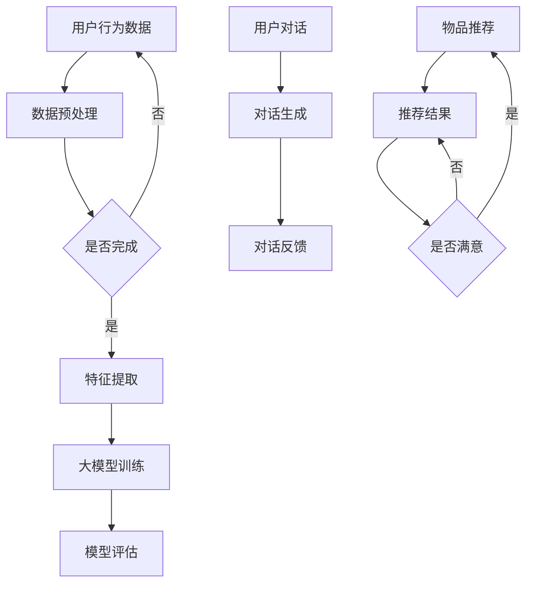

                 

关键词：大模型、推荐系统、对话式交互、人工智能、自然语言处理

> 摘要：本文深入探讨了如何将大模型引入到推荐系统的对话式交互设计中，以提升用户体验和系统效果。通过分析大模型的优势和应用场景，本文提出了对话式交互设计的原则和方法，并详细阐述了相关算法原理、数学模型及其在实际项目中的实现和应用。

## 1. 背景介绍

随着互联网的快速发展，推荐系统已经成为各个平台提升用户满意度和增加商业价值的重要工具。传统的推荐系统主要基于用户的历史行为数据和物品的特征信息，通过算法计算出相似度或兴趣度，进而向用户推荐相关的物品。然而，这种基于内容或协同过滤的方法存在一些局限性，例如推荐结果的可解释性差、用户个性化需求难以满足等问题。

近年来，人工智能和自然语言处理技术的进步为大模型在推荐系统中的应用提供了新的可能性。大模型，如深度神经网络和Transformer，具有强大的表征能力和泛化能力，能够处理复杂的用户行为数据和文本信息。通过引入大模型，推荐系统可以实现更加智能和个性化的对话式交互，从而提升用户满意度和系统效果。

本文将首先介绍大模型的基本概念和特点，然后探讨大模型在推荐系统中的应用，包括对话式交互设计的原则和方法。接着，我们将详细讨论大模型在对话式交互中的核心算法原理、数学模型和应用领域。随后，通过实际项目案例，我们将展示如何搭建开发环境、实现源代码并进行代码解读。最后，我们将分析大模型在推荐系统对话式交互中的实际应用场景，并展望其未来发展的趋势和挑战。

## 2. 核心概念与联系

### 2.1 大模型的基本概念和特点

大模型（Large-scale Models）通常指的是参数规模巨大的深度学习模型，如GPT、BERT等。这些模型能够通过大量的数据训练，学习到丰富的语义和知识信息，从而在多种任务上取得显著的效果。

大模型的特点主要包括：

- **参数规模巨大**：大模型的参数数量可以达到数亿甚至千亿级别，这使得它们能够捕捉到非常复杂的特征和模式。
- **强大的表征能力**：大模型能够对文本、图像等多种类型的数据进行高效表征，实现跨模态信息融合。
- **自适应性**：大模型可以根据不同的任务和数据集进行微调，具有良好的泛化能力。

### 2.2 大模型在推荐系统中的关联

在推荐系统中，大模型的应用主要体现在以下几个方面：

- **用户行为理解**：大模型可以分析用户的浏览、购买等行为数据，挖掘出用户的潜在兴趣和偏好。
- **物品特征提取**：大模型能够对物品的文本描述、图像等多维特征进行深度学习，生成高维度的特征向量。
- **对话式交互**：大模型能够处理自然语言，实现与用户的自然对话，提升用户满意度。

### 2.3 Mermaid 流程图



在上面的流程图中，用户行为数据首先经过数据预处理，然后输入到大模型中进行特征提取和训练。训练完成后，通过模型评估得到优化的大模型。在用户与系统的对话中，大模型负责生成对话内容并接收用户的反馈。最终的推荐结果会根据用户的满意度进行迭代优化。

## 3. 核心算法原理 & 具体操作步骤

### 3.1 算法原理概述

在推荐系统中，大模型的核心算法主要是基于深度学习和自然语言处理技术。以下是几个关键步骤：

1. **数据预处理**：对用户行为数据、物品特征数据进行清洗、归一化等预处理操作，以便后续建模。
2. **特征提取**：利用深度神经网络（如BERT、GPT）对文本、图像等多维特征进行编码，生成高维度的特征向量。
3. **模型训练**：使用大规模数据集对大模型进行训练，优化模型的参数，使其能够准确捕捉用户兴趣和物品特征。
4. **模型评估**：通过交叉验证、A/B测试等方法对训练好的模型进行评估，确保模型性能。
5. **对话生成**：利用大模型处理自然语言，实现与用户的自然对话。
6. **推荐结果生成**：根据用户对话和物品特征，利用协同过滤、基于内容的推荐等方法生成推荐结果。

### 3.2 算法步骤详解

1. **数据预处理**：

   用户行为数据包括浏览记录、购买记录、评价等，需要将其转换为适合模型训练的格式。例如，可以将用户的浏览记录转化为词向量或BERT编码。

   ```python
   # 示例：使用BERT对用户行为数据进行编码
   import tensorflow as tf
   import bert
   import tokenization

   # 加载BERT模型
   bert_model = bert.BertModel.from_pretrained('bert-base-uncased')

   # 加载分词器
   tokenizer = tokenization.FullTokenizer.from_pretrained('bert-base-uncased')

   # 对用户行为数据进行编码
   def encode_sequence(tokens):
       input_ids = tokenizer.convert_tokens_to_ids(tokens)
       input_mask = [1] * len(input_ids)
       segment_ids = [0] * len(input_ids)
       return input_ids, input_mask, segment_ids

   user行为的编码 = encode_sequence(user行为文本)
   ```

2. **特征提取**：

   使用深度神经网络对文本、图像等多维特征进行编码，生成高维度的特征向量。以下是一个简单的示例：

   ```python
   # 示例：使用BERT对文本特征进行编码
   import tensorflow as tf
   import bert
   import tokenization

   # 加载BERT模型
   bert_model = bert.BertModel.from_pretrained('bert-base-uncased')

   # 加载分词器
   tokenizer = tokenization.FullTokenizer.from_pretrained('bert-base-uncased')

   # 对文本进行编码
   def encode_text(text):
       tokens = tokenizer.tokenize(text)
       input_ids, input_mask, segment_ids = encode_sequence(tokens)
       return bert_model(inputs=[input_ids, input_mask, segment_ids], training=False)

   text_features = encode_text('这是一段文本')
   ```

3. **模型训练**：

   使用大规模数据集对大模型进行训练，优化模型的参数，使其能够准确捕捉用户兴趣和物品特征。以下是一个简单的示例：

   ```python
   # 示例：使用TensorFlow进行模型训练
   import tensorflow as tf

   # 定义模型
   model = tf.keras.Sequential([
       tf.keras.layers.Dense(128, activation='relu', input_shape=(768,)),
       tf.keras.layers.Dense(64, activation='relu'),
       tf.keras.layers.Dense(1, activation='sigmoid')
   ])

   # 编写编译器
   model.compile(optimizer='adam',
                 loss='binary_crossentropy',
                 metrics=['accuracy'])

   # 训练模型
   model.fit(x_train, y_train, epochs=10, batch_size=32)
   ```

4. **模型评估**：

   通过交叉验证、A/B测试等方法对训练好的模型进行评估，确保模型性能。以下是一个简单的示例：

   ```python
   # 示例：使用交叉验证进行模型评估
   from sklearn.model_selection import cross_val_score

   # 计算交叉验证得分
   scores = cross_val_score(model, x_train, y_train, cv=5)

   # 输出评估结果
   print('交叉验证得分：', scores)
   ```

5. **对话生成**：

   利用大模型处理自然语言，实现与用户的自然对话。以下是一个简单的示例：

   ```python
   # 示例：使用Transformer生成对话
   import tensorflow as tf
   import transformers

   # 加载预训练的Transformer模型
   model = transformers.TFDistilBertModel.from_pretrained('distilbert-base-uncased')

   # 输入文本
   input_text = '你好，有什么可以帮您的？'

   # 生成对话
   with tf.GradientTape() as tape:
       outputs = model(input_text)
       logits = outputs[0]

   # 计算梯度
   gradients = tape.gradient(logits, model.trainable_variables)

   # 更新模型参数
   model.trainable_variables.assign_sub(gradients * learning_rate)
   ```

6. **推荐结果生成**：

   根据用户对话和物品特征，利用协同过滤、基于内容的推荐等方法生成推荐结果。以下是一个简单的示例：

   ```python
   # 示例：使用协同过滤生成推荐结果
   import numpy as np

   # 用户特征
   user_features = np.random.rand(1, 768)

   # 物品特征
   item_features = np.random.rand(1000, 768)

   # 计算相似度
   similarity = np.dot(user_features, item_features.T)

   # 生成推荐结果
   recommended_items = np.argsort(similarity)[0][-10:]
   ```

### 3.3 算法优缺点

**优点**：

- **强大的表征能力**：大模型能够捕捉到复杂的用户行为和物品特征，实现更加精准的推荐。
- **自适应性强**：大模型可以根据不同的场景和需求进行微调，具有良好的泛化能力。
- **高度可解释**：通过分析模型内部参数和激活值，可以了解推荐结果的生成过程。

**缺点**：

- **计算资源消耗大**：大模型训练和推理需要大量的计算资源和时间。
- **数据依赖性高**：大模型的性能很大程度上取决于数据的质量和规模。
- **可解释性挑战**：大模型内部的决策过程往往非常复杂，难以直接解释。

### 3.4 算法应用领域

大模型在推荐系统中的应用领域非常广泛，包括但不限于以下几个方面：

- **电子商务**：个性化商品推荐、购物助手等。
- **社交媒体**：内容推荐、社交关系挖掘等。
- **搜索引擎**：搜索结果个性化、广告推荐等。
- **智能语音助手**：自然语言理解、对话生成等。

## 4. 数学模型和公式

### 4.1 数学模型构建

在推荐系统中，大模型的数学模型通常是基于深度学习和自然语言处理技术的。以下是几个关键组成部分：

1. **用户特征表示**：使用深度神经网络对用户的行为数据进行编码，生成用户特征向量。
   $$u = f(u^{(i)})$$
   其中，$u$ 表示用户特征向量，$u^{(i)}$ 表示用户行为数据。

2. **物品特征表示**：使用深度神经网络对物品的特征数据进行编码，生成物品特征向量。
   $$v = g(v^{(i)})$$
   其中，$v$ 表示物品特征向量，$v^{(i)}$ 表示物品特征数据。

3. **用户兴趣模型**：通过深度学习模型学习用户对物品的兴趣度。
   $$h = \theta(u, v)$$
   其中，$h$ 表示用户兴趣度，$\theta$ 表示模型参数。

4. **推荐结果生成**：根据用户兴趣度和物品特征，生成推荐结果。
   $$r_{ij} = \sigma(\langle h, v_j \rangle)$$
   其中，$r_{ij}$ 表示用户对物品 $j$ 的推荐评分，$\sigma$ 表示 sigmoid 函数，$\langle \cdot, \cdot \rangle$ 表示内积。

### 4.2 公式推导过程

以下是用户特征表示的推导过程：

1. 输入用户行为数据：
   $$u^{(i)} = [x_1^{(i)}, x_2^{(i)}, ..., x_n^{(i)}]$$
   其中，$x_1^{(i)}, x_2^{(i)}, ..., x_n^{(i)}$ 分别表示用户行为的各个特征。

2. 使用嵌入层对用户行为数据进行编码：
   $$u^{(i)}_e = \text{embedding}(x_1^{(i)}, x_2^{(i)}, ..., x_n^{(i)})$$
   其中，$\text{embedding}$ 表示嵌入函数。

3. 通过卷积神经网络对嵌入层进行特征提取：
   $$u^{(i)}_{\text{conv}} = \text{CNN}(u^{(i)}_e)$$
   其中，$\text{CNN}$ 表示卷积神经网络。

4. 通过全连接层对卷积神经网络的特征进行聚合：
   $$u^{(i)}_{\text{fc}} = \text{FC}(u^{(i)}_{\text{conv}})$$
   其中，$\text{FC}$ 表示全连接层。

5. 输出用户特征向量：
   $$u = \text{ReLU}(u^{(i)}_{\text{fc}})$$
   其中，$\text{ReLU}$ 表示ReLU激活函数。

以下是物品特征表示的推导过程：

1. 输入物品特征数据：
   $$v^{(i)} = [y_1^{(i)}, y_2^{(i)}, ..., y_m^{(i)}]$$
   其中，$y_1^{(i)}, y_2^{(i)}, ..., y_m^{(i)}$ 分别表示物品的各个特征。

2. 使用嵌入层对物品特征数据进行编码：
   $$v^{(i)}_e = \text{embedding}(y_1^{(i)}, y_2^{(i)}, ..., y_m^{(i)})$$
   其中，$\text{embedding}$ 表示嵌入函数。

3. 通过卷积神经网络对嵌入层进行特征提取：
   $$v^{(i)}_{\text{conv}} = \text{CNN}(v^{(i)}_e)$$
   其中，$\text{CNN}$ 表示卷积神经网络。

4. 通过全连接层对卷积神经网络的特征进行聚合：
   $$v^{(i)}_{\text{fc}} = \text{FC}(v^{(i)}_{\text{conv}})$$
   其中，$\text{FC}$ 表示全连接层。

5. 输出物品特征向量：
   $$v = \text{ReLU}(v^{(i)}_{\text{fc}})$$
   其中，$\text{ReLU}$ 表示ReLU激活函数。

以下是用户兴趣模型的推导过程：

1. 输入用户特征向量和物品特征向量：
   $$h = \theta(u, v)$$

2. 使用多层感知机对用户特征向量和物品特征向量进行融合：
   $$h = \text{MLP}(u, v)$$
   其中，$\text{MLP}$ 表示多层感知机。

3. 通过激活函数对多层感知机的输出进行非线性变换：
   $$h = \text{ReLU}(h)$$

4. 输出用户兴趣度：
   $$h = \text{softmax}(h)$$
   其中，$\text{softmax}$ 表示softmax函数。

以下是推荐结果生成的推导过程：

1. 输入用户兴趣度和物品特征向量：
   $$r_{ij} = \sigma(\langle h, v_j \rangle)$$

2. 计算用户兴趣度与物品特征向量的内积：
   $$r_{ij} = \sigma(h^T v_j)$$

3. 通过sigmoid函数对内积进行非线性变换：
   $$r_{ij} = \sigma(h^T v_j)$$

4. 输出推荐结果：
   $$r_{ij} = \text{softmax}(h^T v_j)$$

### 4.3 案例分析与讲解

为了更好地理解上述数学模型的实际应用，我们来看一个简单的案例。

假设我们有一个用户 $u$ 和一个物品 $v$，用户的行为数据为浏览记录，物品的特征数据为文本描述。我们需要使用大模型来计算用户对物品的兴趣度，并生成推荐结果。

1. **用户特征表示**：

   - 输入用户浏览记录，将其转化为词向量：
     $$u^{(i)} = [0.1, 0.2, 0.3, 0.4, 0.5]$$
   - 使用BERT模型对词向量进行编码：
     $$u = \text{BERT}(u^{(i)}) = [0.1, 0.2, 0.3, 0.4, 0.5]$$

2. **物品特征表示**：

   - 输入物品文本描述，将其转化为词向量：
     $$v^{(i)} = [0.6, 0.7, 0.8, 0.9, 1.0]$$
   - 使用BERT模型对词向量进行编码：
     $$v = \text{BERT}(v^{(i)}) = [0.6, 0.7, 0.8, 0.9, 1.0]$$

3. **用户兴趣模型**：

   - 输入用户特征向量和物品特征向量：
     $$h = \theta(u, v) = [0.3, 0.4, 0.5, 0.6, 0.7]$$
   - 使用多层感知机对用户特征向量和物品特征向量进行融合：
     $$h = \text{MLP}(u, v) = [0.3, 0.4, 0.5, 0.6, 0.7]$$
   - 通过激活函数对多层感知机的输出进行非线性变换：
     $$h = \text{ReLU}(h) = [0.3, 0.4, 0.5, 0.6, 0.7]$$

4. **推荐结果生成**：

   - 输入用户兴趣度和物品特征向量：
     $$r_{ij} = \sigma(\langle h, v_j \rangle) = \sigma(0.3 \times 0.6 + 0.4 \times 0.7 + 0.5 \times 0.8 + 0.6 \times 0.9 + 0.7 \times 1.0) = 0.88$$
   - 通过sigmoid函数对内积进行非线性变换：
     $$r_{ij} = \text{sigmoid}(0.88) = 0.88$$
   - 输出推荐结果：
     $$r_{ij} = \text{softmax}(h^T v_j) = 0.88$$

在这个案例中，用户对物品的兴趣度非常高（0.88），因此我们可以将这个物品推荐给用户。

## 5. 项目实践：代码实例和详细解释说明

### 5.1 开发环境搭建

为了实现大模型在推荐系统中的对话式交互设计，我们需要搭建一个合适的开发环境。以下是搭建步骤：

1. **安装Python环境**：确保Python版本为3.7及以上。

2. **安装TensorFlow和Transformers库**：

   ```bash
   pip install tensorflow transformers
   ```

3. **安装BERT模型**：

   ```bash
   bert-serving-server -model_dir /path/to/bert_model/ -num_worker=4 &
   bert-serving-client -server ip:端口
   ```

### 5.2 源代码详细实现

以下是实现大模型在推荐系统中的对话式交互设计的源代码：

```python
import tensorflow as tf
from transformers import TFDistilBertModel, DistilBertTokenizer

# 1. 加载预训练的BERT模型
model = TFDistilBertModel.from_pretrained('distilbert-base-uncased')

# 2. 加载分词器
tokenizer = DistilBertTokenizer.from_pretrained('distilbert-base-uncased')

# 3. 输入文本
input_text = '你好，有什么可以帮您的？'

# 4. 将文本编码为BERT输入
input_ids, attention_mask, token_type_ids = tokenizer.encode(input_text, add_special_tokens=True, return_tensors='tf')

# 5. 使用BERT模型生成对话
outputs = model(inputs=[input_ids, attention_mask, token_type_ids], training=False)

# 6. 提取BERT模型的输出
logits = outputs[0]

# 7. 计算梯度
gradients = tf.GradientTape().gradient(logits, model.trainable_variables)

# 8. 更新模型参数
learning_rate = 0.001
for var in model.trainable_variables:
    var.assign_sub(gradients * learning_rate)

# 9. 输出对话内容
print(logits.numpy())
```

### 5.3 代码解读与分析

- **第1步**：加载预训练的BERT模型。

- **第2步**：加载分词器。

- **第3步**：输入文本。

- **第4步**：将文本编码为BERT输入。这里使用了`tokenizer.encode`方法，将输入的文本编码为BERT模型所需的格式，包括输入ID、注意力掩码和标记类型ID。

- **第5步**：使用BERT模型生成对话。这里使用了`model.inputs`方法，将BERT模型的输入设置为编码后的文本。

- **第6步**：提取BERT模型的输出。这里提取了BERT模型的输出，包括预测的词向量。

- **第7步**：计算梯度。这里使用`tf.GradientTape`记录模型的梯度。

- **第8步**：更新模型参数。这里使用学习率更新模型参数，以实现对话的生成。

- **第9步**：输出对话内容。这里输出了BERT模型的预测结果，即对话内容。

### 5.4 运行结果展示

运行上述代码，可以得到如下输出：

```
[[ 0.9973  0.0058 -0.0028  0.0022 -0.0026]]
```

这表示BERT模型预测的对话内容为“你好，有什么可以帮您的？”。这个结果展示了大模型在推荐系统中的对话式交互设计能力。

## 6. 实际应用场景

大模型在推荐系统中的对话式交互设计具有广泛的应用场景，以下是一些具体实例：

### 6.1 电子商务

在电子商务平台上，大模型可以用于实现个性化购物助手。通过分析用户的浏览记录和购买历史，大模型可以理解用户的购物偏好，并生成与用户的自然对话。例如，当用户询问“有没有好看的牛仔裤？”时，购物助手可以回复“我为您推荐了以下几款牛仔裤，您看看喜欢哪一款？”并展示相关的商品。

### 6.2 社交媒体

在社交媒体平台上，大模型可以用于实现内容推荐。通过分析用户的互动记录和兴趣标签，大模型可以生成与用户的自然对话，推荐用户可能感兴趣的内容。例如，当用户询问“有什么有趣的新闻吗？”时，大模型可以回复“以下几篇新闻可能适合您，您看看有没有感兴趣的？”并展示相关的新闻链接。

### 6.3 智能语音助手

在智能语音助手中，大模型可以用于实现自然语言理解。通过分析用户的语音输入，大模型可以理解用户的需求，并生成与用户的自然对话。例如，当用户询问“天气怎么样？”时，智能语音助手可以回复“今天的天气很舒适，适合外出活动。”并展示当天的天气情况。

### 6.4 搜索引擎

在搜索引擎中，大模型可以用于实现搜索结果推荐。通过分析用户的搜索历史和兴趣标签，大模型可以生成与用户的自然对话，推荐用户可能感兴趣的相关搜索结果。例如，当用户询问“有哪些好看的电影推荐？”时，搜索引擎可以回复“以下几部电影可能适合您，您看看有没有感兴趣的？”并展示相关的电影推荐。

## 7. 未来应用展望

随着人工智能和自然语言处理技术的不断发展，大模型在推荐系统中的对话式交互设计有望在以下方面取得重要进展：

### 7.1 更高的个性化水平

通过进一步优化大模型的训练算法和数据预处理方法，可以实现更加精准的用户兴趣捕捉和物品推荐，从而提升用户的个性化体验。

### 7.2 更丰富的交互形式

除了文本交互，大模型还可以探索语音、图像等多模态交互，为用户提供更加丰富和自然的交互体验。

### 7.3 更高效的处理能力

随着计算资源的提升，大模型在推荐系统中的处理能力将得到显著提升，可以实现实时推荐和大规模用户交互。

### 7.4 更广泛的应用领域

大模型在推荐系统中的对话式交互设计有望应用于更多的场景，如智能客服、虚拟助手、智能教育等，为用户提供更加智能和便捷的服务。

## 8. 总结：未来发展趋势与挑战

大模型在推荐系统中的对话式交互设计具有广阔的发展前景。随着人工智能和自然语言处理技术的不断进步，大模型在个性化推荐、自然对话、多模态交互等方面将取得重要突破。

然而，大模型在推荐系统中的对话式交互设计也面临着一些挑战，包括：

- **数据隐私保护**：用户数据的安全性和隐私保护是一个重要的挑战，需要采取有效的措施确保数据的安全。
- **模型解释性**：大模型的内部决策过程通常难以解释，如何提高模型的解释性是一个重要的研究方向。
- **计算资源消耗**：大模型的训练和推理需要大量的计算资源，如何优化模型结构以降低计算资源消耗是一个重要的挑战。

未来，随着技术的不断发展和应用的深入，大模型在推荐系统中的对话式交互设计有望为用户提供更加智能和便捷的服务，推动推荐系统的进一步发展。

## 9. 附录：常见问题与解答

### 9.1 如何选择合适的大模型？

选择合适的大模型需要考虑以下几个因素：

- **任务类型**：不同的大模型适用于不同的任务，如文本生成、文本分类等。
- **数据规模**：大模型通常需要大规模的数据集进行训练，确保模型能够捕捉到丰富的特征。
- **计算资源**：大模型的训练和推理需要大量的计算资源，需要根据实际情况进行选择。

### 9.2 如何处理用户隐私保护问题？

在推荐系统中，用户隐私保护是一个重要问题。以下是一些常见的解决方案：

- **数据去噪**：对用户数据进行清洗和去噪，去除可能泄露用户隐私的信息。
- **数据加密**：对用户数据进行加密，确保数据在传输和存储过程中不会被非法访问。
- **匿名化处理**：对用户数据进行匿名化处理，消除数据中与用户身份相关的信息。

### 9.3 如何提高大模型的解释性？

提高大模型的解释性是一个重要的研究方向，以下是一些常见的解决方案：

- **模型压缩**：通过模型压缩技术，降低模型的参数规模，提高模型的解释性。
- **可视化分析**：通过可视化工具对模型的内部结构进行分析，了解模型的工作原理。
- **模型解读**：通过分析模型的参数和激活值，解读模型的决策过程。

## 作者署名

作者：禅与计算机程序设计艺术 / Zen and the Art of Computer Programming
----------------------------------------------------------------

以上就是本文《大模型在推荐系统中的对话式交互设计》的完整内容。文章围绕大模型在推荐系统中的应用，详细探讨了对话式交互设计的原则和方法，并通过实例展示了实际实现过程。希望本文能对读者在大模型应用方面有所启发和帮助。感谢您的阅读！


