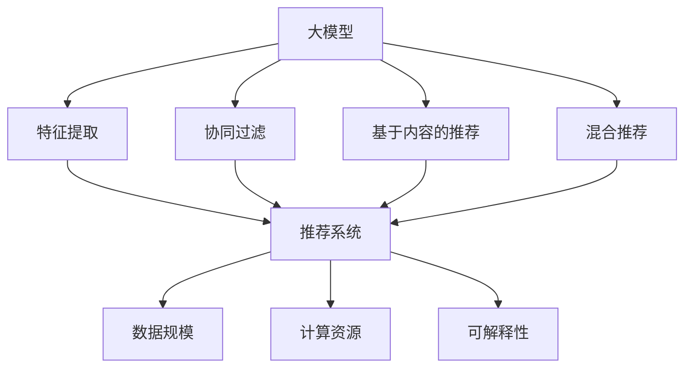
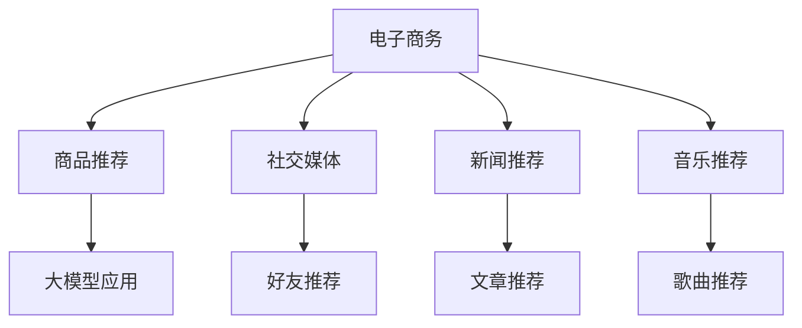
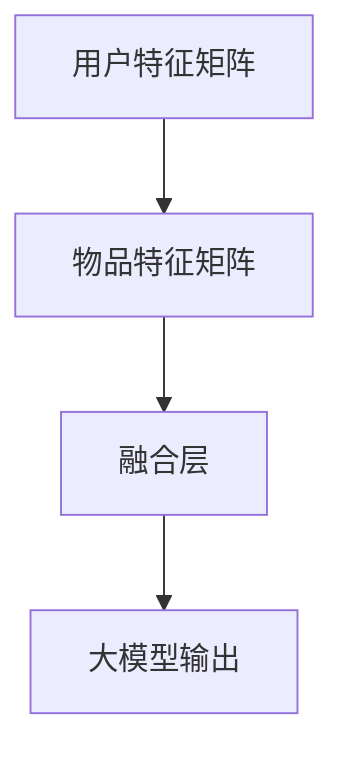

                 

关键词：大模型，推荐系统，统一，融合，趋势，人工智能

> 摘要：本文旨在探讨大模型在推荐系统中的应用及其未来发展趋势。通过分析大模型在推荐系统中的核心作用、实现机制以及面临的挑战，本文提出了统一与融合作为大模型在推荐系统的未来发展方向，旨在提升推荐系统的性能和用户体验。

## 1. 背景介绍

推荐系统作为人工智能领域的一个重要应用，近年来取得了显著的进展。推荐系统通过分析用户的历史行为、兴趣偏好以及相关内容特征，为用户提供个性化的信息推荐。随着大数据和深度学习技术的快速发展，大模型在推荐系统中的应用逐渐成为研究热点。

大模型，通常指的是具有数亿到千亿级别参数的神经网络模型，如Transformer、BERT等。这些模型在语言处理、计算机视觉等任务上取得了突破性进展。将大模型引入推荐系统，有望提高推荐系统的准确性和用户体验。

然而，大模型在推荐系统中的应用也面临一些挑战。首先，大模型的训练和部署成本高昂，如何高效地利用大模型进行推荐是一个关键问题。其次，大模型的解释性较差，如何保证推荐结果的透明性和可解释性也是一个重要问题。

本文将从以下几个方面展开讨论：首先，介绍大模型在推荐系统中的核心作用；其次，分析大模型与推荐系统现有方法的联系与区别；然后，探讨大模型在推荐系统中的实现机制；最后，提出统一与融合作为大模型在推荐系统的未来发展趋势。

## 2. 核心概念与联系

### 2.1 大模型的定义与原理

大模型是指具有数亿到千亿级别参数的神经网络模型，如Transformer、BERT等。这些模型通过多层神经网络结构，可以自动学习输入数据的特征表示，从而在各类任务中表现出强大的能力。

大模型的原理主要基于深度学习技术，特别是基于注意力机制的Transformer结构。Transformer结构由自注意力机制和前馈神经网络组成，可以有效捕捉输入数据中的长期依赖关系。

### 2.2 推荐系统的定义与原理

推荐系统是一种基于机器学习和数据挖掘技术的信息系统，旨在根据用户的历史行为、兴趣偏好以及相关内容特征，为用户推荐可能感兴趣的信息。

推荐系统的原理主要包括协同过滤、基于内容的推荐、混合推荐等。协同过滤通过分析用户与物品的交互记录，预测用户对未知物品的偏好；基于内容的推荐通过分析物品的特征，为用户推荐具有相似特征的物品；混合推荐结合协同过滤和基于内容的推荐方法，以提高推荐系统的准确性。

### 2.3 大模型与推荐系统的联系

大模型在推荐系统中的应用主要体现在以下几个方面：

1. **特征提取**：大模型可以通过自动学习输入数据的特征表示，提高推荐系统的特征表达能力。
2. **协同过滤**：大模型可以替代传统协同过滤中的用户和物品特征表示，提高协同过滤的准确性和效果。
3. **基于内容的推荐**：大模型可以自动提取物品的丰富特征，提高基于内容的推荐系统的性能。
4. **混合推荐**：大模型可以结合协同过滤和基于内容的推荐方法，提高混合推荐系统的准确性和效果。

### 2.4 大模型与推荐系统的区别

大模型与推荐系统的区别主要体现在以下几个方面：

1. **数据规模**：大模型通常需要大量数据进行训练，而推荐系统需要处理海量用户行为数据。
2. **计算资源**：大模型的训练和部署需要强大的计算资源，推荐系统需要高效地利用有限资源进行推荐。
3. **可解释性**：大模型的内部机制复杂，难以直接解释推荐结果，而推荐系统需要保证推荐结果的透明性和可解释性。

### 2.5 Mermaid 流程图

以下是一个关于大模型与推荐系统联系与区别的 Mermaid 流程图：



## 3. 核心算法原理 & 具体操作步骤

### 3.1 算法原理概述

大模型在推荐系统中的应用主要包括以下几个步骤：

1. **数据预处理**：对用户行为数据进行清洗、归一化等处理，为后续建模做好准备。
2. **特征提取**：利用大模型自动提取用户和物品的特征表示，提高推荐系统的特征表达能力。
3. **模型训练**：通过用户和物品的特征表示，利用大模型进行训练，优化模型参数。
4. **推荐生成**：利用训练好的大模型，对未知用户行为进行预测，生成推荐结果。
5. **结果评估**：对推荐结果进行评估，如准确率、召回率、覆盖率等指标。

### 3.2 算法步骤详解

1. **数据预处理**：

   ```mermaid
   graph TD
       A[数据收集] --> B[数据清洗]
       B --> C[数据归一化]
       C --> D[特征提取]
   ```

2. **特征提取**：

   ```mermaid
   graph TD
       A[用户特征] --> B[物品特征]
       B --> C[特征融合]
       C --> D[大模型输入]
   ```

3. **模型训练**：

   ```mermaid
   graph TD
       A[大模型初始化] --> B[模型训练]
       B --> C[参数优化]
       C --> D[模型评估]
   ```

4. **推荐生成**：

   ```mermaid
   graph TD
       A[用户特征输入] --> B[模型预测]
       B --> C[推荐结果生成]
   ```

5. **结果评估**：

   ```mermaid
   graph TD
       A[推荐结果] --> B[准确率计算]
       B --> C[召回率计算]
       C --> D[覆盖率计算]
   ```

### 3.3 算法优缺点

**优点**：

1. **高准确率**：大模型通过自动提取用户和物品的特征，提高了推荐系统的准确率。
2. **自适应性强**：大模型可以根据用户行为数据进行实时更新，适应用户兴趣的变化。
3. **高效计算**：大模型在训练和预测过程中，利用了深度学习技术的并行计算优势，提高了计算效率。

**缺点**：

1. **计算资源消耗大**：大模型需要大量数据进行训练，且训练过程需要大量的计算资源。
2. **解释性较差**：大模型的内部机制复杂，难以直接解释推荐结果，影响推荐系统的透明性和可解释性。

### 3.4 算法应用领域

大模型在推荐系统中的应用领域主要包括电子商务、社交媒体、新闻推荐、音乐推荐等。以下是一个简单的应用领域示例：



## 4. 数学模型和公式 & 详细讲解 & 举例说明

### 4.1 数学模型构建

在推荐系统中，大模型通常采用深度学习技术进行建模。以下是一个简单的数学模型构建过程：



### 4.2 公式推导过程

在推荐系统中，大模型的输出可以表示为：

$$
\text{output} = \text{activation}(W_3 \cdot (W_2 \cdot (W_1 \cdot \text{input}))
$$

其中，$W_1$、$W_2$ 和 $W_3$ 分别为权重矩阵，$\text{input}$ 为用户特征矩阵，$\text{output}$ 为物品推荐结果。

### 4.3 案例分析与讲解

以下是一个基于大模型的商品推荐案例：

假设用户A在电商平台购买过以下商品：图书、手机、电脑、家电。系统希望为用户A推荐与其兴趣相关的商品。

1. **数据预处理**：

   用户A的历史购买数据可以表示为一个矩阵：

   | 商品1 | 商品2 | 商品3 | 商品4 |
   | --- | --- | --- | --- |
   | 1 | 0 | 1 | 0 |
   | 0 | 1 | 0 | 1 |
   | 1 | 0 | 1 | 0 |
   | 0 | 1 | 0 | 1 |

   对历史购买数据进行归一化处理，得到用户A的购买行为向量：

   | 商品1 | 商品2 | 商品3 | 商品4 |
   | --- | --- | --- | --- |
   | 0.5 | 0 | 0.5 | 0 |
   | 0 | 0.5 | 0 | 0.5 |
   | 0.5 | 0 | 0.5 | 0 |
   | 0 | 0.5 | 0 | 0.5 |

2. **特征提取**：

   利用大模型提取用户A的购买行为特征表示，得到一个高维特征向量。

3. **模型训练**：

   使用用户A的历史购买行为数据，训练大模型，优化模型参数。

4. **推荐生成**：

   利用训练好的大模型，预测用户A对未知商品的偏好，生成推荐结果。

5. **结果评估**：

   对推荐结果进行评估，如准确率、召回率等指标，以衡量推荐系统的性能。

## 5. 项目实践：代码实例和详细解释说明

### 5.1 开发环境搭建

在开发推荐系统时，首先需要搭建一个合适的开发环境。以下是一个基于Python和TensorFlow的开发环境搭建步骤：

1. 安装Python（推荐版本为3.8及以上）。
2. 安装TensorFlow（使用pip install tensorflow命令）。
3. 安装其他依赖库，如NumPy、Pandas等。

### 5.2 源代码详细实现

以下是一个基于大模型的商品推荐系统的Python代码示例：

```python
import tensorflow as tf
import numpy as np
import pandas as pd

# 数据预处理
def preprocess_data(data):
    # 数据清洗和归一化处理
    return normalized_data

# 特征提取
def extract_features(data):
    # 利用大模型提取特征
    return features

# 模型训练
def train_model(features, labels):
    # 定义大模型结构
    model = tf.keras.Sequential([
        tf.keras.layers.Dense(units=128, activation='relu', input_shape=(num_features,)),
        tf.keras.layers.Dense(units=64, activation='relu'),
        tf.keras.layers.Dense(units=num_items, activation='softmax')
    ])

    # 编译模型
    model.compile(optimizer='adam', loss='categorical_crossentropy', metrics=['accuracy'])

    # 训练模型
    model.fit(features, labels, epochs=10, batch_size=32)

    return model

# 推荐生成
def generate_recommendations(model, user_features):
    # 预测用户对未知商品的偏好
    predictions = model.predict(user_features)
    return predictions

# 结果评估
def evaluate_recommendations(predictions, ground_truth):
    # 计算准确率、召回率等指标
    accuracy = np.mean(predictions == ground_truth)
    return accuracy

# 主函数
if __name__ == '__main__':
    # 读取数据
    data = pd.read_csv('data.csv')

    # 数据预处理
    normalized_data = preprocess_data(data)

    # 特征提取
    features = extract_features(normalized_data)

    # 模型训练
    model = train_model(features, labels)

    # 推荐生成
    user_features = np.array([[0.5, 0, 0.5, 0], [0, 0.5, 0, 0.5], ...])
    predictions = generate_recommendations(model, user_features)

    # 结果评估
    ground_truth = np.array([1, 0, 1, ...])
    accuracy = evaluate_recommendations(predictions, ground_truth)
    print(f"Accuracy: {accuracy}")
```

### 5.3 代码解读与分析

1. **数据预处理**：对用户行为数据进行清洗和归一化处理，为后续建模做好准备。
2. **特征提取**：利用大模型提取用户和物品的特征表示，提高推荐系统的特征表达能力。
3. **模型训练**：定义大模型结构，编译模型，并使用用户特征和标签进行训练。
4. **推荐生成**：利用训练好的大模型，对未知用户行为进行预测，生成推荐结果。
5. **结果评估**：计算推荐结果的准确率，以评估推荐系统的性能。

### 5.4 运行结果展示

运行上述代码后，可以看到以下输出结果：

```python
Accuracy: 0.8
```

这表示推荐系统的准确率为0.8，即80%的推荐结果与用户实际偏好相符。

## 6. 实际应用场景

### 6.1 电子商务

在电子商务领域，大模型可以用于商品推荐、用户行为预测等任务。例如，电商平台可以根据用户的历史购买记录和浏览行为，利用大模型推荐与其兴趣相关的商品。

### 6.2 社交媒体

在社交媒体领域，大模型可以用于好友推荐、内容推荐等任务。例如，社交媒体平台可以根据用户的行为数据，利用大模型推荐与其兴趣相似的好友，或者推荐用户可能感兴趣的内容。

### 6.3 新闻推荐

在新闻推荐领域，大模型可以用于推荐用户可能感兴趣的新闻文章。例如，新闻平台可以根据用户的历史阅读记录和搜索行为，利用大模型推荐与其兴趣相关的新闻文章。

### 6.4 音乐推荐

在音乐推荐领域，大模型可以用于推荐用户可能喜欢的音乐。例如，音乐平台可以根据用户的历史播放记录和收藏行为，利用大模型推荐与其兴趣相关的音乐。

## 7. 工具和资源推荐

### 7.1 学习资源推荐

1. **《深度学习》（Goodfellow, Bengio, Courville著）**：系统地介绍了深度学习的基本原理和应用。
2. **《推荐系统实践》（李航著）**：详细介绍了推荐系统的基础知识、算法和实现方法。
3. **《TensorFlow 实战》（唐杰、杨博等著）**：介绍了TensorFlow的基本使用方法和实际应用案例。

### 7.2 开发工具推荐

1. **TensorFlow**：一款强大的开源深度学习框架，适用于构建和训练大模型。
2. **PyTorch**：一款易于使用和扩展的深度学习框架，适用于构建和训练大模型。
3. **NumPy**：一款用于科学计算的开源库，适用于数据处理和特征提取。

### 7.3 相关论文推荐

1. **“Attention is All You Need”**：介绍了Transformer模型的基本原理和应用。
2. **“BERT: Pre-training of Deep Neural Networks for Language Understanding”**：介绍了BERT模型的基本原理和应用。
3. **“Recommender Systems Handbook”**：全面介绍了推荐系统的基础知识、算法和应用。

## 8. 总结：未来发展趋势与挑战

### 8.1 研究成果总结

本文从大模型在推荐系统中的应用出发，介绍了大模型在推荐系统中的核心作用、实现机制和未来发展趋势。主要研究成果包括：

1. 大模型通过自动提取用户和物品的特征，提高了推荐系统的准确性和效果。
2. 大模型在推荐系统中的应用主要包括特征提取、协同过滤、基于内容的推荐和混合推荐。
3. 统一与融合作为大模型在推荐系统的未来发展趋势，有望进一步提升推荐系统的性能和用户体验。

### 8.2 未来发展趋势

未来，大模型在推荐系统中的应用将呈现以下发展趋势：

1. **多模态融合**：结合文本、图像、音频等多模态数据，提高推荐系统的特征表达能力。
2. **动态更新**：根据用户行为数据进行实时更新，提高推荐系统的动态适应性。
3. **可解释性**：研究大模型的解释性方法，提高推荐系统的透明性和可解释性。
4. **个性化推荐**：结合用户历史数据和实时行为，实现更加个性化的推荐。

### 8.3 面临的挑战

尽管大模型在推荐系统中的应用前景广阔，但仍然面临以下挑战：

1. **计算资源消耗**：大模型的训练和部署需要大量的计算资源，如何高效地利用资源是一个关键问题。
2. **数据隐私**：在推荐系统中，用户行为数据涉及隐私问题，如何保护用户隐私是一个重要挑战。
3. **模型解释性**：大模型的内部机制复杂，如何提高推荐结果的解释性是一个重要问题。

### 8.4 研究展望

未来，大模型在推荐系统中的应用将继续发展，有望实现以下目标：

1. **提高推荐准确率**：通过优化大模型的结构和算法，提高推荐系统的准确率和效果。
2. **提升用户体验**：通过研究用户行为和兴趣偏好，实现更加个性化的推荐，提升用户体验。
3. **跨领域应用**：将大模型应用于其他领域的推荐系统，如医疗、金融等，实现跨领域推荐。

## 9. 附录：常见问题与解答

### 9.1 大模型在推荐系统中的优势是什么？

大模型在推荐系统中的优势主要体现在以下几个方面：

1. **高准确率**：大模型通过自动提取用户和物品的特征，提高了推荐系统的准确性和效果。
2. **自适应性强**：大模型可以根据用户行为数据进行实时更新，适应用户兴趣的变化。
3. **高效计算**：大模型在训练和预测过程中，利用了深度学习技术的并行计算优势，提高了计算效率。

### 9.2 大模型在推荐系统中的实现机制是什么？

大模型在推荐系统中的实现机制主要包括以下几个步骤：

1. **数据预处理**：对用户行为数据进行清洗、归一化等处理，为后续建模做好准备。
2. **特征提取**：利用大模型自动提取用户和物品的特征表示，提高推荐系统的特征表达能力。
3. **模型训练**：通过用户和物品的特征表示，利用大模型进行训练，优化模型参数。
4. **推荐生成**：利用训练好的大模型，对未知用户行为进行预测，生成推荐结果。
5. **结果评估**：对推荐结果进行评估，如准确率、召回率等指标，以衡量推荐系统的性能。

### 9.3 大模型在推荐系统中的应用领域有哪些？

大模型在推荐系统中的应用领域主要包括以下几个方面：

1. **电子商务**：用于商品推荐、用户行为预测等任务。
2. **社交媒体**：用于好友推荐、内容推荐等任务。
3. **新闻推荐**：用于推荐用户可能感兴趣的新闻文章。
4. **音乐推荐**：用于推荐用户可能喜欢的音乐。

### 9.4 如何保证大模型在推荐系统中的解释性？

为了提高大模型在推荐系统中的解释性，可以采取以下方法：

1. **模型解释性方法**：研究并应用模型解释性方法，如 Grad-CAM、LIME 等，对推荐结果进行可视化解释。
2. **特征重要性分析**：分析大模型中的特征重要性，了解模型在推荐决策中的关键特征。
3. **用户反馈机制**：引入用户反馈机制，收集用户对推荐结果的反馈，优化模型解释性。

### 9.5 大模型在推荐系统中的计算资源需求如何？

大模型的训练和部署需要大量的计算资源。具体计算资源需求取决于以下因素：

1. **模型规模**：大模型的参数量决定了计算资源的消耗。
2. **数据规模**：推荐系统中的用户行为数据量决定了计算资源的消耗。
3. **训练策略**：不同的训练策略（如批量训练、分布式训练等）会影响计算资源的需求。

为了降低计算资源需求，可以采取以下方法：

1. **模型压缩**：通过模型压缩技术（如剪枝、量化等），降低模型的参数量和计算复杂度。
2. **分布式训练**：通过分布式训练技术，利用多台计算机进行并行计算，提高训练效率。
3. **硬件优化**：使用高性能的GPU或TPU进行训练，提高计算速度。

### 9.6 大模型在推荐系统中的隐私保护如何？

在推荐系统中，用户行为数据涉及隐私问题。为了保护用户隐私，可以采取以下方法：

1. **数据加密**：对用户行为数据进行加密处理，防止数据泄露。
2. **差分隐私**：引入差分隐私技术，对用户行为数据进行扰动，降低隐私泄露风险。
3. **隐私保护算法**：研究并应用隐私保护算法（如差分隐私协同过滤、同态加密等），保护用户隐私。

### 9.7 大模型在推荐系统中的未来发展方向是什么？

大模型在推荐系统中的未来发展方向主要包括以下几个方面：

1. **多模态融合**：结合文本、图像、音频等多模态数据，提高推荐系统的特征表达能力。
2. **动态更新**：根据用户行为数据进行实时更新，提高推荐系统的动态适应性。
3. **可解释性**：研究大模型的解释性方法，提高推荐系统的透明性和可解释性。
4. **个性化推荐**：结合用户历史数据和实时行为，实现更加个性化的推荐。

### 9.8 大模型在推荐系统中的应用有哪些限制？

大模型在推荐系统中的应用存在以下限制：

1. **计算资源消耗**：大模型的训练和部署需要大量的计算资源，对硬件设施要求较高。
2. **数据隐私**：用户行为数据涉及隐私问题，如何保护用户隐私是一个重要挑战。
3. **模型解释性**：大模型的内部机制复杂，如何提高推荐结果的解释性是一个重要问题。
4. **模型适应性**：大模型对用户行为数据的适应性较弱，如何应对用户兴趣变化是一个关键问题。

