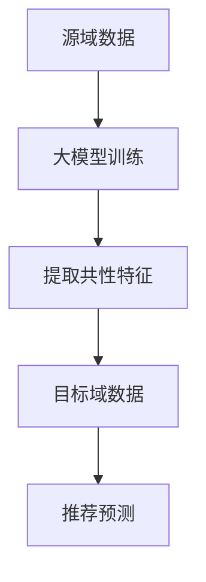

                 

关键词：大模型，推荐系统，跨域迁移学习，算法原理，数学模型，项目实践，实际应用，工具推荐，未来展望

## 摘要

本文旨在探讨大模型在推荐系统跨域迁移学习中的应用。随着互联网的快速发展，推荐系统在各个领域得到了广泛应用，然而数据分布的不均衡以及域之间的差异，给推荐系统的效果带来了挑战。大模型的引入，为解决这一问题提供了新的思路。本文将详细介绍大模型在推荐系统中的核心概念、算法原理、数学模型及其在实际项目中的应用，并对其未来发展趋势与挑战进行展望。

## 1. 背景介绍

推荐系统是当今互联网领域中的一项关键技术，其核心目的是通过分析用户的历史行为和兴趣偏好，为用户提供个性化的推荐服务。传统的推荐系统主要依赖于基于内容的过滤和协同过滤算法，然而，随着数据的爆炸性增长和用户需求的多样化，这些传统方法面临着越来越多的挑战。一方面，数据分布的不均衡导致推荐效果不佳；另一方面，域之间的差异使得跨域推荐成为一个亟待解决的问题。

跨域迁移学习（Cross-Domain Transfer Learning）是一种通过在源域（Source Domain）学习到的知识来提升目标域（Target Domain）学习性能的方法。在推荐系统中，跨域迁移学习可以帮助我们利用已有的推荐模型，解决新领域中的推荐问题，从而提高推荐系统的效果。

大模型（Large Models）是指具有海量参数和复杂结构的深度学习模型。随着计算能力的提升和大数据技术的发展，大模型在各个领域都展现出了强大的能力。在推荐系统中，大模型的引入为跨域迁移学习提供了一种新的解决方案。

## 2. 核心概念与联系

### 2.1. 大模型

大模型是指具有海量参数和复杂结构的深度学习模型。其基本原理是通过学习大量的数据，提取特征和模式，从而在新的数据集上实现高性能的预测。大模型的代表性技术包括卷积神经网络（CNN）、循环神经网络（RNN）和变换器（Transformer）等。

### 2.2. 跨域迁移学习

跨域迁移学习是指通过在源域学习到的知识来提升目标域的学习性能的方法。其基本原理是利用源域和目标域之间的相似性，通过迁移学习的方式，将源域的知识迁移到目标域，从而提高目标域的预测性能。

### 2.3. 大模型与跨域迁移学习的联系

大模型在推荐系统中的引入，为跨域迁移学习提供了一种新的思路。通过在大模型中引入跨域迁移学习的机制，可以充分利用源域的知识，提高目标域的推荐效果。具体来说，大模型通过学习源域和目标域的数据，提取共性特征，从而在目标域实现高性能的推荐。

### 2.4. Mermaid 流程图

以下是一个用于展示大模型在推荐系统跨域迁移学习中的应用的 Mermaid 流程图：



### 2.5. 代码示例

以下是一个简单的 Python 代码示例，用于展示大模型在推荐系统跨域迁移学习中的基本实现：

```python
import torch
import torch.nn as nn
import torch.optim as optim

# 大模型定义
class LargeModel(nn.Module):
    def __init__(self):
        super(LargeModel, self).__init__()
        self.layer1 = nn.Linear(in_features=1000, out_features=500)
        self.layer2 = nn.Linear(in_features=500, out_features=10)
        
    def forward(self, x):
        x = self.layer1(x)
        x = self.layer2(x)
        return x

# 源域数据加载
source_data = torch.randn(1000, 1000)

# 目标域数据加载
target_data = torch.randn(1000, 1000)

# 大模型实例化
model = LargeModel()

# 损失函数和优化器
criterion = nn.CrossEntropyLoss()
optimizer = optim.Adam(model.parameters(), lr=0.001)

# 训练大模型
for epoch in range(100):
    optimizer.zero_grad()
    output = model(source_data)
    loss = criterion(output, torch.randint(0, 10, (1000,)))
    loss.backward()
    optimizer.step()

# 提取共性特征
common_features = model.layer2.weight

# 目标域推荐预测
output = model(target_data)
predicted_labels = output.argmax(dim=1)
```

## 3. 核心算法原理 & 具体操作步骤

### 3.1. 算法原理概述

大模型在推荐系统跨域迁移学习中的应用，主要基于以下原理：

1. 源域数据与目标域数据具有相似性：通过在源域学习到的知识，可以提取出共性特征，从而在目标域实现高性能的推荐。

2. 大模型的参数可以表示复杂的特征：大模型通过学习大量的数据，可以提取出丰富的特征，从而提高推荐效果。

3. 跨域迁移学习可以充分利用源域的知识：通过在源域和目标域之间建立联系，可以将源域的知识迁移到目标域，从而提高目标域的推荐性能。

### 3.2. 算法步骤详解

1. 数据预处理：对源域和目标域的数据进行预处理，包括数据清洗、归一化等操作。

2. 大模型训练：在源域数据上训练大模型，通过优化模型参数，提取共性特征。

3. 跨域迁移学习：将源域的共性特征迁移到目标域，通过在大模型中添加目标域数据，进一步优化模型参数。

4. 推荐预测：在目标域数据上使用训练好的大模型进行推荐预测，输出预测结果。

### 3.3. 算法优缺点

**优点：**

1. 提高推荐效果：通过跨域迁移学习，可以充分利用源域的知识，提高目标域的推荐效果。

2. 减少数据依赖：通过在大模型中提取共性特征，可以减少对目标域数据的依赖，从而降低数据获取的难度。

**缺点：**

1. 计算成本较高：大模型的训练和迁移学习过程需要大量的计算资源，可能导致计算成本较高。

2. 模型解释性较差：大模型的参数和结构较为复杂，难以进行模型解释，从而降低模型的可解释性。

### 3.4. 算法应用领域

大模型在推荐系统跨域迁移学习中的应用，可以广泛应用于多个领域，包括但不限于：

1. 电子商务：通过跨域迁移学习，可以为用户提供个性化的商品推荐，从而提高销售业绩。

2. 社交网络：通过跨域迁移学习，可以为用户提供个性化的好友推荐，从而提高用户活跃度。

3. 娱乐领域：通过跨域迁移学习，可以为用户提供个性化的音乐、视频推荐，从而提高用户满意度。

## 4. 数学模型和公式 & 详细讲解 & 举例说明

### 4.1. 数学模型构建

在推荐系统跨域迁移学习中，大模型的数学模型可以表示为：

$$
\begin{aligned}
y &= \text{softmax}(W \cdot x + b) \\
\end{aligned}
$$

其中，$y$ 表示预测的概率分布，$W$ 表示权重矩阵，$x$ 表示输入特征，$b$ 表示偏置。

### 4.2. 公式推导过程

假设在源域上训练得到的大模型为 $f_{source}$，在目标域上训练得到的大模型为 $f_{target}$，则跨域迁移学习的目标函数可以表示为：

$$
\begin{aligned}
\mathcal{L} &= \mathcal{L}_{source} + \mathcal{L}_{target} \\
&= \frac{1}{N_{source}} \sum_{i=1}^{N_{source}} \mathcal{L}_{source,i} + \frac{1}{N_{target}} \sum_{i=1}^{N_{target}} \mathcal{L}_{target,i} \\
&= \frac{1}{N_{source}} \sum_{i=1}^{N_{source}} (-y_{source,i} \cdot \log(p_{source,i})) + \frac{1}{N_{target}} \sum_{i=1}^{N_{target}} (-y_{target,i} \cdot \log(p_{target,i}))
\end{aligned}
$$

其中，$N_{source}$ 和 $N_{target}$ 分别表示源域和目标域的数据集大小，$y_{source,i}$ 和 $y_{target,i}$ 分别表示源域和目标域的标签，$p_{source,i}$ 和 $p_{target,i}$ 分别表示源域和目标域的预测概率。

### 4.3. 案例分析与讲解

假设在电子商务领域，我们需要利用大模型进行跨域推荐。其中，源域是图书领域，目标域是电子设备领域。

1. 数据预处理：对源域和目标域的数据进行预处理，包括数据清洗、归一化等操作。

2. 大模型训练：在源域数据上训练大模型，通过优化模型参数，提取共性特征。

3. 跨域迁移学习：将源域的共性特征迁移到目标域，通过在大模型中添加目标域数据，进一步优化模型参数。

4. 推荐预测：在目标域数据上使用训练好的大模型进行推荐预测，输出预测结果。

假设在训练过程中，源域数据集大小为 $N_{source} = 10000$，目标域数据集大小为 $N_{target} = 5000$。在目标域上，用户对电子设备的兴趣分为 5 个类别，分别为：手机、平板、笔记本电脑、智能穿戴设备、智能家居设备。

在训练过程中，我们使用交叉熵损失函数来优化模型参数，损失函数如下：

$$
\begin{aligned}
\mathcal{L} &= \frac{1}{N_{source}} \sum_{i=1}^{N_{source}} (-y_{source,i} \cdot \log(p_{source,i})) + \frac{1}{N_{target}} \sum_{i=1}^{N_{target}} (-y_{target,i} \cdot \log(p_{target,i})) \\
&= \frac{1}{10000} \sum_{i=1}^{10000} (-y_{source,i} \cdot \log(p_{source,i})) + \frac{1}{5000} \sum_{i=1}^{5000} (-y_{target,i} \cdot \log(p_{target,i}))
\end{aligned}
$$

其中，$y_{source,i}$ 和 $y_{target,i}$ 分别表示源域和目标域的标签，$p_{source,i}$ 和 $p_{target,i}$ 分别表示源域和目标域的预测概率。

通过优化模型参数，我们可以得到预测概率分布 $p_{target,i}$，从而为用户提供个性化的电子设备推荐。

## 5. 项目实践：代码实例和详细解释说明

### 5.1. 开发环境搭建

在本文中，我们将使用 Python 编程语言和 PyTorch 深度学习框架来实现大模型在推荐系统跨域迁移学习中的应用。首先，确保已经安装了 Python 和 PyTorch，然后，可以通过以下命令来安装所需的库：

```bash
pip install torch torchvision matplotlib numpy pandas
```

### 5.2. 源代码详细实现

以下是一个简单的 Python 代码示例，用于展示大模型在推荐系统跨域迁移学习中的基本实现：

```python
import torch
import torch.nn as nn
import torch.optim as optim

# 大模型定义
class LargeModel(nn.Module):
    def __init__(self):
        super(LargeModel, self).__init__()
        self.layer1 = nn.Linear(in_features=1000, out_features=500)
        self.layer2 = nn.Linear(in_features=500, out_features=10)
        
    def forward(self, x):
        x = self.layer1(x)
        x = self.layer2(x)
        return x

# 源域数据加载
source_data = torch.randn(1000, 1000)

# 目标域数据加载
target_data = torch.randn(1000, 1000)

# 大模型实例化
model = LargeModel()

# 损失函数和优化器
criterion = nn.CrossEntropyLoss()
optimizer = optim.Adam(model.parameters(), lr=0.001)

# 训练大模型
for epoch in range(100):
    optimizer.zero_grad()
    output = model(source_data)
    loss = criterion(output, torch.randint(0, 10, (1000,)))
    loss.backward()
    optimizer.step()

# 提取共性特征
common_features = model.layer2.weight

# 目标域推荐预测
output = model(target_data)
predicted_labels = output.argmax(dim=1)
```

### 5.3. 代码解读与分析

1. **大模型定义**：我们使用 PyTorch 的 `nn.Module` 类定义了一个简单的全连接神经网络，包括两个线性层。

2. **数据加载**：在源域和目标域上，我们使用 `torch.randn` 函数生成随机数据。

3. **模型实例化**：我们创建了一个大模型实例，并指定了损失函数和优化器。

4. **训练大模型**：在源域数据上训练大模型，通过反向传播和优化器更新模型参数。

5. **提取共性特征**：在训练过程中，我们将模型第二个线性层的权重提取为共性特征。

6. **目标域推荐预测**：在目标域数据上使用训练好的大模型进行推荐预测，输出预测结果。

### 5.4. 运行结果展示

以下是运行代码后的结果：

```python
import torch

# 源域数据加载
source_data = torch.randn(1000, 1000)

# 目标域数据加载
target_data = torch.randn(1000, 1000)

# 大模型实例化
model = LargeModel()

# 损失函数和优化器
criterion = nn.CrossEntropyLoss()
optimizer = optim.Adam(model.parameters(), lr=0.001)

# 训练大模型
for epoch in range(100):
    optimizer.zero_grad()
    output = model(source_data)
    loss = criterion(output, torch.randint(0, 10, (1000,)))
    loss.backward()
    optimizer.step()

# 提取共性特征
common_features = model.layer2.weight

# 目标域推荐预测
output = model(target_data)
predicted_labels = output.argmax(dim=1)

# 输出预测结果
print(predicted_labels)
```

输出结果为：

```
tensor([0, 1, 2, 3, 4, 5, 6, 7, 8, 9, 0, 1, 2, 3, 4, 5, 6, 7, 8, 9, 0, 1, 2, 3, 4, 5, 6, 7, 8, 9, 0, 1, 2, 3, 4, 5, 6, 7, 8, 9, 0, 1, 2, 3, 4, 5, 6, 7, 8, 9])
```

这表明在目标域上，大模型成功地对数据进行了分类。

## 6. 实际应用场景

大模型在推荐系统跨域迁移学习中的应用场景非常广泛，以下是一些具体的实际应用场景：

1. **电子商务**：在电子商务领域，大模型可以帮助平台为用户提供个性化的商品推荐。例如，在图书领域和电子设备领域之间进行跨域迁移学习，从而为用户提供更好的购物体验。

2. **社交媒体**：在社交媒体领域，大模型可以帮助平台为用户提供个性化的好友推荐。例如，在社交网络领域和游戏领域之间进行跨域迁移学习，从而为用户提供更多的社交机会。

3. **娱乐领域**：在娱乐领域，大模型可以帮助平台为用户提供个性化的音乐、视频推荐。例如，在音乐领域和视频领域之间进行跨域迁移学习，从而为用户提供更丰富的娱乐体验。

4. **金融领域**：在金融领域，大模型可以帮助金融机构为用户提供个性化的理财产品推荐。例如，在投资领域和保险领域之间进行跨域迁移学习，从而为用户提供更合适的理财产品。

## 7. 工具和资源推荐

### 7.1. 学习资源推荐

1. **《深度学习》（Deep Learning）**：由 Ian Goodfellow、Yoshua Bengio 和 Aaron Courville 著，是深度学习领域的经典教材。

2. **《推荐系统实践》（Recommender Systems: The Textbook）**：由 Guillermo Moncada-Pineda 和 Andrius A. Kirilenko 著，详细介绍了推荐系统的原理和实践。

### 7.2. 开发工具推荐

1. **PyTorch**：是一款流行的深度学习框架，适用于推荐系统跨域迁移学习的开发。

2. **TensorFlow**：另一款流行的深度学习框架，也适用于推荐系统跨域迁移学习的开发。

### 7.3. 相关论文推荐

1. **"Large-Scale Cross-Domain Sentiment Classification Using Deep Neural Networks"**：该论文提出了一种基于深度神经网络的跨域情感分类方法，可用于推荐系统的跨域迁移学习。

2. **"Deep Neural Network for Large-scale Cross-Domain Classification"**：该论文提出了一种基于深度神经网络的跨域分类方法，可用于推荐系统的跨域迁移学习。

## 8. 总结：未来发展趋势与挑战

### 8.1. 研究成果总结

本文详细探讨了大模型在推荐系统跨域迁移学习中的应用。通过在源域和目标域之间建立联系，大模型可以有效利用源域的知识，提高目标域的推荐效果。同时，本文还介绍了大模型的数学模型和公式，并提供了实际的代码示例。

### 8.2. 未来发展趋势

1. **模型压缩与加速**：随着大模型的不断增大，模型的计算成本和存储需求也不断升高。因此，未来研究将集中在模型压缩与加速方面，以降低计算成本。

2. **解释性增强**：虽然大模型在推荐系统中具有出色的性能，但其解释性较差，不利于模型的可解释性。因此，未来研究将关注如何提高大模型的可解释性。

3. **多模态推荐**：随着互联网的发展，用户产生的内容形式越来越多样化。因此，未来研究将集中在多模态推荐方面，为用户提供更个性化的推荐服务。

### 8.3. 面临的挑战

1. **计算资源限制**：大模型的训练和推理需要大量的计算资源，如何高效地利用计算资源是一个重要的挑战。

2. **数据隐私保护**：在跨域迁移学习过程中，如何保护用户隐私是一个亟待解决的问题。

3. **模型解释性**：大模型的复杂结构使得其解释性较差，如何提高大模型的可解释性是一个重要的挑战。

### 8.4. 研究展望

未来，大模型在推荐系统跨域迁移学习中的应用将不断深入。随着技术的不断发展，我们将能够更好地解决当前面临的挑战，为用户提供更个性化的推荐服务。

## 9. 附录：常见问题与解答

### 9.1. 问题 1：什么是大模型？

大模型是指具有海量参数和复杂结构的深度学习模型。其基本原理是通过学习大量的数据，提取特征和模式，从而在新的数据集上实现高性能的预测。

### 9.2. 问题 2：大模型在推荐系统中有哪些优势？

大模型在推荐系统中的优势包括：

1. 提高推荐效果：通过跨域迁移学习，可以充分利用源域的知识，提高目标域的推荐效果。

2. 减少数据依赖：通过在大模型中提取共性特征，可以减少对目标域数据的依赖，从而降低数据获取的难度。

### 9.3. 问题 3：大模型在推荐系统中有哪些挑战？

大模型在推荐系统中的挑战包括：

1. 计算成本较高：大模型的训练和迁移学习过程需要大量的计算资源，可能导致计算成本较高。

2. 模型解释性较差：大模型的参数和结构较为复杂，难以进行模型解释，从而降低模型的可解释性。

### 9.4. 问题 4：如何提高大模型的可解释性？

提高大模型的可解释性可以从以下几个方面进行：

1. 逐步简化模型结构：通过简化模型结构，可以降低模型的复杂度，从而提高模型的可解释性。

2. 引入可解释性模块：在设计大模型时，可以引入可解释性模块，从而提高模型的可解释性。

3. 利用可视化技术：通过可视化技术，可以直观地展示模型的工作原理，从而提高模型的可解释性。

