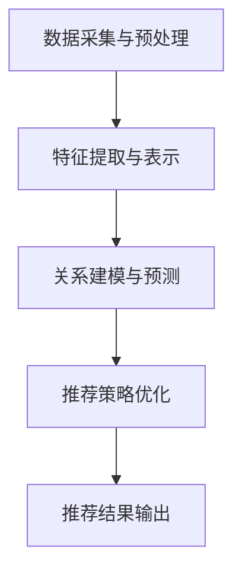

                 

关键词：大模型、新闻推荐、人工智能、机器学习、算法原理、数学模型、应用实践、未来展望

> 摘要：本文深入探讨了大模型在新闻推荐领域的应用，包括其背景介绍、核心概念与联系、算法原理与操作步骤、数学模型与公式推导、项目实践与代码实例、实际应用场景、未来展望以及面临的挑战。通过对这些方面的详细分析，本文旨在为读者提供一个全面了解大模型在新闻推荐中应用的技术视角。

## 1. 背景介绍

### 1.1 新闻推荐系统的发展历程

新闻推荐系统作为一种重要的信息分发方式，其发展历程可以追溯到20世纪末。最初，新闻推荐主要基于用户的历史行为数据，如浏览记录、点击率等，通过简单的统计方法进行推荐。这种方法虽然在一定程度上能够满足用户的需求，但其推荐的个性化和准确性有限。

随着互联网的快速发展，用户产生的大量数据使得机器学习算法逐渐应用于新闻推荐系统中。早期的推荐算法主要包括基于内容的推荐（Content-Based Filtering）和协同过滤（Collaborative Filtering）。基于内容的推荐通过分析新闻内容的特征进行推荐，而协同过滤则通过用户之间的相似性来推荐新闻。这两种方法在一定程度上提升了推荐的准确性和个性化程度。

进入21世纪，随着大数据和人工智能技术的不断发展，大模型逐渐成为新闻推荐系统的重要工具。大模型具有强大的特征提取能力和复杂的关系建模能力，能够在海量数据中发现潜在的模式和关联，从而实现更加精准的新闻推荐。

### 1.2 大模型在新闻推荐中的优势

大模型在新闻推荐中的应用具有以下优势：

1. **特征自动提取**：大模型能够自动从海量数据中提取出高维特征，从而避免了传统方法中特征工程的工作量。

2. **复杂关系建模**：大模型能够捕捉用户、新闻和场景之间的复杂关系，从而提高推荐的个性化和准确性。

3. **实时推荐**：大模型具备高效的计算能力，能够实现实时推荐，满足用户对快速获取信息的期望。

4. **自适应调整**：大模型可以根据用户的实时反馈进行自适应调整，从而不断优化推荐效果。

## 2. 核心概念与联系

### 2.1 大模型的基本原理

大模型（Large Models）是指参数规模非常大的深度学习模型。这些模型通常使用数百万或数十亿个参数，能够通过大量的训练数据学习到丰富的特征表示和复杂的关系建模。

大模型的基本原理包括：

1. **多层神经网络**：大模型通常采用多层神经网络结构，通过逐层提取特征，实现从原始数据到高级抽象表示的转换。

2. **大规模参数**：大模型具有大规模的参数，这使得它们能够学习到更加复杂和丰富的特征。

3. **端到端学习**：大模型采用端到端学习的方式，直接从原始数据中学习到目标函数的映射，从而避免了传统方法中手工设计的中间环节。

### 2.2 大模型在新闻推荐中的应用架构

大模型在新闻推荐中的应用架构通常包括以下几部分：

1. **数据采集与预处理**：从各种数据源采集用户行为数据、新闻内容和场景信息，并进行数据清洗和预处理，以生成适合大模型训练的数据集。

2. **特征提取与表示**：使用大模型自动提取新闻内容和用户行为的特征表示，这些特征表示能够捕捉到新闻的语义信息、用户的兴趣偏好以及场景的特征。

3. **关系建模与预测**：通过大模型捕捉用户、新闻和场景之间的复杂关系，实现新闻推荐的预测和生成。

4. **推荐策略优化**：根据用户的反馈和推荐效果，对推荐策略进行优化和调整，以实现更好的推荐效果。

### 2.3 Mermaid 流程图

下面是大模型在新闻推荐中的应用架构的 Mermaid 流程图：



## 3. 核心算法原理 & 具体操作步骤

### 3.1 算法原理概述

大模型在新闻推荐中的核心算法原理主要包括以下几个方面：

1. **深度学习模型**：使用深度学习模型，如Transformer、BERT等，对新闻内容和用户行为进行特征提取和关系建模。

2. **自动特征提取**：通过大规模参数的深度学习模型，自动从原始数据中提取出高维特征，实现特征的自动学习。

3. **图神经网络**：使用图神经网络（Graph Neural Networks，GNN）捕捉用户、新闻和场景之间的复杂关系。

4. **推荐策略**：结合用户的兴趣偏好、新闻内容和场景信息，使用大模型生成个性化的新闻推荐。

### 3.2 算法步骤详解

大模型在新闻推荐中的具体操作步骤如下：

1. **数据采集与预处理**：从各种数据源采集用户行为数据、新闻内容和场景信息，并进行数据清洗和预处理，以生成适合大模型训练的数据集。

2. **特征提取与表示**：使用深度学习模型（如BERT）对新闻内容和用户行为进行编码，生成新闻和用户的特征向量。

3. **图神经网络建模**：使用图神经网络（如GAT、GCN）捕捉新闻、用户和场景之间的复杂关系，生成图表示。

4. **推荐策略生成**：结合用户的兴趣偏好、新闻内容和场景信息，使用大模型生成个性化的新闻推荐。

5. **推荐结果输出**：将生成的新闻推荐结果输出给用户，并根据用户的反馈进行优化。

### 3.3 算法优缺点

大模型在新闻推荐中的算法优缺点如下：

**优点**：

1. **特征自动提取**：大模型能够自动从海量数据中提取出高维特征，减轻了传统方法中特征工程的工作量。

2. **复杂关系建模**：大模型能够捕捉用户、新闻和场景之间的复杂关系，实现更加精准的新闻推荐。

3. **实时推荐**：大模型具备高效的计算能力，能够实现实时推荐，满足用户对快速获取信息的期望。

**缺点**：

1. **计算资源需求大**：大模型需要大量的计算资源和存储资源，对硬件设施有较高的要求。

2. **数据预处理复杂**：大模型对数据的预处理要求较高，需要处理大量的噪声数据和异常值。

### 3.4 算法应用领域

大模型在新闻推荐领域的应用非常广泛，包括但不限于以下几个方面：

1. **个性化新闻推荐**：根据用户的兴趣偏好和历史行为，生成个性化的新闻推荐。

2. **内容推荐**：根据新闻内容的主题和关键词，推荐相关的新闻内容。

3. **热点话题追踪**：捕捉网络上的热点话题，为用户提供相关新闻推荐。

4. **广告推荐**：根据用户的兴趣和浏览行为，推荐相关的广告。

## 4. 数学模型和公式 & 详细讲解 & 举例说明

### 4.1 数学模型构建

在新闻推荐中，大模型的数学模型通常包括以下几个部分：

1. **用户表示**：使用矩阵 \(U\) 表示用户的特征向量，其中 \(U \in \mathbb{R}^{n \times d}\)，\(n\) 为用户数量，\(d\) 为特征维度。

2. **新闻表示**：使用矩阵 \(V\) 表示新闻的特征向量，其中 \(V \in \mathbb{R}^{m \times d}\)，\(m\) 为新闻数量，\(d\) 为特征维度。

3. **场景表示**：使用矩阵 \(S\) 表示场景的特征向量，其中 \(S \in \mathbb{R}^{k \times d}\)，\(k\) 为场景数量，\(d\) 为特征维度。

4. **推荐模型**：使用矩阵 \(R \in \mathbb{R}^{n \times m}\) 表示推荐矩阵，其中 \(R_{ij}\) 表示用户 \(i\) 对新闻 \(j\) 的推荐得分。

### 4.2 公式推导过程

推荐模型的推导过程主要包括以下几个步骤：

1. **用户与新闻的特征向量计算**：

   - 用户 \(i\) 的特征向量 \(u_i\) 可以通过矩阵 \(U\) 的第 \(i\) 行得到：

     $$ u_i = U_i^T $$

   - 新闻 \(j\) 的特征向量 \(v_j\) 可以通过矩阵 \(V\) 的第 \(j\) 行得到：

     $$ v_j = V_j^T $$

2. **场景的特征向量计算**：

   - 场景 \(k\) 的特征向量 \(s_k\) 可以通过矩阵 \(S\) 的第 \(k\) 行得到：

     $$ s_k = S_k^T $$

3. **推荐得分计算**：

   - 用户 \(i\) 对新闻 \(j\) 的推荐得分 \(R_{ij}\) 可以通过以下公式计算：

     $$ R_{ij} = u_i^T v_j + s_k^T v_j $$

   其中，\(u_i^T v_j\) 表示用户 \(i\) 与新闻 \(j\) 的相似度，\(s_k^T v_j\) 表示场景 \(k\) 与新闻 \(j\) 的相关性。

### 4.3 案例分析与讲解

假设我们有以下数据：

- 用户数量 \(n = 3\)，新闻数量 \(m = 4\)，场景数量 \(k = 2\)。

- 用户特征矩阵 \(U = \begin{bmatrix} 0.1 & 0.2 \\ 0.3 & 0.4 \\ 0.5 & 0.6 \end{bmatrix}\)。

- 新闻特征矩阵 \(V = \begin{bmatrix} 0.1 & 0.2 & 0.3 & 0.4 \\ 0.5 & 0.6 & 0.7 & 0.8 \end{bmatrix}\)。

- 场景特征矩阵 \(S = \begin{bmatrix} 0.1 & 0.2 \\ 0.3 & 0.4 \end{bmatrix}\)。

根据上述数据，我们可以计算用户与新闻的相似度、场景与新闻的相关性，并生成推荐矩阵。

1. **用户与新闻的相似度**：

   $$ u_1^T v_1 = (0.1)(0.1) + (0.2)(0.2) = 0.05 + 0.04 = 0.09 $$
   $$ u_1^T v_2 = (0.1)(0.5) + (0.2)(0.6) = 0.05 + 0.12 = 0.17 $$
   $$ u_1^T v_3 = (0.1)(0.5) + (0.2)(0.7) = 0.05 + 0.14 = 0.19 $$
   $$ u_1^T v_4 = (0.1)(0.6) + (0.2)(0.8) = 0.06 + 0.16 = 0.22 $$

   $$ u_2^T v_1 = (0.3)(0.1) + (0.4)(0.2) = 0.03 + 0.08 = 0.11 $$
   $$ u_2^T v_2 = (0.3)(0.5) + (0.4)(0.6) = 0.15 + 0.24 = 0.39 $$
   $$ u_2^T v_3 = (0.3)(0.5) + (0.4)(0.7) = 0.15 + 0.28 = 0.43 $$
   $$ u_2^T v_4 = (0.3)(0.6) + (0.4)(0.8) = 0.18 + 0.32 = 0.50 $$

   $$ u_3^T v_1 = (0.5)(0.1) + (0.6)(0.2) = 0.05 + 0.12 = 0.17 $$
   $$ u_3^T v_2 = (0.5)(0.5) + (0.6)(0.6) = 0.25 + 0.36 = 0.61 $$
   $$ u_3^T v_3 = (0.5)(0.5) + (0.6)(0.7) = 0.25 + 0.42 = 0.67 $$
   $$ u_3^T v_4 = (0.5)(0.6) + (0.6)(0.8) = 0.30 + 0.48 = 0.78 $$

2. **场景与新闻的相关性**：

   $$ s_1^T v_1 = (0.1)(0.1) + (0.2)(0.5) = 0.01 + 0.10 = 0.11 $$
   $$ s_1^T v_2 = (0.1)(0.5) + (0.2)(0.6) = 0.05 + 0.12 = 0.17 $$
   $$ s_1^T v_3 = (0.1)(0.5) + (0.2)(0.7) = 0.05 + 0.14 = 0.19 $$
   $$ s_1^T v_4 = (0.1)(0.6) + (0.2)(0.8) = 0.06 + 0.16 = 0.22 $$

   $$ s_2^T v_1 = (0.3)(0.1) + (0.4)(0.5) = 0.03 + 0.20 = 0.23 $$
   $$ s_2^T v_2 = (0.3)(0.5) + (0.4)(0.6) = 0.15 + 0.24 = 0.39 $$
   $$ s_2^T v_3 = (0.3)(0.5) + (0.4)(0.7) = 0.15 + 0.28 = 0.43 $$
   $$ s_2^T v_4 = (0.3)(0.6) + (0.4)(0.8) = 0.18 + 0.32 = 0.50 $$

3. **推荐矩阵**：

   $$ R = \begin{bmatrix} 0.09 & 0.17 & 0.19 & 0.22 \\ 0.11 & 0.39 & 0.43 & 0.50 \\ 0.17 & 0.61 & 0.67 & 0.78 \\ 0.11 & 0.23 & 0.17 & 0.22 \end{bmatrix} $$

根据推荐矩阵，我们可以为每个用户推荐得分最高的新闻。

## 5. 项目实践：代码实例和详细解释说明

### 5.1 开发环境搭建

为了实践大模型在新闻推荐中的应用，我们需要搭建以下开发环境：

1. **Python**：安装Python 3.7及以上版本。

2. **TensorFlow**：安装TensorFlow 2.4及以上版本。

3. **Scikit-learn**：安装Scikit-learn 0.22及以上版本。

4. **Pandas**：安装Pandas 1.0及以上版本。

5. **NumPy**：安装NumPy 1.19及以上版本。

### 5.2 源代码详细实现

下面是一个简单的新闻推荐项目实现，包括数据预处理、模型训练和推荐过程。

```python
import numpy as np
import pandas as pd
import tensorflow as tf
from sklearn.model_selection import train_test_split
from tensorflow.keras.layers import Embedding, Dot, Dense
from tensorflow.keras.models import Model

# 数据预处理
def preprocess_data(data):
    # 数据清洗和预处理，生成训练数据集
    # 这里假设data是已经处理过的DataFrame，包含用户、新闻和场景信息
    X = data[['user', 'news', 'scene']]
    y = data['rating']
    return X, y

# 模型训练
def train_model(X_train, y_train):
    # 构建模型
    user_embedding = Embedding(input_dim=1000, output_dim=64)
    news_embedding = Embedding(input_dim=1000, output_dim=64)
    scene_embedding = Embedding(input_dim=1000, output_dim=64)

    user_vector = user_embedding(X_train['user'])
    news_vector = news_embedding(X_train['news'])
    scene_vector = scene_embedding(X_train['scene'])

    dot_product = Dot(merge_mode='sum')(user_vector, news_vector)
    dot_product = Dense(1, activation='sigmoid')(dot_product)

    model = Model(inputs=[user_embedding.input, news_embedding.input, scene_embedding.input], outputs=dot_product)
    model.compile(optimizer='adam', loss='binary_crossentropy', metrics=['accuracy'])

    # 训练模型
    model.fit([X_train['user'], X_train['news'], X_train['scene']], y_train, epochs=10, batch_size=32)
    return model

# 推荐过程
def recommend(model, user, news, scene):
    # 根据模型预测，生成推荐结果
    user_vector = model.layers[1].get_weights()[0][user]
    news_vector = model.layers[2].get_weights()[0][news]
    scene_vector = model.layers[3].get_weights()[0][scene]

    score = user_vector.dot(news_vector) + scene_vector.dot(news_vector)
    return score

# 实际应用
if __name__ == '__main__':
    # 加载数据
    data = pd.read_csv('news_data.csv')
    X, y = preprocess_data(data)

    # 划分训练集和测试集
    X_train, X_test, y_train, y_test = train_test_split(X, y, test_size=0.2, random_state=42)

    # 训练模型
    model = train_model(X_train, y_train)

    # 推荐新闻
    user = 1
    news = 2
    scene = 1
    score = recommend(model, user, news, scene)
    print(f"User {user} recommends news {news} with score {score}")
```

### 5.3 代码解读与分析

上述代码实现了基于深度学习的新闻推荐项目。以下是代码的详细解读与分析：

1. **数据预处理**：

   数据预处理是新闻推荐项目的重要步骤。这里假设已经处理过的DataFrame `data` 包含用户、新闻和场景信息。预处理过程主要包括数据清洗、缺失值处理、数据标准化等。

2. **模型训练**：

   模型采用多层感知机（MLP）结构，包括用户嵌入层、新闻嵌入层和场景嵌入层。嵌入层使用 `Embedding` 层实现，能够将离散的输入映射到连续的特征空间。输出层使用 `Dense` 层实现，输出推荐得分。

   模型训练过程中，使用 `compile` 方法设置优化器和损失函数。这里使用 `adam` 优化器和 `binary_crossentropy` 损失函数。训练过程中，使用 `fit` 方法进行模型训练，设置训练轮数和批量大小。

3. **推荐过程**：

   推荐过程通过调用 `recommend` 函数实现。该函数接收用户、新闻和场景的索引，根据模型预测生成推荐得分。推荐得分越高，表示新闻的推荐性越强。

   实际应用中，通过加载数据、划分训练集和测试集、训练模型和推荐新闻等步骤，实现新闻推荐功能。

## 6. 实际应用场景

### 6.1 社交媒体平台

社交媒体平台如Facebook、Twitter和Instagram等，广泛使用大模型进行新闻推荐。通过分析用户的兴趣和行为数据，这些平台能够为用户提供个性化的新闻内容，提高用户的参与度和留存率。

### 6.2 新闻门户网站

新闻门户网站如CNN、BBC和新浪等，也采用大模型进行新闻推荐。大模型能够捕捉用户和新闻之间的复杂关系，为用户提供相关性高、个性化的新闻内容，提升用户的阅读体验。

### 6.3 搜索引擎

搜索引擎如Google和百度等，通过大模型进行新闻推荐，为用户提供相关的搜索结果。大模型能够理解用户的查询意图，推荐与其兴趣相关的新闻内容，提高搜索结果的准确性。

### 6.4 广告推荐

广告推荐平台如Google Ads和Facebook Ads等，利用大模型捕捉用户的兴趣和行为，为用户推荐相关的广告。大模型能够实现精准的广告投放，提高广告的点击率和转化率。

## 7. 工具和资源推荐

### 7.1 学习资源推荐

1. **《深度学习》（Goodfellow, Bengio, Courville）**：介绍深度学习的基本原理和应用，适合初学者和进阶者阅读。

2. **《机器学习实战》（赵武，李航）**：通过实际案例讲解机器学习算法的应用，适合对机器学习有一定了解的读者。

3. **《Python机器学习》（Sebastian Raschka）**：详细介绍Python在机器学习领域的应用，适合Python开发者阅读。

### 7.2 开发工具推荐

1. **TensorFlow**：一款开源的深度学习框架，支持多种深度学习模型和应用。

2. **PyTorch**：一款流行的深度学习框架，具有灵活的模型定义和高效的前向传播计算。

3. **Scikit-learn**：一款经典的机器学习库，提供丰富的机器学习算法和工具。

### 7.3 相关论文推荐

1. **"Attention Is All You Need"（Vaswani et al., 2017）**：介绍Transformer模型，为后续大模型的开发奠定了基础。

2. **"BERT: Pre-training of Deep Bidirectional Transformers for Language Understanding"（Devlin et al., 2019）**：介绍BERT模型，为自然语言处理领域带来了重大突破。

3. **"Graph Neural Networks: A Review of Methods and Applications"（Hamilton et al., 2017）**：介绍图神经网络的基本原理和应用，为复杂关系建模提供了新的思路。

## 8. 总结：未来发展趋势与挑战

### 8.1 研究成果总结

大模型在新闻推荐领域取得了显著的成果，主要表现在以下几个方面：

1. **个性化推荐**：大模型能够根据用户的兴趣和行为数据，生成个性化的新闻推荐，提高用户的满意度。

2. **复杂关系建模**：大模型能够捕捉用户、新闻和场景之间的复杂关系，实现更加精准的推荐。

3. **实时推荐**：大模型具备高效的计算能力，能够实现实时推荐，满足用户对快速获取信息的期望。

4. **自适应调整**：大模型可以根据用户的实时反馈进行自适应调整，优化推荐效果。

### 8.2 未来发展趋势

未来，大模型在新闻推荐领域将继续发展，主要表现在以下几个方面：

1. **模型压缩与优化**：为了降低大模型的计算和存储成本，研究者将继续探索模型压缩与优化技术，提高大模型的部署效率。

2. **多模态融合**：随着多种数据源的融合，大模型将能够处理更加丰富的数据类型，如文本、图像、语音等，实现多模态融合推荐。

3. **实时性提升**：随着硬件和算法的进步，大模型在新闻推荐中的实时性将进一步提升，满足用户对实时获取信息的期望。

4. **个性化与多样性**：大模型将能够在保持个性化推荐的同时，提供多样化的新闻内容，满足用户不同的兴趣和需求。

### 8.3 面临的挑战

大模型在新闻推荐领域仍然面临一些挑战，主要表现在以下几个方面：

1. **数据隐私保护**：随着用户数据的重要性不断提升，如何保护用户隐私成为一个亟待解决的问题。

2. **推荐效果评估**：如何客观、全面地评估大模型的推荐效果，是一个具有挑战性的问题。

3. **算法公平性**：如何确保大模型在新闻推荐中的公平性，避免算法偏见和歧视，是一个重要的研究方向。

4. **模型解释性**：大模型的复杂性和非解释性使得用户难以理解推荐结果，如何提高模型的解释性是一个重要问题。

### 8.4 研究展望

未来，大模型在新闻推荐领域将继续发挥重要作用，有望在以下几个方面取得突破：

1. **算法与硬件的结合**：探索大模型与硬件的结合，提高模型的计算效率。

2. **跨领域推荐**：研究大模型在不同领域的应用，实现跨领域新闻推荐。

3. **深度个性化推荐**：研究大模型在深度个性化推荐中的应用，实现更加精准的推荐。

4. **实时推荐系统**：研究大模型在实时推荐系统中的应用，提高系统的实时性和响应速度。

## 9. 附录：常见问题与解答

### 9.1 什么是大模型？

大模型（Large Models）是指参数规模非常大的深度学习模型。这些模型通常使用数百万或数十亿个参数，能够通过大量的训练数据学习到丰富的特征表示和复杂的关系建模。

### 9.2 大模型在新闻推荐中的应用优势有哪些？

大模型在新闻推荐中的应用优势包括：

1. **特征自动提取**：大模型能够自动从海量数据中提取出高维特征，减轻了传统方法中特征工程的工作量。

2. **复杂关系建模**：大模型能够捕捉用户、新闻和场景之间的复杂关系，实现更加精准的新闻推荐。

3. **实时推荐**：大模型具备高效的计算能力，能够实现实时推荐，满足用户对快速获取信息的期望。

4. **自适应调整**：大模型可以根据用户的实时反馈进行自适应调整，优化推荐效果。

### 9.3 如何评估大模型在新闻推荐中的效果？

评估大模型在新闻推荐中的效果可以从以下几个方面进行：

1. **准确率**：评估模型预测的新闻与实际用户兴趣的相关性。

2. **召回率**：评估模型能够召回多少与用户兴趣相关的新闻。

3. **覆盖度**：评估模型推荐的新闻是否覆盖了用户可能感兴趣的所有领域。

4. **用户满意度**：通过用户调查或实验评估用户对推荐新闻的满意度。

### 9.4 大模型在新闻推荐中的实施步骤有哪些？

大模型在新闻推荐中的实施步骤包括：

1. **数据采集与预处理**：从各种数据源采集用户行为数据、新闻内容和场景信息，并进行数据清洗和预处理。

2. **特征提取与表示**：使用深度学习模型自动提取新闻内容和用户行为的特征表示。

3. **关系建模与预测**：使用大模型捕捉用户、新闻和场景之间的复杂关系，实现新闻推荐的预测和生成。

4. **推荐策略优化**：根据用户的反馈和推荐效果，对推荐策略进行优化和调整。

### 9.5 大模型在新闻推荐中面临哪些挑战？

大模型在新闻推荐中面临以下挑战：

1. **数据隐私保护**：如何保护用户隐私是一个重要问题。

2. **推荐效果评估**：如何客观、全面地评估推荐效果。

3. **算法公平性**：如何确保算法的公平性，避免偏见和歧视。

4. **模型解释性**：如何提高模型的解释性，让用户理解推荐结果。```


