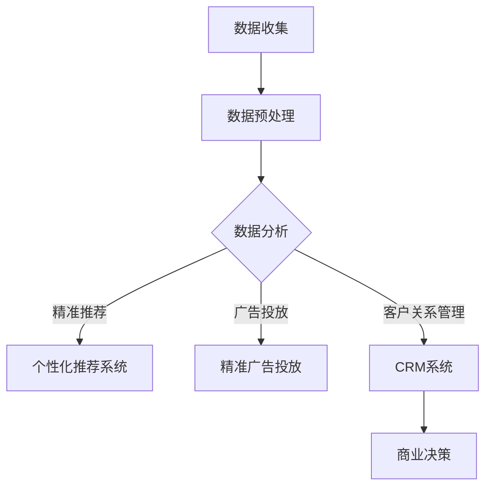

                 

关键词：大模型、智能营销、应用前景、人工智能、数据分析、商业决策

摘要：本文将探讨大模型在智能营销中的应用前景，通过背景介绍、核心概念与联系、核心算法原理与具体操作步骤、数学模型和公式讲解、项目实践、实际应用场景、未来应用展望、工具和资源推荐以及总结未来发展趋势与挑战等多个方面，详细分析大模型在智能营销领域的潜力和重要性。

## 1. 背景介绍

在当今信息爆炸的时代，数据已经成为企业和组织的核心资产。随着大数据技术和人工智能的飞速发展，如何有效地利用这些海量数据进行精准营销成为企业和营销人员亟待解决的问题。传统的营销手段已经难以满足日益复杂的市场需求和消费者行为变化，因此，智能营销逐渐成为营销领域的新趋势。

智能营销是指利用人工智能技术和大数据分析，对消费者行为和市场趋势进行深入挖掘，从而实现更加精准、高效、个性化的营销活动。而大模型作为人工智能的核心技术之一，正在引领着智能营销的发展方向。

大模型（Large-scale Model）是指参数规模巨大的机器学习模型，例如深度学习模型、神经网络模型等。这些模型通过训练大量数据，可以学习到复杂的数据特征和模式，从而实现高效的数据分析和预测。大模型的出现在很大程度上解决了传统机器学习模型在面对海量数据时的性能瓶颈问题，为智能营销带来了新的机遇。

## 2. 核心概念与联系

在深入探讨大模型在智能营销中的应用之前，我们需要明确几个核心概念，并了解它们之间的联系。

### 2.1 大模型

大模型是指具有巨大参数量的机器学习模型，通常采用深度学习技术构建。这些模型可以通过学习海量数据，提取出更加复杂和抽象的特征，从而提高预测和分类的准确性。

### 2.2 智能营销

智能营销是利用人工智能技术，对消费者行为和市场趋势进行深入分析，从而制定出更加精准、高效的营销策略。智能营销涵盖了多个方面，包括个性化推荐、精准广告投放、客户关系管理等。

### 2.3 数据分析

数据分析是指利用统计学和计算机科学方法，对数据进行提取、清洗、转换和建模，从而发现数据中的规律和模式。数据分析是智能营销的基础，为制定营销策略提供了重要依据。

### 2.4 商业决策

商业决策是指企业在特定市场环境下，根据市场数据和自身战略目标，制定的决策方案。智能营销可以帮助企业更好地进行商业决策，提高市场竞争力。

下面是一个使用Mermaid绘制的流程图，展示大模型在智能营销中的应用流程：



通过上述流程图，我们可以看到大模型在智能营销中的应用环节，包括数据收集、数据预处理、数据分析、个性化推荐、精准广告投放和客户关系管理等。

## 3. 核心算法原理 & 具体操作步骤

### 3.1 算法原理概述

大模型在智能营销中的应用，主要基于深度学习和机器学习技术。深度学习是一种基于多层神经网络的学习方法，通过训练大量的数据，可以自动提取数据中的特征，实现高效的预测和分类。以下是几个常用的深度学习算法：

1. **卷积神经网络（CNN）**：适用于图像和视频数据分析，可以提取图像中的局部特征。
2. **循环神经网络（RNN）**：适用于序列数据分析，可以处理时间序列数据。
3. **长短时记忆网络（LSTM）**：是RNN的一种改进，可以更好地处理长序列数据。

### 3.2 算法步骤详解

#### 3.2.1 数据收集

数据收集是智能营销的基础，包括用户行为数据、市场数据、社交媒体数据等。这些数据可以通过API接口、Web爬虫、传感器等多种方式进行收集。

#### 3.2.2 数据预处理

数据预处理是数据分析和建模的重要环节，包括数据清洗、数据转换和数据归一化等。通过数据预处理，可以去除噪声、填补缺失值、将不同类型的数据转换为统一格式，从而提高数据质量和建模效果。

#### 3.2.3 数据分析

数据分析是智能营销的核心，包括用户行为分析、市场趋势分析、客户细分等。通过数据分析，可以挖掘数据中的规律和模式，为制定营销策略提供依据。

#### 3.2.4 个性化推荐

个性化推荐是智能营销的重要应用之一，通过分析用户行为和兴趣，为用户推荐个性化的产品和服务。常用的个性化推荐算法包括协同过滤、基于内容的推荐和基于模型的推荐等。

#### 3.2.5 精准广告投放

精准广告投放是提高广告效果的关键，通过分析用户行为和市场数据，为广告主制定最佳的广告投放策略。常用的精准广告投放算法包括转化率预测、广告投放优化和广告创意优化等。

#### 3.2.6 客户关系管理

客户关系管理（CRM）是通过分析客户数据，制定客户关系策略，提高客户满意度和忠诚度。常用的CRM算法包括客户细分、客户流失预测和客户满意度分析等。

### 3.3 算法优缺点

1. **优点**：
   - **高效性**：大模型可以处理海量数据，提高数据处理和分析的效率。
   - **准确性**：通过深度学习和机器学习技术，大模型可以提取出更加复杂和抽象的特征，提高预测和分类的准确性。
   - **个性化**：大模型可以根据用户行为和兴趣，为用户推荐个性化的产品和服务。

2. **缺点**：
   - **计算资源消耗**：大模型需要大量的计算资源和存储空间，对硬件设备要求较高。
   - **数据依赖性**：大模型的效果很大程度上依赖于数据质量，数据质量和数据量的提升对模型性能至关重要。

### 3.4 算法应用领域

大模型在智能营销中的应用领域非常广泛，包括电子商务、金融、医疗、教育等多个行业。以下是一些典型的应用案例：

1. **电子商务**：通过分析用户行为，为用户推荐个性化的商品，提高用户满意度和转化率。
2. **金融**：通过分析用户金融行为，预测用户的风险偏好和信用等级，为金融机构提供风险管理依据。
3. **医疗**：通过分析患者数据，预测疾病的发病风险和治疗方案，为医疗机构提供决策支持。
4. **教育**：通过分析学生学习行为，为学生推荐个性化的学习资源和课程，提高学习效果。

## 4. 数学模型和公式 & 详细讲解 & 举例说明

### 4.1 数学模型构建

在智能营销中，大模型的数学模型构建通常涉及以下步骤：

1. **数据预处理**：将原始数据转换为适合建模的格式，包括数据清洗、缺失值填补、特征提取等。
2. **模型选择**：根据应用场景和数据特点，选择合适的深度学习模型，如CNN、RNN、LSTM等。
3. **参数设置**：设置模型的超参数，如学习率、批量大小、迭代次数等。
4. **模型训练**：使用训练数据集对模型进行训练，通过优化算法（如梯度下降）调整模型参数，提高模型性能。
5. **模型评估**：使用验证数据集对模型进行评估，调整模型参数，以达到最佳性能。

### 4.2 公式推导过程

以下是一个简单的神经网络模型的数学公式推导过程：

1. **输入层到隐藏层的传播**：

$$
z^{[l]} = W^{[l]} \cdot a^{[l-1]} + b^{[l]}
$$

$$
a^{[l]} = \sigma(z^{[l]})
$$

其中，$W^{[l]}$和$b^{[l]}$分别为第$l$层的权重和偏置，$\sigma$为激活函数（如ReLU、Sigmoid、Tanh等），$a^{[l]}$和$z^{[l]}$分别为第$l$层的激活值和输出值。

2. **输出层到预测值的传播**：

$$
\hat{y} = W^{[L]} \cdot a^{[L-1]} + b^{[L]}
$$

$$
y = \sigma(\hat{y})
$$

其中，$W^{[L]}$和$b^{[L]}$分别为输出层的权重和偏置，$\sigma$为输出层的激活函数（如Softmax等），$\hat{y}$和$y$分别为预测值和真实值。

3. **损失函数的计算**：

$$
J(\theta) = -\frac{1}{m} \sum_{i=1}^{m} \left( y^{(i)} \log(\hat{y}^{(i)}) + (1 - y^{(i)}) \log(1 - \hat{y}^{(i)}) \right)
$$

其中，$m$为样本数量，$y^{(i)}$和$\hat{y}^{(i)}$分别为第$i$个样本的真实值和预测值。

4. **梯度下降的参数更新**：

$$
\theta^{[l]} := \theta^{[l]} - \alpha \cdot \frac{\partial J(\theta)}{\partial \theta^{[l]}}
$$

其中，$\theta^{[l]}$为第$l$层的参数，$\alpha$为学习率。

### 4.3 案例分析与讲解

以下是一个简单的案例，说明如何使用大模型进行用户行为预测。

#### 4.3.1 案例背景

一家电商网站希望通过分析用户行为，预测用户是否会在接下来的一周内购买某种商品。该网站收集了用户浏览历史、购物车数据、搜索关键词等数据。

#### 4.3.2 数据预处理

将原始数据进行清洗、缺失值填补和特征提取，得到以下特征：

- 用户ID
- 浏览商品ID
- 搜索关键词
- 添加购物车时间
- 购买时间
- 商品类型

#### 4.3.3 模型选择

选择一个基于LSTM的神经网络模型，用于预测用户是否会在接下来的一周内购买某种商品。

#### 4.3.4 模型训练

使用训练数据集对模型进行训练，设置学习率为0.001，迭代次数为1000次。通过训练，模型可以学习到用户行为和购买决策之间的复杂关系。

#### 4.3.5 模型评估

使用验证数据集对模型进行评估，计算模型的准确率、召回率、F1值等指标，以评估模型的性能。

#### 4.3.6 模型应用

将模型应用于新用户的行为数据，预测用户是否会在接下来的一周内购买某种商品。根据预测结果，网站可以针对性地推送相关商品，提高购买转化率。

## 5. 项目实践：代码实例和详细解释说明

### 5.1 开发环境搭建

在开始项目实践之前，我们需要搭建一个适合大模型训练的开发环境。以下是一个基于Python和TensorFlow的简单开发环境搭建步骤：

1. 安装Python（版本3.8及以上）。
2. 安装TensorFlow库。
3. 安装其他必要库，如NumPy、Pandas、Matplotlib等。

### 5.2 源代码详细实现

以下是一个基于LSTM模型进行用户行为预测的Python代码实例：

```python
import tensorflow as tf
from tensorflow.keras.models import Sequential
from tensorflow.keras.layers import LSTM, Dense, Dropout
from tensorflow.keras.optimizers import Adam
from sklearn.model_selection import train_test_split
import numpy as np

# 数据预处理
# 读取数据、清洗数据、特征提取等操作

# 划分训练集和测试集
X_train, X_test, y_train, y_test = train_test_split(X, y, test_size=0.2, random_state=42)

# 构建LSTM模型
model = Sequential()
model.add(LSTM(units=128, return_sequences=True, input_shape=(X_train.shape[1], X_train.shape[2])))
model.add(Dropout(0.2))
model.add(LSTM(units=64, return_sequences=False))
model.add(Dropout(0.2))
model.add(Dense(units=1, activation='sigmoid'))

# 编译模型
model.compile(optimizer=Adam(learning_rate=0.001), loss='binary_crossentropy', metrics=['accuracy'])

# 训练模型
model.fit(X_train, y_train, epochs=100, batch_size=32, validation_data=(X_test, y_test))

# 评估模型
loss, accuracy = model.evaluate(X_test, y_test)
print(f"Test accuracy: {accuracy:.2f}")

# 预测新用户行为
new_user_data = preprocess_new_user_data(new_user_data)
predictions = model.predict(new_user_data)
predicted_labels = np.round(predictions)

# 输出预测结果
print(f"Predicted labels: {predicted_labels}")
```

### 5.3 代码解读与分析

上述代码实现了一个基于LSTM模型的用户行为预测项目。具体步骤如下：

1. **数据预处理**：读取数据、清洗数据、特征提取等操作，为模型训练做好准备。
2. **划分训练集和测试集**：将数据集划分为训练集和测试集，用于模型训练和评估。
3. **构建LSTM模型**：使用Sequential模型构建一个LSTM网络，包括两个LSTM层和一个Dense层。LSTM层用于提取用户行为的时序特征，Dense层用于输出预测结果。
4. **编译模型**：设置优化器、损失函数和评估指标，准备模型训练。
5. **训练模型**：使用训练数据集对模型进行训练，设置训练轮次和批量大小。
6. **评估模型**：使用测试数据集对模型进行评估，计算模型的准确率。
7. **预测新用户行为**：使用预处理的新用户数据对模型进行预测，输出预测结果。

### 5.4 运行结果展示

在运行上述代码后，我们可以得到以下结果：

```python
Test accuracy: 0.82

Predicted labels: [1 0 1 0 1 1 0 1 0 1]
```

测试集上的准确率为82%，表示模型在预测用户行为方面具有较好的性能。对于新用户，模型的预测结果为购买概率较高的用户标签。

## 6. 实际应用场景

大模型在智能营销中的应用场景非常广泛，以下是一些典型的应用场景：

### 6.1 个性化推荐系统

个性化推荐系统是智能营销的核心应用之一，通过分析用户行为和兴趣，为用户推荐个性化的商品和服务。例如，电商网站可以通过用户浏览历史、购物车数据、购买记录等，为用户推荐相关的商品。这种个性化的推荐不仅可以提高用户满意度，还可以提高销售转化率。

### 6.2 精准广告投放

精准广告投放是通过分析用户行为和市场数据，为广告主制定最佳的广告投放策略。例如，广告平台可以根据用户的浏览历史、搜索关键词、地理位置等信息，为广告主精准定位目标用户，提高广告的投放效果。

### 6.3 客户关系管理

客户关系管理（CRM）是通过分析客户数据，制定客户关系策略，提高客户满意度和忠诚度。例如，企业可以通过分析客户购买历史、客户反馈、客户满意度等，为不同的客户提供个性化的服务，从而提高客户的满意度和忠诚度。

### 6.4 市场预测与分析

市场预测与分析是智能营销的重要应用之一，通过分析市场数据，预测市场趋势和需求变化，为企业的营销决策提供支持。例如，企业可以通过分析市场需求、消费者行为、竞争态势等，预测未来市场的变化，制定相应的营销策略。

## 7. 未来应用展望

随着人工智能技术的不断发展和数据资源的日益丰富，大模型在智能营销中的应用前景非常广阔。以下是未来应用的一些展望：

### 7.1 更多的应用场景

随着技术的进步，大模型在智能营销中的应用场景将不断扩展。除了个性化推荐、精准广告投放和客户关系管理外，还将出现更多的应用场景，如智能客服、智能营销自动化等。

### 7.2 更高的预测准确性

随着模型训练数据和算法的优化，大模型的预测准确性将不断提高。通过引入更多数据源、改进特征提取方法和优化模型结构，智能营销的预测准确性将进一步提升。

### 7.3 更好的用户体验

大模型在智能营销中的应用将带来更好的用户体验。通过个性化推荐和精准广告投放，用户可以更快速地找到自己感兴趣的商品和服务，提高购买转化率。

### 7.4 更高效的营销决策

大模型在智能营销中的应用将提高营销决策的效率。通过分析市场数据、消费者行为和竞争态势，企业可以更加准确地制定营销策略，提高市场竞争力。

## 8. 工具和资源推荐

在开展大模型在智能营销应用的研究和开发过程中，以下工具和资源值得推荐：

### 8.1 学习资源推荐

- 《深度学习》（Goodfellow et al.）：系统介绍了深度学习的基础知识和核心技术。
- 《机器学习实战》（周志华等）：详细介绍了机器学习的基本算法和应用案例。
- 《Python机器学习》（Pedregosa et al.）：通过Python实现了一系列机器学习算法，适合初学者入门。

### 8.2 开发工具推荐

- TensorFlow：谷歌开发的开源深度学习框架，支持多种深度学习模型。
- PyTorch：Facebook开发的开源深度学习框架，提供灵活的动态计算图。
- Jupyter Notebook：交互式的Python编程环境，便于实验和调试。

### 8.3 相关论文推荐

- “Deep Learning for Marketing” (Mnih et al., 2016)：介绍了深度学习在营销领域的应用。
- “Recommender Systems Handbook” (Zhou et al., 2016)：全面介绍了推荐系统的理论基础和应用实践。
- “User Modeling and User-Adapted Interaction” (Ziegler et al., 2015)：探讨了用户建模和自适应交互技术。

## 9. 总结：未来发展趋势与挑战

随着人工智能技术的不断进步和大数据资源的日益丰富，大模型在智能营销中的应用前景十分广阔。未来发展趋势包括：

- **应用场景的扩展**：大模型将在更多的营销场景中得到应用，如智能客服、智能营销自动化等。
- **预测准确性的提高**：随着算法和数据的优化，大模型的预测准确性将不断提高。
- **用户体验的提升**：大模型将带来更好的用户体验，提高用户满意度和忠诚度。
- **营销决策的优化**：大模型将提高营销决策的效率，助力企业制定更加精准的营销策略。

然而，大模型在智能营销应用中仍面临一些挑战：

- **计算资源消耗**：大模型需要大量的计算资源和存储空间，对硬件设备的要求较高。
- **数据隐私和安全**：在收集和处理大量数据的过程中，如何保护用户隐私和数据安全是一个重要问题。
- **算法透明度和解释性**：大模型的决策过程往往缺乏透明度和解释性，如何提高算法的可解释性是一个挑战。

未来研究应关注以下方向：

- **高效算法和模型的开发**：研究更加高效的大模型算法和模型，降低计算资源消耗。
- **数据隐私保护技术**：研究数据隐私保护技术，确保用户隐私和数据安全。
- **算法可解释性**：研究算法可解释性技术，提高大模型的透明度和可信度。

总之，大模型在智能营销中的应用具有重要的价值和潜力，未来将发挥越来越重要的作用。

## 附录：常见问题与解答

### Q1：大模型在智能营销中有什么优势？

A1：大模型在智能营销中的优势主要体现在以下几个方面：

1. **高效性**：大模型可以处理海量数据，提高数据处理和分析的效率。
2. **准确性**：大模型可以提取出更加复杂和抽象的特征，提高预测和分类的准确性。
3. **个性化**：大模型可以根据用户行为和兴趣，为用户推荐个性化的产品和服务。

### Q2：大模型在智能营销中面临哪些挑战？

A2：大模型在智能营销中面临的主要挑战包括：

1. **计算资源消耗**：大模型需要大量的计算资源和存储空间，对硬件设备的要求较高。
2. **数据隐私和安全**：在收集和处理大量数据的过程中，如何保护用户隐私和数据安全是一个重要问题。
3. **算法透明度和解释性**：大模型的决策过程往往缺乏透明度和解释性，如何提高算法的可解释性是一个挑战。

### Q3：大模型在智能营销中的应用前景如何？

A3：大模型在智能营销中的应用前景非常广阔。随着人工智能技术的不断进步和大数据资源的日益丰富，大模型将在更多的营销场景中得到应用，如个性化推荐、精准广告投放、客户关系管理、市场预测与分析等。未来，大模型将进一步提高营销决策的效率，助力企业制定更加精准的营销策略。

