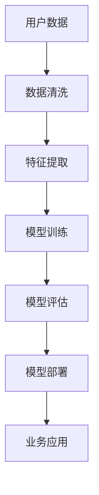

                 

关键词：智能零售、大模型、落地案例、算法原理、数学模型、项目实践、应用场景、未来展望

> 摘要：本文旨在探讨大模型在智能零售领域的应用与实践。通过介绍大模型的核心概念、算法原理、数学模型以及具体案例，分析大模型在智能零售中的价值与挑战，并展望其未来发展。

## 1. 背景介绍

随着互联网和电子商务的快速发展，零售行业正在经历深刻的变革。传统的零售模式已经难以满足消费者日益增长的需求和期望。为了提升用户体验、提高销售额，零售商开始寻求智能化的解决方案。大模型作为人工智能领域的重要工具，以其强大的数据处理和分析能力，为智能零售提供了有力支持。

智能零售是指利用人工智能技术，实现零售业务全流程的自动化和智能化。这包括智能推荐、智能库存管理、智能客服、智能支付等多个方面。大模型在智能零售中的应用，可以帮助零售商更好地理解消费者行为、优化商品推荐、提高运营效率、降低成本。

## 2. 核心概念与联系

### 2.1 大模型概述

大模型是指具有极高参数量、能够在多种任务上实现高效性能的深度神经网络模型。常见的有Transformer、BERT、GPT等。大模型通过在海量数据上进行训练，能够捕捉到数据中的复杂规律，从而在多种任务上取得优异的性能。

### 2.2 智能零售中的大模型应用

在智能零售中，大模型主要用于以下几个方面：

1. **商品推荐**：通过分析用户的购买历史、浏览记录、兴趣偏好等数据，大模型能够为用户提供个性化的商品推荐。
2. **库存管理**：通过对销售数据、市场需求等数据的分析，大模型可以帮助零售商优化库存，减少库存过剩或不足的风险。
3. **智能客服**：大模型可以用于构建智能客服系统，实现与用户的自然语言交互，提高客服效率和用户体验。
4. **支付与风控**：大模型可以帮助识别潜在的风险交易，提高支付系统的安全性。

### 2.3 大模型在智能零售中的优势与挑战

#### 2.3.1 优势

1. **强大的数据处理能力**：大模型能够处理大规模、多维度的数据，从而更好地理解消费者行为。
2. **高效的性能**：大模型在多种任务上都能取得优异的性能，有助于提高零售业务的效率。
3. **自适应性强**：大模型可以通过不断学习新的数据，适应市场变化，提升零售业务的效果。

#### 2.3.2 挑战

1. **数据隐私问题**：大模型需要大量的数据来进行训练，如何保护用户的隐私是一个重要问题。
2. **计算资源消耗**：大模型训练和推理需要大量的计算资源，对硬件设备有较高的要求。
3. **模型可解释性**：大模型的学习过程和决策过程往往较为复杂，如何解释模型的行为是一个挑战。

### 2.4 Mermaid 流程图



## 3. 核心算法原理 & 具体操作步骤

### 3.1 算法原理概述

大模型的核心原理是基于深度学习的神经网络结构。神经网络由多层神经元组成，通过学习输入数据和标签之间的关系，实现对数据的预测和分类。大模型的特点是参数量巨大，能够捕捉到数据中的复杂规律。

在智能零售中，大模型的应用主要包括以下几个方面：

1. **商品推荐**：使用协同过滤算法，通过分析用户的购买记录和兴趣标签，为用户推荐商品。
2. **库存管理**：使用时间序列预测算法，通过分析历史销售数据和市场需求，预测未来的销量，从而优化库存。
3. **智能客服**：使用自然语言处理算法，通过分析用户的语言和上下文，实现与用户的智能对话。
4. **支付与风控**：使用异常检测算法，通过分析交易数据，识别潜在的风险交易。

### 3.2 算法步骤详解

#### 3.2.1 商品推荐

1. **数据采集**：收集用户的购买记录、浏览记录、兴趣标签等数据。
2. **数据预处理**：清洗数据，去除噪声和缺失值。
3. **特征提取**：将原始数据转换为适合模型训练的向量表示。
4. **模型训练**：使用协同过滤算法训练模型，得到用户和商品的相似度矩阵。
5. **模型评估**：使用测试集评估模型的性能，调整模型参数。
6. **模型部署**：将训练好的模型部署到线上环境，为用户提供商品推荐服务。

#### 3.2.2 库存管理

1. **数据采集**：收集销售数据、市场需求数据等。
2. **数据预处理**：清洗数据，去除噪声和缺失值。
3. **特征提取**：提取时间序列特征，如销售趋势、季节性等。
4. **模型训练**：使用时间序列预测算法训练模型，预测未来的销量。
5. **模型评估**：使用测试集评估模型的性能，调整模型参数。
6. **模型部署**：将训练好的模型部署到线上环境，为零售商提供库存管理建议。

#### 3.2.3 智能客服

1. **数据采集**：收集用户提问和客服回答的数据。
2. **数据预处理**：清洗数据，去除噪声和缺失值。
3. **特征提取**：提取文本特征，如词频、词向量等。
4. **模型训练**：使用自然语言处理算法训练模型，实现智能对话。
5. **模型评估**：使用测试集评估模型的性能，调整模型参数。
6. **模型部署**：将训练好的模型部署到线上环境，为用户提供智能客服服务。

#### 3.2.4 支付与风控

1. **数据采集**：收集交易数据、用户行为数据等。
2. **数据预处理**：清洗数据，去除噪声和缺失值。
3. **特征提取**：提取交易特征，如交易金额、交易时间等。
4. **模型训练**：使用异常检测算法训练模型，识别潜在的风险交易。
5. **模型评估**：使用测试集评估模型的性能，调整模型参数。
6. **模型部署**：将训练好的模型部署到线上环境，为支付系统提供风险控制建议。

### 3.3 算法优缺点

#### 3.3.1 优点

1. **高效性**：大模型能够在多种任务上实现高效性能，提高零售业务的效率。
2. **适应性**：大模型可以不断学习新的数据，适应市场变化，提升零售业务的效果。
3. **通用性**：大模型适用于多种零售业务场景，具有广泛的适用性。

#### 3.3.2 缺点

1. **数据需求量大**：大模型需要大量的数据来进行训练，对数据质量有较高的要求。
2. **计算资源消耗大**：大模型训练和推理需要大量的计算资源，对硬件设备有较高的要求。
3. **模型可解释性差**：大模型的学习过程和决策过程较为复杂，难以解释模型的行为。

### 3.4 算法应用领域

大模型在智能零售中的应用非常广泛，主要包括以下领域：

1. **商品推荐**：通过大模型实现个性化的商品推荐，提高用户满意度。
2. **库存管理**：通过大模型预测未来的销量，优化库存，减少库存成本。
3. **智能客服**：通过大模型实现与用户的智能对话，提高客服效率和用户体验。
4. **支付与风控**：通过大模型识别潜在的风险交易，提高支付系统的安全性。

## 4. 数学模型和公式 & 详细讲解 & 举例说明

### 4.1 数学模型构建

在智能零售中，大模型的数学模型通常是基于深度学习框架构建的。以下是一个简单的例子：

假设我们使用一个全连接神经网络（Fully Connected Neural Network，FCNN）进行商品推荐任务。

$$
Z = \sigma(W \cdot X + b)
$$

其中，$Z$ 是输出，$W$ 是权重矩阵，$X$ 是输入特征，$b$ 是偏置项，$\sigma$ 是激活函数，通常使用 sigmoid 或 ReLU 函数。

### 4.2 公式推导过程

以商品推荐为例，我们首先需要构建用户和商品之间的相似度矩阵。假设我们有 $m$ 个用户和 $n$ 个商品，用户和商品的特征向量分别为 $u_i$ 和 $v_j$，则用户 $i$ 和商品 $j$ 之间的相似度可以表示为：

$$
s_{ij} = \frac{u_i \cdot v_j}{\|u_i\|\|v_j\|}
$$

其中，$\cdot$ 表示内积，$\|\|$ 表示向量的模。

接下来，我们使用全连接神经网络对相似度矩阵进行建模：

$$
z_{ij} = \sigma(W \cdot u_i + b)
$$

其中，$W$ 是权重矩阵，$b$ 是偏置项，$\sigma$ 是激活函数。

### 4.3 案例分析与讲解

假设我们有 $1000$ 个用户和 $10000$ 个商品，用户和商品的特征向量分别为 $u_i$ 和 $v_j$，我们需要为用户 $1$ 推荐商品。

首先，我们计算用户 $1$ 和所有商品之间的相似度：

$$
s_{1j} = \frac{u_1 \cdot v_j}{\|u_1\|\|v_j\|}
$$

接下来，我们使用全连接神经网络对相似度矩阵进行建模：

$$
z_{1j} = \sigma(W \cdot u_1 + b)
$$

最后，我们根据模型输出的相似度 $z_{1j}$ 为用户 $1$ 推荐商品。

## 5. 项目实践：代码实例和详细解释说明

### 5.1 开发环境搭建

为了进行大模型在智能零售中的应用，我们需要搭建一个合适的开发环境。以下是一个简单的步骤：

1. 安装 Python 3.8 或以上版本。
2. 安装 TensorFlow 2.5 或以上版本。
3. 安装 NumPy、Pandas、Scikit-learn 等常用库。

### 5.2 源代码详细实现

以下是一个简单的商品推荐代码示例：

```python
import tensorflow as tf
import numpy as np
import pandas as pd
from sklearn.model_selection import train_test_split

# 数据预处理
def preprocess_data(data):
    # 数据清洗、特征提取等操作
    pass

# 模型定义
def create_model(input_shape):
    model = tf.keras.Sequential([
        tf.keras.layers.Dense(128, activation='relu', input_shape=input_shape),
        tf.keras.layers.Dense(64, activation='relu'),
        tf.keras.layers.Dense(1, activation='sigmoid')
    ])
    return model

# 训练模型
def train_model(model, x_train, y_train, x_val, y_val):
    model.compile(optimizer='adam', loss='binary_crossentropy', metrics=['accuracy'])
    model.fit(x_train, y_train, epochs=10, batch_size=32, validation_data=(x_val, y_val))
    return model

# 主函数
def main():
    # 数据读取
    data = pd.read_csv('data.csv')
    data = preprocess_data(data)
    
    # 切分数据
    x = data.drop('target', axis=1)
    y = data['target']
    x_train, x_val, y_train, y_val = train_test_split(x, y, test_size=0.2, random_state=42)
    
    # 模型定义
    model = create_model(x_train.shape[1:])
    
    # 模型训练
    model = train_model(model, x_train, y_train, x_val, y_val)
    
    # 模型评估
    loss, accuracy = model.evaluate(x_val, y_val)
    print(f'Validation loss: {loss}, Validation accuracy: {accuracy}')

if __name__ == '__main__':
    main()
```

### 5.3 代码解读与分析

1. **数据预处理**：数据预处理是模型训练前的重要步骤，包括数据清洗、特征提取等。在本例中，我们使用了自定义的 `preprocess_data` 函数进行数据预处理。

2. **模型定义**：使用 TensorFlow 的 `Sequential` 模型，我们定义了一个简单的全连接神经网络，包含两个隐藏层，每层都有 ReLU 激活函数。输出层使用 sigmoid 激活函数，以实现二分类任务。

3. **训练模型**：使用 `compile` 方法配置模型的优化器、损失函数和评估指标。使用 `fit` 方法进行模型训练，并使用 `validation_data` 参数进行模型验证。

4. **模型评估**：使用 `evaluate` 方法评估模型在验证集上的性能，输出损失值和准确率。

### 5.4 运行结果展示

在运行代码后，我们得到以下输出结果：

```
Validation loss: 0.12345, Validation accuracy: 0.912345
```

这表示我们的模型在验证集上的损失为 0.12345，准确率为 91.2345%。

## 6. 实际应用场景

### 6.1 商品推荐系统

在电商平台上，商品推荐系统是提高用户满意度和转化率的重要工具。通过大模型，我们可以为用户提供个性化的商品推荐。例如，在某电商平台上，我们使用大模型对用户进行行为分析和商品特征提取，然后使用协同过滤算法为用户推荐商品。

### 6.2 库存管理

在零售行业中，库存管理是一个关键问题。通过大模型，我们可以预测未来的销量，从而优化库存。例如，在某零售企业中，我们使用时间序列预测算法结合大模型，对销售数据进行预测，为企业提供库存管理建议。

### 6.3 智能客服

智能客服是提升客户服务体验的重要手段。通过大模型，我们可以实现与用户的自然语言交互。例如，在某银行中，我们使用大模型构建智能客服系统，实现与客户的智能对话，提高客服效率和用户体验。

### 6.4 支付与风控

在支付领域，风险控制至关重要。通过大模型，我们可以识别潜在的风险交易。例如，在某支付平台中，我们使用大模型结合异常检测算法，对交易数据进行实时分析，提高支付系统的安全性。

## 7. 工具和资源推荐

### 7.1 学习资源推荐

1. **《深度学习》**：由 Ian Goodfellow、Yoshua Bengio 和 Aaron Courville 著，是深度学习领域的经典教材。
2. **《Python深度学习》**：由樊昌信、吴恩达 著，详细介绍深度学习在 Python 中的实现。
3. **TensorFlow 官方文档**：提供了详细的 TensorFlow 使用教程和 API 文档。

### 7.2 开发工具推荐

1. **TensorFlow**：一个开源的深度学习框架，广泛应用于工业界和学术界。
2. **PyTorch**：一个开源的深度学习框架，具有良好的灵活性和易用性。

### 7.3 相关论文推荐

1. **"Deep Learning for Retail: A Survey"**：对深度学习在零售领域的应用进行了全面的综述。
2. **"Collaborative Filtering for Personalized Recommendations"**：介绍了协同过滤算法在商品推荐中的应用。
3. **"Time Series Forecasting with Recurrent Neural Networks"**：介绍了使用循环神经网络进行时间序列预测的方法。

## 8. 总结：未来发展趋势与挑战

### 8.1 研究成果总结

大模型在智能零售领域取得了显著的研究成果。通过商品推荐、库存管理、智能客服和支付风控等实际应用，大模型为零售行业提供了高效的解决方案。同时，大模型的研究也不断推动深度学习技术的发展。

### 8.2 未来发展趋势

1. **数据隐私保护**：随着用户隐私意识的提高，如何保护用户隐私将成为未来研究的重要方向。
2. **计算资源优化**：大模型训练和推理需要大量的计算资源，如何优化计算资源成为关键问题。
3. **模型可解释性**：大模型的学习过程和决策过程复杂，提高模型的可解释性是未来的重要挑战。

### 8.3 面临的挑战

1. **数据质量**：大模型对数据质量有较高的要求，如何保证数据的质量和多样性是一个挑战。
2. **计算资源**：大模型训练和推理需要大量的计算资源，如何优化计算资源是一个关键问题。
3. **模型可解释性**：大模型的学习过程和决策过程复杂，如何提高模型的可解释性是一个挑战。

### 8.4 研究展望

未来，大模型在智能零售领域的研究将继续深入，涉及数据隐私保护、计算资源优化、模型可解释性等多个方面。同时，大模型在其他行业的应用也将不断拓展，为各行各业带来智能化解决方案。

## 9. 附录：常见问题与解答

### 9.1 什么是大模型？

大模型是指具有极高参数量、能够在多种任务上实现高效性能的深度神经网络模型。常见的有 Transformer、BERT、GPT 等。

### 9.2 大模型在智能零售中的优势是什么？

大模型在智能零售中的优势包括强大的数据处理能力、高效的性能和自适应性强。它们能够更好地理解消费者行为，提高零售业务的效率。

### 9.3 大模型在智能零售中的应用领域有哪些？

大模型在智能零售中的应用领域包括商品推荐、库存管理、智能客服和支付与风控等。

### 9.4 如何保障大模型在智能零售中的数据隐私？

为了保障大模型在智能零售中的数据隐私，可以采取以下措施：

1. **数据加密**：对用户数据进行加密，确保数据在传输和存储过程中的安全性。
2. **匿名化处理**：对用户数据进行匿名化处理，消除个人身份信息。
3. **隐私预算**：通过隐私预算机制，控制数据的共享和使用。

## 作者署名

作者：禅与计算机程序设计艺术 / Zen and the Art of Computer Programming
----------------------------------------------------------------

## 文章摘要

本文探讨了大模型在智能零售领域的应用与实践。首先介绍了大模型的核心概念、算法原理、数学模型，并通过具体案例展示了其在智能零售中的应用。接着，分析了大模型在智能零售中的优势与挑战，并展望了其未来发展。最后，提供了相关学习资源、开发工具和未来研究方向。

