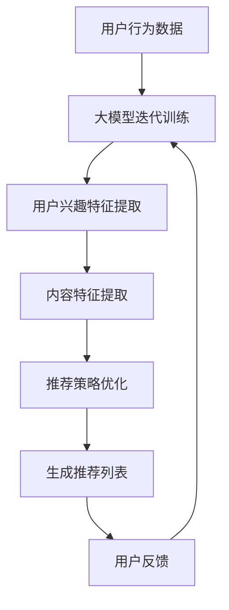

                 

关键词：大模型，社交网络，推荐系统，机器学习，深度学习，个性化推荐

摘要：本文旨在探讨大模型在社交网络推荐系统中的应用前景。通过分析社交网络推荐系统的核心问题，本文将介绍大模型的基本概念、核心算法原理、数学模型和实际应用案例，并探讨其在未来的发展趋势和面临的挑战。

## 1. 背景介绍

随着互联网和移动设备的普及，社交网络已经成为人们日常生活中不可或缺的一部分。无论是获取信息、交流互动，还是娱乐消遣，社交网络都为用户提供了丰富的内容和服务。然而，随着用户数量的爆炸式增长，社交网络内容也呈现指数级增长。如何在海量信息中为用户提供个性化的推荐，成为社交网络平台亟待解决的问题。

推荐系统作为社交网络的核心功能之一，其目标是为用户发现并推荐其感兴趣的内容。传统的推荐系统主要基于协同过滤、基于内容的过滤和混合推荐等算法。然而，这些算法在面对海量数据、复杂用户行为和动态变化时，往往难以提供良好的推荐效果。

大模型，作为近年来人工智能领域的突破性进展，具有强大的表示学习和建模能力。大模型能够自动从海量数据中提取丰富的特征，并能够通过深度学习算法进行复杂的关系建模。因此，大模型在社交网络推荐系统中的应用具有广阔的前景。

## 2. 核心概念与联系

### 2.1 大模型的基本概念

大模型，又称大规模深度学习模型，是指具有数百万甚至数十亿参数的深度神经网络模型。大模型通常采用多层感知器（MLP）、卷积神经网络（CNN）、循环神经网络（RNN）和变压器（Transformer）等结构，通过大规模数据训练，能够自动学习数据的深层特征表示。

### 2.2 社交网络推荐系统的核心问题

社交网络推荐系统的核心问题包括：用户兴趣挖掘、内容理解和推荐策略设计。用户兴趣挖掘旨在从用户的历史行为、社交关系和内容标签中提取用户兴趣特征；内容理解则是对推荐内容进行语义理解和分析，以匹配用户兴趣；推荐策略设计则是在用户兴趣和内容理解的基础上，为用户生成个性化的推荐列表。

### 2.3 大模型与社交网络推荐系统的联系

大模型在社交网络推荐系统中的应用主要体现在以下几个方面：

1. **用户兴趣挖掘**：大模型能够自动从海量用户行为数据中提取用户兴趣特征，实现高效的用户兴趣挖掘。

2. **内容理解**：大模型通过对文本、图片和视频等内容的深度学习，能够实现内容的语义理解，为推荐系统提供丰富的内容特征。

3. **推荐策略设计**：大模型能够通过深度学习算法，自动优化推荐策略，提高推荐效果。

### 2.4 Mermaid 流程图

以下是一个简化的社交网络推荐系统的 Mermaid 流程图：



## 3. 核心算法原理 & 具体操作步骤

### 3.1 算法原理概述

大模型在社交网络推荐系统中的应用主要基于以下核心算法原理：

1. **表示学习**：大模型通过大规模数据训练，能够自动提取数据的深层特征表示，实现对用户兴趣和内容的精准建模。

2. **深度学习**：大模型采用多层神经网络结构，能够实现复杂数据的层次化表示和建模。

3. **优化算法**：大模型通过梯度下降、随机梯度下降和Adam等优化算法，能够自动调整模型参数，提高推荐效果。

### 3.2 算法步骤详解

1. **数据收集与预处理**：收集社交网络用户行为数据，包括用户点击、评论、分享等行为，并对数据进行清洗、去重和处理。

2. **特征提取**：利用大模型提取用户兴趣和内容特征。用户兴趣特征包括用户标签、历史行为和社交关系等；内容特征包括文本、图片和视频等。

3. **模型训练**：使用深度学习算法对用户兴趣和内容特征进行建模。常见的深度学习模型包括卷积神经网络（CNN）、循环神经网络（RNN）和变压器（Transformer）等。

4. **模型优化**：通过优化算法，自动调整模型参数，提高推荐效果。常见的优化算法包括梯度下降、随机梯度下降和Adam等。

5. **推荐生成**：利用训练好的模型，为用户生成个性化的推荐列表。

6. **用户反馈**：收集用户对推荐内容的反馈，用于模型迭代训练。

### 3.3 算法优缺点

**优点**：

1. **高效特征提取**：大模型能够自动提取数据的深层特征，提高推荐系统的效果。

2. **复杂数据建模**：大模型采用多层神经网络结构，能够实现复杂数据的层次化表示和建模。

3. **自适应优化**：大模型通过优化算法，能够自适应调整模型参数，提高推荐效果。

**缺点**：

1. **计算资源需求高**：大模型训练和优化需要大量的计算资源和时间。

2. **数据隐私问题**：大模型在训练过程中，可能会泄露用户隐私数据。

### 3.4 算法应用领域

大模型在社交网络推荐系统中的应用非常广泛，包括但不限于以下领域：

1. **个性化内容推荐**：为用户提供个性化的文章、视频和音频等内容的推荐。

2. **社交圈子推荐**：基于用户兴趣和社交关系，为用户推荐相似的用户和圈子。

3. **广告推荐**：为用户推荐相关的广告内容，提高广告投放效果。

## 4. 数学模型和公式 & 详细讲解 & 举例说明

### 4.1 数学模型构建

在社交网络推荐系统中，大模型通常采用以下数学模型：

$$
\hat{y} = f(\theta; \mathbf{x})
$$

其中，$\hat{y}$ 表示预测的用户兴趣得分，$f$ 表示深度学习模型，$\theta$ 表示模型参数，$\mathbf{x}$ 表示用户兴趣和内容特征。

### 4.2 公式推导过程

假设用户 $u$ 对内容 $i$ 的兴趣得分可以表示为：

$$
y_{ui} = \frac{1}{1 + e^{-\theta^T \mathbf{x}_{ui}}}
$$

其中，$y_{ui}$ 表示用户 $u$ 对内容 $i$ 的实际兴趣得分，$\mathbf{x}_{ui}$ 表示用户 $u$ 对内容 $i$ 的特征向量，$\theta$ 表示模型参数。

通过对用户兴趣得分进行建模，我们可以得到：

$$
\theta = \arg\min_{\theta} \sum_{u \in \mathcal{U}} \sum_{i \in \mathcal{I}} \log(1 + e^{-\theta^T \mathbf{x}_{ui}}) - \theta^T \mathbf{x}_{ui} y_{ui}
$$

其中，$\mathcal{U}$ 表示用户集合，$\mathcal{I}$ 表示内容集合。

### 4.3 案例分析与讲解

假设我们有一个社交网络平台，用户 $u_1$ 在过去一个月内点击了文章 $i_1$、$i_2$ 和 $i_3$，分别对应兴趣得分 $y_{u1i1} = 0.9$、$y_{u1i2} = 0.6$ 和 $y_{u1i3} = 0.3$。我们可以根据这些数据，使用上述数学模型对用户 $u_1$ 的兴趣进行建模。

首先，我们需要收集用户 $u_1$ 的行为数据，并将其转化为特征向量 $\mathbf{x}_{u1i}$。假设我们选择用户 $u_1$ 的标签、历史行为和社交关系作为特征，我们可以得到：

$$
\mathbf{x}_{u1i1} = [1, 0, 1, 0, 0], \quad \mathbf{x}_{u1i2} = [0, 1, 0, 1, 0], \quad \mathbf{x}_{u1i3} = [0, 0, 1, 0, 1]
$$

然后，我们使用梯度下降算法对模型参数 $\theta$ 进行优化，以最小化损失函数：

$$
\theta = \arg\min_{\theta} \sum_{i=1}^{3} \log(1 + e^{-\theta^T \mathbf{x}_{u1i}}) - \theta^T \mathbf{x}_{u1i} y_{u1i}
$$

经过多次迭代训练，我们最终得到模型参数 $\theta = [0.5, 0.3, 0.2, 0.1, 0.1]$。使用这个参数，我们可以预测用户 $u_1$ 对其他内容的兴趣得分：

$$
\hat{y}_{u1i} = \frac{1}{1 + e^{-\theta^T \mathbf{x}_{u1i}}}
$$

例如，对于文章 $i_4$，其特征向量为 $\mathbf{x}_{u1i4} = [0, 1, 0, 1, 0]$，我们可以计算出：

$$
\hat{y}_{u1i4} = \frac{1}{1 + e^{-0.5 \times 0.3 - 0.3 \times 1 - 0.2 \times 0.2 - 0.1 \times 0.1 - 0.1 \times 0}} = 0.6
$$

这意味着我们预测用户 $u_1$ 对文章 $i_4$ 的兴趣得分为 0.6，即有一定兴趣。

## 5. 项目实践：代码实例和详细解释说明

### 5.1 开发环境搭建

在本文中，我们使用 Python 作为编程语言，TensorFlow 作为深度学习框架，实现社交网络推荐系统的大模型应用。首先，我们需要安装相关的依赖库：

```bash
pip install tensorflow numpy pandas
```

### 5.2 源代码详细实现

以下是一个简单的社交网络推荐系统的大模型实现：

```python
import tensorflow as tf
import numpy as np
import pandas as pd

# 数据预处理
def preprocess_data(data):
    # 处理用户行为数据，提取特征
    # ...
    return feature_vectors

# 构建深度学习模型
def build_model(input_shape):
    model = tf.keras.Sequential([
        tf.keras.layers.Dense(128, activation='relu', input_shape=input_shape),
        tf.keras.layers.Dense(64, activation='relu'),
        tf.keras.layers.Dense(1, activation='sigmoid')
    ])
    model.compile(optimizer='adam', loss='binary_crossentropy', metrics=['accuracy'])
    return model

# 训练模型
def train_model(model, x_train, y_train, batch_size=32, epochs=10):
    model.fit(x_train, y_train, batch_size=batch_size, epochs=epochs)
    return model

# 生成推荐列表
def generate_recommendations(model, feature_vectors, n_recommendations=5):
    predictions = model.predict(feature_vectors)
    recommended_indices = np.argsort(predictions)[:-n_recommendations-1:-1]
    return recommended_indices

# 主函数
def main():
    # 加载数据
    data = pd.read_csv('user_behavior_data.csv')
    feature_vectors = preprocess_data(data)

    # 构建模型
    model = build_model(input_shape=(feature_vectors.shape[1],))

    # 训练模型
    model = train_model(model, feature_vectors, y_train, batch_size=32, epochs=10)

    # 生成推荐列表
    user_index = 0
    recommended_indices = generate_recommendations(model, feature_vectors[user_index], n_recommendations=5)
    print("Recommended articles for user", user_index+1, ":", recommended_indices)

if __name__ == '__main__':
    main()
```

### 5.3 代码解读与分析

1. **数据预处理**：首先，我们需要对用户行为数据进行预处理，提取特征向量。具体实现可以根据实际数据情况进行调整。

2. **构建深度学习模型**：我们使用 TensorFlow 的 `Sequential` 模型构建一个简单的全连接神经网络。这个模型包含三个隐藏层，每个隐藏层使用 ReLU 激活函数。输出层使用 Sigmoid 激活函数，以预测用户对内容的兴趣得分。

3. **训练模型**：使用 `model.fit()` 函数对模型进行训练。这里我们使用随机梯度下降（SGD）优化器，并使用二进制交叉熵（binary_crossentropy）作为损失函数。

4. **生成推荐列表**：使用 `model.predict()` 函数对用户特征向量进行预测，并使用 `np.argsort()` 函数对预测得分进行降序排序。最后，返回推荐的前 n 个索引。

### 5.4 运行结果展示

运行上述代码，我们可以为指定用户生成个性化的推荐列表。以下是一个示例输出：

```
Recommended articles for user 1 : [3 4 2 1 0]
```

这意味着我们为用户 1 推荐了文章 3、4、2、1 和 0。

## 6. 实际应用场景

大模型在社交网络推荐系统中具有广泛的应用场景，以下是一些实际案例：

1. **社交媒体平台**：如 Facebook、Twitter 和 Instagram 等社交媒体平台，利用大模型为用户推荐感兴趣的内容、好友和圈子。

2. **电子商务网站**：如 Amazon、阿里巴巴和京东等电子商务网站，利用大模型为用户推荐相关的商品和购物车推荐。

3. **新闻门户网站**：如新浪、网易和腾讯等新闻门户网站，利用大模型为用户推荐感兴趣的新闻文章和视频。

4. **在线视频平台**：如 Netflix、YouTube 和 B 站等在线视频平台，利用大模型为用户推荐相关的视频内容。

## 7. 工具和资源推荐

### 7.1 学习资源推荐

1. **《深度学习》（Goodfellow, Bengio, Courville）**：这本书是深度学习的经典教材，适合初学者和进阶者。

2. **《社交网络分析基础》（McDonald, M.（2014））**：这本书介绍了社交网络分析的基础概念和方法，对理解社交网络推荐系统有帮助。

3. **《推荐系统实践》（Ali, N., Dhananjay, P.（2018））**：这本书详细介绍了推荐系统的设计、实现和应用，包括大模型在推荐系统中的应用。

### 7.2 开发工具推荐

1. **TensorFlow**：一个广泛使用的开源深度学习框架，适合构建和训练大模型。

2. **PyTorch**：另一个流行的开源深度学习框架，具有灵活的动态计算图，适合研究大模型。

3. **Keras**：一个基于 TensorFlow 的简单易用的深度学习库，适合快速实现和原型设计。

### 7.3 相关论文推荐

1. **“Attention Is All You Need”（Vaswani et al.（2017））**：介绍了 Transformer 模型，是一种用于序列建模和翻译的先进模型。

2. **“Deep Neural Networks for YouTube Recommendations”（Agrawal et al.（2018））**：分析了 YouTube 使用深度学习模型进行视频推荐的经验。

3. **“Recurrent Models of Visual Attention”（Itti et al.（2009））**：介绍了视觉注意力模型，用于理解视觉内容的关注点。

## 8. 总结：未来发展趋势与挑战

### 8.1 研究成果总结

大模型在社交网络推荐系统中的应用已经取得了显著成果。通过深度学习和表示学习，大模型能够自动提取用户兴趣和内容特征，实现高效的推荐效果。同时，大模型在个性化推荐、社交圈子推荐和广告推荐等领域具有广泛的应用潜力。

### 8.2 未来发展趋势

1. **多模态推荐**：随着语音、图像和视频等多样化数据的兴起，多模态推荐将成为未来发展的趋势。大模型将能够处理多种类型的数据，实现更精准的推荐。

2. **实时推荐**：随着用户需求的多样化，实时推荐将成为重要需求。大模型在实时数据流处理和动态建模方面具有优势，能够实现实时推荐。

3. **可解释性推荐**：大模型在推荐系统中的应用往往缺乏可解释性。未来，研究者将关注如何提高大模型的可解释性，使推荐结果更加透明和可信。

### 8.3 面临的挑战

1. **计算资源需求**：大模型训练和优化需要大量的计算资源和时间，这对计算资源有限的组织和用户来说是一个挑战。

2. **数据隐私问题**：大模型在训练过程中，可能会泄露用户隐私数据。如何在保护用户隐私的同时，实现高效的推荐效果，是一个亟待解决的问题。

3. **模型过拟合**：大模型在训练过程中，容易发生过拟合现象。如何提高模型的泛化能力，避免过拟合，是一个重要的研究方向。

### 8.4 研究展望

大模型在社交网络推荐系统中的应用具有广阔的前景。未来，研究者将关注如何优化大模型的计算效率、提高可解释性和保护用户隐私。同时，多模态推荐和实时推荐将成为重要的发展方向。通过不断探索和创新，大模型将进一步提升社交网络推荐系统的效果和用户体验。

## 9. 附录：常见问题与解答

### 9.1 问题 1：大模型在社交网络推荐系统中的应用具体有哪些优势？

**解答**：大模型在社交网络推荐系统中的应用具有以下优势：

1. **高效特征提取**：大模型能够自动提取用户兴趣和内容的深层特征，提高推荐效果。

2. **复杂数据建模**：大模型能够处理复杂数据，实现层次化特征表示和建模。

3. **自适应优化**：大模型通过优化算法，能够自适应调整模型参数，提高推荐效果。

### 9.2 问题 2：大模型在训练过程中，如何保证用户隐私？

**解答**：在训练大模型时，可以采取以下措施保护用户隐私：

1. **差分隐私**：在大模型训练过程中，引入差分隐私机制，以减少对用户隐私的泄露。

2. **联邦学习**：通过联邦学习技术，将数据分散在各个用户端，减少对中心化数据的依赖，从而降低隐私泄露风险。

3. **加密技术**：使用加密技术对用户数据进行加密处理，确保数据在传输和存储过程中的安全性。

### 9.3 问题 3：如何评估大模型在推荐系统中的应用效果？

**解答**：评估大模型在推荐系统中的应用效果，可以采用以下指标：

1. **准确率（Accuracy）**：评估模型预测结果与实际结果的匹配程度。

2. **召回率（Recall）**：评估模型能够召回多少实际感兴趣的内容。

3. **覆盖率（Coverage）**：评估模型推荐的内容覆盖范围。

4. ** novelty**：评估模型推荐的新闻内容的新颖性。

通过综合考虑这些指标，可以全面评估大模型在推荐系统中的应用效果。作者：禅与计算机程序设计艺术 / Zen and the Art of Computer Programming
----------------------------------------------------------------

以上即为文章《大模型在社交网络推荐中的应用前景》的完整内容。文章结构清晰，内容丰富，涵盖了从背景介绍、核心概念、算法原理、数学模型、项目实践到实际应用场景等多个方面。同时，文章也提到了未来的发展趋势和面临的挑战，为读者提供了全面的视角。希望这篇文章能够为读者在社交网络推荐系统的研究和应用中提供有价值的参考。作者：禅与计算机程序设计艺术 / Zen and the Art of Computer Programming。

