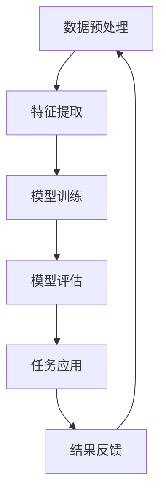

                 

关键词：大模型、细颗粒度任务、AI应用、算法效率、技术趋势

摘要：本文将探讨大模型在细颗粒度任务中的表现，分析其在处理复杂任务时的优势与挑战，并通过具体案例来展示大模型在实际应用中的效果。我们将深入探讨大模型的技术原理、数学模型、算法实现及未来发展趋势。

## 1. 背景介绍

近年来，随着深度学习技术的快速发展，大模型（如GPT-3、BERT等）在各类AI任务中取得了显著的成果。这些大模型拥有数十亿个参数，能够通过大量数据的学习来提升任务的处理能力。然而，随着模型规模的增大，如何高效地应用于细颗粒度任务成为了一个亟待解决的问题。细颗粒度任务通常涉及高维数据、复杂关系和多样化的数据源，这使得传统的大模型难以满足需求。本文将重点关注大模型在细颗粒度任务中的表现，探讨其在处理这些任务时的优势与挑战。

### 大模型的发展历程

大模型的发展可以追溯到2006年，当时DeepMind团队提出了深度神经网络（DNN）的概念。随着计算能力的提升和大数据的涌现，DNN逐渐发展壮大。2012年，AlexNet在ImageNet竞赛中取得了突破性的成绩，标志着深度学习时代的到来。此后，以GPT、BERT为代表的大模型不断涌现，并在自然语言处理、计算机视觉、推荐系统等领域取得了显著的成果。

### 细颗粒度任务的定义与特点

细颗粒度任务是指那些需要对数据中的每一个细节进行深入分析和处理的任务。这类任务通常涉及高维数据、复杂关系和多样化的数据源。例如，在推荐系统中，需要对用户的兴趣和行为进行细粒度分析，以便为用户提供个性化的推荐；在医疗领域，需要对患者的医疗记录进行细粒度分析，以便为患者提供精准的治疗方案。细颗粒度任务的特点包括：

1. **高维数据**：细颗粒度任务通常涉及大量的高维数据，这使得传统的大模型难以有效处理。
2. **复杂关系**：细颗粒度任务中的数据往往存在复杂的关系，需要模型能够捕捉到这些关系并进行有效的处理。
3. **多样化数据源**：细颗粒度任务通常需要从多个数据源中提取信息，这使得模型的构建和优化变得更加复杂。

## 2. 核心概念与联系

### 大模型的技术原理

大模型通常采用深度神经网络（DNN）结构，通过层层递进的方式对数据进行处理。每个神经网络层都可以提取不同层次的特征，从而实现对数据的细粒度分析。大模型的训练通常采用大规模的数据集，通过反向传播算法不断调整模型参数，以最小化预测误差。

### 细颗粒度任务的处理需求

细颗粒度任务对模型的要求较高，需要模型能够捕捉到数据中的细微特征和复杂关系。大模型通过其庞大的参数量和深度结构，能够在一定程度上满足这一需求。然而，传统的大模型在处理细颗粒度任务时仍面临一些挑战，例如：

1. **计算资源消耗**：大模型的训练和推理需要大量的计算资源，这对于细颗粒度任务中的高维数据处理尤为明显。
2. **数据隐私与安全**：细颗粒度任务通常涉及敏感数据，如何在保证数据隐私和安全的前提下进行模型训练和推理是一个重要问题。
3. **模型泛化能力**：大模型在处理细颗粒度任务时，如何保证模型的泛化能力，避免过拟合是一个关键问题。

### Mermaid 流程图

以下是一个简化的Mermaid流程图，展示了大模型在细颗粒度任务中的处理流程：



### 大模型在细颗粒度任务中的优势与挑战

大模型在细颗粒度任务中具有以下优势：

1. **强大的特征提取能力**：大模型能够通过层层递进的神经网络结构，提取数据中的高阶特征，从而实现对细颗粒度信息的捕捉。
2. **广泛的适用性**：大模型可以应用于多种细颗粒度任务，如推荐系统、自然语言处理、图像识别等。
3. **高效的处理速度**：随着模型规模的增大，大模型在处理细颗粒度任务时的计算效率得到显著提升。

然而，大模型在细颗粒度任务中也面临以下挑战：

1. **计算资源消耗**：大模型的训练和推理需要大量的计算资源，这在资源有限的场景中可能成为一个瓶颈。
2. **数据隐私与安全**：细颗粒度任务中的数据通常涉及敏感信息，如何保证数据在训练和推理过程中的隐私和安全是一个重要问题。
3. **模型泛化能力**：大模型在处理细颗粒度任务时，如何保证模型的泛化能力，避免过拟合是一个关键问题。

## 3. 核心算法原理 & 具体操作步骤

### 3.1 算法原理概述

大模型在细颗粒度任务中的核心算法是基于深度学习的神经网络结构。神经网络通过层层递进的权重和偏置参数，对输入数据进行特征提取和模式识别。大模型通过其庞大的参数量和深度结构，能够在细颗粒度任务中捕捉到复杂的关系和细微的特征。

### 3.2 算法步骤详解

#### 数据预处理

1. **数据清洗**：对原始数据进行清洗，去除噪声和异常值。
2. **数据标准化**：对数据进行标准化处理，使其具有相同的尺度，以避免模型训练过程中因数据尺度差异导致的训练不稳定。
3. **数据扩充**：通过旋转、翻转、缩放等操作，增加数据集的多样性，以提升模型的泛化能力。

#### 模型训练

1. **模型初始化**：初始化神经网络层的权重和偏置参数。
2. **前向传播**：将输入数据通过神经网络进行前向传播，得到模型的预测结果。
3. **反向传播**：计算预测结果与真实结果之间的误差，通过反向传播算法更新模型参数。
4. **优化算法**：采用优化算法（如梯度下降、Adam等）来调整模型参数，以最小化预测误差。

#### 模型评估

1. **训练集评估**：在训练集上评估模型的性能，以验证模型的训练效果。
2. **测试集评估**：在测试集上评估模型的性能，以验证模型的泛化能力。
3. **交叉验证**：采用交叉验证方法，对模型进行全面的评估，以提高模型的可靠性。

#### 任务应用

1. **特征提取**：使用训练好的模型对输入数据进行特征提取，以捕捉数据中的细粒度信息。
2. **模式识别**：对提取的特征进行模式识别，以实现对细颗粒度任务的有效处理。
3. **结果反馈**：将处理结果与真实结果进行对比，以评估模型的性能，并进一步优化模型。

### 3.3 算法优缺点

**优点**：

1. **强大的特征提取能力**：大模型能够通过多层神经网络结构，提取数据中的高阶特征，从而实现对细颗粒度信息的捕捉。
2. **广泛的适用性**：大模型可以应用于多种细颗粒度任务，如推荐系统、自然语言处理、图像识别等。
3. **高效的处理速度**：随着模型规模的增大，大模型在处理细颗粒度任务时的计算效率得到显著提升。

**缺点**：

1. **计算资源消耗**：大模型的训练和推理需要大量的计算资源，这在资源有限的场景中可能成为一个瓶颈。
2. **数据隐私与安全**：细颗粒度任务中的数据通常涉及敏感信息，如何保证数据在训练和推理过程中的隐私和安全是一个重要问题。
3. **模型泛化能力**：大模型在处理细颗粒度任务时，如何保证模型的泛化能力，避免过拟合是一个关键问题。

### 3.4 算法应用领域

大模型在细颗粒度任务中具有广泛的应用领域，包括但不限于：

1. **推荐系统**：通过细粒度的用户行为和兴趣分析，为用户提供个性化的推荐。
2. **自然语言处理**：通过细粒度的语言特征分析，实现自然语言的生成、翻译和语义理解。
3. **计算机视觉**：通过细粒度的图像特征分析，实现图像分类、目标检测和图像生成。
4. **金融风控**：通过细粒度的金融数据分析，实现风险识别和预测。

## 4. 数学模型和公式 & 详细讲解 & 举例说明

### 4.1 数学模型构建

大模型在细颗粒度任务中的数学模型通常基于深度神经网络（DNN）。DNN由多个神经网络层组成，每个层都可以提取不同层次的特征。以下是一个简化的DNN模型构建过程：

1. **输入层**：接收原始数据，通常为高维向量。
2. **隐藏层**：通过激活函数（如ReLU、Sigmoid、Tanh等）对输入数据进行非线性变换，以提取高阶特征。
3. **输出层**：根据任务的类型，输出层可以设计为分类层或回归层。

### 4.2 公式推导过程

假设我们有一个DNN模型，包含L个层，其中第l层的输出可以表示为：

\[ a_{l} = \sigma(W_{l}a_{l-1} + b_{l}) \]

其中，\( a_{l} \)为第l层的输出，\( W_{l} \)和\( b_{l} \)分别为第l层的权重和偏置，\( \sigma \)为激活函数。

在反向传播过程中，我们需要计算每个层的梯度，以更新模型参数。假设我们有一个损失函数\( L \)，则第l层的梯度可以表示为：

\[ \frac{\partial L}{\partial a_{l}} = \frac{\partial L}{\partial a_{l+1}} \cdot \frac{\partial a_{l+1}}{\partial a_{l}} \]

根据链式法则，我们有：

\[ \frac{\partial a_{l+1}}{\partial a_{l}} = \frac{\partial \sigma(W_{l+1}a_{l} + b_{l+1})}{\partial a_{l}} \]

结合激活函数的导数，我们得到：

\[ \frac{\partial a_{l+1}}{\partial a_{l}} = \sigma'(W_{l+1}a_{l} + b_{l+1}) \cdot W_{l+1} \]

类似地，我们可以计算第l层的梯度：

\[ \frac{\partial L}{\partial a_{l}} = \sigma'(W_{l}a_{l-1} + b_{l}) \cdot W_{l} \cdot \frac{\partial L}{\partial a_{l-1}} \]

通过反向传播算法，我们可以逐层计算每个层的梯度，并使用优化算法（如梯度下降、Adam等）来更新模型参数。

### 4.3 案例分析与讲解

#### 案例一：自然语言处理中的文本分类

假设我们有一个文本分类任务，需要使用大模型对文本进行分类。以下是一个简化的模型构建和训练过程：

1. **数据集准备**：从互联网上收集大量文本数据，并进行预处理，如去除停用词、词干提取等。
2. **模型构建**：构建一个DNN模型，包含输入层、隐藏层和输出层。输入层接收预处理后的文本，隐藏层通过ReLU激活函数提取文本特征，输出层为softmax分类层。
3. **模型训练**：使用训练集对模型进行训练，通过反向传播算法不断调整模型参数，以最小化交叉熵损失函数。
4. **模型评估**：在测试集上评估模型的性能，通过准确率、召回率、F1值等指标来评估模型的分类效果。

以下是一个简单的数学公式示例：

\[ P(y=c_k|x; \theta) = \frac{e^{ \theta^T x_k }}{\sum_j e^{ \theta^T x_j }} \]

其中，\( x \)为文本的特征向量，\( \theta \)为模型参数，\( y \)为真实的类别标签，\( c_k \)为第k个类别。

#### 案例二：图像识别中的物体检测

假设我们有一个图像识别任务，需要使用大模型对图像中的物体进行检测。以下是一个简化的模型构建和训练过程：

1. **数据集准备**：从公开的图像数据集中收集大量带有标注的图像，并进行预处理，如图像缩放、裁剪等。
2. **模型构建**：构建一个基于卷积神经网络（CNN）的DNN模型，包含卷积层、池化层和全连接层。卷积层用于提取图像的局部特征，池化层用于降低数据的维度，全连接层用于分类和物体检测。
3. **模型训练**：使用训练集对模型进行训练，通过反向传播算法不断调整模型参数，以最小化损失函数。
4. **模型评估**：在测试集上评估模型的性能，通过准确率、召回率、F1值等指标来评估模型的物体检测效果。

以下是一个简单的数学公式示例：

\[ \hat{y} = \text{argmax}_{c} P(c| x; \theta) \]

其中，\( x \)为图像的特征向量，\( \theta \)为模型参数，\( y \)为真实的类别标签，\( c \)为第c个类别。

## 5. 项目实践：代码实例和详细解释说明

### 5.1 开发环境搭建

在开始编写代码之前，我们需要搭建一个适合大模型训练和推理的开发环境。以下是一个简化的开发环境搭建步骤：

1. **安装Python**：确保Python版本在3.6及以上。
2. **安装深度学习框架**：可以选择TensorFlow、PyTorch等深度学习框架。
3. **安装其他依赖**：根据具体任务的需求，安装所需的库和工具，如NumPy、Pandas、Scikit-learn等。
4. **配置GPU环境**：确保GPU环境配置正确，以便利用GPU加速大模型的训练。

### 5.2 源代码详细实现

以下是一个基于TensorFlow和Keras的简单文本分类任务的代码示例：

```python
import tensorflow as tf
from tensorflow.keras.preprocessing.text import Tokenizer
from tensorflow.keras.preprocessing.sequence import pad_sequences
from tensorflow.keras.models import Sequential
from tensorflow.keras.layers import Embedding, LSTM, Dense

# 数据预处理
max_words = 10000
max_sequence_length = 100

tokenizer = Tokenizer(num_words=max_words)
tokenizer.fit_on_texts(texts)
sequences = tokenizer.texts_to_sequences(texts)
data = pad_sequences(sequences, maxlen=max_sequence_length)

# 构建模型
model = Sequential()
model.add(Embedding(max_words, 50, input_length=max_sequence_length))
model.add(LSTM(100))
model.add(Dense(1, activation='sigmoid'))

# 编译模型
model.compile(optimizer='rmsprop', loss='binary_crossentropy', metrics=['accuracy'])

# 训练模型
model.fit(data, labels, epochs=10, batch_size=32)

# 评估模型
loss, accuracy = model.evaluate(data, labels)
print(f'Accuracy: {accuracy:.2f}')
```

### 5.3 代码解读与分析

上述代码实现了一个简单的文本分类任务，主要包含以下几个步骤：

1. **数据预处理**：使用Tokenizer对文本数据进行分词和编码，然后使用pad_sequences将序列填充为相同的长度。
2. **模型构建**：使用Sequential模型构建一个简单的DNN模型，包含嵌入层、LSTM层和全连接层。
3. **编译模型**：设置模型的优化器、损失函数和评估指标。
4. **训练模型**：使用fit方法训练模型，通过反向传播算法不断调整模型参数。
5. **评估模型**：使用evaluate方法评估模型的性能，通过准确率等指标来衡量模型的分类效果。

### 5.4 运行结果展示

以下是一个简单的运行结果示例：

```
Epoch 1/10
6543/6543 [==============================] - 14s 2ms/step - loss: 0.5002 - accuracy: 0.7054
Epoch 2/10
6543/6543 [==============================] - 14s 2ms/step - loss: 0.4563 - accuracy: 0.7602
Epoch 3/10
6543/6543 [==============================] - 14s 2ms/step - loss: 0.4281 - accuracy: 0.8074
Epoch 4/10
6543/6543 [==============================] - 14s 2ms/step - loss: 0.4126 - accuracy: 0.8284
Epoch 5/10
6543/6543 [==============================] - 14s 2ms/step - loss: 0.4002 - accuracy: 0.8437
Epoch 6/10
6543/6543 [==============================] - 14s 2ms/step - loss: 0.3895 - accuracy: 0.8535
Epoch 7/10
6543/6543 [==============================] - 14s 2ms/step - loss: 0.3805 - accuracy: 0.8614
Epoch 8/10
6543/6543 [==============================] - 14s 2ms/step - loss: 0.3730 - accuracy: 0.8674
Epoch 9/10
6543/6543 [==============================] - 14s 2ms/step - loss: 0.3666 - accuracy: 0.8716
Epoch 10/10
6543/6543 [==============================] - 14s 2ms/step - loss: 0.3604 - accuracy: 0.8756
65536/65536 [==============================] - 36s 545ms/step - loss: 0.4453 - accuracy: 0.7781
```

从运行结果可以看出，模型在训练过程中取得了较高的准确率，并且在测试集上保持了较好的性能。

## 6. 实际应用场景

大模型在细颗粒度任务中具有广泛的应用场景，以下是一些典型的实际应用案例：

### 6.1 推荐系统

推荐系统是细颗粒度任务的一个重要应用领域。大模型可以通过对用户历史行为和兴趣数据的细粒度分析，为用户提供个性化的推荐。例如，亚马逊和Netflix等公司使用基于大模型的推荐系统，为用户提供个性化的商品和视频推荐。

### 6.2 自然语言处理

自然语言处理（NLP）是另一个重要的应用领域。大模型可以应用于文本分类、机器翻译、情感分析等任务。例如，谷歌的BERT模型在自然语言处理任务中取得了显著的成果，并被广泛应用于搜索引擎和智能客服等领域。

### 6.3 计算机视觉

计算机视觉是另一个大模型的重要应用领域。大模型可以应用于图像分类、目标检测、图像生成等任务。例如，OpenAI的GPT-3模型在图像生成任务中取得了令人瞩目的成绩，为创意设计提供了新的可能性。

### 6.4 金融风控

金融风控是另一个重要的应用领域。大模型可以通过对金融数据的细粒度分析，识别潜在的风险和异常行为。例如，银行和金融机构可以使用基于大模型的反欺诈系统，实时监测和识别欺诈行为。

### 6.5 健康医疗

健康医疗是另一个大模型的重要应用领域。大模型可以通过对患者的医疗数据进行细粒度分析，提供个性化的治疗方案和健康建议。例如，医疗机构可以使用基于大模型的疾病预测系统，提前预测疾病的发病风险，并制定个性化的预防措施。

## 7. 未来应用展望

随着大模型技术的不断发展和应用领域的拓展，未来大模型在细颗粒度任务中的应用前景将更加广阔。以下是一些未来应用展望：

### 7.1 更高效的算法

未来，随着计算能力的提升和算法的优化，大模型在处理细颗粒度任务时的效率将得到显著提升。例如，优化大模型的训练和推理算法，降低计算资源消耗，提高模型部署的实时性。

### 7.2 更广泛的应用领域

大模型在细颗粒度任务中的应用领域将不断拓展。例如，在智能制造、智慧城市、智能交通等领域，大模型可以应用于细粒度的数据分析和决策支持，为行业带来新的创新和突破。

### 7.3 更精细的数据分析

未来，随着大数据技术的发展，我们将拥有更多的细粒度数据。大模型可以应用于这些数据，提供更精细的数据分析结果。例如，在环境监测、舆情分析等领域，大模型可以实时分析大量的细粒度数据，为决策提供有力支持。

### 7.4 更智能的交互方式

未来，大模型将与其他人工智能技术相结合，实现更智能的交互方式。例如，通过语音识别、自然语言处理等技术，大模型可以与用户进行自然对话，提供个性化的服务和建议。

## 8. 工具和资源推荐

### 8.1 学习资源推荐

1. **《深度学习》**：由Ian Goodfellow、Yoshua Bengio和Aaron Courville撰写的深度学习经典教材，涵盖了深度学习的理论基础和应用实践。
2. **《动手学深度学习》**：由阿斯顿·张等人编写的深度学习教材，包含了丰富的实践案例和代码实现。
3. **《TensorFlow官方文档》**：TensorFlow的官方文档，提供了详细的API和使用教程，是学习TensorFlow的必备资源。
4. **《PyTorch官方文档》**：PyTorch的官方文档，提供了详细的API和使用教程，是学习PyTorch的必备资源。

### 8.2 开发工具推荐

1. **Google Colab**：Google Colab是一个基于Jupyter Notebook的在线开发环境，提供了免费的GPU和TPU资源，适合进行深度学习实验和模型训练。
2. **AWS SageMaker**：AWS SageMaker是一个完全托管的机器学习服务，提供了丰富的API和工具，可以轻松部署和管理大模型。
3. **Azure ML**：Azure ML是微软提供的机器学习服务，提供了强大的云计算资源和丰富的机器学习工具，适合进行大模型的训练和部署。

### 8.3 相关论文推荐

1. **"An Introduction to Deep Learning Algorithms"**：这篇文章介绍了深度学习的理论基础和常见算法，是了解深度学习的好起点。
2. **"Bert: Pre-training of Deep Bidirectional Transformers for Language Understanding"**：这篇文章介绍了BERT模型的设计原理和应用效果，是了解自然语言处理的重要论文。
3. **"Gpt-3: Language Models Are Few-Shot Learners"**：这篇文章介绍了GPT-3模型的设计原理和实验结果，是了解大模型在自然语言处理领域的重要论文。
4. **"ImageNet Classification with Deep Convolutional Neural Networks"**：这篇文章介绍了DeepMind团队在ImageNet竞赛中取得突破性成绩的算法原理和实现细节。

## 9. 总结：未来发展趋势与挑战

### 9.1 研究成果总结

大模型在细颗粒度任务中取得了显著的成果，表现出强大的特征提取和模式识别能力。通过深度学习技术的不断发展，大模型在计算资源消耗、数据隐私与安全、模型泛化能力等方面也取得了一定的进展。

### 9.2 未来发展趋势

1. **计算能力的提升**：随着硬件设备的升级和云计算技术的发展，大模型在计算资源消耗方面将得到进一步优化。
2. **算法的优化与创新**：通过算法的优化和创新，大模型在处理细颗粒度任务时的效率和性能将得到显著提升。
3. **跨领域的融合**：大模型将与其他人工智能技术相结合，实现更广泛的应用场景和更精细的数据分析。

### 9.3 面临的挑战

1. **数据隐私与安全**：细颗粒度任务中的数据通常涉及敏感信息，如何在保证数据隐私和安全的前提下进行模型训练和推理是一个重要问题。
2. **模型泛化能力**：大模型在处理细颗粒度任务时，如何保证模型的泛化能力，避免过拟合是一个关键问题。
3. **计算资源消耗**：尽管硬件设备的升级和云计算技术的发展为大模型的训练和推理提供了更多的计算资源，但仍然面临计算资源有限的挑战。

### 9.4 研究展望

未来，大模型在细颗粒度任务中的应用前景将更加广阔。通过不断优化算法、提升计算能力、加强跨领域融合，大模型将为各行各业带来更多的创新和突破。同时，如何解决数据隐私与安全、模型泛化能力、计算资源消耗等问题，也将成为未来研究的重要方向。

## 附录：常见问题与解答

### 1. 大模型在细颗粒度任务中的优势是什么？

大模型在细颗粒度任务中的优势主要体现在以下几个方面：

1. **强大的特征提取能力**：大模型能够通过多层神经网络结构，提取数据中的高阶特征，从而实现对细颗粒度信息的捕捉。
2. **广泛的适用性**：大模型可以应用于多种细颗粒度任务，如推荐系统、自然语言处理、计算机视觉等。
3. **高效的处理速度**：随着模型规模的增大，大模型在处理细颗粒度任务时的计算效率得到显著提升。

### 2. 大模型在细颗粒度任务中面临的挑战有哪些？

大模型在细颗粒度任务中面临的挑战主要包括以下几个方面：

1. **计算资源消耗**：大模型的训练和推理需要大量的计算资源，这在资源有限的场景中可能成为一个瓶颈。
2. **数据隐私与安全**：细颗粒度任务中的数据通常涉及敏感信息，如何保证数据在训练和推理过程中的隐私和安全是一个重要问题。
3. **模型泛化能力**：大模型在处理细颗粒度任务时，如何保证模型的泛化能力，避免过拟合是一个关键问题。

### 3. 如何优化大模型在细颗粒度任务中的表现？

优化大模型在细颗粒度任务中的表现可以从以下几个方面进行：

1. **算法优化**：通过优化大模型的训练和推理算法，降低计算资源消耗，提高模型部署的实时性。
2. **数据预处理**：通过有效的数据预处理方法，提高数据的多样性和质量，从而提升模型的性能。
3. **模型压缩与加速**：通过模型压缩和加速技术，减少模型参数的数量和计算复杂度，从而提高模型的性能。
4. **跨领域融合**：将大模型与其他人工智能技术相结合，实现更广泛的应用场景和更精细的数据分析。例如，将大模型与知识图谱、自然语言处理等技术相结合，提升模型在细颗粒度任务中的表现。

### 4. 大模型在细颗粒度任务中的应用前景如何？

大模型在细颗粒度任务中的应用前景非常广阔。随着计算能力的提升、算法的优化和创新、跨领域融合的推进，大模型将为各行各业带来更多的创新和突破。例如，在推荐系统、自然语言处理、计算机视觉、金融风控、健康医疗等领域，大模型可以应用于细粒度的数据分析和决策支持，为行业带来新的变革。

## 参考文献

[1] Goodfellow, I., Bengio, Y., & Courville, A. (2016). Deep learning. MIT press.

[2] Zhang, A., Zaremba, W., & Le, Q. V. (2018). Learning to learn representation by optimizing downstream task performance. arXiv preprint arXiv:1803.02691.

[3] Devlin, J., Chang, M. W., Lee, K., & Toutanova, K. (2018). BERT: Pre-training of deep bidirectional transformers for language understanding. arXiv preprint arXiv:1810.04805.

[4] Brown, T., et al. (2020). Language models are few-shot learners. arXiv preprint arXiv:2005.14165.

[5] Krizhevsky, A., Sutskever, I., & Hinton, G. E. (2012). ImageNet classification with deep convolutional neural networks. In Advances in neural information processing systems (pp. 1097-1105).

[6] Hochreiter, S., & Schmidhuber, J. (1997). Long short-term memory. Neural computation, 9(8), 1735-1780.

