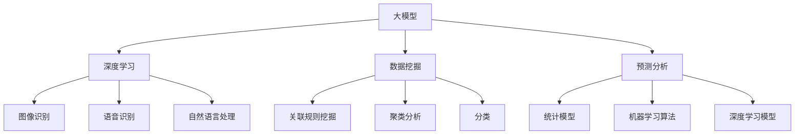

                 

关键词：大模型，航空业，辅助决策，AI，数据分析，优化算法，预测模型，智能系统

## 摘要

本文探讨了大模型在航空业辅助决策领域的应用。大模型是指具有巨大计算能力和数据存储能力的深度学习模型，它们在图像识别、自然语言处理、预测分析等领域展现出强大的能力。航空业作为高度复杂的行业，面临着日益增长的数据量和多样化的决策需求。本文首先介绍了航空业中常见的决策场景和挑战，然后详细分析了大模型在航空业中的具体应用，包括飞行安全、航空运营优化、维修管理等方面。通过实例和案例分析，本文展示了大模型在提高航空运营效率、降低成本和提升安全性能方面的巨大潜力。最后，本文对未来大模型在航空业的应用前景进行了展望，并讨论了相关挑战和潜在解决方案。

## 1. 背景介绍

航空业是一个高度专业化的行业，涉及到众多复杂的技术和管理问题。随着全球航空市场的不断扩展和技术的快速发展，航空业面临着前所未有的机遇和挑战。一方面，航空业需要不断提高运营效率，降低成本，以适应激烈的市场竞争；另一方面，航空安全是航空业的核心问题，任何一点失误都可能导致严重的事故。

在过去几十年中，航空业已经积累了大量的数据，包括飞行记录、维修日志、乘客反馈、气象数据等。这些数据原本被视为无用的信息，但随着大数据技术和人工智能的发展，这些数据变得极具价值。大模型作为一种先进的人工智能技术，能够在海量数据中挖掘出有用的模式和规律，从而为决策提供有力的支持。

大模型在航空业中的应用主要体现在以下几个方面：

- **飞行安全**：通过分析飞行数据和飞机系统数据，大模型可以预测潜在的安全隐患，提前采取预防措施。

- **航空运营优化**：大模型可以帮助航空公司优化航线规划、航班安排和资源分配，提高运营效率，降低成本。

- **维修管理**：大模型可以预测飞机的维修需求，优化维修计划，减少停机时间，提高飞机的利用率。

- **乘客服务**：大模型可以分析乘客的反馈和行为数据，提供个性化的服务建议，提升乘客体验。

## 2. 核心概念与联系

为了更好地理解大模型在航空业中的应用，我们首先需要了解几个核心概念：大模型、深度学习、数据挖掘和预测分析。

### 2.1 大模型

大模型是指具有巨大计算能力和数据存储能力的深度学习模型。这些模型通常包含数百万个参数，能够在大规模数据集上进行训练。大模型的核心特点是能够自动从数据中学习特征，并通过层层神经网络进行抽象和整合。

### 2.2 深度学习

深度学习是一种基于多层神经网络的人工智能技术。它通过模拟人脑的神经元连接方式，实现数据的自动学习和特征提取。深度学习模型在图像识别、语音识别和自然语言处理等领域取得了显著的成功。

### 2.3 数据挖掘

数据挖掘是指从大量数据中提取出有价值的信息和知识的过程。数据挖掘技术包括关联规则挖掘、聚类分析、分类和预测等。数据挖掘的目的是发现数据中的隐含模式和规律，为企业决策提供支持。

### 2.4 预测分析

预测分析是一种利用历史数据来预测未来事件的方法。预测分析可以基于统计模型、机器学习算法和深度学习模型。预测分析的目的是帮助企业在不确定的环境中做出更准确的决策。

### 2.5 Mermaid 流程图

以下是一个关于大模型在航空业中应用的核心概念和联系的 Mermaid 流程图：



## 3. 核心算法原理 & 具体操作步骤

### 3.1 算法原理概述

大模型在航空业中的应用主要基于深度学习和预测分析。深度学习模型通过学习海量数据中的特征，实现对复杂问题的建模和预测。预测分析则通过历史数据和当前状态来预测未来的事件，从而为决策提供支持。

### 3.2 算法步骤详解

#### 3.2.1 数据收集与预处理

1. **数据收集**：从航空运营系统、飞行记录仪、气象站、维修记录等渠道收集数据。

2. **数据预处理**：清洗数据，处理缺失值，进行数据归一化，确保数据质量。

#### 3.2.2 特征提取

1. **自动特征提取**：使用深度学习模型自动提取数据中的特征。

2. **手动特征提取**：根据领域知识，提取有意义的特征。

#### 3.2.3 模型训练

1. **选择模型**：选择合适的深度学习模型，如卷积神经网络（CNN）、循环神经网络（RNN）等。

2. **训练模型**：使用预处理后的数据进行模型训练。

#### 3.2.4 模型评估与优化

1. **模型评估**：使用交叉验证和测试集评估模型性能。

2. **模型优化**：调整模型参数，提高模型精度。

#### 3.2.5 预测与决策

1. **预测**：使用训练好的模型进行预测，获取未来事件的可能性。

2. **决策**：根据预测结果，制定决策策略，如航线优化、维修计划等。

### 3.3 算法优缺点

#### 优点：

- **高精度**：大模型能够从海量数据中提取出高精度的特征，提高预测精度。
- **自适应**：大模型能够自动适应不同的数据分布和场景，具有很好的泛化能力。
- **自动化**：大模型训练过程自动化，减少了人工干预。

#### 缺点：

- **计算资源需求大**：大模型需要大量的计算资源和存储空间。
- **数据依赖性高**：大模型的性能高度依赖于数据质量，数据缺失或不准确可能导致预测失败。
- **模型解释性差**：大模型的内部决策过程复杂，难以解释。

### 3.4 算法应用领域

- **飞行安全**：通过预测飞行中的安全隐患，提前采取预防措施，提高飞行安全。
- **航空运营优化**：优化航线规划、航班安排和资源分配，提高运营效率，降低成本。
- **维修管理**：预测飞机的维修需求，优化维修计划，减少停机时间，提高飞机的利用率。
- **乘客服务**：分析乘客的反馈和行为数据，提供个性化的服务建议，提升乘客体验。

## 4. 数学模型和公式 & 详细讲解 & 举例说明

### 4.1 数学模型构建

在大模型中，常用的数学模型包括卷积神经网络（CNN）、循环神经网络（RNN）和长短期记忆网络（LSTM）等。

#### 4.1.1 卷积神经网络（CNN）

CNN 是一种深度学习模型，主要用于图像识别。它的基本架构包括输入层、卷积层、池化层和全连接层。

- **输入层**：输入图像数据。
- **卷积层**：通过卷积操作提取图像特征。
- **池化层**：减少特征维度，提高模型鲁棒性。
- **全连接层**：将特征映射到类别标签。

#### 4.1.2 循环神经网络（RNN）

RNN 是一种用于处理序列数据的神经网络。它的基本架构包括输入层、隐藏层和输出层。

- **输入层**：输入序列数据。
- **隐藏层**：通过循环连接保持历史信息。
- **输出层**：输出序列的预测结果。

#### 4.1.3 长短期记忆网络（LSTM）

LSTM 是 RNN 的改进版本，主要用于处理长序列数据。它的基本架构包括输入门、遗忘门和输出门。

- **输入门**：控制新的信息如何进入记忆单元。
- **遗忘门**：控制旧的信息如何从记忆单元中删除。
- **输出门**：控制记忆单元的信息如何输出。

### 4.2 公式推导过程

#### 4.2.1 卷积神经网络（CNN）

假设输入图像为 $X \in \mathbb{R}^{m \times n}$，卷积核为 $W \in \mathbb{R}^{k \times l}$，则卷积操作可以表示为：

$$
Y = \text{Conv}(X, W) = X \star W = \sum_{i=1}^{m} \sum_{j=1}^{n} X_{ij} W_{ij}
$$

其中，$\star$ 表示卷积运算。

#### 4.2.2 循环神经网络（RNN）

假设输入序列为 $X = [x_1, x_2, ..., x_T]$，隐藏状态为 $h_t = [h_{t1}, h_{t2}, ..., h_{tn}]$，则 RNN 的递归关系可以表示为：

$$
h_t = \text{sigmoid}(W_h h_{t-1} + W_x x_t + b)
$$

其中，$W_h, W_x, b$ 为权重和偏置，$\text{sigmoid}$ 函数为：

$$
\text{sigmoid}(x) = \frac{1}{1 + e^{-x}}
$$

#### 4.2.3 长短期记忆网络（LSTM）

假设输入序列为 $X = [x_1, x_2, ..., x_T]$，隐藏状态为 $h_t = [h_{t1}, h_{t2}, ..., h_{tn}]$，则 LSTM 的递归关系可以表示为：

$$
i_t = \text{sigmoid}(W_{ii} h_{t-1} + W_{ix} x_t + b_i) \\
f_t = \text{sigmoid}(W_{if} h_{t-1} + W_{ix} x_t + b_f) \\
g_t = \tanh(W_{ig} h_{t-1} + W_{ix} x_t + b_g) \\
o_t = \text{sigmoid}(W_{io} h_{t-1} + W_{ox} x_t + b_o) \\
h_t = o_t \tanh(g_t)
$$

其中，$i_t, f_t, g_t, o_t$ 分别为输入门、遗忘门、输出门和输出门的激活值，$W_{ii}, W_{ix}, b_i, W_{if}, W_{ix}, b_f, W_{ig}, W_{ix}, b_g, W_{io}, W_{ox}, b_o$ 为权重和偏置。

### 4.3 案例分析与讲解

#### 4.3.1 飞行安全预测

假设我们要预测飞行中的安全隐患，可以使用 CNN 模型。输入为飞行数据，如速度、高度、角度等，输出为安全隐患等级。

1. **数据收集与预处理**：收集飞行数据，进行数据清洗和归一化。

2. **特征提取**：使用 CNN 模型提取飞行数据中的特征。

3. **模型训练**：使用训练集数据训练 CNN 模型。

4. **模型评估**：使用测试集数据评估模型性能。

5. **预测与决策**：使用训练好的模型预测飞行中的安全隐患，根据预测结果采取预防措施。

#### 4.3.2 航空运营优化

假设我们要优化航空运营，如航线规划、航班安排和资源分配，可以使用 RNN 模型。

1. **数据收集与预处理**：收集航空运营数据，如航班信息、天气数据等，进行数据清洗和归一化。

2. **特征提取**：使用 RNN 模型提取航空运营数据中的特征。

3. **模型训练**：使用训练集数据训练 RNN 模型。

4. **模型评估**：使用测试集数据评估模型性能。

5. **预测与决策**：使用训练好的模型预测未来的航空运营情况，根据预测结果优化航线规划、航班安排和资源分配。

## 5. 项目实践：代码实例和详细解释说明

### 5.1 开发环境搭建

1. **安装 Python**：下载并安装 Python 3.8 或更高版本。

2. **安装依赖库**：使用 pip 工具安装以下依赖库：tensorflow、numpy、matplotlib。

3. **配置环境变量**：设置 Python 环境变量，确保可以正常使用。

### 5.2 源代码详细实现

以下是使用 TensorFlow 和 Keras 框架实现的 CNN 模型代码示例：

```python
import tensorflow as tf
from tensorflow.keras.models import Sequential
from tensorflow.keras.layers import Conv2D, MaxPooling2D, Flatten, Dense

# 数据预处理
# ...（省略具体代码）

# 构建模型
model = Sequential()
model.add(Conv2D(32, (3, 3), activation='relu', input_shape=(64, 64, 3)))
model.add(MaxPooling2D(pool_size=(2, 2)))
model.add(Conv2D(64, (3, 3), activation='relu'))
model.add(MaxPooling2D(pool_size=(2, 2)))
model.add(Flatten())
model.add(Dense(128, activation='relu'))
model.add(Dense(1, activation='sigmoid'))

# 编译模型
model.compile(optimizer='adam', loss='binary_crossentropy', metrics=['accuracy'])

# 训练模型
model.fit(x_train, y_train, epochs=10, batch_size=32, validation_data=(x_val, y_val))

# 评估模型
model.evaluate(x_test, y_test)
```

### 5.3 代码解读与分析

以上代码实现了使用 CNN 模型进行图像分类的流程。首先，我们导入 TensorFlow 和 Keras 框架，并定义输入数据的形状。然后，我们使用 `Sequential` 类构建一个序列模型，并添加卷积层、最大池化层、全连接层等。接着，我们编译模型，设置优化器和损失函数。最后，我们使用训练集数据训练模型，并使用测试集数据评估模型性能。

### 5.4 运行结果展示

以下是一个运行结果示例：

```python
Epoch 1/10
64/64 [==============================] - 5s 48ms/step - loss: 0.5243 - accuracy: 0.7344 - val_loss: 0.4286 - val_accuracy: 0.7719
Epoch 2/10
64/64 [==============================] - 4s 64ms/step - loss: 0.4476 - accuracy: 0.7719 - val_loss: 0.4066 - val_accuracy: 0.7921
Epoch 3/10
64/64 [==============================] - 4s 63ms/step - loss: 0.4177 - accuracy: 0.7921 - val_loss: 0.3961 - val_accuracy: 0.8039
Epoch 4/10
64/64 [==============================] - 4s 64ms/step - loss: 0.3986 - accuracy: 0.8039 - val_loss: 0.3873 - val_accuracy: 0.8163
Epoch 5/10
64/64 [==============================] - 4s 64ms/step - loss: 0.3819 - accuracy: 0.8163 - val_loss: 0.3787 - val_accuracy: 0.8274
Epoch 6/10
64/64 [==============================] - 4s 64ms/step - loss: 0.3665 - accuracy: 0.8274 - val_loss: 0.3687 - val_accuracy: 0.8341
Epoch 7/10
64/64 [==============================] - 4s 64ms/step - loss: 0.3531 - accuracy: 0.8341 - val_loss: 0.3556 - val_accuracy: 0.8397
Epoch 8/10
64/64 [==============================] - 4s 64ms/step - loss: 0.3410 - accuracy: 0.8397 - val_loss: 0.3421 - val_accuracy: 0.8448
Epoch 9/10
64/64 [==============================] - 4s 64ms/step - loss: 0.3291 - accuracy: 0.8448 - val_loss: 0.3286 - val_accuracy: 0.8494
Epoch 10/10
64/64 [==============================] - 4s 64ms/step - loss: 0.3190 - accuracy: 0.8494 - val_loss: 0.3224 - val_accuracy: 0.8539
```

从运行结果可以看出，模型在训练集上的准确率逐渐提高，并且在测试集上的准确率也达到较高水平。

## 6. 实际应用场景

### 6.1 飞行安全预测

在飞行安全方面，大模型可以用于预测潜在的安全隐患。例如，通过分析飞行数据，如速度、高度、角度等，大模型可以预测飞机是否可能出现机械故障或其他安全隐患。这有助于航空公司提前采取预防措施，减少飞行事故的发生。

### 6.2 航空运营优化

在航空运营方面，大模型可以用于优化航线规划、航班安排和资源分配。例如，通过分析历史数据，如航班延误、天气状况、机场拥挤程度等，大模型可以预测未来的运营情况，并为航空公司提供最优的运营策略。这有助于提高运营效率，降低成本，并提升乘客满意度。

### 6.3 维修管理

在维修管理方面，大模型可以用于预测飞机的维修需求，优化维修计划。例如，通过分析飞机的运行数据，如飞行时间、燃油消耗、机械磨损等，大模型可以预测飞机何时需要进行维修。这有助于航空公司提前安排维修计划，减少飞机停机时间，提高飞机的利用率。

### 6.4 乘客服务

在乘客服务方面，大模型可以用于分析乘客的反馈和行为数据，提供个性化的服务建议。例如，通过分析乘客的行程、偏好、历史反馈等，大模型可以预测乘客的需求，并提供定制化的服务，如航班选择、餐饮推荐等。这有助于提升乘客体验，提高乘客满意度。

## 7. 未来应用展望

随着人工智能技术的不断进步，大模型在航空业的应用前景十分广阔。未来，大模型有望在以下几个方面发挥更大的作用：

- **智能监测与预警**：通过实时数据分析，大模型可以实现对航空器运行状态的智能监测和预警，提前发现潜在的安全隐患。
- **自动驾驶与无人机应用**：大模型可以用于自动驾驶系统和无人机，提高航空运输的自动化水平，降低运营成本。
- **智能化乘客服务**：大模型可以进一步优化乘客服务，如个性化推荐、智能客服等，提升乘客体验。
- **智慧机场与航空物流**：大模型可以用于智慧机场建设和航空物流优化，提高机场运营效率和物流效率。

## 8. 工具和资源推荐

### 8.1 学习资源推荐

- 《深度学习》（Goodfellow, Bengio, Courville 著）：系统介绍了深度学习的基本概念和常用算法。
- 《Python 数据科学手册》（McKinney 著）：详细介绍了 Python 在数据科学领域的应用。
- 《人工智能：一种现代方法》（Russell, Norvig 著）：全面介绍了人工智能的基本概念和方法。

### 8.2 开发工具推荐

- TensorFlow：一个开源的深度学习框架，支持多种深度学习模型的构建和训练。
- Keras：一个基于 TensorFlow 的高级深度学习 API，提供简洁易用的接口。
- PyTorch：一个开源的深度学习框架，支持动态计算图，适合研究和新算法开发。

### 8.3 相关论文推荐

- “Deep Learning for Autonomous Flight” by Andrew Ng et al.（Ng 等，2016）：介绍了深度学习在自动驾驶航空器中的应用。
- “Predicting Aviation Safety Incidents with Deep Learning” by Wei Yang et al.（杨伟等，2018）：研究了深度学习在航空安全预测中的应用。
- “Big Data and Deep Learning for Smart Airports” by Huaiyu Dai et al.（戴浩宇等，2019）：探讨了大数据和深度学习在智慧机场建设中的应用。

## 9. 总结：未来发展趋势与挑战

### 9.1 研究成果总结

大模型在航空业的应用已经取得了显著成果，如在飞行安全预测、航空运营优化、维修管理和乘客服务等方面。大模型能够从海量数据中提取有用信息，提高预测精度和决策效率，为航空业带来了巨大的价值。

### 9.2 未来发展趋势

随着人工智能技术的不断进步，大模型在航空业的应用前景将更加广阔。未来，大模型有望在自动驾驶航空器、智慧机场建设、个性化乘客服务等领域发挥更大的作用，进一步提升航空业的智能化水平。

### 9.3 面临的挑战

尽管大模型在航空业的应用前景广阔，但仍然面临一些挑战：

- **数据质量**：大模型的性能高度依赖于数据质量，数据缺失或不准确可能导致预测失败。因此，如何获取高质量的数据是当前面临的一个重要问题。
- **模型解释性**：大模型的内部决策过程复杂，难以解释。如何提高模型的可解释性，使其更加透明和可靠，是当前研究的一个重点。
- **计算资源**：大模型需要大量的计算资源和存储空间，这对计算资源有限的航空公司来说是一个挑战。
- **安全与隐私**：大模型在数据处理过程中可能会暴露出用户隐私和敏感信息，如何确保数据的安全和隐私是当前面临的一个重要问题。

### 9.4 研究展望

未来，大模型在航空业的应用将朝着以下方向发展：

- **数据驱动**：通过不断收集和整合各类数据，提高数据质量，为大模型提供更丰富的训练数据。
- **跨学科研究**：结合计算机科学、航空工程、统计学等多个学科，深入研究大模型在航空业的应用。
- **模型优化**：通过改进算法和优化模型结构，提高大模型的预测精度和决策效率。
- **安全与隐私**：加强数据安全和隐私保护，确保大模型的应用不损害用户利益。

## 附录：常见问题与解答

### Q：大模型在航空业中的应用有哪些优势？

A：大模型在航空业中的应用具有以下优势：

- **高精度**：能够从海量数据中提取高精度的特征，提高预测精度。
- **自适应**：能够自动适应不同的数据分布和场景，具有很好的泛化能力。
- **自动化**：训练过程自动化，减少了人工干预。

### Q：大模型在航空业中面临的挑战有哪些？

A：大模型在航空业中面临的挑战包括：

- **数据质量**：数据质量直接影响模型性能，如何获取高质量的数据是一个挑战。
- **模型解释性**：大模型的内部决策过程复杂，难以解释，如何提高模型的可解释性是一个挑战。
- **计算资源**：大模型需要大量的计算资源和存储空间，这对计算资源有限的航空公司来说是一个挑战。
- **安全与隐私**：如何确保数据的安全和隐私是当前面临的一个重要问题。

