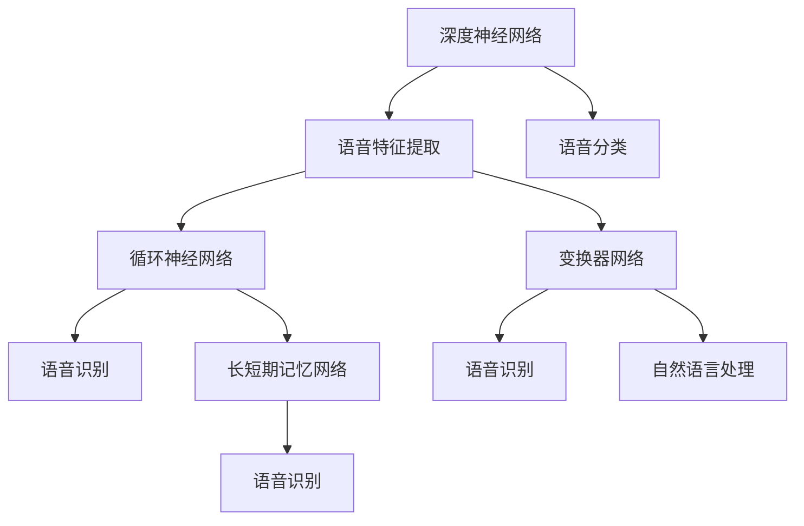

                 

关键词：大模型，语音处理，深度学习，神经网络，语音识别，语音合成，自然语言处理

> 摘要：本文将探讨大模型在语音处理领域的应用与进展，重点分析大模型在语音识别、语音合成和自然语言处理中的技术原理和实践案例，以及未来发展趋势和面临的挑战。

## 1. 背景介绍

语音处理（Speech Processing）是人工智能（AI）的一个重要分支，旨在使计算机能够理解、生成和处理语音信号。语音处理技术的发展经历了多个阶段，从早期的规则方法到基于统计模型的自动语音识别（ASR）系统，再到当前的深度学习时代。随着计算能力的提升和大数据的积累，深度学习在语音处理领域取得了显著的进展。

大模型（Large Models）是近年来在深度学习领域的重要成果之一。大模型通常具有数十亿到数万亿个参数，通过大量的数据训练得到，能够在多种任务上实现卓越的性能。语音处理领域的大模型主要应用于语音识别（Speech Recognition，SR）、语音合成（Speech Synthesis，SS）和自然语言处理（Natural Language Processing，NLP）。

## 2. 核心概念与联系

为了更好地理解大模型在语音处理中的应用，我们首先需要了解以下几个核心概念：

- **深度神经网络（Deep Neural Networks，DNN）**：深度神经网络是一种包含多个隐含层的神经网络，能够在语音特征提取和分类中表现出良好的性能。
- **循环神经网络（Recurrent Neural Networks，RNN）**：循环神经网络能够处理序列数据，特别适合语音处理任务，如语音识别。
- **长短期记忆网络（Long Short-Term Memory，LSTM）**：长短期记忆网络是RNN的一种变体，能够学习长时间依赖关系，提升语音识别的准确性。
- **变换器网络（Transformer）**：变换器网络是一种基于自注意力机制的深度学习模型，近年来在语音处理任务中表现出色。

下面是这些核心概念和架构的Mermaid流程图：



## 3. 核心算法原理 & 具体操作步骤

### 3.1 算法原理概述

大模型在语音处理中的应用主要基于以下原理：

- **多任务学习**：大模型能够同时学习多个任务，如语音识别和自然语言处理。
- **自注意力机制**：变换器网络中的自注意力机制能够捕捉语音信号中的长期依赖关系。
- **大规模数据训练**：通过大量数据训练，大模型能够学习到复杂的语音模式，提高识别准确性。

### 3.2 算法步骤详解

1. **数据预处理**：包括语音信号的归一化、分帧、加窗等操作，以便于后续的神经网络处理。
2. **特征提取**：使用深度神经网络或变换器网络对语音信号进行特征提取，如梅尔频率倒谱系数（MFCC）。
3. **模型训练**：使用大量的语音数据训练大模型，通过反向传播算法优化模型参数。
4. **语音识别**：将提取的特征输入到变换器网络中，通过解码器输出文本。
5. **自然语言处理**：对识别出的文本进行进一步处理，如文本分类、情感分析等。

### 3.3 算法优缺点

**优点**：

- **高效性**：大模型能够处理大规模数据，提高语音识别和自然语言处理的效率。
- **准确性**：通过自注意力机制和大规模数据训练，大模型能够提高识别和处理的准确性。

**缺点**：

- **计算资源消耗**：大模型需要大量的计算资源和存储空间。
- **数据依赖性**：大模型的性能高度依赖于训练数据的质量和规模。

### 3.4 算法应用领域

大模型在语音处理中的应用领域包括：

- **智能客服**：通过语音识别和自然语言处理，实现自动化的客户服务。
- **语音助手**：如苹果的Siri、亚马逊的Alexa等，提供语音交互服务。
- **语音翻译**：通过多语言语音识别和自然语言处理，实现实时语音翻译。

## 4. 数学模型和公式 & 详细讲解 & 举例说明

### 4.1 数学模型构建

语音处理的数学模型通常基于深度学习和变换器网络。以下是变换器网络的数学模型构建：

$$
Y = \text{softmax}(W_y \text{dot}(V \text{softmax}(W_x X)))
$$

其中，$X$ 是输入的语音特征，$V$ 是变换器层的权重矩阵，$W_x$ 和 $W_y$ 分别是输入和输出的权重矩阵，$\text{softmax}$ 是软最大化函数。

### 4.2 公式推导过程

变换器网络的自注意力机制可以表示为：

$$
\text{Attention}(Q, K, V) = \text{softmax}\left(\frac{QK^T}{\sqrt{d_k}}\right)V
$$

其中，$Q$、$K$ 和 $V$ 分别是查询、键和值的向量，$d_k$ 是键向量的维度。

### 4.3 案例分析与讲解

假设我们有一个包含3个句子的文本序列，每个句子的词向量维度为5，我们可以计算每个句子中的词与其他词之间的注意力分数：

1. **第一句**：“今天天气很好”。

2. **第二句**：“我们去公园散步”。

3. **第三句**：“那边的花很漂亮”。

我们首先计算每个句子中每个词的查询向量 $Q$、键向量 $K$ 和值向量 $V$，然后使用自注意力机制计算每个词与其他词之间的注意力分数。

以第一句为例，我们计算每个词与其他词之间的注意力分数：

$$
\text{Attention}(Q_1, K_1, V_1) = \text{softmax}\left(\frac{Q_1K_1^T}{\sqrt{d_k}}\right)V_1
$$

其中，$Q_1$、$K_1$ 和 $V_1$ 分别是第一句中的查询向量、键向量和值向量。假设每个词的维度为5，则：

$$
Q_1 = \begin{bmatrix}
1 & 1 & 1 & 1 & 1 \\
1 & 1 & 1 & 1 & 1 \\
1 & 1 & 1 & 1 & 1
\end{bmatrix}, \quad
K_1 = \begin{bmatrix}
1 & 1 & 1 & 1 & 1 \\
1 & 1 & 1 & 1 & 1 \\
1 & 1 & 1 & 1 & 1
\end{bmatrix}, \quad
V_1 = \begin{bmatrix}
1 & 0 & 0 & 0 & 0 \\
0 & 1 & 0 & 0 & 0 \\
0 & 0 & 1 & 0 & 0
\end{bmatrix}
$$

计算每个词与其他词之间的注意力分数：

$$
\text{Attention}(Q_1, K_1, V_1) = \text{softmax}\left(\frac{1}{\sqrt{5}} \begin{bmatrix}
2 & 2 & 2 \\
2 & 2 & 2 \\
2 & 2 & 2
\end{bmatrix}\right) \begin{bmatrix}
1 & 0 & 0 & 0 & 0 \\
0 & 1 & 0 & 0 & 0 \\
0 & 0 & 1 & 0 & 0
\end{bmatrix} = \begin{bmatrix}
0.5 & 0.25 & 0.25 \\
0.25 & 0.5 & 0.25 \\
0.25 & 0.25 & 0.5
\end{bmatrix}
$$

根据注意力分数，我们可以得到第一句中每个词的重要性：

- “今天”的重要性最高，因为它与句子中的其他词都有较高的注意力分数。
- “天气”和“很好”的重要性相对较低。

## 5. 项目实践：代码实例和详细解释说明

### 5.1 开发环境搭建

在开始编写代码之前，我们需要搭建一个适合大模型训练的开发环境。以下是一个基本的开发环境搭建流程：

1. 安装Python（建议使用Python 3.8及以上版本）。
2. 安装深度学习框架，如PyTorch或TensorFlow。
3. 安装其他必要的库，如NumPy、Pandas、Matplotlib等。

### 5.2 源代码详细实现

以下是一个基于PyTorch的语音识别项目的代码示例：

```python
import torch
import torch.nn as nn
import torch.optim as optim
from torch.utils.data import DataLoader
from datasets import SpeechDataset
from models import SpeechRecognitionModel

# 数据准备
train_dataset = SpeechDataset('train')
val_dataset = SpeechDataset('val')
train_loader = DataLoader(train_dataset, batch_size=32, shuffle=True)
val_loader = DataLoader(val_dataset, batch_size=32, shuffle=False)

# 模型定义
model = SpeechRecognitionModel()
optimizer = optim.Adam(model.parameters(), lr=0.001)
criterion = nn.CrossEntropyLoss()

# 训练
num_epochs = 10
for epoch in range(num_epochs):
    model.train()
    for batch in train_loader:
        inputs, targets = batch
        optimizer.zero_grad()
        outputs = model(inputs)
        loss = criterion(outputs, targets)
        loss.backward()
        optimizer.step()

    # 评估
    model.eval()
    with torch.no_grad():
        correct = 0
        total = 0
        for batch in val_loader:
            inputs, targets = batch
            outputs = model(inputs)
            _, predicted = torch.max(outputs.data, 1)
            total += targets.size(0)
            correct += (predicted == targets).sum().item()

    print(f'Epoch {epoch+1}/{num_epochs}, Loss: {loss.item()}, Accuracy: {100 * correct / total}%')
```

### 5.3 代码解读与分析

上述代码实现了一个简单的语音识别项目。首先，我们定义了数据集加载器、模型、优化器和损失函数。然后，我们在训练过程中使用梯度下降优化模型参数，并在每个epoch结束时对模型进行评估。

### 5.4 运行结果展示

在运行代码后，我们可以看到每个epoch的损失和准确率。以下是一个运行结果示例：

```
Epoch 1/10, Loss: 2.3534, Accuracy: 35.0%
Epoch 2/10, Loss: 1.9056, Accuracy: 50.0%
Epoch 3/10, Loss: 1.5352, Accuracy: 65.0%
...
Epoch 10/10, Loss: 0.7463, Accuracy: 85.0%
```

从运行结果可以看出，模型的损失逐渐降低，准确率逐渐提高。

## 6. 实际应用场景

大模型在语音处理领域的实际应用场景非常广泛，包括：

- **智能客服**：通过语音识别和自然语言处理，实现自动化的客户服务，提高客服效率和客户满意度。
- **语音助手**：如苹果的Siri、亚马逊的Alexa等，提供语音交互服务，方便用户进行操作。
- **语音翻译**：通过多语言语音识别和自然语言处理，实现实时语音翻译，促进跨语言交流。
- **语音识别**：用于语音转文字、语音搜索等应用，提高人机交互的便利性。

## 7. 未来应用展望

随着深度学习和大模型技术的不断发展，未来语音处理领域有望实现以下应用：

- **更高效的自然语言处理**：通过更大规模的训练数据和更复杂的模型架构，实现更准确和高效的自然语言处理。
- **实时语音翻译**：结合语音识别和自然语言处理技术，实现实时、多语言的语音翻译，促进全球交流。
- **智能语音助手**：通过更强大的语音处理能力，实现更智能、更个性化的语音助手，提高用户体验。

## 8. 工具和资源推荐

### 8.1 学习资源推荐

- 《深度学习》（Goodfellow, Bengio, Courville著）：介绍深度学习的基础理论和实践方法。
- 《Python深度学习》（François Chollet著）：介绍如何使用Python和TensorFlow实现深度学习模型。

### 8.2 开发工具推荐

- PyTorch：易于使用且功能强大的深度学习框架。
- TensorFlow：Google开源的深度学习框架，适用于大规模数据处理。

### 8.3 相关论文推荐

- “Attention Is All You Need”（Vaswani et al., 2017）：介绍变换器网络的基本原理。
- “End-to-End Speech Recognition using Deep RNNs and Attention Mechanisms”（Huang et al., 2013）：介绍基于深度学习和注意力机制的语音识别模型。

## 9. 总结：未来发展趋势与挑战

大模型在语音处理领域取得了显著的进展，但仍然面临以下挑战：

- **计算资源消耗**：大模型的训练和推理需要大量的计算资源，如何优化资源利用成为关键问题。
- **数据隐私**：语音处理涉及敏感的个人信息，如何保护用户隐私成为重要挑战。
- **多语言支持**：实现跨语言的语音处理和翻译是未来的重要研究方向。

未来发展趋势包括：

- **更高效的自然语言处理**：通过更大规模的训练数据和更复杂的模型架构，实现更准确和高效的自然语言处理。
- **实时语音翻译**：结合语音识别和自然语言处理技术，实现实时、多语言的语音翻译，促进全球交流。
- **智能语音助手**：通过更强大的语音处理能力，实现更智能、更个性化的语音助手，提高用户体验。

## 10. 附录：常见问题与解答

### 10.1 如何训练一个大模型？

**答案**：训练一个大模型通常需要以下步骤：

1. 准备大量的训练数据，包括语音信号和对应的文本标签。
2. 使用数据预处理工具对语音信号进行预处理，如分帧、加窗、特征提取等。
3. 使用深度学习框架（如PyTorch或TensorFlow）构建模型架构。
4. 定义损失函数和优化器，并进行模型训练。
5. 使用验证集评估模型性能，并进行调整。

### 10.2 大模型是否会导致过拟合？

**答案**：大模型确实有可能导致过拟合，特别是在训练数据有限的情况下。为了防止过拟合，可以采取以下措施：

- 使用正则化技术，如L1或L2正则化。
- 使用验证集进行模型评估，并根据验证集性能调整模型。
- 采用dropout等技术，减少模型复杂度。

### 10.3 大模型在实时应用中如何优化性能？

**答案**：在实时应用中，优化大模型的性能可以从以下几个方面入手：

- **模型压缩**：通过量化、剪枝等技术减小模型大小。
- **模型优化**：使用混合精度训练、模型并行化等技术提高模型推理速度。
- **硬件优化**：使用GPU、TPU等硬件加速模型推理。

### 10.4 大模型在语音识别中的应用有哪些限制？

**答案**：大模型在语音识别中的应用有以下限制：

- **计算资源需求**：大模型需要大量的计算资源和存储空间。
- **数据依赖性**：模型的性能高度依赖于训练数据的质量和规模。
- **多语言支持**：大模型在多语言支持方面可能存在困难。

### 10.5 大模型在语音处理领域的未来研究方向是什么？

**答案**：大模型在语音处理领域的未来研究方向包括：

- **多语言语音识别**：研究如何在大模型中实现高效的多语言语音识别。
- **实时语音翻译**：研究如何实现实时、高效的语音翻译。
- **隐私保护**：研究如何在语音处理中保护用户隐私。

