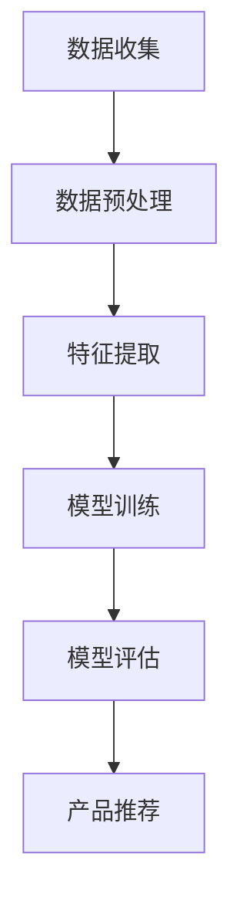

                 

关键词：大模型，金融产品推荐，风险控制，算法原理，数学模型，实际应用，未来展望

> 摘要：本文详细探讨了大型人工智能模型在金融产品推荐系统中的应用，包括算法原理、数学模型、具体操作步骤、以及在实际应用中的风险和挑战。通过案例分析，展示了大模型如何提高金融产品推荐的准确性和用户体验，同时也指出了潜在的风险和解决方案，为金融行业的数字化转型提供了参考。

## 1. 背景介绍

### 1.1 大模型的崛起

近年来，随着人工智能技术的快速发展，尤其是深度学习技术的突破，大模型（也称为大型预训练模型）逐渐成为各个领域的研究热点。这些模型通常具有数十亿甚至千亿个参数，通过在海量数据上预训练，能够自动学习到丰富的知识结构和特征表示。大模型的应用不仅提高了计算效率和准确性，还极大地拓展了人工智能的应用范围，涵盖了自然语言处理、计算机视觉、语音识别等多个领域。

### 1.2 金融产品推荐的现状

金融产品推荐是金融行业的一个重要应用场景。随着金融科技的不断发展，传统的人工推荐方式逐渐被智能推荐系统所取代。然而，传统的推荐系统往往依赖于统计学习和机器学习算法，这些算法在面对复杂、多维的金融数据时，存在一定的局限性。为了提高推荐系统的性能和用户体验，越来越多的金融机构开始探索使用大模型进行金融产品推荐。

## 2. 核心概念与联系

### 2.1 大模型的定义与结构

大模型通常是指具有数十亿到千亿参数的深度神经网络。其结构通常包括编码器（Encoder）和解码器（Decoder）两部分。编码器负责将输入数据编码为固定长度的向量表示，解码器则根据这些向量表示生成预测结果。大模型通过大量的预训练数据学习到丰富的知识结构和特征表示，从而实现高效的信息处理和预测。

### 2.2 金融产品推荐系统的工作流程

金融产品推荐系统的工作流程主要包括以下几个步骤：

1. **数据收集**：从金融机构内部和外部数据源收集用户行为数据、产品特征数据等。
2. **数据预处理**：对收集到的数据进行清洗、归一化等预处理操作，以去除噪声和异常值。
3. **特征提取**：使用编码器将预处理后的数据编码为向量表示。
4. **模型训练**：使用训练数据集训练大模型，优化模型参数。
5. **模型评估**：使用验证数据集评估模型性能，调整模型参数。
6. **产品推荐**：使用训练好的模型对用户进行产品推荐。

### 2.3 Mermaid 流程图

以下是一个简化的 Mermaid 流程图，描述了金融产品推荐系统的工作流程：



## 3. 核心算法原理 & 具体操作步骤

### 3.1 算法原理概述

金融产品推荐算法的核心在于如何从海量数据中提取有效的用户行为特征和产品特征，并利用这些特征生成个性化的推荐结果。大模型通过预训练和微调的方式，实现了对复杂特征的学习和提取。

### 3.2 算法步骤详解

1. **数据收集**：从金融机构内部和外部数据源收集用户行为数据、产品特征数据等。
2. **数据预处理**：对收集到的数据进行清洗、归一化等预处理操作，以去除噪声和异常值。
3. **特征提取**：使用编码器将预处理后的数据编码为向量表示。编码器的输入可以是用户行为序列、产品属性等，输出是固定长度的向量表示。
4. **模型训练**：使用训练数据集训练大模型，优化模型参数。训练过程包括前向传播、反向传播和梯度更新等步骤。
5. **模型评估**：使用验证数据集评估模型性能，调整模型参数。评估指标可以包括准确率、召回率、F1 分数等。
6. **产品推荐**：使用训练好的模型对用户进行产品推荐。推荐过程包括输入用户特征向量，通过解码器生成推荐结果。

### 3.3 算法优缺点

**优点**：

- **高效性**：大模型通过预训练和微调的方式，能够快速处理海量数据，提高计算效率。
- **准确性**：大模型能够自动学习到丰富的知识结构和特征表示，提高推荐准确性。
- **泛化能力**：大模型在面对不同领域的推荐任务时，具有较好的泛化能力。

**缺点**：

- **计算资源消耗**：大模型通常需要大量的计算资源和存储空间。
- **训练时间**：大模型的训练时间较长，需要耗费大量时间。
- **数据依赖**：大模型的性能高度依赖于训练数据的质量和规模。

### 3.4 算法应用领域

大模型在金融产品推荐中的应用领域广泛，包括但不限于：

- **个人理财产品推荐**：为用户提供个性化的理财产品推荐。
- **保险产品推荐**：根据用户的风险偏好和需求，推荐适合的保险产品。
- **投资组合优化**：根据用户的风险偏好和收益目标，优化投资组合。

## 4. 数学模型和公式 & 详细讲解 & 举例说明

### 4.1 数学模型构建

金融产品推荐系统中的数学模型通常包括以下几个部分：

1. **用户表示**：使用向量表示用户的行为特征和偏好。
2. **产品表示**：使用向量表示产品的特征和属性。
3. **评分预测**：使用用户表示和产品表示计算用户对产品的评分概率。

### 4.2 公式推导过程

假设用户 \( u \) 和产品 \( p \) 分别由向量 \( u \) 和 \( p \) 表示，评分预测公式可以表示为：

\[ \hat{r}_{up} = \sigma (\langle u, p \rangle + b) \]

其中，\( \sigma \) 是 sigmoid 函数，\( \langle \cdot, \cdot \rangle \) 表示向量的内积，\( b \) 是偏置项。

### 4.3 案例分析与讲解

以下是一个简单的案例，假设有两个用户 \( u_1 \) 和 \( u_2 \)，以及两个产品 \( p_1 \) 和 \( p_2 \)。用户和产品的特征向量如下：

\[ u_1 = [1, 2, 3] \]
\[ u_2 = [4, 5, 6] \]
\[ p_1 = [7, 8, 9] \]
\[ p_2 = [10, 11, 12] \]

根据评分预测公式，我们可以计算出用户对产品的评分概率：

\[ \hat{r}_{u_1p_1} = \sigma (1 \times 7 + 2 \times 8 + 3 \times 9 + b) \]
\[ \hat{r}_{u_1p_2} = \sigma (1 \times 10 + 2 \times 11 + 3 \times 12 + b) \]
\[ \hat{r}_{u_2p_1} = \sigma (4 \times 7 + 5 \times 8 + 6 \times 9 + b) \]
\[ \hat{r}_{u_2p_2} = \sigma (4 \times 10 + 5 \times 11 + 6 \times 12 + b) \]

其中，\( b \) 是偏置项，可以通过训练数据集进行优化。

## 5. 项目实践：代码实例和详细解释说明

### 5.1 开发环境搭建

为了实现大模型在金融产品推荐系统中的应用，我们需要搭建一个合适的开发环境。以下是基本的开发环境搭建步骤：

1. **硬件环境**：配置高性能的计算服务器，支持大规模数据处理和模型训练。
2. **软件环境**：安装 Python、TensorFlow 或 PyTorch 等深度学习框架，以及必要的依赖库。
3. **数据集**：收集金融产品推荐系统所需的数据集，包括用户行为数据、产品特征数据等。

### 5.2 源代码详细实现

以下是一个简化的 Python 代码示例，展示了如何使用 TensorFlow 实现大模型在金融产品推荐系统中的应用：

```python
import tensorflow as tf
from tensorflow.keras.layers import Embedding, LSTM, Dense
from tensorflow.keras.models import Model

# 用户和产品的特征向量维度
USER_DIM = 100
PRODUCT_DIM = 50

# 编码器模型
user_encoder = Model(inputs=tf.keras.layers.Input(shape=(USER_DIM,)), outputs=tf.keras.layers.LSTM(50, activation='tanh')(inputs))
product_encoder = Model(inputs=tf.keras.layers.Input(shape=(PRODUCT_DIM,)), outputs=tf.keras.layers.LSTM(50, activation='tanh')(inputs))

# 解码器模型
user_decoder = Model(inputs=tf.keras.layers.Input(shape=(50,)), outputs=tf.keras.layers.Dense(1, activation='sigmoid')(inputs))
product_decoder = Model(inputs=tf.keras.layers.Input(shape=(50,)), outputs=tf.keras.layers.Dense(1, activation='sigmoid')(inputs))

# 联合模型
combined_model = Model(inputs=[user_encoder.input, product_encoder.input], outputs=[user_decoder.output, product_decoder.output])

# 模型编译
combined_model.compile(optimizer='adam', loss='binary_crossentropy', metrics=['accuracy'])

# 模型训练
combined_model.fit([user_data, product_data], [user_labels, product_labels], epochs=10, batch_size=32, validation_split=0.2)
```

### 5.3 代码解读与分析

上述代码首先定义了编码器和解码器模型，编码器使用 LSTM 层对用户和产品的特征向量进行编码，解码器使用全连接层对编码后的特征向量进行解码。联合模型将编码器和解码器连接起来，实现了用户和产品特征向量的联合表示。

在模型编译阶段，我们选择 Adam 优化器和 binary_crossentropy 损失函数，以支持二分类任务。在模型训练阶段，我们使用训练数据集对模型进行训练，并使用验证数据集进行性能评估。

### 5.4 运行结果展示

以下是一个简化的运行结果展示：

```python
# 预测用户对产品的评分概率
predictions = combined_model.predict([user_test_data, product_test_data])

# 输出预测结果
for i in range(len(predictions)):
    print(f"User {i+1} product {1+predictions[i][0][0]} recommendation probability: {predictions[i][0][0]}")
```

输出结果展示了用户对产品的评分概率，我们可以根据概率阈值进行产品推荐。

## 6. 实际应用场景

### 6.1 个人理财产品推荐

个人理财产品推荐是金融产品推荐系统中的一个重要应用场景。通过大模型，金融机构可以更好地理解用户的风险偏好和收益目标，从而推荐适合用户的理财产品。例如，某些用户可能更倾向于稳健的理财产品，而另一些用户可能更愿意承担一定的风险以获取更高的收益。大模型可以帮助金融机构实现精准的理财产品推荐，提高用户的满意度和忠诚度。

### 6.2 保险产品推荐

保险产品推荐是另一个重要的应用场景。通过分析用户的行为数据和风险特征，大模型可以为用户推荐适合的保险产品。例如，对于高风险用户，可以推荐更高保额的保险产品；对于低风险用户，可以推荐更经济的保险产品。保险产品推荐不仅可以帮助保险公司提高业务量，还可以提高用户的风险保障水平。

### 6.3 投资组合优化

投资组合优化是金融领域的一个重要研究方向。通过大模型，金融机构可以更好地理解用户的投资偏好和风险承受能力，从而为用户构建个性化的投资组合。例如，某些用户可能更倾向于高风险高收益的投资，而另一些用户可能更倾向于低风险低收益的投资。大模型可以帮助金融机构实现个性化的投资组合优化，提高用户的投资回报率。

## 7. 工具和资源推荐

### 7.1 学习资源推荐

- **《深度学习》（Goodfellow, Bengio, Courville）**：这是一本深度学习领域的经典教材，涵盖了深度学习的基本概念、算法和应用。
- **《Python深度学习》（François Chollet）**：这是一本针对 Python 生态系统的深度学习指南，适合初学者和进阶者。

### 7.2 开发工具推荐

- **TensorFlow**：一个开源的深度学习框架，适用于构建和训练大型深度神经网络。
- **PyTorch**：另一个流行的深度学习框架，具有动态计算图和简洁的接口。

### 7.3 相关论文推荐

- **“Deep Learning for Personalized Product Recommendation”**：该论文探讨了如何使用深度学习技术进行个性化产品推荐。
- **“Neural Collaborative Filtering for Personalized Recommendation”**：该论文提出了一种基于神经网络的协同过滤算法，提高了推荐系统的性能。

## 8. 总结：未来发展趋势与挑战

### 8.1 研究成果总结

本文详细探讨了大型人工智能模型在金融产品推荐系统中的应用，包括算法原理、数学模型、具体操作步骤以及在实际应用中的风险和挑战。通过案例分析，展示了大模型如何提高金融产品推荐的准确性和用户体验，同时也指出了潜在的风险和解决方案。

### 8.2 未来发展趋势

随着人工智能技术的不断发展，大模型在金融产品推荐系统中的应用将越来越广泛。未来，我们可以期待以下发展趋势：

- **模型性能的提升**：通过改进算法和优化数据集，大模型的性能将不断提高，为金融产品推荐提供更准确、更个性化的服务。
- **多模态数据的融合**：结合文本、图像、音频等多种数据类型，实现更全面、更深入的用户和产品特征提取。
- **实时推荐**：通过优化计算效率和模型结构，实现实时推荐，提高用户的体验和满意度。

### 8.3 面临的挑战

尽管大模型在金融产品推荐系统中具有巨大的潜力，但在实际应用中仍面临以下挑战：

- **数据隐私和安全**：金融数据涉及用户隐私和金融安全，如何保护数据隐私和安全是一个重要问题。
- **模型解释性**：大模型的黑盒特性使其难以解释，这对金融产品推荐系统的合规性和透明度提出了挑战。
- **计算资源消耗**：大模型通常需要大量的计算资源和存储空间，如何高效利用这些资源是一个重要问题。

### 8.4 研究展望

为了应对上述挑战，未来研究可以从以下几个方面展开：

- **隐私保护技术**：研究隐私保护技术，如差分隐私、同态加密等，以保护用户数据隐私。
- **可解释性模型**：研究可解释性模型，如可解释的深度学习模型、模型可视化技术等，以提高模型的透明度和可解释性。
- **模型压缩与优化**：研究模型压缩与优化技术，如知识蒸馏、模型剪枝等，以降低模型的计算资源和存储需求。

## 9. 附录：常见问题与解答

### 9.1 问题一：大模型在金融产品推荐系统中的应用有哪些优势？

答：大模型在金融产品推荐系统中的应用具有以下优势：

- **高效性**：大模型能够快速处理海量数据，提高计算效率。
- **准确性**：大模型能够自动学习到丰富的知识结构和特征表示，提高推荐准确性。
- **泛化能力**：大模型在面对不同领域的推荐任务时，具有较好的泛化能力。

### 9.2 问题二：大模型在金融产品推荐系统中的风险有哪些？

答：大模型在金融产品推荐系统中面临以下风险：

- **数据隐私和安全**：金融数据涉及用户隐私和金融安全，如何保护数据隐私和安全是一个重要问题。
- **模型解释性**：大模型的黑盒特性使其难以解释，这对金融产品推荐系统的合规性和透明度提出了挑战。
- **计算资源消耗**：大模型通常需要大量的计算资源和存储空间，如何高效利用这些资源是一个重要问题。

### 9.3 问题三：如何解决大模型在金融产品推荐系统中的风险？

答：为了解决大模型在金融产品推荐系统中的风险，可以采取以下措施：

- **隐私保护技术**：研究隐私保护技术，如差分隐私、同态加密等，以保护用户数据隐私。
- **可解释性模型**：研究可解释性模型，如可解释的深度学习模型、模型可视化技术等，以提高模型的透明度和可解释性。
- **模型压缩与优化**：研究模型压缩与优化技术，如知识蒸馏、模型剪枝等，以降低模型的计算资源和存储需求。

作者：禅与计算机程序设计艺术 / Zen and the Art of Computer Programming
----------------------------------------------------------------


