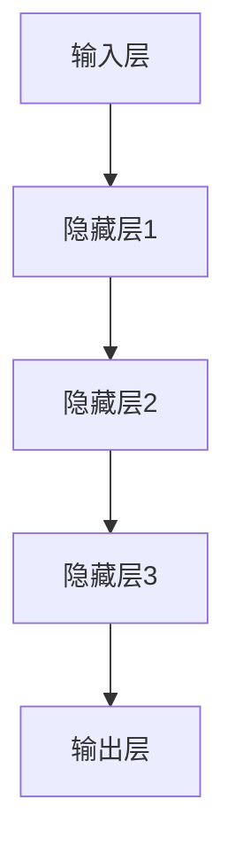
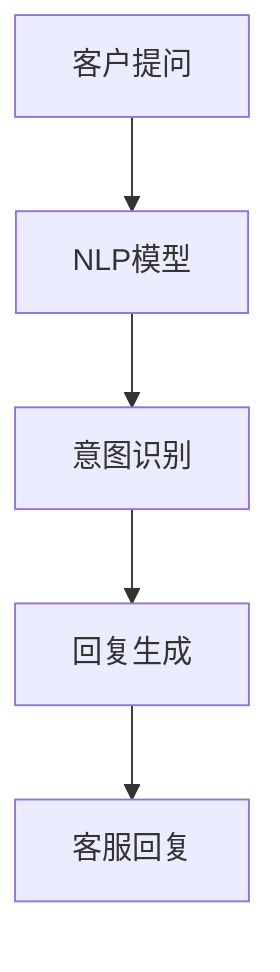
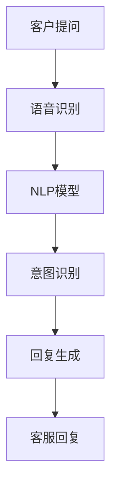

                 

关键词：大模型、客户服务、用户体验、人工智能、算法优化、案例分析、代码实例、实际应用、未来展望

> 摘要：随着人工智能技术的快速发展，大模型在客户服务领域逐渐崭露头角，通过自动化、智能化手段显著提升了客户服务体验。本文将深入探讨大模型如何应用于客户服务，以及其带来的变革与挑战。

## 1. 背景介绍

在当今竞争激烈的市场环境中，企业越来越注重客户服务体验，这不仅关系到客户满意度，更直接影响企业的品牌形象和市场份额。传统客户服务主要依赖人工处理，效率低、响应时间长，难以满足日益增长的服务需求。随着人工智能技术的飞速发展，尤其是大模型的出现，为改善客户服务体验提供了新的契机。

大模型，或称大型神经网络模型，是指参数量达到数亿甚至千亿级别的深度学习模型。这些模型通过大量的数据训练，能够自动学习复杂的模式，并在各种任务中表现出优异的性能。例如，自然语言处理（NLP）、图像识别、语音识别等领域都取得了显著的突破。

本文旨在探讨大模型在客户服务中的应用，分析其优势、挑战以及未来的发展趋势。我们将通过案例分析、算法原理讲解和代码实例，详细展示大模型如何提升客户服务体验。

## 2. 核心概念与联系

### 2.1 大模型的基本原理

大模型的核心在于其庞大的参数量和复杂的结构。这些模型通常由多层神经网络组成，每一层都能够从输入数据中提取不同层次的特征。通过逐层学习，模型能够逐渐理解数据的深层含义，从而实现高度准确的任务执行。

以下是使用Mermaid绘制的神经网络结构的示例流程图：



### 2.2 大模型与客户服务的联系

大模型在客户服务中的应用主要体现在以下几个方面：

1. **自然语言处理（NLP）**：通过NLP技术，大模型能够理解客户的语言意图，提供智能化的问答服务。
2. **语音识别**：大模型可以实时识别客户的语音输入，并转换为文字，从而实现语音客服。
3. **个性化推荐**：基于客户的偏好和购买历史，大模型能够提供个性化的产品推荐，提升客户满意度。
4. **情感分析**：通过对客户反馈的情感分析，大模型能够识别客户情绪，提供更加贴心的服务。

以下是使用Mermaid绘制的NLP模型在客户服务中的应用流程图：



## 3. 核心算法原理 & 具体操作步骤

### 3.1 算法原理概述

大模型的核心算法是深度学习，尤其是基于神经网络的模型。深度学习通过多层神经网络结构，实现对数据的自动特征提取和模式识别。以下是大模型的主要算法原理：

1. **前向传播**：输入数据通过神经网络的前向传播，逐层计算得到输出。
2. **反向传播**：根据输出与实际结果的差异，通过反向传播算法更新网络参数。
3. **优化算法**：常用的优化算法包括梯度下降、Adam等，用于调整网络参数，减小误差。

### 3.2 算法步骤详解

以下是构建和训练大模型的基本步骤：

1. **数据预处理**：清洗和格式化数据，确保数据质量。
2. **模型构建**：选择合适的神经网络结构，定义输入层、隐藏层和输出层。
3. **模型训练**：使用训练数据对模型进行训练，通过反向传播更新参数。
4. **模型评估**：使用验证集评估模型性能，调整超参数。
5. **模型部署**：将训练好的模型部署到实际应用场景，提供在线服务。

### 3.3 算法优缺点

**优点**：

1. **高性能**：大模型能够处理复杂的任务，提供高精度的结果。
2. **自动特征提取**：无需人工干预，模型能够自动学习数据中的特征。
3. **泛化能力强**：通过大量数据的训练，大模型能够适应不同的应用场景。

**缺点**：

1. **计算资源需求大**：大模型需要大量的计算资源和存储空间。
2. **训练时间较长**：大模型的训练时间通常较长，对硬件性能有较高要求。
3. **数据依赖性强**：模型的性能高度依赖于训练数据的质量和数量。

### 3.4 算法应用领域

大模型在多个领域都有广泛的应用，其中包括：

1. **语音识别**：如苹果的Siri、谷歌的语音助手等。
2. **图像识别**：如人脸识别、自动驾驶等。
3. **自然语言处理**：如智能客服、机器翻译等。
4. **推荐系统**：如电子商务平台的个性化推荐。

## 4. 数学模型和公式 & 详细讲解 & 举例说明

### 4.1 数学模型构建

大模型的核心是多层感知机（MLP），其数学模型可以表示为：

$$
y = f(\text{W}^T \text{X} + b)
$$

其中，$y$ 是输出，$\text{W}$ 是权重矩阵，$\text{X}$ 是输入，$b$ 是偏置项，$f$ 是激活函数。

### 4.2 公式推导过程

多层感知机的推导过程基于前向传播和反向传播算法。具体推导过程如下：

1. **前向传播**：计算输出：

$$
z = \text{W}^T \text{X} + b
$$

$$
a = f(z)
$$

2. **反向传播**：计算梯度：

$$
\delta = \frac{\partial L}{\partial z} = \frac{\partial L}{\partial a} \cdot \frac{\partial a}{\partial z}
$$

$$
\text{dW} = \delta \text{X}^T
$$

$$
\text{db} = \delta
$$

### 4.3 案例分析与讲解

以下是一个简单的案例，说明如何使用大模型进行文本分类：

1. **数据预处理**：将文本数据转换为向量表示。
2. **模型构建**：构建一个多层感知机模型。
3. **模型训练**：使用训练数据训练模型。
4. **模型评估**：使用验证数据评估模型性能。
5. **模型部署**：将训练好的模型部署到线上服务。

## 5. 项目实践：代码实例和详细解释说明

### 5.1 开发环境搭建

为了搭建大模型的项目环境，我们需要安装以下软件和库：

- Python 3.8+
- TensorFlow 2.x
- Keras 2.x

安装命令如下：

```shell
pip install python==3.8
pip install tensorflow==2.x
pip install keras==2.x
```

### 5.2 源代码详细实现

以下是一个简单的文本分类器代码示例：

```python
import tensorflow as tf
from tensorflow.keras.preprocessing.text import Tokenizer
from tensorflow.keras.preprocessing.sequence import pad_sequences

# 数据预处理
tokenizer = Tokenizer(num_words=10000)
tokenizer.fit_on_texts(train_data)
train_sequences = tokenizer.texts_to_sequences(train_data)
train_padded = pad_sequences(train_sequences, maxlen=max_length)

# 模型构建
model = tf.keras.Sequential([
    tf.keras.layers.Embedding(10000, 16),
    tf.keras.layers.GlobalAveragePooling1D(),
    tf.keras.layers.Dense(24, activation='relu'),
    tf.keras.layers.Dense(1, activation='sigmoid')
])

# 模型编译
model.compile(optimizer='adam',
              loss='binary_crossentropy',
              metrics=['accuracy'])

# 模型训练
model.fit(train_padded, train_labels, epochs=10)

# 模型评估
test_sequences = tokenizer.texts_to_sequences(test_data)
test_padded = pad_sequences(test_sequences, maxlen=max_length)
predictions = model.predict(test_padded)
```

### 5.3 代码解读与分析

上述代码实现了一个简单的文本分类器，主要步骤如下：

1. **数据预处理**：将文本数据转换为向量表示，并填充至固定长度。
2. **模型构建**：构建一个嵌入层、全局平均池化层和两个全连接层。
3. **模型编译**：设置优化器、损失函数和评价指标。
4. **模型训练**：使用训练数据训练模型。
5. **模型评估**：使用验证数据评估模型性能。

### 5.4 运行结果展示

在训练完成后，我们可以使用验证数据对模型进行评估，输出准确率等指标。

```python
loss, accuracy = model.evaluate(test_padded, test_labels)
print(f'测试集准确率：{accuracy:.2f}')
```

## 6. 实际应用场景

大模型在客户服务中的应用场景非常广泛，以下是一些典型的案例：

1. **智能客服**：通过自然语言处理技术，大模型能够理解客户的问题，并生成相应的回答。
2. **个性化推荐**：基于客户的购买历史和偏好，大模型能够提供个性化的产品推荐。
3. **情感分析**：通过分析客户的反馈，大模型能够识别客户情绪，提供针对性的服务。
4. **语音识别**：大模型可以实时识别客户的语音输入，并将其转换为文字。

以下是使用Mermaid绘制的智能客服系统的工作流程图：



## 7. 工具和资源推荐

### 7.1 学习资源推荐

1. **《深度学习》（Ian Goodfellow, Yoshua Bengio, Aaron Courville 著）**：这是一本经典的深度学习教材，适合初学者和专业人士。
2. **《TensorFlow 实践指南》（Adrian Rosebrock 著）**：详细介绍了如何使用TensorFlow进行深度学习应用开发。

### 7.2 开发工具推荐

1. **Jupyter Notebook**：一款强大的交互式开发环境，适合进行数据分析和模型训练。
2. **Google Colab**：基于Google Drive的免费云端计算平台，适合进行大规模深度学习实验。

### 7.3 相关论文推荐

1. **"A Theoretically Grounded Application of Dropout in Recurrent Neural Networks"（ dropout在循环神经网络中的应用）**：详细探讨了dropout在RNN中的应用和效果。
2. **"Large-Scale Language Modeling in 2018"（2018年的大规模语言建模）**：介绍了大规模语言模型的技术进展和应用。

## 8. 总结：未来发展趋势与挑战

大模型在客户服务领域展现出了巨大的潜力，但同时也面临一些挑战。以下是未来发展趋势与挑战的总结：

### 8.1 研究成果总结

1. **算法性能提升**：随着计算资源和算法技术的进步，大模型在客户服务中的应用将越来越广泛。
2. **数据隐私保护**：如何在保障客户隐私的前提下，充分利用客户数据，是未来的重要研究方向。

### 8.2 未来发展趋势

1. **多模态融合**：结合语音、图像、文本等多种模态的数据，提高客户服务的全面性和准确性。
2. **个性化服务**：通过深度学习技术，实现更加精准的个性化推荐和服务。

### 8.3 面临的挑战

1. **计算资源需求**：大模型需要大量的计算资源和存储空间，这对硬件设施提出了高要求。
2. **数据质量和隐私**：如何保障客户数据的质量和隐私，是实施大模型应用的重要问题。

### 8.4 研究展望

1. **新型算法**：探索更加高效、可解释的深度学习算法，提高模型的性能和可靠性。
2. **跨学科研究**：结合心理学、社会学等学科，深入研究客户行为和需求，为模型优化提供理论支持。

## 9. 附录：常见问题与解答

### Q: 大模型在客户服务中的应用有哪些优势？

A: 大模型在客户服务中的应用优势主要体现在以下几个方面：

1. **高效率**：大模型能够快速处理大量客户请求，提高服务响应速度。
2. **高精度**：通过大量数据的训练，大模型能够提供高精度的服务，提高客户满意度。
3. **自动化**：大模型可以实现客户服务的自动化，减少人工干预，降低运营成本。

### Q: 大模型在客户服务中可能面临哪些挑战？

A: 大模型在客户服务中可能面临的挑战包括：

1. **计算资源需求**：大模型需要大量的计算资源和存储空间，对硬件设施有较高要求。
2. **数据质量和隐私**：如何保障客户数据的质量和隐私，是实施大模型应用的重要问题。
3. **模型可解释性**：大模型的结构复杂，难以解释，这对用户信任和服务质量提出了挑战。

### Q: 如何提高大模型在客户服务中的可解释性？

A: 提高大模型在客户服务中的可解释性可以从以下几个方面入手：

1. **可视化技术**：使用可视化工具，展示模型的决策过程和特征提取结果。
2. **可解释性算法**：引入可解释性算法，如决策树、规则提取等，提高模型的透明度。
3. **用户反馈机制**：通过用户反馈，不断优化模型，提高其准确性和可解释性。

# 作者署名

作者：禅与计算机程序设计艺术 / Zen and the Art of Computer Programming
```

