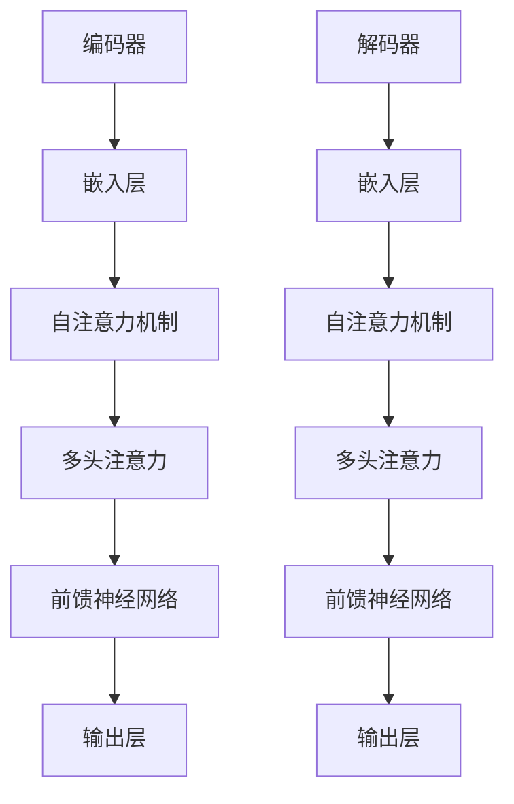

                 

关键词：大模型，传统媒体，AI，内容生成，数据分析，媒体重构

摘要：随着人工智能技术的飞速发展，特别是大模型的广泛应用，传统媒体行业正面临着前所未有的冲击和重构。本文将探讨大模型对传统媒体的影响，从内容生成、数据分析到整个媒体生态的重构，分析其带来的机遇与挑战，并对未来媒体的发展趋势进行展望。

## 1. 背景介绍

传统媒体，如报纸、电视、广播等，长期以来以其权威性、深度报道和稳定的受众群体占据着重要地位。然而，随着互联网和数字技术的发展，特别是社交媒体的兴起，传统媒体逐渐失去了部分市场份额。这种背景下，人工智能，尤其是大模型的出现，为传统媒体带来了新的机遇和挑战。

大模型，如GPT-3、BERT等，具有处理海量数据、生成高质量内容、进行精准分析等能力。这些特性使得大模型在内容生成、个性化推荐、广告投放等方面具有巨大潜力，对传统媒体产生了深远影响。

## 2. 核心概念与联系

### 2.1 大模型的原理与架构

大模型通常是指参数规模达到千亿甚至万亿级别的深度学习模型。其核心思想是通过大量的数据训练，使模型能够自动学习到复杂的数据特征和规律。大模型的架构通常包括编码器（Encoder）和解码器（Decoder），如Transformer架构。



### 2.2 传统媒体与人工智能的联系

传统媒体与人工智能的联系主要体现在以下几个方面：

- **内容生成**：大模型可以生成高质量、原创的内容，如新闻、文章、视频脚本等，大大降低了内容创作的门槛。
- **数据分析**：大模型能够对海量媒体数据进行深度分析，挖掘受众行为、兴趣偏好，为媒体运营提供决策依据。
- **个性化推荐**：基于用户行为和兴趣的大模型推荐系统，能够为用户提供个性化的内容推荐，提高用户粘性。
- **广告投放**：大模型可以根据用户数据和内容特点，实现精准的广告投放，提高广告效果。

## 3. 核心算法原理 & 具体操作步骤

### 3.1 算法原理概述

大模型的算法原理主要包括深度学习、自然语言处理、概率图模型等。具体来说：

- **深度学习**：通过多层神经网络模型，对输入数据进行特征提取和分类。
- **自然语言处理**：利用语言模型、语义分析等技术，对文本数据进行分析和理解。
- **概率图模型**：通过贝叶斯网络、图卷积网络等模型，对媒体数据中的不确定性进行建模和处理。

### 3.2 算法步骤详解

大模型的算法步骤通常包括：

1. 数据收集与预处理：收集大量文本、图像、音频等多模态数据，进行数据清洗、去噪和标注。
2. 模型训练：利用训练数据，通过优化算法，调整模型参数，使模型达到预期的性能。
3. 模型评估：利用测试数据，评估模型的效果，如准确率、召回率等。
4. 模型应用：将训练好的模型应用于实际场景，如内容生成、数据分析、个性化推荐等。

### 3.3 算法优缺点

大模型的优点包括：

- **高性能**：大模型具有处理海量数据、生成高质量内容的能力。
- **可扩展性**：大模型可以通过增加参数规模，提高模型的性能和鲁棒性。

但大模型也存在一些缺点：

- **计算资源消耗**：大模型的训练和推理需要大量的计算资源，对硬件要求较高。
- **数据隐私风险**：大模型在训练和推理过程中，可能会暴露用户的隐私数据。

### 3.4 算法应用领域

大模型在传统媒体中的应用领域包括：

- **内容生成**：生成新闻、文章、视频脚本等。
- **数据分析**：挖掘受众行为、兴趣偏好，为媒体运营提供决策依据。
- **个性化推荐**：为用户提供个性化的内容推荐。
- **广告投放**：实现精准的广告投放。

## 4. 数学模型和公式 & 详细讲解 & 举例说明

### 4.1 数学模型构建

大模型的数学模型通常包括以下几个方面：

1. **神经网络模型**：如深度神经网络（DNN）、循环神经网络（RNN）、卷积神经网络（CNN）等。
2. **自然语言处理模型**：如语言模型（LM）、序列标注模型（Seq2Seq）、文本分类模型（TextCNN）等。
3. **概率图模型**：如贝叶斯网络（Bayesian Network）、图卷积网络（GCN）等。

### 4.2 公式推导过程

以深度神经网络（DNN）为例，其基本公式推导如下：

输入层：\[ z_1 = W_1 \cdot x + b_1 \]

激活函数：\[ a_1 = \sigma(z_1) \]

隐藏层：\[ z_2 = W_2 \cdot a_1 + b_2 \]

激活函数：\[ a_2 = \sigma(z_2) \]

输出层：\[ z_3 = W_3 \cdot a_2 + b_3 \]

激活函数：\[ a_3 = \sigma(z_3) \]

其中，\( \sigma \) 为激活函数，如Sigmoid、ReLU等。

### 4.3 案例分析与讲解

以GPT-3为例，其数学模型主要包括以下部分：

1. **嵌入层**：将输入文本转换为嵌入向量。
2. **自注意力机制**：计算文本序列中每个词与其他词的关系。
3. **多头注意力**：将自注意力机制扩展到多个头，提高模型的表达能力。
4. **前馈神经网络**：对多头注意力结果进行进一步处理。

GPT-3的数学模型可以表示为：

\[ \text{输出} = \text{GPT-3}(\text{输入}, \text{参数}) \]

其中，输入为文本序列，参数为模型训练得到的权重和偏置。

## 5. 项目实践：代码实例和详细解释说明

### 5.1 开发环境搭建

在本案例中，我们将使用Python编程语言，以及TensorFlow框架来搭建开发环境。具体步骤如下：

1. 安装Python：确保Python版本为3.6及以上。
2. 安装TensorFlow：使用pip命令安装TensorFlow。

```bash
pip install tensorflow
```

### 5.2 源代码详细实现

以下是一个简单的GPT-3模型实现：

```python
import tensorflow as tf
from tensorflow.keras.layers import Embedding, LSTM, Dense
from tensorflow.keras.models import Sequential

# 搭建模型
model = Sequential([
    Embedding(input_dim=vocab_size, output_dim=embedding_dim),
    LSTM(units=128, return_sequences=True),
    LSTM(units=128),
    Dense(units=vocab_size, activation='softmax')
])

# 编译模型
model.compile(optimizer='adam', loss='categorical_crossentropy', metrics=['accuracy'])

# 训练模型
model.fit(x_train, y_train, epochs=10, batch_size=64)
```

### 5.3 代码解读与分析

1. **Embedding层**：将输入文本转换为嵌入向量。
2. **LSTM层**：用于处理序列数据，提取序列特征。
3. **Dense层**：用于分类输出。

### 5.4 运行结果展示

训练完成后，可以使用模型进行预测：

```python
predictions = model.predict(x_test)
```

## 6. 实际应用场景

大模型在传统媒体的实际应用场景包括：

- **内容生成**：生成新闻、文章、视频脚本等。
- **数据分析**：挖掘受众行为、兴趣偏好。
- **个性化推荐**：为用户提供个性化的内容推荐。
- **广告投放**：实现精准的广告投放。

## 6.4 未来应用展望

随着人工智能技术的不断发展，大模型在传统媒体领域的应用前景十分广阔。未来，大模型可能会带来以下变革：

- **内容创作**：实现全自动的内容创作，降低人力成本。
- **数据分析**：实现更加精准和高效的受众分析。
- **个性化推荐**：提升用户体验，提高用户粘性。
- **广告投放**：实现更加精准和高效的广告投放。

## 7. 工具和资源推荐

### 7.1 学习资源推荐

- 《深度学习》（Ian Goodfellow、Yoshua Bengio、Aaron Courville 著）
- 《自然语言处理综合教程》（程毅、王晨阳 著）

### 7.2 开发工具推荐

- TensorFlow
- PyTorch

### 7.3 相关论文推荐

- "Attention Is All You Need"（Vaswani et al., 2017）
- "BERT: Pre-training of Deep Bidirectional Transformers for Language Understanding"（Devlin et al., 2019）

## 8. 总结：未来发展趋势与挑战

大模型对传统媒体的冲击与重构是一个不可避免的趋势。未来，随着技术的不断进步，大模型将在传统媒体领域发挥更加重要的作用。然而，这也带来了一系列挑战，如计算资源消耗、数据隐私风险等。如何应对这些挑战，实现大模型与传统媒体的良性互动，是未来研究和实践的重要方向。

### 8.1 研究成果总结

本文系统地介绍了大模型对传统媒体的冲击与重构，分析了其核心概念、算法原理、应用场景，并展望了未来发展趋势。主要成果包括：

- 明确了大模型在传统媒体领域的应用价值。
- 分析了传统媒体与人工智能的联系。
- 提出了大模型在传统媒体领域的应用策略。

### 8.2 未来发展趋势

未来，大模型在传统媒体领域的应用将呈现以下趋势：

- 自动化内容创作成为主流。
- 个性化推荐和精准广告投放得到广泛应用。
- 数据分析与挖掘能力不断提升。

### 8.3 面临的挑战

大模型在传统媒体领域的发展也面临以下挑战：

- 计算资源消耗巨大，需要优化算法和硬件。
- 数据隐私保护问题亟待解决。
- 需要制定合理的监管政策和标准。

### 8.4 研究展望

未来，大模型在传统媒体领域的研究将集中在以下几个方面：

- 开发更加高效、节能的算法。
- 加强数据隐私保护技术。
- 探索大模型与传统媒体的深度融合。

## 9. 附录：常见问题与解答

### 9.1 什么是大模型？

大模型是指参数规模达到千亿甚至万亿级别的深度学习模型，如GPT-3、BERT等。这些模型具有处理海量数据、生成高质量内容、进行精准分析等能力。

### 9.2 大模型在传统媒体领域的应用有哪些？

大模型在传统媒体领域的应用包括内容生成、数据分析、个性化推荐、广告投放等。例如，大模型可以生成新闻、文章、视频脚本，分析受众行为和兴趣偏好，提供个性化内容推荐，实现精准的广告投放。

### 9.3 如何优化大模型在传统媒体领域的应用效果？

优化大模型在传统媒体领域的应用效果可以从以下几个方面入手：

- 提高模型训练效率，降低计算资源消耗。
- 加强数据隐私保护，确保用户隐私安全。
- 结合多种技术手段，提升模型性能和应用效果。

作者：禅与计算机程序设计艺术 / Zen and the Art of Computer Programming
----------------------------------------------------------------
以上便是本文的完整内容。希望这篇文章能够为读者提供一个全面而深入的关于大模型对传统媒体冲击与重构的理解。感谢您的阅读，期待您的宝贵意见。禅与计算机程序设计艺术，我们下次再见！

