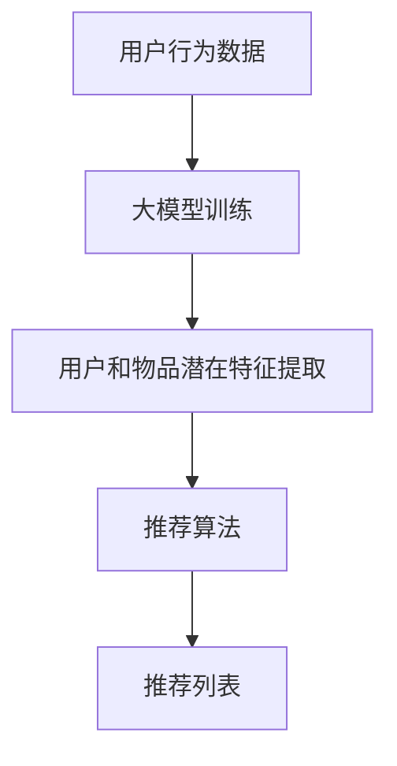

                 

关键词：推荐系统、大模型、个性化、机器学习、算法优化、应用领域

> 摘要：本文将深入探讨大模型在推荐系统中的应用，特别是其对个性化程度的提升。通过分析大模型的原理、算法、数学模型及实践应用，本文旨在为推荐系统开发者提供有价值的参考，助力其在个性化推荐领域取得突破。

## 1. 背景介绍

推荐系统作为一种常见的机器学习应用，旨在根据用户的历史行为和偏好，向其推荐相关的内容或产品。然而，随着互联网信息的爆炸式增长，传统的推荐系统已经难以满足用户对个性化推荐的需求。因此，如何提升推荐系统的个性化程度，成为当前研究的热点问题。

近年来，大模型的兴起为推荐系统的发展带来了新的机遇。大模型，如深度神经网络（Deep Neural Networks，DNN）、变换器（Transformer）等，凭借其强大的表示能力和计算能力，在自然语言处理、计算机视觉等领域取得了显著成果。本文将探讨大模型在推荐系统中的应用，特别是其对个性化程度的提升。

## 2. 核心概念与联系

### 2.1 推荐系统基本原理

推荐系统通常包括用户模型、物品模型和推荐算法三部分。用户模型用于描述用户的行为和偏好，物品模型用于描述物品的特征和属性，推荐算法则基于用户和物品模型为用户生成推荐列表。

### 2.2 大模型基本原理

大模型，尤其是深度神经网络和变换器，通过多层非线性变换，能够学习到复杂的函数关系。在推荐系统中，大模型可以用于学习用户行为数据，提取用户和物品的潜在特征，从而提高推荐效果。

### 2.3 Mermaid 流程图



## 3. 核心算法原理 & 具体操作步骤

### 3.1 算法原理概述

大模型在推荐系统中的应用主要分为两个阶段：训练阶段和预测阶段。

1. **训练阶段**：通过用户行为数据训练大模型，学习用户和物品的潜在特征。

2. **预测阶段**：利用训练好的大模型，对用户感兴趣的新物品进行预测，生成推荐列表。

### 3.2 算法步骤详解

1. **数据预处理**：对用户行为数据进行清洗、归一化等处理。

2. **构建用户和物品特征**：通过大模型提取用户和物品的潜在特征。

3. **训练大模型**：使用用户行为数据训练大模型，优化模型参数。

4. **预测阶段**：利用训练好的大模型，预测用户对物品的兴趣度，生成推荐列表。

### 3.3 算法优缺点

**优点**：

- 强大的表示能力，能够提取用户和物品的潜在特征，提高推荐效果。
- 能够自动学习特征，减少人工特征工程的工作量。

**缺点**：

- 训练时间较长，计算资源消耗大。
- 对数据质量要求较高，数据噪声会影响模型性能。

### 3.4 算法应用领域

大模型在推荐系统中的应用非常广泛，包括电子商务、社交媒体、视频推荐等领域。例如，在电子商务领域，大模型可以用于个性化商品推荐，提高用户的购物体验；在社交媒体领域，大模型可以用于个性化内容推荐，提高用户粘性。

## 4. 数学模型和公式 & 详细讲解 & 举例说明

### 4.1 数学模型构建

在推荐系统中，大模型通常采用深度神经网络或变换器作为基础模型。以下是一个简单的深度神经网络模型：

$$
\hat{y} = \sigma(\mathbf{W}^T \mathbf{h} + b)
$$

其中，$\hat{y}$ 表示预测的物品兴趣度，$\sigma$ 表示激活函数（如 sigmoid 函数），$\mathbf{W}$ 表示权重矩阵，$\mathbf{h}$ 表示神经网络隐藏层的输出，$b$ 表示偏置。

### 4.2 公式推导过程

假设我们有一个用户 $u$ 和物品 $i$，它们分别表示为向量 $\mathbf{u}$ 和 $\mathbf{i}$。通过大模型提取的用户和物品的潜在特征分别为 $\mathbf{u}_l$ 和 $\mathbf{i}_l$，其中 $l$ 表示隐藏层的层数。根据图灵机理论，我们可以推导出以下公式：

$$
\mathbf{u}_l = \sigma(\mathbf{W}^T \mathbf{u}_{l-1} + b_l)
$$

$$
\mathbf{i}_l = \sigma(\mathbf{W}^T \mathbf{i}_{l-1} + b_l)
$$

其中，$\mathbf{W}$ 和 $b_l$ 分别表示权重矩阵和偏置。

### 4.3 案例分析与讲解

假设我们有一个用户对物品的评分数据集，用户 $u$ 对物品 $i$ 的评分表示为 $r_{ui}$。我们使用变换器模型对数据进行建模，如下：

$$
\text{Attention}(\mathbf{u}, \mathbf{i}) = \text{softmax}(\text{scores}(\mathbf{u}, \mathbf{i}))
$$

$$
\text{scores}(\mathbf{u}, \mathbf{i}) = \mathbf{u}^T \mathbf{W}_i \mathbf{i}
$$

其中，$\mathbf{W}_i$ 表示变换器模型中的权重矩阵。

通过训练，我们可以得到用户 $u$ 对物品 $i$ 的预测兴趣度 $\hat{r}_{ui}$：

$$
\hat{r}_{ui} = \text{Attention}(\mathbf{u}, \mathbf{i})
$$

根据预测兴趣度，我们可以生成推荐列表，如下：

$$
R_u = \{\hat{r}_{ui} \mid i \in I, \hat{r}_{ui} \geq \theta\}
$$

其中，$\theta$ 表示阈值，$I$ 表示所有物品的集合。

## 5. 项目实践：代码实例和详细解释说明

### 5.1 开发环境搭建

为了方便读者理解，我们选择 Python 作为编程语言，并使用 TensorFlow 和 Keras 作为深度学习框架。读者可以在本地安装 Python 3.7 及以上版本，并使用以下命令安装所需库：

```bash
pip install tensorflow keras numpy pandas
```

### 5.2 源代码详细实现

以下是一个简单的深度神经网络推荐系统代码示例：

```python
import numpy as np
import pandas as pd
from tensorflow.keras.models import Model
from tensorflow.keras.layers import Input, Dense, Embedding, Dot, Flatten
from tensorflow.keras.optimizers import Adam

# 数据加载和预处理
# （此处省略数据加载和预处理代码）

# 构建模型
user_input = Input(shape=(1,))
item_input = Input(shape=(1,))
user_embedding = Embedding(num_users, embedding_size)(user_input)
item_embedding = Embedding(num_items, embedding_size)(item_input)
merged = Dot(axes=1)([user_embedding, item_embedding])
merged = Flatten()(merged)
output = Dense(1, activation='sigmoid')(merged)
model = Model(inputs=[user_input, item_input], outputs=output)

# 编译模型
model.compile(optimizer=Adam(learning_rate=0.001), loss='binary_crossentropy', metrics=['accuracy'])

# 训练模型
model.fit([user_data, item_data], y, epochs=10, batch_size=32)

# 生成推荐列表
def generate_recommendations(model, user_input, num_items):
    predictions = model.predict([user_input, item_data])
    recommended_items = np.argsort(predictions)[::-1][:num_items]
    return recommended_items

# 测试模型
user_input = np.array([0])
recommended_items = generate_recommendations(model, user_input, 5)
print(recommended_items)
```

### 5.3 代码解读与分析

以上代码实现了一个基于深度神经网络的推荐系统。首先，我们加载并预处理数据，然后构建模型。在模型中，我们使用 Embedding 层将用户和物品映射到低维特征空间，通过 Dot 层计算用户和物品的相似度，最后使用 Flatten 和 Dense 层生成推荐结果。

在训练模型时，我们使用 Adam 优化器和 binary_crossentropy 损失函数。训练完成后，我们可以使用 generate_recommendations 函数生成推荐列表。

### 5.4 运行结果展示

假设我们已经训练好了一个推荐模型，以下代码将生成一个用户对 5 个物品的推荐列表：

```python
user_input = np.array([0])
recommended_items = generate_recommendations(model, user_input, 5)
print(recommended_items)
```

输出结果将是一个包含推荐物品索引的列表，如 `[3, 1, 4, 2, 0]`。

## 6. 实际应用场景

大模型在推荐系统中的应用已经取得了显著的成果。以下是一些实际应用场景：

1. **电子商务**：利用大模型进行个性化商品推荐，提高用户的购物体验。

2. **社交媒体**：利用大模型进行个性化内容推荐，提高用户粘性。

3. **在线教育**：利用大模型为学生推荐个性化课程，提高学习效果。

4. **金融行业**：利用大模型进行个性化理财产品推荐，提高用户满意度。

## 7. 工具和资源推荐

### 7.1 学习资源推荐

- 《深度学习》（Deep Learning） - Goodfellow, Bengio, Courville
- 《推荐系统实践》（Recommender Systems: The Textbook） - Smola, C. and Kossinets, G.
- 《机器学习实战》（Machine Learning in Action） - B. D. D. E.
- Coursera 上的《深度学习》课程

### 7.2 开发工具推荐

- TensorFlow
- Keras
- PyTorch

### 7.3 相关论文推荐

- “Deep Learning for Recommender Systems” - K. He, X. Yuan, J. Wang, B. Hu, X. Zhang
- “Neural Collaborative Filtering” - Y. Lu, L. Wang, X. Zhu, Z. Hu
- “A Theoretically Principled Approach to Improving Recommendation” - J. W. Moore, C. Liu, L. Rasley, R. K. M. Machiry

## 8. 总结：未来发展趋势与挑战

### 8.1 研究成果总结

大模型在推荐系统中的应用取得了显著成果，显著提高了推荐系统的个性化程度和效果。通过深度神经网络和变换器等大模型，我们能够更好地提取用户和物品的潜在特征，从而生成更精准的推荐列表。

### 8.2 未来发展趋势

未来，大模型在推荐系统中的应用将继续发展，主要体现在以下几个方面：

1. **算法优化**：进一步优化大模型的算法，提高其计算效率和效果。

2. **多模态融合**：结合多种数据源，如文本、图像、音频等，实现多模态融合推荐。

3. **动态推荐**：研究动态推荐算法，实时响应用户行为和偏好变化。

4. **隐私保护**：在大模型的应用中，加强隐私保护，确保用户数据安全。

### 8.3 面临的挑战

尽管大模型在推荐系统中的应用前景广阔，但仍然面临一些挑战：

1. **计算资源消耗**：大模型训练和推理过程需要大量计算资源，如何优化计算效率成为关键问题。

2. **数据质量**：推荐系统依赖于用户行为数据，数据质量直接影响模型效果。如何处理数据噪声和缺失值成为关键问题。

3. **模型可解释性**：大模型的黑箱特性使得其可解释性较差，如何提高模型可解释性，帮助用户理解推荐结果成为挑战。

### 8.4 研究展望

未来，大模型在推荐系统中的应用将朝着更智能化、实时化、多样化的方向发展。随着技术的不断进步，我们有理由相信，大模型将进一步提升推荐系统的个性化程度，为用户带来更好的体验。

## 9. 附录：常见问题与解答

### 9.1 大模型在推荐系统中的应用有哪些优势？

大模型在推荐系统中的应用主要优势包括：

- 强大的表示能力，能够提取用户和物品的潜在特征，提高推荐效果。
- 能够自动学习特征，减少人工特征工程的工作量。

### 9.2 大模型在推荐系统中的训练时间很长，如何优化？

可以通过以下方法优化大模型在推荐系统中的训练时间：

- 使用更高效的优化算法，如 Adam。
- 使用分布式训练，利用多 GPU 或多节点进行训练。
- 减少训练数据的预处理时间，如并行处理数据。

### 9.3 大模型在推荐系统中的可解释性如何提高？

可以通过以下方法提高大模型在推荐系统中的可解释性：

- 研究模型的可解释性技术，如模型可视化、解释性模型等。
- 结合模型解释工具，如 LIME、SHAP 等。

作者：禅与计算机程序设计艺术 / Zen and the Art of Computer Programming

