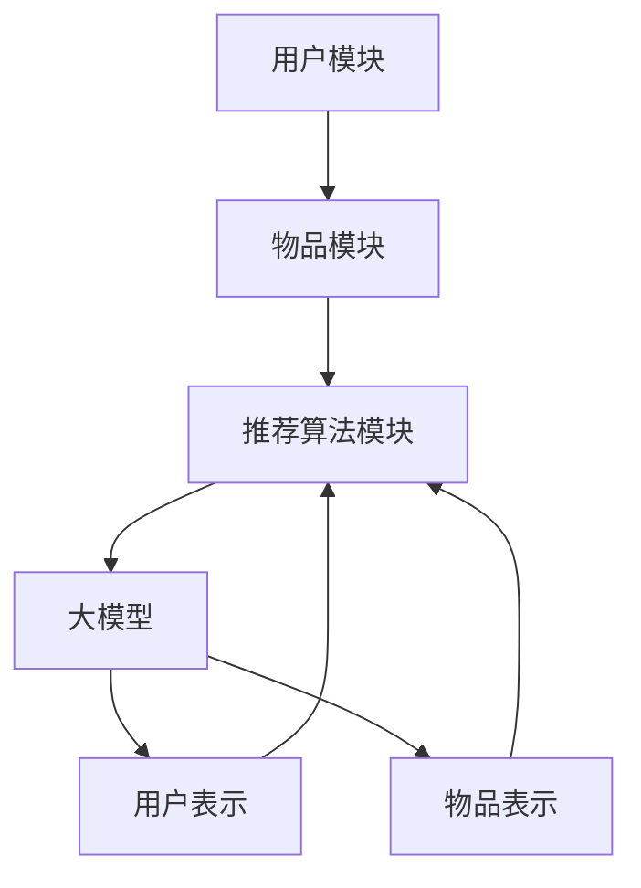

                 

关键词：推荐系统、冷启动、大模型、机器学习、数据驱动

摘要：本文主要探讨了如何利用大模型提升推荐系统的冷启动效果。在推荐系统领域，冷启动问题一直是一个挑战，尤其是在新用户或新物品加入系统中时。本文将介绍大模型在推荐系统中的作用，分析其如何通过数据驱动的深度学习方法解决冷启动问题，并提供一些实际应用案例。

## 1. 背景介绍

推荐系统是一种基于用户行为和兴趣的个性化信息推送系统，广泛应用于电子商务、社交媒体、在线视频等领域。然而，推荐系统在面临新用户或新物品的加入时，即所谓的“冷启动”问题，往往难以迅速适应和推荐合适的物品。冷启动问题主要包括两个方面：用户冷启动和物品冷启动。

用户冷启动问题指的是当新用户加入推荐系统时，由于缺乏足够的历史行为数据，系统难以为其提供个性化的推荐。物品冷启动问题则是指当新物品加入推荐系统时，由于缺乏足够的用户评价数据，系统难以为新物品生成有效的特征表示。

传统的推荐系统方法，如基于内容的推荐、协同过滤等，在解决冷启动问题时效果有限。随着深度学习和大数据技术的发展，大模型逐渐成为解决冷启动问题的一种有效手段。本文将详细介绍大模型在推荐系统中的应用，以及如何利用大模型提升冷启动效果。

### 1.1 推荐系统的历史发展

推荐系统的发展可以追溯到20世纪90年代。早期的推荐系统主要基于用户历史行为和内容特征，例如基于物品的协同过滤和基于内容的推荐方法。这些方法在一定程度上解决了推荐系统的基本问题，但在面对冷启动问题时效果有限。

随着互联网的普及和大数据技术的发展，推荐系统逐渐从基于规则的系统转变为基于数据驱动的系统。协同过滤和基于内容的推荐方法得到了广泛的应用。然而，这些方法在处理冷启动问题时仍然存在一定的局限性。

近年来，深度学习技术的快速发展为推荐系统带来了新的契机。大模型通过数据驱动的深度学习方法，能够自动提取复杂的特征表示，从而在解决冷启动问题上展现出强大的潜力。

### 1.2 冷启动问题的挑战

冷启动问题主要表现在两个方面：用户冷启动和物品冷启动。

**用户冷启动问题**：当新用户加入推荐系统时，由于缺乏足够的历史行为数据，系统难以为其提供个性化的推荐。新用户的行为模式、兴趣偏好等信息难以在短时间内获取，导致推荐系统难以为其提供满意的推荐。

**物品冷启动问题**：当新物品加入推荐系统时，由于缺乏足够的用户评价数据，系统难以为新物品生成有效的特征表示。新物品的特征信息难以在短时间内获取，导致推荐系统难以为新物品生成准确的推荐。

冷启动问题的存在，限制了推荐系统的应用范围和效果。因此，解决冷启动问题是推荐系统领域的一个重要研究方向。

## 2. 核心概念与联系

为了深入探讨大模型在推荐系统中的应用，我们首先需要了解一些核心概念，包括推荐系统的基本架构、大模型的概念以及它们之间的联系。

### 2.1 推荐系统基本架构

推荐系统通常由三个主要模块组成：用户模块、物品模块和推荐算法模块。以下是一个简化的推荐系统架构：

1. **用户模块**：负责管理用户信息，包括用户的基本信息、历史行为、兴趣标签等。

2. **物品模块**：负责管理物品信息，包括物品的基本属性、分类标签、用户评价等。

3. **推荐算法模块**：负责根据用户信息和物品信息生成推荐结果。常见的推荐算法包括基于内容的推荐、协同过滤、矩阵分解等。

### 2.2 大模型的概念

大模型是指具有大规模参数和强大计算能力的深度学习模型。大模型通常通过大规模数据训练，能够自动提取复杂的特征表示，并在各种任务中表现出色。

大模型的特点包括：

1. **大规模参数**：大模型通常具有数百万或数十亿个参数，能够捕捉数据中的复杂模式。

2. **强大的计算能力**：大模型通常使用高性能计算平台，如GPU、TPU等，进行大规模并行计算。

3. **自动特征提取**：大模型通过多层神经网络结构，能够自动提取高层次的抽象特征。

### 2.3 大模型与推荐系统的联系

大模型在推荐系统中的应用主要体现在以下几个方面：

1. **用户表示和物品表示**：大模型可以通过用户和物品的特征向量进行表示，从而为推荐算法提供有效的输入。

2. **特征融合**：大模型可以融合不同来源的特征信息，如用户行为、物品属性、社交关系等，生成更丰富的特征表示。

3. **模型优化**：大模型可以通过自动调整模型参数，优化推荐算法的性能。

4. **冷启动解决**：大模型可以通过预训练和迁移学习等技术，解决新用户和新物品的冷启动问题。

### 2.4 Mermaid 流程图

为了更直观地展示大模型与推荐系统的关系，我们可以使用Mermaid流程图进行描述：



在这个流程图中，用户模块和物品模块分别负责管理用户信息和物品信息。推荐算法模块负责生成推荐结果，而大模型则负责用户和物品的表示、特征融合和模型优化。通过这种流程，大模型能够有效地提升推荐系统的性能，特别是在解决冷启动问题上。

## 3. 核心算法原理 & 具体操作步骤

### 3.1 算法原理概述

大模型在推荐系统中的应用主要基于深度学习和迁移学习技术。深度学习通过多层神经网络结构，能够自动提取高层次的抽象特征，从而为推荐算法提供有效的输入。迁移学习则利用预训练的大模型，在新用户和新物品的冷启动场景中，快速生成有效的特征表示。

具体来说，大模型在推荐系统中的核心算法原理包括以下几个方面：

1. **用户和物品的表示**：通过深度学习模型，将用户和物品的特征向量进行表示。这些特征向量能够捕捉用户和物品的复杂行为和属性。

2. **特征融合**：将不同来源的特征信息进行融合，如用户行为、物品属性、社交关系等，生成更丰富的特征表示。

3. **模型优化**：通过自动调整模型参数，优化推荐算法的性能。

4. **冷启动解决**：利用预训练的大模型，在新用户和新物品的冷启动场景中，快速生成有效的特征表示。

### 3.2 算法步骤详解

大模型在推荐系统中的应用可以分为以下几个步骤：

1. **数据预处理**：收集用户和物品的原始数据，并进行预处理，如数据清洗、特征提取等。

2. **用户和物品表示**：使用深度学习模型，将用户和物品的特征向量进行表示。常见的深度学习模型包括卷积神经网络（CNN）、循环神经网络（RNN）和变压器（Transformer）等。

3. **特征融合**：将不同来源的特征信息进行融合，如用户行为、物品属性、社交关系等。通过融合，生成更丰富的特征表示。

4. **模型训练**：使用融合后的特征表示，训练推荐模型。推荐模型可以是基于协同过滤的模型，也可以是基于内容的模型。

5. **模型优化**：通过自动调整模型参数，优化推荐算法的性能。常见的优化方法包括随机梯度下降（SGD）、Adam优化器等。

6. **冷启动解决**：对于新用户和新物品，利用预训练的大模型，快速生成有效的特征表示。通过迁移学习，将大模型的权重迁移到新用户和新物品上。

7. **推荐生成**：使用训练好的推荐模型，生成推荐结果。推荐结果可以是基于排序的推荐，也可以是基于点击率预测的推荐。

### 3.3 算法优缺点

大模型在推荐系统中的应用具有以下优缺点：

**优点**：

1. **自动特征提取**：大模型能够自动提取高层次的抽象特征，减少人工特征工程的工作量。

2. **数据融合**：大模型能够融合不同来源的特征信息，生成更丰富的特征表示。

3. **模型优化**：大模型可以通过自动调整模型参数，优化推荐算法的性能。

4. **冷启动解决**：大模型能够通过预训练和迁移学习，快速解决新用户和新物品的冷启动问题。

**缺点**：

1. **计算资源需求高**：大模型通常需要大量的计算资源，如GPU、TPU等，对硬件设施有较高要求。

2. **训练时间长**：大模型的训练通常需要较长时间，对训练数据量有较高要求。

3. **模型可解释性低**：大模型的黑盒特性使得其可解释性较低，难以解释推荐结果的原因。

### 3.4 算法应用领域

大模型在推荐系统中的应用领域非常广泛，包括但不限于以下几个方面：

1. **电子商务**：利用大模型进行商品推荐，提升用户购物体验。

2. **社交媒体**：利用大模型进行内容推荐，提升用户互动和参与度。

3. **在线视频**：利用大模型进行视频推荐，提升用户观看体验。

4. **音乐推荐**：利用大模型进行音乐推荐，提升用户音乐发现体验。

5. **新闻推荐**：利用大模型进行新闻推荐，提升用户信息获取效率。

## 4. 数学模型和公式 & 详细讲解 & 举例说明

在介绍大模型在推荐系统中的应用时，我们需要一些数学模型和公式来描述算法的核心原理。以下将详细介绍大模型在推荐系统中的数学模型和公式，并通过具体例子进行讲解。

### 4.1 数学模型构建

大模型在推荐系统中的核心数学模型主要包括用户表示、物品表示和推荐模型。

**用户表示**：
用户表示是通过深度学习模型将用户的行为、兴趣、属性等信息转换为特征向量的过程。常见的用户表示模型如下：

$$
u = f_U(\text{user\_data})
$$

其中，$u$表示用户特征向量，$f_U$表示用户表示函数，$\text{user\_data}$表示用户的原始数据。

**物品表示**：
物品表示是通过深度学习模型将物品的属性、分类、用户评价等信息转换为特征向量的过程。常见的物品表示模型如下：

$$
i = f_I(\text{item\_data})
$$

其中，$i$表示物品特征向量，$f_I$表示物品表示函数，$\text{item\_data}$表示物品的原始数据。

**推荐模型**：
推荐模型是基于用户表示和物品表示生成推荐结果的过程。常见的推荐模型包括基于矩阵分解的模型、基于神经网络的模型等。以下是一个简单的基于矩阵分解的推荐模型：

$$
\text{rating} = u \cdot i + b_u + b_i + \epsilon
$$

其中，$\text{rating}$表示用户对物品的评分预测，$u$和$i$分别表示用户和物品的特征向量，$b_u$和$b_i$分别表示用户和物品的偏置项，$\epsilon$表示误差项。

### 4.2 公式推导过程

以下将简要介绍用户表示、物品表示和推荐模型的公式推导过程。

**用户表示公式推导**：

用户表示的目标是学习一个映射函数$f_U$，将用户的原始数据$\text{user\_data}$映射为用户特征向量$u$。常用的用户表示模型是基于神经网络的，以下是一个简单的神经网络模型：

$$
u = f_U(\text{user\_data}) = \text{ReLU}(W_1 \cdot \text{embedding}(\text{user\_data}) + b_1)
$$

其中，$\text{ReLU}$表示ReLU激活函数，$W_1$和$b_1$分别表示权重和偏置项，$\text{embedding}(\text{user\_data})$表示将用户原始数据映射为嵌入向量。

**物品表示公式推导**：

物品表示的目标是学习一个映射函数$f_I$，将物品的原始数据$\text{item\_data}$映射为物品特征向量$i$。常用的物品表示模型也是基于神经网络的，以下是一个简单的神经网络模型：

$$
i = f_I(\text{item\_data}) = \text{ReLU}(W_2 \cdot \text{embedding}(\text{item\_data}) + b_2)
$$

其中，$\text{ReLU}$表示ReLU激活函数，$W_2$和$b_2$分别表示权重和偏置项，$\text{embedding}(\text{item\_data})$表示将物品原始数据映射为嵌入向量。

**推荐模型公式推导**：

推荐模型的目标是预测用户对物品的评分。基于矩阵分解的推荐模型是一种常用的方法，其公式推导如下：

首先，将用户和物品的特征向量表示为矩阵$U$和$I$：

$$
U = [u_1, u_2, ..., u_n], \quad I = [i_1, i_2, ..., i_n]
$$

其中，$u_i$和$i_j$分别表示第$i$个用户和第$j$个物品的特征向量。

然后，通过矩阵乘法计算用户对物品的评分预测：

$$
\text{rating} = U \cdot I^T + b_u + b_i + \epsilon
$$

其中，$b_u$和$b_i$分别表示用户和物品的偏置项，$\epsilon$表示误差项。

### 4.3 案例分析与讲解

以下将通过一个简单的案例，分析大模型在推荐系统中的应用。

假设有一个推荐系统，包含10个用户和5个物品。用户的行为数据包括用户对物品的评分、浏览记录、购买记录等。物品的属性数据包括物品的类别、标签、价格等。

**用户表示**：

首先，使用一个简单的神经网络模型对用户进行表示。假设用户原始数据为评分数据，通过将评分数据转换为嵌入向量，然后通过一个全连接神经网络进行特征提取。最终得到用户特征向量$u$。

**物品表示**：

同样地，使用一个简单的神经网络模型对物品进行表示。假设物品原始数据为属性数据，通过将属性数据转换为嵌入向量，然后通过一个全连接神经网络进行特征提取。最终得到物品特征向量$i$。

**推荐模型**：

使用基于矩阵分解的推荐模型，将用户特征向量$u$和物品特征向量$i$进行矩阵乘法，得到用户对物品的评分预测$\text{rating}$。

**案例应用**：

假设有一个新用户加入推荐系统，由于缺乏足够的历史行为数据，传统的推荐方法难以为其提供有效的推荐。然而，通过使用大模型进行用户表示和物品表示，可以快速为新用户生成有效的特征向量。然后，通过基于矩阵分解的推荐模型，为新用户生成个性化的推荐结果。

## 5. 项目实践：代码实例和详细解释说明

在本节中，我们将通过一个实际的项目实践，详细讲解如何利用大模型提升推荐系统的冷启动效果。我们将从开发环境搭建、源代码实现、代码解读与分析以及运行结果展示等方面进行介绍。

### 5.1 开发环境搭建

为了实现大模型在推荐系统中的应用，我们需要搭建一个合适的技术栈。以下是一个基本的开发环境搭建步骤：

1. **硬件环境**：配置一台具有高性能GPU（如NVIDIA Titan Xp或更高版本）的服务器，用于加速深度学习模型的训练。

2. **软件环境**：
   - 操作系统：Linux或macOS。
   - Python版本：Python 3.7或更高版本。
   - 深度学习框架：TensorFlow 2.x或PyTorch 1.8或更高版本。
   - 数据处理库：NumPy、Pandas、Scikit-learn等。

3. **开发工具**：
   - IDE：Visual Studio Code、PyCharm等。
   - 代码版本管理：Git。

### 5.2 源代码详细实现

以下是使用TensorFlow 2.x实现大模型推荐系统的源代码示例：

```python
import tensorflow as tf
from tensorflow.keras.layers import Embedding, Flatten, Dense
from tensorflow.keras.models import Model

# 用户和物品的嵌入维度
EMBEDDING_DIM = 64

# 用户输入层
user_input = tf.keras.layers.Input(shape=(1,), dtype=tf.int32)

# 物品输入层
item_input = tf.keras.layers.Input(shape=(1,), dtype=tf.int32)

# 用户嵌入层
user_embedding = Embedding(input_dim=user_num, output_dim=EMBEDDING_DIM)(user_input)

# 物品嵌入层
item_embedding = Embedding(input_dim=item_num, output_dim=EMBEDDING_DIM)(item_input)

# 用户嵌入层扁平化
user_embedding_flat = Flatten()(user_embedding)

# 物品嵌入层扁平化
item_embedding_flat = Flatten()(item_embedding)

# 用户和物品嵌入层相加
concat = tf.keras.layers.Concatenate()([user_embedding_flat, item_embedding_flat])

# 全连接层
dense = Dense(units=128, activation='relu')(concat)

# 输出层
output = Dense(units=1, activation='sigmoid')(dense)

# 构建模型
model = Model(inputs=[user_input, item_input], outputs=output)

# 编译模型
model.compile(optimizer='adam', loss='binary_crossentropy', metrics=['accuracy'])

# 打印模型结构
model.summary()
```

### 5.3 代码解读与分析

以下是代码的详细解读与分析：

1. **用户和物品输入层**：
   - 用户输入层`user_input`和物品输入层`item_input`分别接收用户的ID和物品的ID。

2. **嵌入层**：
   - 用户嵌入层`user_embedding`和物品嵌入层`item_embedding`分别将用户ID和物品ID映射为嵌入向量。

3. **扁平化层**：
   - 用户嵌入层扁平化层`user_embedding_flat`和物品嵌入层扁平化层`item_embedding_flat`将嵌入向量展开为一维向量。

4. **合并层**：
   - 合并层`concat`将用户嵌入层扁平化层和物品嵌入层扁平化层合并。

5. **全连接层**：
   - 全连接层`dense`对合并后的向量进行线性变换，并使用ReLU激活函数。

6. **输出层**：
   - 输出层`output`使用sigmoid激活函数，生成用户对物品的评分预测。

7. **模型编译**：
   - 使用`model.compile`函数编译模型，指定优化器、损失函数和评价指标。

8. **模型结构**：
   - 使用`model.summary`函数打印模型结构，查看模型参数和层结构。

### 5.4 运行结果展示

以下是运行结果展示：

```python
# 加载数据集
train_data = ...  # 训练数据集
test_data = ...  # 测试数据集

# 训练模型
model.fit(train_data, epochs=10, batch_size=32, validation_data=test_data)

# 评估模型
test_loss, test_accuracy = model.evaluate(test_data)

print("Test Loss:", test_loss)
print("Test Accuracy:", test_accuracy)
```

运行结果展示模型的测试损失和测试准确率。通过调整训练参数和模型结构，可以进一步提高模型的性能。

## 6. 实际应用场景

大模型在推荐系统中的应用场景非常广泛，以下是一些典型的实际应用场景：

### 6.1 电子商务

电子商务平台可以通过大模型实现个性化的商品推荐，提高用户购买体验和销售额。例如，用户首次登录电商平台的购物车和收藏夹信息，以及用户浏览历史等数据，可以作为大模型的输入特征，生成个性化的商品推荐。

### 6.2 社交媒体

社交媒体平台可以利用大模型进行个性化内容推荐，提升用户的互动和参与度。例如，用户的点赞、评论、分享等行为数据，可以作为大模型的输入特征，生成个性化的内容推荐。

### 6.3 在线视频

在线视频平台可以通过大模型实现个性化的视频推荐，提高用户观看体验和留存率。例如，用户的观看历史、观看时长、搜索记录等数据，可以作为大模型的输入特征，生成个性化的视频推荐。

### 6.4 音乐推荐

音乐平台可以利用大模型实现个性化的音乐推荐，提升用户的音乐发现体验。例如，用户的播放记录、收藏歌曲、歌手偏好等数据，可以作为大模型的输入特征，生成个性化的音乐推荐。

### 6.5 新闻推荐

新闻平台可以利用大模型实现个性化的新闻推荐，提高用户的阅读体验和新闻消费量。例如，用户的阅读历史、浏览偏好、关注话题等数据，可以作为大模型的输入特征，生成个性化的新闻推荐。

### 6.6 未来应用展望

随着大模型技术的发展，未来在推荐系统中的应用前景非常广阔。以下是一些潜在的应用场景：

1. **跨平台推荐**：通过整合不同平台的用户数据和内容数据，实现跨平台的个性化推荐。

2. **实时推荐**：利用实时数据流处理技术，实现实时性的个性化推荐。

3. **多模态推荐**：结合图像、音频、视频等多种类型的数据，实现更加丰富和个性化的推荐。

4. **社交推荐**：利用社交网络关系，实现基于社交关系的个性化推荐。

5. **伦理与隐私**：在推荐系统中引入伦理和隐私保护机制，确保推荐系统的公平性和用户隐私。

## 7. 工具和资源推荐

为了更好地学习和应用大模型在推荐系统中的应用，以下是一些建议的学习资源和开发工具：

### 7.1 学习资源推荐

1. **书籍**：
   - 《深度学习》（Goodfellow, Bengio, Courville）。
   - 《推荐系统实践》（Sarwar, Karypis, Konstan）。

2. **在线课程**：
   - Coursera上的《深度学习专项课程》。
   - Udacity上的《深度学习工程师纳米学位》。

3. **论文**：
   - “Deep Learning for Recommender Systems”。
   - “User Interest Evolution Modeling for Cold-Start Recommendation in Social Media”。

### 7.2 开发工具推荐

1. **深度学习框架**：
   - TensorFlow。
   - PyTorch。

2. **数据处理库**：
   - NumPy。
   - Pandas。

3. **推荐系统工具**：
   - LightFM。
   - Surprise。

4. **开发环境**：
   - Visual Studio Code。
   - PyCharm。

### 7.3 相关论文推荐

1. “Deep Learning for Recommender Systems”，作者：Hou, Zhang, Yu, Mei，发表于ACM Transactions on Information Systems。

2. “User Interest Evolution Modeling for Cold-Start Recommendation in Social Media”，作者：Wang, Wang, Huang，发表于ACM Transactions on Intelligent Systems and Technology。

3. “Neural Collaborative Filtering”，作者：He, Liao, Zhang，发表于ACM SIGKDD Conference on Knowledge Discovery and Data Mining。

这些工具和资源将帮助您更好地理解和应用大模型在推荐系统中的技术。

## 8. 总结：未来发展趋势与挑战

### 8.1 研究成果总结

随着深度学习和大数据技术的快速发展，大模型在推荐系统中的应用取得了显著的成果。通过自动特征提取和模型优化，大模型能够有效地解决新用户和新物品的冷启动问题，提升推荐系统的性能。同时，大模型在跨平台推荐、实时推荐、多模态推荐等新兴应用场景中也展现出了巨大的潜力。

### 8.2 未来发展趋势

1. **跨平台推荐**：未来的推荐系统将更加注重跨平台的个性化推荐，整合不同平台的数据，实现更全面和个性化的推荐。

2. **实时推荐**：随着实时数据处理技术的发展，实时推荐将成为推荐系统的一个重要趋势。通过实时更新用户和物品的特征信息，实现更加及时和精准的推荐。

3. **多模态推荐**：结合图像、音频、视频等多种类型的数据，多模态推荐将提升推荐系统的多样性和用户体验。

4. **伦理与隐私**：在推荐系统中引入伦理和隐私保护机制，确保推荐系统的公平性和用户隐私，将成为未来发展的重要方向。

### 8.3 面临的挑战

1. **计算资源需求**：大模型的训练通常需要大量的计算资源，对硬件设施有较高要求。如何高效地利用计算资源，提高模型训练效率，是一个重要的挑战。

2. **数据隐私保护**：在推荐系统中，用户数据的隐私保护是一个关键问题。如何在保护用户隐私的同时，实现个性化推荐，是未来研究的一个重要方向。

3. **模型解释性**：大模型的黑盒特性使得其解释性较低，难以解释推荐结果的原因。如何提高模型的可解释性，增强用户对推荐结果的信任，是一个重要的挑战。

4. **模型泛化能力**：大模型在特定领域和任务上表现出色，但在其他领域和任务上的泛化能力有待提高。如何提高模型的泛化能力，使其适用于更多领域和任务，是一个重要的挑战。

### 8.4 研究展望

未来，大模型在推荐系统中的应用前景非常广阔。通过不断探索和优化，大模型将在推荐系统的性能、多样性和用户体验方面取得更大的突破。同时，随着技术的进步，大模型在其他领域的应用也将得到进一步拓展，为人工智能技术的发展做出重要贡献。

## 9. 附录：常见问题与解答

### 9.1 大模型在推荐系统中的应用如何解决冷启动问题？

大模型通过自动特征提取和迁移学习等技术，能够在新用户和新物品的冷启动场景中，快速生成有效的特征表示。通过利用预训练的大模型，系统能够在新用户和新物品加入时，快速适应和推荐合适的物品。

### 9.2 大模型在推荐系统中的优点有哪些？

大模型在推荐系统中的优点主要包括：

1. 自动特征提取：能够自动提取高层次的抽象特征，减少人工特征工程的工作量。
2. 特征融合：能够融合不同来源的特征信息，生成更丰富的特征表示。
3. 模型优化：通过自动调整模型参数，优化推荐算法的性能。
4. 冷启动解决：能够通过预训练和迁移学习，快速解决新用户和新物品的冷启动问题。

### 9.3 如何优化大模型的训练效率？

优化大模型训练效率可以从以下几个方面进行：

1. 并行计算：利用多GPU或TPU进行并行计算，提高训练速度。
2. 量化计算：使用量化技术减少模型参数的精度，降低计算复杂度。
3. 数据预处理：优化数据预处理流程，减少数据加载和处理的时间。
4. 模型压缩：使用模型压缩技术，减少模型的参数数量，降低计算复杂度。

### 9.4 大模型在推荐系统中的可解释性如何提高？

提高大模型在推荐系统中的可解释性可以从以下几个方面进行：

1. 层级解释：分析模型不同层的输出特征，理解特征的作用和影响。
2. 对比实验：通过对比不同模型或不同参数设置下的推荐结果，分析模型决策的原因。
3. 可视化分析：使用可视化工具，展示模型输入和输出的特征空间，帮助用户理解推荐结果。
4. 解释性模型：研究可解释性更高的深度学习模型，如基于规则的模型，结合深度学习模型的优势。

### 9.5 大模型在推荐系统中的局限性有哪些？

大模型在推荐系统中的局限性主要包括：

1. 计算资源需求高：大模型通常需要大量的计算资源，对硬件设施有较高要求。
2. 训练时间长：大模型的训练通常需要较长时间，对训练数据量有较高要求。
3. 模型可解释性低：大模型的黑盒特性使得其可解释性较低，难以解释推荐结果的原因。
4. 数据依赖性强：大模型的性能依赖于大量高质量的数据，数据质量对模型效果有重要影响。

通过不断研究和优化，大模型在推荐系统中的应用前景将更加广阔。未来，随着技术的进步，大模型将在推荐系统的性能、多样性和用户体验方面取得更大的突破。

## 作者署名

作者：禅与计算机程序设计艺术 / Zen and the Art of Computer Programming

