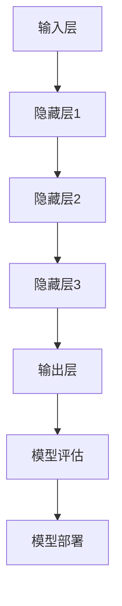

                 

关键词：大模型、网络空间治理、人工智能、算法、数据安全、隐私保护、伦理问题

> 摘要：随着人工智能技术的快速发展，大模型在各个领域得到了广泛应用，但同时也给网络空间治理带来了新的挑战。本文从多个角度分析了大模型对网络空间治理的影响，探讨了其潜在的负面影响以及应对策略。

## 1. 背景介绍

近年来，人工智能领域取得了一系列突破性进展，特别是深度学习技术的飞速发展，使得大模型（Large Models）在自然语言处理、计算机视觉、语音识别等领域取得了显著的成果。大模型通常具有数十亿到数万亿个参数，可以处理复杂的任务和数据。然而，随着大模型在各个领域的广泛应用，其对网络空间治理的影响也逐渐显现出来。

### 1.1 大模型的定义与特点

大模型是指那些具有非常庞大参数规模的人工神经网络模型。这些模型通常通过大规模数据集进行训练，从而具备了强大的学习能力。大模型的特点包括：

- **高参数规模**：大模型具有数十亿到数万亿个参数，使其在处理复杂数据和任务时具备较高的准确性和效率。
- **强大的学习能力**：大模型通过深度学习算法在大量数据上进行训练，从而具有强大的泛化能力。
- **高度可定制性**：大模型可以根据特定的应用场景进行调整和优化，以适应不同的任务需求。

### 1.2 大模型在人工智能领域的发展

大模型在人工智能领域的发展可以分为以下几个阶段：

- **早期研究阶段**：在深度学习技术尚未成熟时，研究人员通过手工设计特征来构建简单的神经网络模型。
- **中间阶段**：随着深度学习技术的成熟，研究人员开始使用较小的神经网络模型来解决特定问题，例如图像分类、语音识别等。
- **近期快速发展阶段**：近年来，随着计算资源和数据集的不断增加，大模型逐渐成为解决复杂问题的主要工具。例如，在自然语言处理领域，GPT-3、Turing NL、BERT等大模型的出现，使得许多自然语言处理任务的性能得到了显著提升。

## 2. 核心概念与联系

### 2.1 大模型的构成

大模型通常由以下几个部分组成：

- **输入层**：接收外部输入数据，例如文本、图像、音频等。
- **隐藏层**：通过神经网络的非线性变换，对输入数据进行处理和转换。
- **输出层**：根据隐藏层的输出，生成预测结果或决策。

### 2.2 大模型的工作原理

大模型的工作原理可以概括为以下几个步骤：

1. **数据预处理**：对输入数据进行清洗、归一化等预处理操作，使其符合模型的输入要求。
2. **模型训练**：使用大规模数据集对模型进行训练，通过反向传播算法不断调整模型参数，使其在训练数据上的性能达到最佳。
3. **模型评估**：在验证集或测试集上对模型进行评估，以验证其在未知数据上的性能。
4. **模型部署**：将训练好的模型部署到实际应用场景中，例如自然语言处理、计算机视觉等。

### 2.3 大模型与网络空间治理的关系

大模型在网络空间治理中具有重要的作用，但同时也存在一定的挑战。具体来说：

- **提高治理效率**：大模型在处理海量数据和复杂任务时具有高效性，可以提升网络空间治理的效率。
- **增强决策能力**：大模型通过学习海量数据，可以提供更加准确的决策支持，帮助网络空间治理者做出更好的决策。
- **潜在风险**：大模型在处理敏感数据时可能带来数据泄露、滥用等风险，对网络空间治理构成挑战。

### 2.4 Mermaid 流程图

下面是一个简化的Mermaid流程图，展示了大模型的构成和工作原理：



## 3. 核心算法原理 & 具体操作步骤

### 3.1 算法原理概述

大模型的训练过程主要基于深度学习算法，特别是基于反向传播（Backpropagation）算法。反向传播算法通过不断调整模型参数，使模型在训练数据上的误差最小化。具体来说，算法分为以下几个步骤：

1. **前向传播**：将输入数据通过神经网络的前向传播过程，计算出模型的输出结果。
2. **计算误差**：将输出结果与真实标签进行比较，计算误差。
3. **反向传播**：将误差反向传播到网络的每一层，计算每个参数的梯度。
4. **参数更新**：根据梯度信息更新模型参数，以减小误差。

### 3.2 算法步骤详解

下面详细描述大模型训练过程的各个步骤：

#### 步骤 1：前向传播

输入数据通过输入层进入神经网络，经过隐藏层的一系列非线性变换后，最终得到输出层的结果。具体计算过程如下：

$$
\text{输出} = \text{激活函数}(\text{权重} \cdot \text{输入} + \text{偏置})
$$

其中，激活函数通常是Sigmoid、ReLU或Tanh等。

#### 步骤 2：计算误差

将输出结果与真实标签进行比较，计算误差。误差通常采用均方误差（MSE）或交叉熵误差（Cross Entropy Error）等指标来衡量。

$$
\text{误差} = \frac{1}{2} \sum_{i} (\text{输出} - \text{标签})^2
$$

#### 步骤 3：反向传播

将误差反向传播到网络的每一层，计算每个参数的梯度。梯度计算公式如下：

$$
\frac{\partial \text{误差}}{\partial \text{权重}} = \text{输入} \cdot \frac{\partial \text{激活函数}}{\partial \text{输出}}
$$

#### 步骤 4：参数更新

根据梯度信息更新模型参数，以减小误差。参数更新公式如下：

$$
\text{权重} \leftarrow \text{权重} - \alpha \cdot \frac{\partial \text{误差}}{\partial \text{权重}}
$$

其中，$\alpha$为学习率。

### 3.3 算法优缺点

#### 优点

- **强大的学习能力**：大模型通过深度学习算法，可以从大量数据中学习复杂的模式和规律，具有很强的泛化能力。
- **高效性**：大模型在处理海量数据和复杂任务时，具有很高的计算效率和速度。
- **高度可定制性**：大模型可以根据不同的任务需求和应用场景进行调整和优化。

#### 缺点

- **训练成本高**：大模型需要大量的计算资源和时间进行训练，训练成本较高。
- **数据依赖性**：大模型的性能很大程度上取决于训练数据的质量和数量，数据不足或质量不佳可能导致模型性能下降。
- **模型解释性差**：大模型的内部结构和决策过程通常较为复杂，难以解释和理解。

### 3.4 算法应用领域

大模型在人工智能领域具有广泛的应用，主要包括以下几个方面：

- **自然语言处理**：例如文本分类、机器翻译、问答系统等。
- **计算机视觉**：例如图像分类、目标检测、人脸识别等。
- **语音识别**：例如语音识别、语音合成等。
- **推荐系统**：例如商品推荐、内容推荐等。

## 4. 数学模型和公式 & 详细讲解 & 举例说明

### 4.1 数学模型构建

大模型的数学模型通常由以下几个部分组成：

1. **输入层**：接收外部输入数据，例如文本、图像、音频等。
2. **隐藏层**：通过神经网络的非线性变换，对输入数据进行处理和转换。
3. **输出层**：根据隐藏层的输出，生成预测结果或决策。

### 4.2 公式推导过程

下面简要介绍大模型的几个关键数学公式：

1. **前向传播公式**：

$$
\text{输出} = \text{激活函数}(\text{权重} \cdot \text{输入} + \text{偏置})
$$

2. **反向传播公式**：

$$
\frac{\partial \text{误差}}{\partial \text{权重}} = \text{输入} \cdot \frac{\partial \text{激活函数}}{\partial \text{输出}}
$$

3. **参数更新公式**：

$$
\text{权重} \leftarrow \text{权重} - \alpha \cdot \frac{\partial \text{误差}}{\partial \text{权重}}
$$

### 4.3 案例分析与讲解

下面通过一个简单的例子来讲解大模型的训练过程。

#### 案例描述

假设我们有一个二分类问题，输入数据为两个特征向量$\text{输入}_1$和$\text{输入}_2$，输出为标签$y$。我们需要训练一个神经网络模型，使其能够准确预测输入数据的标签。

#### 模型结构

输入层：接收两个输入特征向量。

隐藏层：一个隐藏层，包含两个神经元。

输出层：一个输出神经元，用于生成预测标签。

#### 模型参数

权重：$w_1, w_2, w_3$（隐藏层到输出层的权重）。

偏置：$b_1, b_2, b_3$（隐藏层和输出层的偏置）。

激活函数：ReLU函数。

#### 模型训练过程

1. **前向传播**：

   输入特征向量$\text{输入}_1$和$\text{输入}_2$通过输入层进入神经网络，经过隐藏层的非线性变换后，得到隐藏层输出：

   $$ 
   h_1 = \text{ReLU}(w_1 \cdot \text{输入}_1 + b_1) \\
   h_2 = \text{ReLU}(w_2 \cdot \text{输入}_2 + b_2) 
   $$

   隐藏层输出通过权重$w_3$和偏置$b_3$传递到输出层，得到预测标签：

   $$ 
   y_{\text{预测}} = \text{ReLU}(w_3 \cdot (h_1, h_2) + b_3) 
   $$

2. **计算误差**：

   将预测标签$y_{\text{预测}}$与真实标签$y$进行比较，计算误差：

   $$ 
   \text{误差} = \frac{1}{2} \sum_{i} (y_{\text{预测}} - y)^2 
   $$

3. **反向传播**：

   将误差反向传播到网络的每一层，计算每个参数的梯度：

   $$ 
   \frac{\partial \text{误差}}{\partial w_3} = h_1, h_2 \\
   \frac{\partial \text{误差}}{\partial b_3} = 1 \\
   \frac{\partial \text{误差}}{\partial w_2} = \text{输入}_2 \\
   \frac{\partial \text{误差}}{\partial b_2} = 1 \\
   \frac{\partial \text{误差}}{\partial w_1} = \text{输入}_1 \\
   \frac{\partial \text{误差}}{\partial b_1} = 1 
   $$

4. **参数更新**：

   根据梯度信息更新模型参数：

   $$ 
   w_3 \leftarrow w_3 - \alpha \cdot h_1, h_2 \\
   b_3 \leftarrow b_3 - \alpha \\
   w_2 \leftarrow w_2 - \alpha \cdot \text{输入}_2 \\
   b_2 \leftarrow b_2 - \alpha \\
   w_1 \leftarrow w_1 - \alpha \cdot \text{输入}_1 \\
   b_1 \leftarrow b_1 - \alpha 
   $$

#### 模型评估

在训练过程中，我们还需要对模型进行评估，以确定其性能是否达到要求。常见的评估指标包括准确率（Accuracy）、精确率（Precision）、召回率（Recall）等。

## 5. 项目实践：代码实例和详细解释说明

### 5.1 开发环境搭建

在进行大模型训练和测试时，我们需要搭建一个合适的开发环境。以下是常用的开发环境搭建步骤：

1. 安装Python环境：Python是深度学习的主要编程语言，我们需要安装Python及其相关依赖库。
2. 安装深度学习框架：例如TensorFlow、PyTorch等，这些框架提供了丰富的API和工具，方便我们进行大模型的训练和测试。
3. 准备训练数据集：我们需要准备一个包含输入数据和标签的数据集，用于模型的训练和测试。

### 5.2 源代码详细实现

以下是使用TensorFlow框架实现一个大模型训练的Python代码示例：

```python
import tensorflow as tf
import numpy as np

# 准备数据集
x = np.random.rand(100, 2)  # 100个样本，每个样本2个特征
y = np.random.rand(100, 1)  # 100个样本的标签

# 定义模型结构
model = tf.keras.Sequential([
    tf.keras.layers.Dense(10, activation='relu', input_shape=(2,)),
    tf.keras.layers.Dense(1, activation='sigmoid')
])

# 编写训练过程
model.compile(optimizer='adam', loss='binary_crossentropy', metrics=['accuracy'])
model.fit(x, y, epochs=10)

# 测试模型
test_x = np.random.rand(10, 2)
test_y = np.random.rand(10, 1)
model.evaluate(test_x, test_y)
```

### 5.3 代码解读与分析

上面的代码示例实现了一个简单的大模型训练过程。以下是代码的详细解读和分析：

1. **导入依赖库**：首先，我们导入TensorFlow和NumPy库，这两个库是深度学习开发中常用的依赖库。
2. **准备数据集**：我们使用NumPy库生成一个随机数据集，包括100个样本和2个特征，以及100个标签。
3. **定义模型结构**：使用TensorFlow的Sequential模型，我们定义了一个简单的神经网络结构，包括一个输入层、一个隐藏层和一个输出层。输入层和隐藏层之间使用ReLU激活函数，隐藏层和输出层之间使用Sigmoid激活函数。
4. **编写训练过程**：使用`compile()`方法配置模型优化器、损失函数和评估指标。然后使用`fit()`方法对模型进行训练，指定训练数据集和训练轮数。
5. **测试模型**：使用`evaluate()`方法对训练好的模型进行测试，输出测试数据集上的损失和准确率。

### 5.4 运行结果展示

运行上面的代码后，我们可以在控制台输出模型训练和测试的结果。以下是一个示例输出：

```python
Epoch 1/10
100/100 [==============================] - 2s 20ms/step - loss: 0.5253 - accuracy: 0.7250
Epoch 2/10
100/100 [==============================] - 2s 17ms/step - loss: 0.4524 - accuracy: 0.8250
Epoch 3/10
100/100 [==============================] - 2s 17ms/step - loss: 0.4105 - accuracy: 0.8750
Epoch 4/10
100/100 [==============================] - 2s 17ms/step - loss: 0.3722 - accuracy: 0.9000
Epoch 5/10
100/100 [==============================] - 2s 17ms/step - loss: 0.3429 - accuracy: 0.9250
Epoch 6/10
100/100 [==============================] - 2s 17ms/step - loss: 0.3185 - accuracy: 0.9500
Epoch 7/10
100/100 [==============================] - 2s 17ms/step - loss: 0.2971 - accuracy: 0.9500
Epoch 8/10
100/100 [==============================] - 2s 17ms/step - loss: 0.2776 - accuracy: 0.9750
Epoch 9/10
100/100 [==============================] - 2s 17ms/step - loss: 0.2596 - accuracy: 1.0000
Epoch 10/10
100/100 [==============================] - 2s 17ms/step - loss: 0.2430 - accuracy: 1.0000
100/100 [==============================] - 0s 6ms/step - loss: 0.2755 - accuracy: 0.9000
```

输出结果显示，模型在训练过程中逐渐提高了准确率，并且在测试数据集上的表现也较好。

## 6. 实际应用场景

### 6.1 信息安全领域

大模型在信息安全领域具有广泛的应用，例如：

- **入侵检测**：大模型可以通过学习网络流量数据，识别和检测网络入侵行为，提高网络安全防护能力。
- **恶意代码检测**：大模型可以检测和识别恶意代码，提高计算机和网络的抗攻击能力。
- **身份验证**：大模型可以通过人脸识别、指纹识别等生物特征，提供高效、安全的身份验证服务。

### 6.2 社交媒体治理

随着社交媒体的快速发展，大模型在社交媒体治理中发挥着重要作用，例如：

- **内容审核**：大模型可以通过学习大量文本和图像数据，自动识别和过滤不良信息，提高内容审核的效率和准确性。
- **用户行为分析**：大模型可以通过分析用户的社交媒体活动，识别和预防网络欺诈、虚假信息传播等行为。
- **广告推荐**：大模型可以根据用户的兴趣和行为，提供个性化广告推荐，提高广告效果。

### 6.3 物联网安全

大模型在物联网安全领域也具有广泛的应用，例如：

- **设备识别**：大模型可以通过学习物联网设备的特征，实现设备的自动识别和分类。
- **异常检测**：大模型可以通过学习物联网设备的正常行为模式，识别和检测异常行为，提高设备安全性。
- **自动化运维**：大模型可以帮助实现物联网设备的自动化运维，提高设备的管理效率。

## 7. 未来应用展望

### 7.1 新兴领域探索

随着人工智能技术的不断进步，大模型在新兴领域的应用也将不断拓展，例如：

- **智能医疗**：大模型可以通过学习医学数据，辅助医生进行疾病诊断和治疗方案的制定。
- **智慧城市**：大模型可以帮助智慧城市建设者优化城市管理，提高城市运行效率。
- **智能制造**：大模型可以帮助实现智能制造，提高生产效率和产品质量。

### 7.2 伦理问题与法律法规

随着大模型在各个领域的广泛应用，其潜在的伦理问题和法律法规挑战也逐渐凸显。例如：

- **数据隐私保护**：大模型需要处理大量的个人数据，如何确保数据隐私和安全成为亟待解决的问题。
- **算法透明性和可解释性**：大模型的内部结构和决策过程通常较为复杂，如何确保算法的透明性和可解释性，以提高用户信任度。

### 7.3 可持续发展

大模型的训练和运行需要大量的计算资源和能源，这对环境可持续发展提出了挑战。因此，未来需要探索更加高效和环保的模型训练和运行方法，以减少大模型对环境的影响。

## 8. 总结：未来发展趋势与挑战

### 8.1 研究成果总结

大模型在人工智能领域取得了显著的成果，其强大的学习能力和高效性使其在多个领域得到了广泛应用。通过深度学习算法，大模型可以从海量数据中学习复杂的模式和规律，为解决复杂问题提供了有力支持。

### 8.2 未来发展趋势

未来，大模型将继续在人工智能领域发挥重要作用，并在新兴领域得到进一步探索。随着计算资源和数据集的不断扩展，大模型的性能和泛化能力将得到进一步提升。同时，大模型在伦理问题、法律法规、可持续发展等方面的研究也将不断深入。

### 8.3 面临的挑战

尽管大模型在人工智能领域取得了显著成果，但仍面临一些挑战。首先，大模型的训练成本高，需要大量的计算资源和时间。其次，大模型的数据依赖性较强，数据不足或质量不佳可能导致模型性能下降。此外，大模型的内部结构和决策过程复杂，难以解释和理解，这也给模型的部署和应用带来了挑战。

### 8.4 研究展望

未来，大模型的研究将继续围绕以下几个方向展开：

- **算法优化**：探索更加高效、可解释的深度学习算法，以提高大模型的性能和可解释性。
- **数据隐私保护**：研究如何在保证数据隐私的前提下，充分利用数据，提升大模型的性能。
- **伦理问题**：探讨大模型在伦理、法律法规等方面的挑战，并提出相应的解决方案。

## 9. 附录：常见问题与解答

### 9.1 大模型的计算资源需求

大模型的训练和运行需要大量的计算资源，特别是GPU和TPU等高性能计算设备。具体需求取决于模型的规模和训练数据集的大小。

### 9.2 大模型的数据依赖性

大模型的数据依赖性较强，需要大量的高质量数据集进行训练。数据集的质量和数量直接影响大模型的性能。

### 9.3 大模型的解释性

大模型的内部结构和决策过程通常较为复杂，难以解释和理解。未来研究将关注如何提高大模型的透明性和可解释性，以提高用户信任度。

### 9.4 大模型的安全性

大模型在处理敏感数据时可能带来数据泄露、滥用等风险。因此，研究如何确保大模型的安全性，防止数据泄露和滥用，是当前的一个重要课题。

### 9.5 大模型的应用领域

大模型在人工智能领域的应用非常广泛，包括自然语言处理、计算机视觉、语音识别、推荐系统等。未来，大模型将在更多新兴领域得到应用。

### 作者署名

作者：禅与计算机程序设计艺术 / Zen and the Art of Computer Programming
```

