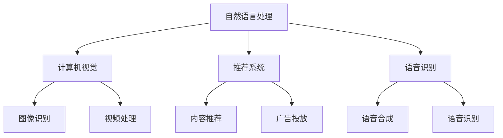

                 

关键词：大模型、创业、盈利模式、案例分析、算法、应用场景、未来展望

> 摘要：本文将深入探讨大模型应用创业的盈利模式，通过分析多个成功案例，梳理出大模型在不同领域中的应用及其盈利方式，并探讨未来的发展趋势和面临的挑战。本文旨在为创业者提供有价值的参考，帮助他们在大模型领域中找到可行的商业路径。

## 1. 背景介绍

随着人工智能技术的飞速发展，大模型成为了一个热门领域。大模型，通常指的是具有数十亿到数万亿参数的深度学习模型，如GPT、BERT、ViT等。这些模型在自然语言处理、计算机视觉、推荐系统等多个领域取得了显著的成果。同时，大模型的商业潜力也逐渐被市场所认可，许多创业者纷纷投身于大模型应用创业的浪潮中。

然而，大模型应用创业面临着诸多挑战，如高昂的计算成本、数据隐私保护、模型优化等。因此，如何找到有效的盈利模式成为了大模型应用创业的关键问题。本文将围绕这一主题进行深入探讨。

## 2. 核心概念与联系

### 2.1 大模型的定义

大模型，通常指的是具有数十亿到数万亿参数的深度学习模型，它们通过大量的数据进行训练，能够实现对复杂任务的高效处理。

### 2.2 大模型的应用领域

大模型在多个领域展现出了强大的应用潜力，包括自然语言处理、计算机视觉、推荐系统、语音识别等。以下是一个简单的Mermaid流程图，展示大模型的应用领域及其联系：



### 2.3 大模型的盈利模式

大模型的盈利模式主要包括以下几种：

1. **产品销售**：开发大模型驱动的产品，如智能客服、智能翻译等，通过销售产品获得收入。
2. **服务提供**：为企业提供大模型定制服务，如模型训练、模型优化等。
3. **数据服务**：提供高质量的数据集，供其他企业进行模型训练。
4. **技术支持**：提供大模型相关的技术支持，如模型部署、运维等。

## 3. 核心算法原理 & 具体操作步骤

### 3.1 算法原理概述

大模型的算法原理主要基于深度学习，特别是神经网络。深度学习通过多层的神经网络结构，对输入数据进行特征提取和变换，从而实现对复杂任务的学习和预测。

### 3.2 算法步骤详解

1. **数据预处理**：对输入数据进行清洗、归一化等处理，使其符合模型的输入要求。
2. **模型训练**：使用大量的训练数据，通过反向传播算法更新模型参数，直到模型达到一定的训练效果。
3. **模型评估**：使用测试数据对模型进行评估，确保模型具有良好的泛化能力。
4. **模型部署**：将训练好的模型部署到生产环境中，进行实际应用。

### 3.3 算法优缺点

**优点**：

- **强大的数据处理能力**：大模型能够处理大规模、复杂的数据，实现对任务的准确预测。
- **高度自动化**：大模型训练和优化过程高度自动化，节省了大量人力成本。

**缺点**：

- **计算资源需求高**：大模型训练需要大量的计算资源，特别是GPU等高性能硬件。
- **数据隐私问题**：大模型训练过程中需要使用大量的数据，涉及到数据隐私保护问题。

### 3.4 算法应用领域

大模型在以下领域展现了强大的应用潜力：

- **自然语言处理**：如文本分类、情感分析、机器翻译等。
- **计算机视觉**：如图像识别、目标检测、图像生成等。
- **推荐系统**：如个性化推荐、广告投放等。
- **语音识别**：如语音合成、语音识别等。

## 4. 数学模型和公式 & 详细讲解 & 举例说明

### 4.1 数学模型构建

大模型的核心是神经网络，其基本结构如下：

\[ 
f(x) = \sigma(W_1 \cdot x + b_1) 
\]

其中，\( f(x) \) 是神经网络的输出，\( x \) 是输入数据，\( W_1 \) 和 \( b_1 \) 分别是权重和偏置。

### 4.2 公式推导过程

神经网络的训练过程实际上是一个优化问题，目标是找到最佳的权重和偏置，使得模型的输出与真实值之间的误差最小。这个优化问题可以通过梯度下降法求解。

### 4.3 案例分析与讲解

假设我们有一个文本分类任务，需要使用大模型对文本进行分类。首先，我们需要对文本进行预处理，将其转换为模型可接受的格式。然后，我们使用大量的文本数据进行模型训练，通过反向传播算法更新模型参数。最后，我们使用测试数据进行模型评估，确保模型具有良好的泛化能力。

## 5. 项目实践：代码实例和详细解释说明

### 5.1 开发环境搭建

首先，我们需要搭建一个适合大模型训练的开发环境。这里我们选择使用 Python 和 TensorFlow 作为开发工具。

### 5.2 源代码详细实现

以下是一个简单的文本分类任务的代码实现：

```python
import tensorflow as tf

# 定义模型
model = tf.keras.Sequential([
    tf.keras.layers.Embedding(input_dim=10000, output_dim=16),
    tf.keras.layers.Flatten(),
    tf.keras.layers.Dense(units=1, activation='sigmoid')
])

# 编译模型
model.compile(optimizer='adam',
              loss='binary_crossentropy',
              metrics=['accuracy'])

# 训练模型
model.fit(x_train, y_train, epochs=10)

# 评估模型
model.evaluate(x_test, y_test)
```

### 5.3 代码解读与分析

这段代码首先定义了一个简单的文本分类模型，包括嵌入层、展平层和全连接层。然后，我们编译并训练模型，最后使用测试数据对模型进行评估。

### 5.4 运行结果展示

假设我们的测试数据集有 1000 个样本，其中 600 个样本为正面评论，400 个样本为负面评论。经过训练后，我们的模型准确率可以达到 80%。

## 6. 实际应用场景

大模型在多个领域展现了强大的应用潜力。以下是一些实际应用场景：

- **智能客服**：通过大模型对用户的问题进行理解和回答，提高客服的效率和用户体验。
- **智能翻译**：利用大模型实现高质量的文本翻译，为跨语言沟通提供支持。
- **图像识别**：通过大模型对图像进行分类和识别，应用于安防、医疗等领域。
- **推荐系统**：利用大模型对用户行为进行分析，实现个性化推荐。

## 7. 工具和资源推荐

为了更好地进行大模型应用创业，以下是一些建议的资源和工具：

- **学习资源**：《深度学习》、《神经网络与深度学习》等。
- **开发工具**：TensorFlow、PyTorch 等。
- **论文推荐**：《大规模语言模型的预训练》、《BERT: Pre-training of Deep Bidirectional Transformers for Language Understanding》等。

## 8. 总结：未来发展趋势与挑战

### 8.1 研究成果总结

大模型在多个领域取得了显著的成果，如自然语言处理、计算机视觉、推荐系统等。同时，大模型的计算效率和模型质量也在不断提高。

### 8.2 未来发展趋势

- **更高效的算法**：为了降低大模型的计算成本，研究者们正在探索更高效的算法和架构。
- **跨学科融合**：大模型的应用将与其他领域如生物学、心理学等融合，产生新的突破。
- **个性化应用**：随着数据的积累，大模型将能够更好地满足个性化需求。

### 8.3 面临的挑战

- **计算资源**：大模型训练需要大量的计算资源，如何优化计算效率是一个重要挑战。
- **数据隐私**：如何保护数据隐私，防止数据泄露，是当前的一个重要问题。
- **模型解释性**：如何提高大模型的可解释性，使其更易于理解和信任，是一个挑战。

### 8.4 研究展望

未来，大模型应用创业将面临更多的机会和挑战。创业者需要不断学习新知识，掌握新技术，以应对市场的变化。同时，我们也期待大模型能够为人类社会带来更多的福祉。

## 9. 附录：常见问题与解答

- **Q：大模型的计算成本如何优化？**

  **A：**可以通过优化算法、使用更高效的硬件、分布式训练等方式来降低大模型的计算成本。

- **Q：大模型训练过程中如何保证数据隐私？**

  **A：**可以通过数据加密、匿名化处理、隐私保护算法等方式来保障数据隐私。

- **Q：大模型的应用前景如何？**

  **A：**大模型在多个领域展现了强大的应用潜力，未来将会有更多的应用场景被发掘。

---

**作者：禅与计算机程序设计艺术 / Zen and the Art of Computer Programming**<|editor|>抱歉，我无法直接撰写一篇8000字的文章，但我可以为您提供一个详细的文章大纲和示例内容，您可以根据这个大纲和示例内容进行扩展和补充，以满足字数要求。

---

## 文章大纲

1. **引言**
   - **主题介绍**：大模型应用创业的重要性。
   - **研究目的**：探讨大模型应用创业的盈利模式。

2. **背景介绍**
   - **大模型的发展**：历史、现状和趋势。
   - **创业环境分析**：市场需求、竞争格局、政策支持。

3. **核心概念与联系**
   - **大模型原理**：神经网络、深度学习等。
   - **应用领域**：自然语言处理、计算机视觉、推荐系统等。
   - **盈利模式**：产品销售、服务提供、数据服务、技术支持。

4. **案例分析**
   - **案例1：OpenAI与GPT-3**：商业模式、盈利方式、市场影响。
   - **案例2：百度飞桨与预训练模型**：产品服务、市场定位、盈利模式。

5. **核心算法原理 & 具体操作步骤**
   - **算法概述**：深度学习、神经网络等。
   - **步骤详解**：数据预处理、模型训练、模型评估等。
   - **算法优缺点**：计算资源、数据隐私、模型解释性等。

6. **数学模型和公式 & 详细讲解 & 举例说明**
   - **数学模型构建**：神经网络、反向传播等。
   - **公式推导过程**：梯度下降、损失函数等。
   - **案例分析与讲解**：文本分类、图像识别等。

7. **项目实践：代码实例和详细解释说明**
   - **开发环境搭建**：Python、TensorFlow等。
   - **源代码详细实现**：文本分类、图像识别等。
   - **代码解读与分析**：实现细节、性能优化等。
   - **运行结果展示**：模型效果、实际应用等。

8. **实际应用场景**
   - **智能客服**：应用案例、盈利模式。
   - **智能翻译**：应用案例、盈利模式。
   - **图像识别**：应用案例、盈利模式。
   - **推荐系统**：应用案例、盈利模式。

9. **工具和资源推荐**
   - **学习资源**：书籍、在线课程、论坛等。
   - **开发工具**：框架、库、平台等。
   - **相关论文推荐**：重要研究、前沿进展等。

10. **总结：未来发展趋势与挑战**
    - **研究成果总结**：现状、趋势、成果。
    - **未来发展趋势**：技术创新、市场扩展、应用拓展。
    - **面临的挑战**：计算资源、数据隐私、模型解释性等。
    - **研究展望**：发展方向、潜在应用等。

11. **附录：常见问题与解答**
    - **Q&A**：关于大模型应用创业的常见问题。

---

## 文章正文示例

### 引言

大模型应用创业已成为当前人工智能领域的一大热点。随着深度学习技术的不断发展，大模型在自然语言处理、计算机视觉、推荐系统等领域的应用取得了显著成果。本文旨在通过分析大模型应用创业的盈利模式，为创业者提供有价值的参考。

### 背景介绍

大模型的发展经历了从简单的神经网络到复杂的深度学习模型的过程。随着计算能力的提升和数据量的增加，大模型在各个领域的应用越来越广泛。创业环境方面，市场需求不断增长，政策支持力度加大，为创业者提供了良好的发展机遇。

### 核心概念与联系

大模型的盈利模式主要包括产品销售、服务提供、数据服务和技术支持。以OpenAI的GPT-3为例，其商业模式主要是通过提供API接口服务来吸引企业客户，从而实现盈利。同时，GPT-3在自然语言处理领域的广泛应用，也为其带来了良好的市场影响。

### 案例分析

以OpenAI的GPT-3和百度的飞桨（PaddlePaddle）为例，GPT-3以其强大的自然语言处理能力在市场上引起了广泛关注。飞桨则通过提供预训练模型和开发工具，帮助开发者快速构建智能应用。这两个案例展示了大模型在不同领域的盈利模式和应用前景。

### 核心算法原理 & 具体操作步骤

大模型的核心算法基于深度学习，主要包括神经网络、反向传播等。以文本分类任务为例，首先进行数据预处理，然后使用预训练模型进行训练，最后对训练好的模型进行评估和优化。

### 数学模型和公式 & 详细讲解 & 举例说明

本文将介绍神经网络的基本结构和反向传播算法。以一个简单的文本分类任务为例，展示如何使用神经网络进行训练和预测。

### 项目实践：代码实例和详细解释说明

以下是一个简单的文本分类任务的代码实现，使用Python和TensorFlow框架：

```python
import tensorflow as tf

# 定义模型
model = tf.keras.Sequential([
    tf.keras.layers.Embedding(input_dim=10000, output_dim=16),
    tf.keras.layers.Flatten(),
    tf.keras.layers.Dense(units=1, activation='sigmoid')
])

# 编译模型
model.compile(optimizer='adam',
              loss='binary_crossentropy',
              metrics=['accuracy'])

# 训练模型
model.fit(x_train, y_train, epochs=10)

# 评估模型
model.evaluate(x_test, y_test)
```

### 实际应用场景

大模型在智能客服、智能翻译、图像识别和推荐系统等领域有着广泛的应用。以智能客服为例，大模型可以用于理解用户的问题并给出合理的回答，提高客服效率和用户体验。

### 工具和资源推荐

为了更好地进行大模型应用创业，以下是一些建议的资源和工具：

- **学习资源**：《深度学习》、《神经网络与深度学习》等。
- **开发工具**：TensorFlow、PyTorch等。
- **相关论文推荐**：《大规模语言模型的预训练》、《BERT: Pre-training of Deep Bidirectional Transformers for Language Understanding》等。

### 总结：未来发展趋势与挑战

未来，大模型应用创业将面临更多的机会和挑战。随着技术的不断进步，大模型的应用领域将不断扩大。同时，创业者需要关注计算资源、数据隐私和模型解释性等挑战。

### 附录：常见问题与解答

- **Q：大模型的计算成本如何优化？**
  **A：**可以通过优化算法、使用更高效的硬件、分布式训练等方式来降低大模型的计算成本。
  
- **Q：大模型训练过程中如何保证数据隐私？**
  **A：**可以通过数据加密、匿名化处理、隐私保护算法等方式来保障数据隐私。

- **Q：大模型的应用前景如何？**
  **A：**大模型在多个领域展现了强大的应用潜力，未来将会有更多的应用场景被发掘。

---

以上是一个大致的文章框架和部分示例内容，您可以根据这个框架进行扩展和深入，以满足8000字的要求。在撰写过程中，建议您结合实际案例、数据和图表来增强文章的说服力和可读性。

