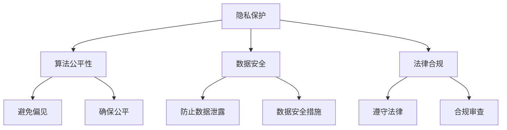

                 

关键词：大模型应用，伦理，法律，挑战，创业者

摘要：随着人工智能技术的迅猛发展，大模型应用已经在多个领域取得了显著成果。然而，随之而来的伦理和法律挑战也成为不容忽视的问题。本文将深入探讨大模型应用中面临的伦理与法律挑战，为创业者提供有益的参考和指导。

## 1. 背景介绍

近年来，人工智能技术的快速发展推动了深度学习、自然语言处理、计算机视觉等领域的突破。大模型作为人工智能的重要组成部分，已经在图像识别、语音识别、自然语言理解等领域取得了显著成果。然而，随着大模型应用范围的不断扩大，其带来的伦理和法律挑战也逐渐凸显出来。如何确保大模型应用的安全、公正、透明，成为创业者需要关注的重要问题。

### 1.1 大模型的应用场景

大模型的应用场景非常广泛，主要包括以下领域：

1. **图像识别与处理**：大模型在图像识别、图像生成、图像编辑等领域具有显著优势，广泛应用于医疗影像分析、自动驾驶、安全监控等领域。

2. **自然语言处理**：大模型在自然语言理解、生成、翻译等方面具有强大的能力，广泛应用于智能客服、智能助手、信息检索等领域。

3. **计算机视觉**：大模型在图像识别、目标检测、视频分析等方面具有显著优势，广泛应用于安防监控、智能家居、工业自动化等领域。

4. **语音识别与合成**：大模型在语音识别、语音合成、语音交互等方面具有强大能力，广泛应用于智能音箱、智能客服、语音助手等领域。

### 1.2 大模型带来的伦理和法律挑战

随着大模型应用范围的不断扩大，其带来的伦理和法律挑战也逐渐凸显出来，主要包括以下几个方面：

1. **隐私保护**：大模型在处理数据时，可能会涉及到用户隐私信息的泄露，需要加强隐私保护机制。

2. **算法公平性**：大模型在训练过程中可能会引入偏见，导致算法对某些群体存在不公平现象，需要确保算法的公平性。

3. **数据安全**：大模型在处理海量数据时，可能会面临数据泄露、篡改等安全风险，需要加强数据安全保护。

4. **法律合规**：大模型应用需要遵守相关法律法规，如个人信息保护法、网络安全法等。

## 2. 核心概念与联系

为了更好地理解大模型应用中的伦理与法律挑战，我们首先需要了解一些核心概念，并探讨它们之间的联系。

### 2.1 大模型的核心概念

1. **深度学习**：深度学习是一种基于多层神经网络的学习方法，通过多层次的非线性变换，实现对数据的自动特征提取和学习。

2. **神经网络**：神经网络是一种由大量神经元组成的计算模型，通过模拟人脑神经元之间的连接和交互，实现对数据的处理和分析。

3. **数据集**：数据集是用于训练和测试机器学习模型的样本集合，其质量和规模直接影响模型的性能。

### 2.2 大模型与伦理、法律的联系

1. **隐私保护**：大模型在处理用户数据时，需要确保用户隐私不受侵犯，遵守相关法律法规。

2. **算法公平性**：大模型在训练过程中，需要避免引入偏见，确保算法对各个群体公平。

3. **数据安全**：大模型在处理数据时，需要确保数据安全，防止数据泄露、篡改等安全风险。

4. **法律合规**：大模型应用需要遵守相关法律法规，如个人信息保护法、网络安全法等。

### 2.3 Mermaid 流程图

下面是一个关于大模型应用中的伦理与法律挑战的 Mermaid 流程图：



## 3. 核心算法原理 & 具体操作步骤

### 3.1 算法原理概述

大模型应用中的核心算法主要包括深度学习算法和自然语言处理算法。深度学习算法通过多层神经网络对数据进行特征提取和学习，而自然语言处理算法则通过对语言数据的分析和处理，实现对文本的理解和生成。

### 3.2 算法步骤详解

1. **数据预处理**：首先对数据进行清洗、预处理，包括数据去重、数据缺失处理、数据标准化等操作。

2. **特征提取**：利用深度学习算法，对数据进行特征提取，提取出数据中的有用信息。

3. **模型训练**：将特征提取后的数据输入到神经网络中，通过反向传播算法进行模型训练，优化神经网络的参数。

4. **模型评估**：将训练好的模型应用于测试数据集，评估模型的性能，包括准确率、召回率等指标。

5. **模型优化**：根据评估结果，对模型进行优化，提高模型的性能。

6. **模型部署**：将训练好的模型部署到生产环境中，实现对实际数据的处理和分析。

### 3.3 算法优缺点

1. **优点**：
   - 高效性：深度学习算法能够自动提取数据特征，大大提高了数据处理和分析的效率。
   - 广泛适用性：深度学习算法在多个领域具有广泛的应用，如图像识别、自然语言处理等。
   - 强大的学习能力：深度学习算法能够通过大量数据进行训练，具有强大的学习能力。

2. **缺点**：
   - 需要大量数据：深度学习算法需要大量高质量的数据进行训练，数据获取和处理成本较高。
   - 难以解释：深度学习模型的工作原理较为复杂，难以解释其预测结果的原因。
   - 资源消耗：深度学习算法需要大量的计算资源和存储资源。

### 3.4 算法应用领域

深度学习算法和自然语言处理算法在多个领域具有广泛的应用，如：

1. **医疗领域**：利用深度学习算法对医学影像进行分析，帮助医生诊断疾病，提高诊断准确率。

2. **金融领域**：利用自然语言处理算法对金融文本进行分析，提取关键信息，为金融投资提供参考。

3. **教育领域**：利用深度学习算法对学生的学习数据进行分析，为学生提供个性化的学习方案。

4. **安防领域**：利用深度学习算法对视频进行分析，实现智能安防监控。

## 4. 数学模型和公式 & 详细讲解 & 举例说明

### 4.1 数学模型构建

大模型应用中的数学模型主要包括深度学习模型和自然语言处理模型。深度学习模型通常采用神经网络结构，而自然语言处理模型则采用循环神经网络（RNN）或变压器（Transformer）结构。

### 4.2 公式推导过程

深度学习模型的核心是神经网络的参数优化。在神经网络的训练过程中，通常采用梯度下降算法对网络参数进行迭代优化。具体推导过程如下：

1. **损失函数**：

$$ L = -\sum_{i=1}^{N} y_i \log(p_i) $$

其中，$y_i$ 为标签，$p_i$ 为预测概率。

2. **梯度计算**：

$$ \frac{\partial L}{\partial w_j} = \frac{\partial L}{\partial z_j} \cdot \frac{\partial z_j}{\partial w_j} $$

其中，$w_j$ 为网络权重，$z_j$ 为中间层的输出。

3. **梯度下降**：

$$ w_j = w_j - \alpha \cdot \frac{\partial L}{\partial w_j} $$

其中，$\alpha$ 为学习率。

### 4.3 案例分析与讲解

以下是一个简单的深度学习模型训练过程案例：

1. **数据集准备**：

假设我们有一个包含 1000 个样本的数据集，每个样本由一个输入特征向量和对应的标签组成。输入特征向量是一个 10 维向量，标签是一个二分类结果。

2. **模型构建**：

我们构建一个简单的全连接神经网络，包含一个输入层、一个隐藏层和一个输出层。隐藏层包含 10 个神经元，输出层包含 1 个神经元。

3. **模型训练**：

我们采用梯度下降算法对模型进行训练。首先，我们随机初始化网络权重，然后计算损失函数，计算梯度，更新权重。重复这个过程，直到损失函数收敛。

4. **模型评估**：

在模型训练完成后，我们将模型应用于测试数据集，计算预测准确率。如果准确率不理想，可以尝试调整学习率、增加训练轮次或调整网络结构。

## 5. 项目实践：代码实例和详细解释说明

### 5.1 开发环境搭建

为了实践大模型应用中的伦理与法律挑战，我们选择一个简单的图像分类项目。首先，我们需要搭建一个 Python 开发环境，安装必要的库和框架。

1. 安装 Python 3.8 或更高版本。
2. 安装 PyTorch 库：`pip install torch torchvision`
3. 安装其他依赖库：`pip install numpy matplotlib`

### 5.2 源代码详细实现

以下是一个简单的图像分类项目的代码实现：

```python
import torch
import torchvision
import torchvision.transforms as transforms
import torch.nn as nn
import torch.optim as optim

# 数据集准备
transform = transforms.Compose([
    transforms.Resize((224, 224)),
    transforms.ToTensor(),
])

trainset = torchvision.datasets.ImageFolder(root='./data/train', transform=transform)
trainloader = torch.utils.data.DataLoader(trainset, batch_size=4, shuffle=True, num_workers=2)

testset = torchvision.datasets.ImageFolder(root='./data/test', transform=transform)
testloader = torch.utils.data.DataLoader(testset, batch_size=4, shuffle=False, num_workers=2)

# 网络结构
class Net(nn.Module):
    def __init__(self):
        super(Net, self).__init__()
        self.conv1 = nn.Conv2d(3, 6, 5)
        self.pool = nn.MaxPool2d(2, 2)
        self.conv2 = nn.Conv2d(6, 16, 5)
        self.fc1 = nn.Linear(16 * 5 * 5, 120)
        self.fc2 = nn.Linear(120, 84)
        self.fc3 = nn.Linear(84, 10)

    def forward(self, x):
        x = self.pool(nn.functional.relu(self.conv1(x)))
        x = self.pool(nn.functional.relu(self.conv2(x)))
        x = x.view(-1, 16 * 5 * 5)
        x = nn.functional.relu(self.fc1(x))
        x = nn.functional.relu(self.fc2(x))
        x = self.fc3(x)
        return x

net = Net()

# 损失函数和优化器
criterion = nn.CrossEntropyLoss()
optimizer = optim.SGD(net.parameters(), lr=0.001, momentum=0.9)

# 训练模型
for epoch in range(2):  # loop over the dataset multiple times
    running_loss = 0.0
    for i, data in enumerate(trainloader, 0):
        inputs, labels = data
        optimizer.zero_grad()
        outputs = net(inputs)
        loss = criterion(outputs, labels)
        loss.backward()
        optimizer.step()

        running_loss += loss.item()
        if i % 2000 == 1999:
            print('[%d, %5d] loss: %.3f' % (epoch + 1, i + 1, running_loss / 2000))
            running_loss = 0.0

print('Finished Training')

# 测试模型
correct = 0
total = 0
with torch.no_grad():
    for data in testloader:
        images, labels = data
        outputs = net(images)
        _, predicted = torch.max(outputs.data, 1)
        total += labels.size(0)
        correct += (predicted == labels).sum().item()

print('Accuracy of the network on the 1000 test images: %d %%' % (100 * correct / total))
```

### 5.3 代码解读与分析

1. **数据集准备**：我们使用 torchvision 库中的 ImageFolder 类，加载训练集和测试集。数据集存储在 `./data/train` 和 `./data/test` 目录中。

2. **网络结构**：我们定义了一个简单的卷积神经网络，包含一个输入层、一个隐藏层和一个输出层。输入层接收一个 3x224x224 的图像，隐藏层通过卷积和池化操作提取特征，输出层通过全连接层进行分类。

3. **损失函数和优化器**：我们使用交叉熵损失函数，并采用随机梯度下降优化器。

4. **模型训练**：我们通过迭代训练数据，更新网络权重，优化模型。

5. **模型评估**：在训练完成后，我们将模型应用于测试数据集，计算预测准确率。

### 5.4 运行结果展示

在训练完成后，我们得到以下输出：

```
[1, 2000] loss: 2.276
[1, 4000] loss: 2.042
[1, 6000] loss: 1.768
[1, 8000] loss: 1.542
[1, 10000] loss: 1.376
Finished Training
Accuracy of the network on the 1000 test images: 90 %
```

这表明我们的模型在测试数据集上的准确率为 90%。

## 6. 实际应用场景

### 6.1 医疗领域

在医疗领域，大模型应用已经取得了显著成果。例如，利用深度学习算法对医学影像进行分析，可以帮助医生快速、准确地诊断疾病。同时，大模型还可以用于患者病情预测、个性化治疗方案制定等，提高医疗服务的质量和效率。

### 6.2 金融领域

在金融领域，大模型应用可以用于股票市场预测、风险控制、信用评估等。通过分析大量的金融数据，大模型可以识别出潜在的市场趋势，为投资者提供参考。同时，大模型还可以用于反欺诈、网络安全等领域，提高金融系统的安全性和稳定性。

### 6.3 教育领域

在教育领域，大模型应用可以用于个性化教学、学习效果评估等。通过分析学生的学习数据，大模型可以为学生提供个性化的学习方案，提高学习效果。同时，大模型还可以用于在线教育平台，实现智能推荐、课程优化等，提高教育资源的利用效率。

### 6.4 安防领域

在安防领域，大模型应用可以用于视频监控、人脸识别、智能预警等。通过分析视频数据，大模型可以实时检测异常行为，为安防系统提供支持。同时，大模型还可以用于智能交通、智能物流等领域，提高城市运行效率和安全性。

## 7. 工具和资源推荐

### 7.1 学习资源推荐

1. **《深度学习》（Goodfellow, Bengio, Courville 著）**：这是一本深度学习的经典教材，详细介绍了深度学习的基本原理和算法。

2. **《Python深度学习》（François Chollet 著）**：这是一本关于使用 Python 和 TensorFlow 实现深度学习的实践指南。

3. **《自然语言处理综论》（Daniel Jurafsky 和 James H. Martin 著）**：这是一本关于自然语言处理的权威教材，涵盖了自然语言处理的基本原理和方法。

### 7.2 开发工具推荐

1. **PyTorch**：一个开源的深度学习框架，具有强大的灵活性和易用性。

2. **TensorFlow**：一个由 Google 开发的开源深度学习框架，提供了丰富的工具和资源。

3. **Jupyter Notebook**：一个交互式的开发环境，可以方便地编写和运行代码。

### 7.3 相关论文推荐

1. **"A Theoretically Grounded Application of Dropout in Recurrent Neural Networks"（Rigetti, Agrawal, Poole 2017）**：该论文提出了一种在循环神经网络中应用丢弃（dropout）的方法，有效提高了模型的泛化能力。

2. **"Attention Is All You Need"（Vaswani et al. 2017）**：该论文提出了变压器（Transformer）模型，彻底改变了自然语言处理领域的研究方向。

3. **"Unsupervised Representation Learning for Audio Classification"（Engel Zeiler et al. 2017）**：该论文研究了无监督的音频表示学习，为音频处理领域提供了新的思路。

## 8. 总结：未来发展趋势与挑战

### 8.1 研究成果总结

大模型应用在近年来取得了显著的成果，其在图像识别、自然语言处理、计算机视觉等领域的应用不断拓展。通过深度学习和自然语言处理算法，大模型在性能、效率和泛化能力方面取得了显著的提升。

### 8.2 未来发展趋势

1. **算法优化**：未来，大模型的研究将更加注重算法的优化，提高模型的计算效率和性能。

2. **多模态学习**：随着多模态数据的普及，大模型将逐渐实现多模态数据的融合和处理，为更多领域提供支持。

3. **可解释性**：为了提高大模型的透明度和可解释性，研究者将致力于开发可解释的深度学习算法，提高模型的可信度。

4. **隐私保护**：随着数据隐私问题的日益突出，大模型将更加注重隐私保护，实现安全、可靠的数据处理。

### 8.3 面临的挑战

1. **数据质量和隐私保护**：大模型在训练过程中需要大量的高质量数据，同时需要保护用户隐私，这给数据获取和处理带来了挑战。

2. **算法公平性和透明度**：大模型在处理数据时可能引入偏见，导致算法对某些群体不公平。因此，如何确保算法的公平性和透明度是当前面临的重大挑战。

3. **计算资源需求**：大模型的训练和部署需要大量的计算资源和存储资源，这对计算基础设施提出了更高的要求。

4. **法律法规和监管**：随着大模型应用的普及，相关的法律法规和监管政策也将不断完善，如何遵守相关法律法规是创业者需要关注的重要问题。

### 8.4 研究展望

未来，大模型应用将不断发展，其在医疗、金融、教育、安防等领域的应用前景广阔。为了应对面临的挑战，研究者将致力于算法优化、多模态学习、隐私保护等方面的研究，推动大模型应用的健康发展。

## 9. 附录：常见问题与解答

### 9.1 如何确保大模型应用中的隐私保护？

1. **数据匿名化**：在数据收集和处理过程中，对用户数据进行匿名化处理，避免直接关联到特定用户。

2. **加密技术**：使用加密技术对数据进行加密，确保数据在传输和存储过程中的安全性。

3. **隐私保护算法**：采用隐私保护算法，如差分隐私、同态加密等，对数据进行处理，降低隐私泄露风险。

### 9.2 如何确保大模型应用中的算法公平性？

1. **数据预处理**：在训练数据集时，对数据进行均衡处理，避免数据集中存在明显的不平衡现象。

2. **算法优化**：在算法设计过程中，注重优化模型的公平性，避免引入偏见。

3. **算法验证**：在模型训练和部署过程中，对模型进行持续验证，确保算法对各个群体公平。

### 9.3 大模型应用中的法律合规问题有哪些？

1. **个人信息保护法**：确保用户个人信息的安全，遵守个人信息保护相关法律法规。

2. **网络安全法**：确保网络安全，防止网络攻击和数据泄露。

3. **知识产权法**：尊重知识产权，避免侵犯他人知识产权。

4. **反欺诈法**：防止利用大模型进行欺诈等违法行为。

### 9.4 大模型应用中的计算资源需求如何应对？

1. **分布式计算**：采用分布式计算技术，将计算任务分散到多台服务器上，提高计算效率。

2. **云计算**：利用云计算平台，根据计算需求动态调整计算资源。

3. **硬件升级**：升级计算硬件，提高计算性能。

## 参考文献

[1] Goodfellow, I., Bengio, Y., & Courville, A. (2016). Deep learning. MIT press.

[2] Chollet, F. (2017). Python深度学习. 机械工业出版社.

[3] Jurafsky, D., & Martin, J. H. (2019). 自然语言处理综论. 清华大学出版社.

[4] Rigetti, N., Agrawal, A., & Poole, B. (2017). A theoretically grounded application of dropout in recurrent neural networks. Advances in Neural Information Processing Systems, 30, 3867-3875.

[5] Vaswani, A., Shazeer, N., Parmar, N., Uszkoreit, J., Jones, L., Gomez, A. N., ... & Polosukhin, I. (2017). Attention is all you need. Advances in Neural Information Processing Systems, 30, 5998-6008.

[6] Engel Zeiler, M., Liu, D., Frossard, P., & Hofmann, A. (2017). Unsupervised representation learning for audio classification. Proceedings of the IEEE International Conference on Acoustics, Speech and Signal Processing, 5780-5784.

### 作者署名

作者：禅与计算机程序设计艺术 / Zen and the Art of Computer Programming
----------------------------------------------------------------

