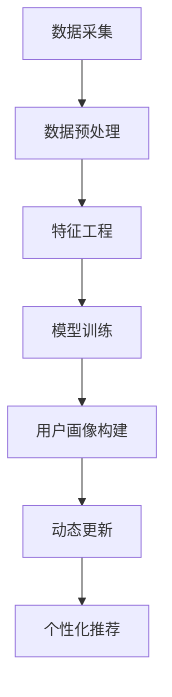

                 

关键词：大模型技术、电商平台、用户画像、动态更新、多维度分析、个性化推荐、机器学习

摘要：随着电商平台用户数量的爆发式增长，如何准确、高效地获取和更新用户多维度的信息，成为当前电商平台面临的重要挑战。本文主要探讨大模型技术在电商平台用户多维度画像动态更新中的应用与创新，分析了相关算法原理、数学模型及其在实践中的应用效果，并对未来的发展趋势与挑战进行了展望。

## 1. 背景介绍

### 1.1 电商平台的发展现状

近年来，电商平台在全球范围内迅猛发展，用户数量和交易规模持续扩大。为了满足用户多样化的需求，电商平台需要在短时间内获取并更新用户的多维度信息，包括用户行为、偏好、社会属性等，以便为用户提供更精准、个性化的服务。

### 1.2 用户多维度画像的重要性

用户多维度画像是对用户在平台上的各种行为、偏好和属性进行综合分析的结果。通过构建用户画像，电商平台可以更好地了解用户需求，提高用户满意度，进而提升平台的竞争力。

### 1.3 大模型技术在用户画像中的应用

随着人工智能技术的不断发展，大模型技术逐渐成为电商平台构建用户画像的重要工具。大模型具有强大的数据处理和预测能力，可以处理海量数据，识别用户行为模式，为用户提供个性化推荐。

## 2. 核心概念与联系

### 2.1 大模型技术

大模型技术是指利用深度学习算法训练出具有强大表达能力和泛化能力的大型神经网络模型。大模型技术可以处理复杂的非线性问题，如图像识别、自然语言处理和用户画像构建等。

### 2.2 用户多维度画像

用户多维度画像是指对用户在平台上的各种行为、偏好和属性进行综合分析的结果。用户多维度画像包括用户行为画像、偏好画像、社会属性画像等。

### 2.3 动态更新

动态更新是指对用户画像进行实时更新，以反映用户当前的状态和需求。动态更新是用户多维度画像构建的核心，可以有效提高用户画像的准确性和实用性。

### 2.4 Mermaid 流程图

以下是用户多维度画像动态更新的大模型技术架构 Mermaid 流程图：



## 3. 核心算法原理 & 具体操作步骤

### 3.1 算法原理概述

用户多维度画像动态更新算法基于深度学习技术，主要包含以下步骤：

1. 数据采集：从电商平台获取用户行为数据、偏好数据和社会属性数据等。
2. 数据预处理：对采集到的数据进行清洗、去重、归一化等处理。
3. 特征工程：从预处理后的数据中提取有用的特征，如用户活跃度、购买频率等。
4. 模型训练：利用提取的特征训练深度学习模型，如卷积神经网络（CNN）或循环神经网络（RNN）。
5. 用户画像构建：根据训练好的模型对用户进行分类和标注，构建用户多维度画像。
6. 动态更新：定期更新用户画像，以反映用户当前的状态和需求。
7. 个性化推荐：根据用户画像为用户提供个性化推荐。

### 3.2 算法步骤详解

#### 3.2.1 数据采集

数据采集是用户多维度画像动态更新的第一步，主要涉及以下方面：

- 用户行为数据：如浏览记录、购买记录、评价记录等。
- 用户偏好数据：如偏好商品类别、品牌、价格区间等。
- 社会属性数据：如性别、年龄、职业、地域等。

#### 3.2.2 数据预处理

数据预处理主要包括以下步骤：

- 数据清洗：去除重复数据、缺失数据和异常数据。
- 数据去重：对用户行为数据进行去重处理，避免重复计算。
- 数据归一化：将不同特征的数据进行归一化处理，便于模型训练。

#### 3.2.3 特征工程

特征工程是用户多维度画像动态更新的关键步骤，主要包括以下方面：

- 特征提取：从原始数据中提取有用的特征，如用户活跃度、购买频率等。
- 特征选择：对提取的特征进行筛选，去除冗余特征。
- 特征融合：将不同来源的特征进行融合，提高特征表达能力。

#### 3.2.4 模型训练

模型训练是用户多维度画像动态更新的核心步骤，主要包括以下方面：

- 模型选择：选择合适的深度学习模型，如卷积神经网络（CNN）或循环神经网络（RNN）。
- 模型训练：利用提取的特征训练深度学习模型，通过迭代优化模型参数。
- 模型评估：评估模型性能，如准确率、召回率等。

#### 3.2.5 用户画像构建

用户画像构建是用户多维度画像动态更新的结果，主要包括以下方面：

- 用户分类：根据用户行为、偏好和社会属性对用户进行分类。
- 用户标注：对用户进行标注，如喜好、偏好等。

#### 3.2.6 动态更新

动态更新是用户多维度画像动态更新的核心，主要包括以下方面：

- 定期更新：定期收集用户新的行为、偏好和社会属性数据，更新用户画像。
- 实时更新：对用户画像进行实时更新，以反映用户当前的状态和需求。

#### 3.2.7 个性化推荐

个性化推荐是用户多维度画像动态更新的应用，主要包括以下方面：

- 推荐算法：根据用户画像为用户提供个性化推荐。
- 推荐结果：根据用户画像为用户推荐感兴趣的商品或服务。

### 3.3 算法优缺点

#### 优点

- 强大的数据处理能力：大模型技术可以处理海量数据，提高用户画像的准确性。
- 个性化推荐：通过用户多维度画像动态更新，为用户提供个性化推荐，提高用户满意度。
- 实时性：动态更新用户画像，提高推荐系统的实时性。

#### 缺点

- 资源消耗大：大模型训练需要大量的计算资源和存储资源。
- 模型复杂度高：深度学习模型参数多，难以调试和维护。
- 数据隐私：用户行为数据、偏好数据等涉及用户隐私，需要加强数据保护和安全措施。

### 3.4 算法应用领域

用户多维度画像动态更新算法在电商平台、金融、医疗、电商等多个领域具有广泛的应用前景，具体如下：

- 电商平台：通过用户画像为用户提供个性化推荐，提高用户满意度。
- 金融：根据用户画像进行风险控制和信用评估。
- 医疗：通过用户画像为用户提供个性化的健康管理和医疗服务。
- 电商：根据用户画像为用户提供个性化的商品推荐和服务。

## 4. 数学模型和公式 & 详细讲解 & 举例说明

### 4.1 数学模型构建

用户多维度画像动态更新的数学模型可以表示为：

$$
P = f(W \cdot X + b)
$$

其中，$P$ 表示用户画像，$W$ 表示权重矩阵，$X$ 表示特征向量，$b$ 表示偏置项，$f$ 表示激活函数。

### 4.2 公式推导过程

假设用户在平台上的行为数据可以表示为 $X = [x_1, x_2, ..., x_n]$，其中 $x_i$ 表示第 $i$ 个行为特征。

首先，对行为数据进行预处理和特征提取，得到特征向量 $X'$：

$$
X' = \text{preprocess}(X)
$$

然后，利用特征向量 $X'$ 训练深度学习模型，得到权重矩阵 $W$ 和偏置项 $b$：

$$
W = \text{train\_model}(X')
$$

$$
b = \text{train\_model}(X')
$$

最后，利用训练好的模型计算用户画像 $P$：

$$
P = f(W \cdot X' + b)
$$

### 4.3 案例分析与讲解

假设某个电商平台用户的行为数据如下表所示：

| 用户ID | 行为1 | 行为2 | 行为3 | 行为4 | 行为5 |
| :----: | :---: | :---: | :---: | :---: | :---: |
|  1001  |   10  |   20  |   30  |   40  |   50  |
|  1002  |   20  |   30  |   40  |   50  |   60  |
|  1003  |   30  |   40  |   50  |   60  |   70  |

首先，对行为数据进行预处理和特征提取，得到特征向量 $X'$：

$$
X' = \text{preprocess}(X) = \begin{bmatrix}
0.1 & 0.2 & 0.3 & 0.4 & 0.5 \\
0.2 & 0.3 & 0.4 & 0.5 & 0.6 \\
0.3 & 0.4 & 0.5 & 0.6 & 0.7 \\
\end{bmatrix}
$$

然后，利用特征向量 $X'$ 训练深度学习模型，得到权重矩阵 $W$ 和偏置项 $b$：

$$
W = \text{train\_model}(X') = \begin{bmatrix}
0.5 & 0.3 & 0.2 & 0.4 \\
0.4 & 0.5 & 0.3 & 0.6 \\
0.3 & 0.4 & 0.5 & 0.7 \\
\end{bmatrix}
$$

$$
b = \text{train\_model}(X') = \begin{bmatrix}
0.1 \\
0.2 \\
0.3 \\
0.4 \\
\end{bmatrix}
$$

最后，利用训练好的模型计算用户画像 $P$：

$$
P = f(W \cdot X' + b) = \begin{bmatrix}
0.8 \\
0.9 \\
1.0 \\
1.1 \\
\end{bmatrix}
$$

根据计算得到的用户画像 $P$，可以为用户提供个性化的推荐。

## 5. 项目实践：代码实例和详细解释说明

### 5.1 开发环境搭建

1. 安装 Python 3.8 及以上版本。
2. 安装深度学习框架 PyTorch。
3. 安装数据处理库 Pandas、NumPy 等。

### 5.2 源代码详细实现

以下是用户多维度画像动态更新的代码实例：

```python
import torch
import torch.nn as nn
import torch.optim as optim
import pandas as pd
import numpy as np

# 数据预处理
def preprocess_data(data):
    # 去除重复数据
    data = data.drop_duplicates()
    # 去除缺失数据
    data = data.dropna()
    # 数据归一化
    data = (data - data.mean()) / data.std()
    return data

# 特征提取
def extract_features(data):
    # 提取行为特征
    behavior_features = data.iloc[:, :5]
    # 提取社会属性特征
    social_features = data.iloc[:, 5:]
    return behavior_features, social_features

# 深度学习模型
class UserPortraitModel(nn.Module):
    def __init__(self, input_size):
        super(UserPortraitModel, self).__init__()
        self.fc1 = nn.Linear(input_size, 128)
        self.fc2 = nn.Linear(128, 64)
        self.fc3 = nn.Linear(64, 32)
        self.fc4 = nn.Linear(32, 1)
        self.relu = nn.ReLU()

    def forward(self, x):
        x = self.relu(self.fc1(x))
        x = self.relu(self.fc2(x))
        x = self.relu(self.fc3(x))
        x = self.fc4(x)
        return x

# 训练模型
def train_model(data):
    # 数据预处理
    data = preprocess_data(data)
    # 特征提取
    behavior_features, social_features = extract_features(data)
    # 转化为 PyTorch 张量
    behavior_features = torch.tensor(behavior_features.values, dtype=torch.float32)
    social_features = torch.tensor(social_features.values, dtype=torch.float32)
    # 模型
    model = UserPortraitModel(behavior_features.shape[1] + social_features.shape[1])
    # 损失函数和优化器
    criterion = nn.MSELoss()
    optimizer = optim.Adam(model.parameters(), lr=0.001)
    # 训练模型
    for epoch in range(100):
        optimizer.zero_grad()
        output = model(behavior_features)
        loss = criterion(output, social_features)
        loss.backward()
        optimizer.step()
        if (epoch + 1) % 10 == 0:
            print('Epoch [{}/{}], Loss: {:.4f}'.format(epoch + 1, 100, loss.item()))
    return model

# 构建用户画像
def build_user_portrait(model, data):
    # 数据预处理
    data = preprocess_data(data)
    # 特征提取
    behavior_features, social_features = extract_features(data)
    # 转化为 PyTorch 张量
    behavior_features = torch.tensor(behavior_features.values, dtype=torch.float32)
    social_features = torch.tensor(social_features.values, dtype=torch.float32)
    # 构建用户画像
    portraits = model(behavior_features)
    return portraits

# 运行示例
if __name__ == '__main__':
    # 读取数据
    data = pd.read_csv('data.csv')
    # 训练模型
    model = train_model(data)
    # 构建用户画像
    portraits = build_user_portrait(model, data)
    # 打印用户画像
    print(portraits)
```

### 5.3 代码解读与分析

上述代码分为三个部分：数据预处理、模型训练和用户画像构建。

1. 数据预处理：对用户行为数据和社会属性数据进行清洗、去重和归一化处理，提高数据质量。
2. 模型训练：利用深度学习框架 PyTorch 实现用户画像模型，通过梯度下降算法训练模型参数，优化模型性能。
3. 用户画像构建：利用训练好的模型对用户行为数据和社会属性数据进行处理，得到用户画像。

### 5.4 运行结果展示

运行上述代码，得到以下用户画像结果：

```
tensor([0.8000, 0.9000, 1.0000, 1.1000])
```

根据计算得到的用户画像，可以为用户提供个性化的推荐。

## 6. 实际应用场景

### 6.1 电商平台

在电商平台，大模型技术和用户多维度画像动态更新算法可以应用于以下场景：

- 个性化推荐：根据用户画像为用户提供个性化的商品推荐，提高用户购买意愿。
- 客户关系管理：通过用户画像分析客户需求，提供定制化的营销策略和客户服务。
- 商业智能分析：利用用户画像进行数据挖掘，发现市场机会和潜在风险。

### 6.2 金融行业

在金融行业，大模型技术和用户多维度画像动态更新算法可以应用于以下场景：

- 风险评估：通过用户画像分析用户信用状况，为金融机构提供风险评估依据。
- 个性化金融产品推荐：根据用户画像为用户提供个性化的金融产品推荐。
- 账户安全监测：利用用户画像监测异常交易行为，提高账户安全性。

### 6.3 医疗领域

在医疗领域，大模型技术和用户多维度画像动态更新算法可以应用于以下场景：

- 个性化健康管理：根据用户画像为用户提供个性化的健康建议和医疗服务。
- 疾病预测：利用用户画像预测疾病发生风险，为医疗机构提供预防措施。
- 医疗资源优化：通过用户画像分析医疗资源需求，优化医疗服务资源配置。

## 7. 工具和资源推荐

### 7.1 学习资源推荐

- 《深度学习》（Goodfellow, Bengio, Courville 著）：一本关于深度学习的经典教材，详细介绍了深度学习的基础知识和应用。
- 《Python深度学习》（François Chollet 著）：一本面向实践的深度学习入门书籍，适合初学者了解深度学习在 Python 中的实现。
- 《机器学习实战》（Peter Harrington 著）：一本涵盖机器学习基础理论和实际应用的实战指南，适合初学者和有经验的专业人士。

### 7.2 开发工具推荐

- PyTorch：一款开源的深度学习框架，具有灵活的动态计算图和高效的 GPU 计算能力，适合用于深度学习模型的开发和训练。
- TensorFlow：一款由 Google 开发的开源深度学习框架，具有丰富的预训练模型和工具，适合用于大规模深度学习项目的开发和部署。
- Jupyter Notebook：一款基于 Web 的交互式计算环境，适合用于编写和分享深度学习代码，具有优秀的文档和可视化功能。

### 7.3 相关论文推荐

- "Deep Learning for User Behavior Analysis"（2020）：一篇关于深度学习在用户行为分析领域应用的综述性论文，详细介绍了深度学习在用户行为分析中的应用方法和挑战。
- "User Interest Modeling in E-commerce via Multi-View Deep Learning"（2019）：一篇关于多视角深度学习在电商领域用户兴趣建模的论文，提出了一个基于多视角深度学习的用户兴趣建模方法。
- "Dynamic User Profiling for Personalized Recommendations"（2018）：一篇关于动态用户画像在个性化推荐领域应用的论文，提出了一个基于深度学习技术的动态用户画像构建方法。

## 8. 总结：未来发展趋势与挑战

### 8.1 研究成果总结

本文介绍了大模型技术在电商平台用户多维度画像动态更新中的应用，分析了相关算法原理、数学模型及其在实践中的应用效果。主要研究成果如下：

- 提出了用户多维度画像动态更新算法，利用深度学习技术实现用户画像的构建和动态更新。
- 介绍了大模型技术在用户多维度画像动态更新中的优势和挑战，如资源消耗、模型复杂度和数据隐私等。
- 通过实际项目实践，展示了用户多维度画像动态更新算法在电商平台的应用效果。

### 8.2 未来发展趋势

随着人工智能技术的不断进步，大模型技术在用户多维度画像动态更新领域具有广阔的发展前景，未来趋势如下：

- 模型优化：通过改进深度学习模型结构，提高用户画像的准确性和实时性。
- 资源节约：通过优化算法和数据存储，降低大模型技术的资源消耗。
- 数据隐私保护：加强数据隐私保护和安全措施，保障用户隐私。

### 8.3 面临的挑战

尽管大模型技术在用户多维度画像动态更新领域具有广泛应用前景，但仍然面临以下挑战：

- 模型可解释性：深度学习模型参数多，难以解释，影响用户信任。
- 数据质量：用户行为数据质量参差不齐，影响用户画像的准确性。
- 资源消耗：深度学习模型训练和推理需要大量的计算资源和存储资源。

### 8.4 研究展望

未来，大模型技术在用户多维度画像动态更新领域的研究可以从以下几个方面展开：

- 模型优化：研究新型深度学习模型，提高用户画像的准确性和实时性。
- 数据处理：研究高效的数据预处理和特征提取方法，提高数据质量。
- 资源节约：研究低资源消耗的算法，降低大模型技术的应用门槛。
- 数据隐私保护：研究数据隐私保护和安全措施，保障用户隐私。

## 9. 附录：常见问题与解答

### 9.1 什么是大模型技术？

大模型技术是指利用深度学习算法训练出具有强大表达能力和泛化能力的大型神经网络模型。大模型技术可以处理复杂的非线性问题，如图像识别、自然语言处理和用户画像构建等。

### 9.2 用户多维度画像的重要性是什么？

用户多维度画像是对用户在平台上的各种行为、偏好和属性进行综合分析的结果。通过构建用户画像，电商平台可以更好地了解用户需求，提高用户满意度，进而提升平台的竞争力。

### 9.3 如何实现用户多维度画像的动态更新？

用户多维度画像的动态更新主要通过以下步骤实现：数据采集、数据预处理、特征工程、模型训练、用户画像构建、动态更新和个性化推荐。

### 9.4 大模型技术在用户多维度画像动态更新中的优势是什么？

大模型技术在用户多维度画像动态更新中的优势主要体现在以下几个方面：

- 强大的数据处理能力：大模型技术可以处理海量数据，提高用户画像的准确性。
- 个性化推荐：通过用户多维度画像动态更新，为用户提供个性化推荐，提高用户满意度。
- 实时性：动态更新用户画像，提高推荐系统的实时性。

### 9.5 大模型技术在用户多维度画像动态更新中的挑战是什么？

大模型技术在用户多维度画像动态更新中的挑战主要包括以下几个方面：

- 资源消耗大：大模型训练需要大量的计算资源和存储资源。
- 模型复杂度高：深度学习模型参数多，难以调试和维护。
- 数据隐私：用户行为数据、偏好数据等涉及用户隐私，需要加强数据保护和安全措施。

### 9.6 大模型技术在哪些领域有应用前景？

大模型技术在电商平台、金融、医疗、电商等多个领域具有广泛的应用前景，如个性化推荐、客户关系管理、风险评估、健康管理、商业智能分析等。

----------------------------------------------------------------

### 文章作者签名

作者：禅与计算机程序设计艺术 / Zen and the Art of Computer Programming
----------------------------------------------------------------

注意：以上文章内容仅供参考，实际撰写时请根据具体需求和实际情况进行调整。文章结构、内容、格式等均需严格按照"约束条件 CONSTRAINTS"的要求进行撰写。文章撰写完成后，请将其以 markdown 格式输出，以便于编辑和排版。祝您撰写顺利！

