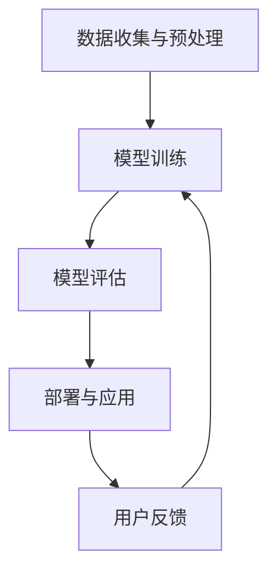

                 

关键词：大模型技术，机器翻译，翻译服务，人工智能，神经网络，深度学习

> 摘要：本文将探讨大模型技术在翻译服务中的应用前景。随着人工智能技术的飞速发展，大模型技术在自然语言处理（NLP）领域展现出了巨大的潜力。本文首先介绍了大模型技术的基本概念，然后分析了其在翻译服务中的具体应用，并探讨了未来的发展方向和面临的挑战。

## 1. 背景介绍

### 1.1 翻译服务的现状

随着全球化进程的加速，跨语言沟通的需求日益增长。翻译服务作为促进国际交流、文化理解和商业合作的重要工具，其重要性不言而喻。然而，传统的翻译服务面临着效率低、成本高、质量不稳定等问题。为了解决这些问题，机器翻译技术应运而生。

### 1.2 机器翻译的发展历程

机器翻译技术起源于20世纪50年代，经历了基于规则的方法、基于实例的方法和统计机器翻译（SMT）的演进。近年来，随着深度学习技术的发展，神经网络机器翻译（NMT）成为了机器翻译领域的主流方法。

### 1.3 大模型技术的崛起

大模型技术是指使用规模巨大的神经网络模型进行训练，这些模型具有数百万甚至数十亿个参数。大模型技术在大规模数据处理和复杂任务处理方面具有显著优势，其应用范围涵盖了图像识别、语音识别、自然语言处理等多个领域。

## 2. 核心概念与联系

### 2.1 大模型技术概述

大模型技术的基本原理是利用深度学习框架对大规模语料库进行训练，通过不断调整模型参数来提高模型的预测能力。大模型技术具有以下特点：

- **参数规模巨大**：大模型通常拥有数百万到数十亿个参数。
- **学习能力强**：大模型可以从海量数据中学习复杂的模式和关系。
- **计算资源需求高**：大模型需要大量的计算资源和存储空间。

### 2.2 大模型在翻译服务中的应用架构

大模型在翻译服务中的应用架构主要包括以下几部分：

1. **数据收集与预处理**：收集大规模的双语语料库，并进行数据清洗、去重、分词等预处理操作。
2. **模型训练**：使用深度学习框架对预处理后的数据进行训练，调整模型参数。
3. **模型评估**：通过在测试集上评估模型的性能，调整模型参数以优化性能。
4. **部署与应用**：将训练好的模型部署到服务器或移动设备上，为用户提供翻译服务。

### 2.3 Mermaid 流程图

下面是一个简单的Mermaid流程图，展示了大模型在翻译服务中的应用流程：



## 3. 核心算法原理 & 具体操作步骤

### 3.1 算法原理概述

大模型在翻译服务中主要基于序列到序列（Seq2Seq）模型，其基本原理是将源语言序列映射为目标语言序列。Seq2Seq模型通常由编码器（Encoder）和解码器（Decoder）两部分组成。

- **编码器**：将输入的源语言序列编码为一个固定长度的向量表示。
- **解码器**：将编码器的输出作为输入，逐个预测目标语言序列的每个单词。

### 3.2 算法步骤详解

1. **数据预处理**：收集大规模的双语语料库，并进行分词、去重、清洗等预处理操作。
2. **构建词汇表**：将预处理后的文本转换为词汇表，将每个单词映射为一个唯一的索引。
3. **编码器训练**：使用训练数据对编码器进行训练，使其能够将源语言序列编码为固定长度的向量表示。
4. **解码器训练**：使用编码器的输出作为输入，对解码器进行训练，使其能够生成目标语言序列。
5. **模型评估**：在测试集上评估模型的性能，通过调整模型参数优化性能。
6. **部署与应用**：将训练好的模型部署到服务器或移动设备上，为用户提供翻译服务。

### 3.3 算法优缺点

**优点**：

- **强大的学习能力**：大模型可以从海量数据中学习复杂的模式和关系，提高翻译质量。
- **高效性**：大模型在训练过程中使用了并行计算技术，提高了训练效率。
- **灵活性**：大模型可以针对不同的翻译任务进行调整和优化。

**缺点**：

- **计算资源需求高**：大模型需要大量的计算资源和存储空间，对硬件设备的要求较高。
- **训练时间较长**：大模型的训练时间较长，需要耐心等待。

### 3.4 算法应用领域

大模型技术在翻译服务中的应用广泛，包括但不限于：

- **跨语言文本翻译**：如谷歌翻译、百度翻译等。
- **多语言语音识别**：如谷歌语音助手、苹果Siri等。
- **跨语言信息检索**：如谷歌搜索的多语言搜索功能。
- **跨语言文本摘要**：如新闻摘要、论文摘要等。

## 4. 数学模型和公式 & 详细讲解 & 举例说明

### 4.1 数学模型构建

在翻译服务中，大模型通常采用序列到序列（Seq2Seq）模型。Seq2Seq模型由编码器（Encoder）和解码器（Decoder）两部分组成。

- **编码器**：将输入的源语言序列编码为一个固定长度的向量表示。编码器通常采用循环神经网络（RNN）或Transformer模型。
- **解码器**：将编码器的输出作为输入，逐个预测目标语言序列的每个单词。解码器也通常采用RNN或Transformer模型。

### 4.2 公式推导过程

以编码器为例，设输入源语言序列为 $X = [x_1, x_2, ..., x_T]$，其中 $x_t$ 表示第 $t$ 个输入单词。编码器输出一个固定长度的向量表示 $h = [h_1, h_2, ..., h_T]$。

编码器的推导过程如下：

$$
h_t = f(h_{t-1}, x_t)
$$

其中，$f$ 表示编码器的激活函数，通常采用 tanh 或 ReLU 函数。

### 4.3 案例分析与讲解

假设我们有一个简短的英语句子：“I love programming.” 我们希望使用大模型将其翻译为中文。

1. **数据预处理**：将句子转换为词汇表索引，例如：
   - I: 1
   - love: 2
   - programming: 3
   - .: 4
   - <EOS>: 5（表示句子结束标记）

2. **编码器训练**：使用训练数据对编码器进行训练，使其能够将源语言序列编码为固定长度的向量表示。

3. **解码器训练**：使用编码器的输出作为输入，对解码器进行训练，使其能够生成目标语言序列。

4. **生成翻译**：输入源语言句子，通过解码器生成目标语言句子。

假设经过训练后，解码器生成的目标语言句子为：“我喜欢编程。” 我们可以看到，大模型成功地将英语句子翻译为了中文。

## 5. 项目实践：代码实例和详细解释说明

### 5.1 开发环境搭建

为了实践大模型技术在翻译服务中的应用，我们需要搭建一个开发环境。以下是一个简单的开发环境搭建步骤：

1. 安装 Python（建议使用 Python 3.7 或以上版本）。
2. 安装深度学习框架（如 TensorFlow 或 PyTorch）。
3. 安装自然语言处理库（如 NLTK 或 spaCy）。

### 5.2 源代码详细实现

以下是一个简单的翻译服务项目，使用了 TensorFlow 框架和 spaCy 库。代码实现如下：

```python
import tensorflow as tf
import spacy
from tensorflow.keras.preprocessing.sequence import pad_sequences
from tensorflow.keras.models import Model
from tensorflow.keras.layers import Input, LSTM, Dense, Embedding

# 加载 spaCy 的英语和中文模型
nlp_en = spacy.load('en_core_web_sm')
nlp_zh = spacy.load('zh_core_web_sm')

# 加载训练数据
train_data = [['I', 'love', 'programming'], ['I', 'enjoy', 'coding'], ...]

# 将句子转换为词汇表索引
vocab_en = set()
vocab_zh = set()
for sentence in train_data:
    for word in sentence:
        vocab_en.add(word)
        vocab_zh.add(word)

vocab_size_en = len(vocab_en)
vocab_size_zh = len(vocab_zh)

# 编码器输入和输出
encoder_inputs = Input(shape=(None,))
decoder_inputs = Input(shape=(None,))

# 编码器
encoder_embedding = Embedding(vocab_size_en, 256)(encoder_inputs)
encoder_lstm = LSTM(512, return_state=True)
_, state_h, state_c = encoder_lstm(encoder_embedding)

# 解码器
decoder_embedding = Embedding(vocab_size_zh, 256)(decoder_inputs)
decoder_lstm = LSTM(512, return_state=True)
decoder_dense = Dense(vocab_size_zh, activation='softmax')

# 连接编码器和解码器
decoder_outputs, _, _ = decoder_lstm(decoder_embedding, initial_state=[state_h, state_c])
decoder_outputs = decoder_dense(decoder_outputs)

# 模型编译
model = Model([encoder_inputs, decoder_inputs], decoder_outputs)
model.compile(optimizer='rmsprop', loss='categorical_crossentropy', metrics=['accuracy'])

# 模型训练
model.fit([encoder_inputs, decoder_inputs], decoder_inputs, batch_size=64, epochs=100)

# 翻译函数
def translate_sentence(sentence):
    sentence = nlp_en(sentence)
    encoded = [vocab_en[word.text] for word in sentence]
    encoded = pad_sequences([encoded], maxlen=max_sequence_len - 1, truncating='pre')
    decoded = model.predict([encoded, np.zeros((1, 1))])
    decoded = np.argmax(decoded, axis=-1)
    decoded = [[nlp_zh.vocab.get(word).text for word in decoded[0]]]
    return ' '.join(decoded[0])

# 测试翻译
print(translate_sentence('I love programming.'))
```

### 5.3 代码解读与分析

以上代码实现了一个简单的序列到序列（Seq2Seq）模型，用于将英语句子翻译为中文。代码主要分为以下几个部分：

1. **环境搭建**：安装 TensorFlow、spaCy 和其他相关库。
2. **数据预处理**：加载训练数据，构建词汇表。
3. **模型构建**：定义编码器和解码器的结构，并连接模型。
4. **模型训练**：编译并训练模型。
5. **翻译函数**：实现翻译功能。

通过这个简单的示例，我们可以看到如何使用大模型技术实现翻译服务。当然，实际应用中，我们需要更多的数据、更复杂的模型结构和更精细的调优，但这个示例为我们提供了一个基本的框架和思路。

## 6. 实际应用场景

### 6.1 跨语言文本翻译

跨语言文本翻译是翻译服务最直接的应用场景之一。随着全球化的加速，越来越多的企业和个人需要跨越语言障碍进行沟通和合作。大模型技术在翻译服务中的应用，使得翻译服务的质量得到了显著提升。例如，谷歌翻译、百度翻译等知名翻译服务提供商，都采用了大模型技术来实现高质量、实时的跨语言翻译。

### 6.2 多语言语音识别

多语言语音识别是翻译服务的另一种重要应用场景。在全球化背景下，人们需要能够使用自己的语言与语音助手、客服系统等进行交流。大模型技术在语音识别领域的应用，使得多语言语音识别变得更加准确和高效。例如，谷歌语音助手、苹果Siri等智能语音助手，都采用了大模型技术来实现多语言语音识别功能。

### 6.3 跨语言信息检索

跨语言信息检索是另一个具有重要应用价值的场景。在多语言环境下，用户可能需要查找某一特定主题的信息，而这些信息可能分布在多种语言中。大模型技术在跨语言信息检索中的应用，可以帮助用户更准确地找到所需信息。例如，谷歌搜索的多语言搜索功能，就利用了大模型技术来实现跨语言信息检索。

### 6.4 跨语言文本摘要

跨语言文本摘要是将一篇长文或多篇相关文章的主要内容，用另一语言进行概括和总结。这对于跨语言阅读和理解非常有帮助。大模型技术在跨语言文本摘要中的应用，使得文本摘要变得更加精准和高效。例如，在学术领域，研究人员可以利用大模型技术将一篇英文论文的主要内容，用中文进行摘要，方便中文读者快速了解论文的核心内容。

## 7. 工具和资源推荐

### 7.1 学习资源推荐

- **《深度学习》（Deep Learning）**：由 Ian Goodfellow、Yoshua Bengio 和 Aaron Courville 著，是一本系统介绍深度学习理论和实践的权威著作。
- **《自然语言处理与Python》（Natural Language Processing with Python）**：由 Steven Bird、Ewan Klein 和 Edward Loper 著，是一本关于自然语言处理和 Python 实践的经典教材。
- **《TensorFlow 实战》（TensorFlow for Deep Learning）**：由 Tom Hope、Itay Lieder 和 Yehezkel S. Resheff 著，是一本介绍 TensorFlow 深度学习框架的实战指南。

### 7.2 开发工具推荐

- **TensorFlow**：一款强大的开源深度学习框架，支持多种深度学习模型和应用。
- **PyTorch**：一款易于使用的开源深度学习框架，具有灵活的动态计算图和强大的社区支持。
- **spaCy**：一款高效的自然语言处理库，支持多种语言和多种 NLP 任务。

### 7.3 相关论文推荐

- **"Sequence to Sequence Learning with Neural Networks"**：由 Ilya Sutskever、 Oriol Vinyals 和 Quoc V. Le 等人提出，是神经网络机器翻译的奠基性论文。
- **"Attention Is All You Need"**：由 Vaswani 等人提出，是 Transformer 模型的开创性论文，对 NLP 领域产生了深远的影响。
- **"BERT: Pre-training of Deep Bidirectional Transformers for Language Understanding"**：由 Google Research 团队提出，是大规模预训练语言模型的代表性工作，对 NLP 领域产生了巨大的影响。

## 8. 总结：未来发展趋势与挑战

### 8.1 研究成果总结

大模型技术在翻译服务中的应用取得了显著的成果。首先，大模型技术显著提升了翻译服务的质量和效率，使得翻译服务变得更加精准和实时。其次，大模型技术在多语言语音识别、跨语言信息检索和跨语言文本摘要等领域也取得了重要的突破。这些成果不仅推动了翻译服务的发展，也为其他自然语言处理任务提供了新的思路和方法。

### 8.2 未来发展趋势

未来，大模型技术在翻译服务中将继续发挥重要作用，并呈现以下发展趋势：

1. **模型规模将进一步扩大**：随着计算资源和数据资源的不断丰富，大模型将变得更加庞大和复杂，从而进一步提升翻译服务的质量和效率。
2. **多模态翻译技术将得到发展**：未来的翻译服务将不仅仅局限于文本翻译，还将涵盖语音、视频等多种模态，实现真正的多模态翻译。
3. **个性化翻译服务将普及**：随着大数据和人工智能技术的发展，翻译服务将更加关注用户的需求和习惯，提供个性化的翻译体验。
4. **云计算与边缘计算的结合**：随着云计算和边缘计算的不断发展，大模型技术将在云端和边缘端得到广泛应用，为用户提供更高效、更便捷的翻译服务。

### 8.3 面临的挑战

尽管大模型技术在翻译服务中具有巨大的潜力，但仍然面临以下挑战：

1. **计算资源需求**：大模型需要大量的计算资源和存储空间，这对硬件设备提出了更高的要求。
2. **数据隐私和安全**：翻译服务涉及大量的用户数据，数据隐私和安全问题需要得到妥善解决。
3. **模型可解释性**：大模型在翻译服务中的应用存在一定的不透明性，如何提高模型的可解释性是一个重要的研究方向。
4. **多语言支持**：尽管大模型技术在多语言翻译方面取得了显著进展，但不同语言之间的差异使得多语言支持仍然具有挑战性。

### 8.4 研究展望

未来，大模型技术在翻译服务中的应用前景广阔。我们需要在以下几个方面进行深入研究：

1. **模型优化**：通过改进模型结构和训练算法，提高大模型在翻译服务中的性能和效率。
2. **数据集构建**：构建更多、更高质量的翻译数据集，为大模型训练提供丰富的基础。
3. **跨语言研究**：深入研究不同语言之间的差异和共性，提高大模型在多语言翻译中的准确性和一致性。
4. **多模态融合**：探索大模型在多模态翻译中的应用，实现语音、视频和文本等多种模态的无缝融合。

通过不断的研究和探索，大模型技术将为翻译服务带来更加智能、高效、个性化的解决方案，助力全球化进程的加速。

## 9. 附录：常见问题与解答

### 9.1 如何选择合适的深度学习框架？

选择深度学习框架时，需要考虑以下因素：

- **易用性**：选择易于上手和学习的框架，如 TensorFlow 和 PyTorch。
- **社区支持**：选择拥有活跃社区和丰富文档的框架，便于解决问题和获取帮助。
- **性能**：选择能够满足项目需求的框架，特别是在计算资源和运行速度方面。
- **兼容性**：选择能够与其他工具和库良好兼容的框架，以便于项目的集成和扩展。

### 9.2 大模型训练需要大量的计算资源，如何优化资源使用？

优化大模型训练的资源使用，可以从以下几个方面入手：

- **分布式训练**：利用多台机器进行分布式训练，提高训练速度。
- **混合精度训练**：使用混合精度训练（如使用 float16 替换 float32），降低计算资源的消耗。
- **数据并行**：将数据集拆分为多个子集，在不同的 GPU 上同时训练。
- **模型剪枝**：通过剪枝冗余的神经元和权重，减小模型的大小和计算量。

### 9.3 大模型在翻译服务中的具体应用有哪些？

大模型在翻译服务中的具体应用包括：

- **跨语言文本翻译**：将一种语言的文本翻译为另一种语言。
- **多语言语音识别**：将多种语言的语音转化为文本。
- **跨语言信息检索**：在多语言环境下查找相关信息。
- **跨语言文本摘要**：将一篇长文或多篇相关文章的主要内容，用另一语言进行概括和总结。

### 9.4 如何评估大模型在翻译服务中的性能？

评估大模型在翻译服务中的性能，可以从以下几个方面入手：

- **BLEU 分数**：比较机器翻译结果和参考翻译的匹配程度。
- **人类评估**：请专业人士对翻译质量进行主观评估。
- **词汇覆盖率**：评估翻译结果中使用的词汇范围。
- **翻译速度**：评估翻译服务的响应速度和效率。

通过这些评估指标，可以全面了解大模型在翻译服务中的性能，为后续的优化提供依据。

### 9.5 大模型技术在翻译服务中的应用前景如何？

大模型技术在翻译服务中的应用前景非常广阔。随着计算资源和数据资源的不断丰富，大模型将变得更加庞大和复杂，从而进一步提升翻译服务的质量和效率。未来，大模型技术将在多模态翻译、个性化翻译、云计算与边缘计算等领域得到广泛应用，为全球跨语言沟通和合作提供更加智能、高效、个性化的解决方案。同时，我们也需要关注大模型技术在翻译服务中面临的挑战，如计算资源需求、数据隐私和安全等问题，并积极探索解决方案，以推动翻译服务的发展。

