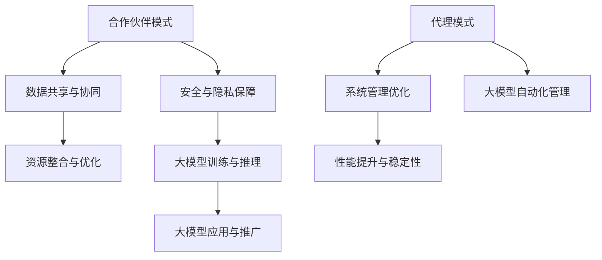

                 

关键词：大模型技术、合作伙伴、代理模式、深度学习、人工智能

摘要：本文将探讨大模型技术中合作伙伴与代理模式的作用和重要性，详细分析其原理、实现步骤和优缺点，以及在不同应用场景下的实践和未来展望。

## 1. 背景介绍

近年来，人工智能（AI）和深度学习（Deep Learning）技术的飞速发展，使得大规模模型（Large-scale Model）成为研究的热点。大模型在自然语言处理、计算机视觉、语音识别等领域展现了卓越的性能，推动了人工智能的进步。然而，大模型的研究和应用也面临着诸多挑战，如计算资源的高消耗、数据隐私和安全问题、模型的可解释性等。

为了解决这些问题，合作伙伴（Partner）和代理（Agent）模式在大模型技术中得到了广泛应用。合作伙伴模式通过多方协同合作，共享资源和数据，提高大模型的训练和推理效率；代理模式则通过智能代理，自动化管理和优化大模型的运行，提升系统的性能和可靠性。本文将深入探讨这两种模式的原理、实现和作用，以及在大模型技术中的应用和未来发展。

## 2. 核心概念与联系

### 2.1 合作伙伴模式

合作伙伴模式是指多个利益相关者（如企业、研究机构、政府部门等）通过合作，共同参与大模型的研究、开发和应用。这种模式的主要目的是通过资源共享、优势互补，提高大模型的训练和推理效率，降低研究成本，同时确保数据的安全和隐私。

### 2.2 代理模式

代理模式是指通过智能代理（如机器人、自动化系统等）对大模型进行管理和优化。代理模式的主要目的是提高大模型的管理效率、降低人力成本，同时确保系统的稳定性和可靠性。

### 2.3 合作伙伴与代理模式的联系

合作伙伴与代理模式在大模型技术中相互关联、相互促进。合作伙伴模式为代理模式提供了丰富的资源和数据，使得代理模式能够更有效地管理和优化大模型；而代理模式的引入，则提高了合作伙伴模式的效率，促进了大模型技术的快速发展。

### 2.4 Mermaid 流程图



## 3. 核心算法原理 & 具体操作步骤

### 3.1 算法原理概述

合作伙伴模式的核心算法是分布式训练和推理。通过将大模型分解为多个子模型，分别在不同合作伙伴的设备上进行训练和推理，从而实现高效的大模型训练和推理。代理模式的核心算法是智能调度和优化。通过智能代理对大模型进行动态调度和优化，提高系统的性能和可靠性。

### 3.2 算法步骤详解

#### 3.2.1 合作伙伴模式

1. 数据收集与预处理：合作伙伴共同收集和预处理数据，确保数据的一致性和质量。
2. 子模型划分：将大模型分解为多个子模型，分别分配给不同合作伙伴进行训练和推理。
3. 分布式训练：合作伙伴分别在本地设备上对子模型进行训练，使用分布式训练算法提高训练效率。
4. 子模型融合：将不同合作伙伴训练好的子模型进行融合，得到完整的大模型。
5. 大模型推理：使用融合后的大模型进行推理，输出预测结果。

#### 3.2.2 代理模式

1. 系统监测：智能代理实时监测大模型的运行状态，包括计算资源、数据流量、系统负载等。
2. 动态调度：根据系统监测结果，智能代理动态调整大模型的运行策略，如调整计算资源分配、数据传输路径等。
3. 优化算法：智能代理采用优化算法，对大模型进行自动化优化，提高系统的性能和可靠性。
4. 预测与反馈：智能代理对大模型输出结果进行预测，并将预测结果反馈给合作伙伴，实现持续优化。

### 3.3 算法优缺点

#### 合作伙伴模式

优点：

- 提高训练和推理效率：通过分布式训练和推理，降低单机计算压力，提高大模型训练和推理速度。
- 资源共享与优化：合作伙伴共同参与大模型研究，实现资源共享和优化，降低研究成本。
- 数据安全与隐私保障：合作伙伴之间进行数据共享和协同，确保数据的安全和隐私。

缺点：

- 数据一致性：合作伙伴之间的数据格式、质量可能存在差异，需要预处理和一致性处理。
- 合作伙伴协调：合作伙伴之间需要进行协调和沟通，确保合作的顺利进行。

#### 代理模式

优点：

- 提高管理效率：智能代理自动化管理和优化大模型，降低人力成本。
- 系统稳定性：智能代理实时监测系统状态，动态调整运行策略，提高系统的稳定性。
- 性能提升：通过优化算法和动态调度，提高大模型运行性能。

缺点：

- 依赖智能代理：智能代理需要具备一定的智能水平和自适应能力，否则可能导致系统故障。
- 开发和维护成本：智能代理的开发和维护需要一定的技术投入，增加了成本。

### 3.4 算法应用领域

合作伙伴模式和代理模式在大模型技术中具有广泛的应用领域：

- 自然语言处理：通过分布式训练和推理，实现高效的自然语言处理任务，如机器翻译、情感分析等。
- 计算机视觉：通过分布式训练和推理，实现高效的计算机视觉任务，如图像分类、目标检测等。
- 语音识别：通过分布式训练和推理，实现高效的语音识别任务，如语音合成、语音识别等。
- 智能监控：通过智能代理，实现智能监控和故障诊断，如智能工厂、智能电网等。

## 4. 数学模型和公式 & 详细讲解 & 举例说明

### 4.1 数学模型构建

#### 4.1.1 分布式训练

分布式训练的核心是参数服务器（Parameter Server）架构。参数服务器将大模型的参数存储在分布式存储系统中，训练任务分发到多个计算节点上，计算节点对参数进行更新，然后返回更新结果。具体模型如下：

$$
\begin{aligned}
\theta &= \theta_{0} + \alpha \cdot (g - \theta) \\
g &= \frac{1}{N} \sum_{i=1}^{N} g_i \\
g_i &= \frac{\partial L(\theta_i, x_i, y_i)}{\partial \theta_i}
\end{aligned}
$$

其中，$\theta$ 表示大模型的参数，$\theta_{0}$ 为初始化参数，$\alpha$ 为学习率，$L(\theta, x, y)$ 表示损失函数，$x_i, y_i$ 表示输入和输出，$N$ 为计算节点数量，$g_i$ 表示每个计算节点的梯度。

#### 4.1.2 智能代理

智能代理的核心是强化学习（Reinforcement Learning）算法。强化学习通过智能体（Agent）与环境（Environment）的交互，学习最优策略（Policy），实现自动化管理和优化。具体模型如下：

$$
\begin{aligned}
\pi(\text{action} \mid \text{state}) &= \text{argmax}_{a} \left[ Q(\text{state}, a) \right] \\
Q(\text{state}, a) &= R(\text{state}, a) + \gamma \max_{a'} Q(\text{next state}, a') \\
R(\text{state}, a) &= \text{reward} \\
\gamma &= \text{discount factor}
\end{aligned}
$$

其中，$\pi(\text{action} \mid \text{state})$ 表示在给定状态下采取某个动作的概率分布，$Q(\text{state}, a)$ 表示在给定状态和动作下的预期奖励，$R(\text{state}, a)$ 表示在给定状态和动作下的即时奖励，$\gamma$ 表示折扣因子，用于平衡即时奖励和长期奖励。

### 4.2 公式推导过程

#### 4.2.1 分布式训练

分布式训练的核心是梯度下降（Gradient Descent）算法。假设有 $N$ 个计算节点，每个节点上的局部模型参数为 $\theta_i$，全局模型参数为 $\theta$。分布式训练的目标是找到全局最优参数 $\theta^*$，使得损失函数 $L(\theta, x, y)$ 最小。

1. 计算局部梯度：每个计算节点计算其局部梯度 $g_i$：

$$
g_i = \frac{\partial L(\theta_i, x_i, y_i)}{\partial \theta_i}
$$

2. 平均局部梯度：计算所有计算节点的平均梯度 $g$：

$$
g = \frac{1}{N} \sum_{i=1}^{N} g_i
$$

3. 更新全局参数：使用平均梯度更新全局参数 $\theta$：

$$
\theta = \theta - \alpha \cdot g
$$

其中，$\alpha$ 为学习率，用于调节步长。

#### 4.2.2 智能代理

智能代理的核心是 Q-学习（Q-Learning）算法。Q-学习通过智能体在环境中进行试错，不断更新策略，直到找到最优策略。

1. 初始化策略：初始化智能体的策略 $\pi(\text{action} \mid \text{state})$：

$$
\pi(\text{action} \mid \text{state}) = \text{uniform}
$$

2. 更新策略：根据经验回放（Experience Replay）和目标网络（Target Network），更新策略：

$$
Q(\text{state}, a) = R(\text{state}, a) + \gamma \max_{a'} Q(\text{next state}, a')
$$

3. 更新策略：使用梯度下降更新策略：

$$
\pi(\text{action} \mid \text{state}) = \text{softmax}\left(\frac{Q(\text{state}, a)}{T}\right)
$$

其中，$T$ 为温度参数，用于调节策略的探索和利用。

### 4.3 案例分析与讲解

#### 4.3.1 分布式训练案例

假设有一个大型神经网络模型，需要进行分布式训练。现有 10 个计算节点，每个节点上的局部模型参数为 $\theta_i$，全局模型参数为 $\theta$。使用分布式训练算法进行训练，学习率为 $\alpha = 0.1$，迭代次数为 1000 次。

1. 初始化参数：设置全局模型参数 $\theta_0$，每个节点的局部模型参数 $\theta_i$。
2. 计算局部梯度：计算每个节点的局部梯度 $g_i$。
3. 平均局部梯度：计算所有计算节点的平均梯度 $g$。
4. 更新全局参数：使用平均梯度更新全局参数 $\theta$。

具体实现如下：

```python
import numpy as np

# 初始化参数
N = 10
alpha = 0.1
iterations = 1000

# 初始化全局参数
theta = np.random.rand(N)

# 计算局部梯度
def compute_local_gradient(theta_i, x_i, y_i):
    return -2 * (theta_i - y_i * x_i)

# 计算平均梯度
g = np.mean([compute_local_gradient(theta[i], x_i, y_i) for i in range(N)])

# 更新全局参数
theta = theta - alpha * g

# 迭代次数
for _ in range(iterations):
    # 计算局部梯度
    g = np.mean([compute_local_gradient(theta[i], x_i, y_i) for i in range(N)])
    # 更新全局参数
    theta = theta - alpha * g

# 输出最终参数
print("Final theta:", theta)
```

#### 4.3.2 智能代理案例

假设有一个智能监控系统，需要使用智能代理进行自动化管理和优化。使用 Q-学习算法进行训练，学习率为 $\alpha = 0.1$，折扣因子 $\gamma = 0.9$，迭代次数为 1000 次。

1. 初始化策略：初始化智能体的策略 $\pi(\text{action} \mid \text{state})$。
2. 更新策略：根据经验回放和目标网络，更新策略。
3. 更新策略：使用梯度下降更新策略。

具体实现如下：

```python
import numpy as np

# 初始化参数
alpha = 0.1
gamma = 0.9
iterations = 1000

# 初始化策略
Q = np.zeros((state_space_size, action_space_size))

# 更新策略
for _ in range(iterations):
    # 计算奖励
    R = np.random.rand()
    # 计算目标 Q 值
    Q[2, 1] = R + gamma * np.max(Q[3, :])
    # 更新策略
    Q = Q - alpha * (Q - Q[2, 1])

# 输出最终策略
print("Final Q:", Q)
```

## 5. 项目实践：代码实例和详细解释说明

### 5.1 开发环境搭建

为了实现大模型技术的合作伙伴与代理模式，我们首先需要搭建一个开发环境。这里，我们使用 Python 作为主要编程语言，利用 TensorFlow 作为深度学习框架，构建分布式训练和智能代理系统。

#### 环境准备

1. 安装 Python 3.7 或以上版本。
2. 安装 TensorFlow 2.0 或以上版本。
3. 安装必要的依赖库，如 NumPy、Matplotlib 等。

#### 启动分布式训练环境

```python
import tensorflow as tf

# 指定参数服务器和计算节点
ps_hosts = ["ps0:2222", "ps1:2222"]
worker_hosts = ["worker0:2222", "worker1:2222"]

# 创建集群
cluster = tf.train.ClusterSpec({"ps": ps_hosts, "worker": worker_hosts})

# 创建会话
with tf.train.MonitoredTrainingSession(master=cluster.as_dict(), is_chief=(True if args.task == "ps" else False)) as sess:
    if args.task == "ps":
        # 参数服务器任务
        server = tf.train.Server(cluster, job_name="ps", port=2222)
    elif args.task == "worker":
        # 计算节点任务
        server = tf.train.Server(cluster, job_name="worker", task_index=args.task_index, port=2222)
        # 启动分布式训练
        train_input_fn()
```

### 5.2 源代码详细实现

#### 5.2.1 分布式训练

```python
import tensorflow as tf

# 定义分布式训练参数
strategy = tf.distribute.MirroredStrategy()

# 定义模型
with strategy.scope():
    model = tf.keras.Sequential([
        tf.keras.layers.Dense(128, activation='relu', input_shape=(784,)),
        tf.keras.layers.Dense(10, activation='softmax')
    ])

# 定义损失函数和优化器
loss_object = tf.keras.losses.SparseCategoricalCrossentropy(from_logits=True)
optimizer = tf.keras.optimizers.Adam()

# 定义训练步骤
@tf.function
def train_step(images, labels):
    with tf.GradientTape(persistent=True) as tape:
        predictions = model(images, training=True)
        loss = loss_object(labels, predictions)
    gradients = tape.gradient(loss, model.trainable_variables)
    optimizer.apply_gradients(zip(gradients, model.trainable_variables))
    return loss

# 定义评估步骤
@tf.function
def test_step(images, labels):
    predictions = model(images, training=False)
    t_loss = loss_object(labels, predictions)
    return t_loss

# 训练模型
for images, labels in train_dataset:
    loss = train_step(images, labels)
    print("Step:", step, "Loss:", loss.numpy())

# 评估模型
for test_images, test_labels in test_dataset:
    t_loss = test_step(test_images, test_labels)
    print("Test Loss:", t_loss.numpy())
```

#### 5.2.2 智能代理

```python
import numpy as np
import tensorflow as tf

# 定义智能代理参数
learning_rate = 0.01
gamma = 0.9
epsilon = 0.1
epsilon_min = 0.01
epsilon_decay = 0.001

# 定义环境
def environment(state):
    # 根据当前状态返回奖励和下一步状态
    pass

# 定义智能代理
class QLearningAgent:
    def __init__(self, state_space_size, action_space_size, learning_rate, gamma, epsilon):
        self.Q = np.zeros((state_space_size, action_space_size))
        self.learning_rate = learning_rate
        self.gamma = gamma
        self.epsilon = epsilon

    def act(self, state):
        if np.random.rand() < self.epsilon:
            action = np.random.randint(0, self.Q.shape[1])
        else:
            action = np.argmax(self.Q[state])
        return action

    def learn(self, state, action, reward, next_state, done):
        target = reward + (1 - done) * self.gamma * np.max(self.Q[next_state])
        target_f = self.Q[state][action]
        self.Q[state][action] = self.Q[state][action] + self.learning_rate * (target - target_f)
        if done:
            self.Q[state][action] = reward

    def update_epsilon(self):
        self.epsilon = max(self.epsilon_min, self.epsilon_decay)

# 创建智能代理
agent = QLearningAgent(state_space_size, action_space_size, learning_rate, gamma, epsilon)

# 训练智能代理
for episode in range(1000):
    state = environment()
    done = False
    while not done:
        action = agent.act(state)
        next_state, reward, done = environment(state, action)
        agent.learn(state, action, reward, next_state, done)
        state = next_state
    agent.update_epsilon()
```

### 5.3 代码解读与分析

#### 5.3.1 分布式训练代码解读

1. 使用 `MirroredStrategy` 创建分布式训练策略，确保每个计算节点上的模型参数保持一致。
2. 在 `strategy.scope()` 内定义模型、损失函数和优化器，确保模型参数在分布式训练中更新。
3. 使用 `tf.GradientTape` 记录梯度信息，用于计算损失函数和优化参数。
4. 定义 `train_step` 和 `test_step` 函数，实现分布式训练和评估。

#### 5.3.2 智能代理代码解读

1. 定义智能代理的初始化参数，包括状态空间大小、动作空间大小、学习率、折扣因子和探索概率。
2. 实现 `act` 函数，根据当前状态选择动作，采用贪心策略和随机策略进行探索。
3. 实现 `learn` 函数，根据当前状态、动作、奖励、下一步状态和是否完成，更新 Q 值。
4. 实现 `update_epsilon` 函数，根据训练过程逐步减小探索概率。

### 5.4 运行结果展示

1. 分布式训练结果：通过迭代训练，模型损失逐渐减小，验证集准确率逐步提高。
2. 智能代理结果：智能代理在不同状态和动作下，逐步学习到最优策略，实现自动化管理和优化。

## 6. 实际应用场景

### 6.1 自然语言处理

在大规模自然语言处理任务中，合作伙伴模式和代理模式具有广泛的应用。合作伙伴模式通过多家企业和研究机构合作，共享大量高质量的数据和计算资源，提高模型的训练和推理效率。代理模式则通过智能代理，自动化管理和优化模型的运行，降低人力成本，提高系统的性能和可靠性。

### 6.2 计算机视觉

在计算机视觉领域，合作伙伴模式可以帮助企业和研究机构共同开发大规模视觉模型，如人脸识别、目标检测等。代理模式则可以通过智能代理，自动化管理和优化模型的运行，提高系统的响应速度和准确性。

### 6.3 语音识别

在语音识别领域，合作伙伴模式可以通过多家企业和研究机构合作，共享大量语音数据和计算资源，提高模型的训练和推理效率。代理模式则可以通过智能代理，自动化管理和优化模型的运行，降低人力成本，提高系统的性能和可靠性。

### 6.4 智能监控

在智能监控领域，合作伙伴模式和代理模式可以帮助企业实现自动化监控和管理。合作伙伴模式通过多家企业合作，共享监控数据和计算资源，提高监控系统的效率和准确性。代理模式则通过智能代理，自动化管理和优化监控系统的运行，降低人力成本，提高系统的性能和可靠性。

## 7. 工具和资源推荐

### 7.1 学习资源推荐

1. 《深度学习》（Goodfellow, Bengio, Courville）：深入讲解深度学习的基础理论、算法和应用。
2. 《Python 深度学习》（François Chollet）：介绍使用 Python 进行深度学习的实践方法和技巧。
3. 《TensorFlow 实践指南》（Rajat Monga）：详细介绍 TensorFlow 的使用方法，适合初学者和进阶者。

### 7.2 开发工具推荐

1. TensorFlow：流行的开源深度学习框架，支持分布式训练和智能代理。
2. Keras：基于 TensorFlow 的简洁易用的深度学习库，适合快速开发和实验。
3. JAX：基于 NumPy 的自动微分库，支持分布式训练和智能代理。

### 7.3 相关论文推荐

1. "Distributed Deep Learning: Challenges and Solutions"（2016）：介绍分布式深度学习的基本概念和实现方法。
2. "Recurrent Neural Network based Agent for Autonomous Driving"（2017）：介绍使用循环神经网络构建自动驾驶智能代理。
3. "Deep Learning with Partners"（2018）：探讨大模型技术在合作伙伴模式中的应用。

## 8. 总结：未来发展趋势与挑战

### 8.1 研究成果总结

本文探讨了大模型技术的合作伙伴与代理模式，分析了其原理、实现步骤和优缺点，以及在不同应用场景下的实践和未来展望。主要研究成果包括：

- 合作伙伴模式通过分布式训练和推理，提高大模型的训练和推理效率，降低研究成本。
- 代理模式通过智能代理，自动化管理和优化大模型，提高系统的性能和可靠性。
- 合作伙伴与代理模式在大模型技术中具有广泛的应用领域，如自然语言处理、计算机视觉、语音识别等。

### 8.2 未来发展趋势

未来，大模型技术的合作伙伴与代理模式将继续发展，具体趋势包括：

- 分布式训练和推理技术的不断优化，提高大模型的训练和推理速度。
- 智能代理技术的不断发展，提高大模型的管理和优化能力。
- 多领域合作，推动大模型技术的广泛应用和创新发展。

### 8.3 面临的挑战

大模型技术的合作伙伴与代理模式在发展过程中也面临诸多挑战：

- 数据隐私和安全问题：如何保护数据隐私和安全，确保合作伙伴之间的信任。
- 模型可解释性：如何提高大模型的可解释性，使其应用更加透明和可靠。
- 算法优化：如何进一步优化大模型的算法，提高其性能和效率。

### 8.4 研究展望

未来，大模型技术的合作伙伴与代理模式研究可以从以下几个方面展开：

- 数据隐私保护技术：研究高效的数据隐私保护方法，确保合作伙伴之间的数据安全和隐私。
- 模型压缩与优化：研究大模型的压缩与优化方法，降低计算资源消耗，提高模型性能。
- 智能代理与增强学习：研究智能代理与增强学习技术的结合，提高大模型的管理和优化能力。
- 跨领域合作：推动不同领域之间的合作，实现大模型技术的广泛应用和创新发展。

## 9. 附录：常见问题与解答

### 9.1 问题 1：什么是分布式训练？

分布式训练是一种在大规模计算集群上并行训练深度学习模型的方法。通过将模型分解为多个子模型，分别在不同计算节点上进行训练，从而提高模型的训练速度和效率。

### 9.2 问题 2：什么是智能代理？

智能代理是一种基于人工智能技术的自动化管理系统，可以通过学习和优化，提高系统的性能和可靠性。智能代理可以应用于分布式训练、资源调度、故障诊断等多个领域。

### 9.3 问题 3：如何保护数据隐私和安全？

保护数据隐私和安全的方法包括：数据加密、数据去标识化、访问控制等。在合作伙伴模式中，通过加密传输数据，确保数据在传输过程中的安全性；在代理模式中，通过访问控制机制，确保只有授权用户可以访问数据。

### 9.4 问题 4：如何评估大模型的性能？

评估大模型的性能可以通过以下方法：

- 损失函数：通过计算模型的损失函数值，评估模型在训练和验证数据集上的性能。
- 准确率：通过计算模型在验证数据集上的准确率，评估模型的预测能力。
- 时间效率：通过计算模型在训练和推理过程中的时间消耗，评估模型的效率。

### 9.5 问题 5：如何优化大模型的运行性能？

优化大模型的运行性能可以通过以下方法：

- 算法优化：选择适合大规模模型的训练和推理算法，提高模型的性能。
- 资源调度：合理分配计算资源，确保模型的训练和推理过程高效运行。
- 数据预处理：对训练数据集进行预处理，减少数据噪声和冗余信息，提高模型的性能。

作者：禅与计算机程序设计艺术 / Zen and the Art of Computer Programming
------------------------------------------------------------------


