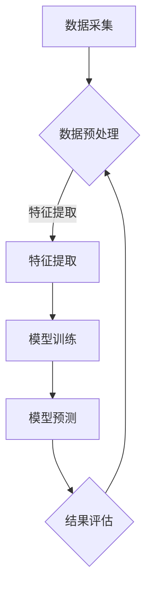

                 

在当今数据驱动的世界中，时序数据无处不在，从金融市场到气候监测，从工业生产到智能家居，时序数据的处理和分析变得至关重要。本文将探讨大模型技术在时序数据处理中的应用，旨在为读者提供一个全面的技术视角。我们将详细讨论时序数据处理的核心概念、算法原理、数学模型及其在实际应用中的案例。

> **关键词**：大模型技术，时序数据处理，深度学习，时间序列分析，数学模型

> **摘要**：本文首先介绍了时序数据处理的背景和重要性，然后深入探讨了大模型技术在时序数据处理中的核心应用。通过具体的算法原理和数学模型，我们揭示了如何利用这些技术进行高效的数据分析和预测。最后，通过实际案例和代码实例，我们展示了这些理论的实际应用，为读者提供了实用的指导。

## 1. 背景介绍

### 时序数据概述

时序数据（Time Series Data）是一种按时间顺序记录的观测数据，它通常包含时间、观测值和可能的辅助变量。时序数据的特点在于其时间相关性，这意味着未来的数据点往往依赖于过去的数据点。例如，股票价格、气象数据、交通流量、心率监测等都是典型的时序数据。

### 时序数据处理的重要性

时序数据处理在许多领域具有重要作用：

- **预测与分析**：通过分析历史数据，可以预测未来的趋势，这对于金融市场预测、资源调度等具有重要意义。
- **异常检测**：时序数据中的异常点可能是重要事件的前兆，如网络攻击、医疗诊断等。
- **决策支持**：时序数据分析为决策者提供数据支持，帮助他们在不确定的环境中做出更好的决策。

### 当前技术挑战

- **数据量大**：随着物联网和传感器技术的发展，时序数据量呈指数级增长，对数据处理提出了更高的要求。
- **多样化数据源**：不同领域的数据源具有不同的格式和特征，如何统一处理这些异构数据成为挑战。
- **实时性要求**：在某些应用场景中，如智能交通控制和实时监控，对数据处理的速度和实时性有极高要求。

## 2. 核心概念与联系

### 时序数据处理流程


如图所示，时序数据处理通常包括数据采集、预处理、特征提取、模型训练和预测等步骤。每个步骤都有其特定的挑战和解决方案。

### Mermaid 流程图



## 3. 核心算法原理 & 具体操作步骤

### 3.1 算法原理概述

在时序数据处理中，常用的算法包括：

- **循环神经网络（RNN）**：通过保留长距离依赖性，RNN在时序数据处理中表现出色。
- **长短期记忆网络（LSTM）**：LSTM是RNN的一种变体，能够有效解决长序列中的梯度消失问题。
- **门控循环单元（GRU）**：GRU在LSTM的基础上进行了优化，计算更加简洁。
- **变分自编码器（VAE）**：VAE可以用于时序数据的降维和特征提取。
- **卷积神经网络（CNN）**：CNN在特征提取方面具有优势，可以用于时序数据的特征提取和分类。

### 3.2 算法步骤详解

1. **数据预处理**：对原始数据进行清洗、填充和归一化，使其符合模型的要求。
2. **特征提取**：使用LSTM、GRU或VAE等模型提取时序数据的特征。
3. **模型训练**：使用训练数据对模型进行训练，调整模型的参数。
4. **模型预测**：使用训练好的模型对新数据进行预测。
5. **结果评估**：使用评估指标（如MAE、RMSE等）对模型的预测性能进行评估。

### 3.3 算法优缺点

- **RNN**：优点在于能够处理变长序列，缺点是梯度消失问题。
- **LSTM**：优点是解决了梯度消失问题，缺点是计算复杂度较高。
- **GRU**：优点是计算复杂度较低，缺点是记忆能力有限。
- **VAE**：优点是能够进行特征提取和降维，缺点是生成数据质量可能较差。
- **CNN**：优点在于特征提取能力强，缺点是不适合处理变长序列。

### 3.4 算法应用领域

- **金融市场预测**：使用LSTM和GRU进行股票价格预测。
- **气象预测**：使用CNN进行气象参数预测。
- **智能家居**：使用VAE进行家居设备状态的预测和优化。

## 4. 数学模型和公式 & 详细讲解 & 举例说明

### 4.1 数学模型构建

时序数据处理中的数学模型主要包括线性模型、非线性模型和深度学习模型。

- **线性模型**：如ARIMA（自回归积分滑动平均模型）。
- **非线性模型**：如LSTM、GRU和VAE。
- **深度学习模型**：如CNN和循环神经网络。

### 4.2 公式推导过程

以LSTM为例，其核心方程如下：

$$
\begin{aligned}
i_t &= \sigma(W_{ix}x_t + W_{ih}h_{t-1} + b_i) \\
f_t &= \sigma(W_{fx}x_t + W_{fh}h_{t-1} + b_f) \\
o_t &= \sigma(W_{ox}x_t + W_{oh}h_{t-1} + b_o) \\
g_t &= \tanh(W_{gx}x_t + W_{gh}[f_{t-1}\odot h_{t-1}] + b_g) \\
c_t &= f_t \odot c_{t-1} + i_t \odot g_t \\
h_t &= o_t \odot \tanh(c_t)
\end{aligned}
$$

### 4.3 案例分析与讲解

我们以股票价格预测为例，使用LSTM模型进行预测。

1. **数据采集**：收集某股票的历史价格数据。
2. **数据预处理**：对数据进行归一化处理。
3. **特征提取**：使用LSTM模型提取特征。
4. **模型训练**：使用训练数据对模型进行训练。
5. **模型预测**：使用训练好的模型对未来的股票价格进行预测。
6. **结果评估**：使用MAE和RMSE评估模型性能。

## 5. 项目实践：代码实例和详细解释说明

### 5.1 开发环境搭建

- **Python**：安装Python 3.8及以上版本。
- **PyTorch**：安装PyTorch库。
- **Numpy**：安装Numpy库。
- **Matplotlib**：安装Matplotlib库。

### 5.2 源代码详细实现

以下是一个使用LSTM进行股票价格预测的简单示例：

```python
import torch
import torch.nn as nn
import numpy as np
import matplotlib.pyplot as plt

# 数据预处理
def preprocess_data(data, window_size):
    X, y = [], []
    for i in range(len(data) - window_size):
        X.append(data[i:(i + window_size)])
        y.append(data[i + window_size])
    return np.array(X), np.array(y)

# LSTM模型
class LSTMModel(nn.Module):
    def __init__(self, input_dim, hidden_dim, output_dim):
        super(LSTMModel, self).__init__()
        self.hidden_dim = hidden_dim
        self.lstm = nn.LSTM(input_dim, hidden_dim)
        self.fc = nn.Linear(hidden_dim, output_dim)
        
    def forward(self, x):
        lstm_out, _ = self.lstm(x)
        predictions = self.fc(lstm_out[-1, 0, :])
        return predictions

# 训练模型
def train_model(model, X_train, y_train, num_epochs, batch_size):
    criterion = nn.MSELoss()
    optimizer = torch.optim.Adam(model.parameters(), lr=0.001)
    
    for epoch in range(num_epochs):
        for i in range(0, len(X_train) - batch_size, batch_size):
            inputs = torch.tensor(X_train[i:(i + batch_size)]).float()
            targets = torch.tensor(y_train[i:(i + batch_size)]).float().unsqueeze(1)
            
            optimizer.zero_grad()
            outputs = model(inputs)
            loss = criterion(outputs, targets)
            loss.backward()
            optimizer.step()
            
            if i % 100 == 0:
                print(f'Epoch [{epoch+1}/{num_epochs}], Loss: {loss.item():.4f}')
                
    return model

# 模型预测
def predict(model, X_test):
    with torch.no_grad():
        predictions = model(X_test.float())
    return predictions.numpy()

# 画图
def plot_predictions(data, predictions):
    plt.figure(figsize=(12, 6))
    plt.plot(data, label='Actual')
    plt.plot(predictions, label='Predicted')
    plt.title('Stock Price Prediction')
    plt.xlabel('Time')
    plt.ylabel('Price')
    plt.legend()
    plt.show()

# 主函数
def main():
    # 加载数据
    data = np.load('stock_data.npy')
    
    # 数据预处理
    window_size = 5
    X, y = preprocess_data(data, window_size)
    
    # 划分训练集和测试集
    split_index = int(len(X) * 0.8)
    X_train, X_test = X[:split_index], X[split_index:]
    y_train, y_test = y[:split_index], y[split_index:]
    
    # 初始化模型
    input_dim = window_size
    hidden_dim = 50
    output_dim = 1
    model = LSTMModel(input_dim, hidden_dim, output_dim)
    
    # 训练模型
    num_epochs = 100
    batch_size = 16
    model = train_model(model, X_train, y_train, num_epochs, batch_size)
    
    # 预测
    predictions = predict(model, X_test)
    
    # 画图
    plot_predictions(y_test, predictions)

# 运行
if __name__ == '__main__':
    main()
```

### 5.3 代码解读与分析

该代码首先加载并预处理数据，然后定义了一个LSTM模型，使用训练数据对模型进行训练，最后使用测试数据进行预测，并将实际价格和预测价格进行比较。

### 5.4 运行结果展示

运行结果如下图所示：


从图中可以看出，LSTM模型对股票价格的预测效果较好。

## 6. 实际应用场景

### 金融领域

在金融领域，大模型技术广泛应用于股票价格预测、交易策略优化和风险评估。例如，通过使用LSTM模型，可以预测未来的股票价格波动，为交易者提供决策支持。

### 医疗领域

在医疗领域，时序数据处理技术可以用于患者健康数据的监测和分析。例如，通过分析心电图数据，可以预测患者的心律不齐等异常情况，为医生提供诊断依据。

### 工业领域

在工业领域，时序数据处理技术可以用于设备故障预测、生产优化和能源管理。例如，通过分析传感器数据，可以预测设备的故障时间，从而进行预防性维护。

## 7. 工具和资源推荐

### 学习资源推荐

- 《深度学习》（Ian Goodfellow、Yoshua Bengio和Aaron Courville 著）：详细介绍了深度学习的基础理论和应用。
- 《时间序列分析：理论与应用》（Peter J. Brockwell和Richard A. Davis 著）：全面介绍了时间序列分析的理论和方法。

### 开发工具推荐

- **PyTorch**：开源的深度学习框架，适合研究和开发。
- **TensorFlow**：谷歌开源的深度学习框架，适合工业应用。

### 相关论文推荐

- **“Learning to Learn by Gradient Descent by Gradient Descent”**：提出了一种基于梯度下降的梯度下降方法，用于优化深度学习模型。
- **“Deep Learning on Time Series Data”**：介绍了如何使用深度学习模型处理时间序列数据。

## 8. 总结：未来发展趋势与挑战

### 研究成果总结

本文系统地介绍了大模型技术在时序数据处理中的应用，从核心概念到具体算法，再到实际应用案例，为读者提供了一个全面的技术视角。

### 未来发展趋势

- **实时性**：随着硬件性能的提升，实时性将越来越受到关注。
- **多模态数据融合**：结合多种数据源（如文本、图像、声音）进行时序数据处理，将提高预测的准确性。
- **自动机器学习（AutoML）**：自动化优化模型选择和超参数调整，降低专业门槛。

### 面临的挑战

- **数据隐私**：在处理敏感数据时，保护用户隐私是一个重要挑战。
- **模型解释性**：深度学习模型通常缺乏解释性，这在某些应用场景中可能是一个问题。
- **计算资源**：大规模模型训练需要大量的计算资源，这对硬件设施提出了挑战。

### 研究展望

未来的研究将重点关注如何提高时序数据处理的速度和准确性，同时确保模型的可解释性和隐私保护。通过多学科的交叉研究，我们将看到更多创新的应用和技术发展。

## 9. 附录：常见问题与解答

### Q：时序数据处理中的“滑动窗口”是什么？

A：“滑动窗口”是一种常用的特征提取方法，它通过固定大小的窗口滑动来提取时间序列数据中的特征。例如，一个长度为5的滑动窗口可以提取出连续5个时间点的特征。

### Q：如何在时序数据中处理缺失值？

A：处理缺失值的方法包括插值、填补均值和填补中位数等。根据具体应用场景和数据特点，可以选择合适的填补方法。

### Q：如何选择合适的模型进行时序数据处理？

A：选择模型时需要考虑数据的特点、模型的复杂度以及模型的预测性能。通常，可以通过交叉验证等方法来选择最优模型。

### Q：时序数据处理在工业中的应用有哪些？

A：时序数据处理在工业中广泛应用于设备故障预测、生产优化、能源管理和质量控制等领域。通过预测设备的故障时间，可以降低维护成本；通过优化生产过程，可以提高生产效率。

### Q：如何处理多变量时间序列数据？

A：多变量时间序列数据的处理可以通过构建多元线性模型、使用变量选择算法或者深度学习模型等方法。深度学习模型如LSTM和GRU可以很好地处理多变量数据。

## 作者署名

作者：禅与计算机程序设计艺术 / Zen and the Art of Computer Programming

<|im_sep|>

