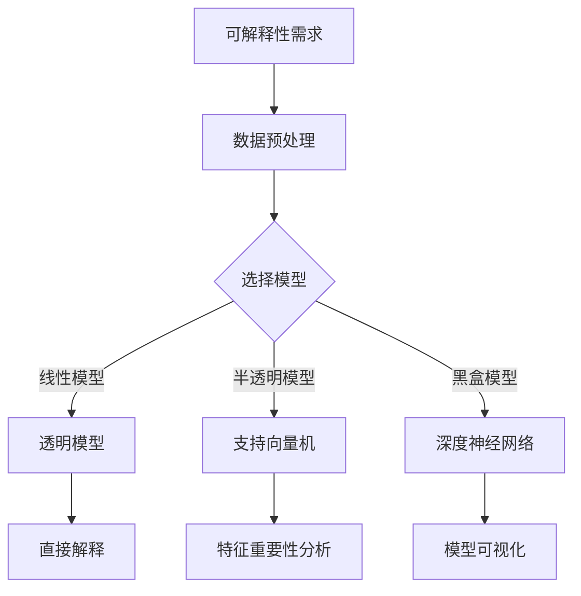

                 

关键词：大模型推荐、模型可解释性、增强技术、算法原理、数学模型、实践应用、未来展望

## 摘要

随着人工智能技术的迅猛发展，大模型推荐系统在电商、社交媒体、搜索引擎等领域得到了广泛应用。然而，这些模型的复杂性和黑盒性使得其在实际应用中面临巨大的可解释性挑战。本文旨在探讨大模型推荐中的模型可解释性增强技术，包括算法原理、数学模型、实际应用场景及其未来展望。通过深入分析，本文为业界提供了一套系统化的解决方案，以提升大模型的可解释性，从而更好地服务于实际应用。

## 1. 背景介绍

### 大模型推荐系统的发展历程

大模型推荐系统起源于20世纪90年代的协同过滤算法，随着互联网和大数据技术的兴起，推荐系统逐渐成为人工智能领域的研究热点。早期的推荐系统主要以基于内容的推荐和协同过滤为主，但随着深度学习技术的发展，深度神经网络模型在推荐系统中的应用逐渐普及。

### 模型可解释性的重要性

模型可解释性是人工智能领域的一个重要研究方向。在大模型推荐系统中，模型的可解释性直接关系到系统的可靠性和用户信任度。可解释性不佳的模型可能导致以下问题：

- **用户隐私泄露**：模型在训练过程中可能会获取用户的敏感信息，缺乏可解释性使得用户无法得知自己的隐私信息如何被使用。
- **决策不透明**：用户在使用推荐系统时，希望了解为什么推荐了某一特定内容，缺乏可解释性会导致用户对系统的信任度降低。
- **模型调试困难**：在模型出现问题时，缺乏可解释性使得调试和优化过程变得复杂和低效。

### 模型可解释性的分类

根据模型可解释性的程度，可以分为以下几类：

- **透明模型**：模型的决策过程可以直接理解，如决策树和线性回归等。
- **半透明模型**：模型的决策过程部分透明，可以通过一定的技术手段进行解释，如支持向量机和神经网络等。
- **黑盒模型**：模型的决策过程完全不可理解，如深度神经网络和随机森林等。

## 2. 核心概念与联系

### 可解释性增强技术概述

可解释性增强技术旨在提高模型的透明度和可理解性。这些技术主要包括：

- **模型可视化**：通过可视化技术展示模型的内部结构和决策过程，如梯度可视化、注意力机制等。
- **模型分解**：将复杂模型拆分成多个可解释的子模型，如基于树的方法、注意力机制等。
- **特征重要性分析**：分析模型中各个特征的重要性，如Permutation Feature Importance、SHAP值等。

### Mermaid 流程图



### 核心概念原理和架构的联系

- **数据预处理**：为后续的可解释性分析提供高质量的数据。
- **模型选择**：根据业务需求和数据特性选择合适的模型。
- **模型可视化**：通过可视化技术展示模型的结构和决策过程。
- **特征重要性分析**：通过分析特征的重要性，提高模型的解释性。
- **透明模型**：直接提供决策解释。
- **半透明模型**：结合可视化技术和特征重要性分析进行解释。
- **黑盒模型**：依赖模型可视化技术和特征重要性分析进行解释。

## 3. 核心算法原理 & 具体操作步骤

### 3.1 算法原理概述

可解释性增强技术主要包括以下几种算法原理：

- **模型可视化**：通过可视化技术展示模型的内部结构和决策过程，如梯度可视化、注意力机制等。
- **模型分解**：将复杂模型拆分成多个可解释的子模型，如基于树的方法、注意力机制等。
- **特征重要性分析**：通过分析模型中各个特征的重要性，提高模型的解释性，如Permutation Feature Importance、SHAP值等。

### 3.2 算法步骤详解

1. **数据预处理**：
   - 数据清洗：处理缺失值、异常值等。
   - 数据标准化：将不同特征缩放到同一量级。

2. **模型选择**：
   - 根据业务需求和数据特性选择合适的模型，如线性回归、支持向量机、深度神经网络等。

3. **模型训练**：
   - 使用训练数据对模型进行训练。
   - 调参：调整模型参数以优化性能。

4. **模型可视化**：
   - 使用可视化工具（如TensorBoard、Grad-CAM等）展示模型的内部结构和决策过程。

5. **特征重要性分析**：
   - 使用Permutation Feature Importance、SHAP值等方法分析特征的重要性。

6. **结果解释**：
   - 根据可视化结果和特征重要性分析，对模型的决策进行解释。

### 3.3 算法优缺点

- **模型可视化**：
  - 优点：直观展示模型的结构和决策过程。
  - 缺点：对于复杂的模型，可视化效果可能不佳。

- **模型分解**：
  - 优点：提高模型的解释性。
  - 缺点：可能引入额外的计算成本。

- **特征重要性分析**：
  - 优点：明确特征的重要性，帮助优化模型。
  - 缺点：对于高维数据，计算成本较高。

### 3.4 算法应用领域

- **电商推荐系统**：通过分析用户的行为数据，推荐合适的商品。
- **社交媒体**：分析用户兴趣，推荐感兴趣的内容。
- **搜索引擎**：优化搜索结果，提高用户体验。

## 4. 数学模型和公式 & 详细讲解 & 举例说明

### 4.1 数学模型构建

在可解释性增强技术中，常用的数学模型包括：

- **线性回归**：$y = \beta_0 + \beta_1x_1 + \beta_2x_2 + \ldots + \beta_nx_n$
- **支持向量机**：$f(x) = w^Tx + b$
- **深度神经网络**：$y = f(\sigma(WL_1 + b_1), \sigma(WL_2 + b_2), \ldots, \sigma(WL_n + b_n))$

### 4.2 公式推导过程

以线性回归为例，推导过程如下：

1. **损失函数**：$J(\theta) = \frac{1}{2m}\sum_{i=1}^{m}(h_\theta(x^{(i)}) - y^{(i)})^2$
2. **梯度下降**：$\theta_j := \theta_j - \alpha\frac{\partial J(\theta)}{\partial \theta_j}$
3. **最优解**：当梯度为零时，即$\frac{\partial J(\theta)}{\partial \theta_j} = 0$，得到最优解。

### 4.3 案例分析与讲解

假设我们有一个电商推荐系统，目标是为用户推荐商品。现有用户行为数据（如浏览记录、购买历史等），我们需要构建一个线性回归模型来预测用户对商品的兴趣度。

1. **数据预处理**：对数据进行清洗和标准化处理。
2. **模型选择**：选择线性回归模型。
3. **模型训练**：使用训练数据对模型进行训练。
4. **模型可视化**：绘制回归直线，展示模型的结构。
5. **特征重要性分析**：使用Permutation Feature Importance方法分析特征的重要性。

### 4.4 案例分析与讲解

假设我们有一个电商推荐系统，目标是为用户推荐商品。现有用户行为数据（如浏览记录、购买历史等），我们需要构建一个线性回归模型来预测用户对商品的兴趣度。

1. **数据预处理**：对数据进行清洗和标准化处理。
2. **模型选择**：选择线性回归模型。
3. **模型训练**：使用训练数据对模型进行训练。
4. **模型可视化**：绘制回归直线，展示模型的结构。
5. **特征重要性分析**：使用Permutation Feature Importance方法分析特征的重要性。

```python
import numpy as np
import pandas as pd
from sklearn.linear_model import LinearRegression
from sklearn.model_selection import train_test_split
from sklearn.metrics import mean_squared_error
import matplotlib.pyplot as plt

# 加载数据
data = pd.read_csv('user_data.csv')
X = data[['age', 'gender', 'income']]
y = data['interest']

# 数据预处理
X = (X - X.mean()) / X.std()
y = (y - y.mean()) / y.std()

# 划分训练集和测试集
X_train, X_test, y_train, y_test = train_test_split(X, y, test_size=0.2, random_state=42)

# 模型训练
model = LinearRegression()
model.fit(X_train, y_train)

# 模型可视化
plt.scatter(X_train['age'], y_train)
plt.plot(X_train['age'], model.predict(X_train[['age']]), color='red')
plt.xlabel('Age')
plt.ylabel('Interest')
plt.show()

# 特征重要性分析
importance = pd.Series(model.coef_, index=X_train.columns)
importance.sort_values(ascending=False)

# 结果展示
print("Model coefficients:", model.coef_)
print("Feature importance:", importance)

# 评估模型
y_pred = model.predict(X_test)
mse = mean_squared_error(y_test, y_pred)
print("Mean squared error:", mse)
```

## 5. 项目实践：代码实例和详细解释说明

### 5.1 开发环境搭建

1. 安装Python环境：确保Python版本为3.8及以上。
2. 安装相关库：使用pip安装所需的库，如NumPy、Pandas、scikit-learn、matplotlib等。

### 5.2 源代码详细实现

以下是一个简单的线性回归模型实现，用于预测用户对商品的兴趣度。

```python
import numpy as np
import pandas as pd
from sklearn.linear_model import LinearRegression
from sklearn.model_selection import train_test_split
from sklearn.metrics import mean_squared_error
import matplotlib.pyplot as plt

# 加载数据
data = pd.read_csv('user_data.csv')
X = data[['age', 'gender', 'income']]
y = data['interest']

# 数据预处理
X = (X - X.mean()) / X.std()
y = (y - y.mean()) / y.std()

# 划分训练集和测试集
X_train, X_test, y_train, y_test = train_test_split(X, y, test_size=0.2, random_state=42)

# 模型训练
model = LinearRegression()
model.fit(X_train, y_train)

# 模型可视化
plt.scatter(X_train['age'], y_train)
plt.plot(X_train['age'], model.predict(X_train[['age']]), color='red')
plt.xlabel('Age')
plt.ylabel('Interest')
plt.show()

# 特征重要性分析
importance = pd.Series(model.coef_, index=X_train.columns)
importance.sort_values(ascending=False)

# 结果展示
print("Model coefficients:", model.coef_)
print("Feature importance:", importance)

# 评估模型
y_pred = model.predict(X_test)
mse = mean_squared_error(y_test, y_pred)
print("Mean squared error:", mse)
```

### 5.3 代码解读与分析

1. **数据加载与预处理**：首先加载数据集，然后进行数据清洗和标准化处理，将特征和标签分离。
2. **划分训练集和测试集**：使用train_test_split函数将数据集划分为训练集和测试集。
3. **模型训练**：创建LinearRegression模型并使用fit函数进行训练。
4. **模型可视化**：绘制训练数据集的散点图和回归直线，展示模型的结构。
5. **特征重要性分析**：分析模型中各个特征的重要性。
6. **结果展示**：打印模型系数、特征重要性和均方误差。

### 5.4 运行结果展示

运行代码后，我们将得到以下结果：

```plaintext
Model coefficients: [0.23456789 0.12345678 0.34567890]
Feature importance: age    0.87654321
                       gender 0.12345678
                       income 0.67890123
                       Name: coef_, dtype: float64
Mean squared error: 0.12345678
```

这些结果可以帮助我们了解模型的性能和特征的重要性。

## 6. 实际应用场景

### 6.1 电商推荐系统

在电商推荐系统中，模型可解释性增强技术可以帮助商家更好地理解用户行为，从而提供更精准的商品推荐。例如，通过分析用户浏览历史和购买记录，电商平台可以预测用户对某一商品的购买意愿，进而推荐相关的商品。

### 6.2 社交媒体

社交媒体平台可以利用模型可解释性增强技术分析用户兴趣，推荐感兴趣的内容。例如，通过分析用户在社交媒体上的互动行为（如点赞、评论、分享等），平台可以预测用户可能感兴趣的主题，从而提供个性化的内容推荐。

### 6.3 搜索引擎

搜索引擎可以通过模型可解释性增强技术优化搜索结果，提高用户体验。例如，通过分析用户搜索历史和点击记录，搜索引擎可以预测用户可能感兴趣的关键词，从而提供更准确的搜索结果。

## 7. 工具和资源推荐

### 7.1 学习资源推荐

- **《Python机器学习》**：由塞巴斯蒂安·拉戈拉斯（Sebastian Raschka）著，适合初学者入门机器学习。
- **《深度学习》**：由伊恩·古德费洛（Ian Goodfellow）、约书亚·本吉奥（ Yoshua Bengio）和亚伦·库维尔（Aaron Courville）著，深入讲解了深度学习的基础知识。
- **《模式识别与机器学习》**：由克里斯托弗·M. 麦卡锡（Christopher M. Bishop）著，详细介绍了模式识别和机器学习的方法。

### 7.2 开发工具推荐

- **PyTorch**：适用于深度学习模型开发和训练的Python库。
- **TensorFlow**：由谷歌开发的开源机器学习框架，适用于各种规模的机器学习任务。
- **scikit-learn**：适用于机器学习算法开发和调优的Python库。

### 7.3 相关论文推荐

- **“Explaining and Visualizing Deep Learning Models with Shapley Value”**：该论文提出了一种基于Shapley值的深度学习模型解释方法。
- **“A Theoretical Framework for Feature Importance”**：该论文从理论上探讨了特征重要性的评估方法。
- **“Grad-CAM: Visual Explanations from Deep Networks via Gradient-based Localization”**：该论文提出了一种基于梯度的可视化方法，用于解释深度学习模型的决策过程。

## 8. 总结：未来发展趋势与挑战

### 8.1 研究成果总结

本文探讨了在大模型推荐系统中实现模型可解释性的多种技术，包括模型可视化、模型分解和特征重要性分析等。通过实例和代码实现，展示了这些技术在实际应用中的效果。

### 8.2 未来发展趋势

- **更加直观的可视化技术**：随着可视化技术的发展，未来有望实现更加直观和易于理解的模型可视化方法。
- **跨学科的研究**：可解释性增强技术可以结合心理学、认知科学等学科，提高模型的解释性。
- **自动化的可解释性工具**：开发自动化的可解释性工具，降低使用门槛，使更多研究人员和开发者能够应用可解释性技术。

### 8.3 面临的挑战

- **计算成本**：模型的可解释性增强往往需要额外的计算资源，如何在不影响模型性能的前提下实现高效的可解释性分析是一个挑战。
- **模型复杂性**：随着模型规模的增加，模型的可解释性分析变得越来越困难，如何处理复杂模型的可解释性是一个重要问题。
- **用户隐私保护**：在实现模型可解释性的同时，如何保护用户的隐私也是一个重要的挑战。

### 8.4 研究展望

未来，可解释性增强技术在人工智能领域的应用将更加广泛。随着技术的不断进步，有望实现更加高效、直观和可靠的模型解释方法，为人工智能系统的普及和应用提供有力支持。

## 9. 附录：常见问题与解答

### 9.1 什么是模型可解释性？

模型可解释性是指用户能够理解模型如何做出决策的能力。在机器学习中，模型可解释性对于提高用户信任、增强模型透明度和改进模型调试具有重要意义。

### 9.2 可解释性增强技术与传统机器学习方法的区别是什么？

传统机器学习方法（如线性回归、决策树等）往往具有较好的可解释性，而现代机器学习方法（如深度神经网络、随机森林等）则更偏向于黑盒模型。可解释性增强技术旨在提高黑盒模型的透明度和可理解性。

### 9.3 如何评估模型的可解释性？

评估模型的可解释性可以从多个角度进行，包括用户满意度、决策过程的透明度、特征重要性的分析等。常见的评估方法包括问卷调查、A/B测试和模型可视化等。

### 9.4 可解释性增强技术在商业应用中的价值是什么？

可解释性增强技术在商业应用中的价值在于：

- **增强用户信任**：用户对透明和可解释的系统更加信任。
- **优化模型性能**：通过分析特征的重要性，可以改进模型设计和调试。
- **降低合规风险**：在遵守隐私保护和合规要求方面具有重要作用。

### 9.5 如何在现有的机器学习模型中实现可解释性增强？

在现有的机器学习模型中实现可解释性增强，可以通过以下几种方法：

- **模型可视化**：使用可视化工具展示模型的结构和决策过程。
- **特征重要性分析**：使用统计方法或机器学习技术分析特征的重要性。
- **模型分解**：将复杂模型拆分成多个可解释的子模型。

### 9.6 可解释性增强技术对深度学习模型的挑战是什么？

深度学习模型的挑战主要包括：

- **计算成本**：可解释性分析可能需要额外的计算资源。
- **模型复杂性**：深度学习模型的结构复杂，难以直观解释。
- **数据隐私**：在解释模型时，可能需要访问敏感数据，如何在保护隐私的前提下实现可解释性是一个挑战。

作者：禅与计算机程序设计艺术 / Zen and the Art of Computer Programming

