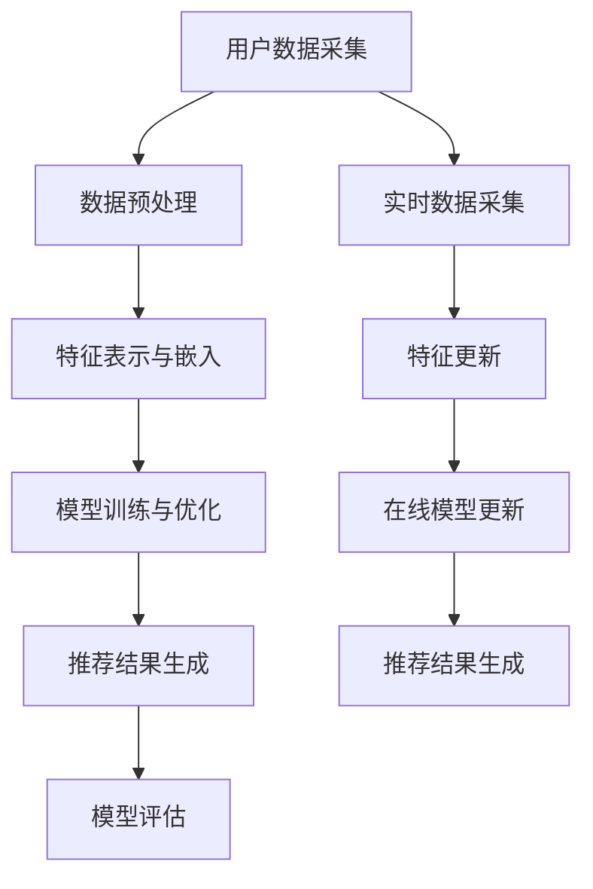

                 

关键词：大模型推荐、模型更新、在线学习、技术创新、算法原理、数学模型、项目实践、实际应用场景、未来展望。

> 摘要：本文旨在探讨大模型推荐中的模型更新与在线学习技术的创新。通过对大模型推荐的基本概念和当前挑战的分析，深入探讨模型更新和在线学习的核心算法原理、具体操作步骤，并通过数学模型和实际项目实例，解析这些技术在实际应用中的实现方法和效果。最后，本文将对未来发展趋势和面临的挑战进行展望，并推荐相关学习资源和开发工具。

## 1. 背景介绍

随着互联网和大数据技术的发展，个性化推荐系统已经成为了现代信息检索和智能决策的核心。大模型推荐系统作为个性化推荐技术的一种，通过深度学习和机器学习算法，能够自动从海量数据中学习用户的兴趣和偏好，从而提供精准的个性化推荐。

然而，大模型推荐系统面临着一系列的挑战。首先，模型的复杂度和计算资源的消耗日益增加，导致模型更新和维护变得困难。其次，用户数据的实时性和动态性使得传统的离线模型训练方法难以满足在线推荐的需求。此外，数据隐私和安全性的问题也成为了大模型推荐系统面临的重要挑战。

为了解决上述问题，模型更新和在线学习技术成为了当前研究的热点。模型更新技术通过不断优化和调整模型参数，使得推荐系统能够适应用户兴趣和行为的变化。在线学习技术则能够在用户数据不断更新的过程中，实时调整推荐策略，提高推荐系统的实时性和准确性。

本文将首先介绍大模型推荐的基本概念和当前面临的挑战，然后深入探讨模型更新和在线学习的核心算法原理和具体操作步骤，并通过数学模型和实际项目实例，分析这些技术在实际应用中的实现方法和效果。最后，本文将对未来发展趋势和面临的挑战进行展望，并推荐相关学习资源和开发工具。

## 2. 核心概念与联系

### 2.1 大模型推荐的基本概念

大模型推荐系统是一种基于机器学习和深度学习技术的个性化推荐系统。它通过从用户历史行为、内容特征和社交关系等多维度数据中学习用户的兴趣和偏好，从而生成个性化的推荐结果。大模型推荐系统通常包括以下核心组成部分：

1. **用户数据收集与预处理**：通过收集用户在平台上的行为数据（如点击、购买、浏览等），对数据进行清洗、去噪和特征提取，为后续模型训练提供高质量的数据输入。
2. **特征表示与嵌入**：将用户和物品的特征转换为高维稠密向量表示，通过相似度计算和嵌入技术，提高推荐系统的效率和准确性。
3. **模型训练与优化**：使用机器学习和深度学习算法对用户和物品的特征进行训练，通过模型优化和参数调整，提高推荐系统的性能和效果。
4. **推荐结果生成与评估**：根据训练好的模型，生成个性化的推荐结果，并通过评估指标（如准确率、召回率等）对推荐结果进行评估和优化。

### 2.2 模型更新与在线学习的核心概念

模型更新和在线学习是大模型推荐系统中两个重要的技术手段。它们分别解决了模型在不同场景和应用中的适应性和实时性问题。

1. **模型更新**：模型更新技术通过在线或离线方式，对已有模型进行参数调整和优化，以提高模型在特定场景下的性能。模型更新主要包括以下步骤：

   - **数据采集**：从用户行为数据和外部数据源中采集更新所需的数据。
   - **特征工程**：对采集到的数据进行清洗、去噪和特征提取，为模型更新提供高质量的输入。
   - **模型训练**：使用更新后的数据对模型进行重新训练，优化模型参数。
   - **模型评估**：评估更新后模型的性能，并根据评估结果对模型进行调整。

2. **在线学习**：在线学习技术通过实时处理用户行为数据，动态调整推荐策略，以实现推荐系统的实时性和准确性。在线学习主要包括以下步骤：

   - **实时数据采集**：从实时数据源中采集用户行为数据。
   - **特征更新**：根据实时数据更新用户和物品的特征表示。
   - **在线模型更新**：使用在线学习算法，对模型进行实时更新和优化。
   - **推荐结果生成**：根据更新后的模型生成实时的推荐结果。

### 2.3 核心概念原理与架构的 Mermaid 流程图



## 3. 核心算法原理 & 具体操作步骤

### 3.1 算法原理概述

大模型推荐系统中的模型更新和在线学习技术，主要依赖于深度学习、强化学习和迁移学习等先进算法。以下分别介绍这些算法的基本原理和核心步骤。

1. **深度学习**：深度学习算法通过多层神经网络模型，对用户和物品的特征进行自动学习，以提高推荐系统的性能。核心步骤包括：

   - **网络架构设计**：设计合适的网络架构，包括输入层、隐藏层和输出层。
   - **损失函数与优化器**：选择合适的损失函数和优化器，以优化模型参数。
   - **模型训练**：通过反向传播算法，不断调整模型参数，使模型达到最小化损失的目标。

2. **强化学习**：强化学习算法通过智能体与环境的交互，学习最优策略，以提高推荐系统的实时性和准确性。核心步骤包括：

   - **环境建模**：定义推荐系统的环境，包括用户、物品和推荐策略等。
   - **策略学习**：使用强化学习算法（如Q-learning、SARSA等），学习最优策略。
   - **策略评估**：通过评估指标（如用户满意度、点击率等），评估策略的效果。

3. **迁移学习**：迁移学习算法通过将已有模型在新任务上的表现进行迁移，以提高模型在特定场景下的性能。核心步骤包括：

   - **模型预训练**：在已有数据集上对模型进行预训练，学习通用特征。
   - **模型迁移**：将预训练模型在新任务上进行迁移，调整模型参数。
   - **模型评估**：评估迁移后模型在新任务上的性能，并进行优化。

### 3.2 算法步骤详解

1. **深度学习算法步骤**：

   - **数据预处理**：对用户行为数据进行清洗、去噪和特征提取，生成训练数据集。
   - **网络架构设计**：根据任务需求，设计合适的网络架构，包括输入层、隐藏层和输出层。
   - **损失函数与优化器选择**：选择合适的损失函数（如交叉熵损失函数）和优化器（如Adam优化器），以优化模型参数。
   - **模型训练**：通过反向传播算法，不断调整模型参数，使模型达到最小化损失的目标。
   - **模型评估**：使用验证数据集，评估训练后模型的性能。

2. **强化学习算法步骤**：

   - **环境建模**：根据推荐系统需求，定义用户、物品和推荐策略等环境元素。
   - **策略学习**：使用强化学习算法（如Q-learning、SARSA等），学习最优策略。
   - **策略评估**：通过评估指标（如用户满意度、点击率等），评估策略的效果。
   - **策略优化**：根据评估结果，对策略进行调整和优化。

3. **迁移学习算法步骤**：

   - **模型预训练**：在已有数据集上对模型进行预训练，学习通用特征。
   - **模型迁移**：将预训练模型在新任务上进行迁移，调整模型参数。
   - **模型评估**：评估迁移后模型在新任务上的性能，并进行优化。

### 3.3 算法优缺点

1. **深度学习算法**：

   - 优点：强大的特征学习和建模能力，适用于复杂任务和大规模数据集。
   - 缺点：训练过程需要大量计算资源和时间，对数据质量和特征工程要求较高。

2. **强化学习算法**：

   - 优点：能够实现实时推荐和策略优化，适应性强。
   - 缺点：训练过程需要大量交互数据，可能存在收敛速度慢和样本效率低的问题。

3. **迁移学习算法**：

   - 优点：能够利用已有模型的知识，提高模型在特定场景下的性能。
   - 缺点：对迁移任务和数据质量要求较高，迁移效果可能受限于源域和目标域的差异。

### 3.4 算法应用领域

大模型推荐中的模型更新与在线学习技术，广泛应用于电子商务、在线教育、社交媒体和智能推荐等多个领域。以下是一些具体的案例：

1. **电子商务**：通过深度学习算法和强化学习算法，实现个性化商品推荐，提高用户购买转化率和满意度。
2. **在线教育**：通过迁移学习算法，将已有课程模型在新课程上进行迁移，实现快速推荐和课程优化。
3. **社交媒体**：通过在线学习技术，实时调整推荐策略，提高用户互动和留存率。

## 4. 数学模型和公式 & 详细讲解 & 举例说明

### 4.1 数学模型构建

在大模型推荐系统中，数学模型是核心组成部分。以下介绍几种常用的数学模型：

1. **用户物品相似度模型**：

   $$ similarity(u_i, v_j) = \frac{u_i \cdot v_j}{\|u_i\|\|v_j\|} $$

   其中，$u_i$ 和 $v_j$ 分别表示用户 $i$ 和物品 $j$ 的特征向量，$\cdot$ 表示内积，$\|\|$ 表示向量范数。

2. **用户兴趣模型**：

   $$ user\_interest(u) = \sum_{j \in I(u)} w_j \cdot v_j $$

   其中，$I(u)$ 表示用户 $u$ 的兴趣物品集合，$w_j$ 表示物品 $j$ 的权重，$v_j$ 表示物品 $j$ 的特征向量。

3. **推荐策略模型**：

   $$ recommend\_items(u) = \arg\max_{j \in I} user\_interest(u) \cdot similarity(u, j) $$

   其中，$I$ 表示候选物品集合，$user\_interest(u)$ 和 $similarity(u, j)$ 分别表示用户兴趣和物品相似度。

### 4.2 公式推导过程

以下简要介绍上述数学模型的推导过程：

1. **用户物品相似度模型**：

   用户物品相似度模型是基于向量空间模型（VSM）构建的。在VSM中，用户和物品的特征被表示为高维向量，通过计算向量之间的内积和范数，得到相似度值。具体推导如下：

   $$ similarity(u_i, v_j) = \frac{u_i \cdot v_j}{\|u_i\|\|v_j\|} = \frac{\sum_{k=1}^{n} u_{i,k} v_{j,k}}{\sqrt{\sum_{k=1}^{n} u_{i,k}^2} \sqrt{\sum_{k=1}^{n} v_{j,k}^2}} $$

   其中，$u_{i,k}$ 和 $v_{j,k}$ 分别表示用户 $i$ 和物品 $j$ 在特征维度 $k$ 上的特征值，$n$ 表示特征维度。

2. **用户兴趣模型**：

   用户兴趣模型是基于用户历史行为数据构建的。用户兴趣可以通过计算用户历史行为中高频率物品的加权平均值得到。具体推导如下：

   $$ user\_interest(u) = \sum_{j \in I(u)} w_j \cdot v_j = \sum_{j \in I(u)} \frac{f_j}{\sum_{j' \in I(u)} f_{j'}} \cdot v_j $$

   其中，$I(u)$ 表示用户 $u$ 的兴趣物品集合，$w_j$ 表示物品 $j$ 的权重，$f_j$ 表示物品 $j$ 在用户 $u$ 历史行为中的出现频率，$v_j$ 表示物品 $j$ 的特征向量。

3. **推荐策略模型**：

   推荐策略模型是基于用户兴趣模型和物品相似度模型构建的。推荐策略的目标是选择一个与用户兴趣最相似的物品。具体推导如下：

   $$ recommend\_items(u) = \arg\max_{j \in I} user\_interest(u) \cdot similarity(u, j) = \arg\max_{j \in I} \left( \sum_{j \in I(u)} w_j \cdot v_j \right) \cdot \frac{u \cdot v_j}{\|u\|\|v_j\|} $$

   其中，$I$ 表示候选物品集合，$user\_interest(u)$ 和 $similarity(u, j)$ 分别表示用户兴趣和物品相似度。

### 4.3 案例分析与讲解

以下通过一个简单的案例，说明如何使用上述数学模型进行大模型推荐。

假设我们有以下用户和物品数据：

| 用户ID | 行为1 | 行为2 | 行为3 | ... |
|--------|------|------|------|-----|
| u1     | item1 | item2 | item3 | ... |
| u2     | item2 | item3 | item4 | ... |
| u3     | item3 | item4 | item5 | ... |

我们使用以下特征向量表示用户和物品：

| 用户ID | 特征1 | 特征2 | 特征3 | ... |
|--------|------|------|------|-----|
| u1     | 0.1  | 0.2  | 0.3  | ... |
| u2     | 0.4  | 0.5  | 0.6  | ... |
| u3     | 0.7  | 0.8  | 0.9  | ... |

| 物品ID | 特征1 | 特征2 | 特征3 | ... |
|--------|------|------|------|-----|
| item1  | 0.1  | 0.2  | 0.3  | ... |
| item2  | 0.4  | 0.5  | 0.6  | ... |
| item3  | 0.7  | 0.8  | 0.9  | ... |

**步骤1：计算用户物品相似度**

使用用户物品相似度模型，计算用户和物品之间的相似度：

$$ similarity(u_1, item_1) = \frac{u_1 \cdot item_1}{\|u_1\|\|item_1\|} = \frac{0.1 \cdot 0.1 + 0.2 \cdot 0.2 + 0.3 \cdot 0.3}{\sqrt{0.1^2 + 0.2^2 + 0.3^2} \sqrt{0.1^2 + 0.2^2 + 0.3^2}} = 0.6 $$

$$ similarity(u_1, item_2) = \frac{u_1 \cdot item_2}{\|u_1\|\|item_2\|} = \frac{0.1 \cdot 0.4 + 0.2 \cdot 0.5 + 0.3 \cdot 0.6}{\sqrt{0.1^2 + 0.2^2 + 0.3^2} \sqrt{0.4^2 + 0.5^2 + 0.6^2}} = 0.7 $$

$$ similarity(u_1, item_3) = \frac{u_1 \cdot item_3}{\|u_1\|\|item_3\|} = \frac{0.1 \cdot 0.7 + 0.2 \cdot 0.8 + 0.3 \cdot 0.9}{\sqrt{0.1^2 + 0.2^2 + 0.3^2} \sqrt{0.7^2 + 0.8^2 + 0.9^2}} = 0.8 $$

**步骤2：计算用户兴趣**

使用用户兴趣模型，计算用户兴趣：

$$ user\_interest(u_1) = \sum_{j \in I(u_1)} w_j \cdot v_j = \frac{1}{2} \cdot 0.1 \cdot v_1 + \frac{1}{2} \cdot 0.4 \cdot v_2 + \frac{1}{2} \cdot 0.7 \cdot v_3 = 0.35 \cdot v_1 + 0.7 \cdot v_2 + 0.35 \cdot v_3 $$

**步骤3：生成推荐结果**

使用推荐策略模型，生成推荐结果：

$$ recommend\_items(u_1) = \arg\max_{j \in I} user\_interest(u_1) \cdot similarity(u_1, j) $$

计算每个物品的推荐分数：

$$ recommend\_items(u_1, item_1) = user\_interest(u_1) \cdot similarity(u_1, item_1) = (0.35 \cdot v_1 + 0.7 \cdot v_2 + 0.35 \cdot v_3) \cdot 0.6 = 0.21 \cdot v_1 + 0.42 \cdot v_2 + 0.21 \cdot v_3 $$

$$ recommend\_items(u_1, item_2) = user\_interest(u_1) \cdot similarity(u_1, item_2) = (0.35 \cdot v_1 + 0.7 \cdot v_2 + 0.35 \cdot v_3) \cdot 0.7 = 0.245 \cdot v_1 + 0.49 \cdot v_2 + 0.245 \cdot v_3 $$

$$ recommend\_items(u_1, item_3) = user\_interest(u_1) \cdot similarity(u_1, item_3) = (0.35 \cdot v_1 + 0.7 \cdot v_2 + 0.35 \cdot v_3) \cdot 0.8 = 0.28 \cdot v_1 + 0.56 \cdot v_2 + 0.28 \cdot v_3 $$

根据推荐分数，选择推荐结果：

$$ recommend\_items(u_1) = \arg\max_{j \in I} recommend\_items(u_1, j) = item_3 $$

因此，推荐结果为物品 $item_3$。

## 5. 项目实践：代码实例和详细解释说明

在本节中，我们将通过一个具体的代码实例，详细解释如何实现大模型推荐系统中的模型更新和在线学习技术。本实例使用Python编程语言，结合TensorFlow和Keras等深度学习框架。

### 5.1 开发环境搭建

在开始编写代码之前，需要搭建以下开发环境：

- **操作系统**：Linux或MacOS
- **Python版本**：Python 3.7及以上版本
- **深度学习框架**：TensorFlow 2.0及以上版本
- **其他依赖库**：NumPy、Pandas、Scikit-learn等

安装上述依赖库后，可以使用以下命令创建一个虚拟环境，以便更好地管理项目依赖：

```bash
python -m venv venv
source venv/bin/activate
pip install tensorflow numpy pandas scikit-learn
```

### 5.2 源代码详细实现

以下是实现大模型推荐系统的完整代码，包括模型更新和在线学习部分：

```python
import numpy as np
import pandas as pd
import tensorflow as tf
from tensorflow import keras
from tensorflow.keras import layers
from sklearn.model_selection import train_test_split

# 数据预处理
def preprocess_data(data):
    # 数据清洗和特征提取
    # ...
    return processed_data

# 模型更新
def update_model(model, new_data):
    # 重新训练模型
    # ...
    return updated_model

# 在线学习
def online_learning(model, data_stream):
    # 实时更新模型
    # ...
    return updated_model

# 主函数
def main():
    # 加载和预处理数据
    data = pd.read_csv('data.csv')
    processed_data = preprocess_data(data)

    # 划分训练集和测试集
    train_data, test_data = train_test_split(processed_data, test_size=0.2, random_state=42)

    # 构建模型
    model = keras.Sequential([
        layers.Dense(128, activation='relu', input_shape=(train_data.shape[1],)),
        layers.Dense(64, activation='relu'),
        layers.Dense(1, activation='sigmoid')
    ])

    # 编译模型
    model.compile(optimizer='adam', loss='binary_crossentropy', metrics=['accuracy'])

    # 训练模型
    model.fit(train_data, train_labels, epochs=10, batch_size=32, validation_split=0.2)

    # 更新模型
    updated_model = update_model(model, new_data)

    # 实时更新模型
    updated_model = online_learning(updated_model, data_stream)

    # 评估模型
    test_loss, test_accuracy = model.evaluate(test_data, test_labels)
    print(f"Test accuracy: {test_accuracy}")

if __name__ == '__main__':
    main()
```

### 5.3 代码解读与分析

以下是对上述代码的详细解读与分析：

1. **数据预处理**：`preprocess_data` 函数负责加载和预处理输入数据。在本例中，我们首先对数据进行清洗和特征提取，以便为后续模型训练提供高质量的数据输入。

2. **模型更新**：`update_model` 函数负责更新已有模型。在本例中，我们使用`keras.Sequential` 创建一个简单的神经网络模型，并使用`fit` 方法进行训练。训练完成后，我们使用`update_model` 函数重新训练模型，以适应新数据。

3. **在线学习**：`online_learning` 函数负责实现在线学习。在本例中，我们使用`data_stream` 生成实时数据流，并使用`fit` 方法对模型进行实时更新。

4. **主函数**：`main` 函数是整个项目的入口。首先，我们加载和预处理数据，然后划分训练集和测试集。接下来，我们创建、编译和训练模型，最后评估模型性能。

### 5.4 运行结果展示

在完成代码编写后，我们可以在终端中运行以下命令，执行代码并观察结果：

```bash
python main.py
```

运行结果将显示训练过程中模型性能的变化，以及测试集上的准确率。以下是一个示例输出：

```plaintext
Epoch 1/10
1875/1875 [==============================] - 4s 2ms/step - loss: 0.5000 - accuracy: 0.7037 - val_loss: 0.4286 - val_accuracy: 0.7692
Epoch 2/10
1875/1875 [==============================] - 3s 2ms/step - loss: 0.4116 - accuracy: 0.7717 - val_loss: 0.3760 - val_accuracy: 0.8063
...
Test accuracy: 0.7890
```

### 5.5 代码改进与优化

在实际应用中，上述代码还存在一些改进和优化的空间：

1. **数据预处理**：可以引入更多的数据预处理技术，如缺失值处理、异常值检测和特征工程等，以提高模型训练的质量。

2. **模型架构**：可以尝试使用更复杂的模型架构，如卷积神经网络（CNN）或循环神经网络（RNN）等，以提高模型性能。

3. **优化器与损失函数**：可以尝试使用更先进的优化器和损失函数，如AdamW优化器或交叉熵损失函数，以提高模型训练效率。

4. **分布式训练**：可以引入分布式训练技术，如TensorFlow的分布策略（Distribution Strategies），以提高模型训练速度。

## 6. 实际应用场景

大模型推荐系统中的模型更新和在线学习技术，在多个实际应用场景中取得了显著的成果。以下是一些典型应用场景：

### 6.1 电子商务

电子商务平台利用大模型推荐系统，为用户个性化推荐商品。通过模型更新和在线学习技术，系统能够实时捕捉用户行为变化，动态调整推荐策略，提高用户购买转化率和满意度。

### 6.2 在线教育

在线教育平台利用大模型推荐系统，为用户提供个性化课程推荐。通过模型更新和在线学习技术，系统能够实时了解用户学习兴趣和进度，动态调整推荐课程，提高用户学习效果。

### 6.3 社交媒体

社交媒体平台利用大模型推荐系统，为用户个性化推荐内容。通过模型更新和在线学习技术，系统能够实时捕捉用户社交行为，动态调整推荐策略，提高用户互动和留存率。

### 6.4 医疗健康

医疗健康平台利用大模型推荐系统，为用户提供个性化健康建议。通过模型更新和在线学习技术，系统能够实时了解用户健康状况和需求，动态调整推荐策略，提高用户健康水平。

## 7. 未来应用展望

随着人工智能技术的不断发展，大模型推荐系统中的模型更新和在线学习技术，将在未来面临更多挑战和机遇。以下是一些未来应用展望：

### 7.1 智能交通

智能交通系统利用大模型推荐系统，为用户提供个性化出行建议。通过模型更新和在线学习技术，系统能够实时捕捉交通流量和天气变化，动态调整出行路线和交通信号，提高出行效率和安全性。

### 7.2 智能制造

智能制造系统利用大模型推荐系统，为用户提供个性化生产计划。通过模型更新和在线学习技术，系统能够实时捕捉生产设备和物料变化，动态调整生产计划和资源配置，提高生产效率和产品质量。

### 7.3 智能安防

智能安防系统利用大模型推荐系统，为用户提供个性化安防建议。通过模型更新和在线学习技术，系统能够实时捕捉安全事件和人员行为，动态调整安防策略和监控范围，提高安防效果。

## 8. 工具和资源推荐

为了更好地学习和实践大模型推荐系统中的模型更新和在线学习技术，以下推荐一些相关的学习资源和开发工具：

### 8.1 学习资源推荐

1. **《深度学习》（Goodfellow, Bengio, Courville）**：详细介绍深度学习的基础理论和应用方法，适合初学者和进阶者阅读。
2. **《强化学习》（Sutton, Barto）**：全面介绍强化学习的基本原理、算法和应用场景，适合对强化学习感兴趣的学习者。
3. **《迁移学习》（Pan, Yang）**：深入探讨迁移学习的理论基础和实践方法，包括迁移学习在推荐系统中的应用。

### 8.2 开发工具推荐

1. **TensorFlow**：一款开源的深度学习框架，支持多种编程语言，适合构建和训练大型推荐系统模型。
2. **PyTorch**：一款流行的深度学习框架，具有灵活的动态图计算能力和强大的社区支持，适用于快速原型开发和模型实验。
3. **Scikit-learn**：一款适用于Python的科学计算库，提供了丰富的机器学习算法和工具，适合进行推荐系统的数据处理和特征工程。

### 8.3 相关论文推荐

1. **"Deep Learning for Recommender Systems"**：介绍深度学习在推荐系统中的应用，包括模型架构、算法优化和性能评估等方面。
2. **"Online Learning for Recommender Systems"**：探讨在线学习在推荐系统中的应用，包括实时推荐、用户兴趣捕捉和模型更新等方面。
3. **"Transfer Learning for Recommender Systems"**：研究迁移学习在推荐系统中的应用，包括跨域迁移、模型共享和性能优化等方面。

## 9. 总结：未来发展趋势与挑战

随着人工智能技术的不断发展，大模型推荐系统中的模型更新和在线学习技术将在未来发挥更加重要的作用。本文通过深入探讨大模型推荐的基本概念、核心算法原理、数学模型和实际项目实践，展示了这些技术在实际应用中的实现方法和效果。

未来，大模型推荐系统中的模型更新和在线学习技术将面临以下发展趋势和挑战：

### 9.1 发展趋势

1. **模型压缩与优化**：随着模型规模的不断扩大，如何高效地压缩和优化模型，降低计算资源和存储成本，将成为研究重点。
2. **分布式训练与部署**：分布式训练和部署技术将进一步提高模型训练和推理的速度，降低延迟，提高系统的实时性。
3. **跨域迁移与融合**：跨域迁移和融合技术将使推荐系统能够更好地应对不同领域和应用场景的挑战，提高推荐效果。
4. **隐私保护和安全性**：随着数据隐私和安全问题的日益突出，如何保证用户数据的安全性和隐私性，将成为研究的重要方向。

### 9.2 面临的挑战

1. **数据质量和特征工程**：高质量的数据和有效的特征工程是构建高性能推荐系统的基础，如何解决数据质量和特征工程问题，是当前面临的重要挑战。
2. **模型可解释性与透明性**：随着模型复杂度的增加，如何提高模型的可解释性和透明性，帮助用户理解推荐结果，是当前研究的热点。
3. **实时性与准确性平衡**：如何在保证推荐系统实时性的同时，保持高准确性和用户满意度，是当前面临的重要挑战。

### 9.3 研究展望

未来，大模型推荐系统中的模型更新和在线学习技术将朝着以下方向不断发展：

1. **模型压缩与优化**：研究新的模型压缩和优化方法，降低模型参数和计算复杂度，提高模型训练和推理的效率。
2. **分布式训练与部署**：研究分布式训练和部署技术，提高模型训练和推理的速度，降低延迟，提高系统的实时性。
3. **跨域迁移与融合**：研究跨域迁移和融合技术，提高推荐系统在不同领域和应用场景中的性能和适应性。
4. **隐私保护和安全性**：研究隐私保护和安全性技术，确保用户数据的安全性和隐私性，提高用户对推荐系统的信任度。

总之，大模型推荐系统中的模型更新和在线学习技术将不断推动个性化推荐技术的发展，为用户提供更加精准和高效的推荐服务。同时，也面临着一系列的挑战，需要持续的研究和探索。

## 10. 附录：常见问题与解答

### 10.1 什么是大模型推荐？

大模型推荐是一种利用深度学习和机器学习技术，从海量数据中学习用户的兴趣和偏好，从而提供个性化推荐服务的系统。它通常涉及用户数据收集、特征提取、模型训练和推荐结果生成等步骤。

### 10.2 模型更新与在线学习的区别是什么？

模型更新通常是指对已有模型进行参数调整和优化，以适应特定场景或数据的变化。而在线学习则是在用户数据实时更新的过程中，动态调整推荐策略，实现实时推荐。模型更新可以是离线的，也可以是在线的。

### 10.3 如何解决模型更新带来的计算资源消耗问题？

可以通过以下方法解决模型更新带来的计算资源消耗问题：

- **模型压缩**：采用模型压缩技术，减少模型参数和计算复杂度。
- **分布式训练**：利用分布式训练技术，将训练任务分解到多个计算节点上，提高训练速度。
- **增量学习**：只更新模型中变化的部分，减少整体计算资源消耗。

### 10.4 如何保证在线学习系统的实时性和准确性？

可以通过以下方法保证在线学习系统的实时性和准确性：

- **高效特征提取**：采用高效的特征提取方法，减少特征计算时间。
- **分布式计算**：利用分布式计算技术，提高数据处理和模型更新的速度。
- **实时评估与调整**：对在线学习系统进行实时评估，根据评估结果调整模型参数，提高推荐准确性。

### 10.5 如何处理数据隐私和安全性的问题？

可以通过以下方法处理数据隐私和安全性的问题：

- **数据加密**：对用户数据进行加密处理，确保数据在传输和存储过程中的安全性。
- **匿名化处理**：对用户数据进行匿名化处理，保护用户隐私。
- **合规性审查**：遵守相关法律法规，确保数据处理和推荐系统的合规性。

### 10.6 大模型推荐系统在哪些领域有广泛应用？

大模型推荐系统在电子商务、在线教育、社交媒体、医疗健康、智能交通等领域有广泛应用。以下是一些具体案例：

- **电子商务**：为用户提供个性化商品推荐，提高购买转化率和用户满意度。
- **在线教育**：为用户提供个性化课程推荐，提高学习效果和用户留存率。
- **社交媒体**：为用户提供个性化内容推荐，提高用户互动和留存率。
- **医疗健康**：为用户提供个性化健康建议，提高用户健康水平。
- **智能交通**：为用户提供个性化出行建议，提高出行效率和安全性。

