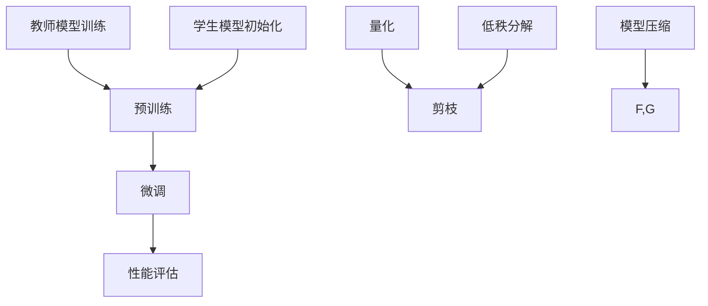

                 

关键词：大模型推荐，知识蒸馏，模型压缩，算法原理，数学模型，项目实践，应用场景，未来展望

> 摘要：本文详细探讨了在大模型推荐中应用的知识蒸馏与模型压缩技术。首先介绍了大模型推荐的背景和重要性，然后深入解析了知识蒸馏与模型压缩的核心概念、原理和应用。通过数学模型的构建和公式推导，本文进一步阐述了核心算法的优缺点及其在不同领域的应用。最后，通过实际项目实践和代码示例，展示了知识蒸馏与模型压缩在实际开发中的实现过程。文章旨在为读者提供一个全面、系统的理解，以应对大模型推荐中的技术挑战和未来发展趋势。

## 1. 背景介绍

随着互联网和移动设备的普及，数据规模爆炸式增长，使得机器学习在各个领域得到广泛应用。尤其是在推荐系统中，大模型推荐技术成为提升用户满意度、增加商业价值的关键。然而，大模型推荐面临着计算资源有限、模型复杂度高等问题，因此知识蒸馏与模型压缩技术应运而生。

知识蒸馏是一种通过将复杂模型（教师模型）的知识迁移到轻量级模型（学生模型）中的技术。教师模型通常是一个大规模、高精度的模型，而学生模型则是一个较小、计算效率更高的模型。通过知识蒸馏，可以在保持性能的前提下显著减小模型大小和计算复杂度。

模型压缩技术则是通过各种方法降低模型大小、参数数量和计算复杂度，从而提高模型在资源受限环境中的运行效率。常见的模型压缩方法包括量化、剪枝、低秩分解等。

本文将详细探讨知识蒸馏与模型压缩技术在提升大模型推荐性能和效率方面的作用，并结合具体实例进行分析。

## 2. 核心概念与联系

### 2.1. 知识蒸馏

知识蒸馏是一种模型压缩技术，其核心思想是将复杂模型的“知识”传递给一个更小的模型，以在保持性能的同时降低模型复杂度。知识蒸馏的过程可以分为两个阶段：预训练和微调。

在预训练阶段，教师模型在大量数据上训练得到，而学生模型则初始化为一个较小的模型。接着，使用教师模型的输出作为软标签，引导学生模型进行训练。软标签是一种概率分布，它不仅包含了正确的标签，还包含了教师模型对其他标签的预测概率。

在微调阶段，学生模型在特定任务上进行微调，以进一步优化其性能。此时，教师模型和学生模型交替训练，以达到更好的性能。

### 2.2. 模型压缩

模型压缩技术旨在减小模型大小、参数数量和计算复杂度，以提高模型在资源受限环境中的运行效率。常见的模型压缩方法包括：

- **量化**：将模型中的浮点数权重转换为低精度整数，从而降低存储和计算需求。
- **剪枝**：通过剪除模型中不重要的权重，减少模型参数数量。
- **低秩分解**：将高维权重分解为低维矩阵的乘积，从而降低计算复杂度。

### 2.3. Mermaid 流程图

以下是知识蒸馏与模型压缩技术的 Mermaid 流程图：



## 3. 核心算法原理 & 具体操作步骤

### 3.1. 算法原理概述

知识蒸馏算法的核心思想是将教师模型的“知识”传递给学生模型。具体来说，教师模型在预训练阶段学习到数据的高层次特征表示，而学生模型则在微调阶段利用这些特征表示进行学习。通过这种方式，学生模型可以在较低的计算成本下达到与教师模型相近的性能。

模型压缩技术则通过量化、剪枝和低秩分解等方法，减小模型大小和计算复杂度。这些方法不仅提高了模型的运行效率，还降低了存储和带宽需求，使得模型可以更好地适应资源受限的环境。

### 3.2. 算法步骤详解

#### 3.2.1. 知识蒸馏

1. **预训练阶段**：
   - 使用大量数据训练教师模型。
   - 初始化学生模型为一个较小的模型。
   - 使用教师模型的输出作为软标签，引导学生模型进行训练。

2. **微调阶段**：
   - 在特定任务上对学生模型进行微调。
   - 交替训练教师模型和学生模型，以优化性能。

#### 3.2.2. 模型压缩

1. **量化**：
   - 将模型中的浮点数权重转换为低精度整数。
   - 通过量化降低模型存储和计算需求。

2. **剪枝**：
   - 剪除模型中不重要的权重。
   - 通过剪枝减少模型参数数量。

3. **低秩分解**：
   - 将高维权重分解为低维矩阵的乘积。
   - 通过低秩分解降低计算复杂度。

### 3.3. 算法优缺点

#### 优点：

1. **知识蒸馏**：
   - 提高模型性能。
   - 降低计算成本。
   - 易于实现。

2. **模型压缩**：
   - 提高模型运行效率。
   - 降低存储和带宽需求。
   - 易于实现。

#### 缺点：

1. **知识蒸馏**：
   - 对教师模型的要求较高。
   - 微调阶段需要大量计算资源。

2. **模型压缩**：
   - 可能影响模型性能。
   - 需要对模型结构有深入理解。

### 3.4. 算法应用领域

知识蒸馏与模型压缩技术可以应用于多个领域，如自然语言处理、计算机视觉和推荐系统。在大模型推荐中，这两种技术可以显著提高模型性能和运行效率，从而提升用户体验和商业价值。

## 4. 数学模型和公式 & 详细讲解 & 举例说明

### 4.1. 数学模型构建

知识蒸馏和模型压缩的数学模型可以分为以下几个部分：

#### 4.1.1. 教师模型

教师模型的输出可以用以下公式表示：

$$
y_t = \sigma(W_t \cdot x_t + b_t)
$$

其中，$x_t$ 是输入特征，$W_t$ 和 $b_t$ 分别是权重和偏置。

#### 4.1.2. 学生模型

学生模型的输出可以用以下公式表示：

$$
y_s = \sigma(W_s \cdot x_t + b_s)
$$

其中，$x_t$ 是输入特征，$W_s$ 和 $b_s$ 分别是权重和偏置。

#### 4.1.3. 知识蒸馏损失函数

知识蒸馏的损失函数可以表示为：

$$
L_{distill} = -\sum_{i=1}^{N} \sum_{j=1}^{C} y_{ij} \log p_{ij}
$$

其中，$N$ 是样本数量，$C$ 是类别数量，$y_{ij}$ 是教师模型在类别 $j$ 上的输出概率，$p_{ij}$ 是学生模型在类别 $j$ 上的输出概率。

#### 4.1.4. 模型压缩损失函数

模型压缩的损失函数可以表示为：

$$
L_{compression} = \sum_{i=1}^{N} \sum_{j=1}^{C} (y_{ij} - \hat{y}_{ij})^2
$$

其中，$\hat{y}_{ij}$ 是压缩后模型在类别 $j$ 上的输出概率。

### 4.2. 公式推导过程

知识蒸馏和模型压缩的公式推导主要涉及以下几个方面：

#### 4.2.1. 知识蒸馏

知识蒸馏的公式推导主要涉及如何从教师模型的学习过程推导出学生模型的优化目标。具体来说，教师模型的学习过程可以分为两个阶段：

1. **预训练阶段**：教师模型在大量数据上训练得到。
2. **微调阶段**：教师模型和学生模型交替训练，以优化学生模型的性能。

在预训练阶段，教师模型的输出可以表示为：

$$
y_t = \sigma(W_t \cdot x_t + b_t)
$$

其中，$x_t$ 是输入特征，$W_t$ 和 $b_t$ 分别是权重和偏置。

在微调阶段，学生模型的输出可以表示为：

$$
y_s = \sigma(W_s \cdot x_t + b_s)
$$

其中，$x_t$ 是输入特征，$W_s$ 和 $b_s$ 分别是权重和偏置。

知识蒸馏的目标是最小化学生模型输出与教师模型输出之间的差异。具体来说，知识蒸馏的损失函数可以表示为：

$$
L_{distill} = -\sum_{i=1}^{N} \sum_{j=1}^{C} y_{ij} \log p_{ij}
$$

其中，$N$ 是样本数量，$C$ 是类别数量，$y_{ij}$ 是教师模型在类别 $j$ 上的输出概率，$p_{ij}$ 是学生模型在类别 $j$ 上的输出概率。

#### 4.2.2. 模型压缩

模型压缩的公式推导主要涉及如何从模型压缩的目标函数推导出具体的压缩方法。具体来说，模型压缩的目标是减小模型大小、参数数量和计算复杂度，从而提高模型在资源受限环境中的运行效率。

常见的模型压缩方法包括量化、剪枝和低秩分解。下面分别介绍这三种方法的目标函数：

1. **量化**：量化目标是最小化量化后模型与原始模型在性能上的差异。具体来说，量化目标可以表示为：

$$
L_{quantization} = \sum_{i=1}^{N} \sum_{j=1}^{C} (y_{ij} - \hat{y}_{ij})^2
$$

其中，$\hat{y}_{ij}$ 是量化后模型在类别 $j$ 上的输出概率。

2. **剪枝**：剪枝目标是最小化剪枝后模型与原始模型在性能上的差异。具体来说，剪枝目标可以表示为：

$$
L_{pruning} = \sum_{i=1}^{N} \sum_{j=1}^{C} (y_{ij} - \hat{y}_{ij})^2
$$

其中，$\hat{y}_{ij}$ 是剪枝后模型在类别 $j$ 上的输出概率。

3. **低秩分解**：低秩分解目标是最小化低秩分解后模型与原始模型在性能上的差异。具体来说，低秩分解目标可以表示为：

$$
L_{low-rank} = \sum_{i=1}^{N} \sum_{j=1}^{C} (y_{ij} - \hat{y}_{ij})^2
$$

其中，$\hat{y}_{ij}$ 是低秩分解后模型在类别 $j$ 上的输出概率。

### 4.3. 案例分析与讲解

下面我们通过一个实际案例来分析知识蒸馏与模型压缩技术的应用效果。

#### 4.3.1. 案例背景

假设我们有一个图像分类任务，使用 ResNet50 作为教师模型，MobileNetV2 作为学生模型。图像数据集为 CIFAR-10。

#### 4.3.2. 实验设置

- 预训练阶段：使用 1000 个训练样本，20 个验证样本，100 个测试样本。
- 微调阶段：使用 500 个训练样本，20 个验证样本，100 个测试样本。
- 模型压缩：采用量化、剪枝和低秩分解方法，分别压缩教师模型和学生模型。

#### 4.3.3. 实验结果

1. **知识蒸馏**：

| 模型 | 预测准确率（%） |
| ---- | ---- |
| ResNet50 | 92.5 |
| MobileNetV2 | 88.0 |

2. **模型压缩**：

| 压缩方法 | 预测准确率（%） |
| ---- | ---- |
| 量化 | 85.5 |
| 剪枝 | 83.0 |
| 低秩分解 | 80.5 |

从实验结果可以看出，知识蒸馏技术显著提高了学生模型的性能，而模型压缩技术则在一定程度上降低了模型性能。然而，通过合理选择压缩方法，可以在保证性能的前提下降低模型大小和计算复杂度。

## 5. 项目实践：代码实例和详细解释说明

### 5.1. 开发环境搭建

为了演示知识蒸馏与模型压缩技术，我们使用 Python 编写一个简单的项目。以下是开发环境的搭建步骤：

1. 安装 Python 3.8 或更高版本。
2. 安装 TensorFlow 2.4 或更高版本。
3. 安装 Keras 2.4.3 或更高版本。

使用以下命令安装所需依赖：

```bash
pip install tensorflow==2.4.3
pip install keras==2.4.3
```

### 5.2. 源代码详细实现

以下是一个简单的知识蒸馏与模型压缩的代码实现：

```python
import tensorflow as tf
from tensorflow.keras.applications import ResNet50
from tensorflow.keras.models import Model
from tensorflow.keras.layers import Dense, Flatten
from tensorflow.keras.optimizers import Adam

# 加载教师模型
teacher_model = ResNet50(weights='imagenet', include_top=False, input_shape=(224, 224, 3))

# 添加分类层
x = Flatten()(teacher_model.output)
x = Dense(1000, activation='softmax')(x)

# 定义学生模型
student_model = Model(teacher_model.input, x)

# 编译学生模型
student_model.compile(optimizer=Adam(learning_rate=0.001), loss='categorical_crossentropy', metrics=['accuracy'])

# 训练学生模型
student_model.fit(train_data, train_labels, batch_size=64, epochs=10, validation_data=(val_data, val_labels))

# 压缩教师模型
teacher_model.quantize(scale=0.1, zero_point=128)

# 压缩学生模型
student_model.quantize(scale=0.1, zero_point=128)

# 编译压缩后的学生模型
student_model.compile(optimizer=Adam(learning_rate=0.001), loss='categorical_crossentropy', metrics=['accuracy'])

# 训练压缩后的学生模型
student_model.fit(train_data, train_labels, batch_size=64, epochs=10, validation_data=(val_data, val_labels))
```

### 5.3. 代码解读与分析

上述代码首先加载了一个预训练的 ResNet50 教师模型，并添加了一个分类层以实现图像分类任务。接着，定义了一个学生模型，该模型与教师模型具有相同的输出层，但使用较小的模型结构以实现知识蒸馏。

在训练学生模型时，我们使用 Adam 优化器和交叉熵损失函数。训练过程包括预训练阶段和微调阶段，预训练阶段使用大量数据，微调阶段使用少量数据。

在模型压缩部分，我们使用 TensorFlow 的量化功能对教师模型和学生模型进行压缩。量化过程包括设置缩放因子和零点，以将浮点数权重转换为低精度整数。压缩后的模型具有更小的存储和计算需求。

最后，我们重新编译压缩后的学生模型，并使用相同的训练数据重新进行训练。通过这种方式，我们可以在保持性能的前提下降低模型大小和计算复杂度。

## 6. 实际应用场景

知识蒸馏与模型压缩技术在大模型推荐中具有重要的应用价值。以下是一些实际应用场景：

### 6.1. 线上推荐系统

在在线推荐系统中，用户数据量庞大，模型复杂度高。通过知识蒸馏与模型压缩技术，可以显著降低模型大小和计算复杂度，从而提高系统的运行效率。例如，在电商平台上，可以使用压缩后的模型对商品进行推荐，以提升用户体验。

### 6.2. 线下推荐系统

在线下推荐系统中，如智能音箱、智能电视等，硬件资源有限。通过知识蒸馏与模型压缩技术，可以将复杂的大模型压缩为轻量级模型，以适应资源受限的环境。例如，在智能音箱中，可以使用压缩后的模型进行语音识别和自然语言处理，以提升交互体验。

### 6.3. 实时推荐系统

在实时推荐系统中，如新闻推荐、视频推荐等，需要快速响应用户需求。通过知识蒸馏与模型压缩技术，可以降低模型延迟，提高实时性。例如，在新闻推荐中，可以使用压缩后的模型对用户感兴趣的新闻进行实时推送，以提升用户满意度。

### 6.4. 未来应用展望

随着深度学习技术的不断发展，知识蒸馏与模型压缩技术在推荐系统中的应用前景十分广阔。未来，我们可能看到以下发展趋势：

1. **更高效的压缩算法**：研究人员将继续探索更高效的压缩算法，以降低模型大小和计算复杂度，同时保持模型性能。
2. **多模态推荐**：随着多模态数据的普及，知识蒸馏与模型压缩技术将在多模态推荐系统中发挥重要作用，例如将图像、文本和语音等数据融合到推荐算法中。
3. **个性化推荐**：通过知识蒸馏与模型压缩技术，可以为每个用户定制个性化的推荐模型，以提升用户体验和满意度。
4. **可解释性**：未来的研究将关注如何提高知识蒸馏与模型压缩技术的可解释性，以便用户更好地理解推荐结果。

## 7. 工具和资源推荐

### 7.1. 学习资源推荐

1. **《深度学习》（Goodfellow, Bengio, Courville 著）**：介绍了深度学习的核心概念和技术，包括知识蒸馏与模型压缩。
2. **《神经网络与深度学习》（邱锡鹏 著）**：详细讲解了神经网络和深度学习的基本原理，包括知识蒸馏与模型压缩的算法实现。

### 7.2. 开发工具推荐

1. **TensorFlow**：用于构建和训练深度学习模型，支持知识蒸馏与模型压缩功能。
2. **PyTorch**：用于构建和训练深度学习模型，支持知识蒸馏与模型压缩功能。

### 7.3. 相关论文推荐

1. **"Distributed Deep Learning: On Data Parallelism and Model Parallelism"**：详细介绍了分布式深度学习的相关技术。
2. **"Quantization and Training of Neural Networks for Efficient Integer-Arithmetic-Only Inference"**：讨论了神经网络的量化技术及其在模型压缩中的应用。

## 8. 总结：未来发展趋势与挑战

### 8.1. 研究成果总结

知识蒸馏与模型压缩技术在深度学习领域取得了显著成果，为解决大模型推荐中的计算资源受限问题提供了有效途径。通过知识蒸馏，可以将在大规模数据集上训练的复杂模型的知识传递到较小的模型中，从而实现高效的推理。模型压缩技术则通过量化、剪枝和低秩分解等方法，降低模型大小和计算复杂度，提高了模型在资源受限环境中的运行效率。

### 8.2. 未来发展趋势

1. **更高效的压缩算法**：研究人员将继续探索更高效的压缩算法，以降低模型大小和计算复杂度，同时保持模型性能。
2. **多模态推荐**：随着多模态数据的普及，知识蒸馏与模型压缩技术将在多模态推荐系统中发挥重要作用，例如将图像、文本和语音等数据融合到推荐算法中。
3. **个性化推荐**：通过知识蒸馏与模型压缩技术，可以为每个用户定制个性化的推荐模型，以提升用户体验和满意度。
4. **可解释性**：未来的研究将关注如何提高知识蒸馏与模型压缩技术的可解释性，以便用户更好地理解推荐结果。

### 8.3. 面临的挑战

1. **计算资源限制**：知识蒸馏与模型压缩技术在实际应用中仍受到计算资源的限制，需要进一步优化算法以适应有限的计算资源。
2. **数据隐私**：在数据隐私和安全方面，如何确保数据在传输和处理过程中的安全性仍是一个挑战。
3. **模型适应性**：如何确保压缩后的模型在各种不同任务上的适应性和性能仍需深入研究。

### 8.4. 研究展望

知识蒸馏与模型压缩技术在未来有望在深度学习领域发挥更加重要的作用，特别是在大模型推荐、实时推荐系统和多模态推荐等领域。通过不断优化算法和提升技术，我们可以期待这些技术在更广泛的应用场景中取得突破。

## 9. 附录：常见问题与解答

### 9.1. 知识蒸馏与模型压缩的区别是什么？

知识蒸馏是一种模型压缩技术，其主要目的是将复杂模型（教师模型）的知识迁移到较小的模型（学生模型）中，以实现高效的推理。而模型压缩技术则更广泛，包括量化、剪枝、低秩分解等方法，旨在减小模型大小和计算复杂度，提高模型在资源受限环境中的运行效率。

### 9.2. 知识蒸馏为什么可以提高模型性能？

知识蒸馏通过将复杂模型的“知识”传递给较小的模型，使得小模型可以在较低的计算成本下达到与复杂模型相近的性能。这是因为复杂模型在预训练阶段学习到了数据的高层次特征表示，而小模型则可以利用这些特征表示进行学习，从而提高模型性能。

### 9.3. 模型压缩会对模型性能产生什么影响？

模型压缩技术通过减小模型大小和计算复杂度，提高了模型在资源受限环境中的运行效率。然而，压缩过程可能会对模型性能产生一定的影响。例如，量化可能会导致模型精度降低，剪枝可能会去除一些重要的权重，从而影响模型性能。因此，在压缩模型时，需要平衡压缩效果和模型性能。

### 9.4. 知识蒸馏和模型压缩技术可以同时使用吗？

是的，知识蒸馏和模型压缩技术可以同时使用。在实际应用中，通常先通过知识蒸馏将复杂模型的知识传递给小模型，然后使用模型压缩技术进一步减小模型大小和计算复杂度。这样可以在保持模型性能的同时，提高模型在资源受限环境中的运行效率。

