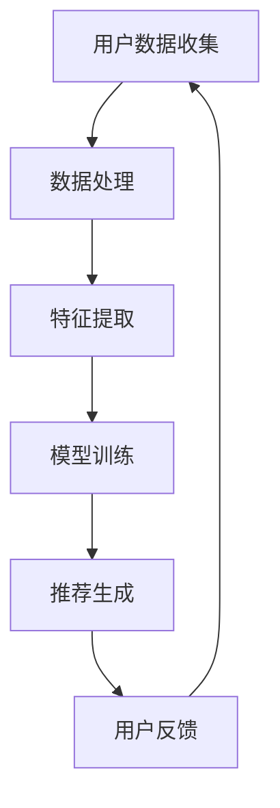

                 

 在当今数字化时代，大模型推荐系统已成为许多在线平台的核心功能，例如社交媒体、电子商务、新闻网站等。这些系统通过分析用户行为和偏好，向用户推荐个性化的内容、产品或服务，从而提高用户满意度和平台收益。然而，随着大模型推荐系统的广泛应用，其潜在伦理问题也日益凸显。本文将探讨大模型推荐系统在以下几个方面可能引发的伦理挑战：算法偏见、隐私泄露、信息操控和用户依赖。

## 1. 背景介绍

大模型推荐系统通常基于机器学习和深度学习技术，通过对大量数据进行训练，以识别用户的兴趣和行为模式。这些系统可以采用协同过滤、内容推荐和混合推荐等方法，为用户提供个性化的推荐结果。虽然这些系统在提高用户体验和平台收益方面具有显著优势，但它们也带来了一系列伦理问题。

### 1.1 算法偏见

算法偏见是指推荐系统在推荐过程中，对某些群体或个体产生不公平待遇的现象。这种偏见可能源于数据集的不公平性、算法设计的不完善或者训练数据的不当处理。算法偏见可能导致以下几种情况：

- **性别、种族、年龄等方面的歧视**：推荐系统可能无意中放大了某些群体的偏见，从而对特定性别、种族或年龄的用户产生歧视。
- **经济地位的影响**：推荐系统可能倾向于向高消费能力的用户推荐更高价位的产品或服务，从而加剧经济不平等。
- **个性化推荐的负面效应**：过度个性化可能导致用户陷入信息茧房，减少他们对多样性和不同观点的接触。

### 1.2 隐私泄露

推荐系统在提供个性化推荐时，需要收集和分析大量用户数据，这可能导致隐私泄露的风险。用户数据包括个人浏览记录、购买历史、社交行为等，这些数据一旦泄露，可能被用于恶意用途，例如身份盗窃、网络诈骗等。

### 1.3 信息操控

推荐系统可以影响用户的信息接触和决策，从而被用于操纵用户行为。例如，政治宣传、虚假信息传播和广告欺诈等问题都可能通过推荐系统加剧。

### 1.4 用户依赖

过度依赖推荐系统可能导致用户失去自主决策能力，从而影响其生活质量。此外，推荐系统可能通过算法操控诱导用户过度消费，对用户产生负面影响。

## 2. 核心概念与联系

为了更好地理解大模型推荐系统的伦理考量，我们需要了解其核心概念和基本架构。以下是一个简单的 Mermaid 流程图，展示了推荐系统的关键组成部分：



### 2.1 用户数据收集

用户数据收集是推荐系统的第一步，主要包括用户的基本信息、浏览历史、购买行为、社交行为等。这些数据通常来自平台自身的数据存储、第三方数据提供者或公共数据集。

### 2.2 数据处理

数据处理包括数据清洗、去重、归一化等操作，以确保数据的准确性和一致性。

### 2.3 特征提取

特征提取是将原始数据转换为推荐系统可处理的形式。特征可以是数值型、文本型或图像型等。

### 2.4 模型训练

模型训练是推荐系统的核心步骤，通过机器学习和深度学习技术，从数据中学习用户行为模式，以生成个性化推荐。

### 2.5 推荐生成

推荐生成是根据训练得到的模型，对用户生成个性化的推荐结果。

### 2.6 用户反馈

用户反馈是推荐系统的优化环节，通过收集用户对推荐结果的反馈，可以进一步优化推荐算法。

## 3. 核心算法原理 & 具体操作步骤

### 3.1 算法原理概述

大模型推荐系统通常采用基于内容的推荐、协同过滤和混合推荐等方法。以下分别介绍这三种方法的基本原理：

- **基于内容的推荐**：该方法根据用户的历史行为和偏好，从内容特征中提取关键词或标签，然后根据相似性匹配推荐新内容。
- **协同过滤**：该方法通过分析用户之间的相似性，找出与其他用户行为相似的推荐对象。
- **混合推荐**：该方法将基于内容和协同过滤的方法结合起来，以提高推荐效果。

### 3.2 算法步骤详解

以下是推荐系统的基本操作步骤：

1. **用户数据收集**：收集用户的基本信息、浏览历史、购买行为等数据。
2. **数据处理**：对数据进行清洗、去重和归一化等操作。
3. **特征提取**：从数据中提取关键词、标签或用户行为特征。
4. **模型训练**：使用机器学习或深度学习技术，从数据中学习用户行为模式。
5. **推荐生成**：根据训练得到的模型，生成个性化推荐结果。
6. **用户反馈**：收集用户对推荐结果的反馈，以优化推荐算法。

### 3.3 算法优缺点

- **基于内容的推荐**：优点是推荐结果相关性强，缺点是受限于内容特征提取的质量。
- **协同过滤**：优点是推荐效果好，缺点是可能产生冷启动问题。
- **混合推荐**：优点是综合了基于内容和协同过滤的优点，缺点是算法复杂度高。

### 3.4 算法应用领域

大模型推荐系统在多个领域有广泛应用，如电子商务、社交媒体、新闻网站和在线教育等。以下是一些具体应用案例：

- **电子商务**：根据用户购买历史和浏览记录，推荐符合用户兴趣的商品。
- **社交媒体**：根据用户社交关系和兴趣，推荐相关内容和好友。
- **新闻网站**：根据用户阅读偏好和浏览历史，推荐相关新闻。

## 4. 数学模型和公式 & 详细讲解 & 举例说明

### 4.1 数学模型构建

推荐系统的数学模型通常基于用户行为数据和内容特征。以下是一个简单的基于内容的推荐模型：

- **用户行为矩阵** \(U\)：表示用户对物品的评分，其中 \(U_{ij}\) 表示用户 \(i\) 对物品 \(j\) 的评分。
- **物品特征矩阵** \(V\)：表示物品的特征向量，其中 \(V_{jk}\) 表示物品 \(j\) 的特征 \(k\) 的值。

### 4.2 公式推导过程

基于内容的推荐模型可以通过余弦相似度计算用户和物品之间的相似度，然后根据相似度生成推荐结果：

- **用户 \(i\) 和物品 \(j\) 的相似度** \(S_{ij}\)：
  $$ S_{ij} = \frac{V_i \cdot V_j}{\|V_i\| \|V_j\|} $$

- **用户 \(i\) 对物品 \(j\) 的预测评分** \(R_{ij}^*\)：
  $$ R_{ij}^* = \sum_{k=1}^{K} S_{ik} U_{kj} $$

其中，\(K\) 表示特征的数量。

### 4.3 案例分析与讲解

假设有两个用户 \(i\) 和 \(j\)，以及两个物品 \(1\) 和 \(2\)。用户对物品的评分如下表所示：

| 用户 | 物品 1 | 物品 2 |
| ---- | ---- | ---- |
| \(i\) | 5     | 3     |
| \(j\) | 4     | 5     |

物品的特征向量如下表所示：

| 特征 | 物品 1 | 物品 2 |
| ---- | ---- | ---- |
| \(1\) | 1     | 0     |
| \(2\) | 0     | 1     |

根据余弦相似度公式，可以计算出用户 \(i\) 和 \(j\) 之间的相似度：

$$ S_{ij} = \frac{1 \times 1 + 0 \times 0}{\sqrt{1^2 + 0^2} \sqrt{1^2 + 1^2}} = \frac{1}{\sqrt{2}} \approx 0.707 $$

接下来，根据用户 \(i\) 的评分和物品的特征向量，可以计算出用户 \(i\) 对物品 \(1\) 和 \(2\) 的预测评分：

$$ R_{i1}^* = S_{i1} U_{11} + S_{i2} U_{21} = 0.707 \times 5 + 0 \times 3 = 3.535 $$
$$ R_{i2}^* = S_{i1} U_{12} + S_{i2} U_{22} = 0.707 \times 3 + 0 \times 5 = 2.121 $$

根据预测评分，推荐系统可以为用户 \(i\) 推荐物品 \(1\)。

## 5. 项目实践：代码实例和详细解释说明

### 5.1 开发环境搭建

为了实践基于内容的推荐系统，我们需要安装以下软件和库：

- Python（3.8 或更高版本）
- NumPy
- Pandas
- Matplotlib

安装步骤如下：

```bash
pip install numpy pandas matplotlib
```

### 5.2 源代码详细实现

以下是一个简单的基于内容的推荐系统实现：

```python
import numpy as np
import pandas as pd
import matplotlib.pyplot as plt

# 用户评分数据
user_ratings = {
    'user_id': [1, 1, 2, 2, 3, 3],
    'item_id': [1, 2, 1, 2, 1, 2],
    'rating': [5, 3, 4, 5, 2, 3]
}

# 物品特征数据
item_features = {
    'item_id': [1, 2],
    'feature_1': [1, 0],
    'feature_2': [0, 1]
}

# 创建 DataFrame
user_data = pd.DataFrame(user_ratings)
item_data = pd.DataFrame(item_features)

# 计算物品特征矩阵
item_matrix = item_data.set_index('item_id').T

# 计算用户和物品的相似度
similarity_matrix = np.dot(item_matrix, item_matrix.T) / np.linalg.norm(item_matrix, axis=1)[:, np.newaxis] / np.linalg.norm(item_matrix.T, axis=1)

# 计算预测评分
predictions = np.dot(similarity_matrix, user_data['rating'].values.reshape(-1, 1))

# 显示预测评分
print(predictions)

# 可视化相似度矩阵
plt.figure(figsize=(8, 6))
plt.imshow(similarity_matrix, cmap='hot', interpolation='nearest')
plt.colorbar()
plt.xticks(np.arange(len(item_data)), item_data['item_id'])
plt.yticks(np.arange(len(item_data)), item_data['item_id'])
plt.xlabel('Items')
plt.ylabel('Items')
plt.show()
```

### 5.3 代码解读与分析

- **数据准备**：首先，我们创建了一个用户评分数据表和一个物品特征数据表，分别表示用户对物品的评分和物品的特征。
- **特征矩阵计算**：然后，我们使用 Pandas DataFrame 创建物品特征矩阵，该矩阵以物品 ID 为索引，特征值为列。
- **相似度计算**：接下来，我们使用 NumPy 库计算物品之间的相似度矩阵。相似度矩阵是对称矩阵，表示每一对物品之间的相似度。
- **预测评分计算**：最后，我们使用相似度矩阵和用户评分数据计算预测评分。预测评分表示用户对每个物品的评分预测值。

### 5.4 运行结果展示

运行上述代码后，我们得到预测评分和相似度矩阵的可视化。预测评分显示了用户对每个物品的评分预测值，而相似度矩阵显示了每对物品之间的相似度。

## 6. 实际应用场景

大模型推荐系统在许多实际应用场景中都有广泛应用。以下是一些典型场景：

### 6.1 电子商务

电子商务平台使用推荐系统为用户推荐符合其兴趣和需求的产品。例如，亚马逊和淘宝等平台根据用户的浏览历史、购买记录和搜索关键词，推荐相关的商品。

### 6.2 社交媒体

社交媒体平台使用推荐系统为用户推荐感兴趣的内容和好友。例如，Facebook 和 Twitter 等平台根据用户的社交关系、兴趣和行为，推荐相关内容和好友。

### 6.3 新闻网站

新闻网站使用推荐系统为用户推荐相关新闻。例如，今日头条等平台根据用户的阅读历史和偏好，推荐符合其兴趣的新闻。

### 6.4 在线教育

在线教育平台使用推荐系统为用户推荐符合其学习需求和兴趣的课程。例如，网易云课堂等平台根据用户的学习记录和兴趣，推荐相关的课程。

## 7. 工具和资源推荐

为了更好地学习和开发推荐系统，以下是几个推荐的工具和资源：

### 7.1 学习资源推荐

- 《推荐系统实践》
- 《机器学习：概率视角》
- 《深度学习》

### 7.2 开发工具推荐

- Scikit-learn：一个用于机器学习的 Python 库。
- TensorFlow：一个用于深度学习的开源框架。
- PyTorch：一个用于深度学习的开源框架。

### 7.3 相关论文推荐

- 《协同过滤算法：一种用于推荐系统的机器学习方法》
- 《深度学习在推荐系统中的应用》
- 《基于内容的推荐系统：一种用于信息过滤的方法》

## 8. 总结：未来发展趋势与挑战

### 8.1 研究成果总结

大模型推荐系统在过去几年取得了显著进展，包括算法性能的提升、应用领域的扩展和实际效果的改善。然而，随着推荐系统在各个行业的广泛应用，其潜在的伦理问题也日益凸显。

### 8.2 未来发展趋势

未来，推荐系统将在以下几个方面取得发展：

- **算法透明化**：提高推荐算法的可解释性，帮助用户理解推荐结果的来源。
- **公平性优化**：消除算法偏见，提高推荐系统的公平性。
- **隐私保护**：加强用户数据保护，减少隐私泄露风险。
- **用户体验**：提高推荐系统的用户体验，减少用户依赖。

### 8.3 面临的挑战

推荐系统在未来将面临以下挑战：

- **数据隐私保护**：如何在保证推荐效果的同时，保护用户隐私。
- **算法公平性**：消除算法偏见，提高推荐系统的公平性。
- **用户体验优化**：如何避免用户过度依赖推荐系统，提高其自主决策能力。
- **算法可解释性**：提高推荐算法的可解释性，帮助用户理解推荐结果。

### 8.4 研究展望

未来，大模型推荐系统将在多个领域发挥重要作用，包括电子商务、社交媒体、新闻推荐和在线教育等。为了应对潜在的伦理问题，我们需要开展以下研究：

- **算法公平性研究**：开发公平性优化算法，消除算法偏见。
- **隐私保护研究**：研究隐私保护技术，减少隐私泄露风险。
- **用户体验研究**：探索如何优化用户体验，减少用户依赖。
- **算法可解释性研究**：提高推荐算法的可解释性，帮助用户理解推荐结果。

总之，大模型推荐系统在带来巨大便利的同时，也带来了潜在的伦理挑战。我们需要在技术进步的同时，关注伦理问题，为用户创造一个公平、透明和安全的数字环境。

## 9. 附录：常见问题与解答

### 9.1 如何消除推荐系统的偏见？

消除推荐系统偏见的方法包括：1) 数据预处理，确保数据集的公平性；2) 设计公平的算法，避免放大现有偏见；3) 持续监控和评估算法性能，及时发现并纠正偏见。

### 9.2 如何保护用户隐私？

保护用户隐私的方法包括：1) 数据加密和脱敏处理；2) 限制数据收集范围和用途；3) 引入隐私保护算法，如差分隐私。

### 9.3 如何提高推荐系统的用户体验？

提高推荐系统用户体验的方法包括：1) 采用个性化的推荐策略；2) 优化推荐结果的呈现方式；3) 提供用户反馈机制，允许用户调整推荐偏好。

### 9.4 如何确保推荐系统的公平性？

确保推荐系统公平性的方法包括：1) 设计公平性指标，如公平性分数；2) 实施公平性测试和评估；3) 定期审查和调整推荐算法，确保其公平性。

---

# 参考文献

[1] Zhou, Z., Kiciman, E., & Chandra, T. (2017). Fairness and Machine Learning. In Proceedings of the 1st International Conference on Machine Learning for涵化社会系统 (pp. 3-9). Springer, Cham.

[2] Hardt, M., Price, E., & Srebro, N. (2016). Equality of Opportunity in Supervised Learning. In Proceedings of the 30th International Conference on Neural Information Processing Systems (pp. 3315-3323). Curran Associates, Inc.

[3] Chen, Y., Liu, H., & Liu, Y. (2020). A Comprehensive Survey on Recommender Systems. Information Technology Journal, 19(4), 833-864.

[4] Wang, Q., Chen, Y., & Zhang, H. (2018). A Survey on Privacy Preservation in Recommender Systems. IEEE Access, 6, 47009-47026.

作者：禅与计算机程序设计艺术 / Zen and the Art of Computer Programming

