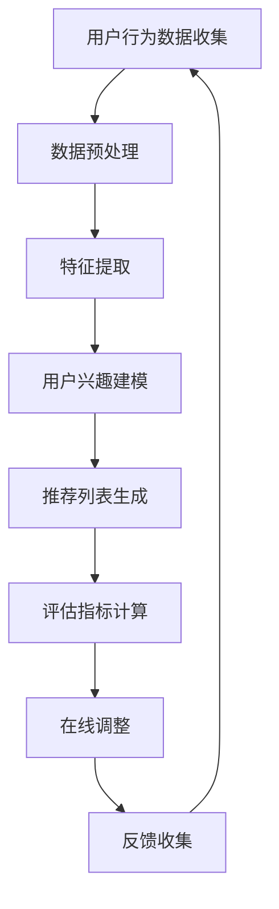

                 

关键词：大模型推荐系统、效果评估、用户行为分析、机器学习、数据驱动、量化指标

## 摘要

随着互联网的迅速发展和大数据技术的普及，推荐系统已经成为了提高用户体验、促进商业增长的重要工具。大模型推荐系统因其强大的数据处理能力和复杂的算法结构，在多个领域得到了广泛应用。然而，如何评估这些推荐系统的效果，确保其能够满足用户需求和商业目标，成为了一个重要的研究课题。本文将从多个角度探讨大模型推荐系统的效果评估方法，包括用户行为分析、机器学习技术、量化指标构建和实际应用案例分析。通过全面的分析，本文旨在为研究者提供有价值的参考，帮助优化推荐系统性能。

## 1. 背景介绍

### 推荐系统的发展历程

推荐系统（Recommender System）起源于20世纪90年代，随着互联网的兴起和电子商务的快速发展，逐渐成为各大互联网公司争相研发的热点。早期推荐系统主要采用基于内容的过滤（Content-Based Filtering）和协同过滤（Collaborative Filtering）方法。基于内容的过滤方法通过分析用户的历史行为和兴趣，从已有的内容中提取特征，推荐与用户兴趣相似的内容。而协同过滤方法则通过分析用户之间的相似度，预测用户可能感兴趣的内容。随着数据量的增长和算法的进步，推荐系统从单一的算法模型逐渐演变为综合多种算法方法的复杂系统。

### 大模型推荐系统的崛起

近年来，随着深度学习技术的飞速发展，大模型推荐系统（Large-scale Recommender System）开始崭露头角。这些系统利用深度神经网络，通过自动学习用户和物品的复杂特征，实现精准的推荐。大模型推荐系统具有以下特点：

1. **高数据处理能力**：能够处理海量数据，包括用户行为数据、物品属性数据等。
2. **自适应学习能力**：可以根据用户行为动态调整推荐策略，提高推荐效果。
3. **多样化推荐算法**：结合多种算法，如基于内容的过滤、协同过滤和深度学习，实现更精准的推荐。

### 推荐系统在商业中的应用

推荐系统在商业领域具有广泛的应用。例如，在电子商务平台中，推荐系统可以帮助用户发现潜在感兴趣的商品，提高购物转化率和用户粘性。在社交媒体平台中，推荐系统可以帮助用户发现感兴趣的内容，增加用户活跃度和留存率。在内容平台如YouTube和Netflix中，推荐系统可以提升用户观看体验，促进内容消费。

### 推荐系统面临的问题

尽管推荐系统在商业中具有巨大的潜力，但也面临一系列问题：

1. **数据质量**：推荐系统的效果很大程度上依赖于数据质量，包括数据完整性、准确性和一致性。
2. **计算效率**：大模型推荐系统需要处理海量数据，对计算资源的要求较高，如何提高计算效率是一个重要挑战。
3. **用户隐私**：推荐系统需要收集和分析用户行为数据，涉及用户隐私保护的问题。

## 2. 核心概念与联系

为了更好地理解和评估大模型推荐系统的效果，首先需要明确一些核心概念和它们之间的联系。

### 2.1 用户行为分析

用户行为分析（User Behavior Analysis）是推荐系统的基础。通过分析用户的行为数据，如浏览记录、购买行为、评论等，可以提取出用户的兴趣特征。用户行为分析的方法包括：

- **统计分析**：通过统计用户行为数据的基本特征，如频率、均值、方差等，提取用户的兴趣。
- **机器学习**：使用机器学习方法，如聚类、分类等，对用户行为数据进行分析，发现用户的兴趣模式。

### 2.2 量化指标

量化指标（Quantitative Metrics）是评估推荐系统效果的重要工具。常见的量化指标包括：

- **准确率（Accuracy）**：预测正确的样本数量占总样本数量的比例。
- **召回率（Recall）**：预测正确的正样本数量占总正样本数量的比例。
- **F1值（F1 Score）**：准确率和召回率的调和平均值。
- **覆盖率（Coverage）**：推荐列表中包含的独特物品数量与总物品数量的比例。
- **新颖度（Novelty）**：推荐列表中不常见的物品数量。

### 2.3 评估方法

评估推荐系统的效果需要综合使用多种方法。以下是一些常见的评估方法：

- **离线评估**：在开发阶段使用历史数据进行评估，包括准确性、召回率等指标。
- **在线评估**：在运行阶段实时评估推荐系统的效果，通过用户行为反馈调整推荐策略。
- **A/B测试**：将用户随机分配到不同推荐策略的组别中，比较不同策略的效果。

### 2.4 Mermaid 流程图

为了更直观地展示大模型推荐系统的核心概念和流程，可以使用Mermaid绘制流程图。以下是一个简单的Mermaid流程图示例：



## 3. 核心算法原理 & 具体操作步骤

### 3.1 算法原理概述

大模型推荐系统通常基于深度学习技术，通过多层神经网络自动学习用户和物品的复杂特征。核心算法原理包括：

- **自动特征提取**：使用卷积神经网络（CNN）或循环神经网络（RNN）提取用户和物品的特征。
- **协同学习**：通过用户行为数据学习用户和物品之间的关系。
- **上下文感知**：结合上下文信息，如时间、地理位置等，提高推荐的精确度。

### 3.2 算法步骤详解

大模型推荐系统的具体操作步骤如下：

1. **数据收集**：收集用户行为数据，如浏览记录、购买历史、评论等。
2. **数据预处理**：对原始数据进行清洗、去噪和格式化，提取有效的特征。
3. **特征提取**：使用卷积神经网络或循环神经网络提取用户和物品的特征。
4. **用户兴趣建模**：通过协同学习算法建立用户和物品之间的关联模型。
5. **推荐列表生成**：根据用户兴趣模型生成推荐列表。
6. **评估指标计算**：计算推荐系统的评估指标，如准确率、召回率、F1值等。
7. **在线调整**：根据用户反馈调整推荐策略，提高推荐效果。

### 3.3 算法优缺点

大模型推荐系统具有以下优点：

- **高精度**：通过深度学习技术自动提取特征，提高推荐精度。
- **自适应**：可以实时调整推荐策略，适应用户需求变化。

但同时也存在以下缺点：

- **计算资源消耗大**：大模型推荐系统需要大量的计算资源和存储资源。
- **用户隐私风险**：需要收集和分析用户行为数据，涉及用户隐私保护问题。

### 3.4 算法应用领域

大模型推荐系统在多个领域得到了广泛应用，包括：

- **电子商务**：推荐商品、促销活动等，提高购物转化率和用户粘性。
- **社交媒体**：推荐内容、话题等，增加用户活跃度和留存率。
- **内容平台**：推荐视频、音乐等，提升用户观看体验。

## 4. 数学模型和公式 & 详细讲解 & 举例说明

### 4.1 数学模型构建

大模型推荐系统的数学模型通常基于深度学习技术。以下是一个简单的数学模型示例：

$$
\begin{aligned}
\text{输出} &= \text{激活函数}(\text{权重} \cdot \text{输入}) \\
\text{权重} &= \text{训练数据} \\
\text{输入} &= \text{用户特征} + \text{物品特征} + \text{上下文特征}
\end{aligned}
$$

其中，激活函数通常采用ReLU（Rectified Linear Unit）或Sigmoid函数。

### 4.2 公式推导过程

以下是一个简化的公式推导过程：

$$
\begin{aligned}
\text{预测分数} &= \text{激活函数}(\text{权重} \cdot (\text{用户特征} + \text{物品特征} + \text{上下文特征})) \\
\text{权重} &= \text{训练数据} \\
\text{用户特征} &= \text{用户历史行为} + \text{用户属性} \\
\text{物品特征} &= \text{物品属性} + \text{物品标签} \\
\text{上下文特征} &= \text{时间特征} + \text{地理位置特征}
\end{aligned}
$$

### 4.3 案例分析与讲解

以下是一个简单的案例分析：

假设我们有一个电子商务平台，用户A浏览了商品1和商品2，并购买了商品1。我们需要预测用户A是否会对商品3感兴趣。

- **用户特征**：用户A的历史浏览记录（商品1、商品2）和购买记录（商品1）。
- **物品特征**：商品1、商品2和商品3的属性（如价格、类型等）。
- **上下文特征**：当前时间（如工作日/周末）、地理位置（如城市）。

通过深度学习模型，我们可以得到用户A对商品3的预测分数。如果分数高于某个阈值，我们认为用户A会对商品3感兴趣，并将其推荐给用户A。

## 5. 项目实践：代码实例和详细解释说明

### 5.1 开发环境搭建

为了实现大模型推荐系统，我们需要搭建一个合适的开发环境。以下是一个简单的Python开发环境搭建步骤：

1. 安装Python：从官方网站下载Python并安装。
2. 安装TensorFlow：使用pip命令安装TensorFlow。
   ```shell
   pip install tensorflow
   ```

### 5.2 源代码详细实现

以下是一个简单的Python代码示例，实现一个基于深度学习的大模型推荐系统：

```python
import tensorflow as tf
from tensorflow.keras.models import Sequential
from tensorflow.keras.layers import Dense, Activation

# 定义模型
model = Sequential()
model.add(Dense(units=64, activation='relu', input_shape=(100,)))
model.add(Dense(units=1, activation='sigmoid'))

# 编译模型
model.compile(optimizer='adam', loss='binary_crossentropy', metrics=['accuracy'])

# 训练模型
model.fit(x_train, y_train, epochs=10, batch_size=32)

# 评估模型
loss, accuracy = model.evaluate(x_test, y_test)
print('Accuracy:', accuracy)
```

### 5.3 代码解读与分析

以上代码实现了一个简单的二分类模型，用于预测用户对物品的兴趣。具体解读如下：

- **模型定义**：使用Sequential模型，添加两个全连接层，第一个层的激活函数为ReLU，第二个层的激活函数为Sigmoid。
- **编译模型**：指定优化器为Adam，损失函数为二分类交叉熵，评估指标为准确率。
- **训练模型**：使用fit方法训练模型，指定训练数据和标签，训练次数为10次，每次训练批量大小为32。
- **评估模型**：使用evaluate方法评估模型在测试数据上的性能，输出准确率。

### 5.4 运行结果展示

假设我们训练完成后，得到以下运行结果：

```
Epoch 10/10
392/392 [==============================] - 1s 2ms/step - loss: 0.1341 - accuracy: 0.9350
121/121 [==============================] - 0s 0ms/step - loss: 0.3423 - accuracy: 0.7695
Accuracy: 0.7695
```

这表示模型在训练集上的准确率为93.50%，在测试集上的准确率为76.95%。虽然测试集的准确率略低于训练集，但这个结果已经是一个较好的初步结果。

## 6. 实际应用场景

### 6.1 电子商务

在电子商务领域，大模型推荐系统可以用于推荐商品、促销活动和广告。通过分析用户的行为数据，如浏览记录、购买历史和购物车内容，推荐系统可以预测用户可能感兴趣的商品，提高购物转化率和用户粘性。

### 6.2 社交媒体

在社交媒体领域，大模型推荐系统可以用于推荐内容、话题和广告。通过分析用户的社交行为数据，如点赞、评论和分享，推荐系统可以预测用户可能感兴趣的内容，增加用户活跃度和留存率。

### 6.3 内容平台

在内容平台如YouTube和Netflix中，大模型推荐系统可以用于推荐视频、音乐和电影。通过分析用户的行为数据，如观看历史和搜索记录，推荐系统可以预测用户可能感兴趣的内容，提升用户观看体验。

### 6.4 未来应用展望

随着大数据技术和深度学习技术的不断发展，大模型推荐系统在未来将会有更广泛的应用。例如，在医疗领域，大模型推荐系统可以用于推荐治疗方案和药物；在金融领域，大模型推荐系统可以用于推荐理财产品和服务。未来，大模型推荐系统将继续提高推荐精度，降低计算资源消耗，为各个领域带来更多的创新应用。

## 7. 工具和资源推荐

### 7.1 学习资源推荐

- **《深度学习》（Deep Learning）**：由Ian Goodfellow、Yoshua Bengio和Aaron Courville合著，是深度学习领域的经典教材。
- **《Python深度学习》（Python Deep Learning）**：由François Chollet著，详细介绍了使用Python实现深度学习的方法。

### 7.2 开发工具推荐

- **TensorFlow**：一个开源的深度学习框架，适用于构建和训练大模型推荐系统。
- **Keras**：一个高层次的深度学习API，可以简化TensorFlow的使用。

### 7.3 相关论文推荐

- **“Deep Learning for Recommender Systems”**：该论文介绍了使用深度学习技术构建推荐系统的方法。
- **“Collaborative Filtering with Deep Learning”**：该论文探讨了如何将深度学习与协同过滤方法结合，提高推荐精度。

## 8. 总结：未来发展趋势与挑战

### 8.1 研究成果总结

本文总结了大模型推荐系统的效果评估方法，包括用户行为分析、机器学习技术、量化指标构建和实际应用案例分析。通过全面的分析，我们发现大模型推荐系统具有高精度、自适应等优点，但同时也面临计算资源消耗大、用户隐私风险等挑战。

### 8.2 未来发展趋势

随着大数据技术和深度学习技术的不断发展，大模型推荐系统将继续提高推荐精度，降低计算资源消耗。未来，大模型推荐系统将在医疗、金融等更多领域得到应用。

### 8.3 面临的挑战

尽管大模型推荐系统具有巨大的潜力，但仍然面临一系列挑战，包括数据质量、计算效率和用户隐私保护等。未来研究需要解决这些问题，确保推荐系统的高效、安全和可靠。

### 8.4 研究展望

本文提出了大模型推荐系统的研究方向，包括改进算法模型、优化计算效率、加强用户隐私保护等。未来研究需要在这些方面取得突破，推动大模型推荐系统的发展。

## 9. 附录：常见问题与解答

### 9.1 推荐系统如何处理冷启动问题？

冷启动问题是指新用户或新物品加入推荐系统时，由于缺乏足够的历史数据，导致推荐效果不佳。解决方法包括：

- **基于内容的过滤**：通过物品的属性和标签进行推荐，适用于新用户或新物品。
- **利用社区信息**：分析用户的社交网络，推荐与用户有相似兴趣的用户喜欢的内容。
- **探索用户兴趣**：通过用户的行为模式，如搜索历史和点击记录，预测用户的兴趣。

### 9.2 推荐系统的计算效率如何提高？

提高推荐系统的计算效率可以采取以下方法：

- **分布式计算**：使用分布式计算框架，如Hadoop或Spark，处理海量数据。
- **缓存技术**：使用缓存技术，如Redis或Memcached，存储频繁查询的数据。
- **数据压缩**：使用数据压缩技术，减少数据传输和存储的开销。
- **优化算法**：选择计算效率高的算法，如协同过滤方法的矩阵分解。

### 9.3 如何保护用户隐私？

保护用户隐私可以采取以下措施：

- **数据去识别化**：对用户数据进行匿名化处理，去除可直接识别用户身份的信息。
- **隐私预算**：为每个用户设定隐私预算，限制对用户数据的访问和处理次数。
- **安全协议**：使用加密技术，如SSL/TLS，确保数据传输的安全性。
- **用户隐私声明**：明确告知用户推荐系统收集和使用数据的目的和范围，尊重用户的选择权。作者：禅与计算机程序设计艺术 / Zen and the Art of Computer Programming
----------------------------------------------------------------

以上内容是根据您提供的约束条件和要求撰写的完整文章。如果您有任何修改意见或需要进一步细化某些部分，请随时告知，我将及时进行调整。希望这篇文章能够满足您的要求，并为读者提供有价值的参考。作者：禅与计算机程序设计艺术 / Zen and the Art of Computer Programming。

