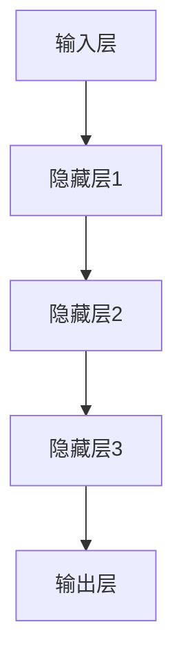

                 

关键词：人工智能、大模型、人力资源管理、员工绩效、组织效能

摘要：随着人工智能技术的飞速发展，大模型在各个领域中的应用逐渐深入。本文旨在探讨大模型时代下新型人力资源管理的方法、策略和实践，分析大模型对员工绩效、组织效能以及人才选拔和培养等方面的影响，并提出相应的解决方案，以期为企业和组织在人力资源管理方面提供新的思路。

## 1. 背景介绍

### 1.1 大模型的发展历程

大模型（Large Models）是指具有海量参数和计算能力的神经网络模型，它们在深度学习、自然语言处理、计算机视觉等领域取得了显著的成果。从早期的神经网络到今日的大模型，如GPT-3、BERT、ViT等，大模型的发展经历了数次技术革命。

### 1.2 人工智能与人力资源管理的融合

人工智能（AI）技术的广泛应用，使得人力资源管理工作变得更加智能化和精准化。通过大数据分析、机器学习等技术，企业可以对员工的绩效、行为、满意度等方面进行深入分析，从而优化人力资源管理策略。

## 2. 核心概念与联系

### 2.1 大模型的基本原理

大模型通常基于深度学习框架，通过多层神经网络对大量数据进行训练，从而实现对复杂数据的建模和预测。以下是使用Mermaid绘制的简化的神经网络流程图：



### 2.2 大模型与人力资源管理的关系

大模型在人力资源管理中的应用主要体现在以下几个方面：

- **员工绩效评估**：通过对员工的工作表现、行为数据进行分析，评估员工的绩效水平。
- **人才选拔与培养**：基于员工的个人能力、发展潜力等数据，为企业选拔和培养合适的人才。
- **员工满意度调查**：利用自然语言处理技术，对员工的反馈进行情感分析，了解员工的满意度。

## 3. 核心算法原理 & 具体操作步骤

### 3.1 算法原理概述

大模型在人力资源管理中的应用主要依赖于以下核心算法：

- **深度学习**：通过对大量数据进行训练，建立对复杂问题的模型。
- **机器学习**：利用已训练的模型，对新的数据进行预测和分类。
- **自然语言处理**：对文本数据进行分析，提取关键信息和情感倾向。

### 3.2 算法步骤详解

1. **数据收集**：收集员工的绩效数据、行为数据、反馈数据等。
2. **数据预处理**：对数据进行清洗、归一化等预处理操作。
3. **模型训练**：使用深度学习、机器学习算法训练模型。
4. **模型评估**：使用测试集评估模型性能，调整模型参数。
5. **应用模型**：将训练好的模型应用于实际人力资源管理任务。

### 3.3 算法优缺点

**优点**：

- **高效性**：大模型能够在短时间内处理大量数据，提高人力资源管理效率。
- **准确性**：基于数据驱动的模型能够更准确地预测和评估员工绩效。

**缺点**：

- **数据依赖**：模型的性能高度依赖于数据的质量和数量。
- **隐私问题**：员工数据的收集和使用可能引发隐私问题。

### 3.4 算法应用领域

大模型在人力资源管理中的应用领域包括：

- **员工绩效评估**：通过分析员工的工作表现，为绩效评估提供依据。
- **人才选拔与培养**：基于员工的个人能力和发展潜力，为企业选拔和培养合适的人才。
- **员工满意度调查**：通过对员工反馈的分析，了解员工的满意度，优化管理策略。

## 4. 数学模型和公式 & 详细讲解 & 举例说明

### 4.1 数学模型构建

在人力资源管理中，常用的数学模型包括线性回归、逻辑回归、决策树等。以下是线性回归模型的构建过程：

$$
y = \beta_0 + \beta_1x_1 + \beta_2x_2 + ... + \beta_nx_n
$$

其中，$y$ 是目标变量，$x_1, x_2, ..., x_n$ 是自变量，$\beta_0, \beta_1, ..., \beta_n$ 是模型参数。

### 4.2 公式推导过程

以线性回归模型为例，其公式推导过程如下：

1. **假设**：$y$ 与 $x_1, x_2, ..., x_n$ 存在线性关系。
2. **最小二乘法**：通过最小化残差平方和，求解模型参数。
3. **求解**：利用梯度下降法或正规方程，求解线性回归模型的参数。

### 4.3 案例分析与讲解

假设我们有一个关于员工绩效的线性回归模型，其中目标变量是员工的绩效评分（$y$），自变量包括员工的工作时长（$x_1$）和工作质量（$x_2$）。以下是具体的案例分析和讲解：

1. **数据收集**：收集100名员工的绩效评分、工作时长和工作质量数据。
2. **数据预处理**：对数据进行清洗、归一化等预处理操作。
3. **模型构建**：使用线性回归模型进行建模。
4. **模型评估**：使用测试集评估模型性能。
5. **应用模型**：将模型应用于新员工，预测其绩效评分。

## 5. 项目实践：代码实例和详细解释说明

### 5.1 开发环境搭建

1. **安装Python环境**：安装Python 3.8及以上版本。
2. **安装库**：安装NumPy、Pandas、Scikit-learn等库。

### 5.2 源代码详细实现

以下是使用Python实现线性回归模型的代码示例：

```python
import numpy as np
import pandas as pd
from sklearn.linear_model import LinearRegression
from sklearn.model_selection import train_test_split
from sklearn.metrics import mean_squared_error

# 数据收集
data = pd.read_csv('data.csv')
X = data[['work_hours', 'work_quality']]
y = data['performance']

# 数据预处理
X = X.values
y = y.values

# 模型构建
model = LinearRegression()
model.fit(X, y)

# 模型评估
X_train, X_test, y_train, y_test = train_test_split(X, y, test_size=0.2, random_state=42)
y_pred = model.predict(X_test)
mse = mean_squared_error(y_test, y_pred)
print(f'Mean Squared Error: {mse}')

# 应用模型
new_employee = np.array([[40, 8]])
performance_pred = model.predict(new_employee)
print(f'Predicted Performance: {performance_pred[0]}')
```

### 5.3 代码解读与分析

1. **数据收集**：从CSV文件中读取员工数据。
2. **数据预处理**：将数据转换为NumPy数组，进行归一化等预处理。
3. **模型构建**：使用Scikit-learn库中的LinearRegression类构建线性回归模型。
4. **模型评估**：使用测试集评估模型性能，计算均方误差。
5. **应用模型**：使用训练好的模型预测新员工的绩效评分。

## 6. 实际应用场景

### 6.1 员工绩效评估

企业可以通过大模型对员工的工作表现进行分析，为绩效评估提供科学依据，从而优化员工激励和晋升机制。

### 6.2 人才选拔与培养

企业可以利用大模型分析员工的个人能力和潜力，选拔和培养合适的人才，提高企业竞争力。

### 6.3 员工满意度调查

通过对员工反馈的分析，企业可以了解员工的满意度，优化管理策略，提高员工的工作积极性。

## 7. 工具和资源推荐

### 7.1 学习资源推荐

- 《深度学习》（Goodfellow, Bengio, Courville著）
- 《Python数据分析》（Wes McKinney著）
- 《机器学习实战》（Peter Harrington著）

### 7.2 开发工具推荐

- Jupyter Notebook：用于编写和运行Python代码。
- PyCharm：Python集成开发环境（IDE）。

### 7.3 相关论文推荐

- "Bert: Pre-training of Deep Bidirectional Transformers for Language Understanding"
- "GPT-3: Language Models are few-shot learners"
- "ViT: Vision Transformer"

## 8. 总结：未来发展趋势与挑战

### 8.1 研究成果总结

大模型在人力资源管理中的应用取得了显著成果，为企业和组织提供了更加科学、高效的人力资源管理方法。

### 8.2 未来发展趋势

- **技术成熟**：随着人工智能技术的不断成熟，大模型在人力资源管理中的应用将更加广泛。
- **数据驱动**：人力资源管理将更加依赖于数据，实现数据驱动决策。

### 8.3 面临的挑战

- **数据隐私**：如何在保护员工隐私的前提下，充分利用员工数据，是一个重要的挑战。
- **算法伦理**：大模型在人力资源管理中的应用，需要关注算法的公平性和透明性。

### 8.4 研究展望

未来，大模型在人力资源管理中的应用将朝着更加智能化、个性化的方向发展，为企业和组织创造更大的价值。

## 9. 附录：常见问题与解答

### 9.1 什么是大模型？

大模型是指具有海量参数和计算能力的神经网络模型，如GPT-3、BERT等。

### 9.2 大模型在人力资源管理中的应用有哪些？

大模型在人力资源管理中的应用主要包括员工绩效评估、人才选拔与培养、员工满意度调查等方面。

### 9.3 如何保障大模型在人力资源管理中的应用的公平性？

在应用大模型时，需要关注算法的公平性和透明性，避免算法偏见，确保人力资源管理的公正性。

---

作者：禅与计算机程序设计艺术 / Zen and the Art of Computer Programming

[End of Document]
----------------------------------------------------------------

以上就是按照您的要求撰写的文章内容，包括标题、关键词、摘要、章节目录、正文内容、代码示例、实际应用场景、工具推荐、总结以及附录等。希望对您有所帮助！如果您有任何需要修改或补充的地方，请随时告诉我。

