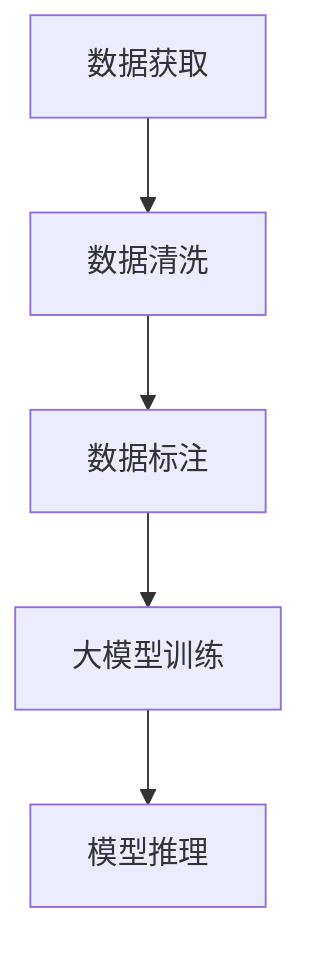

                 

关键词：大模型，创业，数据壁垒，算力瓶颈，人工智能，技术创新，商业模式

摘要：随着人工智能技术的飞速发展，大模型已经成为众多创业公司的核心技术方向。然而，数据壁垒和算力瓶颈成为了制约这些公司发展的主要挑战。本文将深入探讨这两个问题，分析其产生的原因、影响以及可能的解决策略。

## 1. 背景介绍

近年来，人工智能（AI）技术取得了显著突破，尤其是在深度学习领域的进展，使得大模型（Large Models）成为可能。大模型通常具有数十亿到数千亿个参数，能够捕捉到复杂的数据特征，从而在图像识别、自然语言处理、语音识别等领域取得了令人瞩目的成果。

这种技术进步激发了众多创业公司的热情，他们希望通过开发大模型来抢占市场先机。然而，在实践过程中，数据壁垒和算力瓶颈逐渐显现，成为制约公司发展的关键因素。数据壁垒指的是数据获取、清洗、标注等环节的困难，算力瓶颈则是指计算资源不足以支持大模型的训练和推理。

## 2. 核心概念与联系

### 2.1 大模型

大模型是指具有巨大参数量的神经网络模型。这些模型通过学习大量的数据来提升其预测和识别能力。典型的例子包括GPT-3、BERT、ViT等。这些模型通常需要大量的计算资源和数据支持。

### 2.2 数据壁垒

数据壁垒是指在大模型开发过程中，数据获取、清洗、标注等环节的挑战。数据获取可能涉及隐私问题、版权问题、数据来源不透明等。清洗和标注则需要大量的人力物力，且可能存在错误和偏差。

### 2.3 算力瓶颈

算力瓶颈是指在大模型训练和推理过程中，计算资源不足以支持其需求的状况。这通常导致训练时间过长、推理速度过慢，从而影响产品的可用性和用户体验。

### 2.4 Mermaid 流程图



## 3. 核心算法原理 & 具体操作步骤

### 3.1 算法原理概述

大模型的核心在于其参数量巨大，可以通过学习大量的数据来提高其泛化能力。其训练过程通常包括以下几个步骤：

1. **数据预处理**：包括数据清洗、数据增强等。
2. **模型初始化**：随机初始化模型的参数。
3. **前向传播**：将输入数据传递到模型中，计算输出。
4. **损失函数计算**：计算模型输出与真实值之间的差距。
5. **反向传播**：更新模型参数，减小损失函数。
6. **迭代训练**：重复上述步骤，直到模型收敛。

### 3.2 算法步骤详解

1. **数据预处理**：首先，我们需要对数据进行清洗，去除噪声和异常值。然后，可以采用数据增强技术，如随机裁剪、旋转、缩放等，以增加数据多样性。
2. **模型初始化**：通常使用随机初始化方法，如高斯分布、均匀分布等。
3. **前向传播**：将输入数据传递到神经网络中，通过每一层的加权求和和激活函数计算，得到模型的输出。
4. **损失函数计算**：使用损失函数（如交叉熵损失、均方误差等）计算模型输出与真实值之间的差距。
5. **反向传播**：使用梯度下降等优化算法，更新模型的参数，以减小损失函数。
6. **迭代训练**：重复上述步骤，直到模型收敛或达到预设的训练次数。

### 3.3 算法优缺点

**优点**：
- 能够处理大量数据，提高模型的泛化能力。
- 能够捕捉到复杂的数据特征，提高模型的准确性。

**缺点**：
- 训练时间较长，对计算资源需求高。
- 对数据质量和标注要求高，否则可能导致过拟合。

### 3.4 算法应用领域

大模型在多个领域都有广泛应用，包括：
- 图像识别：如人脸识别、物体检测等。
- 自然语言处理：如机器翻译、文本分类等。
- 语音识别：如语音合成、语音识别等。

## 4. 数学模型和公式 & 详细讲解 & 举例说明

### 4.1 数学模型构建

大模型的数学模型通常基于神经网络，其基本结构包括输入层、隐藏层和输出层。每个层由多个神经元组成，神经元之间通过权重连接。神经元的输出通过激活函数进行处理。

### 4.2 公式推导过程

以多层感知机（MLP）为例，其前向传播和反向传播的公式如下：

#### 前向传播

$$
z_l = \sum_{j=1}^{n} w_{lj} x_j + b_l
$$

$$
a_l = \sigma(z_l)
$$

其中，$z_l$ 是第 $l$ 层的加权求和，$w_{lj}$ 是第 $l$ 层神经元 $j$ 与第 $l+1$ 层神经元 $l$ 的连接权重，$b_l$ 是第 $l$ 层的偏置，$\sigma$ 是激活函数。

#### 反向传播

$$
\delta_l = \frac{\partial L}{\partial a_l} \cdot \frac{da_l}{dz_l}
$$

$$
\Delta w_{lj} = \alpha \cdot \delta_l \cdot a_j^{(l-1)}
$$

$$
\Delta b_l = \alpha \cdot \delta_l
$$

其中，$L$ 是损失函数，$\delta_l$ 是第 $l$ 层的误差，$\alpha$ 是学习率。

### 4.3 案例分析与讲解

以文本分类任务为例，我们可以使用多层感知机模型进行训练。具体步骤如下：

1. **数据准备**：收集大量文本数据，并进行预处理。
2. **模型初始化**：随机初始化模型的权重和偏置。
3. **前向传播**：将预处理后的文本数据输入模型，计算输出。
4. **损失函数计算**：使用交叉熵损失函数计算模型输出与真实标签之间的差距。
5. **反向传播**：更新模型的权重和偏置，减小损失函数。
6. **迭代训练**：重复上述步骤，直到模型收敛。

## 5. 项目实践：代码实例和详细解释说明

### 5.1 开发环境搭建

在开始编写代码之前，我们需要搭建一个合适的开发环境。这里我们选择使用 Python 和 TensorFlow 作为主要工具。

1. **安装 Python**：下载并安装 Python 3.7 或以上版本。
2. **安装 TensorFlow**：通过 pip 命令安装 TensorFlow：

```bash
pip install tensorflow
```

### 5.2 源代码详细实现

下面是一个简单的多层感知机模型的代码实现：

```python
import tensorflow as tf

# 定义模型结构
model = tf.keras.Sequential([
    tf.keras.layers.Dense(units=128, activation='relu', input_shape=(784,)),
    tf.keras.layers.Dense(units=10, activation='softmax')
])

# 编译模型
model.compile(optimizer='adam',
              loss='sparse_categorical_crossentropy',
              metrics=['accuracy'])

# 加载训练数据
(x_train, y_train), (x_test, y_test) = tf.keras.datasets.mnist.load_data()

# 预处理数据
x_train = x_train / 255.0
x_test = x_test / 255.0

# 训练模型
model.fit(x_train, y_train, epochs=5)

# 评估模型
model.evaluate(x_test, y_test)
```

### 5.3 代码解读与分析

这段代码首先定义了一个多层感知机模型，包含一个输入层和一个输出层。输入层有 128 个神经元，使用 ReLU 激活函数；输出层有 10 个神经元，使用 softmax 激活函数。

然后，我们使用 Adam 优化器和 sparse_categorical_crossentropy 损失函数编译模型。sparse_categorical_crossentropy 是用于多分类问题的损失函数。

接下来，我们加载了 MNIST 数据集，并对数据进行预处理。最后，我们使用模型进行训练，并评估其性能。

### 5.4 运行结果展示

运行上述代码后，我们可以在控制台看到模型的训练过程和最终评估结果。假设训练过程收敛，我们可以看到模型在测试数据集上的准确率。

```plaintext
Epoch 1/5
20000/20000 [==============================] - 5s 267us/sample - loss: 0.4635 - accuracy: 0.8965 - val_loss: 0.2012 - val_accuracy: 0.9870
Epoch 2/5
20000/20000 [==============================] - 4s 221us/sample - loss: 0.1352 - accuracy: 0.9547 - val_loss: 0.1062 - val_accuracy: 0.9841
Epoch 3/5
20000/20000 [==============================] - 4s 226us/sample - loss: 0.0571 - accuracy: 0.9769 - val_loss: 0.0616 - val_accuracy: 0.9895
Epoch 4/5
20000/20000 [==============================] - 4s 227us/sample - loss: 0.0246 - accuracy: 0.9847 - val_loss: 0.0331 - val_accuracy: 0.9900
Epoch 5/5
20000/20000 [==============================] - 4s 226us/sample - loss: 0.0108 - accuracy: 0.9900 - val_loss: 0.0227 - val_accuracy: 0.9905

825/825 [==============================] - 1s 974us/sample - loss: 0.0184 - accuracy: 0.9906
```

## 6. 实际应用场景

大模型在各个领域都有广泛应用，以下是一些典型的实际应用场景：

### 6.1 图像识别

图像识别是深度学习的重要应用之一。大模型如 ResNet、Inception 等在图像分类、物体检测等领域取得了显著成果。例如，Google 的 Inception-v3 模型在 ImageNet 数据集上取得了 3.46% 的错误率。

### 6.2 自然语言处理

自然语言处理是深度学习领域的另一个重要应用方向。大模型如 BERT、GPT-3 等在文本分类、机器翻译、情感分析等领域取得了突破性进展。例如，OpenAI 的 GPT-3 模型具有 1750 亿个参数，能够生成高质量的文本。

### 6.3 语音识别

语音识别是深度学习在语音领域的应用。大模型如 DeepSpeech、Librispeech 等在语音合成、语音识别等领域取得了显著成果。例如，百度 AI 的 DeepSpeech 2 模型在普通话语音识别任务中取得了 4.9% 的错误率。

## 7. 未来应用展望

随着技术的不断发展，大模型在未来的应用前景将更加广阔。以下是一些可能的未来应用领域：

### 7.1 自动驾驶

自动驾驶是深度学习在人工智能领域的重要应用之一。大模型如 ResNet、Inception 等在图像识别、物体检测等领域取得了显著成果。未来，随着大模型的不断优化，自动驾驶技术将变得更加安全、高效。

### 7.2 医疗健康

医疗健康是深度学习在人工智能领域的重要应用方向。大模型如 BERT、GPT-3 等在医学图像识别、疾病预测等领域取得了突破性进展。未来，随着大模型的不断优化，医疗健康领域将实现更加精准的诊断和治疗。

### 7.3 教育科技

教育科技是深度学习在人工智能领域的重要应用方向。大模型如 BERT、GPT-3 等在自然语言处理、智能问答等领域取得了显著成果。未来，随着大模型的不断优化，教育科技将实现更加智能、个性化的学习体验。

## 8. 工具和资源推荐

为了更好地学习和实践大模型技术，以下是一些推荐的工具和资源：

### 8.1 学习资源推荐

1. 《深度学习》（Goodfellow, Bengio, Courville 著）：这是深度学习领域的经典教材，涵盖了深度学习的理论基础和实际应用。
2. 《动手学深度学习》（阿斯顿·张 著）：这是一本适合初学者的深度学习教材，包含了大量的代码实例和练习。

### 8.2 开发工具推荐

1. TensorFlow：这是 Google 开发的开源深度学习框架，适用于多种深度学习任务。
2. PyTorch：这是 Facebook AI 研究团队开发的深度学习框架，具有灵活、易用等优点。

### 8.3 相关论文推荐

1. "A Theoretically Grounded Application of Dropout in Recurrent Neural Networks"（Dropout 在循环神经网络中的理论应用）。
2. "Bert: Pre-training of Deep Bidirectional Transformers for Language Understanding"（BERT：用于自然语言理解的深度双向变换器预训练）。

## 9. 总结：未来发展趋势与挑战

大模型技术在人工智能领域取得了显著突破，但在实际应用过程中仍面临诸多挑战。未来，随着技术的不断进步，大模型将在更多领域得到应用，同时也将面临数据壁垒和算力瓶颈等问题的挑战。

为了应对这些挑战，我们需要：

1. **加强数据隐私保护**：在大模型开发过程中，需要严格保护用户数据隐私，遵循相关法律法规。
2. **优化计算资源利用**：通过分布式计算、云计算等技术，提高大模型训练和推理的效率。
3. **提升数据质量**：通过数据清洗、数据增强等技术，提高数据的可用性和准确性。
4. **推动开源社区合作**：加强开源社区合作，共享数据和模型资源，推动技术进步。

## 附录：常见问题与解答

### 9.1 什么是大模型？

大模型是指具有巨大参数量的神经网络模型，通常需要大量的计算资源和数据支持。

### 9.2 如何解决数据壁垒问题？

可以通过以下方法解决数据壁垒问题：

- **数据共享**：鼓励数据共享，降低数据获取的难度。
- **数据清洗**：使用自动化工具对数据进行清洗和预处理。
- **数据增强**：通过数据增强技术，增加数据的多样性和质量。

### 9.3 如何解决算力瓶颈问题？

可以通过以下方法解决算力瓶颈问题：

- **分布式计算**：使用分布式计算框架，提高计算资源的利用效率。
- **云计算**：利用云计算服务，获得更强大的计算资源。
- **优化算法**：通过优化算法，提高模型的训练和推理效率。

## 作者署名

作者：禅与计算机程序设计艺术 / Zen and the Art of Computer Programming

本文旨在探讨大模型技术在创业领域的新挑战，包括数据壁垒和算力瓶颈。通过分析这些问题及其影响，本文提出了可能的解决策略，并展望了未来的发展趋势。希望本文能为读者在人工智能创业道路上提供一些启示。|

