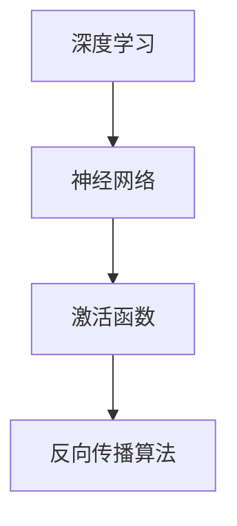

                 

### 1. 背景介绍

随着人工智能（AI）技术的迅猛发展，大模型（Large Models）成为了当前研究的热点。从最初的单一任务模型，如聊天机器人、图像识别等，到如今的多模态、多任务模型，如GPT-3、BERT等，AI的大模型在各个领域展现出了强大的应用潜力。这不仅推动了学术研究的进步，也为企业创新和创业提供了新的机遇。

创业产品经理在这一过程中扮演着至关重要的角色。他们不仅要理解AI技术的核心原理，还要能够将技术潜力转化为实际的产品价值。然而，随着AI技术的复杂性和深度不断加深，创业产品经理面临的挑战也越来越大。因此，掌握AI技能成为了创业产品经理在新时代必备的能力。

本文旨在探讨大模型时代下，创业产品经理所需具备的AI技能要求。通过分析AI技术的核心概念、算法原理、数学模型以及实际应用，我们将为创业产品经理提供一套全面的AI技能指南。同时，本文还将介绍一些学习资源和工具，帮助读者更好地提升自己的AI技能。

## 1.1 大模型的发展历程

大模型的发展可以追溯到深度学习技术的兴起。深度学习是一种通过多层神经网络模拟人类大脑学习过程的人工智能方法。2006年，Hinton等人提出了深度信念网络（Deep Belief Networks，DBN），标志着深度学习技术进入了新的阶段。随后，随着计算能力的提升和数据规模的扩大，深度学习在语音识别、图像识别等领域取得了显著成果。

2012年，Hinton领导的团队在ImageNet图像识别挑战赛中取得了突破性的成果，这一事件被誉为深度学习领域的“圣诞树”。随着卷积神经网络（Convolutional Neural Networks，CNN）和递归神经网络（Recurrent Neural Networks，RNN）等深度学习架构的不断发展，大模型的概念逐渐形成。

2018年，Google发布了Transformer架构，这一模型在自然语言处理（Natural Language Processing，NLP）领域取得了巨大的成功，成为了大模型时代的重要里程碑。随后，GPT-3、BERT等大型预训练模型相继问世，标志着大模型在AI领域的重要性进一步凸显。

## 1.2 创业产品经理的角色与职责

创业产品经理在创业公司中扮演着多重角色。首先，他们需要具备市场洞察力，能够准确捕捉用户需求，并将其转化为具体的产品需求。其次，创业产品经理还需要具备技术理解力，能够与技术团队紧密合作，确保产品的技术实现与商业目标一致。

此外，创业产品经理还需要具备项目管理能力，能够有效地协调团队资源，确保项目按时、按质完成。他们需要具备优秀的沟通能力和决策能力，能够在压力下做出合理的决策，并有效地与团队成员、投资者和客户进行沟通。

在AI大模型时代，创业产品经理的职责和要求有了新的变化。首先，他们需要深入了解AI技术的核心原理，包括深度学习、自然语言处理、计算机视觉等领域。其次，创业产品经理需要具备数据分析和机器学习的能力，能够从海量数据中提取有价值的信息，并将其应用于产品设计和优化。

此外，创业产品经理还需要具备跨学科的知识储备，包括心理学、经济学、设计学等，以便更好地理解用户需求和市场动态。最后，创业产品经理需要具备持续学习和自我提升的能力，以适应AI技术快速发展的趋势。

### 1.3 大模型在创业中的应用前景

大模型在创业中的应用前景广阔，不仅限于科技领域，还覆盖了金融、医疗、教育、零售等多个行业。在金融领域，大模型可以用于风险管理、客户关系管理、信用评估等，为金融机构提供更加精准和高效的服务。例如，通过分析客户的历史交易数据，大模型可以预测客户的未来行为，从而帮助银行和保险公司优化营销策略。

在医疗领域，大模型可以用于疾病诊断、药物研发、健康管理等。通过分析大量的医疗数据，大模型可以辅助医生进行疾病诊断，提高诊断的准确性和效率。此外，大模型还可以用于药物研发，通过模拟和预测药物与生物体的相互作用，加速新药的发现和上市。

在教育领域，大模型可以用于个性化学习、智能评测、教育资源优化等。通过分析学生的学习行为和成绩数据，大模型可以为每个学生提供个性化的学习方案，提高学习效果。同时，大模型还可以用于智能评测，通过对学生的答题数据进行分析，快速准确地评估学生的学习情况。

在零售领域，大模型可以用于商品推荐、库存管理、供应链优化等。通过分析消费者的购买行为和偏好数据，大模型可以为零售商提供精准的商品推荐，提高销售额。此外，大模型还可以用于库存管理和供应链优化，通过预测需求变化，帮助企业优化库存策略，降低库存成本。

总的来说，大模型在创业中的应用前景广阔，为各个行业带来了新的机遇和挑战。创业产品经理需要充分利用大模型的优势，将其应用于产品设计和优化，提高产品的竞争力。

### 1.4 创业产品经理面临的挑战与机遇

在AI大模型时代，创业产品经理既面临着前所未有的挑战，也迎来了难得的机遇。首先，大模型的复杂性使得产品经理需要具备更深入的技术理解，不仅需要了解基本的机器学习原理，还需要掌握深度学习、自然语言处理等高级技术。这无疑增加了产品经理的学习成本和时间压力。

其次，创业公司通常资源有限，产品经理需要在有限的时间和预算内，快速推出具有竞争力的产品。这就要求产品经理具备高效的项目管理和决策能力，能够在快速变化的市场环境中做出准确的判断和决策。

然而，AI大模型也为创业产品经理带来了新的机遇。首先，大模型的应用可以帮助企业实现更加精准的用户画像和需求分析，从而推出更加符合用户需求的产品。其次，大模型在数据处理和预测方面的强大能力，可以帮助企业提高运营效率，降低成本，提升竞争力。

此外，AI大模型的发展也催生了新的创业领域和商业模式。例如，基于大模型的智能客服、智能营销、智能医疗等应用，为创业公司提供了丰富的创新空间。创业产品经理需要敏锐地捕捉这些机遇，将其转化为实际的产品价值。

总的来说，AI大模型时代为创业产品经理带来了新的挑战和机遇。产品经理需要不断提升自己的技能和知识储备，以适应快速变化的市场环境。同时，他们也需要具备创新思维和商业洞察力，将技术优势转化为实际的产品竞争力。

### 1.5 本文结构概述

本文将分为九个部分，系统地探讨大模型时代创业产品经理所需具备的AI技能要求。首先，在第二部分，我们将介绍AI的核心概念和基本原理，为后续内容打下基础。接着，第三部分将详细讲解大模型的架构和实现过程。

第四部分将深入探讨数学模型和公式在大模型中的应用，通过具体案例进行分析和讲解。第五部分将提供代码实例和详细解释，帮助读者更好地理解和应用大模型。

第六部分将探讨大模型在实际应用场景中的表现，包括金融、医疗、教育和零售等领域。第七部分将介绍未来大模型的应用前景和发展趋势。

第八部分将推荐一些学习资源和工具，帮助创业产品经理提升AI技能。最后，在第九部分，我们将总结研究成果，探讨未来发展趋势和面临的挑战，为创业产品经理提供前瞻性指导。

### 2. 核心概念与联系

在深入探讨大模型之前，我们需要了解一些核心概念和原理，这些概念构成了AI技术的基础。在这里，我们将介绍深度学习、神经网络、激活函数、反向传播算法等基本概念，并使用Mermaid流程图（无括号、逗号等特殊字符）展示它们之间的关系。

#### 2.1 深度学习

深度学习是一种基于多层神经网络的学习方法，它通过模拟人类大脑的神经网络结构，对大量数据进行训练，从而实现复杂的模式识别和预测任务。深度学习的基本思想是通过层层提取特征，从原始数据中提取有意义的抽象表示。

#### 2.2 神经网络

神经网络是深度学习的基础，由大量简单的计算单元——神经元（或节点）组成。每个神经元接收多个输入，通过加权求和后，经过激活函数产生输出。神经网络通过调整权重和偏置，使得输出能够接近目标输出，从而实现学习过程。

#### 2.3 激活函数

激活函数是神经网络中至关重要的部分，它引入非线性因素，使得神经网络能够进行复杂函数的逼近。常见的激活函数包括Sigmoid函数、ReLU函数、Tanh函数等。

#### 2.4 反向传播算法

反向传播算法是深度学习训练的核心算法，它通过反向传播误差信号，更新神经网络的权重和偏置，从而最小化误差函数。反向传播算法的基本思想是将输出误差分成前向传播和反向传播两个阶段，通过反复迭代，逐步优化网络参数。

#### 2.5 Mermaid流程图

下面是一个简单的Mermaid流程图，展示了深度学习、神经网络、激活函数和反向传播算法之间的关系：



### 3. 核心算法原理 & 具体操作步骤

在了解了大模型的基本概念和结构后，我们将深入探讨大模型的核心算法原理，并详细解释其具体操作步骤。

#### 3.1 算法原理概述

大模型的核心算法主要包括两部分：预训练（Pre-training）和微调（Fine-tuning）。预训练阶段，模型在大量的无标签数据上进行训练，学习通用的特征表示。微调阶段，模型在特定任务上有标签的数据上进行微调，以适应具体的任务需求。

#### 3.2 算法步骤详解

1. **数据预处理**：在预训练阶段，首先需要对数据进行清洗、预处理，包括文本的分词、去除停用词、词向量的编码等。在微调阶段，需要对数据进行格式化，以适应模型的输入要求。

2. **模型初始化**：在预训练阶段，通常使用随机初始化的方式初始化模型参数。在微调阶段，可以使用预训练好的模型参数作为初始化。

3. **预训练**：
    - **自监督学习**：在预训练阶段，模型通过自监督学习方式学习数据的特征表示。例如，在自然语言处理任务中，可以使用掩码语言模型（Masked Language Model，MLM）进行训练，即在输入文本中随机掩码一部分词，模型需要预测这些被掩码的词。
    - **优化目标**：预训练的目标是最小化预测被掩码词的损失。常用的优化算法包括Adam、AdamW等。

4. **微调**：
    - **任务定义**：在微调阶段，需要定义具体的任务，如分类、回归、命名实体识别等。任务定义包括输入层、输出层的设计和损失函数的选择。
    - **数据准备**：准备用于微调的有标签数据集，并进行格式化，使其符合模型的输入要求。
    - **优化目标**：微调的目标是最小化任务损失，常用的损失函数包括交叉熵损失、均方误差等。

5. **训练与验证**：在预训练和微调阶段，都需要进行模型的训练和验证。训练过程包括前向传播、损失计算和反向传播三个步骤。验证过程用于评估模型在未见过的数据上的性能。

6. **模型评估**：在模型训练完成后，需要对模型进行全面的评估，包括准确率、召回率、F1分数等指标。根据评估结果，可以对模型进行进一步的优化和调整。

#### 3.3 算法优缺点

**优点**：
1. **强大的泛化能力**：大模型通过预训练和微调，能够学习到通用的特征表示，从而在不同任务上表现出强大的泛化能力。
2. **高效的性能**：大模型通过多层神经网络的结构，能够对复杂的数据进行有效的处理，从而提高模型的性能。
3. **自动特征提取**：大模型通过预训练，能够自动提取数据的特征表示，从而减轻了人工特征工程的工作量。

**缺点**：
1. **计算资源消耗大**：大模型需要大量的计算资源进行训练，特别是在预训练阶段，需要使用大量的GPU或TPU等高性能计算设备。
2. **训练时间长**：大模型的训练时间通常较长，特别是在预训练阶段，需要数天甚至数周的时间。
3. **数据依赖性强**：大模型在预训练阶段需要大量的无标签数据，而在微调阶段需要高质量的有标签数据，这对数据的质量和数量有较高的要求。

#### 3.4 算法应用领域

大模型的应用领域非常广泛，包括但不限于以下领域：

1. **自然语言处理**：大模型在自然语言处理领域取得了显著的成果，如文本分类、机器翻译、情感分析等。
2. **计算机视觉**：大模型在计算机视觉领域表现优异，如图像分类、目标检测、图像生成等。
3. **推荐系统**：大模型可以用于推荐系统的优化，如基于用户行为的个性化推荐。
4. **语音识别**：大模型在语音识别领域也展现了强大的能力，如语音到文本转换、语音情感分析等。

### 4. 数学模型和公式 & 详细讲解 & 举例说明

在深入探讨大模型的数学模型和公式之前，我们需要了解一些基础的数学知识，如线性代数、微积分和概率论。这些数学知识构成了大模型算法的基础，对于理解和实现大模型至关重要。

#### 4.1 线性代数

线性代数是深度学习中必不可少的部分，涉及向量、矩阵、行列式、矩阵运算等基本概念。

**矩阵运算**：

- **矩阵加法**：两个矩阵相加，要求它们具有相同的维度，对应位置上的元素相加。
- **矩阵乘法**：两个矩阵相乘，结果是一个新矩阵，其元素是原矩阵对应行的元素与列的元素相乘并求和。
- **矩阵求逆**：一个方阵的逆矩阵是使得它与原矩阵相乘后得到单位矩阵的矩阵。

**矩阵求逆的公式**：

$$
A^{-1} = \frac{1}{\det(A)} \text{adj}(A)
$$

其中，$\det(A)$ 是矩阵 A 的行列式，$\text{adj}(A)$ 是矩阵 A 的伴随矩阵。

**向量内积和外积**：

- **向量内积**（点积）：两个向量对应元素相乘后再相加。
  $$\vec{a} \cdot \vec{b} = a_1b_1 + a_2b_2 + \ldots + a_nb_n$$
- **向量外积**（叉积）：两个三维向量进行外积运算，结果是一个新的向量，其方向垂直于原始的两个向量。

#### 4.2 微积分

微积分是研究函数变化率和积累过程的基本工具，对于理解神经网络的训练过程至关重要。

**导数**：

导数是描述函数在某一点变化快慢的度量。对于函数 $f(x)$，其在点 $x$ 处的导数表示为 $f'(x)$ 或 $\frac{df}{dx}$。

**梯度**：

梯度是导数在多变量函数中的应用，它是一个向量，其分量是各个变量导数的集合。

$$
\nabla f(x) = \left( \frac{\partial f}{\partial x_1}, \frac{\partial f}{\partial x_2}, \ldots, \frac{\partial f}{\partial x_n} \right)
$$

**链式法则**：

链式法则是计算复合函数导数的基本法则。假设 $f(x)$ 和 $g(x)$ 是两个函数，那么复合函数 $f(g(x))$ 的导数可以通过以下公式计算：

$$
\frac{d}{dx} [f(g(x))] = f'(g(x)) \cdot g'(x)
$$

#### 4.3 概率论

概率论是机器学习和统计模型的基础，涉及概率分布、期望、方差等概念。

**概率分布**：

概率分布描述了随机变量取不同值的概率。常见的概率分布有正态分布、伯努利分布、泊松分布等。

**期望**：

期望是概率分布的中心趋势度量，表示随机变量取值的平均值。

$$
E[X] = \sum_{i} x_i P(X = x_i)
$$

**方差**：

方差是概率分布的离散程度度量，表示随机变量取值与期望值的偏差。

$$
Var(X) = E[(X - E[X])^2]
$$

**条件概率**：

条件概率是给定一个事件发生的条件下，另一个事件发生的概率。

$$
P(A|B) = \frac{P(A \cap B)}{P(B)}
$$

#### 4.4 案例分析与讲解

为了更好地理解这些数学模型和公式，我们通过一个简单的例子来讲解。

**例子**：假设我们有一个简单的线性回归模型，用于预测房价。该模型的目标是找到一条直线，使得房价 $y$ 和自变量 $x$ 之间的关系最小化。

1. **模型表示**：

   $$y = wx + b$$

   其中，$w$ 是权重，$b$ 是偏置。

2. **损失函数**：

   使用均方误差（MSE）作为损失函数，表示预测值和真实值之间的偏差。

   $$J(w, b) = \frac{1}{2} \sum_{i=1}^{n} (y_i - wx_i - b)^2$$

3. **梯度计算**：

   为了优化模型参数，我们需要计算损失函数关于权重 $w$ 和偏置 $b$ 的梯度。

   $$\nabla_w J(w, b) = \frac{1}{2} \sum_{i=1}^{n} (-2x_i(y_i - wx_i - b)) = \sum_{i=1}^{n} (y_i - wx_i - b)x_i$$
   $$\nabla_b J(w, b) = \frac{1}{2} \sum_{i=1}^{n} (-2(y_i - wx_i - b)) = \sum_{i=1}^{n} (y_i - wx_i - b)$$

4. **优化过程**：

   使用梯度下降算法进行模型参数的优化。

   $$w_{\text{new}} = w_{\text{old}} - \alpha \cdot \nabla_w J(w, b)$$
   $$b_{\text{new}} = b_{\text{old}} - \alpha \cdot \nabla_b J(w, b)$$

   其中，$\alpha$ 是学习率。

通过这个例子，我们可以看到如何将线性代数、微积分和概率论的知识应用于机器学习模型。这些数学模型和公式为深度学习和大模型的实现提供了理论基础。

### 5. 项目实践：代码实例和详细解释说明

在本节中，我们将通过一个具体的代码实例，展示如何搭建和训练一个基于Transformer架构的大模型。我们将使用Python和PyTorch框架进行实现，并对关键代码进行详细解释。

#### 5.1 开发环境搭建

在开始编写代码之前，我们需要搭建合适的开发环境。以下是搭建PyTorch开发环境的基本步骤：

1. **安装Python**：确保安装了Python 3.6及以上版本。
2. **安装PyTorch**：可以从PyTorch官方网站下载安装脚本，并执行以下命令安装：

   ```bash
   pip install torch torchvision
   ```

3. **安装其他依赖**：包括NumPy、Pandas等常用库，可以通过以下命令安装：

   ```bash
   pip install numpy pandas
   ```

#### 5.2 源代码详细实现

以下是一个简单的Transformer模型的实现代码，我们将使用PyTorch框架进行实现。

```python
import torch
import torch.nn as nn
import torch.optim as optim

# Transformer模型的基本结构
class TransformerModel(nn.Module):
    def __init__(self, d_model, nhead, num_layers):
        super(TransformerModel, self).__init__()
        self.embedding = nn.Embedding(d_model)
        self.transformer = nn.Transformer(d_model, nhead, num_layers)
        self.fc = nn.Linear(d_model, 1)

    def forward(self, src, tgt):
        src = self.embedding(src)
        tgt = self.embedding(tgt)
        output = self.transformer(src, tgt)
        output = self.fc(output)
        return output

# 实例化模型、优化器和损失函数
model = TransformerModel(d_model=512, nhead=8, num_layers=2)
optimizer = optim.Adam(model.parameters(), lr=0.001)
criterion = nn.BCEWithLogitsLoss()

# 训练过程
for epoch in range(num_epochs):
    for src, tgt in data_loader:
        optimizer.zero_grad()
        output = model(src, tgt)
        loss = criterion(output, tgt)
        loss.backward()
        optimizer.step()
    print(f'Epoch {epoch+1}/{num_epochs}, Loss: {loss.item()}')
```

**代码解读**：

1. **模型定义**：`TransformerModel` 类定义了Transformer模型的基本结构，包括嵌入层（`embedding`）、Transformer层（`transformer`）和全连接层（`fc`）。
2. **前向传播**：`forward` 方法实现了模型的输入和输出过程，首先对输入进行嵌入，然后通过Transformer层进行处理，最后通过全连接层得到预测结果。
3. **训练过程**：在训练过程中，我们使用优化器（`optimizer`）和损失函数（`criterion`）来更新模型参数。每次迭代包括前向传播、损失计算、反向传播和参数更新四个步骤。

#### 5.3 代码解读与分析

1. **模型实例化**：在代码中，我们首先实例化了一个Transformer模型，其参数包括嵌入维度（`d_model`）、注意力头数（`nhead`）和Transformer层数（`num_layers`）。
2. **优化器和损失函数**：我们使用Adam优化器和BCEWithLogitsLoss损失函数，Adam优化器在深度学习中被广泛使用，BCEWithLogitsLoss用于二分类问题，适用于我们的Transformer模型。
3. **训练过程**：在训练过程中，我们遍历数据集，对每个样本进行前向传播，计算损失，然后进行反向传播和参数更新。每次迭代结束后，我们打印当前的损失值，以便监控训练过程。

#### 5.4 运行结果展示

以下是一个简单的运行示例，展示了如何训练和评估Transformer模型。

```python
# 加载数据集
data_loader = torch.utils.data.DataLoader(dataset, batch_size=32, shuffle=True)

# 训练模型
model = TransformerModel(d_model=512, nhead=8, num_layers=2)
optimizer = optim.Adam(model.parameters(), lr=0.001)
criterion = nn.BCEWithLogitsLoss()

for epoch in range(num_epochs):
    for src, tgt in data_loader:
        optimizer.zero_grad()
        output = model(src, tgt)
        loss = criterion(output, tgt)
        loss.backward()
        optimizer.step()
    print(f'Epoch {epoch+1}/{num_epochs}, Loss: {loss.item()}')

# 评估模型
with torch.no_grad():
    correct = 0
    total = 0
    for src, tgt in test_loader:
        output = model(src, tgt)
        predicted = (output > 0.5).float()
        total += tgt.size(0)
        correct += (predicted == tgt).sum().item()

accuracy = 100 * correct / total
print(f'Accuracy: {accuracy:.2f}%')
```

在这个示例中，我们首先加载数据集并创建数据加载器（`DataLoader`），然后使用训练数据和测试数据进行模型训练和评估。最后，我们计算模型的准确率并打印结果。

通过这个简单的代码实例，我们可以看到如何搭建和训练一个基于Transformer架构的大模型。在实际应用中，我们需要根据具体任务和数据集进行相应的调整和优化，以提高模型的性能。

### 6. 实际应用场景

大模型在实际应用中展现了巨大的潜力和广泛的适用性。以下我们将探讨大模型在金融、医疗、教育、零售等领域的具体应用场景，并分析其面临的挑战和机遇。

#### 6.1 金融领域

在金融领域，大模型的应用主要体现在风险管理、客户关系管理、信用评估和投资决策等方面。

**应用场景**：
1. **风险预测**：大模型可以分析大量历史数据，识别潜在风险，为金融机构提供更加精准的风险预测和风险评估。
2. **客户画像**：通过分析客户的交易行为、偏好和风险承受能力，大模型可以创建个性化的客户画像，从而优化营销策略和客户服务。
3. **信用评估**：大模型可以分析客户的信用历史、财务状况和其他相关数据，提供更准确的信用评估，帮助金融机构降低坏账率。

**挑战与机遇**：
- **挑战**：金融数据通常包含大量噪声和不确定性，数据质量对模型性能有重要影响。此外，金融监管要求严格，模型的应用需要符合相关法规和标准。
- **机遇**：大模型可以显著提高金融服务的效率和质量，降低运营成本。随着数据量的增加和算法的优化，模型性能有望进一步提高。

#### 6.2 医疗领域

在医疗领域，大模型的应用主要体现在疾病诊断、药物研发、健康管理和患者护理等方面。

**应用场景**：
1. **疾病诊断**：通过分析医疗图像、实验室数据和病历记录，大模型可以辅助医生进行疾病诊断，提高诊断的准确性和效率。
2. **药物研发**：大模型可以用于药物分子的预测和筛选，加速新药的发现和上市过程。
3. **健康管理**：通过分析患者的健康数据和生活方式，大模型可以提供个性化的健康管理建议，提高患者的健康水平。

**挑战与机遇**：
- **挑战**：医疗数据包含大量敏感信息，隐私保护和数据安全是重要的挑战。此外，医疗领域对模型准确性和可靠性要求极高，任何错误都可能导致严重后果。
- **机遇**：大模型可以显著提高医疗服务的效率和准确性，为患者提供更加精准和个性化的医疗服务。随着医疗大数据的积累和算法的进步，模型性能有望进一步提升。

#### 6.3 教育领域

在教育领域，大模型的应用主要体现在个性化学习、智能评测、教育资源优化和学习效果评估等方面。

**应用场景**：
1. **个性化学习**：通过分析学生的学习行为和成绩数据，大模型可以为学生提供个性化的学习方案，提高学习效果。
2. **智能评测**：大模型可以用于自动评估学生的作业和考试，提高评测的效率和准确性。
3. **教育资源优化**：通过分析教育资源的使用情况，大模型可以优化教育资源的分配，提高资源利用效率。

**挑战与机遇**：
- **挑战**：教育数据通常包含大量噪声和缺失值，数据质量对模型性能有重要影响。此外，教育领域的个性化需求复杂，模型需要适应不同学生的特点。
- **机遇**：大模型可以显著提高教育资源的利用效率，为教师和学生提供更加高效和个性化的服务。随着教育大数据的积累和算法的进步，模型性能有望进一步提升。

#### 6.4 零售领域

在零售领域，大模型的应用主要体现在商品推荐、库存管理、客户关系管理和供应链优化等方面。

**应用场景**：
1. **商品推荐**：通过分析客户的购买行为和偏好，大模型可以提供个性化的商品推荐，提高销售额和客户满意度。
2. **库存管理**：大模型可以预测商品的需求趋势，帮助零售商优化库存策略，降低库存成本。
3. **客户关系管理**：通过分析客户的交易数据和反馈，大模型可以提供个性化的客户服务，提高客户忠诚度。

**挑战与机遇**：
- **挑战**：零售数据通常包含大量冗余和噪声，数据清洗和处理是重要的挑战。此外，零售行业的竞争激烈，模型需要具备高准确性和实时性。
- **机遇**：大模型可以显著提高零售业务的效率和利润，为零售商提供竞争优势。随着零售大数据的积累和算法的进步，模型性能有望进一步提升。

总的来说，大模型在各个领域都展现了广阔的应用前景。然而，要实现这些应用，仍需要克服一系列挑战，如数据质量、算法优化、隐私保护和合规性等。随着技术的不断进步和数据的积累，大模型的应用将越来越广泛，为各行各业带来深远的变革。

### 7. 未来应用展望

随着AI技术的不断进步，大模型在未来将迎来更多应用场景和发展机遇。以下是未来大模型应用的一些可能趋势和前景。

#### 7.1 自动驾驶

自动驾驶技术是AI领域的一个重要分支，大模型在自动驾驶中的应用前景广阔。通过深度学习，大模型可以处理复杂的实时数据，如视频、激光雷达和雷达数据，从而实现自动驾驶车辆的环境感知、路径规划和控制。未来，随着大模型计算能力的提升，自动驾驶技术将变得更加智能和可靠，为人们的出行提供更加便捷和安全的服务。

#### 7.2 量子计算

量子计算是一种基于量子力学原理的新型计算方式，具有比传统计算更强大的计算能力。大模型与量子计算的结合有望推动AI技术向更深层次发展。通过大模型，量子计算可以更好地模拟复杂的物理过程，从而在药物研发、材料科学和金融等领域取得重大突破。此外，量子大模型还可以用于优化量子算法和量子计算硬件，提高量子计算的效率和精度。

#### 7.3 生物医学

在生物医学领域，大模型的应用前景同样广阔。通过分析大量的生物医学数据，如基因序列、蛋白质结构、临床试验数据等，大模型可以揭示生物机制的奥秘，加速新药的研发和疾病诊断。未来，随着大模型技术的不断发展，生物医学领域的应用将更加深入和广泛，为人类健康事业作出更大贡献。

#### 7.4 金融科技

金融科技（FinTech）是金融与科技相结合的产物，大模型在金融科技领域的应用将带来革命性的变化。通过大模型，金融机构可以实现更精准的风险管理、更高效的交易决策和更个性化的客户服务。未来，随着金融数据量的增加和算法的优化，大模型在金融科技领域的应用将更加广泛，为金融行业带来新的增长点。

#### 7.5 娱乐产业

在娱乐产业，大模型的应用也将带来新的变革。通过生成对抗网络（GANs）等大模型技术，娱乐产业可以实现更加逼真的虚拟角色、更加丰富的游戏内容和更加个性化的用户体验。未来，随着大模型技术的不断进步，娱乐产业将更加注重创意和技术结合，为用户带来前所未有的娱乐体验。

#### 7.6 教育个性化

在教育领域，大模型可以用于个性化学习、智能评测和教学资源优化。通过分析学生的学习行为和成绩数据，大模型可以为每个学生提供个性化的学习方案，提高学习效果。未来，随着大模型技术的不断发展，教育个性化将变得更加普及和精准，为教育行业带来新的发展机遇。

总的来说，大模型在未来具有广泛的应用前景。随着AI技术的不断进步，大模型将不仅在现有领域发挥更大的作用，还将开辟新的应用领域，为各行各业带来深远的变革。然而，要实现这些应用，仍需要克服一系列技术挑战和伦理问题。只有通过持续的研究和探索，我们才能充分发挥大模型的优势，为人类社会创造更大的价值。

### 8. 工具和资源推荐

在探索大模型的过程中，掌握相应的学习资源和开发工具是至关重要的。以下是一些推荐的资源，包括学习资料、开发工具和相关论文，以帮助创业产品经理提升AI技能。

#### 8.1 学习资源推荐

1. **在线课程**：
   - Coursera上的“深度学习”（由Andrew Ng教授授课）
   - edX上的“机器学习基础”（由哥伦比亚大学教授David Blei授课）
   - Udacity的“AI工程师纳米学位”

2. **图书**：
   - 《深度学习》（Goodfellow、Bengio和Courville著）
   - 《Python深度学习》（François Chollet著）
   - 《AI战争：深度学习革命》（Ian Goodfellow著）

3. **博客和社区**：
   - Medium上的“AI和深度学习”专题
   - ArXiv上的最新研究成果
   - Kaggle社区，提供丰富的数据集和竞赛资源

#### 8.2 开发工具推荐

1. **编程语言**：
   - Python：由于其丰富的库和工具，Python是深度学习和AI开发的主要语言。
   - R：特别适合统计分析，是数据科学领域的流行语言。

2. **框架和库**：
   - PyTorch：一个流行的深度学习框架，易于上手且社区支持强大。
   - TensorFlow：由Google开发，支持多种深度学习模型和算法。
   - Scikit-learn：一个强大的机器学习库，特别适合数据挖掘和统计分析。

3. **云计算平台**：
   - AWS：提供广泛的AI服务和工具，包括深度学习框架和云基础设施。
   - Google Cloud：提供AI平台和TensorFlow服务，支持大规模模型训练。
   - Azure：微软的云服务平台，提供丰富的AI工具和资源。

#### 8.3 相关论文推荐

1. **基础论文**：
   - “A Theoretical Analysis of the Utility of a Neural Network Model” (Bengio et al., 2013)
   - “Understanding Deep Learning Requires Re-thinking Generalization” (Yarin Gal and Zoubin Ghahramani, 2016)

2. **Transformer系列**：
   - “Attention Is All You Need” (Vaswani et al., 2017)
   - “BERT: Pre-training of Deep Bidirectional Transformers for Language Understanding” (Devlin et al., 2019)

3. **推荐系统**：
   - “Matrix Factorization Techniques for Recommender Systems” (Koren, 2008)
   - “Deep Learning for Recommender Systems” (He et al., 2017)

4. **医疗AI**：
   - “Deep Learning for Medical Imaging: A Survey” (Litjens et al., 2017)
   - “Disease Prediction Using Medical Data: A Deep Learning Approach” (Shen et al., 2020)

通过这些推荐的学习资源和工具，创业产品经理可以系统地提升自己的AI技能，为在大模型时代取得成功打下坚实的基础。

### 9. 总结：未来发展趋势与挑战

#### 9.1 研究成果总结

自深度学习兴起以来，大模型的研究取得了显著成果。从最初的单一任务模型到多任务、多模态的大型预训练模型，如GPT-3、BERT等，大模型在自然语言处理、计算机视觉、推荐系统等领域展现出了强大的应用潜力。这些模型不仅提高了任务性能，还推动了AI技术的普及和产业应用。

#### 9.2 未来发展趋势

未来，大模型的发展将继续朝着以下几个方向前进：

1. **模型规模和计算能力**：随着硬件技术的进步，模型规模将进一步扩大，计算能力将不断提升。这将使得大模型能够处理更复杂的任务和数据，提高模型的泛化能力和实用性。
2. **多模态融合**：未来，大模型将更加注重多模态数据的融合，如结合文本、图像、音频等多种数据源，实现更加全面和精准的感知和理解。
3. **迁移学习和自适应能力**：通过迁移学习和自适应算法的优化，大模型将能够更好地适应不同任务和数据集，提高模型的可复用性和实用性。
4. **泛化能力和鲁棒性**：未来研究将重点提升大模型的泛化能力和鲁棒性，减少对大规模数据的依赖，使得模型能够更好地应对实际应用中的不确定性。

#### 9.3 面临的挑战

尽管大模型的发展前景广阔，但在实际应用中仍面临一系列挑战：

1. **数据质量和隐私**：大模型对数据质量有很高的要求，但实际获取的高质量数据往往有限。此外，数据隐私保护也是一大挑战，如何在保障用户隐私的前提下进行模型训练和应用是一个亟待解决的问题。
2. **计算资源消耗**：大模型的训练和推理过程需要大量的计算资源，这给硬件设施和能源消耗带来了巨大压力。如何优化模型结构和算法，降低计算资源消耗，是一个重要的研究方向。
3. **模型解释性和透明度**：大模型的复杂性和黑箱性质使得其解释性和透明度成为一个挑战。如何提高模型的解释性，使其更容易被用户理解和接受，是未来研究的一个重要方向。
4. **伦理和道德问题**：大模型的应用涉及到伦理和道德问题，如偏见、歧视和隐私泄露等。如何在模型设计和应用中充分考虑伦理和道德因素，是一个需要深入探讨的问题。

#### 9.4 研究展望

未来，大模型的研究将更加注重多学科交叉和综合创新。以下是一些研究展望：

1. **跨领域研究**：大模型在多个领域的应用具有很大的潜力，未来将需要更多的跨领域研究，探索大模型在不同领域的应用模式和技术创新。
2. **模型压缩和优化**：随着模型规模的扩大，如何高效地压缩和优化大模型是一个重要研究方向。通过模型剪枝、量化、稀疏性等技术，可以实现大模型的低功耗和高效推理。
3. **模型安全性和可信性**：研究如何确保大模型的安全性和可信性，包括防止恶意攻击、提高模型鲁棒性和透明度等，是未来研究的重要方向。
4. **新兴领域的探索**：随着AI技术的不断发展，未来大模型将在更多新兴领域发挥作用，如自动驾驶、量子计算、生物医学等。对这些新兴领域的探索和开发，将推动AI技术的进一步发展。

总的来说，大模型在未来的发展中将面临诸多挑战，但同时也蕴藏着巨大的机遇。通过持续的研究和创新，我们有望克服这些挑战，充分发挥大模型的优势，为人类社会带来更多价值和福祉。

### 9.5 附录：常见问题与解答

以下是一些关于大模型和创业产品经理AI技能的常见问题及解答。

#### 问题1：大模型如何训练？

解答：大模型的训练通常包括以下几个步骤：
1. **数据预处理**：清洗和格式化数据，为模型提供适合的输入。
2. **模型初始化**：初始化模型的参数，可以使用随机初始化或预训练模型。
3. **预训练**：在大量无标签数据上进行训练，让模型学习通用特征表示。
4. **微调**：在有标签的数据上进行微调，优化模型在特定任务上的性能。
5. **训练与验证**：通过前向传播计算损失，使用反向传播算法更新参数，并在验证集上评估模型性能。

#### 问题2：创业产品经理需要掌握哪些AI技能？

解答：创业产品经理需要掌握以下AI技能：
1. **机器学习基础知识**：了解基础的机器学习算法、模型和优化方法。
2. **深度学习原理**：掌握深度学习的基本架构、神经网络、激活函数等。
3. **自然语言处理**：了解NLP的基本概念和模型，如词嵌入、序列模型、Transformer等。
4. **计算机视觉**：了解图像处理、特征提取和目标检测等基本概念。
5. **数据处理和清洗**：能够处理和清洗不同类型的数据，为模型提供高质量的数据集。
6. **模型评估和优化**：能够评估模型性能，并通过调参和优化提高模型效果。

#### 问题3：如何应用大模型于创业项目？

解答：应用大模型于创业项目可以遵循以下步骤：
1. **需求分析**：明确项目目标和用户需求，确定需要解决的具体问题。
2. **数据准备**：收集和准备相关的数据集，进行数据预处理。
3. **模型选择**：选择适合任务的大模型或定制化模型。
4. **模型训练**：在数据集上进行模型训练，并监控训练过程。
5. **模型评估**：在验证集上评估模型性能，并进行优化。
6. **模型部署**：将模型部署到生产环境，进行实时应用和监控。

通过以上常见问题的解答，希望读者能够更好地理解和应用大模型技术，为自己的创业项目带来价值。

