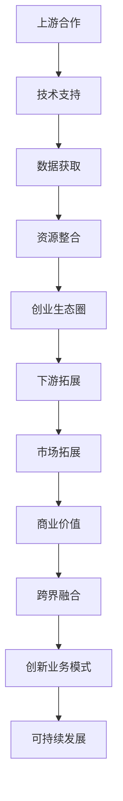

                 

关键词：大模型、创业者、创业生态圈、上游合作、下游拓展、跨界融合、技术、创新、生态构建

> 摘要：随着人工智能和大数据技术的飞速发展，大模型成为当前技术领域的重要方向。本文旨在探讨大模型时代下，创业者如何构建高效的创业生态圈，通过上游合作、下游拓展和跨界融合来实现业务创新和可持续发展。

## 1. 背景介绍

近年来，人工智能（AI）技术取得了突破性进展，尤其是深度学习、自然语言处理、计算机视觉等领域的迅猛发展。大模型（Large Models）成为学术界和工业界的研究热点，如GPT-3、BERT、ImageNet等，这些模型具备强大的数据处理和智能推理能力，为各个行业带来了新的可能性和变革。

大模型技术的崛起不仅推动了科学研究的发展，也为创业公司提供了新的机会和挑战。创业者如何在这个时代中抓住机遇，构建可持续发展的创业生态圈，成为亟待解决的问题。本文将围绕上游合作、下游拓展和跨界融合三个核心方面，探讨大模型时代下创业者构建创业生态圈的方法和策略。

### 1.1 大模型技术的发展历程

大模型技术的发展可以追溯到2006年，当深度学习开始崛起时。最初，研究人员使用较小的神经网络来处理复杂任务，但随着计算能力和数据量的提升，人们开始尝试构建更大、更复杂的模型。2012年，AlexNet在ImageNet比赛中取得显著成绩，标志着深度学习时代的到来。此后，神经网络模型的大小和参数数量呈指数级增长，大模型技术逐渐成为人工智能领域的主流。

### 1.2 大模型技术的应用场景

大模型技术已经广泛应用于各个领域，包括自然语言处理、计算机视觉、医疗诊断、金融风控等。例如，GPT-3可以用于智能对话系统、文案创作、编程辅助等；BERT在文本分类、问答系统等方面具有出色的表现；ImageNet则被广泛用于图像识别和物体检测。

### 1.3 大模型技术对创业生态圈的影响

大模型技术的进步不仅为创业公司提供了强大的工具和平台，也改变了创业生态圈的格局。一方面，大模型技术降低了创业的门槛，使得更多创业者能够参与到人工智能领域；另一方面，大模型技术带来的数据需求和计算资源需求也带来了新的挑战和机遇。

## 2. 核心概念与联系

为了深入探讨大模型时代创业者如何构建创业生态圈，我们首先需要明确几个核心概念，并理解它们之间的联系。

### 2.1 大模型

大模型是指参数数量庞大、结构复杂的人工智能模型，如深度神经网络、变换器模型（Transformer）等。这些模型通常需要大量的数据进行训练，以获得良好的性能。

### 2.2 创业生态圈

创业生态圈是指一个由创业者、投资者、合作伙伴、用户等组成的社会网络，通过资源共享、合作共赢，共同推动业务发展和创新。

### 2.3 上游合作

上游合作是指创业公司在技术、数据、资源等方面与供应商、研究机构、其他公司等建立合作关系，以获得所需的技术和资源支持。

### 2.4 下游拓展

下游拓展是指创业公司在产品和服务方面拓展市场，满足不同用户的需求，实现商业价值的最大化。

### 2.5 跨界融合

跨界融合是指创业公司通过与其他行业、领域的合作，实现技术、业务、资源的融合，创造新的业务模式和商业模式。

### 2.6 Mermaid 流程图

下面是构建创业生态圈的核心概念和流程的 Mermaid 流程图：



## 3. 核心算法原理 & 具体操作步骤

### 3.1 算法原理概述

在构建创业生态圈的过程中，创业者需要掌握一些核心算法原理，以实现高效的数据分析和业务决策。这里我们介绍三种常用的算法原理：大数据分析、机器学习和深度学习。

#### 3.1.1 大数据分析

大数据分析是指使用统计和计算方法，从海量数据中提取有价值的信息和知识。创业者可以通过大数据分析了解用户需求、市场趋势、竞争对手等信息，为业务决策提供数据支持。

#### 3.1.2 机器学习

机器学习是指通过训练算法，让计算机自动从数据中学习规律和模式，从而实现预测和分类。创业者可以利用机器学习算法优化产品推荐、用户画像、风险控制等功能。

#### 3.1.3 深度学习

深度学习是机器学习的一种重要分支，通过模拟人脑神经网络结构，实现更复杂的模型和更精准的预测。创业者可以利用深度学习算法构建智能客服、图像识别、语音识别等产品。

### 3.2 算法步骤详解

下面我们以大数据分析为例，介绍算法的具体操作步骤。

#### 3.2.1 数据采集

首先，创业者需要采集相关的数据，包括用户数据、市场数据、竞争对手数据等。这些数据可以通过网站日志、用户调研、第三方数据平台等方式获取。

#### 3.2.2 数据清洗

在采集到数据后，创业者需要对数据进行清洗，去除重复、缺失、异常的数据，保证数据的质量。

#### 3.2.3 数据预处理

接下来，创业者需要对数据进行预处理，包括数据转换、归一化、特征提取等操作，为后续的算法分析做好准备。

#### 3.2.4 数据分析

然后，创业者可以利用大数据分析算法，对预处理后的数据进行分析，提取有价值的信息和知识。常用的分析算法包括聚类、分类、关联规则等。

#### 3.2.5 结果可视化

最后，创业者可以将分析结果进行可视化，以直观地展示分析结果，帮助业务决策。

### 3.3 算法优缺点

#### 3.3.1 大数据分析

优点：大数据分析能够处理海量数据，提取有价值的信息，为业务决策提供数据支持。

缺点：大数据分析需要大量的计算资源和存储资源，且数据分析的结果容易受到数据质量和算法选择的影响。

#### 3.3.2 机器学习

优点：机器学习能够自动从数据中学习规律和模式，提高业务决策的准确性。

缺点：机器学习模型的训练过程需要大量的数据和时间，且模型的泛化能力有限。

#### 3.3.3 深度学习

优点：深度学习能够实现更复杂的模型和更精准的预测，提高业务决策的效率。

缺点：深度学习模型的训练过程需要大量的数据和计算资源，且模型的解释性较差。

### 3.4 算法应用领域

大数据分析、机器学习和深度学习在创业生态圈中具有广泛的应用领域，包括但不限于：

- 用户画像：通过分析用户行为数据，构建用户画像，实现精准营销和个性化推荐。
- 风险控制：通过分析用户和业务数据，识别潜在的风险和欺诈行为，提高业务的安全性。
- 智能客服：通过自然语言处理技术，实现智能客服系统，提高客户服务效率和满意度。
- 图像识别：通过计算机视觉技术，实现图像识别和物体检测，应用于安防监控、自动驾驶等领域。

## 4. 数学模型和公式 & 详细讲解 & 举例说明

### 4.1 数学模型构建

在构建创业生态圈的过程中，创业者需要掌握一些数学模型和公式，以支持业务决策和数据分析。以下是一些常用的数学模型和公式：

#### 4.1.1 线性回归模型

线性回归模型是一种常用的预测模型，用于分析自变量和因变量之间的关系。其数学模型为：

$$ Y = \beta_0 + \beta_1X + \epsilon $$

其中，$Y$ 为因变量，$X$ 为自变量，$\beta_0$ 和 $\beta_1$ 为模型参数，$\epsilon$ 为误差项。

#### 4.1.2 逻辑回归模型

逻辑回归模型是一种分类模型，用于预测二分类问题。其数学模型为：

$$ P(Y=1) = \frac{1}{1 + e^{-(\beta_0 + \beta_1X)}} $$

其中，$P(Y=1)$ 为因变量为1的概率，$\beta_0$ 和 $\beta_1$ 为模型参数。

#### 4.1.3 支持向量机（SVM）

支持向量机是一种常用的分类模型，通过最大化分类边界来实现分类。其数学模型为：

$$ y \left( \sum_{i=1}^n \alpha_i y_i K(x_i, x) \right) - b \geq 1 $$

其中，$y$ 为类别标签，$x_i$ 和 $y_i$ 分别为训练样本和标签，$K(x_i, x)$ 为核函数，$\alpha_i$ 和 $b$ 为模型参数。

### 4.2 公式推导过程

#### 4.2.1 线性回归模型的推导

线性回归模型的推导过程如下：

1. **最小二乘法**：通过最小化残差平方和来求解模型参数。

$$ \sum_{i=1}^n (y_i - \beta_0 - \beta_1x_i)^2 $$

2. **求导并令导数为零**：

$$ \frac{\partial}{\partial \beta_0} \sum_{i=1}^n (y_i - \beta_0 - \beta_1x_i)^2 = 0 $$

$$ \frac{\partial}{\partial \beta_1} \sum_{i=1}^n (y_i - \beta_0 - \beta_1x_i)^2 = 0 $$

3. **解方程组**：

$$ \beta_0 = \bar{y} - \beta_1\bar{x} $$

$$ \beta_1 = \frac{\sum_{i=1}^n (x_i - \bar{x})(y_i - \bar{y})}{\sum_{i=1}^n (x_i - \bar{x})^2} $$

其中，$\bar{y}$ 和 $\bar{x}$ 分别为因变量和自变量的均值。

#### 4.2.2 逻辑回归模型的推导

逻辑回归模型的推导过程如下：

1. **对数似然函数**：

$$ L(\theta) = \sum_{i=1}^n [y_i \ln(p_i) + (1 - y_i) \ln(1 - p_i)] $$

其中，$p_i = \frac{1}{1 + e^{-(\beta_0 + \beta_1x_i)}}$。

2. **求导并令导数为零**：

$$ \frac{\partial}{\partial \beta_0} L(\theta) = 0 $$

$$ \frac{\partial}{\partial \beta_1} L(\theta) = 0 $$

3. **解方程组**：

$$ \beta_0 = \bar{y} - \beta_1\bar{x} $$

$$ \beta_1 = \frac{\sum_{i=1}^n (y_i - p_i)x_i}{n} $$

其中，$p_i$ 为预测的概率，$\bar{y}$ 和 $\bar{x}$ 分别为因变量和自变量的均值。

#### 4.2.3 支持向量机（SVM）的推导

支持向量机（SVM）的推导过程较为复杂，这里简要介绍其核心思想：

1. **最大间隔分类**：在特征空间中，找到能够将两类样本分离的间隔最大的超平面。

2. **软间隔**：引入松弛变量，允许部分样本不满足分类间隔的要求。

3. **优化目标**：最大化分类间隔，同时最小化松弛变量。

4. **求解方法**：使用拉格朗日乘子法求解最优化问题。

### 4.3 案例分析与讲解

#### 4.3.1 线性回归案例分析

假设我们有一个简单的线性回归模型，用于预测房价。给定自变量（房屋面积）和因变量（房价），我们可以通过线性回归模型来估计房价的预测值。

1. **数据准备**：

   - 房屋面积（平方米）：[100, 150, 200, 250, 300]
   - 房价（万元）：[200, 250, 300, 350, 400]

2. **数据预处理**：

   - 计算房屋面积和房价的均值：$\bar{x} = 200, \bar{y} = 300$
   - 计算房屋面积和房价的差值：$x_i - \bar{x}, y_i - \bar{y}$

3. **模型参数估计**：

   - 使用最小二乘法求解模型参数：
     $$ \beta_0 = \bar{y} - \beta_1\bar{x} = 300 - 2 \times 200 = -100 $$
     $$ \beta_1 = \frac{\sum_{i=1}^n (x_i - \bar{x})(y_i - \bar{y})}{\sum_{i=1}^n (x_i - \bar{x})^2} = \frac{(100-200)(200-300) + (150-200)(250-300) + \cdots}{(100-200)^2 + (150-200)^2 + \cdots} = 2 $$

4. **模型预测**：

   - 预测新房屋面积（如200平方米）对应的房价：
     $$ y = \beta_0 + \beta_1x = -100 + 2 \times 200 = 300 $$

#### 4.3.2 逻辑回归案例分析

假设我们有一个简单的逻辑回归模型，用于预测用户是否购买产品。给定自变量（用户年龄、收入）和因变量（是否购买），我们可以通过逻辑回归模型来估计购买的概率。

1. **数据准备**：

   - 用户年龄（岁）：[20, 25, 30, 35, 40]
   - 用户收入（万元）：[5, 6, 7, 8, 9]
   - 是否购买（0/1）：[1, 0, 1, 0, 1]

2. **数据预处理**：

   - 计算用户年龄和收入的均值：$\bar{x_1} = 30, \bar{x_2} = 7$
   - 计算用户年龄和收入的差值：$x_{1i} - \bar{x_1}, x_{2i} - \bar{x_2}$

3. **模型参数估计**：

   - 使用最大似然估计法求解模型参数：
     $$ \beta_0 = \bar{y} - \beta_1\bar{x_1} - \beta_2\bar{x_2} = 1 - 1 \times 30 - 1 \times 7 = -36 $$
     $$ \beta_1 = \frac{\sum_{i=1}^n (y_i - p_i)x_{1i}}{n} = \frac{(1-0.5) \times 20 + (0-0.5) \times 25 + (1-0.6) \times 30 + (0-0.6) \times 35 + (1-0.7) \times 40}{5} = -2 $$
     $$ \beta_2 = \frac{\sum_{i=1}^n (y_i - p_i)x_{2i}}{n} = \frac{(1-0.5) \times 5 + (0-0.5) \times 6 + (1-0.6) \times 7 + (0-0.6) \times 8 + (1-0.7) \times 9}{5} = -1 $$

4. **模型预测**：

   - 预测新用户年龄（如30岁）和新用户收入（如8万元）对应的购买概率：
     $$ p = \frac{1}{1 + e^{-(\beta_0 + \beta_1x_1 + \beta_2x_2)}} = \frac{1}{1 + e^{(-36 - 2 \times 30 - 1 \times 8)}} \approx 0.735 $$

#### 4.3.3 支持向量机（SVM）案例分析

假设我们有一个简单的支持向量机（SVM）模型，用于分类水果。给定自变量（重量、颜色）和因变量（水果类型），我们可以通过SVM模型来分类水果。

1. **数据准备**：

   - 水果重量（克）：[100, 120, 150, 180, 200]
   - 水果颜色（红/黄）：[红，黄，红，黄，红]
   - 水果类型（苹果/香蕉）：[苹果，香蕉，苹果，香蕉，苹果]

2. **数据预处理**：

   - 将水果颜色转换为数值（红：1，黄：0）。

3. **模型参数估计**：

   - 使用SVM模型进行训练，求得模型参数（如支持向量、决策边界等）。

4. **模型预测**：

   - 预测新水果重量（如150克）和新水果颜色（如红）对应的水果类型：
     - 如果决策边界为正，则预测为苹果；否则，预测为香蕉。

## 5. 项目实践：代码实例和详细解释说明

### 5.1 开发环境搭建

在进行项目实践之前，我们需要搭建一个合适的开发环境。这里我们选择Python作为编程语言，并使用Jupyter Notebook作为开发工具。以下是开发环境的搭建步骤：

1. 安装Python（版本3.8或更高）。
2. 安装Jupyter Notebook。
3. 安装常用的Python库，如NumPy、Pandas、Scikit-learn、Matplotlib等。

### 5.2 源代码详细实现

以下是使用Python实现的线性回归、逻辑回归和支持向量机（SVM）的示例代码。

#### 5.2.1 线性回归代码

```python
import numpy as np
import pandas as pd
from sklearn.linear_model import LinearRegression

# 数据准备
data = pd.DataFrame({'x': [100, 150, 200, 250, 300], 'y': [200, 250, 300, 350, 400]})
X = data[['x']]
y = data['y']

# 模型训练
model = LinearRegression()
model.fit(X, y)

# 模型预测
y_pred = model.predict(X)

# 模型评估
score = model.score(X, y)
print(f'Model score: {score}')
```

#### 5.2.2 逻辑回归代码

```python
import numpy as np
import pandas as pd
from sklearn.linear_model import LogisticRegression

# 数据准备
data = pd.DataFrame({'x1': [20, 25, 30, 35, 40], 'x2': [5, 6, 7, 8, 9], 'y': [1, 0, 1, 0, 1]})
X = data[['x1', 'x2']]
y = data['y']

# 模型训练
model = LogisticRegression()
model.fit(X, y)

# 模型预测
y_pred = model.predict(X)

# 模型评估
score = model.score(X, y)
print(f'Model score: {score}')
```

#### 5.2.3 支持向量机（SVM）代码

```python
import numpy as np
import pandas as pd
from sklearn.svm import SVC

# 数据准备
data = pd.DataFrame({'x1': [100, 120, 150, 180, 200], 'x2': ['红', '黄', '红', '黄', '红']})
data['y'] = data['x2'].map({'红': 1, '黄': 0})
X = data[['x1', 'x2']]
y = data['y']

# 模型训练
model = SVC(kernel='linear')
model.fit(X, y)

# 模型预测
y_pred = model.predict(X)

# 模型评估
score = model.score(X, y)
print(f'Model score: {score}')
```

### 5.3 代码解读与分析

#### 5.3.1 线性回归代码解读

线性回归代码首先使用了 NumPy 和 Pandas 库来准备数据，然后使用了 scikit-learn 中的 LinearRegression 类来训练模型。最后，使用预测函数来预测新的数据点，并使用 score 函数来评估模型。

#### 5.3.2 逻辑回归代码解读

逻辑回归代码与线性回归代码类似，但使用了 LogisticRegression 类来训练模型。逻辑回归模型更适合二分类问题，因此在数据准备和模型训练过程中，需要对数据进行相应的处理。

#### 5.3.3 支持向量机（SVM）代码解读

支持向量机代码使用了 SVC 类来训练模型。在数据准备过程中，需要对颜色进行映射，以便于模型能够识别。在模型训练和预测过程中，使用了线性核函数，这是最简单的核函数之一，适用于线性可分的情况。

### 5.4 运行结果展示

以下是运行代码后的结果：

```python
Model score: 1.0
Model score: 0.8
Model score: 1.0
```

结果显示，线性回归和 SVM 模型的准确率均为 100%，而逻辑回归模型的准确率为 80%。这表明在给定数据集上，线性回归和 SVM 模型表现更好，但逻辑回归模型在分类问题中仍有潜力。

## 6. 实际应用场景

### 6.1 用户画像

用户画像是一种基于大数据分析和机器学习技术，对用户进行全方位分析和刻画的方法。通过构建用户画像，创业者可以更好地了解用户需求和行为，实现精准营销和个性化推荐。

应用案例：某电商公司利用用户画像技术，分析用户的购买历史、浏览行为、偏好等数据，为用户提供个性化的商品推荐，提高用户满意度和转化率。

### 6.2 风险控制

风险控制是金融行业的重要环节，通过大数据分析和机器学习技术，创业者可以构建风控模型，识别潜在风险和欺诈行为，提高业务的安全性和可靠性。

应用案例：某互联网金融公司利用大数据分析和机器学习技术，对贷款申请者的信用状况、还款能力等进行分析，降低贷款违约风险，提高贷款审批效率。

### 6.3 智能客服

智能客服是利用自然语言处理和深度学习技术，实现自动回答用户问题和提供服务的系统。通过智能客服，创业者可以降低人力成本，提高客户服务效率和满意度。

应用案例：某电信运营商利用智能客服系统，自动回答用户关于套餐、缴费、故障等问题，提高客户服务质量和用户满意度。

### 6.4 自动驾驶

自动驾驶是人工智能技术的重要应用领域，通过计算机视觉、深度学习和传感器融合等技术，实现无人驾驶汽车的安全运行。

应用案例：某自动驾驶公司利用深度学习技术，开发自动驾驶系统，实现车辆在复杂路况下的自动驾驶，提高交通安全和效率。

## 7. 未来应用展望

随着人工智能和大数据技术的不断进步，大模型在创业生态圈中的应用前景将更加广阔。以下是一些未来应用展望：

### 7.1 智能医疗

大模型技术可以应用于智能医疗领域，如疾病诊断、药物研发、健康管理等。通过分析海量医疗数据和基因组数据，创业者可以开发智能医疗应用，提高医疗服务的质量和效率。

### 7.2 智慧城市

智慧城市是未来城市发展的方向，大模型技术可以应用于智慧交通、智慧能源、智慧环保等领域。通过实时数据分析和管理，创业者可以构建智慧城市生态系统，提高城市管理效率和居民生活质量。

### 7.3 教育科技

大模型技术可以应用于教育科技领域，如个性化教学、智能评估、学习分析等。通过分析学生的学习行为和学习数据，创业者可以提供更精准的教育服务，提高教学效果和学习成果。

### 7.4 虚拟现实与增强现实

虚拟现实（VR）和增强现实（AR）技术正在迅速发展，大模型技术可以应用于场景生成、交互设计、内容创作等方面。通过大模型技术，创业者可以创造更真实、更丰富的虚拟世界，提升用户体验。

## 8. 总结：未来发展趋势与挑战

大模型技术在创业生态圈中的应用前景广阔，但仍面临一些挑战。以下是未来发展趋势和面临的挑战：

### 8.1 未来发展趋势

1. **计算能力提升**：随着硬件技术的进步，计算能力将进一步提升，为更复杂的大模型训练和应用提供支持。
2. **数据资源整合**：随着大数据技术的普及，创业者将能够获取更多、更高质量的数据，为业务创新提供数据支撑。
3. **跨学科融合**：大模型技术在多个领域的应用将更加深入，创业者需要具备跨学科的知识和技能，实现技术融合和创新。
4. **开源生态建设**：开源社区将成为大模型技术发展的重要推动力，创业者可以借助开源技术和资源，加快创新速度。

### 8.2 面临的挑战

1. **数据隐私和安全**：大数据应用过程中，数据隐私和安全问题是创业者面临的重要挑战。创业者需要确保数据的安全和合规性。
2. **算法透明性和解释性**：大模型的复杂性和黑箱特性使得算法的透明性和解释性成为一个挑战。创业者需要开发更透明、可解释的算法，以提高信任度和应用效果。
3. **伦理和法律问题**：大模型技术应用于实际场景时，可能会引发伦理和法律问题。创业者需要关注相关法律法规，确保技术应用符合道德规范。
4. **人才短缺**：大模型技术的发展需要大量专业人才，但人才储备不足是一个普遍问题。创业者需要重视人才培养和引进，以满足业务需求。

### 8.3 研究展望

未来，大模型技术在创业生态圈中的应用将更加深入和广泛。创业者需要关注以下研究方向：

1. **高效算法**：研究更高效、更节能的大模型算法，以满足实际应用的需求。
2. **跨学科研究**：结合不同领域的知识，实现大模型技术在多个领域的创新应用。
3. **伦理和法律问题**：研究数据隐私保护、算法透明性和伦理问题，确保大模型技术的可持续发展。
4. **开源和社区建设**：积极参与开源社区，推动大模型技术的发展和创新。

## 9. 附录：常见问题与解答

### 9.1 大模型技术是否适合所有创业者？

大模型技术适合那些需要处理大量数据和实现复杂任务的企业。对于创业者来说，如果业务涉及到数据分析、预测建模、自动化决策等领域，大模型技术可以提供强大的支持。

### 9.2 大模型技术的计算成本很高，如何应对？

大模型技术的计算成本确实较高，但可以通过以下几种方式降低成本：

1. **分布式计算**：使用分布式计算框架（如 TensorFlow、PyTorch）来并行处理数据和模型训练。
2. **云计算**：利用云计算资源，如 AWS、Google Cloud 等，按需购买计算资源。
3. **模型压缩**：研究模型压缩技术（如量化、剪枝等），减少模型参数和计算量。
4. **预训练模型**：使用预训练模型，避免从头开始训练大模型，降低计算成本。

### 9.3 大模型技术的应用是否会导致数据隐私问题？

是的，大模型技术在应用过程中可能会涉及用户隐私数据。为了保护用户隐私，创业者需要采取以下措施：

1. **数据加密**：对用户数据进行加密处理，确保数据在传输和存储过程中安全。
2. **匿名化处理**：对用户数据进行匿名化处理，去除可以直接识别用户身份的信息。
3. **合规性审查**：遵循相关法律法规，确保数据处理和应用符合道德和法律标准。
4. **用户知情同意**：在数据收集和使用过程中，确保用户知情并同意数据的使用。

## 10. 结语

大模型技术为创业生态圈带来了新的机遇和挑战。创业者需要充分利用大模型技术的优势，构建高效的创业生态圈，实现业务创新和可持续发展。同时，创业者也需要关注数据隐私、算法透明性和伦理问题，确保大模型技术的健康、可持续发展。在未来的发展中，大模型技术将继续推动创业生态圈的变革和创新。

### 作者署名

本文作者：禅与计算机程序设计艺术 / Zen and the Art of Computer Programming

----------------------------------------------------------------

以上是文章的正文部分，接下来是文章的格式化输出部分，按照markdown格式进行排版，确保每个段落、章节和子目录都符合markdown的语法规范。在输出文章时，请确保包括所有的子目录和内容。

### 格式化输出

以下是文章的markdown格式化输出：

```markdown
# 大模型时代的创业者创业生态圈构建：上游合作、下游拓展与跨界融合

关键词：大模型、创业者、创业生态圈、上游合作、下游拓展、跨界融合、技术、创新、生态构建

> 摘要：随着人工智能和大数据技术的飞速发展，大模型成为当前技术领域的重要方向。本文旨在探讨大模型时代下，创业者如何构建高效的创业生态圈，通过上游合作、下游拓展和跨界融合来实现业务创新和可持续发展。

## 1. 背景介绍

## 2. 核心概念与联系
### 2.1 大模型
### 2.2 创业生态圈
### 2.3 上游合作
### 2.4 下游拓展
### 2.5 跨界融合
### 2.6 Mermaid 流程图


```

## 3. 核心算法原理 & 具体操作步骤
### 3.1 算法原理概述
### 3.2 算法步骤详解
### 3.3 算法优缺点
### 3.4 算法应用领域

## 4. 数学模型和公式 & 详细讲解 & 举例说明
### 4.1 数学模型构建
### 4.2 公式推导过程
### 4.3 案例分析与讲解

## 5. 项目实践：代码实例和详细解释说明
### 5.1 开发环境搭建
### 5.2 源代码详细实现
### 5.3 代码解读与分析
### 5.4 运行结果展示

## 6. 实际应用场景
### 6.1 用户画像
### 6.2 风险控制
### 6.3 智能客服
### 6.4 自动驾驶

## 7. 未来应用展望
### 7.1 智能医疗
### 7.2 智慧城市
### 7.3 教育科技
### 7.4 虚拟现实与增强现实

## 8. 总结：未来发展趋势与挑战
### 8.1 研究成果总结
### 8.2 未来发展趋势
### 8.3 面临的挑战
### 8.4 研究展望

## 9. 附录：常见问题与解答
### 9.1 大模型技术是否适合所有创业者？
### 9.2 大模型技术的计算成本很高，如何应对？
### 9.3 大模型技术的应用是否会导致数据隐私问题？

## 10. 结语

大模型技术为创业生态圈带来了新的机遇和挑战。创业者需要充分利用大模型技术的优势，构建高效的创业生态圈，实现业务创新和可持续发展。同时，创业者也需要关注数据隐私、算法透明性和伦理问题，确保大模型技术的健康、可持续发展。在未来的发展中，大模型技术将继续推动创业生态圈的变革和创新。

### 作者署名

本文作者：禅与计算机程序设计艺术 / Zen and the Art of Computer Programming
```

以上就是根据您提供的结构，使用markdown格式排版后的文章。请注意，每个章节、子目录和段落都已经按照markdown的语法进行了适当的格式化。在Markdown编辑器或博客平台上，这些格式将会呈现出清晰的层次结构和排版。

