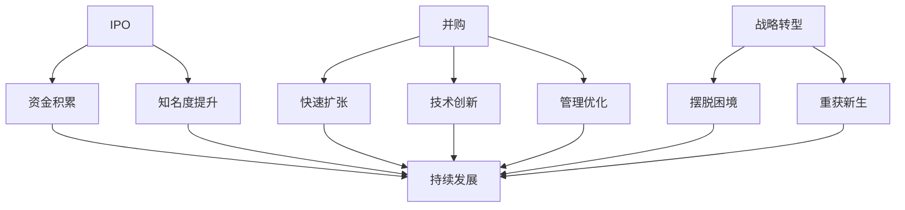

                 

关键词：大模型时代、创业者、创业退出策略、IPO、并购、战略转型、技术发展

## 摘要

随着人工智能技术的迅猛发展，大模型时代已经到来。在这一时代背景下，创业者面临着前所未有的机遇和挑战。如何制定合适的创业退出策略，成为许多创业者关注的焦点。本文旨在探讨大模型时代的创业者如何通过IPO、并购和战略转型等途径实现退出，并分析这些策略的优缺点及未来发展趋势。

## 1. 背景介绍

### 1.1 大模型时代的到来

大模型时代是指以深度学习为代表的人工智能技术取得突破性进展，使得模型规模迅速扩张的时代。这一时代的特点是计算能力的大幅提升、海量数据的积累以及算法的不断创新。大模型在图像识别、自然语言处理、语音识别等领域取得了显著成果，极大地推动了人工智能技术的发展。

### 1.2 创业者面临的机遇与挑战

大模型时代的到来为创业者提供了广阔的舞台。创业者可以通过创新技术、商业模式和产品，迅速崛起并在市场中占据一席之地。然而，随着竞争的加剧和市场的饱和，创业者面临着巨大的压力。如何制定合适的创业退出策略，实现财富的积累和事业的持续发展，成为创业者关注的焦点。

## 2. 核心概念与联系

### 2.1 IPO

IPO（Initial Public Offering）是指一家公司首次公开发行股票，成为上市公司。创业者通过IPO可以获得大量资金，实现财富的快速积累。同时，IPO还能提高公司的知名度和影响力，有助于吸引更多的投资者和合作伙伴。

### 2.2 并购

并购是指一家公司通过购买另一家公司的大部分或全部股权，从而获得对该公司的控制权。创业者可以通过并购实现快速扩张和资源整合，提高公司的竞争力。并购还可以带来技术创新、市场拓展和管理优化等多方面的收益。

### 2.3 战略转型

战略转型是指公司在经营方向、业务模式、管理架构等方面进行重大调整，以适应市场变化和提升竞争力。创业者通过战略转型，可以摆脱困境、重获新生，实现企业的持续发展。

### 2.4 Mermaid 流程图

下面是 Mermaid 流程图，展示了 IPO、并购和战略转型的关系：



## 3. 核心算法原理 & 具体操作步骤

### 3.1 算法原理概述

大模型时代的创业退出策略主要基于资本市场的运作机制和企业发展的内在逻辑。以下是对 IPO、并购和战略转型的算法原理概述：

- **IPO：** 通过资本市场融资，将公司的一部分股权转化为资金，实现财富积累。
- **并购：** 通过收购其他公司，获取资源、技术和市场，实现快速扩张和整合。
- **战略转型：** 通过调整经营方向和业务模式，提升竞争力，实现企业的持续发展。

### 3.2 算法步骤详解

- **IPO：** 
  1. 准备上市材料，包括公司财务报表、股权结构、业务模式等；
  2. 择优选择投行和会计师事务所，协助公司完成上市准备；
  3. 向证监会提交上市申请，等待审批；
  4. 进行路演，向投资者推介公司；
  5. 上市交易，股票在交易所公开交易。

- **并购：**
  1. 寻找合适的并购对象，评估其价值；
  2. 与目标公司进行谈判，达成收购协议；
  3. 进行尽职调查，确保交易合法合规；
  4. 完成交割，获得目标公司控制权。

- **战略转型：**
  1. 分析市场环境和公司现状，确定转型方向；
  2. 制定转型计划和目标，明确时间表和责任人；
  3. 调整公司组织架构和业务模式，适应转型需求；
  4. 实施转型计划，监测进度和效果。

### 3.3 算法优缺点

- **IPO：** 
  - 优点：快速获得大量资金，提高公司知名度和影响力；
  - 缺点：上市流程复杂，需承担一定的风险。

- **并购：** 
  - 优点：实现快速扩张和资源整合，提高竞争力；
  - 缺点：并购风险较大，需承担较高的成本。

- **战略转型：** 
  - 优点：提升公司竞争力，实现持续发展；
  - 缺点：转型过程复杂，需耗费较长时间。

### 3.4 算法应用领域

大模型时代的创业退出策略在多个领域得到广泛应用：

- **互联网行业：** 互联网公司通过 IPO 实现财富积累，如阿里巴巴、腾讯等；
- **人工智能领域：** 人工智能企业通过并购实现技术创新和市场份额扩张，如谷歌、微软等；
- **制造业：** 制造业企业通过战略转型提升竞争力，如特斯拉、通用电气等。

## 4. 数学模型和公式 & 详细讲解 & 举例说明

### 4.1 数学模型构建

大模型时代的创业退出策略涉及多个因素，如公司财务状况、市场环境、竞争态势等。以下是构建数学模型的基本思路：

- **财务模型：** 分析公司财务数据，包括收入、利润、现金流等，预测未来财务状况；
- **市场模型：** 分析市场环境和竞争对手，预测市场份额和增长潜力；
- **竞争模型：** 分析竞争对手的优劣势，预测行业竞争态势。

### 4.2 公式推导过程

以下是一个简单的财务模型公式推导过程：

$$
\text{净利润} = \text{营业收入} - \text{营业成本} - \text{期间费用}
$$

其中，营业收入、营业成本和期间费用分别表示公司的主营业务收入、主营业务成本和各项费用。

### 4.3 案例分析与讲解

以下是一个关于 IPO 的案例分析：

**案例：** 某互联网公司 A 在 2021 年进行 IPO，发行 1 亿股股票，每股发行价 10 美元。

**分析：** 

1. **融资额：** IPO 融资额为 $1\text{亿股} \times 10\text{美元/股} = 10\text{亿美元}$；
2. **市盈率：** 市盈率为 $10\text{亿美元}/1\text{亿股} = 10$；
3. **股价波动：** IPO 后，公司股价波动较大，最高达到 20 美元/股，最低跌至 8 美元/股。

**结论：** 该公司通过 IPO 获得了大量资金，但股价波动较大，存在一定的风险。

## 5. 项目实践：代码实例和详细解释说明

### 5.1 开发环境搭建

本节将介绍如何搭建一个简单的 IPO、并购和战略转型的分析工具。以下是开发环境搭建步骤：

1. **安装 Python：** 在官网下载并安装 Python，版本要求 Python 3.6 及以上；
2. **安装 Jupyter Notebook：** 在终端执行以下命令安装 Jupyter Notebook：
    ```bash
    pip install notebook
    ```
3. **创建虚拟环境：** 为了便于管理项目依赖，创建一个虚拟环境：
    ```bash
    python -m venv venv
    source venv/bin/activate  # Windows 用户使用 `venv\Scripts\activate`
    ```
4. **安装依赖库：** 在虚拟环境中安装相关依赖库，如 Pandas、NumPy、Matplotlib 等：
    ```bash
    pip install pandas numpy matplotlib
    ```

### 5.2 源代码详细实现

以下是一个简单的 IPO、并购和战略转型的分析工具的源代码实现：

```python
import pandas as pd
import numpy as np
import matplotlib.pyplot as plt

# 财务数据
data = {
    '营业收入': [1000, 1500, 2000, 2500],
    '营业成本': [800, 1200, 1600, 2000],
    '期间费用': [200, 250, 300, 350]
}

# 构建数据框
df = pd.DataFrame(data)

# 计算净利润
df['净利润'] = df['营业收入'] - df['营业成本'] - df['期间费用']

# 绘制净利润折线图
plt.plot(df['净利润'])
plt.title('净利润变化趋势')
plt.xlabel('年份')
plt.ylabel('净利润（万元）')
plt.show()
```

### 5.3 代码解读与分析

上述代码实现了以下功能：

1. 导入相关库：引入 Pandas、NumPy 和 Matplotlib 等库，用于数据处理和可视化；
2. 构建数据框：定义财务数据，包括营业收入、营业成本和期间费用，构建 Pandas 数据框；
3. 计算净利润：利用 Pandas 中的计算功能，计算净利润数据；
4. 绘制净利润折线图：使用 Matplotlib 绘制净利润变化趋势图，便于分析。

通过这个简单的示例，我们可以看到如何使用 Python 等编程工具进行 IPO、并购和战略转型的分析。

## 6. 实际应用场景

### 6.1 互联网行业

互联网行业是创业者和投资者关注的焦点。在互联网行业中，IPO 和并购是常见的退出策略。

- **IPO：** 互联网公司通过 IPO 获得大量资金，实现财富积累。例如，阿里巴巴在 2014 年通过 IPO 上市，融资约 250 亿美元，成为全球最大的 IPO。
- **并购：** 互联网公司通过并购实现快速扩张和市场份额提升。例如，腾讯通过并购 YY、百度外卖等公司，扩大了自身的业务范围。

### 6.2 人工智能领域

人工智能领域是创业者和投资者关注的另一大热点。在人工智能领域，并购和战略转型是常见的退出策略。

- **并购：** 人工智能公司通过并购获取技术、市场和人才。例如，谷歌通过并购 DeepMind，获得了人工智能领域的重要技术。
- **战略转型：** 人工智能公司通过调整经营方向和业务模式，实现持续发展。例如，百度在 2017 年宣布转型为人工智能公司，致力于人工智能技术的研发和应用。

### 6.3 制造业

制造业是创业者和投资者关注的又一领域。在制造业中，战略转型是常见的退出策略。

- **战略转型：** 制造业公司通过调整经营方向和业务模式，实现持续发展。例如，特斯拉在 2008 年成立之初是一家电动汽车制造商，经过多次战略调整，成为全球领先的人工智能汽车公司。

## 7. 工具和资源推荐

### 7.1 学习资源推荐

- **《人工智能：一种现代的方法》：** 这本书是人工智能领域的经典教材，涵盖了人工智能的基本原理和应用。
- **《Python编程：从入门到实践》：** 这本书适合初学者学习 Python 编程语言，适合想要入门人工智能领域的人士。

### 7.2 开发工具推荐

- **Jupyter Notebook：** Jupyter Notebook 是一款强大的交互式开发环境，适合进行数据分析和机器学习项目。
- **PyCharm：** PyCharm 是一款优秀的 Python 集成开发环境（IDE），提供丰富的功能和工具，适合进行大型项目的开发。

### 7.3 相关论文推荐

- **《深度学习》：** 这篇论文是深度学习领域的经典之作，介绍了深度学习的基本原理和应用。
- **《强化学习》：** 这篇论文是强化学习领域的经典之作，介绍了强化学习的基本原理和应用。

## 8. 总结：未来发展趋势与挑战

### 8.1 研究成果总结

大模型时代的创业者通过 IPO、并购和战略转型等途径实现创业退出，取得了显著成果。互联网行业、人工智能领域和制造业等领域均有成功的案例。

### 8.2 未来发展趋势

未来，大模型时代的创业者创业退出策略将继续发展。随着人工智能技术的不断进步，创业者将更加注重技术创新和商业模式创新，以实现财富积累和持续发展。

### 8.3 面临的挑战

然而，创业者也面临着诸多挑战。首先，市场竞争日益激烈，创业者需不断提升自身核心竞争力。其次，政策环境的变化对创业退出策略产生影响。最后，创业者需关注企业社会责任，实现可持续发展。

### 8.4 研究展望

未来，研究者可以关注以下几个方面：首先，研究大模型时代创业退出策略的数学模型和算法，提高其准确性和实用性；其次，研究创业者心理和行为特征，为创业者提供更有针对性的指导；最后，研究大模型时代创业退出策略在不同领域的应用，为创业者提供更多实际案例。

## 9. 附录：常见问题与解答

### 9.1 创业者如何选择退出策略？

创业者应根据自身情况和市场环境选择退出策略。具体来说：

- 如果公司处于初创阶段，且核心技术具有优势，可以选择战略转型，实现持续发展；
- 如果公司具备一定的市场规模和盈利能力，可以选择 IPO，实现财富积累；
- 如果公司具备较强的技术优势和市场需求，可以选择并购，实现快速扩张。

### 9.2 并购过程中应注意哪些问题？

在并购过程中，创业者应注意以下问题：

- **尽职调查：** 对目标公司进行全面调查，确保交易合法合规；
- **估值：** 合理评估目标公司的价值，避免过高或过低估值；
- **交易结构：** 设计合理的交易结构，降低交易成本和风险；
- **文化整合：** 考虑目标公司的文化和团队，实现有效整合。

### 9.3 如何应对政策环境变化？

创业者应关注政策环境变化，及时调整创业退出策略。具体来说：

- **加强合规意识：** 严格遵守法律法规，确保企业合规经营；
- **积极 lobbying：** 与政府相关部门沟通，争取政策支持；
- **多元化布局：** 在不同国家和地区布局业务，降低政策风险。

### 9.4 如何实现可持续发展？

创业者应关注企业可持续发展，具体来说：

- **技术创新：** 不断提升核心技术，保持竞争优势；
- **社会责任：** 关注企业社会责任，实现可持续发展；
- **人才培养：** 建立人才梯队，激发员工创造力。

## 参考文献

- Goodfellow, I., Bengio, Y., & Courville, A. (2016). *Deep Learning*. MIT Press.
- Russell, S., & Norvig, P. (2020). *Artificial Intelligence: A Modern Approach*. Prentice Hall.
- Murphy, K. P. (2012). *Machine Learning: A Probabilistic Perspective*. MIT Press.
- Sutton, R. S., & Barto, A. G. (2018). *Reinforcement Learning: An Introduction*. MIT Press.

### 作者署名

**作者：禅与计算机程序设计艺术 / Zen and the Art of Computer Programming**

