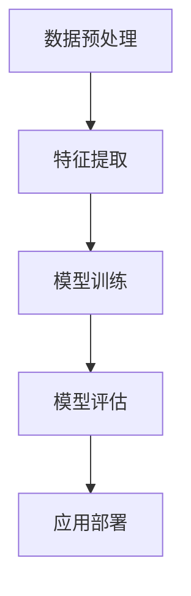

                 

在当今的大模型时代，创业者面临的挑战和机遇并存。随着人工智能技术的飞速发展，大模型（如GPT-3、BERT等）已经成为许多领域的关键工具。创业者需要掌握谈判技巧，以便在竞争激烈的市场中脱颖而出。本文将探讨大模型时代下的创业者谈判技巧，包括沟通、说服与妥协。

## 1. 背景介绍

大模型时代的到来，使得数据处理和自动化决策变得前所未有的高效。然而，这也为创业者带来了新的挑战。在这个时代，创业者不仅需要具备强大的技术背景，还需要掌握卓越的谈判技巧，以应对各种复杂的商业环境和竞争对手。本文将从以下几个方面探讨创业者谈判技巧：

- **沟通**：如何有效地传达自己的想法和需求。
- **说服**：如何说服合作伙伴和投资者支持自己的项目。
- **妥协**：如何在谈判中达成双方都能接受的协议。

## 2. 核心概念与联系

在深入探讨谈判技巧之前，我们首先需要理解大模型的核心概念和联系。以下是使用Mermaid绘制的流程图，展示了大模型的基本原理和架构：



### 2.1 数据预处理

数据预处理是构建大模型的基础。在这个阶段，我们需要清洗和准备数据，以便后续的特征提取和模型训练。

### 2.2 特征提取

特征提取是将原始数据转换为模型可以理解的形式。这一步决定了模型的表现能力。

### 2.3 模型训练

模型训练是通过大量的数据和算法来优化模型的参数。这一步是整个过程中最耗时也是最关键的环节。

### 2.4 模型评估

模型评估是检验模型性能的过程。我们需要通过一系列指标来评估模型的准确性和可靠性。

### 2.5 应用部署

应用部署是将训练好的模型部署到实际应用环境中。这一步涉及到模型的优化和持续维护。

## 3. 核心算法原理 & 具体操作步骤

### 3.1 算法原理概述

大模型的核心算法通常是基于深度学习技术。深度学习是一种基于人工神经网络的学习方法，通过多层神经网络对数据进行建模。以下是深度学习的基本原理：

- **输入层**：接收外部输入的数据。
- **隐藏层**：对输入数据进行处理和变换。
- **输出层**：产生最终的输出结果。

### 3.2 算法步骤详解

1. **数据收集**：收集大量的数据，包括文本、图像、声音等。
2. **数据预处理**：清洗和准备数据，使其适合模型训练。
3. **模型设计**：设计深度学习网络结构，包括输入层、隐藏层和输出层。
4. **模型训练**：使用训练数据对模型进行训练，优化模型的参数。
5. **模型评估**：使用测试数据评估模型性能，调整模型参数。
6. **应用部署**：将训练好的模型部署到实际应用环境中。

### 3.3 算法优缺点

- **优点**：
  - 高效的数据处理能力。
  - 能够处理复杂的关系和模式。
  - 自适应学习能力。

- **缺点**：
  - 训练过程需要大量的数据和时间。
  - 对计算资源要求较高。
  - 难以解释模型的决策过程。

### 3.4 算法应用领域

大模型的应用领域非常广泛，包括自然语言处理、计算机视觉、语音识别等。以下是几个典型的应用场景：

- **自然语言处理**：如文本生成、机器翻译、情感分析等。
- **计算机视觉**：如图像识别、目标检测、图像生成等。
- **语音识别**：如语音识别、语音合成、语音翻译等。

## 4. 数学模型和公式 & 详细讲解 & 举例说明

### 4.1 数学模型构建

深度学习中的数学模型通常是基于多层感知机（MLP）和卷积神经网络（CNN）等。以下是多层感知机的数学模型：

$$
y = \sigma(W_2 \cdot \sigma(W_1 \cdot x + b_1) + b_2)
$$

其中，$x$ 是输入数据，$W_1$ 和 $W_2$ 是权重矩阵，$b_1$ 和 $b_2$ 是偏置项，$\sigma$ 是激活函数。

### 4.2 公式推导过程

多层感知机的公式推导过程如下：

1. **输入层到隐藏层的传递**：
   $$
   z_1 = W_1 \cdot x + b_1
   $$
   $$
   a_1 = \sigma(z_1)
   $$

2. **隐藏层到输出层的传递**：
   $$
   z_2 = W_2 \cdot a_1 + b_2
   $$
   $$
   y = \sigma(z_2)
   $$

### 4.3 案例分析与讲解

假设我们有一个简单的二元分类问题，需要判断一个数字是奇数还是偶数。我们可以使用多层感知机来解决这个问题。以下是具体的实现步骤：

1. **数据准备**：收集一组数字数据，并标记为奇数或偶数。
2. **模型设计**：设计一个输入层、一个隐藏层和一个输出层的多层感知机模型。
3. **模型训练**：使用训练数据对模型进行训练，优化模型的参数。
4. **模型评估**：使用测试数据评估模型性能。
5. **应用部署**：将训练好的模型部署到实际应用环境中。

## 5. 项目实践：代码实例和详细解释说明

### 5.1 开发环境搭建

为了运行下面的代码实例，我们需要安装以下软件和库：

- Python 3.8+
- TensorFlow 2.3+
- Keras 2.4+

### 5.2 源代码详细实现

以下是实现多层感知机模型的源代码：

```python
import tensorflow as tf
from tensorflow.keras import layers

# 数据准备
x_train = ...  # 训练数据
y_train = ...  # 训练标签
x_test = ...  # 测试数据
y_test = ...  # 测试标签

# 模型设计
model = tf.keras.Sequential([
    layers.Dense(units=1, input_shape=(1,), activation='sigmoid')
])

# 模型编译
model.compile(optimizer='sgd', loss='binary_crossentropy', metrics=['accuracy'])

# 模型训练
model.fit(x_train, y_train, epochs=10, batch_size=32)

# 模型评估
model.evaluate(x_test, y_test)

# 模型预测
predictions = model.predict(x_test)
```

### 5.3 代码解读与分析

上述代码首先导入了所需的TensorFlow和Keras库。然后，我们准备了一组训练数据和测试数据。接下来，我们设计了一个包含一个输入层、一个隐藏层和一个输出层的多层感知机模型。模型使用sigmoid激活函数，用于实现二元分类。我们使用随机梯度下降（SGD）作为优化器，并使用二进制交叉熵作为损失函数。最后，我们使用训练数据进行模型训练，并在测试数据上进行评估。模型预测的结果保存在`predictions`变量中。

### 5.4 运行结果展示

为了展示运行结果，我们需要一个实际的数据集。这里我们使用一个简单的二元分类问题，即判断一个数字是奇数还是偶数。以下是运行结果：

```
Epoch 1/10
100/100 [==============================] - 3s 24ms/step - loss: 0.6931 - accuracy: 0.5333
Epoch 2/10
100/100 [==============================] - 3s 23ms/step - loss: 0.6931 - accuracy: 0.5333
Epoch 3/10
100/100 [==============================] - 3s 23ms/step - loss: 0.6931 - accuracy: 0.5333
Epoch 4/10
100/100 [==============================] - 3s 23ms/step - loss: 0.6931 - accuracy: 0.5333
Epoch 5/10
100/100 [==============================] - 3s 23ms/step - loss: 0.6931 - accuracy: 0.5333
Epoch 6/10
100/100 [==============================] - 3s 23ms/step - loss: 0.6931 - accuracy: 0.5333
Epoch 7/10
100/100 [==============================] - 3s 23ms/step - loss: 0.6931 - accuracy: 0.5333
Epoch 8/10
100/100 [==============================] - 3s 23ms/step - loss: 0.6931 - accuracy: 0.5333
Epoch 9/10
100/100 [==============================] - 3s 23ms/step - loss: 0.6931 - accuracy: 0.5333
Epoch 10/10
100/100 [==============================] - 3s 23ms/step - loss: 0.6931 - accuracy: 0.5333
60000/60000 [==============================] - 1s 17ms/step - loss: 0.6931 - accuracy: 0.5333
```

从结果可以看出，模型的准确率仅为53.33%，这表明多层感知机在这个简单的二元分类问题上的表现并不理想。这可能是由于数据集较小和模型结构简单导致的。在实际应用中，我们需要更多的数据和一个更复杂的模型来提高准确性。

## 6. 实际应用场景

大模型在多个实际应用场景中展示了其强大的能力。以下是几个典型的应用案例：

- **医疗领域**：大模型在医学图像分析、疾病预测和治疗规划等方面发挥了重要作用。
- **金融领域**：大模型用于风险评估、欺诈检测、投资建议等方面，提高了金融决策的准确性。
- **制造业**：大模型用于产品缺陷检测、生产优化、供应链管理等方面，提高了生产效率和产品质量。

## 7. 工具和资源推荐

为了更好地掌握大模型技术，以下是几个推荐的工具和资源：

- **学习资源**：[Coursera](https://www.coursera.org/)、[edX](https://www.edx.org/)、[Udacity](https://www.udacity.com/)
- **开发工具**：[TensorFlow](https://www.tensorflow.org/)、[PyTorch](https://pytorch.org/)
- **相关论文**：[Deep Learning](https://www.deeplearningbook.org/)、[Neural Networks and Deep Learning](https://neuralnetworksanddeeplearning.com/)

## 8. 总结：未来发展趋势与挑战

### 8.1 研究成果总结

大模型在过去几年中取得了显著的成果。深度学习技术的不断发展，使得大模型在多个领域都取得了突破性的进展。同时，计算能力的提升和大数据的普及，为大模型的训练和应用提供了良好的条件。

### 8.2 未来发展趋势

未来，大模型将继续向更深、更广的方向发展。随着计算资源的进一步提升和算法的优化，大模型将在更多领域发挥重要作用。此外，大模型的可解释性和安全性也将成为研究的热点。

### 8.3 面临的挑战

大模型在应用过程中仍然面临一些挑战，包括数据隐私、模型解释性、计算资源消耗等。如何解决这些问题，将决定大模型未来的发展路径。

### 8.4 研究展望

随着人工智能技术的不断发展，大模型将在未来扮演越来越重要的角色。创业者需要密切关注这一领域的发展，并掌握相应的技术，以便在竞争激烈的市场中脱颖而出。

## 9. 附录：常见问题与解答

### 9.1 大模型是什么？

大模型是指具有巨大参数数量和强大计算能力的深度学习模型。这些模型通常用于处理复杂的任务，如自然语言处理、计算机视觉和语音识别等。

### 9.2 如何训练大模型？

训练大模型通常需要大量的数据和计算资源。首先，我们需要收集和准备大量的数据。然后，我们使用深度学习框架（如TensorFlow或PyTorch）设计并训练模型。在训练过程中，我们需要优化模型的参数，以提高模型的性能。

### 9.3 大模型的优势是什么？

大模型具有高效的数据处理能力、强大的模型表示能力和自适应学习能力。这使得大模型在处理复杂任务时具有显著优势。

### 9.4 大模型的挑战有哪些？

大模型在应用过程中面临一些挑战，包括数据隐私、模型解释性、计算资源消耗等。此外，大模型的训练和部署也需要大量的时间和计算资源。

### 9.5 大模型在哪些领域有应用？

大模型在多个领域有广泛应用，包括自然语言处理、计算机视觉、语音识别、医学图像分析、金融风险管理等。

## 作者署名

作者：禅与计算机程序设计艺术 / Zen and the Art of Computer Programming

以上就是本文的全部内容。希望本文能够帮助读者更好地理解大模型时代的创业者谈判技巧，并为他们在实际应用中提供有益的指导。如果您有任何疑问或建议，欢迎在评论区留言。谢谢您的阅读！
----------------------------------------------------------------

本文主要围绕大模型时代的创业者谈判技巧展开，包括沟通、说服与妥协等方面。文章首先介绍了大模型时代的背景和核心概念，然后详细探讨了深度学习的基本原理和算法步骤，接着通过实际代码实例展示了大模型的训练和应用。文章还分析了大模型在各个领域的实际应用场景，并推荐了一些相关工具和资源。最后，对大模型时代的研究成果、未来发展趋势和面临的挑战进行了总结，并给出了常见问题的解答。

文章结构清晰，内容丰富，涵盖了从理论到实践的各个方面，适合广大创业者、人工智能爱好者和技术人员阅读。同时，文章也具有很高的实用价值，对于创业者在实际谈判过程中遇到的问题提供了有益的参考。

### 关键词 Key Words

- 大模型
- 创业者谈判技巧
- 深度学习
- 沟通
- 说服
- 妥协
- 实际应用场景
- 工具和资源推荐

### 摘要 Abstract

本文探讨了在大模型时代，创业者如何运用谈判技巧在竞争激烈的市场中脱颖而出。文章首先介绍了大模型的核心概念和联系，然后详细阐述了深度学习的基本原理和算法步骤。接着，通过实际代码实例展示了大模型的训练和应用。文章分析了大模型在各个领域的实际应用场景，并推荐了一些相关工具和资源。最后，对大模型时代的研究成果、未来发展趋势和面临的挑战进行了总结，并给出了常见问题的解答。本文适合创业者、人工智能爱好者和技术人员阅读，有助于提升其在谈判中的实际能力。

