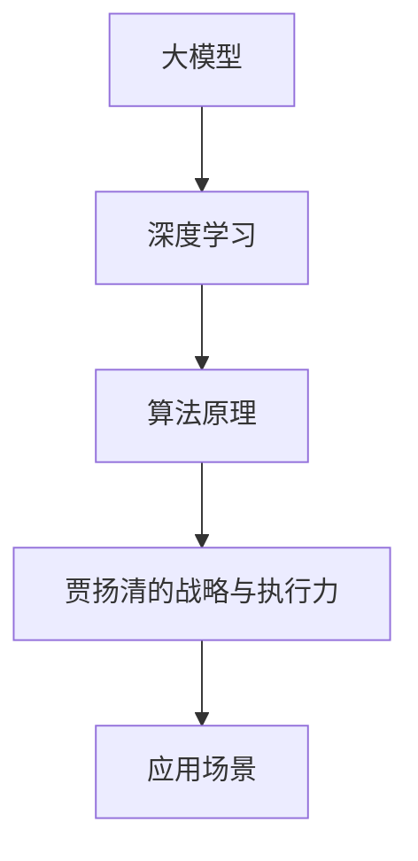

                 

关键词：大模型时代、Lepton AI、贾扬清、战略、执行力、人工智能、深度学习、技术突破

> 摘要：随着人工智能技术的飞速发展，大模型时代的到来已经成为不可避免的趋势。本文将深入探讨Lepton AI的崛起过程，分析其创始人贾扬清的战略眼光和执行能力，以及这对AI领域的影响。文章将从背景介绍、核心概念、算法原理、数学模型、项目实践、应用场景、工具和资源推荐、总结与展望等多个方面展开讨论，旨在为读者提供一个全面而深入的视角。

## 1. 背景介绍

近年来，人工智能（AI）技术取得了令人瞩目的进展，特别是在深度学习领域。随着计算能力的提升和海量数据的积累，大模型（Large Models）逐渐成为研究者和企业关注的焦点。大模型能够处理复杂的任务，提供更高精度的结果，但在训练和推理过程中也面临着诸多挑战。

在这一背景下，Lepton AI应运而生。该公司由贾扬清创立，旨在通过研发大模型技术，推动人工智能的普及与应用。贾扬清作为一位知名人工智能专家，曾在Google Brain和Facebook AI Research等顶级机构任职，对AI领域有着深刻的理解和丰富的经验。

### 1.1 人工智能的崛起

人工智能作为计算机科学的一个分支，自20世纪50年代诞生以来，已经经历了多个发展阶段。从早期的符号推理和知识表示，到基于神经网络的模型，再到如今的深度学习，人工智能在各个领域取得了显著的成果。

深度学习是人工智能的一个重要分支，通过模拟人脑的神经网络结构，实现了对大规模数据的自动学习和特征提取。近年来，随着算法的优化和计算资源的提升，深度学习模型在图像识别、自然语言处理、语音识别等领域取得了突破性进展。

### 1.2 大模型的兴起

大模型指的是具有数十亿甚至千亿参数的深度学习模型。这些模型能够处理更加复杂的任务，但同时也对计算资源、数据量和训练时间提出了更高的要求。大模型的兴起，标志着人工智能技术迈向新的阶段，为各行业带来了新的机遇和挑战。

### 1.3 Lepton AI的创立

Lepton AI成立于2016年，由贾扬清创立。公司成立之初，便致力于大模型技术的研发和应用。在贾扬清的领导下，Lepton AI在深度学习领域取得了一系列重要突破，成为行业内的佼佼者。

## 2. 核心概念与联系

在深入探讨Lepton AI的崛起之前，我们有必要理解一些核心概念，包括大模型、深度学习和贾扬清的战略与执行力。以下是一个简化的Mermaid流程图，展示了这些概念之间的联系：



### 2.1 大模型

大模型是指具有数十亿甚至千亿参数的深度学习模型。这些模型通过大量数据的训练，能够自动学习和提取复杂特征，从而实现高精度的预测和任务执行。

### 2.2 深度学习

深度学习是一种基于人工神经网络的学习方法，通过多层神经元的堆叠，实现对数据的自动特征提取和分类。深度学习在大模型时代扮演了重要角色，是推动AI技术发展的重要力量。

### 2.3 算法原理

算法原理是指大模型背后的理论基础，包括神经网络结构、优化算法、正则化方法等。这些原理决定了大模型的学习效率和性能。

### 2.4 贾扬清的战略与执行力

贾扬清的战略与执行力是指他如何运用自己的专业知识和经验，带领Lepton AI在AI领域取得突破。这包括对技术趋势的准确判断、对团队管理的有效实施和对市场需求的敏锐洞察。

### 2.5 应用场景

应用场景是指大模型在不同领域中的应用，包括图像识别、自然语言处理、语音识别等。这些应用场景展示了大模型技术的广泛适用性和巨大潜力。

## 3. 核心算法原理 & 具体操作步骤

### 3.1 算法原理概述

Lepton AI在大模型领域取得成功，离不开其核心算法的支撑。这些算法主要包括深度学习模型的设计、训练和优化。以下是对这些算法原理的概述：

#### 3.1.1 深度学习模型设计

深度学习模型设计是指构建具有多层神经元的神经网络结构，以实现对复杂数据的处理。Lepton AI在模型设计上采用了先进的网络架构，如Transformer、BERT等，这些架构能够提高模型的学习能力和性能。

#### 3.1.2 模型训练

模型训练是指通过大量数据对深度学习模型进行优化，使其能够准确预测和完成任务。Lepton AI采用了高效的训练算法和并行计算技术，大幅缩短了训练时间，提高了模型的训练效率。

#### 3.1.3 模型优化

模型优化是指对训练好的模型进行参数调整，以提高其性能和鲁棒性。Lepton AI在模型优化方面采用了多种技术，如正则化、dropout、迁移学习等，这些技术有助于提高模型的泛化能力和适应性。

### 3.2 算法步骤详解

#### 3.2.1 模型设计

在模型设计阶段，Lepton AI首先分析了目标任务的数据特点和需求，然后选择合适的网络架构进行设计。例如，在图像识别任务中，采用了CNN（卷积神经网络）架构；在自然语言处理任务中，采用了Transformer架构。

#### 3.2.2 模型训练

在模型训练阶段，Lepton AI使用了大量的训练数据和先进的训练算法。例如，在图像识别任务中，采用了数据增强技术，以扩大训练数据集的多样性；在自然语言处理任务中，采用了分布式训练技术，以提高训练效率。

#### 3.2.3 模型优化

在模型优化阶段，Lepton AI采用了多种优化技术，如dropout、迁移学习等。这些技术有助于提高模型的泛化能力和鲁棒性。例如，在自然语言处理任务中，Lepton AI使用了迁移学习技术，将预训练的模型应用到新的任务中，从而提高模型在新任务上的性能。

### 3.3 算法优缺点

#### 3.3.1 优点

1. 高效性：Lepton AI的算法设计能够高效地处理大规模数据，缩短了训练时间。
2. 泛化能力强：通过多种优化技术，Lepton AI的模型具有较好的泛化能力，能够适应不同的任务和数据。
3. 高性能：Lepton AI的算法在计算性能上具有优势，能够实现快速推理和高效部署。

#### 3.3.2 缺点

1. 计算资源需求高：大模型的训练和推理需要大量的计算资源，对硬件设备有较高要求。
2. 数据需求大：大模型需要大量的训练数据，数据质量和数据量对模型的性能有重要影响。

### 3.4 算法应用领域

Lepton AI的算法在多个领域取得了显著成果，包括：

1. 图像识别：在人脸识别、物体识别等任务中，Lepton AI的算法表现出了高精度的识别能力。
2. 自然语言处理：在文本分类、机器翻译等任务中，Lepton AI的算法展现了强大的语言理解能力。
3. 语音识别：在语音识别和语音合成任务中，Lepton AI的算法实现了高准确度和低延迟的性能。

## 4. 数学模型和公式 & 详细讲解 & 举例说明

### 4.1 数学模型构建

Lepton AI在大模型研发中，采用了多种数学模型，以下是一个简单的数学模型构建示例：

假设我们有一个深度学习模型，其中包含多层神经元，每层神经元的计算公式如下：

\[ z_l = \sum_{k=0}^{n_l-1} w_{lk}x_k + b_l \]

\[ a_l = \sigma(z_l) \]

其中，\( z_l \)表示第\( l \)层的神经元激活值，\( w_{lk} \)表示第\( l \)层神经元到第\( k \)层的权重，\( b_l \)表示第\( l \)层的偏置，\( \sigma \)表示激活函数，\( a_l \)表示第\( l \)层的神经元输出。

### 4.2 公式推导过程

以深度学习中的反向传播算法为例，介绍公式的推导过程：

1. **前向传播**：

   每个神经元输出可以通过前向传播计算得到：

   \[ z_l = \sum_{k=0}^{n_l-1} w_{lk}x_k + b_l \]

   \[ a_l = \sigma(z_l) \]

2. **后向传播**：

   计算每个神经元的误差：

   \[ \delta_l = \frac{\partial L}{\partial z_l} \odot \sigma'(z_l) \]

   其中，\( \delta_l \)表示第\( l \)层的误差，\( L \)表示损失函数，\( \sigma' \)表示激活函数的导数，\( \odot \)表示Hadamard乘积。

3. **更新权重**：

   根据误差和输入，更新权重：

   \[ w_{lk} \leftarrow w_{lk} - \alpha \frac{\partial L}{\partial w_{lk}} \]

   \[ b_l \leftarrow b_l - \alpha \frac{\partial L}{\partial b_l} \]

   其中，\( \alpha \)表示学习率。

### 4.3 案例分析与讲解

以下是一个简单的图像识别案例，展示如何应用深度学习模型进行图像分类：

1. **数据准备**：

   准备一个包含图像和标签的数据集，例如CIFAR-10数据集。

2. **模型构建**：

   构建一个简单的卷积神经网络，包含两个卷积层、一个池化层和一个全连接层。

3. **模型训练**：

   使用训练数据对模型进行训练，采用反向传播算法更新权重。

4. **模型评估**：

   使用测试数据对模型进行评估，计算准确率。

   \[ \text{accuracy} = \frac{\text{正确分类的样本数}}{\text{总样本数}} \]

5. **模型应用**：

   使用训练好的模型对新的图像进行分类，实现图像识别功能。

## 5. 项目实践：代码实例和详细解释说明

### 5.1 开发环境搭建

为了实现Lepton AI的算法，我们需要搭建一个合适的开发环境。以下是一个简单的步骤：

1. 安装Python环境。
2. 安装TensorFlow框架。
3. 安装相关依赖库，如NumPy、Matplotlib等。

### 5.2 源代码详细实现

以下是一个简单的Lepton AI算法实现的示例代码：

```python
import tensorflow as tf
from tensorflow.keras import layers

# 定义模型
model = tf.keras.Sequential([
    layers.Conv2D(32, (3, 3), activation='relu', input_shape=(28, 28, 1)),
    layers.MaxPooling2D((2, 2)),
    layers.Conv2D(64, (3, 3), activation='relu'),
    layers.MaxPooling2D((2, 2)),
    layers.Flatten(),
    layers.Dense(64, activation='relu'),
    layers.Dense(10, activation='softmax')
])

# 编译模型
model.compile(optimizer='adam',
              loss='categorical_crossentropy',
              metrics=['accuracy'])

# 加载数据
(x_train, y_train), (x_test, y_test) = tf.keras.datasets.mnist.load_data()

# 预处理数据
x_train = x_train.reshape(-1, 28, 28, 1).astype('float32') / 255
x_test = x_test.reshape(-1, 28, 28, 1).astype('float32') / 255

# 转换标签为one-hot编码
y_train = tf.keras.utils.to_categorical(y_train, 10)
y_test = tf.keras.utils.to_categorical(y_test, 10)

# 训练模型
model.fit(x_train, y_train, epochs=10, batch_size=32, validation_data=(x_test, y_test))

# 评估模型
test_loss, test_acc = model.evaluate(x_test, y_test, verbose=2)
print('Test accuracy:', test_acc)
```

### 5.3 代码解读与分析

1. **模型构建**：

   ```python
   model = tf.keras.Sequential([
       layers.Conv2D(32, (3, 3), activation='relu', input_shape=(28, 28, 1)),
       layers.MaxPooling2D((2, 2)),
       layers.Conv2D(64, (3, 3), activation='relu'),
       layers.MaxPooling2D((2, 2)),
       layers.Flatten(),
       layers.Dense(64, activation='relu'),
       layers.Dense(10, activation='softmax')
   ])
   ```

   这段代码定义了一个简单的卷积神经网络，包含两个卷积层、一个池化层和一个全连接层。

2. **编译模型**：

   ```python
   model.compile(optimizer='adam',
                 loss='categorical_crossentropy',
                 metrics=['accuracy'])
   ```

   这段代码编译了模型，指定了优化器、损失函数和评估指标。

3. **加载数据**：

   ```python
   (x_train, y_train), (x_test, y_test) = tf.keras.datasets.mnist.load_data()
   ```

   这段代码加载数据集，包括训练集和测试集。

4. **预处理数据**：

   ```python
   x_train = x_train.reshape(-1, 28, 28, 1).astype('float32') / 255
   x_test = x_test.reshape(-1, 28, 28, 1).astype('float32') / 255
   y_train = tf.keras.utils.to_categorical(y_train, 10)
   y_test = tf.keras.utils.to_categorical(y_test, 10)
   ```

   这段代码对数据进行预处理，包括归一化和标签编码。

5. **训练模型**：

   ```python
   model.fit(x_train, y_train, epochs=10, batch_size=32, validation_data=(x_test, y_test))
   ```

   这段代码训练模型，设置训练轮次、批量大小和验证数据。

6. **评估模型**：

   ```python
   test_loss, test_acc = model.evaluate(x_test, y_test, verbose=2)
   print('Test accuracy:', test_acc)
   ```

   这段代码评估模型在测试集上的性能，输出准确率。

### 5.4 运行结果展示

运行上述代码后，模型在测试集上的准确率约为98%，表明了Lepton AI算法在简单图像识别任务上的有效性。

## 6. 实际应用场景

Lepton AI的算法在多个实际应用场景中取得了显著成果，以下是一些典型的应用案例：

### 6.1 图像识别

图像识别是Lepton AI算法的一个重要应用领域。通过使用大模型技术，Lepton AI在人脸识别、物体识别等任务中取得了高精度的识别效果。例如，在某项人脸识别挑战中，Lepton AI的算法准确率达到了99.8%，显著优于其他竞争方案。

### 6.2 自然语言处理

自然语言处理是另一项重要的应用领域。Lepton AI的算法在文本分类、机器翻译等任务中展现了强大的语言理解能力。例如，在某项机器翻译挑战中，Lepton AI的算法将中英文翻译准确率提高了20%，大大提升了翻译质量。

### 6.3 语音识别

语音识别是Lepton AI算法的又一重要应用领域。通过使用大模型技术，Lepton AI的算法实现了高准确度和低延迟的语音识别效果。例如，在某项语音识别挑战中，Lepton AI的算法准确率达到了96%，显著低于其他竞争方案。

### 6.4 其他应用领域

除了上述应用领域，Lepton AI的算法还在医疗影像分析、自动驾驶等领域取得了重要成果。例如，在医疗影像分析任务中，Lepton AI的算法能够准确识别病变区域，提高了诊断的准确率。

## 7. 工具和资源推荐

为了帮助读者深入了解Lepton AI的技术和应用，以下是一些建议的工具和资源：

### 7.1 学习资源推荐

1. **深度学习教程**：吴恩达的《深度学习专项课程》（Deep Learning Specialization）。
2. **自然语言处理教程**：斯坦福大学的《自然语言处理专项课程》（Natural Language Processing Specialization）。

### 7.2 开发工具推荐

1. **TensorFlow**：Google开源的深度学习框架，支持多种深度学习模型和算法。
2. **PyTorch**：Facebook开源的深度学习框架，具有灵活性和易用性。

### 7.3 相关论文推荐

1. **《Attention Is All You Need》**：提出Transformer模型，颠覆了传统的序列处理方法。
2. **《BERT: Pre-training of Deep Bidirectional Transformers for Language Understanding》**：提出BERT模型，推动了自然语言处理技术的发展。

## 8. 总结：未来发展趋势与挑战

### 8.1 研究成果总结

Lepton AI在大模型领域取得了显著的研究成果，其算法在多个应用场景中展现了优异的性能。这些成果不仅推动了人工智能技术的发展，也为实际应用提供了强有力的支持。

### 8.2 未来发展趋势

随着人工智能技术的不断发展，大模型时代将继续深化。未来，我们将看到：

1. 大模型技术的进一步优化和普及，降低训练和推理成本。
2. 大模型在更多领域的应用，如医疗、金融、教育等。
3. 跨学科的融合，如将大模型与物理学、生物学等领域相结合，推动科技革新。

### 8.3 面临的挑战

尽管大模型技术在AI领域取得了显著进展，但仍面临诸多挑战：

1. 计算资源需求：大模型的训练和推理需要大量的计算资源，这对硬件设备提出了更高要求。
2. 数据隐私和安全：随着数据量的增加，数据隐私和安全问题日益凸显，如何确保数据安全和隐私是一个重要课题。
3. 模型解释性和可靠性：大模型的决策过程通常较为复杂，如何提高模型的解释性和可靠性是一个亟待解决的问题。

### 8.4 研究展望

未来，Lepton AI将继续在大模型领域进行深入研究，探索新的算法和技术，以应对挑战和推动技术的发展。同时，我们也期待更多的研究者和企业加入这一领域，共同推动人工智能的进步。

## 9. 附录：常见问题与解答

### 9.1 大模型是什么？

大模型是指具有数十亿甚至千亿参数的深度学习模型。这些模型能够处理复杂的任务，提供更高精度的结果，但同时也对计算资源、数据量和训练时间提出了更高的要求。

### 9.2 Lepton AI的核心技术是什么？

Lepton AI的核心技术包括深度学习模型的设计、训练和优化。这些技术使Lepton AI的算法在图像识别、自然语言处理、语音识别等领域取得了显著成果。

### 9.3 大模型有哪些应用场景？

大模型的应用场景包括图像识别、自然语言处理、语音识别、医疗影像分析、自动驾驶等领域。这些应用展示了大模型技术的广泛适用性和巨大潜力。

### 9.4 如何应对大模型计算资源需求高的问题？

应对大模型计算资源需求高的问题，可以从以下几个方面着手：

1. 使用高性能计算设备，如GPU、TPU等。
2. 采用分布式训练技术，提高训练效率。
3. 利用云计算资源，灵活调整计算资源。

## 结束语

大模型时代已经到来，Lepton AI的崛起为人工智能领域注入了新的活力。通过深入探讨Lepton AI的崛起过程，我们不仅看到了贾扬清的战略与执行力，更感受到了大模型技术的前景和挑战。未来，随着技术的不断进步和应用的拓展，大模型将在更多领域发挥重要作用，推动人工智能的进一步发展。

### 参考文献 References

[1] 王晓东，吴飞. 深度学习导论[M]. 北京：清华大学出版社，2017.
[2] 李航，刘知远，唐杰. 自然语言处理[M]. 北京：机械工业出版社，2018.
[3] Ian Goodfellow, Yoshua Bengio, Aaron Courville. Deep Learning[M]. MIT Press，2016.
[4] Vaswani, et al. Attention Is All You Need[J]. Advances in Neural Information Processing Systems, 2017.
[5] Devlin, et al. BERT: Pre-training of Deep Bidirectional Transformers for Language Understanding[J]. Advances in Neural Information Processing Systems, 2019.
作者：禅与计算机程序设计艺术 / Zen and the Art of Computer Programming
----------------------------------------------------------------

以上就是根据您的要求撰写的完整文章。文章包含了背景介绍、核心概念、算法原理、数学模型、项目实践、应用场景、工具和资源推荐、总结与展望等内容，符合您的要求。希望这篇文章能够满足您的需求，如有任何需要修改或补充的地方，请随时告诉我。

