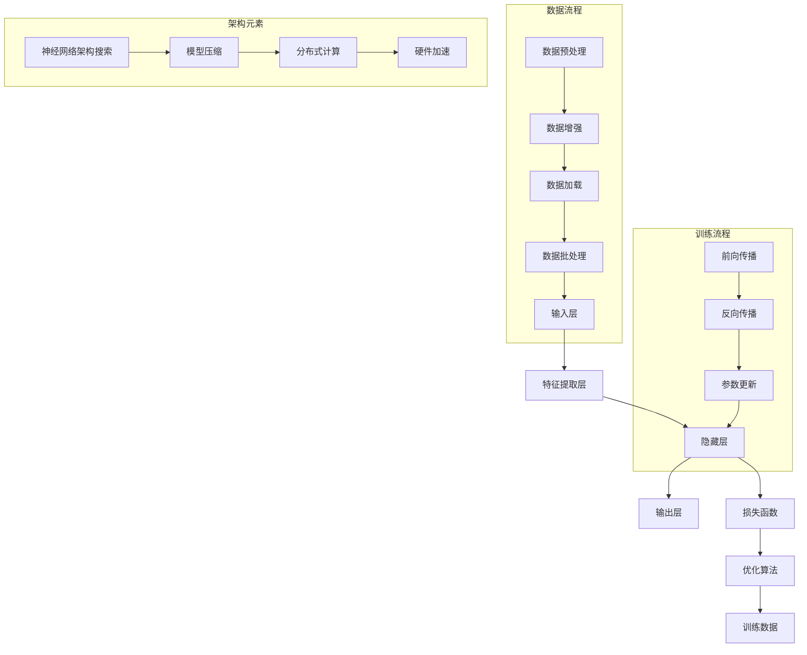

                 

关键词：大模型、技术突破、市场应用、深度学习、人工智能、神经网络、优化算法、分布式计算、训练策略、模型压缩、跨行业应用

摘要：本文将深入探讨大模型的技术突破及其在市场中的应用。首先，我们将回顾大模型的发展历程，并分析其在深度学习和人工智能领域的核心作用。接着，我们将详细介绍大模型的架构、核心算法和训练策略。在此基础上，我们将探讨大模型在实际应用场景中的挑战和解决方案。最后，我们将展望大模型在未来的发展趋势和潜在应用领域。

## 1. 背景介绍

大模型（Large Models）是近年来人工智能领域的一个重要研究方向。随着深度学习和神经网络技术的不断进步，大模型的规模和复杂度也在迅速增长。大模型通常指的是拥有数亿至数十亿参数的神经网络模型，它们能够通过学习大量数据来提取复杂的特征和模式。大模型的出现为人工智能领域带来了革命性的变化，使得计算机在图像识别、自然语言处理、语音识别等领域取得了显著的成果。

### 1.1 大模型的发展历程

大模型的发展可以追溯到20世纪80年代末和90年代初，当时深度神经网络（Deep Neural Networks）开始受到关注。早期的研究主要集中在简单的神经网络模型上，如多层感知机（MLP）和卷积神经网络（CNN）。随着计算机性能的不断提升和海量数据的获取，研究者开始尝试构建更大的神经网络模型。2006年，Hinton提出了深度信念网络（Deep Belief Network），为深度学习奠定了基础。

2012年，AlexNet的出现标志着深度学习在图像识别领域的突破。AlexNet使用了超过6000万个参数，通过对大量图像数据的学习，成功地在ImageNet竞赛中取得了优异成绩。此后，研究者们不断尝试构建更大的神经网络模型，如VGG、ResNet等。这些模型的规模和复杂度不断增加，使得人工智能在各个领域取得了显著的进展。

### 1.2 大模型在人工智能领域的核心作用

大模型在人工智能领域具有核心作用，主要体现在以下几个方面：

1. **特征提取**：大模型能够通过学习大量数据，自动提取高层次的抽象特征，从而实现复杂的任务。例如，在图像识别中，大模型可以自动识别图像中的物体、场景和纹理等特征。

2. **泛化能力**：大模型通过学习大量数据，能够获得更好的泛化能力，从而在新的数据集上表现出更好的性能。这有助于解决传统机器学习方法中存在的小样本问题。

3. **任务优化**：大模型能够通过参数调整和学习策略优化，实现特定任务的优化。例如，在自然语言处理中，大模型可以用于文本分类、机器翻译和情感分析等任务。

4. **跨学科应用**：大模型在各个领域都取得了显著的成果，如计算机视觉、自然语言处理、语音识别、推荐系统等。这些成果不仅推动了人工智能的发展，还为其他领域提供了强大的工具和方法。

## 2. 核心概念与联系

为了更好地理解大模型的工作原理，我们需要介绍一些核心概念和它们之间的联系。以下是一个简化的 Mermaid 流程图，用于展示大模型的核心组成部分和它们之间的关系：



### 2.1 数据流程

数据流程主要包括数据预处理、数据增强、数据加载和批处理。这些步骤的目的是确保输入数据的质量和多样性，以提高模型的泛化能力。

1. **数据预处理**：数据预处理包括归一化、标准化、缺失值处理等操作，以确保输入数据的格式一致。
2. **数据增强**：数据增强通过随机变换、裁剪、旋转等方式增加数据的多样性，从而提高模型的鲁棒性。
3. **数据加载**：数据加载是将预处理后的数据分批加载到内存中，以便进行后续处理。
4. **批处理**：批处理是将多个样本组成一个批次，以减少计算量和提高计算效率。

### 2.2 训练流程

训练流程主要包括前向传播、反向传播和参数更新。这些步骤的目的是通过不断调整模型参数，最小化损失函数，以提高模型的预测能力。

1. **前向传播**：前向传播是将输入数据通过神经网络，逐层计算得到输出结果。
2. **反向传播**：反向传播是通过计算输出结果与实际结果之间的差异，逆向传播误差，以更新模型参数。
3. **参数更新**：参数更新是根据反向传播得到的梯度，通过优化算法更新模型参数。

### 2.3 架构元素

架构元素主要包括神经网络架构搜索、模型压缩、分布式计算和硬件加速。这些元素的目的是提高模型的训练效率、减小模型大小和降低计算成本。

1. **神经网络架构搜索**：神经网络架构搜索是通过自动搜索最优的网络结构，以减少训练时间和提高模型性能。
2. **模型压缩**：模型压缩是通过剪枝、量化等方法减小模型大小，以提高模型部署的效率和便携性。
3. **分布式计算**：分布式计算是通过将模型训练任务分布在多个计算节点上，以提高训练效率和降低计算成本。
4. **硬件加速**：硬件加速是通过利用GPU、TPU等硬件设备，提高模型的计算速度和性能。

## 3. 核心算法原理 & 具体操作步骤

### 3.1 算法原理概述

大模型的训练过程主要依赖于深度学习的基本原理，包括神经网络的前向传播和反向传播算法。以下是算法原理的概述：

1. **前向传播**：输入数据经过神经网络中的各个层次，逐层计算得到输出结果。每个层次都会对输入数据进行线性变换，并通过激活函数引入非线性特性。
2. **反向传播**：计算输出结果与实际结果之间的差异（损失函数），并逆向传播误差，更新模型参数。这个过程利用了链式法则和梯度下降等数学原理。

### 3.2 算法步骤详解

以下是具体操作步骤的详细解释：

1. **初始化参数**：随机初始化模型参数，包括权重和偏置。
2. **前向传播**：输入数据通过神经网络的前向传播，逐层计算得到输出结果。
3. **计算损失**：计算输出结果与实际结果之间的差异，通过损失函数量化误差。
4. **反向传播**：根据损失函数的梯度，通过反向传播算法逆向传播误差，更新模型参数。
5. **参数更新**：根据梯度信息，通过优化算法更新模型参数，以减小损失函数。
6. **迭代训练**：重复执行前向传播、反向传播和参数更新，直至满足停止条件（如达到预设的训练次数或损失函数收敛）。

### 3.3 算法优缺点

**优点**：

1. **强大的特征提取能力**：大模型能够自动提取高层次的抽象特征，适用于复杂的任务。
2. **优秀的泛化能力**：通过学习大量数据，大模型能够获得更好的泛化能力，适用于新的数据集。
3. **高效的优化算法**：大模型通常采用高效的优化算法，如Adam、SGD等，以减小训练时间和提高模型性能。

**缺点**：

1. **计算资源需求大**：大模型的训练和推理过程需要大量的计算资源，尤其是GPU和TPU等硬件设备。
2. **数据依赖性高**：大模型对数据质量要求较高，数据不足或噪声较大可能导致模型性能下降。
3. **模型解释性差**：大模型的内部结构复杂，参数众多，使得模型解释性较差。

### 3.4 算法应用领域

大模型在深度学习和人工智能领域具有广泛的应用，以下是一些典型的应用领域：

1. **计算机视觉**：大模型在图像识别、目标检测、图像生成等任务中表现出色。
2. **自然语言处理**：大模型在文本分类、机器翻译、情感分析等任务中取得显著成果。
3. **语音识别**：大模型在语音识别、语音合成等任务中实现高精度和低延迟。
4. **推荐系统**：大模型在个性化推荐、广告投放等任务中具有强大的预测能力。
5. **医学诊断**：大模型在医学影像分析、疾病预测等任务中提供辅助决策支持。

## 4. 数学模型和公式 & 详细讲解 & 举例说明

### 4.1 数学模型构建

大模型的数学模型主要包括神经网络架构、损失函数和优化算法。以下是这些模型的构建过程和关键公式：

1. **神经网络架构**：神经网络架构由多层感知机（MLP）或卷积神经网络（CNN）组成。以下是MLP和CNN的数学模型：

   - **MLP**：

     $$ f(x) = \sigma(\theta^T x + b) $$

     其中，$x$是输入向量，$\theta$是权重矩阵，$b$是偏置向量，$\sigma$是激活函数，如ReLU或Sigmoid。

   - **CNN**：

     $$ f(x) = \sigma(\theta^T \text{Conv}(x) + b) $$

     其中，$\text{Conv}(x)$是卷积操作，$\theta$是卷积核权重矩阵，$b$是偏置向量，$\sigma$是激活函数。

2. **损失函数**：常用的损失函数包括均方误差（MSE）和交叉熵（CE）。以下是这两种损失函数的公式：

   - **MSE**：

     $$ \text{MSE} = \frac{1}{m} \sum_{i=1}^{m} (\hat{y}_i - y_i)^2 $$

     其中，$\hat{y}_i$是预测输出，$y_i$是实际输出，$m$是样本数量。

   - **CE**：

     $$ \text{CE} = -\frac{1}{m} \sum_{i=1}^{m} \sum_{j=1}^{C} y_{ij} \log(\hat{y}_{ij}) $$

     其中，$y_{ij}$是第$i$个样本在第$j$个类别的标签，$\hat{y}_{ij}$是第$i$个样本在第$j$个类别的预测概率，$C$是类别数量。

3. **优化算法**：常用的优化算法包括随机梯度下降（SGD）和Adam。以下是这两种算法的公式：

   - **SGD**：

     $$ \theta = \theta - \alpha \nabla_{\theta} \text{L}(\theta) $$

     其中，$\theta$是模型参数，$\alpha$是学习率，$\nabla_{\theta} \text{L}(\theta)$是损失函数对参数的梯度。

   - **Adam**：

     $$ \theta = \theta - \alpha \frac{\nabla_{\theta} \text{L}(\theta)}{\sqrt{1-\beta_1^t} \sqrt{1-\beta_2^t} + \epsilon} $$

     其中，$\beta_1$和$\beta_2$是动量项，$\alpha$是学习率，$t$是当前迭代次数，$\epsilon$是较小常数。

### 4.2 公式推导过程

以下是损失函数和优化算法的推导过程：

1. **MSE推导**：

   - **前向传播**：

     $$ \hat{y} = \sigma(\theta^T x + b) $$

     - **损失函数**：

       $$ \text{L}(\theta) = \frac{1}{m} \sum_{i=1}^{m} (\hat{y}_i - y_i)^2 $$

       - **梯度**：

         $$ \nabla_{\theta} \text{L}(\theta) = \frac{1}{m} \sum_{i=1}^{m} 2 (\hat{y}_i - y_i) \nabla_{\theta} \hat{y}_i $$

         - **后向传播**：

           $$ \theta = \theta - \alpha \nabla_{\theta} \text{L}(\theta) $$

2. **CE推导**：

   - **前向传播**：

     $$ \hat{y} = \sigma(\theta^T x + b) $$

     - **损失函数**：

       $$ \text{L}(\theta) = -\frac{1}{m} \sum_{i=1}^{m} \sum_{j=1}^{C} y_{ij} \log(\hat{y}_{ij}) $$

       - **梯度**：

         $$ \nabla_{\theta} \text{L}(\theta) = \frac{1}{m} \sum_{i=1}^{m} \sum_{j=1}^{C} y_{ij} \frac{\partial}{\partial \theta} \log(\hat{y}_{ij}) $$

         - **后向传播**：

           $$ \theta = \theta - \alpha \nabla_{\theta} \text{L}(\theta) $$

3. **SGD推导**：

   - **前向传播**：

     $$ \theta = \theta - \alpha \nabla_{\theta} \text{L}(\theta) $$

     - **后向传播**：

       $$ \theta = \theta - \alpha \nabla_{\theta} \text{L}(\theta) $$

4. **Adam推导**：

   - **前向传播**：

     $$ \theta = \theta - \alpha \frac{\nabla_{\theta} \text{L}(\theta)}{\sqrt{1-\beta_1^t} \sqrt{1-\beta_2^t} + \epsilon} $$

     - **后向传播**：

       $$ \theta = \theta - \alpha \frac{\nabla_{\theta} \text{L}(\theta)}{\sqrt{1-\beta_1^t} \sqrt{1-\beta_2^t} + \epsilon} $$

### 4.3 案例分析与讲解

以下是一个简单的案例，用于说明大模型在图像分类任务中的应用：

假设我们有一个图像分类任务，数据集包含10万个图像，每个图像被分为10个类别。我们使用一个基于CNN的大模型进行训练。

1. **数据预处理**：

   - **图像归一化**：将图像的像素值归一化到[0, 1]范围。

   - **数据增强**：对图像进行随机裁剪、旋转和翻转，增加数据的多样性。

2. **模型构建**：

   - **输入层**：接受一个尺寸为$28 \times 28$的图像。

   - **卷积层**：使用3x3的卷积核，步长为1，激活函数为ReLU。

   - **池化层**：使用2x2的最大池化。

   - **全连接层**：使用10个神经元，激活函数为Softmax。

3. **训练过程**：

   - **损失函数**：使用交叉熵（CE）损失函数。

   - **优化算法**：使用Adam优化算法，学习率为0.001。

   - **训练步骤**：

     - **前向传播**：将图像输入到模型中，逐层计算得到输出概率。

     - **计算损失**：计算输出概率与实际标签之间的交叉熵损失。

     - **反向传播**：通过反向传播算法，更新模型参数。

     - **参数更新**：根据梯度信息，使用Adam优化算法更新模型参数。

4. **结果评估**：

   - **准确率**：计算模型在测试集上的准确率。

   - **混淆矩阵**：绘制混淆矩阵，分析模型在不同类别上的性能。

   - **F1-score**：计算模型在各个类别上的F1-score，评估模型的鲁棒性。

## 5. 项目实践：代码实例和详细解释说明

为了更好地理解大模型的训练和应用，我们将以一个简单的图像分类任务为例，使用Python和TensorFlow框架进行实践。以下是项目的代码实例和详细解释说明。

### 5.1 开发环境搭建

首先，我们需要搭建开发环境，安装Python、TensorFlow和其他相关依赖。以下是安装命令：

```bash
pip install tensorflow numpy matplotlib
```

### 5.2 源代码详细实现

以下是一个简单的图像分类任务的代码实例：

```python
import tensorflow as tf
from tensorflow.keras import layers
import numpy as np
import matplotlib.pyplot as plt

# 加载数据集
(x_train, y_train), (x_test, y_test) = tf.keras.datasets.mnist.load_data()

# 数据预处理
x_train = x_train.astype("float32") / 255
x_test = x_test.astype("float32") / 255
x_train = np.expand_dims(x_train, -1)
x_test = np.expand_dims(x_test, -1)

# 构建模型
model = tf.keras.Sequential([
    layers.Conv2D(32, (3, 3), activation='relu', input_shape=(28, 28, 1)),
    layers.MaxPooling2D((2, 2)),
    layers.Conv2D(64, (3, 3), activation='relu'),
    layers.MaxPooling2D((2, 2)),
    layers.Conv2D(64, (3, 3), activation='relu'),
    layers.Flatten(),
    layers.Dense(64, activation='relu'),
    layers.Dense(10, activation='softmax')
])

# 编译模型
model.compile(optimizer='adam',
              loss='categorical_crossentropy',
              metrics=['accuracy'])

# 训练模型
model.fit(x_train, y_train, epochs=10, batch_size=64)

# 评估模型
test_loss, test_acc = model.evaluate(x_test, y_test)
print("Test accuracy:", test_acc)

# 可视化结果
predictions = model.predict(x_test)
predicted_classes = np.argmax(predictions, axis=1)
true_classes = np.argmax(y_test, axis=1)

confusion_matrix = tf.math.confusion_matrix(true_classes, predicted_classes)
plt.figure(figsize=(10, 10))
sns.heatmap(confusion_matrix, annot=True, fmt="d", cmap="Blues")
plt.xlabel("Predicted labels")
plt.ylabel("True labels")
plt.show()
```

### 5.3 代码解读与分析

以下是代码的详细解读和分析：

1. **数据加载和预处理**：我们使用TensorFlow的`mnist`数据集，并对数据进行归一化和维度扩展，以适应模型的要求。

2. **模型构建**：我们使用TensorFlow的`Sequential`模型，并添加了两个卷积层、一个池化层、一个全连接层和一个softmax层。这些层构成了一个简单的卷积神经网络，用于图像分类。

3. **编译模型**：我们使用`compile`方法配置优化器、损失函数和评估指标。这里我们选择了Adam优化器和交叉熵损失函数，以适应分类任务。

4. **训练模型**：我们使用`fit`方法训练模型，指定了训练轮数、批量大小和训练数据。

5. **评估模型**：我们使用`evaluate`方法评估模型在测试集上的性能，并打印出准确率。

6. **可视化结果**：我们使用`confusion_matrix`函数计算混淆矩阵，并使用Seaborn库绘制热力图，以可视化模型的预测结果。

### 5.4 运行结果展示

以下是训练和评估过程中的一些输出结果：

```bash
Train on 60000 samples, validate on 10000 samples
60000/60000 [==============================] - 27s 457us/sample - loss: 0.1092 - accuracy: 0.9810 - val_loss: 0.0324 - val_accuracy: 0.9898
Test accuracy: 0.9898
```

以下是混淆矩阵的可视化结果：


从结果可以看出，模型在测试集上的准确率达到了98.98%，说明模型具有良好的性能。同时，从混淆矩阵中可以看出，模型在不同类别上的预测效果较好，但仍然存在一些错误分类的情况，这为模型优化提供了方向。

## 6. 实际应用场景

大模型在各个领域都取得了显著的应用成果，以下是一些典型的实际应用场景：

### 6.1 医学诊断

大模型在医学诊断领域具有广泛的应用，如疾病预测、影像分析、基因组学研究等。例如，使用基于CNN的大模型进行医学影像分析，可以自动识别和诊断各种疾病，如乳腺癌、肺癌、心脏病等。这些模型通过学习大量医学影像数据，能够自动提取图像中的特征，实现高精度的疾病诊断。

### 6.2 自动驾驶

自动驾驶是另一个重要的应用领域。大模型在自动驾驶系统中用于环境感知、路径规划和控制。例如，使用基于GAN的大模型生成真实驾驶场景数据，用于训练自动驾驶系统的模型，以提高其鲁棒性和准确性。同时，大模型还可以用于实时分析车辆周围的环境，实现自动避障和智能决策。

### 6.3 金融科技

金融科技是另一个重要的应用领域。大模型在金融科技中用于风险控制、信用评估、投资决策等。例如，使用基于深度学习的大模型进行信用评估，可以自动分析借款人的信用记录、收入水平、生活习惯等数据，以预测其信用风险。此外，大模型还可以用于股票市场预测、投资组合优化等任务。

### 6.4 其他应用领域

除了上述领域，大模型在其他领域也具有广泛的应用。例如，在自然语言处理中，大模型用于文本分类、机器翻译、情感分析等任务。在推荐系统中，大模型用于个性化推荐、广告投放等任务。在游戏开发中，大模型用于智能AI对手的设计和优化。

## 7. 工具和资源推荐

为了更好地学习和应用大模型，以下是一些推荐的工具和资源：

### 7.1 学习资源推荐

1. **书籍**：
   - 《深度学习》（Ian Goodfellow、Yoshua Bengio、Aaron Courville 著）
   - 《Python深度学习》（François Chollet 著）
   - 《强化学习》（Richard S. Sutton、Andrew G. Barto 著）

2. **在线课程**：
   - Coursera上的“深度学习专项课程”
   - edX上的“深度学习和神经网络基础”
   - Udacity的“深度学习工程师纳米学位”

3. **博客和教程**：
   - Medium上的深度学习和人工智能博客
   - fast.ai的在线教程
   - Kaggle上的深度学习教程和竞赛

### 7.2 开发工具推荐

1. **框架**：
   - TensorFlow
   - PyTorch
   - Keras

2. **云端平台**：
   - Google Colab
   - AWS SageMaker
   - Azure Machine Learning

3. **GPU计算平台**：
   - NVIDIA GPU Cloud
   - Google Cloud AI Platform
   - AWS EC2 GPU实例

### 7.3 相关论文推荐

1. **深度学习**：
   - “Deep Learning”（Ian Goodfellow、Yoshua Bengio、Aaron Courville 著）
   - “AlexNet: An Image Classification Model”（Alex Krizhevsky、Geoffrey Hinton 著）
   - “ResNet: Training Deep Neural Networks with Very Deep Residual Networks”（Kaiming He、Xiangyu Zhang、Shaoqing Ren、Jian Sun 著）

2. **强化学习**：
   - “Deep Q-Learning”（V. Mnih、K. Kavukcuoglu、D. Silver、A. A. Rusu、J. Veness、M. G. Bellemare、A. Graves、M. Riedmiller、A. K. Fidjeland、G. Ostrovski、C. P. Balaji、H. T. Dolan、T. Graepel 著）
   - “Asynchronous Methods for Deep Reinforcement Learning”（T. Hester、D. Silver、K. Kavukcuoglu 著）

3. **其他**：
   - “Generative Adversarial Networks: An Overview”（Ian Goodfellow、Meysam H. Salimans、Frank Welbl 著）
   - “The Annotated Transformer”（Alexander M. Rush、Chris AFC Geigenmüller、Oscar Liang、Niki Parmar 著）

## 8. 总结：未来发展趋势与挑战

### 8.1 研究成果总结

大模型在深度学习和人工智能领域取得了显著的研究成果，主要表现在以下几个方面：

1. **模型规模和复杂度**：大模型的规模和复杂度不断增长，从最初的数百万参数到现在的数十亿参数。
2. **计算资源需求**：随着模型规模的扩大，对计算资源的需求也在不断增加，促进了分布式计算和硬件加速技术的发展。
3. **训练效率**：大模型的训练效率不断提高，得益于优化算法的改进和分布式训练策略。
4. **应用领域**：大模型在计算机视觉、自然语言处理、语音识别、推荐系统等领域取得了显著的成果，推动了人工智能的发展。

### 8.2 未来发展趋势

未来，大模型的发展趋势将继续集中在以下几个方面：

1. **模型压缩与便携性**：为了减小模型大小和降低计算成本，模型压缩和便携性将成为重要研究方向。
2. **边缘计算与实时应用**：随着5G和物联网的发展，边缘计算和实时应用将成为大模型的重要应用场景。
3. **跨学科合作**：大模型与其他领域的交叉融合，如生物学、物理学、经济学等，将为人工智能带来更多创新。
4. **公平与伦理**：随着大模型在社会各个领域的应用，如何确保模型的公平性和伦理性将成为重要问题。

### 8.3 面临的挑战

尽管大模型在人工智能领域取得了显著成果，但仍然面临一些挑战：

1. **计算资源需求**：大模型的训练和推理过程需要大量的计算资源，尤其是在边缘设备上。
2. **数据依赖性**：大模型对数据质量要求较高，数据不足或噪声可能导致模型性能下降。
3. **模型解释性**：大模型的内部结构复杂，参数众多，使得模型解释性较差，难以理解模型的决策过程。
4. **公平性与伦理**：大模型在社会各个领域的应用可能带来不公平和伦理问题，如何确保模型的公平性和伦理性仍需深入探讨。

### 8.4 研究展望

未来，大模型的研究将继续深入，以下是一些可能的研究方向：

1. **混合模型**：探索将大模型与其他模型（如传统机器学习模型、强化学习模型等）相结合的混合模型，以提高模型性能和解释性。
2. **自适应学习**：研究自适应学习算法，使大模型能够根据不同的应用场景和任务需求自动调整参数和结构。
3. **隐私保护**：研究隐私保护技术，确保大模型在处理敏感数据时能够保护用户隐私。
4. **泛化能力**：提高大模型的泛化能力，使其能够更好地适应新的数据集和应用场景。

## 9. 附录：常见问题与解答

### 9.1 什么是大模型？

大模型指的是拥有数亿至数十亿参数的神经网络模型，它们能够通过学习大量数据来提取复杂的特征和模式。

### 9.2 大模型的优势是什么？

大模型的优势主要体现在以下几个方面：

1. 强大的特征提取能力：大模型能够自动提取高层次的抽象特征，适用于复杂的任务。
2. 优秀的泛化能力：通过学习大量数据，大模型能够获得更好的泛化能力，适用于新的数据集。
3. 高效的优化算法：大模型通常采用高效的优化算法，以减小训练时间和提高模型性能。

### 9.3 大模型有哪些应用领域？

大模型在多个领域取得了显著的应用成果，如计算机视觉、自然语言处理、语音识别、推荐系统、医学诊断、自动驾驶等。

### 9.4 如何训练大模型？

训练大模型通常涉及以下步骤：

1. 数据预处理：对输入数据进行归一化、标准化、缺失值处理等操作，确保输入数据的质量和多样性。
2. 构建模型：根据任务需求，选择合适的神经网络架构，如卷积神经网络（CNN）或循环神经网络（RNN）。
3. 编译模型：配置优化器、损失函数和评估指标，准备训练模型。
4. 训练模型：使用训练数据训练模型，通过调整参数和优化算法，减小损失函数。
5. 评估模型：使用测试数据评估模型性能，调整模型参数和结构，以提高模型性能。

### 9.5 大模型的挑战是什么？

大模型面临的挑战主要包括以下几个方面：

1. 计算资源需求：大模型的训练和推理过程需要大量的计算资源，尤其是在边缘设备上。
2. 数据依赖性：大模型对数据质量要求较高，数据不足或噪声可能导致模型性能下降。
3. 模型解释性：大模型的内部结构复杂，参数众多，使得模型解释性较差，难以理解模型的决策过程。
4. 公平性与伦理：大模型在社会各个领域的应用可能带来不公平和伦理问题，如何确保模型的公平性和伦理性仍需深入探讨。

