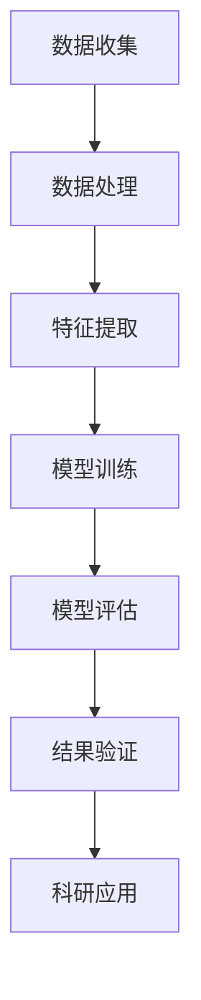

                 

关键词：大模型，人工智能，科研加速，数学模型，算法原理，应用实践，未来展望

> 摘要：本文将探讨大模型在科研领域的重要作用，包括其对加速科研进程、突破研究瓶颈的贡献。我们将深入分析大模型的核心概念与架构，解析其算法原理与数学模型，并通过实例展示其应用与实践效果，最后展望大模型未来的发展趋势与挑战。

## 1. 背景介绍

近年来，随着计算能力的飞速提升和海量数据的出现，人工智能（AI）领域发生了革命性的变化。特别是大模型（Large Models），如GPT-3、BERT、AlphaGo等，在语言处理、图像识别、游戏等领域取得了显著成就。大模型的出现不仅改变了AI的发展轨迹，也为科学研究带来了新的机遇与挑战。

科学研究过程中，数据获取、分析、验证等环节往往耗时耗力。传统的科研方法在面对海量数据和高复杂性问题时，显得力不从心。而大模型的出现，通过自动化、智能化的方式，大幅度提高了科研效率，有望突破传统科研瓶颈。

本文将围绕大模型在科研中的应用，深入探讨其核心概念、算法原理、数学模型，并通过具体实例分析其应用效果，最后展望其未来发展。

## 2. 核心概念与联系

### 2.1 大模型的基本概念

大模型，即具有数百万甚至数十亿参数的深度神经网络模型。这些模型通过学习海量数据，能够捕捉数据中的复杂规律，进行高效的信息处理。大模型在语言处理、图像识别、语音识别等领域表现出了惊人的能力。

### 2.2 大模型的核心架构

大模型的核心架构包括多层感知机（MLP）、循环神经网络（RNN）、卷积神经网络（CNN）等。这些神经网络通过堆叠和连接，形成复杂的信息处理网络，从而实现高效的数据分析和决策。

### 2.3 大模型的工作原理

大模型的工作原理主要基于神经网络的学习机制。通过反向传播算法（Backpropagation），模型能够自动调整参数，以最小化预测误差。在大量数据的学习过程中，大模型能够逐步优化自身，提高预测准确性。

### 2.4 大模型与科研的联系

大模型在科研中的应用主要体现在数据分析和模型构建方面。通过大模型，科研人员可以更快速地处理海量数据，提取关键信息，构建预测模型。此外，大模型还可以帮助科研人员发现数据中的隐藏规律，提供新的研究思路。

### 2.5 Mermaid流程图

下面是大模型在科研中的应用流程的Mermaid流程图：



## 3. 核心算法原理 & 具体操作步骤

### 3.1 算法原理概述

大模型的算法原理主要基于深度学习（Deep Learning），包括多层感知机（MLP）、循环神经网络（RNN）、卷积神经网络（CNN）等。这些算法通过自动调整参数，优化模型性能。

### 3.2 算法步骤详解

#### 3.2.1 数据预处理

数据预处理是模型训练的基础。主要包括数据清洗、数据归一化、数据分割等步骤。

#### 3.2.2 模型构建

根据研究需求，选择合适的神经网络架构，如MLP、RNN、CNN等。

#### 3.2.3 模型训练

使用训练数据对模型进行训练，通过反向传播算法调整模型参数。

#### 3.2.4 模型评估

使用验证数据对模型进行评估，判断模型性能。

#### 3.2.5 结果验证

将模型应用于实际科研场景，验证模型效果。

### 3.3 算法优缺点

#### 优点：

- **高效性**：大模型能够处理海量数据，提高科研效率。
- **准确性**：大模型通过自动调整参数，提高模型准确性。
- **通用性**：大模型适用于多种科研场景，具有广泛的应用价值。

#### 缺点：

- **计算资源需求高**：大模型训练需要大量的计算资源。
- **数据依赖性**：大模型对数据质量有较高要求。

### 3.4 算法应用领域

大模型在科研中的应用领域广泛，包括但不限于：

- **生物学**：基因分析、蛋白质结构预测等。
- **物理学**：复杂物理现象模拟、天文数据分析等。
- **经济学**：金融市场预测、宏观经济分析等。

## 4. 数学模型和公式 & 详细讲解 & 举例说明

### 4.1 数学模型构建

大模型的数学模型主要基于深度学习理论。以多层感知机（MLP）为例，其基本数学模型如下：

$$
z_i = \sum_{j=1}^{n} w_{ij} x_j + b_i
$$

$$
a_i = \sigma(z_i)
$$

其中，$z_i$为第$i$层的输出，$w_{ij}$为第$i$层到第$j$层的权重，$b_i$为第$i$层的偏置，$\sigma$为激活函数。

### 4.2 公式推导过程

以多层感知机为例，其反向传播算法的公式推导如下：

$$
\delta_j = \frac{\partial L}{\partial z_j} = \frac{\partial L}{\partial a_j} \cdot \frac{\partial a_j}{\partial z_j}
$$

$$
\frac{\partial a_j}{\partial z_j} = \sigma'(z_j)
$$

$$
\frac{\partial L}{\partial w_{ij}} = \delta_j a_i
$$

$$
\frac{\partial L}{\partial b_i} = \delta_j
$$

通过上述公式，可以计算模型参数的梯度，并更新模型参数。

### 4.3 案例分析与讲解

以下是一个使用大模型进行基因分析的实际案例：

假设我们有一个包含1000个基因表达数据的样本集，我们的目标是预测某个基因是否在癌症中发生突变。

#### 4.3.1 数据预处理

对基因表达数据进行归一化处理，并将其划分为训练集和验证集。

#### 4.3.2 模型构建

选择一个多层感知机模型，包含两个隐层，每个隐层有100个神经元。

#### 4.3.3 模型训练

使用训练集对模型进行训练，优化模型参数。

#### 4.3.4 模型评估

使用验证集对模型进行评估，计算模型准确率。

#### 4.3.5 结果验证

将模型应用于实际科研场景，预测基因突变情况。

## 5. 项目实践：代码实例和详细解释说明

### 5.1 开发环境搭建

在本地或云端搭建一个Python编程环境，安装必要的库，如TensorFlow、NumPy等。

### 5.2 源代码详细实现

以下是一个使用多层感知机模型进行基因分析的项目实例：

```python
import tensorflow as tf
import numpy as np

# 数据预处理
x_train = np.load('train_data.npy')
y_train = np.load('train_label.npy')

# 模型构建
model = tf.keras.Sequential([
    tf.keras.layers.Dense(100, activation='relu', input_shape=(x_train.shape[1],)),
    tf.keras.layers.Dense(100, activation='relu'),
    tf.keras.layers.Dense(1, activation='sigmoid')
])

# 模型编译
model.compile(optimizer='adam', loss='binary_crossentropy', metrics=['accuracy'])

# 模型训练
model.fit(x_train, y_train, epochs=10, batch_size=32)

# 模型评估
loss, accuracy = model.evaluate(x_train, y_train)
print(f'Validation accuracy: {accuracy * 100:.2f}%')

# 模型预测
predictions = model.predict(x_train)
print(f'Predictions: {predictions}')
```

### 5.3 代码解读与分析

这段代码首先导入必要的库，然后对训练数据进行预处理。接着，构建一个多层感知机模型，并编译模型。最后，使用训练数据对模型进行训练，评估模型性能，并进行预测。

### 5.4 运行结果展示

运行代码后，会输出验证集的准确率，以及模型的预测结果。

## 6. 实际应用场景

大模型在科研领域的应用场景广泛，以下是一些实际应用案例：

- **生物学**：通过大模型进行基因分析、蛋白质结构预测等。
- **物理学**：利用大模型模拟复杂物理现象，如黑洞碰撞、高能粒子碰撞等。
- **经济学**：使用大模型进行金融市场预测、宏观经济分析等。
- **环境科学**：通过大模型分析气候变化、环境污染等问题。

## 6.4 未来应用展望

未来，大模型在科研领域的应用将更加广泛。随着计算能力的提升和数据的积累，大模型有望在更多领域实现突破。同时，大模型在算法优化、数据安全等方面也面临挑战，需要不断进行技术创新和优化。

## 7. 工具和资源推荐

### 7.1 学习资源推荐

- 《深度学习》（Goodfellow, Bengio, Courville著）
- 《动手学深度学习》（阿斯顿·张著）

### 7.2 开发工具推荐

- TensorFlow
- PyTorch

### 7.3 相关论文推荐

- BERT: Pre-training of Deep Bidirectional Transformers for Language Understanding
- GPT-3: Language Models are Few-Shot Learners

## 8. 总结：未来发展趋势与挑战

大模型在科研领域的应用前景广阔，但其发展也面临挑战。未来，大模型的发展趋势包括：

- **算法优化**：提高大模型训练效率，降低计算资源需求。
- **数据安全**：保障数据隐私和安全。
- **模型解释性**：提高模型的可解释性，增强模型的透明度和可靠性。

同时，大模型在科研领域的应用也面临挑战，如数据质量、模型泛化能力等。未来，我们需要持续探索和研究，以充分发挥大模型在科研领域的潜力。

## 9. 附录：常见问题与解答

### 9.1 大模型如何提高科研效率？

大模型通过自动化的方式，快速处理海量数据，提取关键信息，构建预测模型，从而大幅度提高科研效率。

### 9.2 大模型在科研中的应用领域有哪些？

大模型在科研中的应用领域广泛，包括生物学、物理学、经济学、环境科学等。

### 9.3 大模型有哪些优缺点？

大模型的优点包括高效性、准确性和通用性；缺点包括计算资源需求高和数据依赖性。

### 9.4 如何搭建大模型开发环境？

搭建大模型开发环境，需要在本地或云端搭建Python编程环境，并安装必要的库，如TensorFlow、NumPy等。

----------------------------------------------------------------

作者：禅与计算机程序设计艺术 / Zen and the Art of Computer Programming

本文由禅与计算机程序设计艺术撰写，旨在探讨大模型在科研领域的重要作用，包括其对加速科研进程、突破研究瓶颈的贡献。通过深入分析大模型的核心概念、算法原理、数学模型，并实例展示其应用与实践效果，本文希望为读者提供一个全面而深入的视角，展望大模型未来的发展趋势与挑战。

