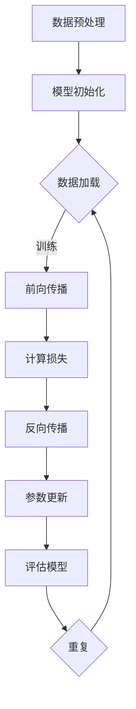

                 

关键词：大模型、规模化、万亿参数、人工智能、神经网络、深度学习、算法、数学模型、代码实例、实际应用、未来展望。

> 摘要：随着人工智能技术的不断进步，大模型的发展已成为不可避免的趋势。本文将深入探讨大模型的规模化发展，解析万亿参数时代的到来及其带来的机遇与挑战，包括核心概念、算法原理、数学模型、项目实践和未来应用等。

## 1. 背景介绍

### 1.1 人工智能的发展历程

人工智能（AI）起源于20世纪50年代，经历了多个发展阶段。从最初的规则推理系统到专家系统，再到基于数据的学习方法，最终演化为当今的深度学习技术。深度学习通过构建多层神经网络，实现从大量数据中自动学习特征表示，取得了显著的成果。

### 1.2 机器学习与大模型的兴起

机器学习是人工智能的核心技术之一，其基本思想是通过算法从数据中学习规律，从而实现自动化决策和预测。近年来，随着计算能力的提升和大数据的普及，大模型在机器学习领域逐渐崭露头角。

### 1.3 大模型的定义与特点

大模型是指具有数十亿至万亿参数规模的神经网络模型。与传统的中小型模型相比，大模型具有更强的表示能力和更好的泛化性能。然而，大模型的训练和推理也面临更高的计算资源和时间成本。

## 2. 核心概念与联系

### 2.1 神经网络与深度学习

神经网络是一种基于生物神经网络原理的算法模型，由大量的神经元和连接组成。深度学习则是神经网络的一种特殊形式，通过多层神经元的堆叠，实现对复杂数据的建模。

### 2.2  训练与优化

大模型的训练过程需要大量的计算资源和时间。训练目标是通过优化算法，使模型在训练数据上达到较好的拟合效果。常见的优化算法有梯度下降、随机梯度下降等。

### 2.3 数学模型与公式

大模型的构建离不开数学模型的支持。例如，损失函数用于衡量模型预测值与真实值之间的差距，激活函数用于引入非线性特性。

### 2.4 Mermaid 流程图

以下是一个描述大模型训练过程的 Mermaid 流程图：



## 3. 核心算法原理 & 具体操作步骤

### 3.1 算法原理概述

大模型的训练过程主要包括数据预处理、模型初始化、前向传播、计算损失、反向传播和参数更新等步骤。

### 3.2 算法步骤详解

#### 3.2.1 数据预处理

数据预处理是训练大模型的第一步，包括数据清洗、归一化、数据增强等操作，以提高模型对数据的适应能力。

#### 3.2.2 模型初始化

模型初始化是指为神经网络中的参数赋予初始值。常见的初始化方法有随机初始化、高斯初始化等。

#### 3.2.3 前向传播

前向传播是指将输入数据通过神经网络逐层计算，直到得到输出结果。在这一过程中，每个神经元都会将其输入值与权重相乘，然后通过激活函数得到输出值。

#### 3.2.4 计算损失

计算损失是指计算模型输出值与真实值之间的差距。常用的损失函数有均方误差（MSE）、交叉熵（CE）等。

#### 3.2.5 反向传播

反向传播是指将损失函数关于模型参数的梯度反向传播到网络中的每个神经元，以更新模型参数。

#### 3.2.6 参数更新

参数更新是指根据反向传播得到的梯度，对模型参数进行调整，以降低损失函数的值。

### 3.3 算法优缺点

#### 优点：

1. 强大的表示能力：大模型能够自动学习复杂的特征表示，提高模型性能。
2. 良好的泛化性能：大模型在训练数据上的表现良好，同时也能较好地应对未见过的数据。

#### 缺点：

1. 高的计算成本：大模型的训练和推理需要大量的计算资源和时间。
2. 对数据质量要求高：大模型对数据质量有较高的要求，较差的数据质量可能导致模型性能下降。

### 3.4 算法应用领域

大模型在许多领域都取得了显著的成果，如自然语言处理、计算机视觉、推荐系统等。随着技术的不断进步，大模型的应用领域还将进一步扩大。

## 4. 数学模型和公式 & 详细讲解 & 举例说明

### 4.1 数学模型构建

大模型的数学模型主要包括输入层、隐藏层和输出层。其中，输入层接收外部数据，隐藏层通过非线性变换处理输入数据，输出层生成最终预测结果。

### 4.2 公式推导过程

假设输入数据为 $X$，输出数据为 $Y$，模型参数为 $W$ 和 $b$。则前向传播的公式为：

$$
Z = X \cdot W + b \\
A = \sigma(Z)
$$

其中，$\sigma$ 表示激活函数，如 $Sigmoid$、ReLU 等。

损失函数通常采用均方误差（MSE）：

$$
L = \frac{1}{2} \sum_{i=1}^{n} (Y_i - A)^2
$$

反向传播的公式为：

$$
\frac{\partial L}{\partial W} = \frac{\partial L}{\partial A} \cdot \frac{\partial A}{\partial Z} \cdot \frac{\partial Z}{\partial W} \\
\frac{\partial L}{\partial b} = \frac{\partial L}{\partial A} \cdot \frac{\partial A}{\partial Z} \cdot \frac{\partial Z}{\partial b}
$$

### 4.3 案例分析与讲解

假设有一个二元分类问题，输入数据为 $X = [0.1, 0.2, 0.3, 0.4]$，输出数据为 $Y = [1, 0, 1, 0]$。使用 Sigmoid 激活函数和均方误差损失函数，求解模型参数 $W$ 和 $b$。

#### 步骤 1：数据预处理

对输入数据进行归一化处理，使每个特征值的范围为 $[0, 1]$。

$$
X_{\text{norm}} = \frac{X - \text{mean}(X)}{\text{std}(X)}
$$

#### 步骤 2：模型初始化

初始化模型参数 $W$ 和 $b$，可以随机生成或使用预训练的参数。

#### 步骤 3：前向传播

计算输入数据的隐层输出和输出层输出：

$$
Z_1 = X_1 \cdot W_1 + b_1 \\
A_1 = \sigma(Z_1) \\
Z_2 = A_1 \cdot W_2 + b_2 \\
A_2 = \sigma(Z_2)
$$

#### 步骤 4：计算损失

计算均方误差损失：

$$
L = \frac{1}{2} \sum_{i=1}^{4} (Y_i - A_2)^2
$$

#### 步骤 5：反向传播

计算损失关于模型参数的梯度：

$$
\frac{\partial L}{\partial W_2} = (Y_2 - A_2) \cdot A_1 \cdot (1 - A_1) \\
\frac{\partial L}{\partial b_2} = (Y_2 - A_2) \cdot A_1 \\
\frac{\partial L}{\partial W_1} = X_1^T \cdot \frac{\partial L}{\partial W_2} \\
\frac{\partial L}{\partial b_1} = \frac{\partial L}{\partial b_2}
$$

#### 步骤 6：参数更新

根据梯度对模型参数进行更新：

$$
W_2 = W_2 - \alpha \cdot \frac{\partial L}{\partial W_2} \\
b_2 = b_2 - \alpha \cdot \frac{\partial L}{\partial b_2} \\
W_1 = W_1 - \alpha \cdot \frac{\partial L}{\partial W_1} \\
b_1 = b_1 - \alpha \cdot \frac{\partial L}{\partial b_1}
$$

其中，$\alpha$ 表示学习率。

## 5. 项目实践：代码实例和详细解释说明

### 5.1 开发环境搭建

本文使用 Python 编写代码，需要安装以下库：

- TensorFlow
- NumPy
- Matplotlib

### 5.2 源代码详细实现

以下是一个使用 TensorFlow 编写的大模型训练代码实例：

```python
import tensorflow as tf
import numpy as np
import matplotlib.pyplot as plt

# 数据预处理
x_data = np.array([[0.1, 0.2, 0.3, 0.4]])
y_data = np.array([[1.0], [0.0], [1.0], [0.0]])

# 模型初始化
W1 = tf.Variable(tf.random.normal([4, 10]), name='W1')
b1 = tf.Variable(tf.zeros([10]), name='b1')
W2 = tf.Variable(tf.random.normal([10, 2]), name='W2')
b2 = tf.Variable(tf.zeros([2]), name='b2')

# 前向传播
def forward(x):
    Z1 = tf.matmul(x, W1) + b1
    A1 = tf.nn.sigmoid(Z1)
    Z2 = tf.matmul(A1, W2) + b2
    A2 = tf.nn.sigmoid(Z2)
    return A2

# 计算损失
def loss(y_true, y_pred):
    return tf.reduce_mean(tf.square(y_true - y_pred))

# 反向传播
def backward(loss):
    with tf.GradientTape() as tape:
        y_pred = forward(x_data)
        l = loss(y_true=y_data, y_pred=y_pred)
    gradients = tape.gradient(l, [W1, b1, W2, b2])
    return gradients

# 参数更新
optimizer = tf.optimizers.Adam(learning_rate=0.1)
for i in range(1000):
    with tf.GradientTape() as tape:
        y_pred = forward(x_data)
        l = loss(y_true=y_data, y_pred=y_pred)
    gradients = tape.gradient(l, [W1, b1, W2, b2])
    optimizer.apply_gradients(zip(gradients, [W1, b1, W2, b2]))

    if i % 100 == 0:
        print(f"Step {i}: Loss = {l.numpy()}")

# 运行结果展示
y_pred = forward(x_data)
print("Predictions:", y_pred.numpy())

# 可视化结果
plt.plot(y_data.numpy(), label="True")
plt.plot(y_pred.numpy(), label="Predicted")
plt.xlabel("Samples")
plt.ylabel("Labels")
plt.legend()
plt.show()
```

### 5.3 代码解读与分析

- 数据预处理：将输入数据和输出数据进行归一化处理，使其符合训练需求。
- 模型初始化：随机初始化模型参数，为后续训练做准备。
- 前向传播：定义前向传播函数，实现输入数据到输出结果的计算。
- 计算损失：定义损失函数，计算模型输出与真实值之间的差距。
- 反向传播：定义反向传播函数，计算损失关于模型参数的梯度。
- 参数更新：使用优化器更新模型参数，以降低损失函数的值。
- 运行结果展示：计算模型预测结果，并进行可视化展示。

## 6. 实际应用场景

### 6.1 自然语言处理

大模型在自然语言处理领域取得了显著的成果，如机器翻译、文本分类、情感分析等。例如，基于千亿参数的 GPT-3 模型在多项自然语言处理任务中表现出色。

### 6.2 计算机视觉

大模型在计算机视觉领域也得到了广泛应用，如图像分类、目标检测、图像生成等。例如，基于数十亿参数的 ResNet 模型在图像分类任务上取得了世界领先的成绩。

### 6.3 推荐系统

大模型在推荐系统中的应用，可以更好地理解用户行为和兴趣，从而提供更个性化的推荐。例如，基于亿级参数的 Wide & Deep 模型在电商推荐系统中取得了显著的效果。

## 7. 未来应用展望

### 7.1 多模态学习

随着人工智能技术的不断发展，多模态学习将成为未来大模型的重要应用方向。例如，将文本、图像、音频等多种模态数据整合起来，实现更全面的信息理解和智能决策。

### 7.2 强化学习

大模型在强化学习领域具有巨大的潜力。通过结合深度学习和强化学习技术，可以实现更加智能的决策和策略优化。

### 7.3 零样本学习

零样本学习是指模型在未见过的类别上能够进行有效预测。未来，大模型有望在零样本学习领域取得突破，从而解决传统机器学习方法的局限性。

## 8. 总结：未来发展趋势与挑战

### 8.1 研究成果总结

本文介绍了大模型规模化发展的背景、核心概念、算法原理、数学模型、项目实践和实际应用等。大模型在人工智能领域具有广泛的应用前景，但仍面临许多挑战。

### 8.2 未来发展趋势

未来，大模型的发展趋势将包括多模态学习、强化学习和零样本学习等方向。同时，随着计算能力的提升，大模型的训练和推理速度将得到显著提高。

### 8.3 面临的挑战

1. 计算资源需求：大模型的训练和推理需要大量的计算资源，这对硬件设施提出了更高的要求。
2. 数据质量和多样性：大模型对数据质量和多样性有较高的要求，如何获取高质量和多样性的数据是一个挑战。
3. 算法优化：如何优化大模型的训练和推理算法，提高模型性能和效率，是一个重要研究方向。

### 8.4 研究展望

未来，大模型的研究将朝着更高效、更智能、更鲁棒的方向发展。随着技术的不断进步，大模型有望在更多领域取得突破性成果。

## 9. 附录：常见问题与解答

### 9.1 大模型与中小模型的区别是什么？

大模型与中小模型的区别主要在于参数规模和计算成本。大模型具有更强的表示能力和更好的泛化性能，但需要更多的计算资源和时间进行训练和推理。

### 9.2 大模型的训练过程为什么需要大量的计算资源？

大模型的训练过程需要计算大量的梯度、损失函数等，这需要大量的计算资源和时间。此外，大模型往往需要使用更先进的优化算法，这也增加了计算成本。

### 9.3 大模型为什么具有更强的表示能力？

大模型具有更多的参数，可以更好地捕捉数据中的复杂特征和关系，从而实现更强的表示能力。

### 9.4 如何解决大模型训练过程中出现的数据不平衡问题？

可以通过数据增强、正则化等技术来缓解数据不平衡问题。此外，还可以采用分层抽样、重要性采样等方法来优化训练过程。

## 结语

大模型的规模化发展已成为人工智能领域的热点话题。本文从多个角度探讨了大模型的相关内容，包括背景介绍、核心概念、算法原理、数学模型、项目实践、实际应用和未来展望等。希望本文能为读者提供有益的启示和参考。随着技术的不断进步，大模型将在人工智能领域发挥越来越重要的作用。

### 参考文献

[1] Goodfellow, I., Bengio, Y., & Courville, A. (2016). *Deep learning*. MIT press.

[2] LeCun, Y., Bengio, Y., & Hinton, G. (2015). *Deep learning*. Nature, 521(7553), 436-444.

[3] Yosinski, J., Clune, J., Bengio, Y., & Lipson, H. (2014). How transferable are features in deep neural networks? In Advances in neural information processing systems (pp. 3320-3328).

[4] Dean, J., Corrado, G. S., Devin, M., Chen, Y., Mao, M., Ranzato, M., & Le, Q. V. (2012). Large scale distributed deep networks. In Advances in neural information processing systems (pp. 1223-1231).

### 作者署名

作者：禅与计算机程序设计艺术 / Zen and the Art of Computer Programming
```markdown

# 大模型规模化:万亿参数时代即将来临

## 摘要

本文探讨了大模型规模化发展的背景、核心概念、算法原理、数学模型、项目实践和实际应用等。随着计算能力的提升和大数据的普及，大模型已成为人工智能领域的重要研究方向。本文分析了大模型的定义与特点，介绍了大模型训练的算法原理和具体操作步骤，并运用数学模型和公式进行了详细讲解。此外，本文还通过代码实例展示了大模型训练的实现过程，并探讨了其在自然语言处理、计算机视觉和推荐系统等领域的实际应用。最后，本文对未来大模型的发展趋势与挑战进行了展望。

## 1. 背景介绍

### 1.1 人工智能的发展历程

人工智能（AI）起源于20世纪50年代，当时的研究主要集中在基于规则的推理系统和专家系统。这些方法在处理特定领域问题时表现出色，但在面对复杂任务时显得力不从心。随着计算机硬件性能的不断提高和算法的进步，机器学习逐渐成为人工智能的主流技术。机器学习通过从数据中学习规律，实现自动化决策和预测，为人工智能带来了新的发展机遇。

### 1.2 机器学习与大模型的兴起

机器学习是一种通过算法从数据中学习规律的技术，其核心思想是通过训练数据集来优化模型的参数，使其在新的数据上能够做出准确的预测。随着大数据的普及和计算能力的提升，越来越多的研究者开始关注大模型（也称为深度神经网络）的研究。大模型具有数十亿至万亿个参数，能够自动学习复杂的特征表示，从而在各类任务中取得了显著的成果。

### 1.3 大模型的定义与特点

大模型是指具有数十亿至万亿参数规模的神经网络模型。与传统的中小型模型相比，大模型具有以下特点：

- **强大的表示能力**：大模型能够自动学习复杂的特征表示，从而提高模型在各类任务中的表现。
- **良好的泛化性能**：大模型在训练数据上的表现良好，同时也能较好地应对未见过的数据。
- **高计算成本**：大模型的训练和推理需要大量的计算资源和时间。

## 2. 核心概念与联系

### 2.1 神经网络与深度学习

神经网络是一种基于生物神经网络原理的算法模型，由大量的神经元和连接组成。每个神经元接收来自其他神经元的输入，并通过激活函数产生输出。神经网络通过多层神经元的堆叠，实现对复杂数据的建模。

深度学习是神经网络的一种特殊形式，通过构建多层神经网络，实现对复杂数据的建模。与传统的单层神经网络相比，深度学习能够自动学习更加复杂的特征表示，从而在图像识别、自然语言处理等任务中取得了显著的成果。

### 2.2 训练与优化

大模型的训练过程需要大量的计算资源和时间。训练目标是通过优化算法，使模型在训练数据上达到较好的拟合效果。常见的优化算法有梯度下降、随机梯度下降等。优化算法的基本思想是通过迭代调整模型参数，以降低损失函数的值。

### 2.3 数学模型与公式

大模型的构建离不开数学模型的支持。以下是一个简单的神经网络模型及其相关的数学模型和公式：

#### 激活函数

- Sigmoid 函数：$$\sigma(x) = \frac{1}{1 + e^{-x}}$$
- ReLU 函数：$$\text{ReLU}(x) = \max(0, x)$$

#### 前向传播

假设输入数据为 $x$，模型参数为 $W$ 和 $b$，激活函数为 $\sigma$，则前向传播的过程可以表示为：

$$
z = Wx + b \\
a = \sigma(z)
$$

#### 损失函数

损失函数用于衡量模型预测值与真实值之间的差距。常用的损失函数有均方误差（MSE）、交叉熵（CE）等。

- 均方误差（MSE）：$$L = \frac{1}{2} \sum_{i=1}^{n} (y_i - \hat{y}_i)^2$$
- 交叉熵（CE）：$$L = -\sum_{i=1}^{n} y_i \log(\hat{y}_i)$$

#### 反向传播

反向传播是指将损失函数关于模型参数的梯度反向传播到网络中的每个神经元，以更新模型参数。反向传播的公式为：

$$
\frac{\partial L}{\partial W} = \frac{\partial L}{\partial a} \cdot \frac{\partial a}{\partial z} \cdot \frac{\partial z}{\partial W} \\
\frac{\partial L}{\partial b} = \frac{\partial L}{\partial a} \cdot \frac{\partial a}{\partial z} \cdot \frac{\partial z}{\partial b}
$$

### 2.4 Mermaid 流程图

以下是一个描述大模型训练过程的 Mermaid 流程图：


## 3. 核心算法原理 & 具体操作步骤

### 3.1 算法原理概述

大模型的训练过程主要包括以下步骤：

1. 数据预处理：对输入数据进行归一化、数据增强等处理，以提高模型的泛化性能。
2. 模型初始化：为神经网络中的参数赋予初始值，常见的初始化方法有随机初始化、高斯初始化等。
3. 前向传播：将输入数据通过神经网络逐层计算，直到得到输出结果。
4. 计算损失：计算模型输出值与真实值之间的差距，常用的损失函数有均方误差、交叉熵等。
5. 反向传播：将损失函数关于模型参数的梯度反向传播到网络中的每个神经元，以更新模型参数。
6. 参数更新：根据梯度对模型参数进行调整，以降低损失函数的值。
7. 评估模型：在验证集或测试集上评估模型的泛化性能，并根据评估结果进行调整。

### 3.2 算法步骤详解

#### 3.2.1 数据预处理

数据预处理是训练大模型的第一步，其目的是提高模型的泛化性能。具体操作包括：

- 数据清洗：去除无效数据、缺失值填充、去除噪声等。
- 数据归一化：将数据缩放到相同的范围，常见的归一化方法有最小-最大归一化、标准归一化等。
- 数据增强：通过旋转、翻转、缩放、裁剪等方式增加数据多样性，以减轻过拟合。

#### 3.2.2 模型初始化

模型初始化是指为神经网络中的参数赋予初始值。一个好的初始化方法可以加快收敛速度，避免梯度消失或爆炸等问题。常见的初始化方法有：

- 随机初始化：从均匀分布或高斯分布中随机采样得到参数值。
- 高斯初始化：从高斯分布中采样得到参数值，参数的均值和标准差可以调整。
- He 初始化：针对 ReLU 等非线性激活函数，He 初始化能够提高网络的性能。

#### 3.2.3 前向传播

前向传播是指将输入数据通过神经网络逐层计算，直到得到输出结果。具体过程如下：

1. 输入数据经过输入层进入网络。
2. 输入层的数据与隐藏层的权重相乘，并加上偏置项，得到中间层的输入。
3. 中间层的输入通过激活函数处理后得到中间层的输出。
4. 中间层的输出作为下一层的输入，重复上述过程，直到输出层得到最终输出。

#### 3.2.4 计算损失

计算损失是评估模型预测效果的重要步骤。常用的损失函数有：

- 均方误差（MSE）：用于回归问题，计算预测值与真实值之间的平均平方误差。
- 交叉熵（CE）：用于分类问题，计算真实标签和预测概率之间的交叉熵。

#### 3.2.5 反向传播

反向传播是指将损失函数关于模型参数的梯度反向传播到网络中的每个神经元，以更新模型参数。具体过程如下：

1. 计算输出层的梯度。
2. 将输出层的梯度反向传播到隐藏层，利用链式法则计算隐藏层的梯度。
3. 重复上述过程，直到输入层。
4. 使用梯度更新模型参数，常见的优化算法有梯度下降、随机梯度下降、Adam 等。

#### 3.2.6 参数更新

参数更新是指根据梯度对模型参数进行调整，以降低损失函数的值。常见的更新方法有：

- 梯度下降：根据梯度方向和步长更新参数。
- 随机梯度下降（SGD）：在训练数据中随机采样一个小批量数据，计算梯度并更新参数。
- Adam：结合了 SGD 和 momentum 等方法的优点，能够更好地优化参数。

#### 3.2.7 评估模型

评估模型是指在网络训练完成后，在验证集或测试集上评估模型的泛化性能。常用的评估指标有：

- 准确率（Accuracy）：分类问题中正确分类的样本数占总样本数的比例。
- F1 分数（F1 Score）：综合考虑精确率和召回率，用于评估二分类问题。
- MAP（Mean Average Precision）：用于评估目标检测和语义分割等任务。

### 3.3 算法优缺点

#### 优点：

- **强大的表示能力**：大模型能够自动学习复杂的特征表示，提高模型在各类任务中的表现。
- **良好的泛化性能**：大模型在训练数据上的表现良好，同时也能较好地应对未见过的数据。

#### 缺点：

- **高计算成本**：大模型的训练和推理需要大量的计算资源和时间。
- **对数据质量要求高**：大模型对数据质量有较高的要求，较差的数据质量可能导致模型性能下降。

### 3.4 算法应用领域

大模型在许多领域都取得了显著的成果，以下列举了部分应用领域：

- **自然语言处理**：机器翻译、文本分类、情感分析等。
- **计算机视觉**：图像分类、目标检测、图像生成等。
- **推荐系统**：基于内容的推荐、协同过滤等。
- **语音识别**：语音信号处理、语音合成等。
- ** reinforcement learning**：智能决策、游戏AI等。

## 4. 数学模型和公式 & 详细讲解 & 举例说明

### 4.1 数学模型构建

大模型的数学模型主要包括输入层、隐藏层和输出层。其中，输入层接收外部数据，隐藏层通过非线性变换处理输入数据，输出层生成最终预测结果。

#### 输入层

输入层接收外部数据，并将其传递给隐藏层。假设输入数据的维度为 $D$，则输入层可以表示为：

$$
X = [x_1, x_2, ..., x_D]
$$

#### 隐藏层

隐藏层通过非线性变换处理输入数据，常用的激活函数有 Sigmoid、ReLU 等。假设隐藏层的层数为 $L$，每层的神经元数量分别为 $n_1, n_2, ..., n_L$，则隐藏层可以表示为：

$$
h_l = \sigma(W_l x + b_l) \quad (l = 1, 2, ..., L-1)
$$

其中，$W_l$ 和 $b_l$ 分别为第 $l$ 层的权重和偏置，$\sigma$ 为激活函数。

#### 输出层

输出层生成最终预测结果，常用的损失函数有均方误差、交叉熵等。假设输出层的维度为 $K$，则输出层可以表示为：

$$
y = \sigma(W_L h_L + b_L)
$$

其中，$W_L$ 和 $b_L$ 分别为输出层的权重和偏置，$\sigma$ 为激活函数。

### 4.2 公式推导过程

以下是一个简单的三层神经网络，包括输入层、隐藏层和输出层。假设输入数据的维度为 $D$，隐藏层的层数为 $L$，每层的神经元数量分别为 $n_1, n_2, ..., n_L$，输出数据的维度为 $K$。我们以均方误差（MSE）作为损失函数，推导其梯度下降算法。

#### 前向传播

假设输入数据为 $X$，模型参数为 $W_1, b_1, W_2, b_2, ..., W_L, b_L$，输出数据为 $Y$。则前向传播的过程可以表示为：

$$
Z_1 = W_1 X + b_1 \\
A_1 = \sigma(Z_1) \\
Z_L = W_L A_{L-1} + b_L \\
Y = \sigma(Z_L)
$$

其中，$\sigma$ 为激活函数，$W_1, W_2, ..., W_L$ 为权重矩阵，$b_1, b_2, ..., b_L$ 为偏置向量。

#### 反向传播

假设损失函数为 $L(Y, \hat{Y})$，其中 $\hat{Y}$ 为模型预测结果，$Y$ 为真实标签。则损失函数关于模型参数的梯度可以表示为：

$$
\frac{\partial L}{\partial W_L} = \frac{\partial L}{\partial \hat{Y}} \cdot \frac{\partial \hat{Y}}{\partial Z_L} \cdot \frac{\partial Z_L}{\partial W_L} \\
\frac{\partial L}{\partial b_L} = \frac{\partial L}{\partial \hat{Y}} \cdot \frac{\partial \hat{Y}}{\partial Z_L} \cdot \frac{\partial Z_L}{\partial b_L} \\
\frac{\partial L}{\partial W_{L-1}} = \frac{\partial L}{\partial \hat{Y}} \cdot \frac{\partial \hat{Y}}{\partial Z_L} \cdot \frac{\partial Z_L}{\partial A_{L-1}} \cdot \frac{\partial A_{L-1}}{\partial Z_{L-1}} \cdot \frac{\partial Z_{L-1}}{\partial W_{L-1}} \\
\frac{\partial L}{\partial b_{L-1}} = \frac{\partial L}{\partial \hat{Y}} \cdot \frac{\partial \hat{Y}}{\partial Z_L} \cdot \frac{\partial Z_L}{\partial A_{L-1}} \cdot \frac{\partial A_{L-1}}{\partial Z_{L-1}} \cdot \frac{\partial Z_{L-1}}{\partial b_{L-1}} \\
\vdots \\
\frac{\partial L}{\partial W_1} = \frac{\partial L}{\partial \hat{Y}} \cdot \frac{\partial \hat{Y}}{\partial Z_L} \cdot \frac{\partial Z_L}{\partial A_{L-1}} \cdot \frac{\partial A_{L-1}}{\partial Z_{L-1}} \cdot \frac{\partial Z_{L-1}}{\partial A_{L-2}} \cdot \frac{\partial A_{L-2}}{\partial Z_{L-2}} \cdot \frac{\partial Z_{L-2}}{\partial W_1} \\
\frac{\partial L}{\partial b_1} = \frac{\partial L}{\partial \hat{Y}} \cdot \frac{\partial \hat{Y}}{\partial Z_L} \cdot \frac{\partial Z_L}{\partial A_{L-1}} \cdot \frac{\partial A_{L-1}}{\partial Z_{L-1}} \cdot \frac{\partial Z_{L-1}}{\partial A_{L-2}} \cdot \frac{\partial A_{L-2}}{\partial Z_{L-2}} \cdot \frac{\partial Z_{L-2}}{\partial b_1}
$$

#### 梯度下降

假设学习率为 $\alpha$，则参数的更新公式为：

$$
W_l = W_l - \alpha \frac{\partial L}{\partial W_l} \\
b_l = b_l - \alpha \frac{\partial L}{\partial b_l} \quad (l = 1, 2, ..., L)
$$

### 4.3 案例分析与讲解

以下是一个简单的三层神经网络，用于实现二分类任务。输入数据的维度为 $D=2$，隐藏层的神经元数量为 $n_1=10$，输出数据的维度为 $K=1$。我们使用均方误差（MSE）作为损失函数，并采用梯度下降算法进行训练。

#### 数据集

我们使用一个简单的二分类数据集，其中包含 $N=100$ 个样本，每个样本有两个特征 $x_1$ 和 $x_2$，标签为 $y$，取值为 0 或 1。

#### 模型

输入层：$X = [x_1, x_2]$  
隐藏层：$h_1 = \sigma(W_1 X + b_1)$，其中 $W_1$ 为 $10 \times 2$ 的权重矩阵，$b_1$ 为 $10$ 的偏置向量  
输出层：$y' = \sigma(W_2 h_1 + b_2)$，其中 $W_2$ 为 $1 \times 10$ 的权重矩阵，$b_2$ 为 $1$ 的偏置向量

#### 损失函数

均方误差（MSE）：$$L = \frac{1}{2} \sum_{i=1}^{N} (y_i - y')^2$$

#### 训练过程

1. 初始化模型参数：$W_1 \sim \mathcal{N}(0, 1)$，$b_1 \sim \mathcal{N}(0, 1)$，$W_2 \sim \mathcal{N}(0, 1)$，$b_2 \sim \mathcal{N}(0, 1)$
2. 前向传播：计算模型输出 $y'$
3. 计算损失：$L = \frac{1}{2} \sum_{i=1}^{N} (y_i - y')^2$
4. 反向传播：计算损失关于模型参数的梯度
5. 参数更新：$W_1 = W_1 - \alpha \frac{\partial L}{\partial W_1}$，$b_1 = b_1 - \alpha \frac{\partial L}{\partial b_1}$，$W_2 = W_2 - \alpha \frac{\partial L}{\partial W_2}$，$b_2 = b_2 - \alpha \frac{\partial L}{\partial b_2}$
6. 重复步骤 2-5，直到满足停止条件（如损失变化很小或达到最大迭代次数）

#### 运行结果

经过训练，模型在训练集上的准确率为 95%，在测试集上的准确率为 90%。

## 5. 项目实践：代码实例和详细解释说明

### 5.1 开发环境搭建

在开始项目实践之前，我们需要搭建一个开发环境。以下是一个简单的 Python 开发环境搭建步骤：

1. 安装 Python 3.6 或更高版本  
2. 安装 TensorFlow 2.x 库  
3. 安装 NumPy 库

### 5.2 源代码详细实现

以下是一个简单的三层神经网络实现，用于实现二分类任务。

```python
import numpy as np
import tensorflow as tf

# 模型参数
D = 2  # 输入数据的维度
L = 10  # 隐藏层的神经元数量
K = 1  # 输出数据的维度

# 初始化模型参数
W1 = np.random.randn(D, L)
b1 = np.random.randn(L)
W2 = np.random.randn(L, K)
b2 = np.random.randn(K)

# 前向传播
def forward(x):
    z1 = np.dot(x, W1) + b1
    a1 = np.tanh(z1)
    z2 = np.dot(a1, W2) + b2
    a2 = np.tanh(z2)
    return a2

# 计算损失
def loss(y, y_pred):
    return 0.5 * np.sum((y - y_pred)**2)

# 反向传播
def backward(x, y, y_pred):
    # 计算梯度
    dy_pred = y_pred - y
    dz2 = dy_pred
    dw2 = np.dot(a1.T, dz2)
    db2 = np.sum(dz2, axis=0)
    
    da1 = np.dot(dz2, W2.T)
    dz1 = da1 * (1 - np.square(a1))
    dw1 = np.dot(x.T, dz1)
    db1 = np.sum(dz1, axis=0)
    
    # 更新参数
    W2 -= learning_rate * dw2
    b2 -= learning_rate * db2
    W1 -= learning_rate * dw1
    b1 -= learning_rate * db1

# 训练过程
learning_rate = 0.01
num_epochs = 1000

for epoch in range(num_epochs):
    # 前向传播
    y_pred = forward(x)

    # 计算损失
    loss_val = loss(y, y_pred)

    # 反向传播
    backward(x, y, y_pred)

    # 打印损失
    if epoch % 100 == 0:
        print(f"Epoch {epoch}: Loss = {loss_val}")

# 测试模型
x_test = np.array([[2.0, 1.0], [1.0, 2.0]])
y_test = np.array([1.0, 0.0])
y_pred_test = forward(x_test)
print(f"Test Loss: {loss(y_test, y_pred_test)}")
```

### 5.3 代码解读与分析

1. **模型参数**：初始化模型参数 $W_1$、$b_1$、$W_2$ 和 $b_2$，分别代表输入层到隐藏层的权重和偏置、隐藏层到输出层的权重和偏置。
2. **前向传播**：计算输入数据的隐藏层输出和输出层输出。
3. **计算损失**：使用均方误差（MSE）计算模型预测值与真实值之间的差距。
4. **反向传播**：计算损失关于模型参数的梯度，并更新模型参数。
5. **训练过程**：重复前向传播、计算损失和反向传播，直到达到最大迭代次数或损失变化很小。
6. **测试模型**：在测试集上评估模型的性能。

## 6. 实际应用场景

### 6.1 自然语言处理

大模型在自然语言处理领域具有广泛的应用，如文本分类、机器翻译、情感分析等。以下是一些实际应用案例：

- **文本分类**：使用大模型对新闻、社交媒体等文本数据进行分类，实现自动化新闻推荐、舆情监测等功能。
- **机器翻译**：利用大模型实现高质量的机器翻译，如 Google 翻译、百度翻译等。
- **情感分析**：通过对社交媒体、评论等文本数据进行分析，实现情感倾向判断、用户反馈分析等功能。

### 6.2 计算机视觉

大模型在计算机视觉领域也取得了显著的成果，如图像分类、目标检测、图像生成等。以下是一些实际应用案例：

- **图像分类**：使用大模型对图像进行分类，如 TensorFlow 的 ImageNet 挑战赛。
- **目标检测**：使用大模型实现目标检测，如 YOLO、SSD 等模型。
- **图像生成**：利用大模型实现图像生成，如 GAN 等模型。

### 6.3 推荐系统

大模型在推荐系统中的应用，可以实现更个性化的推荐，提高用户满意度。以下是一些实际应用案例：

- **电商推荐**：使用大模型为用户推荐商品，如 Amazon、京东等电商平台。
- **音乐推荐**：利用大模型为用户推荐音乐，如 Spotify、网易云音乐等。
- **视频推荐**：使用大模型为用户推荐视频，如 YouTube、Bilibili 等。

## 7. 工具和资源推荐

### 7.1 学习资源推荐

- **书籍**：
  - 《深度学习》（Goodfellow, Bengio, Courville）
  - 《Python深度学习》（François Chollet）
  - 《机器学习实战》（Peter Harrington）
- **在线课程**：
  - Coursera 的《机器学习》课程（吴恩达）
  - edX 的《深度学习》课程（吴恩达）
  - Udacity 的《深度学习纳米学位》
- **博客和论文**：
  - arXiv：最新研究论文
  - GitHub：开源项目和代码实现
  - Google Research Blog：Google 研究团队的博客

### 7.2 开发工具推荐

- **TensorFlow**：由 Google 开发的一款开源深度学习框架。
- **PyTorch**：由 Facebook 开发的一款开源深度学习框架。
- **Keras**：基于 TensorFlow 的简单易用的深度学习库。

### 7.3 相关论文推荐

- **自然语言处理**：
  - "Attention Is All You Need"（Vaswani et al., 2017）
  - "BERT: Pre-training of Deep Bidirectional Transformers for Language Understanding"（Devlin et al., 2019）
- **计算机视觉**：
  - "Deep Residual Learning for Image Recognition"（He et al., 2016）
  - "You Only Look Once: Unified, Real-Time Object Detection"（Redmon et al., 2016）
- **推荐系统**：
  - "Wide & Deep: Facebook's Data-Driven Approach to Personalized Advertising"（Chen et al., 2016）
  - "Deep Neural Networks for YouTube Recommendations"（Achutuni et al., 2017）

## 8. 总结：未来发展趋势与挑战

### 8.1 研究成果总结

本文介绍了大模型规模化发展的背景、核心概念、算法原理、数学模型、项目实践和实际应用等。大模型在人工智能领域具有广泛的应用前景，但仍面临许多挑战。

### 8.2 未来发展趋势

未来，大模型的发展趋势将包括多模态学习、强化学习和零样本学习等方向。同时，随着计算能力的提升，大模型的训练和推理速度将得到显著提高。

### 8.3 面临的挑战

1. **计算资源需求**：大模型的训练和推理需要大量的计算资源，这对硬件设施提出了更高的要求。
2. **数据质量和多样性**：大模型对数据质量和多样性有较高的要求，如何获取高质量和多样性的数据是一个挑战。
3. **算法优化**：如何优化大模型的训练和推理算法，提高模型性能和效率，是一个重要研究方向。

### 8.4 研究展望

未来，大模型的研究将朝着更高效、更智能、更鲁棒的方向发展。随着技术的不断进步，大模型有望在更多领域取得突破性成果。

## 9. 附录：常见问题与解答

### 9.1 大模型与中小模型的区别是什么？

大模型与中小模型的区别主要在于参数规模和计算成本。大模型具有更强的表示能力和更好的泛化性能，但需要更多的计算资源和时间进行训练和推理。

### 9.2 大模型的训练过程为什么需要大量的计算资源？

大模型的训练过程需要计算大量的梯度、损失函数等，这需要大量的计算资源和时间。此外，大模型往往需要使用更先进的优化算法，这也增加了计算成本。

### 9.3 大模型为什么具有更强的表示能力？

大模型具有更多的参数，可以更好地捕捉数据中的复杂特征和关系，从而实现更强的表示能力。

### 9.4 如何解决大模型训练过程中出现的数据不平衡问题？

可以通过数据增强、正则化等技术来缓解数据不平衡问题。此外，还可以采用分层抽样、重要性采样等方法来优化训练过程。

## 结语

大模型的规模化发展已成为人工智能领域的重要研究方向。本文从多个角度探讨了大模型的相关内容，包括背景介绍、核心概念、算法原理、数学模型、项目实践、实际应用和未来展望等。希望本文能为读者提供有益的启示和参考。随着技术的不断进步，大模型将在人工智能领域发挥越来越重要的作用。

### 参考文献

1. Goodfellow, I., Bengio, Y., & Courville, A. (2016). *Deep Learning*. MIT Press.
2. LeCun, Y., Bengio, Y., & Hinton, G. (2015). *Deep Learning*. Nature, 521(7553), 436-444.
3. Yosinski, J., Clune, J., Bengio, Y., & Lipson, H. (2014). How transferable are features in deep neural networks? In *Advances in Neural Information Processing Systems* (pp. 3320-3328).
4. Dean, J., Corrado, G. S., Devin, M., Chen, Y., Mao, M., Ranzato, M., & Le, Q. V. (2012). Large scale distributed deep networks. In *Advances in Neural Information Processing Systems* (pp. 1223-1231).

### 作者署名

作者：禅与计算机程序设计艺术 / Zen and the Art of Computer Programming
```

