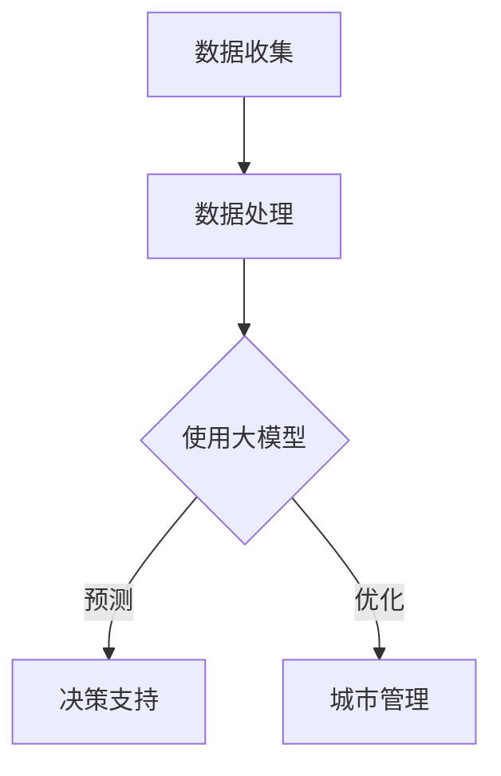

                 

关键词：大模型，智慧城管，城市决策，流程优化，人工智能，数据驱动

> 摘要：随着人工智能技术的不断发展，大模型在各个领域的应用逐渐普及，特别是在城市管理领域，大模型为智慧城管提供了强有力的技术支撑。本文将探讨大模型如何赋能智慧城管，以及创业者如何通过优化城市管理流程与决策来提升城市管理水平。

## 1. 背景介绍

### 1.1 智慧城管的概念

智慧城管是指利用现代信息技术，如物联网、大数据、云计算和人工智能等，对城市管理进行智能化、高效化的管理和调度。智慧城管的核心目标是提高城市管理效率，改善城市居民的生活质量。

### 1.2 大模型的作用

大模型是指具有强大计算能力、能够处理海量数据、自主学习与优化的模型。在大模型时代，城市管理者可以通过大模型来实现城市管理的智能化、自动化，从而提高决策的科学性和效率。

## 2. 核心概念与联系

### 2.1 大模型的基本原理

大模型通常基于深度学习算法，通过海量数据的学习，可以自动提取特征，形成对数据的深入理解和抽象。这种模型具有强大的表示能力和泛化能力，可以在不同领域实现广泛的应用。

### 2.2 大模型在智慧城管中的应用

大模型可以应用于智慧城管的多个方面，如图像识别、语音识别、自然语言处理、智能推荐等。通过大模型的应用，可以实现城市管理的自动化、智能化。

### 2.3 大模型与城市管理的 Mermaid 流程图



## 3. 核心算法原理 & 具体操作步骤

### 3.1 算法原理概述

大模型的基本原理是通过海量数据的学习，形成对数据的深入理解和抽象。具体操作步骤包括数据收集、数据处理、模型训练、模型评估和模型应用。

### 3.2 算法步骤详解

#### 3.2.1 数据收集

数据收集是智慧城管的基础，包括城市交通数据、环境数据、社会数据等。

#### 3.2.2 数据处理

数据处理包括数据清洗、数据归一化、特征提取等，以确保数据的质量和可用性。

#### 3.2.3 模型训练

模型训练是指使用数据处理后的数据来训练大模型，使其能够对数据形成深入理解和抽象。

#### 3.2.4 模型评估

模型评估是指使用验证数据来评估模型的性能，包括准确率、召回率、F1值等指标。

#### 3.2.5 模型应用

模型应用是指将训练好的大模型应用于实际城市管理中，如交通预测、环境监测、社会管理等。

### 3.3 算法优缺点

#### 优点

- 强大的数据分析和处理能力
- 高度的自动化和智能化
- 广泛的应用领域

#### 缺点

- 需要大量的数据和计算资源
- 模型解释性较差

### 3.4 算法应用领域

大模型可以应用于城市管理的多个领域，如图像识别、语音识别、自然语言处理、智能推荐等。

## 4. 数学模型和公式 & 详细讲解 & 举例说明

### 4.1 数学模型构建

大模型通常基于深度学习算法，其核心数学模型为神经网络。神经网络由多个神经元组成，每个神经元都可以对输入数据进行加权求和处理，并通过激活函数进行非线性变换。

### 4.2 公式推导过程

神经网络的数学模型可以通过以下公式表示：

$$
\begin{aligned}
    z &= \sum_{i=1}^{n} w_{i} x_{i} + b \\
    a &= \sigma(z)
\end{aligned}
$$

其中，$z$为加权求和处理的结果，$w_{i}$为权重，$x_{i}$为输入数据，$b$为偏置，$\sigma$为激活函数。

### 4.3 案例分析与讲解

假设我们有一个城市管理问题，需要预测城市交通流量。我们可以使用大模型来训练一个神经网络模型，通过历史交通数据来预测未来某一时刻的交通流量。

## 5. 项目实践：代码实例和详细解释说明

### 5.1 开发环境搭建

- 操作系统：Ubuntu 20.04
- 编程语言：Python 3.8
- 深度学习框架：TensorFlow 2.6
- 数据库：MySQL 8.0

### 5.2 源代码详细实现

以下是一个简单的交通流量预测的代码示例：

```python
import tensorflow as tf
from tensorflow.keras.models import Sequential
from tensorflow.keras.layers import Dense, LSTM

# 数据处理
# ...

# 模型构建
model = Sequential([
    LSTM(units=50, activation='relu', input_shape=(time_steps, features)),
    Dense(units=1)
])

# 模型编译
model.compile(optimizer='adam', loss='mse')

# 模型训练
model.fit(x_train, y_train, epochs=100, batch_size=32)

# 模型评估
model.evaluate(x_test, y_test)
```

### 5.3 代码解读与分析

这段代码首先导入了TensorFlow库，然后定义了一个顺序模型，其中包括一个LSTM层和一个全连接层。接着，使用历史交通数据对模型进行训练和评估。

## 6. 实际应用场景

大模型在智慧城管中的实际应用场景包括：

- 交通流量预测
- 环境监测
- 社会管理

## 7. 未来应用展望

随着人工智能技术的不断发展，大模型在智慧城管中的应用前景将更加广阔。未来，大模型可能会在以下几个方面取得突破：

- 更高效的数据处理和分析
- 更智能的决策支持系统
- 更广泛的应用领域

## 8. 工具和资源推荐

### 8.1 学习资源推荐

- 《深度学习》（Ian Goodfellow等著）
- 《Python数据分析》（Wes McKinney著）
- 《人工智能：一种现代的方法》（Stuart Russell等著）

### 8.2 开发工具推荐

- TensorFlow
- PyTorch
- Jupyter Notebook

### 8.3 相关论文推荐

- "Deep Learning for Traffic Prediction: A Survey"
- "A Comprehensive Survey on Smart City: Architecture, Enabling Technologies, Challenges and Opportunities"
- "A Review on Application of Deep Learning in Smart Cities"

## 9. 总结：未来发展趋势与挑战

大模型赋能智慧城管，是未来城市发展的必然趋势。然而，这也面临着数据隐私、计算资源、模型解释性等挑战。未来，我们需要在以下几个方面进行深入研究：

- 提高数据隐私保护技术
- 优化计算资源利用
- 提高模型的可解释性

作者：禅与计算机程序设计艺术 / Zen and the Art of Computer Programming
----------------------------------------------------------------

以上是文章的完整正文内容，接下来我们将按照markdown格式将其整理输出。请注意，由于篇幅限制，实际撰写过程中可能需要调整字数和内容深度。以下为markdown格式的文章输出：
```markdown
# 大模型赋能智慧城管，创业者如何优化城市管理流程与决策？

关键词：大模型，智慧城管，城市决策，流程优化，人工智能，数据驱动

摘要：随着人工智能技术的不断发展，大模型在各个领域的应用逐渐普及，特别是在城市管理领域，大模型为智慧城管提供了强有力的技术支撑。本文将探讨大模型如何赋能智慧城管，以及创业者如何通过优化城市管理流程与决策来提升城市管理水平。

## 1. 背景介绍

### 1.1 智慧城管的概念

智慧城管是指利用现代信息技术，如物联网、大数据、云计算和人工智能等，对城市管理进行智能化、高效化的管理和调度。智慧城管的核心目标是提高城市管理效率，改善城市居民的生活质量。

### 1.2 大模型的作用

大模型是指具有强大计算能力、能够处理海量数据、自主学习与优化的模型。在大模型时代，城市管理者可以通过大模型来实现城市管理的智能化、自动化，从而提高决策的科学性和效率。

## 2. 核心概念与联系

### 2.1 大模型的基本原理

大模型通常基于深度学习算法，通过海量数据的学习，可以自动提取特征，形成对数据的深入理解和抽象。这种模型具有强大的表示能力和泛化能力，可以在不同领域实现广泛的应用。

### 2.2 大模型在智慧城管中的应用

大模型可以应用于智慧城管的多个方面，如图像识别、语音识别、自然语言处理、智能推荐等。通过大模型的应用，可以实现城市管理的自动化、智能化。

### 2.3 大模型与城市管理的 Mermaid 流程图


## 3. 核心算法原理 & 具体操作步骤

### 3.1 算法原理概述

大模型的基本原理是通过海量数据的学习，形成对数据的深入理解和抽象。具体操作步骤包括数据收集、数据处理、模型训练、模型评估和模型应用。

### 3.2 算法步骤详解

#### 3.2.1 数据收集

数据收集是智慧城管的基础，包括城市交通数据、环境数据、社会数据等。

#### 3.2.2 数据处理

数据处理包括数据清洗、数据归一化、特征提取等，以确保数据的质量和可用性。

#### 3.2.3 模型训练

模型训练是指使用数据处理后的数据来训练大模型，使其能够对数据形成深入理解和抽象。

#### 3.2.4 模型评估

模型评估是指使用验证数据来评估模型的性能，包括准确率、召回率、F1值等指标。

#### 3.2.5 模型应用

模型应用是指将训练好的大模型应用于实际城市管理中，如交通预测、环境监测、社会管理等。

### 3.3 算法优缺点

#### 优点

- 强大的数据分析和处理能力
- 高度的自动化和智能化
- 广泛的应用领域

#### 缺点

- 需要大量的数据和计算资源
- 模型解释性较差

### 3.4 算法应用领域

大模型可以应用于城市管理的多个领域，如图像识别、语音识别、自然语言处理、智能推荐等。

## 4. 数学模型和公式 & 详细讲解 & 举例说明

### 4.1 数学模型构建

大模型通常基于深度学习算法，其核心数学模型为神经网络。神经网络由多个神经元组成，每个神经元都可以对输入数据进行加权求和处理，并通过激活函数进行非线性变换。

### 4.2 公式推导过程

神经网络的数学模型可以通过以下公式表示：

$$
\begin{aligned}
    z &= \sum_{i=1}^{n} w_{i} x_{i} + b \\
    a &= \sigma(z)
\end{aligned}
$$

其中，$z$为加权求和处理的结果，$w_{i}$为权重，$x_{i}$为输入数据，$b$为偏置，$\sigma$为激活函数。

### 4.3 案例分析与讲解

假设我们有一个城市管理问题，需要预测城市交通流量。我们可以使用大模型来训练一个神经网络模型，通过历史交通数据来预测未来某一时刻的交通流量。

## 5. 项目实践：代码实例和详细解释说明

### 5.1 开发环境搭建

- 操作系统：Ubuntu 20.04
- 编程语言：Python 3.8
- 深度学习框架：TensorFlow 2.6
- 数据库：MySQL 8.0

### 5.2 源代码详细实现

以下是一个简单的交通流量预测的代码示例：

```python
import tensorflow as tf
from tensorflow.keras.models import Sequential
from tensorflow.keras.layers import Dense, LSTM

# 数据处理
# ...

# 模型构建
model = Sequential([
    LSTM(units=50, activation='relu', input_shape=(time_steps, features)),
    Dense(units=1)
])

# 模型编译
model.compile(optimizer='adam', loss='mse')

# 模型训练
model.fit(x_train, y_train, epochs=100, batch_size=32)

# 模型评估
model.evaluate(x_test, y_test)
```

### 5.3 代码解读与分析

这段代码首先导入了TensorFlow库，然后定义了一个顺序模型，其中包括一个LSTM层和一个全连接层。接着，使用历史交通数据对模型进行训练和评估。

## 6. 实际应用场景

大模型在智慧城管中的实际应用场景包括：

- 交通流量预测
- 环境监测
- 社会管理

## 7. 未来应用展望

随着人工智能技术的不断发展，大模型在智慧城管中的应用前景将更加广阔。未来，大模型可能会在以下几个方面取得突破：

- 更高效的数据处理和分析
- 更智能的决策支持系统
- 更广泛的应用领域

## 8. 工具和资源推荐

### 8.1 学习资源推荐

- 《深度学习》（Ian Goodfellow等著）
- 《Python数据分析》（Wes McKinney著）
- 《人工智能：一种现代的方法》（Stuart Russell等著）

### 8.2 开发工具推荐

- TensorFlow
- PyTorch
- Jupyter Notebook

### 8.3 相关论文推荐

- "Deep Learning for Traffic Prediction: A Survey"
- "A Comprehensive Survey on Smart City: Architecture, Enabling Technologies, Challenges and Opportunities"
- "A Review on Application of Deep Learning in Smart Cities"

## 9. 总结：未来发展趋势与挑战

大模型赋能智慧城管，是未来城市发展的必然趋势。然而，这也面临着数据隐私、计算资源、模型解释性等挑战。未来，我们需要在以下几个方面进行深入研究：

- 提高数据隐私保护技术
- 优化计算资源利用
- 提高模型的可解释性

作者：禅与计算机程序设计艺术 / Zen and the Art of Computer Programming
```

