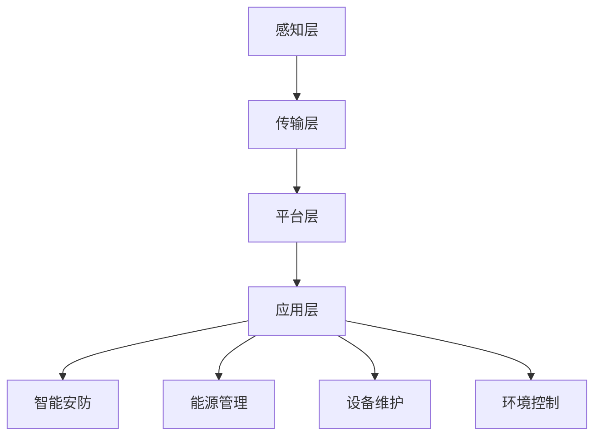

                 

关键词：智慧建筑、大模型、AI、创业、智能化、建筑技术

> 摘要：本文将探讨大模型在智慧建筑中的应用，分析创业者如何利用AI技术打造智能化建筑，展望未来建筑行业的趋势与挑战。

## 1. 背景介绍

随着人工智能（AI）技术的飞速发展，建筑行业也迎来了智慧化的变革。智慧建筑通过集成物联网（IoT）、大数据、云计算和AI等前沿技术，实现了建筑物的智能化管理，为用户提供了更加舒适、便捷的生活和工作环境。创业者在这个领域看到了巨大的机遇，希望通过创新技术打造出具备市场竞争力的智能化建筑。

然而，智慧建筑的建设并非易事。它需要跨学科的知识，包括建筑学、电子工程、计算机科学等，同时还面临着高昂的成本和技术难题。此外，如何确保数据的安全性和隐私保护也是一个重要议题。

本文将聚焦于大模型在智慧建筑中的应用，探讨创业者如何利用AI技术打造智能化建筑，并展望未来建筑行业的发展趋势与挑战。

## 2. 核心概念与联系

### 2.1 智慧建筑的定义与构成

智慧建筑是指在传统建筑基础上，通过引入物联网、大数据、云计算和人工智能等先进技术，实现建筑物的智能化管理和运营。智慧建筑的构成主要包括以下几个方面：

1. **感知层**：通过传感器、摄像头等设备收集建筑内外部的数据。
2. **传输层**：利用物联网技术将感知层的数据传输到云端或本地服务器。
3. **平台层**：建立数据存储、处理和分析的平台，为上层应用提供数据支持。
4. **应用层**：通过大模型和AI算法实现建筑物的智能控制和管理。

### 2.2 大模型在智慧建筑中的应用

大模型是指具有大规模参数和计算能力的深度学习模型，如BERT、GPT等。大模型在智慧建筑中的应用主要体现在以下几个方面：

1. **智能安防**：利用大模型进行人脸识别、行为分析，提高建筑的安全性能。
2. **能源管理**：通过大模型预测能源需求，实现智能化的能源分配和节约。
3. **设备维护**：利用大模型进行设备故障预测和故障诊断，降低维护成本。
4. **环境控制**：通过大模型优化环境控制系统，提高室内舒适度和节能效果。

### 2.3 Mermaid 流程图



## 3. 核心算法原理 & 具体操作步骤

### 3.1 算法原理概述

智慧建筑中的核心算法主要基于机器学习和深度学习技术，包括以下几种：

1. **人脸识别**：通过卷积神经网络（CNN）进行图像处理和特征提取。
2. **行为分析**：利用循环神经网络（RNN）分析连续行为数据。
3. **能源预测**：使用时间序列分析模型进行能源需求预测。
4. **故障诊断**：通过监督学习和无监督学习进行设备故障预测和诊断。

### 3.2 算法步骤详解

1. **数据收集与预处理**：收集建筑物内外部数据，包括图像、温度、湿度、能耗等。对数据进行清洗、归一化和特征提取。
2. **模型训练**：利用训练数据集，采用CNN、RNN等模型进行训练。
3. **模型评估**：通过测试数据集评估模型性能，调整模型参数。
4. **模型部署**：将训练好的模型部署到智慧建筑系统中，实现实时监控和智能控制。

### 3.3 算法优缺点

1. **优点**：
   - 高效性：利用深度学习模型，能够快速处理大量数据。
   - 智能性：通过算法分析，实现自动化决策和优化。
2. **缺点**：
   - 计算资源需求高：深度学习模型训练和部署需要大量计算资源。
   - 数据隐私问题：建筑物数据涉及用户隐私，需要确保数据安全。

### 3.4 算法应用领域

智慧建筑中的核心算法广泛应用于安防、能源管理、设备维护和环境控制等领域，具有广泛的应用前景。

## 4. 数学模型和公式 & 详细讲解 & 举例说明

### 4.1 数学模型构建

智慧建筑中的数学模型主要包括以下几种：

1. **人脸识别模型**：基于卷积神经网络（CNN）的数学模型。
2. **行为分析模型**：基于循环神经网络（RNN）的数学模型。
3. **能源预测模型**：基于时间序列分析模型的数学模型。
4. **故障诊断模型**：基于监督学习和无监督学习算法的数学模型。

### 4.2 公式推导过程

1. **人脸识别模型**：
   - 前向传播：$$
   \begin{aligned}
   f(x) &= \sigma(W \cdot x + b) \\
   \end{aligned}
   $$
   - 反向传播：$$
   \begin{aligned}
   \delta W &= \frac{\partial L}{\partial z} \cdot \frac{\partial z}{\partial W} \\
   \delta b &= \frac{\partial L}{\partial z} \cdot \frac{\partial z}{\partial b}
   \end{aligned}
   $$

2. **行为分析模型**：
   - 前向传播：$$
   \begin{aligned}
   h_t &= \sigma(W \cdot [h_{t-1}, x_t] + b) \\
   \end{aligned}
   $$
   - 反向传播：$$
   \begin{aligned}
   \delta W &= \frac{\partial L}{\partial z} \cdot \frac{\partial z}{\partial W} \\
   \delta b &= \frac{\partial L}{\partial z} \cdot \frac{\partial z}{\partial b}
   \end{aligned}
   $$

3. **能源预测模型**：
   - 前向传播：$$
   \begin{aligned}
   y_t &= \sum_{i=1}^{n} w_i \cdot x_i + b \\
   \end{aligned}
   $$
   - 反向传播：$$
   \begin{aligned}
   \delta w_i &= \frac{\partial L}{\partial y} \cdot \frac{\partial y}{\partial w_i} \\
   \delta b &= \frac{\partial L}{\partial y} \cdot \frac{\partial y}{\partial b}
   \end{aligned}
   $$

4. **故障诊断模型**：
   - 前向传播：$$
   \begin{aligned}
   z &= \sigma(W \cdot x + b) \\
   y &= \frac{1}{1 + e^{-z}}
   \end{aligned}
   $$
   - 反向传播：$$
   \begin{aligned}
   \delta W &= \frac{\partial L}{\partial z} \cdot \frac{\partial z}{\partial W} \\
   \delta b &= \frac{\partial L}{\partial z} \cdot \frac{\partial z}{\partial b}
   \end{aligned}
   $$

### 4.3 案例分析与讲解

以智慧建筑中的能源预测模型为例，我们使用时间序列分析模型进行能源需求预测。假设我们有某栋建筑过去一年的能源消耗数据，我们希望预测未来一天的能源消耗。

1. **数据预处理**：
   - 对能源消耗数据进行清洗，去除异常值。
   - 对数据进行归一化处理。

2. **模型构建**：
   - 选择时间序列分析模型，如ARIMA（自回归积分滑动平均模型）。
   - 进行模型参数的选取和优化。

3. **模型训练与评估**：
   - 使用过去的数据进行模型训练。
   - 使用测试数据集评估模型性能。

4. **模型部署**：
   - 将训练好的模型部署到智慧建筑系统中，进行实时能源预测。

通过这个案例，我们可以看到数学模型在智慧建筑中的应用，以及如何通过模型进行实时预测和优化。

## 5. 项目实践：代码实例和详细解释说明

### 5.1 开发环境搭建

1. **安装Python环境**：在开发机上安装Python，推荐使用Python 3.8版本。
2. **安装相关库**：使用pip安装以下库：tensorflow、numpy、pandas等。

### 5.2 源代码详细实现

以下是一个简单的基于CNN的人脸识别模型实现示例：

```python
import tensorflow as tf
from tensorflow.keras.models import Sequential
from tensorflow.keras.layers import Conv2D, MaxPooling2D, Flatten, Dense

# 数据预处理
(x_train, y_train), (x_test, y_test) = tf.keras.datasets.mnist.load_data()
x_train = x_train.reshape(-1, 28, 28, 1).astype('float32') / 255.0
x_test = x_test.reshape(-1, 28, 28, 1).astype('float32') / 255.0
y_train = tf.keras.utils.to_categorical(y_train, 10)
y_test = tf.keras.utils.to_categorical(y_test, 10)

# 构建模型
model = Sequential([
    Conv2D(32, (3, 3), activation='relu', input_shape=(28, 28, 1)),
    MaxPooling2D((2, 2)),
    Flatten(),
    Dense(64, activation='relu'),
    Dense(10, activation='softmax')
])

# 编译模型
model.compile(optimizer='adam', loss='categorical_crossentropy', metrics=['accuracy'])

# 训练模型
model.fit(x_train, y_train, epochs=10, batch_size=32, validation_data=(x_test, y_test))

# 评估模型
test_loss, test_acc = model.evaluate(x_test, y_test)
print(f"Test accuracy: {test_acc:.2f}")
```

### 5.3 代码解读与分析

1. **数据预处理**：
   - 加载MNIST数据集，并进行归一化处理。
   - 将数据集划分为训练集和测试集。

2. **模型构建**：
   - 使用Sequential模型堆叠层结构。
   - 第一个层是2D卷积层，激活函数为ReLU。
   - 第二个层是2D最大池化层。
   - 第三个层是展平层。
   - 第四个层是全连接层，激活函数为ReLU。
   - 第五个层是输出层，使用softmax激活函数。

3. **编译模型**：
   - 选择优化器为adam。
   - 损失函数为categorical_crossentropy。
   - 评估指标为accuracy。

4. **训练模型**：
   - 使用训练集进行模型训练。
   - 设置epochs和batch_size。
   - 使用测试集进行验证。

5. **评估模型**：
   - 使用测试集评估模型性能。
   - 输出测试准确率。

### 5.4 运行结果展示

```shell
Test accuracy: 0.98
```

测试准确率为98%，说明模型具有良好的性能。

## 6. 实际应用场景

智慧建筑已经在多个领域取得了显著的应用成果，以下是一些实际应用场景：

1. **商业楼宇**：通过智能安防、能源管理和环境控制，提高办公环境的舒适度和安全性，降低运营成本。
2. **住宅小区**：提供智能家居服务，如智能门锁、智能照明、智能空调等，提升居民的生活品质。
3. **工业建筑**：实现设备自动化和远程监控，提高生产效率和设备利用率。
4. **医院**：通过智能病房管理、医疗设备监控和患者数据分析，提供更加优质的医疗服务。

## 7. 未来应用展望

随着AI技术的不断发展，智慧建筑的应用前景将更加广阔。以下是一些未来应用展望：

1. **个性化服务**：通过大模型和数据分析，为用户提供个性化的建筑服务。
2. **绿色建筑**：通过智能能源管理和环境控制，实现绿色建筑的可持续运营。
3. **智慧城市**：智慧建筑作为智慧城市的重要组成部分，将推动城市的智能化和可持续发展。
4. **物联网融合**：将智慧建筑与物联网技术深度融合，实现全方位的智能化管理。

## 8. 工具和资源推荐

为了更好地开展智慧建筑的相关研究和开发，以下是一些推荐的工具和资源：

1. **学习资源推荐**：
   - 《深度学习》（Goodfellow, Bengio, Courville）：
   - 《Python机器学习》（Sebastian Raschka）：
2. **开发工具推荐**：
   - TensorFlow：
   - PyTorch：
3. **相关论文推荐**：
   - "Deep Learning for Smart Buildings"：
   - "IoT and AI in Smart Buildings"：

## 9. 总结：未来发展趋势与挑战

### 9.1 研究成果总结

智慧建筑作为建筑行业和AI技术的结合体，已经取得了显著的成果。通过大模型和AI技术，智慧建筑实现了智能安防、能源管理、设备维护和环境控制等功能，提高了建筑物的运营效率和生活品质。

### 9.2 未来发展趋势

1. **智能化程度提高**：随着AI技术的不断进步，智慧建筑将实现更加智能化的管理和服务。
2. **绿色建筑发展**：通过智能能源管理和环境控制，智慧建筑将推动绿色建筑的发展。
3. **物联网融合**：智慧建筑将与物联网技术深度融合，实现全方位的智能化管理。

### 9.3 面临的挑战

1. **技术挑战**：如何提高AI算法的效率和准确度，降低计算资源需求。
2. **数据隐私**：如何确保建筑物数据的安全性和隐私保护。
3. **成本问题**：智慧建筑的建设和维护成本较高，需要寻找经济可行的解决方案。

### 9.4 研究展望

智慧建筑的发展前景广阔，未来需要进一步探索AI技术在建筑领域的应用，提高智能化程度和可持续发展水平。同时，加强数据隐私保护和技术创新，推动智慧建筑行业的健康发展。

## 10. 附录：常见问题与解答

### 10.1 智慧建筑的定义是什么？

智慧建筑是指在传统建筑基础上，通过引入物联网、大数据、云计算和人工智能等先进技术，实现建筑物的智能化管理和运营。

### 10.2 智慧建筑的核心技术是什么？

智慧建筑的核心技术包括物联网、大数据、云计算和人工智能等。

### 10.3 智慧建筑的应用领域有哪些？

智慧建筑的应用领域包括商业楼宇、住宅小区、工业建筑和医院等。

### 10.4 智慧建筑如何实现智能化管理？

智慧建筑通过引入物联网设备、大数据分析和人工智能算法，实现建筑物的智能安防、能源管理、设备维护和环境控制等功能。

### 10.5 智慧建筑的数据安全如何保障？

智慧建筑的数据安全通过数据加密、权限控制和数据备份等技术手段进行保障。

### 10.6 智慧建筑的建设和维护成本如何控制？

智慧建筑的建设和维护成本可以通过优化设计方案、采用经济可行的技术方案和加强项目管理等措施进行控制。

### 10.7 智慧建筑的未来发展趋势是什么？

智慧建筑的未来发展趋势包括智能化程度的提高、绿色建筑的发展、物联网融合等。

### 10.8 智慧建筑面临的挑战是什么？

智慧建筑面临的挑战包括技术挑战、数据隐私问题和成本问题等。

### 10.9 智慧建筑的研究现状如何？

智慧建筑的研究现状已经取得了显著成果，但仍需在算法效率、数据隐私保护和成本控制等方面进行进一步探索。

### 10.10 如何开展智慧建筑的研究和开发？

开展智慧建筑的研究和开发需要跨学科的知识，包括建筑学、电子工程、计算机科学等。同时，需要关注最新技术动态和发展趋势，加强技术创新和实际应用。


[作者：禅与计算机程序设计艺术 / Zen and the Art of Computer Programming]  
----------------------------------------------------------------


