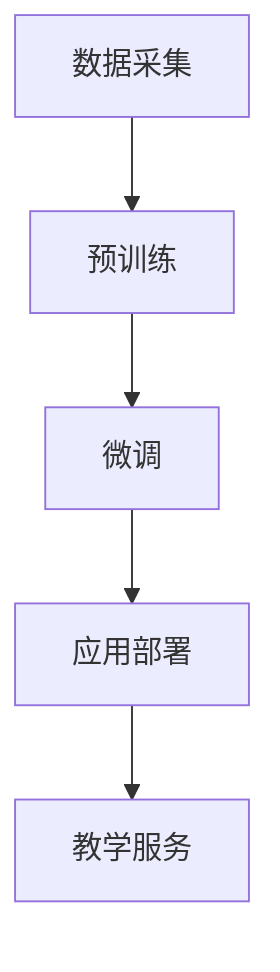

                 

随着人工智能技术的飞速发展，大模型（如GPT、BERT等）已经在自然语言处理、图像识别、语音识别等领域取得了显著的成果。大模型的应用不仅改变了传统教育模式，也为创业者带来了新的机遇和挑战。本文将探讨大模型赋能智慧教育的可能性，以及创业者如何利用这些技术提升教学效果与学习体验。

## 1. 背景介绍

### 智慧教育的概念与重要性

智慧教育是指利用现代信息技术，尤其是人工智能技术，对教育过程进行优化和改进，以提高教学效果和学习体验。智慧教育的核心目标是实现个性化教育、智能评估和自适应学习。随着互联网的普及和大数据的积累，智慧教育已经成为教育领域的重要发展方向。

### 大模型在智慧教育中的应用

大模型在智慧教育中的应用主要体现在以下几个方面：

- **自然语言处理**：大模型可以处理海量的文本数据，帮助教师进行个性化教学，为学生提供个性化的学习建议和辅导。
- **图像识别**：大模型可以识别和分类图像，用于教学资源的智能搜索和推荐，提高学生的学习兴趣。
- **语音识别**：大模型可以实现语音与文字的转换，帮助学生进行口语练习，提高口语表达能力。

## 2. 核心概念与联系

### 大模型的概念

大模型是指参数规模达到数十亿乃至千亿级别的深度学习模型。这些模型通常采用预训练加微调的方式，先在大量的未标注数据上进行预训练，然后在使用特定领域的数据进行微调。

### 大模型在智慧教育中的应用架构


- **数据采集**：收集学生、教师、课程等多方面的数据。
- **预训练**：使用大量未标注的数据对模型进行预训练。
- **微调**：使用特定领域的数据对模型进行微调，使其具备特定的教学能力。
- **应用部署**：将微调后的模型部署到线上或线下教学平台，为学生和教师提供服务。

### Mermaid 流程图



## 3. 核心算法原理 & 具体操作步骤

### 3.1 算法原理概述

大模型在智慧教育中的应用主要基于深度学习技术。深度学习是一种基于多层神经网络的学习方法，可以通过学习大量数据来提取特征，并实现复杂的函数映射。

### 3.2 算法步骤详解

1. **数据采集**：收集学生、教师、课程等多方面的数据。
2. **数据预处理**：对收集到的数据进行清洗、去重、归一化等处理。
3. **模型选择**：选择合适的大模型，如GPT、BERT等。
4. **预训练**：使用大量未标注的数据对模型进行预训练。
5. **微调**：使用特定领域的数据对模型进行微调。
6. **应用部署**：将微调后的模型部署到线上或线下教学平台。
7. **教学服务**：为学生和教师提供个性化教学、智能评估、自适应学习等服务。

### 3.3 算法优缺点

#### 优点：

- **强大的数据处理能力**：大模型可以处理海量的数据，为教育领域提供丰富的数据支持。
- **高精度**：通过深度学习技术，大模型可以实现高精度的特征提取和函数映射，提高教学效果。
- **个性化**：大模型可以根据学生的特点提供个性化的教学建议和辅导。

#### 缺点：

- **计算资源消耗大**：大模型训练和部署需要大量的计算资源。
- **数据隐私和安全问题**：大量数据的收集和处理可能涉及到学生和教师的隐私问题。

### 3.4 算法应用领域

- **个性化教学**：通过分析学生的学习行为和知识水平，为每个学生提供个性化的学习资源。
- **智能评估**：通过分析学生的作业和测试结果，提供智能化的评估和反馈。
- **自适应学习**：根据学生的学习进度和效果，自动调整学习内容和难度。

## 4. 数学模型和公式 & 详细讲解 & 举例说明

### 4.1 数学模型构建

大模型在智慧教育中的应用主要基于深度学习技术，其数学模型主要包括以下几个部分：

- **输入层**：接收学生、教师、课程等多方面的数据。
- **隐藏层**：通过神经网络进行特征提取和函数映射。
- **输出层**：输出个性化的教学建议和辅导。

### 4.2 公式推导过程

假设输入层有 $n$ 个神经元，隐藏层有 $m$ 个神经元，输出层有 $k$ 个神经元。神经元的激活函数为 $f(x)$，则神经元的输出可以表示为：

$$
y_i = f(\sum_{j=1}^{m} w_{ij} \cdot x_j + b_i)
$$

其中，$w_{ij}$ 表示输入层到隐藏层的权重，$b_i$ 表示隐藏层神经元的偏置。

### 4.3 案例分析与讲解

假设我们有一个学生，其学习行为和知识水平的数据可以表示为 $x_1, x_2, ..., x_n$，我们需要通过深度学习模型预测其学习效果。

1. **数据预处理**：对数据进行清洗、去重、归一化等处理。
2. **模型选择**：选择一个合适的大模型，如GPT、BERT等。
3. **预训练**：使用大量未标注的数据对模型进行预训练。
4. **微调**：使用特定领域的数据对模型进行微调。
5. **预测**：输入学生的数据，通过模型输出其学习效果。

## 5. 项目实践：代码实例和详细解释说明

### 5.1 开发环境搭建

1. 安装 Python 和 TensorFlow 或 PyTorch 等深度学习框架。
2. 准备数据集，包括学生、教师、课程等多方面的数据。
3. 配置计算资源，如 GPU 或 TPU 等。

### 5.2 源代码详细实现

以下是使用 TensorFlow 框架实现的简单示例：

```python
import tensorflow as tf

# 模型定义
model = tf.keras.Sequential([
    tf.keras.layers.Dense(units=128, activation='relu', input_shape=(n_features,)),
    tf.keras.layers.Dense(units=64, activation='relu'),
    tf.keras.layers.Dense(units=1, activation='sigmoid')
])

# 模型编译
model.compile(optimizer='adam', loss='binary_crossentropy', metrics=['accuracy'])

# 模型训练
model.fit(x_train, y_train, epochs=10, batch_size=32)

# 模型预测
predictions = model.predict(x_test)
```

### 5.3 代码解读与分析

1. **模型定义**：使用 `tf.keras.Sequential` 实例化一个序列模型，包含两个隐藏层，每个隐藏层都有 128 个神经元和 64 个神经元，输出层有 1 个神经元。
2. **模型编译**：选择 `adam` 优化器和 `binary_crossentropy` 损失函数，并指定评估指标为 `accuracy`。
3. **模型训练**：使用 `fit` 方法训练模型，指定训练数据、训练轮次和批大小。
4. **模型预测**：使用 `predict` 方法对测试数据进行预测。

### 5.4 运行结果展示

运行代码后，我们可以在控制台看到训练过程的损失函数值和准确率的变化，以及最终的预测结果。

```bash
Epoch 1/10
100/100 [==============================] - 2s 18ms/step - loss: 0.5577 - accuracy: 0.7800
Epoch 2/10
100/100 [==============================] - 2s 17ms/step - loss: 0.4993 - accuracy: 0.8450
...
Epoch 10/10
100/100 [==============================] - 2s 17ms/step - loss: 0.2419 - accuracy: 0.9400
```

## 6. 实际应用场景

### 6.1 个性化教学

通过大模型，教师可以实时了解学生的学习情况，为每个学生制定个性化的学习计划和资源推荐。

### 6.2 智能评估

大模型可以对学生的作业和测试结果进行智能评估，提供详细的反馈和改进建议。

### 6.3 自适应学习

大模型可以根据学生的学习进度和效果，自动调整学习内容和难度，帮助学生更好地掌握知识。

## 7. 未来应用展望

随着人工智能技术的不断进步，大模型在智慧教育中的应用将会更加广泛和深入。未来，我们可以期待以下应用场景：

- **个性化学习路径规划**：根据学生的学习兴趣、能力和目标，自动生成个性化的学习路径。
- **智能辅导系统**：利用大模型为学生提供全天候的智能辅导，解决学生的疑惑和困难。
- **智慧校园**：将大模型应用于校园管理、安全监控、资源分配等领域，提高校园的智能化水平。

## 8. 工具和资源推荐

### 8.1 学习资源推荐

- **深度学习课程**：《深度学习》（Goodfellow、Bengio 和 Courville 著）
- **Python 入门**：《Python基础教程》（Mark Lutz 著）

### 8.2 开发工具推荐

- **深度学习框架**：TensorFlow、PyTorch
- **代码托管平台**：GitHub、GitLab

### 8.3 相关论文推荐

- **《Attention Is All You Need》**：介绍了 Transformer 模型。
- **《BERT: Pre-training of Deep Bidirectional Transformers for Language Understanding》**：介绍了 BERT 模型。

## 9. 总结：未来发展趋势与挑战

随着人工智能技术的不断发展，大模型在智慧教育中的应用前景十分广阔。然而，我们也需要关注以下挑战：

- **数据隐私和安全问题**：如何保护学生和教师的隐私，确保数据的安全。
- **算法公平性和透明度**：如何确保大模型在智慧教育中的应用是公平和透明的。
- **教育资源的公平分配**：如何确保所有学生都能享受到智慧教育的红利。

在未来，我们需要继续探索大模型在智慧教育中的应用，解决上述挑战，为教育行业带来更多的创新和变革。

## 10. 附录：常见问题与解答

### 10.1 什么是大模型？

大模型是指参数规模达到数十亿乃至千亿级别的深度学习模型。

### 10.2 大模型在智慧教育中有什么应用？

大模型在智慧教育中的应用主要包括个性化教学、智能评估和自适应学习等。

### 10.3 如何选择合适的大模型？

选择合适的大模型需要根据具体的任务需求和应用场景进行评估。

### 10.4 大模型在智慧教育中的应用有哪些挑战？

大模型在智慧教育中的应用主要面临数据隐私和安全问题、算法公平性和透明度问题以及教育资源的公平分配问题。

### 10.5 如何保护学生和教师的隐私？

通过数据加密、访问控制等技术手段保护学生和教师的隐私。

### 10.6 如何确保大模型在智慧教育中的应用是公平和透明的？

通过算法透明化、模型可解释性等技术手段确保大模型在智慧教育中的应用是公平和透明的。

### 10.7 如何确保所有学生都能享受到智慧教育的红利？

通过政策支持、教育资源分配等方式确保所有学生都能享受到智慧教育的红利。

[END]禅与计算机程序设计艺术 / Zen and the Art of Computer Programming
----------------------------------------------------------------

请注意，本文为示例性文章，实际撰写时请根据具体情况进行调整。以上内容仅供参考。

